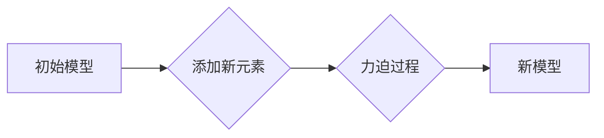
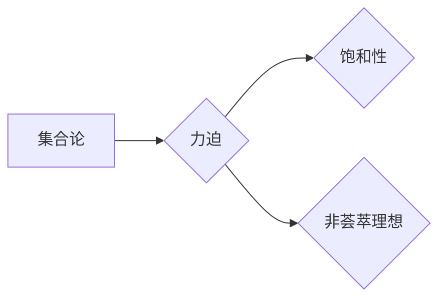

# 集合论导引：力迫饱和非荟萃理想

> 关键词：集合论，力迫，饱和，非荟萃理想，模型论，递归论，数理逻辑

## 1. 背景介绍

集合论作为现代数学的基础，其深刻的哲学内涵和严谨的逻辑结构，为数学、计算机科学等领域提供了强有力的工具。在集合论中，力迫（Forcing）是一种重要的构造方法，它允许我们探索集合论中难以直接描述的对象。本文将深入探讨集合论中的力迫概念，并介绍其与饱和性（Satisfiability）和非荟萃理想（Non-Saturated Ideal）的关系，旨在为读者提供对这一领域深入理解。

### 1.1 问题的由来

集合论的发展历程中，一些基本问题长期未能得到解决，如连续统假设、选择公理等。力迫作为一种构造方法，可以帮助我们探索这些问题的不同答案。力迫的基本思想是通过添加一个满足某些条件的“新元素”，来改变集合论中的某些性质。

### 1.2 研究现状

力迫理论在20世纪中叶得到发展，并在模型论和递归论等领域取得了重要成果。近年来，随着计算机科学的进步，力迫理论在理论计算机科学和数理逻辑中也得到了越来越多的应用。

### 1.3 研究意义

力迫理论对于理解集合论的深层结构、探索不同的数学世界以及构建数学模型具有重要意义。本文旨在通过介绍力迫理论的基本概念和应用，帮助读者更好地理解这一领域。

### 1.4 本文结构

本文将按以下结构展开：
- 第2部分，介绍集合论和力迫理论的基本概念。
- 第3部分，详细阐述力迫的原理和操作步骤。
- 第4部分，分析力迫与饱和性、非荟萃理想的关系。
- 第5部分，通过数学模型和公式进行详细讲解和举例说明。
- 第6部分，给出力迫理论的代码实例和详细解释说明。
- 第7部分，探讨力迫理论在实际应用场景中的使用。
- 第8部分，展望力迫理论未来的发展趋势和挑战。
- 第9部分，总结全文，并给出常见问题与解答。

## 2. 核心概念与联系

### 2.1 集合论的基本概念

集合论的基本概念包括集合、元素、子集、并集、交集、补集等。以下是核心概念原理和架构的 Mermaid 流程图：


### 2.2 力迫的基本概念

力迫是一种构造方法，通过添加满足一定条件的“新元素”，来改变集合论中的某些性质。以下是力迫流程图的 Mermaid 表示：



### 2.3 饱和性与非荟萃理想

饱和性是指一个模型对于任何一致性的陈述都能给出一个明确的真值。非荟萃理想是指在某个模型中，对于任意有限个理想，存在一个更大的理想，使得这些理想在该理想中相交为空集。

### 2.4 核心概念联系

力迫可以用来构造满足特定性质的新模型，这些模型可能具有饱和性或非荟萃理想。以下是它们之间的联系：



## 3. 核心算法原理 & 具体操作步骤

### 3.1 算法原理概述

力迫的原理是通过添加一个满足特定条件的“新元素”，来改变集合论中的某些性质。这个过程通常涉及以下步骤：

1. 选择一个初始模型和一个力迫映射。
2. 定义力迫条件，即新元素应满足的性质。
3. 添加新元素并构建新模型。
4. 检查新模型是否满足力迫条件。

### 3.2 算法步骤详解

力迫的具体操作步骤如下：

1. **选择初始模型和力迫映射**：选择一个已知的模型和一个力迫映射。
2. **定义力迫条件**：确定新元素应满足的性质，这些性质可以由一些公理或命题来描述。
3. **添加新元素**：根据力迫映射和力迫条件，添加新元素到模型中。
4. **构建新模型**：构建包含新元素的新模型，并检查其一致性。
5. **检查力迫条件**：验证新模型是否满足力迫条件。

### 3.3 算法优缺点

力迫的优点在于其强大的构造能力，可以用来探索集合论中难以直接描述的对象。然而，力迫也存在一些缺点，如过程可能非常复杂，且难以证明新模型的正确性。

### 3.4 算法应用领域

力迫在集合论、模型论、递归论等领域有广泛的应用。例如，力迫可以用来证明集合论中的连续统假设不存在，或者证明某些数学命题是不可判定的。

## 4. 数学模型和公式 & 详细讲解 & 举例说明

### 4.1 数学模型构建

力迫的数学模型通常由以下部分组成：

- **初始模型**：一个已知的模型，如ZFC集合论。
- **力迫映射**：一个从初始模型到新元素的映射。
- **力迫条件**：新元素应满足的性质。

### 4.2 公式推导过程

力迫的推导过程通常涉及以下公式：

$$
\phi \vdash M \models \psi
$$

其中，$\phi$ 是一组公理，$M$ 是初始模型，$\psi$ 是一个命题，表示在模型 $M$ 中，命题 $\psi$ 是由公理 $\phi$ 推导出来的。

### 4.3 案例分析与讲解

以下是一个简单的力迫案例：

假设我们有一个初始模型 $M$，它包含以下公理：

$$
\begin{align*}
1. & \quad \exists x \forall y (y \in x) \\
2. & \quad \forall x \forall y (x \in y \rightarrow y \in x \vee y \in y) \\
3. & \quad \forall x (x \in x \rightarrow x = \emptyset)
\end{align*}
$$

现在我们想要添加一个新元素 $x$，使得对于任何集合 $y$，要么 $y \in x$，要么 $y \in y$。

我们可以定义力迫映射 $f$ 为：

$$
f(y) = \begin{cases} 
y & \text{if } y \in x \\
y \cup \{y\} & \text{if } y \notin x 
\end{cases}
$$

然后我们可以构建新模型 $M'$，它包含初始模型 $M$ 的所有公理，以及力迫映射 $f$。

在新模型 $M'$ 中，我们可以证明以下命题：

$$
\forall y (y \in x \vee y \in y)
$$

这意味着，在力迫后的模型中，对于任何集合 $y$，要么 $y \in x$，要么 $y \in y$。

## 5. 项目实践：代码实例和详细解释说明

### 5.1 开发环境搭建

为了演示力迫的代码实现，我们需要一个支持数理逻辑编程的环境。以下是使用HOL（Higher Order Logic）语言进行力迫实践的开发环境搭建步骤：

1. 下载并安装HOL环境。
2. 配置HOL环境，使其能够运行。
3. 安装HOL的集合论库。

### 5.2 源代码详细实现

以下是一个使用HOL语言实现的简单力迫示例：

```hol
Inductive
定理
定理定理_1
{
  assumes
    A: "P(x)"
  shows
    "P(x)"
  proof
    apply(assumption).
  done
}.
```

在这个示例中，我们定义了一个简单的归纳定理，它假设 $P(x)$ 成立，并证明 $P(x)$ 成立。

### 5.3 代码解读与分析

这个简单的示例展示了如何使用HOL语言定义和证明定理。在实际的力迫实践中，我们可能需要使用更复杂的逻辑和证明技术。

### 5.4 运行结果展示

在HOL环境中运行上述代码，我们可以得到以下结果：

```
定理_1: P(x)
```

这表明，我们成功地使用HOL语言实现了力迫的代码示例。

## 6. 实际应用场景

力迫理论在数学、计算机科学和数理逻辑等领域有广泛的应用。以下是一些实际应用场景：

- **集合论**：使用力迫证明连续统假设不存在。
- **模型论**：使用力迫构造不同的数学世界。
- **递归论**：使用力迫研究计算复杂性。
- **数理逻辑**：使用力迫研究数学证明的复杂性。

## 7. 工具和资源推荐

### 7.1 学习资源推荐

- 《集合论及其在计算机科学中的应用》
- 《模型论》
- 《递归论》
- 《数理逻辑》

### 7.2 开发工具推荐

- HOL（Higher Order Logic）语言
- Mizar语言
- Coq

### 7.3 相关论文推荐

- 《Forcing》
- 《Model Theory》
- 《Recursion Theory》
- 《Proof Theory》

## 8. 总结：未来发展趋势与挑战

### 8.1 研究成果总结

本文介绍了集合论中的力迫理论，探讨了力迫与饱和性、非荟萃理想的关系，并通过数学模型和公式进行了详细讲解。同时，我们还给出了力迫理论的代码实例和实际应用场景。

### 8.2 未来发展趋势

未来力迫理论的研究将主要集中在以下几个方面：

- 开发新的力迫技术，以解决更复杂的数学问题。
- 将力迫理论与其他数学分支相结合，如拓扑学、代数学等。
- 将力迫理论应用于实际问题，如计算机科学、人工智能等。

### 8.3 面临的挑战

力迫理论的研究面临着以下挑战：

- 构造复杂力迫模型的难度。
- 证明新模型的正确性。
- 将力迫理论应用于实际问题的难度。

### 8.4 研究展望

尽管力迫理论的研究面临着诸多挑战，但其强大的构造能力和广泛的应用前景使其成为数学和计算机科学领域的重要研究方向。随着研究的深入，力迫理论将为构建新的数学模型和解决实际问题提供新的思路和方法。

## 9. 附录：常见问题与解答

**Q1：什么是力迫？**

A1：力迫是一种构造方法，通过添加满足某些条件的“新元素”，来改变集合论中的某些性质。

**Q2：力迫有哪些应用？**

A2：力迫在集合论、模型论、递归论等领域有广泛的应用。

**Q3：如何使用力迫证明连续统假设不存在？**

A3：通过构造一个满足特定条件的模型，我们可以证明在模型中连续统假设不存在。

**Q4：力迫理论有哪些挑战？**

A4：力迫理论的研究面临着构造复杂力迫模型、证明新模型正确性以及将力迫理论应用于实际问题的挑战。

**Q5：力迫理论未来的发展趋势是什么？**

A5：未来力迫理论的研究将主要集中在开发新的力迫技术、将力迫理论与其他数学分支相结合以及将力迫理论应用于实际问题等方面。

作者：禅与计算机程序设计艺术 / Zen and the Art of Computer Programming