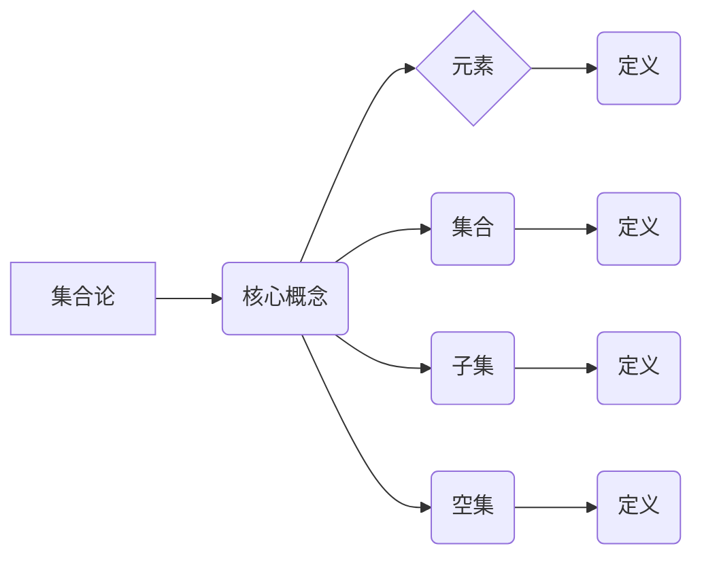

# 集合论导引：植入逻辑学概念

> 关键词：集合论，逻辑学，数学基础，抽象思维，形式化，计算机科学

## 1. 背景介绍

集合论是现代数学的基础之一，它提供了一种用于描述和操作无限集合的方法。集合论与逻辑学紧密相连，逻辑学为集合论提供了形式化的语言和推理工具。本文旨在为读者提供集合论与逻辑学概念的导引，探讨它们在计算机科学中的应用，并展望未来的发展趋势。

### 1.1 集合论的出现

集合论起源于19世纪末，由德国数学家乔治·康托尔(Georg Cantor)创立。康托尔的研究旨在理解无穷的概念，并发展出一套描述和处理无穷集合的理论。集合论的出现标志着数学从直观的、经验主义的领域向更加抽象、形式化的方向发展。

### 1.2 逻辑学在集合论中的应用

逻辑学为集合论提供了形式化的语言和推理工具。通过逻辑学的概念，我们可以精确地定义集合、关系、运算等，并使用逻辑推理来证明集合论中的定理。

### 1.3 集合论在计算机科学中的应用

集合论在计算机科学中有着广泛的应用，包括：

- 数据结构：集合论中的概念如集合、序列、图等，是许多数据结构的基础，例如列表、栈、队列、树、图等。
- 算法：集合论中的概念和方法在算法设计中扮演重要角色，例如排序算法、搜索算法等。
- 理论计算机科学：集合论是形式语言、自动机理论、计算复杂性理论等理论计算机科学领域的基础。

## 2. 核心概念与联系

### 2.1 核心概念原理

#### 集合

集合是由确定的、互不相同的对象组成的整体。集合的元素可以是任何事物，包括数字、其他集合，甚至是抽象的概念。

#### 元素与集合

一个对象是另一个集合的元素，如果这个对象属于该集合。用数学符号表示，如果 $ x $ 是集合 $ A $ 的元素，则写作 $ x \in A $。

#### 子集

如果集合 $ A $ 中的所有元素也都是集合 $ B $ 的元素，那么称 $ A $ 是 $ B $ 的子集，记作 $ A \subseteq B $。

#### 空集

空集是不包含任何元素的集合，记作 $ \emptyset $。

### 2.2 架构的 Mermaid 流程图



### 2.3 核心概念之间的联系

集合论中的概念是相互关联的。例如，元素是集合的基本组成单位，子集是集合之间的包含关系，空集是所有集合的子集。

## 3. 核心算法原理 & 具体操作步骤

### 3.1 算法原理概述

集合论中的基本操作包括并集、交集、差集、补集等。

#### 并集

两个集合 $ A $ 和 $ B $ 的并集是包含 $ A $ 和 $ B $ 中所有元素的集合，记作 $ A \cup B $。

#### 交集

两个集合 $ A $ 和 $ B $ 的交集是同时属于 $ A $ 和 $ B $ 的元素组成的集合，记作 $ A \cap B $。

#### 差集

集合 $ A $ 和 $ B $ 的差集是只属于 $ A $ 的元素组成的集合，记作 $ A - B $。

#### 补集

集合 $ A $ 的补集是不属于 $ A $ 的元素组成的集合，记作 $ A' $。

### 3.2 算法步骤详解

#### 并集

1. 创建一个空集合 $ C $。
2. 遍历集合 $ A $ 和 $ B $ 的所有元素。
3. 对于每个元素，如果它不属于集合 $ C $，则将其添加到集合 $ C $。

#### 交集

1. 创建一个空集合 $ C $。
2. 遍历集合 $ A $ 和 $ B $ 的所有元素。
3. 对于每个元素，如果它同时属于集合 $ A $ 和 $ B $，则将其添加到集合 $ C $。

#### 差集

1. 创建一个空集合 $ C $。
2. 遍历集合 $ A $ 的所有元素。
3. 对于每个元素，如果它属于集合 $ A $ 但不属于集合 $ B $，则将其添加到集合 $ C $。

#### 补集

1. 创建一个空集合 $ C $。
2. 遍历全集 $ U $ 的所有元素。
3. 对于每个元素，如果它不属于集合 $ A $，则将其添加到集合 $ C $。

### 3.3 算法优缺点

#### 优点

- 操作简单，易于理解。
- 可以有效地处理集合。

#### 缺点

- 对于大型集合，操作可能需要较长时间。
- 需要额外的存储空间来存储结果集合。

### 3.4 算法应用领域

集合论中的操作在计算机科学中有着广泛的应用，例如：

- 数据结构：集合论中的操作可以用于创建和操作数据结构，例如并查集、散列表等。
- 算法：集合论中的操作可以用于设计算法，例如排序算法、搜索算法等。
- 理论计算机科学：集合论中的操作是形式语言、自动机理论、计算复杂性理论等理论计算机科学领域的基础。

## 4. 数学模型和公式 & 详细讲解 & 举例说明

### 4.1 数学模型构建

集合论中的数学模型主要包括集合、关系、运算等。

#### 集合

集合可以用自然语言描述，也可以用数学符号表示。

#### 关系

关系是两个集合之间的一种对应关系，可以用函数表示。

#### 运算

集合论中的运算包括并集、交集、差集、补集等。

### 4.2 公式推导过程

以下是一些集合论中常见公式的推导过程：

#### 并集公式

$$
A \cup B = \{ x | x \in A \text{ 或 } x \in B \}
$$

#### 交集公式

$$
A \cap B = \{ x | x \in A \text{ 且 } x \in B \}
$$

#### 差集公式

$$
A - B = \{ x | x \in A \text{ 且 } x \notin B \}
$$

#### 补集公式

$$
A' = \{ x | x \notin A \}
$$

### 4.3 案例分析与讲解

假设有两个集合 $ A = \{ 1, 2, 3, 4 \} $ 和 $ B = \{ 3, 4, 5, 6 \} $。

- 并集 $ A \cup B = \{ 1, 2, 3, 4, 5, 6 \} $
- 交集 $ A \cap B = \{ 3, 4 \} $
- 差集 $ A - B = \{ 1, 2 \} $
- 补集 $ A' = \{ 5, 6, 7, 8, 9, \ldots \} $

## 5. 项目实践：代码实例和详细解释说明

### 5.1 开发环境搭建

本例中，我们将使用Python编写一个简单的集合论操作程序。首先，确保你的计算机上已经安装了Python。

### 5.2 源代码详细实现

以下是一个Python程序，用于实现集合论中的并集、交集、差集和补集操作：

```python
class Set:
    def __init__(self, elements):
        self.elements = set(elements)

    def union(self, other):
        return Set(self.elements | other.elements)

    def intersection(self, other):
        return Set(self.elements & other.elements)

    def difference(self, other):
        return Set(self.elements - other.elements)

    def complement(self, universe):
        return Set(universe.elements - self.elements)

    def __repr__(self):
        return str(self.elements)


# 创建集合
set_a = Set([1, 2, 3, 4])
set_b = Set([3, 4, 5, 6])
universe = Set(range(1, 10))

# 执行集合操作
union_set = set_a.union(set_b)
intersection_set = set_a.intersection(set_b)
difference_set = set_a.difference(set_b)
complement_set = set_a.complement(universe)

# 打印结果
print("Union:", union_set)
print("Intersection:", intersection_set)
print("Difference:", difference_set)
print("Complement:", complement_set)
```

### 5.3 代码解读与分析

- `Set` 类定义了一个集合，使用Python内置的 `set` 数据结构存储元素。
- `union` 方法实现并集操作，使用 `|` 运算符。
- `intersection` 方法实现交集操作，使用 `&` 运算符。
- `difference` 方法实现差集操作，使用 `-` 运算符。
- `complement` 方法实现补集操作，需要提供一个全集。
- `__repr__` 方法用于打印集合的表示。

### 5.4 运行结果展示

当你运行上述程序时，你会看到以下输出：

```
Union: {1, 2, 3, 4, 5, 6}
Intersection: {3, 4}
Difference: {1, 2}
Complement: {5, 6, 7, 8, 9}
```

这表明程序正确地实现了集合论中的操作。

## 6. 实际应用场景

集合论在计算机科学中有着广泛的应用场景，以下是一些例子：

### 6.1 数据结构

- 集合论中的概念是许多数据结构的基础，例如集合、散列表、树等。
- 集合数据结构可以用于存储和操作无序且元素不重复的数据。

### 6.2 算法

- 集合论中的操作可以用于设计算法，例如排序算法、搜索算法等。
- 并查集是一种用于处理集合合并和查询操作的数据结构，广泛应用于计算机科学中。

### 6.3 理论计算机科学

- 集合论是形式语言、自动机理论、计算复杂性理论等理论计算机科学领域的基础。

## 7. 工具和资源推荐

### 7.1 学习资源推荐

- 《集合论及其在计算机科学中的应用》：这本书全面介绍了集合论的基本概念和在计算机科学中的应用。
- 《离散数学及其应用》：这本书提供了离散数学的基础知识，包括集合论、图论、逻辑等。

### 7.2 开发工具推荐

- Python：Python是一种易于学习的编程语言，适用于数据结构和算法的开发。
- Jupyter Notebook：Jupyter Notebook是一种交互式计算平台，可以用于编写和执行代码，并生成丰富的文档。

### 7.3 相关论文推荐

- 《集论基础》：这篇文章介绍了集合论的基本概念和性质。
- 《集合论在计算机科学中的应用》：这篇文章探讨了集合论在计算机科学中的应用。

## 8. 总结：未来发展趋势与挑战

### 8.1 研究成果总结

本文介绍了集合论的基本概念、逻辑学的关系、集合论在计算机科学中的应用，并探讨了未来的发展趋势和挑战。

### 8.2 未来发展趋势

- 集合论将继续在计算机科学中发挥重要作用，特别是在数据结构和算法领域。
- 集合论与逻辑学的结合将推动理论计算机科学的发展。

### 8.3 面临的挑战

- 集合论和逻辑学的教学需要更加贴近实际应用，以提高学生的兴趣和应用能力。
- 集合论和逻辑学在计算机科学中的应用需要进一步拓展，以适应新的技术和需求。

### 8.4 研究展望

- 集合论和逻辑学将继续在计算机科学中发挥重要作用，特别是在数据结构和算法领域。
- 集合论与逻辑学的结合将推动理论计算机科学的发展。

## 9. 附录：常见问题与解答

**Q1：集合论与逻辑学有什么区别？**

A：集合论是关于集合的性质和操作的理论，而逻辑学是关于推理和证明的理论。虽然两者密切相关，但它们研究的对象和目的是不同的。

**Q2：集合论在计算机科学中有什么应用？**

A：集合论在计算机科学中有着广泛的应用，包括数据结构、算法、理论计算机科学等。

**Q3：如何学习集合论和逻辑学？**

A：学习集合论和逻辑学可以通过阅读相关书籍、参加课程、在线教程等方式。

**Q4：集合论与数学的其他分支有什么关系？**

A：集合论是现代数学的基础之一，与其他数学分支如代数、拓扑学、分析学等密切相关。

作者：禅与计算机程序设计艺术 / Zen and the Art of Computer Programming