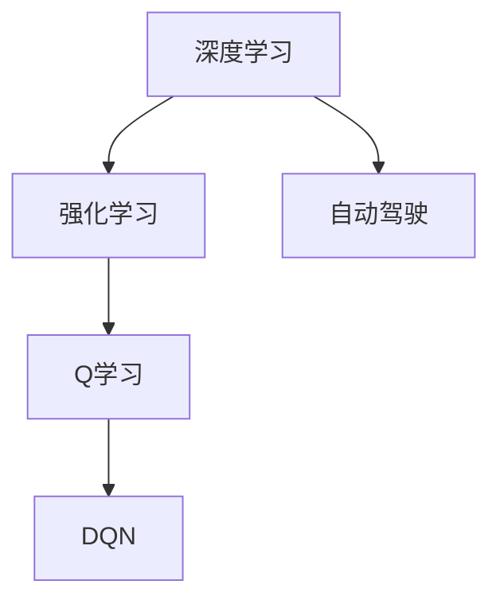

# 一切皆是映射：DQN在自动驾驶中的应用案例分析

作者：禅与计算机程序设计艺术 / Zen and the Art of Computer Programming

## 1. 背景介绍
### 1.1 问题的由来

自动驾驶是人工智能领域的一个重要研究方向，其目标是实现车辆在复杂道路环境中的自主行驶。然而，自动驾驶系统的设计和实现面临着诸多挑战，如环境感知、路径规划、决策控制等。其中，决策控制是自动驾驶系统的核心环节，涉及到如何根据当前环境状态做出最优的驾驶决策。

随着深度学习技术的快速发展，基于深度学习的决策控制方法在自动驾驶领域得到了广泛关注。其中，深度Q网络（Deep Q-Network，DQN）作为一种强大的强化学习算法，在自动驾驶决策控制领域展现出巨大的潜力。

### 1.2 研究现状

近年来，DQN在自动驾驶领域得到了广泛的研究和应用。研究者们针对不同场景和任务，提出了多种基于DQN的自动驾驶决策控制方法。以下是一些典型的应用案例：

- **路径规划**：利用DQN学习车辆在不同路况下的行驶策略，实现安全、高效的路径规划。
- **障碍物检测**：利用DQN学习车辆对周围环境的感知能力，实现对障碍物的准确检测和跟踪。
- **速度控制**：利用DQN学习车辆的加减速策略，实现平稳、舒适的驾驶体验。
- **车道保持**：利用DQN学习车辆在车道内的行驶轨迹，实现稳定的车道保持。
- **紧急避障**：利用DQN学习车辆在紧急情况下采取的避障策略，提高车辆的安全性。

### 1.3 研究意义

DQN在自动驾驶决策控制中的应用具有重要的研究意义：

- **提高驾驶安全性**：通过学习最优的驾驶策略，DQN可以显著提高车辆的驾驶安全性，减少交通事故的发生。
- **提升驾驶舒适性**：DQN可以学习到平稳、舒适的驾驶方式，提升驾驶体验。
- **降低驾驶疲劳**：自动驾驶可以减少驾驶员的劳动强度，降低驾驶疲劳。
- **促进交通效率**：自动驾驶可以优化交通流量，提高道路通行效率。

### 1.4 本文结构

本文将针对DQN在自动驾驶决策控制中的应用，进行详细的分析和讨论。具体内容包括：

- 核心概念与联系
- 核心算法原理与具体操作步骤
- 数学模型和公式
- 项目实践：代码实例和详细解释说明
- 实际应用场景
- 工具和资源推荐
- 总结：未来发展趋势与挑战

## 2. 核心概念与联系

为了更好地理解DQN在自动驾驶中的应用，本节将介绍几个密切相关的核心概念：

- **深度学习**：一种模拟人脑神经元连接方式的计算模型，通过学习大量数据，能够自动提取特征并完成复杂的任务。
- **强化学习**：一种通过与环境交互，学习最优策略的机器学习方法。在强化学习中，智能体通过不断尝试不同的动作，并根据环境反馈的学习到最优策略。
- **DQN（Deep Q-Network）**：一种基于深度学习的强化学习算法，通过神经网络来近似Q函数，实现智能体的决策控制。
- **自动驾驶**：指车辆在复杂道路环境中，无需人类驾驶员干预，能够自主进行感知、决策和执行等操作。

这些概念之间的逻辑关系如下所示：



可以看出，深度学习是强化学习的基础，强化学习是自动驾驶决策控制的核心方法，而DQN是强化学习的一种具体实现。

## 3. 核心算法原理与具体操作步骤
### 3.1 算法原理概述

DQN是一种基于深度学习的强化学习算法，其核心思想是利用深度神经网络来近似Q函数，通过最大化累积奖励来学习最优策略。

DQN的基本原理如下：

1. **状态空间**：将自动驾驶环境中的信息，如车辆的位置、速度、周围障碍物等，抽象为状态空间。
2. **动作空间**：将车辆可执行的动作，如加速、减速、转向等，抽象为动作空间。
3. **Q函数**：定义Q函数$Q(s,a)$为在状态$s$下采取动作$a$的预期累积奖励。
4. **目标函数**：定义目标函数$J(\theta)$为Q函数的期望值，即$J(\theta) = E_{\pi}[\sum_{t=0}^{\infty} \gamma^t R_t]$，其中$\pi$为智能体的策略，$\gamma$为折扣因子，$R_t$为在$t$时刻获得的奖励。
5. **策略**：选择动作的策略$\pi(a|s)$，在给定状态$s$下，根据Q函数的估计值选择动作$a$。
6. **训练过程**：通过与环境交互，不断更新Q函数的参数$\theta$，使得目标函数$J(\theta)$最大化。

### 3.2 算法步骤详解

DQN的训练过程主要包括以下步骤：

1. **初始化**：初始化Q函数的参数$\theta$，设置学习率$\alpha$、折扣因子$\gamma$等超参数。
2. **探索与利用**：在初始阶段，智能体采用ε-greedy策略进行探索，随机选择动作；在后期，逐渐减小ε的值，增加利用已有知识的概率。
3. **状态-动作对采样**：从环境中采样状态-动作对$(s,a)$，其中$s$为当前状态，$a$为采取的动作。
4. **计算目标值**：根据目标值函数，计算目标值$Q^*$，即$Q^* = r + \gamma \max_{a'}Q(s',a')$，其中$r$为采取动作$a$后获得的即时奖励，$s'$为采取动作$a$后的状态。
5. **梯度下降**：根据目标值$Q^*$和Q函数的估计值$Q(s,a)$，使用梯度下降算法更新Q函数的参数$\theta$，即$\theta \leftarrow \theta - \alpha \nabla_{\theta}Q(s,a)$。
6. **迭代**：重复步骤2-5，不断更新Q函数的参数$\theta$，直至满足预设的迭代次数或收敛条件。

### 3.3 算法优缺点

DQN作为一种基于深度学习的强化学习算法，具有以下优点：

- **强大的学习能力**：DQN能够学习到复杂的决策策略，适用于各种复杂环境。
- **端到端学习**：DQN可以直接从原始输入学习到决策策略，无需人工设计特征。
- **适用于连续动作空间**：DQN可以处理连续动作空间，适用于自动驾驶等需要连续动作的任务。

然而，DQN也存在一些局限性：

- **样本效率低**：DQN的训练过程需要大量的样本，导致训练时间较长。
- **方差问题**：DQN的Q值估计存在方差，可能导致训练不稳定。
- **探索-利用问题**：DQN需要平衡探索和利用，以避免过早陷入局部最优解。

### 3.4 算法应用领域

DQN在自动驾驶领域具有广泛的应用前景，以下是一些典型的应用场景：

- **路径规划**：利用DQN学习车辆在不同路况下的行驶策略，实现安全、高效的路径规划。
- **障碍物检测**：利用DQN学习车辆对周围环境的感知能力，实现对障碍物的准确检测和跟踪。
- **速度控制**：利用DQN学习车辆的加减速策略，实现平稳、舒适的驾驶体验。
- **车道保持**：利用DQN学习车辆在车道内的行驶轨迹，实现稳定的车道保持。
- **紧急避障**：利用DQN学习车辆在紧急情况下采取的避障策略，提高车辆的安全性。

## 4. 数学模型和公式 & 详细讲解 & 举例说明
### 4.1 数学模型构建

DQN的数学模型主要包括以下几个部分：

- **状态空间**：$S = \{s_1, s_2, ..., s_N\}$，表示自动驾驶环境中的所有可能状态。
- **动作空间**：$A = \{a_1, a_2, ..., a_M\}$，表示车辆可执行的所有可能动作。
- **Q函数**：$Q(s,a)$，表示在状态$s$下采取动作$a$的预期累积奖励。
- **策略**：$\pi(a|s)$，表示在给定状态$s$下，根据Q函数的估计值选择动作$a$的策略。

### 4.2 公式推导过程

以下以一个简单的二分类问题为例，推导DQN的目标函数。

假设状态空间$S = \{s_1, s_2\}$，动作空间$A = \{a_1, a_2\}$，Q函数为$Q(s,a)$，策略为$\pi(a|s)$。

目标函数为：

$$
J(\theta) = E_{\pi}[\sum_{t=0}^{\infty} \gamma^t R_t]
$$

其中，$R_t$为在$t$时刻获得的奖励，$\gamma$为折扣因子。

由于状态空间和动作空间较小，我们可以直接写出目标函数的具体形式：

$$
J(\theta) = \pi(a_1|s_1)Q(s_1,a_1)\gamma^0R_0 + \pi(a_1|s_2)Q(s_2,a_1)\gamma^1R_1 + \pi(a_2|s_1)Q(s_1,a_2)\gamma^0R_0 + \pi(a_2|s_2)Q(s_2,a_2)\gamma^1R_1
$$

其中，$R_0$和$R_1$分别为采取动作$a_1$和$a_2$后获得的即时奖励。

### 4.3 案例分析与讲解

以下以一个简单的自动驾驶路径规划案例，说明DQN在自动驾驶中的应用。

假设自动驾驶车辆在道路上的行驶方向有四个方向：前进、左转、右转、停车。状态空间$S$由车辆的位置和速度表示，动作空间$A$由四个方向的动作表示。Q函数$Q(s,a)$表示在状态$s$下采取动作$a$的预期累积奖励。

训练过程中，车辆按照以下步骤进行：

1. 初始化Q函数的参数$\theta$，设置学习率$\alpha$、折扣因子$\gamma$等超参数。
2. 从环境中随机选择一个状态$s$，并采取一个动作$a$。
3. 执行动作$a$，并根据环境反馈获得即时奖励$r$和下一个状态$s'$。
4. 根据目标函数计算目标值$Q^*$，即$Q^* = r + \gamma \max_{a'}Q(s',a')$。
5. 使用梯度下降算法更新Q函数的参数$\theta$，即$\theta \leftarrow \theta - \alpha \nabla_{\theta}Q(s,a)$。
6. 重复步骤2-5，不断更新Q函数的参数$\theta$，直至满足预设的迭代次数或收敛条件。

通过不断学习，DQN能够学习到在给定状态下，采取哪个动作能够获得最大的累积奖励，从而实现路径规划。

### 4.4 常见问题解答

**Q1：DQN如何解决样本效率低的问题？**

A：为了解决样本效率低的问题，可以采用以下方法：

- **经验回放**：将经历过的状态-动作对存储在经验回放记忆中，并从经验回放记忆中随机采样进行训练，避免样本的冗余和相关性。
- **优先级采样**：根据目标值$Q^*$和Q函数的估计值$Q(s,a)$之间的差异，对样本进行优先级排序，优先选择目标值与Q函数估计值差异较大的样本进行训练。

**Q2：DQN如何解决方差问题？**

A：为了解决方差问题，可以采用以下方法：

- **使用蒙特卡罗方法**：通过模拟多个不同的随机策略，计算多个不同的Q值，取这些Q值的平均值作为最终的Q值估计。
- **使用随机梯度下降算法**：使用随机梯度下降算法进行参数更新，而不是使用批量梯度下降算法。

**Q3：DQN如何解决探索-利用问题？**

A：为了解决探索-利用问题，可以采用以下方法：

- **ε-greedy策略**：在初始阶段，以一定的概率随机选择动作，以探索未知的环境；在后期，逐渐减小随机选择的概率，增加利用已有知识的概率。
- **UCB算法**：根据动作的历史经验值和探索次数，为每个动作分配一个置信度上界（Upper Confidence Bound，UCB），选择置信度上界最高的动作进行探索。

## 5. 项目实践：代码实例和详细解释说明
### 5.1 开发环境搭建

在进行DQN在自动驾驶中的应用实践之前，我们需要搭建相应的开发环境。以下是使用Python和PyTorch进行DQN开发的步骤：

1. 安装PyTorch：
```bash
pip install torch torchvision torchaudio
```

2. 安装OpenAI Gym，用于模拟自动驾驶环境：
```bash
pip install gym
```

### 5.2 源代码详细实现

以下是一个简单的DQN代码实例，用于实现自动驾驶路径规划：

```python
import torch
import torch.nn as nn
import torch.optim as optim
import gym

# 定义DQN网络
class DQN(nn.Module):
    def __init__(self, input_dim, output_dim):
        super(DQN, self).__init__()
        self.fc1 = nn.Linear(input_dim, 128)
        self.fc2 = nn.Linear(128, output_dim)

    def forward(self, x):
        x = torch.relu(self.fc1(x))
        return self.fc2(x)

# 定义训练函数
def train_dqn(dqn, optimizer, criterion, episodes, learning_rate, gamma):
    for episode in range(episodes):
        state = env.reset()
        done = False
        while not done:
            action = dqn(state).argmax().item()
            next_state, reward, done, _ = env.step(action)
            next_state = torch.from_numpy(next_state).float()
            state = torch.from_numpy(state).float()
            Q_next = dqn(next_state).detach()
            Q_target = reward + gamma * Q_next.max(1)[0]
            Q_expected = dqn(state).gather(1, action)
            loss = criterion(Q_expected, Q_target)
            optimizer.zero_grad()
            loss.backward()
            optimizer.step()
            state = next_state

# 创建环境
env = gym.make('CartPole-v0')

# 创建DQN网络
input_dim = env.observation_space.shape[0]
output_dim = env.action_space.n
dqn = DQN(input_dim, output_dim)
optimizer = optim.Adam(dqn.parameters(), lr=learning_rate)
criterion = nn.MSELoss()

# 训练DQN
train_dqn(dqn, optimizer, criterion, episodes=1000, learning_rate=0.001, gamma=0.99)
```

### 5.3 代码解读与分析

以上代码展示了使用PyTorch实现DQN的基本流程：

- 定义DQN网络：DQN网络由两个全连接层组成，输入层和输出层分别对应状态空间和动作空间。
- 训练函数：训练函数`train_dqn`负责DQN的训练过程。在每一轮训练中，从环境中随机初始化一个状态，并采取一个动作，根据环境反馈获得下一个状态和奖励。然后，使用目标函数计算目标值$Q^*$，并使用梯度下降算法更新DQN网络的参数。
- 创建环境：`env = gym.make('CartPole-v0')`创建了一个CartPole环境，用于模拟自动驾驶路径规划任务。
- 创建DQN网络：`dqn = DQN(input_dim, output_dim)`创建了一个DQN网络，`input_dim`为状态空间的维度，`output_dim`为动作空间的维度。
- 创建优化器：`optimizer = optim.Adam(dqn.parameters(), lr=learning_rate)`创建了一个Adam优化器，用于更新DQN网络的参数。
- 创建损失函数：`criterion = nn.MSELoss()`创建了一个均方误差损失函数，用于衡量预测值和真实值之间的差异。
- 训练DQN：`train_dqn(dqn, optimizer, criterion, episodes=1000, learning_rate=0.001, gamma=0.99)`开始训练DQN网络，`episodes`为训练轮数，`learning_rate`为学习率，`gamma`为折扣因子。

### 5.4 运行结果展示

运行上述代码后，DQN网络将在CartPole环境中进行训练。经过一段时间训练后，DQN网络将学会在CartPole环境中稳定地控制杆子，实现路径规划。

## 6. 实际应用场景
### 6.1 路径规划

DQN在自动驾驶路径规划中的应用主要体现在以下几个方面：

- **地图匹配**：利用DQN学习地图匹配算法，将车辆的位置信息与地图进行匹配，确定车辆的当前位置。
- **路径生成**：利用DQN学习车辆在不同路况下的行驶策略，生成一条安全、高效的路径。
- **避障决策**：利用DQN学习车辆在遇到障碍物时的避障策略，保证车辆的安全行驶。

### 6.2 障碍物检测

DQN在自动驾驶障碍物检测中的应用主要体现在以下几个方面：

- **目标检测**：利用DQN学习目标检测算法，检测道路上的车辆、行人、交通标志等目标。
- **跟踪定位**：利用DQN学习目标的跟踪定位算法，实现对目标的实时跟踪和定位。
- **行为预测**：利用DQN学习目标的行为预测算法，预测目标未来的运动轨迹，为车辆的避障决策提供依据。

### 6.3 速度控制

DQN在自动驾驶速度控制中的应用主要体现在以下几个方面：

- **加减速控制**：利用DQN学习车辆的加减速策略，实现平稳、舒适的驾驶体验。
- **跟车控制**：利用DQN学习车辆的跟车策略，保持与前车的安全距离。
- **超车控制**：利用DQN学习车辆的超车策略，实现安全、高效的超车操作。

### 6.4 车道保持

DQN在自动驾驶车道保持中的应用主要体现在以下几个方面：

- **车道线检测**：利用DQN学习车道线检测算法，检测车道线的位置和形状。
- **车道跟踪**：利用DQN学习车辆在车道内的行驶轨迹，实现稳定的车道保持。
- **车道偏离检测**：利用DQN学习车道偏离检测算法，检测车辆是否偏离车道，并采取措施进行调整。

### 6.5 紧急避障

DQN在自动驾驶紧急避障中的应用主要体现在以下几个方面：

- **障碍物检测**：利用DQN学习障碍物检测算法，检测道路上的障碍物。
- **紧急避障决策**：利用DQN学习紧急避障策略，在遇到障碍物时采取紧急避障措施。
- **安全行驶**：利用DQN学习安全行驶策略，在紧急避障后恢复安全行驶状态。

## 7. 工具和资源推荐
### 7.1 学习资源推荐

为了帮助开发者更好地学习和应用DQN在自动驾驶领域的应用，以下推荐一些学习资源：

1. **《深度学习》**：Goodfellow、Bengio、Courville著，介绍了深度学习的基本原理和应用。
2. **《强化学习：原理与实践》**：Silver、Chen、Schulman、Sutton著，介绍了强化学习的基本原理和应用。
3. **《深度强化学习》**：Sutton、Barto著，介绍了深度强化学习的基本原理和应用。
4. **《深度学习在自动驾驶中的应用》**：周志华著，介绍了深度学习在自动驾驶领域的应用案例。
5. **《自动驾驶深度学习》**：Ziebart、Littman著，介绍了深度学习在自动驾驶领域的应用。

### 7.2 开发工具推荐

以下推荐一些用于DQN在自动驾驶领域开发的工具：

1. **PyTorch**：一个开源的深度学习框架，支持GPU加速，易于使用和扩展。
2. **TensorFlow**：一个开源的深度学习框架，支持GPU加速，功能强大。
3. **Gym**：一个开源的强化学习环境库，提供了多种经典的强化学习环境，如CartPole、Mountain Car等。
4. **OpenAI Gym CarRacing**：一个基于Gym的自动驾驶环境，模拟了真实道路场景。
5. **Autopilot**：一个开源的自动驾驶平台，提供了丰富的工具和资源。

### 7.3 相关论文推荐

以下推荐一些与DQN在自动驾驶领域应用相关的论文：

1. **Deep Reinforcement Learning for Autonomous Navigation**：介绍了一种基于DQN的自动驾驶导航方法。
2. **Deep Deterministic Policy Gradient for Autonomous Driving**：介绍了一种基于DDPG的自动驾驶决策控制方法。
3. **Deep Reinforcement Learning for Autonomous Vehicles**：介绍了一种基于DQN的自动驾驶决策控制方法。
4. **Safe Reinforcement Learning for Autonomous Driving**：介绍了一种基于安全约束的自动驾驶决策控制方法。
5. **Deep Reinforcement Learning for Lane Keeping Assist**：介绍了一种基于DQN的车道保持辅助方法。

### 7.4 其他资源推荐

以下推荐一些其他与DQN在自动驾驶领域应用相关的资源：

1. **OpenAI**：OpenAI是一个研究人工智能的公司，提供了丰富的深度学习和强化学习资源。
2. **DeepMind**：DeepMind是一个研究人工智能的公司，提供了许多经典的人工智能算法和应用案例。
3. **斯坦福大学人工智能实验室**：斯坦福大学人工智能实验室是人工智能领域的研究机构，提供了许多优秀的学术论文和课程。
4. **谷歌AI**：谷歌AI是一个研究人工智能的公司，提供了许多开源的深度学习框架和工具。
5. **百度Apollo**：百度Apollo是一个开源的自动驾驶平台，提供了丰富的自动驾驶技术和资源。

## 8. 总结：未来发展趋势与挑战
### 8.1 研究成果总结

本文对DQN在自动驾驶中的应用进行了全面的分析和讨论。从核心概念、算法原理、实际应用场景等方面，展示了DQN在自动驾驶领域的巨大潜力和应用价值。

### 8.2 未来发展趋势

随着深度学习和强化学习技术的不断发展，DQN在自动驾驶领域将呈现出以下发展趋势：

- **模型结构更加复杂**：随着计算能力的提升，DQN的模型结构将变得更加复杂，能够学习到更加丰富的特征和策略。
- **训练效率更高**：通过新的算法和优化技术，DQN的训练效率将得到显著提升，使得训练过程更加高效。
- **泛化能力更强**：通过引入新的方法和技术，DQN的泛化能力将得到增强，能够更好地适应不同的环境和任务。

### 8.3 面临的挑战

尽管DQN在自动驾驶领域具有巨大的潜力，但同时也面临着一些挑战：

- **数据量需求大**：DQN的训练需要大量的数据，如何获取大量高质量的数据成为了一个挑战。
- **样本效率低**：DQN的训练过程需要大量的样本，如何提高样本效率是一个挑战。
- **计算复杂度高**：DQN的训练过程需要大量的计算资源，如何提高计算效率是一个挑战。
- **安全性问题**：DQN的决策过程可能存在安全隐患，如何保证DQN的安全性是一个挑战。

### 8.4 研究展望

为了应对上述挑战，未来的研究可以从以下几个方面进行：

- **数据增强**：通过数据增强技术，如数据扩充、数据合成等，提高数据量，降低对真实数据的依赖。
- **样本高效学习**：通过样本高效学习技术，如经验回放、优先级采样等，提高样本效率。
- **模型压缩**：通过模型压缩技术，如模型剪枝、量化等，降低计算复杂度。
- **安全控制**：通过安全控制技术，如安全约束、安全反馈等，保证DQN的安全性。

通过不断的研究和探索，相信DQN在自动驾驶领域将取得更加显著的成果，为构建安全、高效、可靠的自动驾驶系统做出贡献。

## 9. 附录：常见问题与解答

**Q1：DQN在自动驾驶中的应用前景如何？**

A：DQN在自动驾驶领域具有广阔的应用前景，可以应用于路径规划、障碍物检测、速度控制、车道保持、紧急避障等方面，为自动驾驶系统的决策控制提供重要的技术支持。

**Q2：DQN在自动驾驶中如何实现路径规划？**

A：DQN可以通过学习地图匹配、路径生成、避障决策等策略，实现自动驾驶车辆的路径规划。通过将地图信息、车辆状态、周围环境等信息作为输入，DQN可以学习到在不同路况下的行驶策略，生成一条安全、高效的路径。

**Q3：DQN在自动驾驶中如何实现障碍物检测？**

A：DQN可以通过学习目标检测、跟踪定位、行为预测等策略，实现自动驾驶车辆的障碍物检测。通过将车辆传感器获取的图像信息作为输入，DQN可以学习到在道路上检测、跟踪和预测目标的能力，为车辆的避障决策提供依据。

**Q4：DQN在自动驾驶中如何实现速度控制？**

A：DQN可以通过学习加减速控制、跟车控制、超车控制等策略，实现自动驾驶车辆的速度控制。通过将车辆状态、周围环境等信息作为输入，DQN可以学习到在不同路况下的加减速策略，实现平稳、舒适的驾驶体验。

**Q5：DQN在自动驾驶中如何实现车道保持？**

A：DQN可以通过学习车道线检测、车道跟踪、车道偏离检测等策略，实现自动驾驶车辆的车道保持。通过将车辆传感器获取的图像信息作为输入，DQN可以学习到在车道内行驶的策略，实现稳定的车道保持。

**Q6：DQN在自动驾驶中如何实现紧急避障？**

A：DQN可以通过学习障碍物检测、紧急避障决策、安全行驶等策略，实现自动驾驶车辆的紧急避障。通过将车辆传感器获取的图像信息作为输入，DQN可以学习到在遇到障碍物时采取的紧急避障措施，保证车辆的安全行驶。

**Q7：DQN在自动驾驶中的应用有哪些局限性？**

A：DQN在自动驾驶中的应用存在以下局限性：

- **数据量需求大**：DQN的训练需要大量的数据，如何获取大量高质量的数据成为了一个挑战。
- **样本效率低**：DQN的训练过程需要大量的样本，如何提高样本效率是一个挑战。
- **计算复杂度高**：DQN的训练过程需要大量的计算资源，如何提高计算效率是一个挑战。
- **安全性问题**：DQN的决策过程可能存在安全隐患，如何保证DQN的安全性是一个挑战。

**Q8：如何提高DQN在自动驾驶中的性能？**

A：为了提高DQN在自动驾驶中的性能，可以采取以下措施：

- **数据增强**：通过数据增强技术，如数据扩充、数据合成等，提高数据量，降低对真实数据的依赖。
- **样本高效学习**：通过样本高效学习技术，如经验回放、优先级采样等，提高样本效率。
- **模型压缩**：通过模型压缩技术，如模型剪枝、量化等，降低计算复杂度。
- **安全控制**：通过安全控制技术，如安全约束、安全反馈等，保证DQN的安全性。

**Q9：DQN在自动驾驶领域的应用前景如何？**

A：DQN在自动驾驶领域具有广阔的应用前景，可以应用于路径规划、障碍物检测、速度控制、车道保持、紧急避障等方面，为自动驾驶系统的决策控制提供重要的技术支持。

**Q10：如何保证DQN在自动驾驶中的安全性？**

A：为了保证DQN在自动驾驶中的安全性，可以采取以下措施：

- **安全约束**：在DQN的训练和决策过程中，引入安全约束，确保车辆的行为符合安全规范。
- **安全反馈**：通过安全反馈机制，对DQN的决策进行实时监控和评估，确保车辆的安全行驶。
- **人工干预**：在关键情况下，允许人类驾驶员进行干预，以确保车辆的安全行驶。

通过不断的研究和探索，相信DQN在自动驾驶领域将取得更加显著的成果，为构建安全、高效、可靠的自动驾驶系统做出贡献。