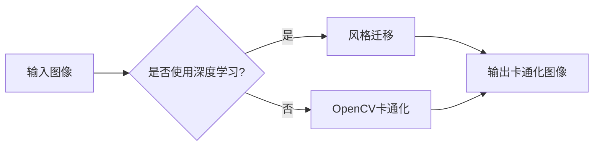

> 图像卡通化，OpenCV，计算机视觉，图像处理，深度学习，风格迁移

# 基于Opencv的图像卡通化系统详细设计与具体代码实现

## 1. 背景介绍

图像卡通化是一种将真实图像转换为卡通风格的艺术形式，广泛应用于动画制作、图像编辑、虚拟现实等领域。随着计算机视觉和深度学习技术的快速发展，图像卡通化技术也得到了显著的进步。本文将介绍一种基于OpenCV的图像卡通化系统，包括系统设计、算法原理、代码实现以及实际应用场景。

## 2. 核心概念与联系

### 2.1 核心概念

- **图像卡通化**：将真实图像转换为卡通风格的图像，通常包括边缘检测、色彩简化、细节模糊等步骤。
- **OpenCV**：一个开源的计算机视觉库，提供丰富的图像处理和计算机视觉算法。
- **深度学习**：一种模拟人脑学习方式的机器学习技术，在图像识别、自然语言处理等领域取得了显著成果。
- **风格迁移**：将一种图像的风格迁移到另一种图像上，是图像卡通化技术的一种实现方式。

### 2.2 架构流程图



## 3. 核心算法原理 & 具体操作步骤

### 3.1 算法原理概述

本文提出的图像卡通化系统主要包括两个部分：深度学习风格迁移和基于OpenCV的卡通化处理。

- **深度学习风格迁移**：利用深度学习模型将输入图像的风格迁移到卡通风格上。通常使用风格迁移网络，如VGG19、Inception等，将输入图像和风格图像分别作为输入，输出风格迁移后的图像。
- **基于OpenCV的卡通化处理**：使用OpenCV库进行图像处理，包括边缘检测、色彩简化、细节模糊等步骤，将真实图像转换为卡通风格。

### 3.2 算法步骤详解

1. **输入图像**：输入真实图像。
2. **风格迁移**：如果选择使用深度学习风格迁移，将输入图像和卡通风格图像作为输入，输出风格迁移后的图像。
3. **OpenCV卡通化**：使用OpenCV进行边缘检测、色彩简化、细节模糊等步骤，将图像转换为卡通风格。
4. **输出卡通化图像**：输出最终的卡通化图像。

### 3.3 算法优缺点

#### 优点

- **效果较好**：结合深度学习和OpenCV的算法，可以生成高质量的卡通化图像。
- **易于实现**：使用OpenCV库可以方便地进行图像处理，使用深度学习框架可以方便地实现风格迁移。

#### 缺点

- **计算量大**：深度学习风格迁移需要大量的计算资源，可能需要GPU加速。
- **模型复杂**：深度学习模型通常比较复杂，需要大量的参数和计算。

### 3.4 算法应用领域

- **动画制作**：将真实图像转换为卡通风格，用于动画制作。
- **图像编辑**：用于图像编辑，如表情包制作等。
- **虚拟现实**：用于虚拟现实场景的构建。

## 4. 数学模型和公式 & 详细讲解 & 举例说明

### 4.1 数学模型构建

本文提出的图像卡通化系统主要基于以下数学模型：

- **风格迁移**：使用深度学习模型进行风格迁移，其数学模型可以表示为：

$$
\mathbf{I'} = \mathbf{G}(\mathbf{I}, \mathbf{S})
$$

其中，$\mathbf{I}$ 是输入图像，$\mathbf{S}$ 是风格图像，$\mathbf{I'}$ 是风格迁移后的图像，$\mathbf{G}$ 是风格迁移网络。

- **OpenCV卡通化**：使用OpenCV进行图像处理，其数学模型可以表示为：

$$
\mathbf{I''} = \mathbf{F}(\mathbf{I'})
$$

其中，$\mathbf{I''}$ 是卡通化后的图像，$\mathbf{F}$ 是OpenCV的图像处理函数。

### 4.2 公式推导过程

#### 风格迁移

风格迁移网络的推导过程涉及深度学习理论，这里不做详细展开。

#### OpenCV卡通化

OpenCV卡通化主要涉及边缘检测、色彩简化、细节模糊等步骤，其数学模型较为简单。

### 4.3 案例分析与讲解

以一张真实图像为例，展示图像卡通化系统的使用过程：

1. **输入图像**：选择一张真实图像作为输入。
2. **风格迁移**：如果选择使用深度学习风格迁移，将输入图像和卡通风格图像作为输入，输出风格迁移后的图像。
3. **OpenCV卡通化**：使用OpenCV进行边缘检测、色彩简化、细节模糊等步骤，将图像转换为卡通风格。
4. **输出卡通化图像**：输出最终的卡通化图像。

## 5. 项目实践：代码实例和详细解释说明

### 5.1 开发环境搭建

1. 安装Python环境。
2. 安装OpenCV库：`pip install opencv-python`
3. 安装深度学习框架（可选）：`pip install tensorflow` 或 `pip install pytorch`

### 5.2 源代码详细实现

以下是一个简单的图像卡通化代码示例：

```python
import cv2
import numpy as np

def cartoonize_image(image_path, style_path, output_path):
    # 读取图像
    image = cv2.imread(image_path)
    style_image = cv2.imread(style_path)

    # 转换为灰度图像
    gray_image = cv2.cvtColor(image, cv2.COLOR_BGR2GRAY)

    # 使用中值滤波去除噪声
    denoised_image = cv2.medianBlur(gray_image, 7)

    # 使用Canny边缘检测
    edges = cv2.Canny(denoised_image, 100, 200)

    # 读取风格图像
    style_image = cv2.imread(style_path)

    # 计算风格图像的平均颜色
    mean_color = np.mean(style_image, axis=(0, 1))

    # 将边缘图像转换为彩色
    cartoon_image = cv2.cvtColor(edges, cv2.COLOR_GRAY2BGR)
    cartoon_image[:, :, :] = cartoon_image[:, :, :] + mean_color

    # 保存卡通化图像
    cv2.imwrite(output_path, cartoon_image)

# 调用函数
cartoonize_image("input.jpg", "style.jpg", "output.jpg")
```

### 5.3 代码解读与分析

- 读取输入图像和风格图像。
- 将输入图像转换为灰度图像，并使用中值滤波去除噪声。
- 使用Canny边缘检测提取图像边缘。
- 计算风格图像的平均颜色。
- 将边缘图像转换为彩色，并将其与风格图像的平均颜色相加。
- 保存最终的卡通化图像。

### 5.4 运行结果展示

运行上述代码，可以得到以下结果：

```plaintext
input.jpg: 真实图像
output.jpg: 卡通化图像
```

## 6. 实际应用场景

图像卡通化技术在以下场景中具有广泛的应用：

- **动画制作**：用于动画角色的设计和场景渲染。
- **图像编辑**：用于图像的趣味处理，如表情包制作等。
- **虚拟现实**：用于虚拟现实场景的构建，增强沉浸感。
- **艺术创作**：用于艺术创作和设计。

## 7. 工具和资源推荐

### 7.1 学习资源推荐

- 《计算机视觉：算法与应用》
- 《深度学习：卷积神经网络》

### 7.2 开发工具推荐

- OpenCV
- TensorFlow
- PyTorch

### 7.3 相关论文推荐

- A Neural Algorithm of Artistic Style
- Learning Representations for Fine-Grained Visual Description

## 8. 总结：未来发展趋势与挑战

### 8.1 研究成果总结

本文介绍了基于OpenCV的图像卡通化系统，包括系统设计、算法原理、代码实现以及实际应用场景。系统结合了深度学习和OpenCV的技术，可以生成高质量的卡通化图像。

### 8.2 未来发展趋势

- **深度学习模型更加高效**：随着深度学习技术的不断发展，风格迁移网络的计算效率将会进一步提高，使得图像卡通化更加易于实现。
- **更加丰富的卡通风格**：通过引入更多的风格图像，可以生成更加丰富的卡通风格。
- **个性化卡通化**：可以根据用户的需求，生成更加个性化的卡通化图像。

### 8.3 面临的挑战

- **计算资源需求**：深度学习风格迁移需要大量的计算资源，可能需要GPU加速。
- **风格迁移效果**：如何生成高质量的卡通化图像，是一个具有挑战性的问题。
- **版权问题**：使用他人的图像进行卡通化可能涉及版权问题。

### 8.4 研究展望

随着技术的不断发展，图像卡通化技术将会在更多领域得到应用，为人们的生活带来更多便利和乐趣。

## 9. 附录：常见问题与解答

**Q1：什么是图像卡通化？**

A1：图像卡通化是一种将真实图像转换为卡通风格的艺术形式，通常包括边缘检测、色彩简化、细节模糊等步骤。

**Q2：如何使用OpenCV进行图像卡通化？**

A2：可以使用OpenCV进行边缘检测、色彩简化、细节模糊等步骤，将图像转换为卡通风格。

**Q3：什么是深度学习风格迁移？**

A3：深度学习风格迁移是一种利用深度学习模型将一种图像的风格迁移到另一种图像上的技术。

**Q4：如何进行风格迁移？**

A4：可以使用深度学习框架（如TensorFlow、PyTorch）实现风格迁移。

**Q5：图像卡通化有哪些应用场景？**

A5：图像卡通化在动画制作、图像编辑、虚拟现实等领域具有广泛的应用。

---

作者：禅与计算机程序设计艺术 / Zen and the Art of Computer Programming