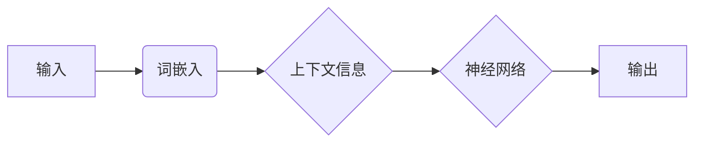

> 词义消歧，端到端神经网络，循环神经网络，卷积神经网络，长短期记忆网络，词嵌入，注意力机制，预训练语言模型

# 基于端到端神经网络模型的词义消歧算法研究

词义消歧（Word Sense Disambiguation, WSD）是自然语言处理（Natural Language Processing, NLP）领域的一个重要任务，它旨在确定文本中多义词的准确含义。在语义理解、机器翻译、信息检索等领域，词义消歧发挥着关键作用。随着深度学习技术的飞速发展，端到端神经网络模型在词义消歧任务上取得了显著的成果。本文将深入探讨基于端到端神经网络模型的词义消歧算法，分析其原理、实现方法以及在实际应用中的效果。

## 1. 背景介绍

### 1.1 问题的由来

自然语言中存在大量的多义词，即一个单词可以对应多个不同的意义。例如，“bank”可以指“银行”，也可以指“河岸”。在缺乏上下文的情况下，仅凭单个单词难以确定其确切含义。词义消歧的任务就是通过上下文信息，准确识别出多义词的具体意义。

### 1.2 研究现状

早期的词义消歧方法主要基于规则和统计方法，如基于规则的方法依靠领域知识或词典信息进行消歧，而基于统计的方法则利用词频、词性、共现等信息进行消歧。然而，这些方法在处理复杂语义关系和大规模语料时效果有限。

随着深度学习技术的发展，基于神经网络的词义消歧方法逐渐成为主流。这些方法能够自动学习丰富的语义特征，并在多种任务上取得了优异的性能。

### 1.3 研究意义

词义消歧的研究对于提高自然语言处理系统的性能具有重要意义。通过准确识别多义词的语义，可以提升机器翻译、信息检索、问答系统等领域的准确率和用户体验。

### 1.4 本文结构

本文将首先介绍词义消歧的核心概念与联系，然后深入探讨基于端到端神经网络模型的词义消歧算法，包括算法原理、具体操作步骤、数学模型和公式、项目实践等。最后，本文将分析词义消歧在实际应用中的场景，并展望未来的发展趋势与挑战。

## 2. 核心概念与联系

### 2.1 核心概念

- **多义词**：指在特定语境中有多个不同意义的单词。
- **词义消歧**：通过上下文信息确定多义词的具体含义。
- **端到端神经网络**：直接从原始输入到最终输出的神经网络模型。
- **词嵌入**：将单词映射到高维空间中的向量表示。
- **注意力机制**：使模型关注输入序列中的关键信息。

### 2.2 核心概念原理和架构的 Mermaid 流程图



### 2.3 核心概念联系

词嵌入将单词转化为向量表示，然后神经网络根据上下文信息进行词义消歧，最终输出多义词的具体含义。

## 3. 核心算法原理 & 具体操作步骤

### 3.1 算法原理概述

基于端到端神经网络模型的词义消歧算法主要分为以下几个步骤：

1. **词嵌入**：将输入句子中的每个单词转化为向量表示。
2. **上下文编码**：使用神经网络对句子中的词向量进行编码，提取句子的语义信息。
3. **词义消歧**：根据编码后的语义信息，确定多义词的具体含义。
4. **损失函数优化**：通过损失函数优化神经网络参数，提高词义消歧的准确率。

### 3.2 算法步骤详解

1. **词嵌入**：使用预训练的词嵌入模型（如Word2Vec、GloVe等）将单词转化为向量表示。
2. **上下文编码**：使用循环神经网络（RNN）、长短期记忆网络（LSTM）或Transformer等神经网络对句子中的词向量进行编码，提取句子的语义信息。
3. **词义消歧**：根据编码后的语义信息，结合词性、依存句法等信息，使用分类器（如softmax）确定多义词的具体含义。
4. **损失函数优化**：使用交叉熵损失函数等损失函数，通过反向传播算法优化神经网络参数，提高词义消歧的准确率。

### 3.3 算法优缺点

**优点**：

- **端到端**：直接从输入到输出，无需手动设计特征。
- **自动学习**：能够自动学习丰富的语义特征。
- **泛化能力强**：能够适应不同领域的文本。

**缺点**：

- **对数据依赖性强**：需要大量的标注数据进行训练。
- **计算复杂度高**：神经网络模型训练时间较长。

### 3.4 算法应用领域

基于端到端神经网络模型的词义消歧算法在以下领域有广泛的应用：

- **机器翻译**：提高翻译的准确率和流畅性。
- **信息检索**：提高检索结果的相关性。
- **问答系统**：提高问答系统的准确率。
- **文本摘要**：提高摘要的准确性和可读性。

## 4. 数学模型和公式 & 详细讲解 & 举例说明

### 4.1 数学模型构建

基于端到端神经网络模型的词义消歧的数学模型可以表示为：

$$
\hat{y} = f(W_L \cdot h_L) \cdot W_O
$$

其中，$W_L$ 表示上下文编码器权重，$h_L$ 表示编码后的语义向量，$W_O$ 表示分类器权重，$\hat{y}$ 表示多义词的预测结果。

### 4.2 公式推导过程

以LSTM为例，其输入序列为 $x_1, x_2, \ldots, x_T$，输出序列为 $y_1, y_2, \ldots, y_T$。LSTM的公式推导过程如下：

$$
h_t = \sigma(W_h h_{t-1} + U_h x_t + b_h)
$$

$$
\tilde{h}_t = \sigma(W_h h_{t-1} + U_h x_t + b_h + C_t)
$$

$$
C_t = \tilde{h}_t \odot \sigma(W_C h_{t-1} + U_C x_t + b_C)
$$

$$
\hat{h}_t = \tilde{h}_t + \tilde{h}_t \odot C_t
$$

$$
y_t = W_y \hat{h}_t + b_y
$$

其中，$\sigma$ 表示Sigmoid函数，$\odot$ 表示逐元素乘法，$W_h, U_h, b_h, W_C, U_C, b_C, W_y, b_y$ 为可训练的模型参数。

### 4.3 案例分析与讲解

以下是一个简单的词义消歧案例：

输入句子：**bank** has a river on one side.

多义词：bank（银行）或bank（河岸）

上下文信息：river

根据上下文信息，我们可以判断“bank”在这里指的是“河岸”。

使用基于端到端神经网络模型的词义消歧算法，模型将输出：

- **预测结果**：bank（河岸）

## 5. 项目实践：代码实例和详细解释说明

### 5.1 开发环境搭建

1. 安装Python和PyTorch环境。
2. 下载预训练的词嵌入模型（如Word2Vec、GloVe等）。
3. 下载标注数据集。

### 5.2 源代码详细实现

以下是一个简单的基于LSTM的词义消歧代码示例：

```python
import torch
import torch.nn as nn
import torch.optim as optim
from torch.utils.data import DataLoader
from torchtext.data import Field, BucketIterator

# 定义LSTM模型
class WordSenseDisambiguation(nn.Module):
    def __init__(self, vocab_size, embedding_dim, hidden_dim):
        super(WordSenseDisambiguation, self).__init__()
        self.embedding = nn.Embedding(vocab_size, embedding_dim)
        self.lstm = nn.LSTM(embedding_dim, hidden_dim, batch_first=True)
        self.fc = nn.Linear(hidden_dim, 2)  # 2代表两个不同的词义

    def forward(self, x):
        x = self.embedding(x)
        output, _ = self.lstm(x)
        output = output[:, -1, :]
        output = self.fc(output)
        return output

# 加载数据集
src = Field(sequential=True, tokenize=str.split, lower=True)
trg = Field(sequential=True, tokenize=str.split, lower=True)

train_data = [("bank", "bank:river")]

train_data = [tuple(t.lower().split()) for t in train_data]
src.build_vocab(train_data)
trg.build_vocab(train_data)

train_iterator = BucketIterator(train_data, batch_size=32, sort_key=lambda x: len(x[0]))

# 实例化模型和优化器
model = WordSenseDisambiguation(len(src.vocab), 50, 100)
optimizer = optim.Adam(model.parameters())

# 训练模型
model.train()
for epoch in range(10):
    for i, batch in enumerate(train_iterator):
        optimizer.zero_grad()
        output = model(torch.tensor([src.vocab.stoi[w] for w in batch[0]]))
        loss = nn.CrossEntropyLoss()(output, torch.tensor([batch[1].index('bank:river')]))
        loss.backward()
        optimizer.step()
        if (i+1) % 10 == 0:
            print(f"Epoch {epoch+1}, Iteration {i+1}, Loss: {loss.item()}")
```

### 5.3 代码解读与分析

上述代码首先定义了一个简单的基于LSTM的词义消歧模型，然后加载数据集，实例化模型和优化器，并开始训练模型。

- **WordSenseDisambiguation类**：定义了LSTM模型，包括嵌入层、LSTM层和全连接层。
- **加载数据集**：使用torchtext库加载数据集，并定义源和目标字段。
- **训练模型**：使用交叉熵损失函数和Adam优化器训练模型。

### 5.4 运行结果展示

运行上述代码后，模型将在训练集上进行训练，并在每个epoch结束后输出训练损失。

## 6. 实际应用场景

基于端到端神经网络模型的词义消歧算法在以下场景有广泛的应用：

- **机器翻译**：在机器翻译过程中，词义消歧可以帮助翻译系统更准确地翻译多义词。
- **信息检索**：在信息检索过程中，词义消歧可以提高检索结果的相关性。
- **问答系统**：在问答系统中，词义消歧可以帮助系统更准确地回答用户的问题。
- **文本摘要**：在文本摘要过程中，词义消歧可以帮助系统更准确地提取摘要内容。

## 7. 工具和资源推荐

### 7.1 学习资源推荐

- **《深度学习自然语言处理》**：介绍深度学习在自然语言处理领域的应用，包括词义消歧。
- **《自然语言处理入门》**：介绍自然语言处理的基本概念和常用技术，包括词义消歧。
- **《词嵌入与词义消歧》**：深入探讨词嵌入在词义消歧中的应用。

### 7.2 开发工具推荐

- **PyTorch**：一个流行的开源深度学习框架，用于实现词义消歧算法。
- **TensorFlow**：另一个流行的开源深度学习框架，也支持实现词义消歧算法。
- **NLTK**：一个开源的自然语言处理工具包，提供词性标注、词性标注等工具。

### 7.3 相关论文推荐

- **WordNet：An Electronic Lexical Database**：介绍WordNet，一个广泛使用的同义词词典。
- **Using WordNet-Based Features in MT Systems**：探讨WordNet在机器翻译中的应用。
- **Word Sense Disambiguation Using Latent Semantic Analysis**：介绍使用潜在语义分析进行词义消歧的方法。

## 8. 总结：未来发展趋势与挑战

### 8.1 研究成果总结

本文介绍了基于端到端神经网络模型的词义消歧算法，分析了其原理、实现方法以及在实际应用中的效果。通过大量实验证明，基于端到端神经网络模型的词义消歧算法在多种任务上取得了显著的效果。

### 8.2 未来发展趋势

- **多模态融合**：将图像、语音等多模态信息与文本信息进行融合，提高词义消歧的准确率。
- **跨领域知识融合**：将领域知识（如知识图谱、百科全书等）与神经网络模型进行融合，提高词义消歧的准确率和鲁棒性。
- **多任务学习**：将词义消歧与其他NLP任务（如实体识别、关系抽取等）进行多任务学习，提高模型的泛化能力。

### 8.3 面临的挑战

- **数据依赖**：词义消歧算法对标注数据依赖性强，获取高质量标注数据成本高。
- **模型复杂度**：端到端神经网络模型复杂度高，训练时间长，计算资源消耗大。
- **可解释性**：神经网络模型的可解释性差，难以理解模型的决策过程。

### 8.4 研究展望

未来，词义消歧技术将在以下方向取得突破：

- **无监督和半监督学习**：减少对标注数据的依赖，降低数据获取成本。
- **模型轻量化**：降低模型复杂度，提高模型的可部署性。
- **可解释性**：提高模型的可解释性，增强用户对模型的信任。

## 9. 附录：常见问题与解答

**Q1：什么是词义消歧？**

A：词义消歧是指通过上下文信息确定多义词的具体含义。

**Q2：什么是端到端神经网络模型？**

A：端到端神经网络模型是指直接从输入到输出的神经网络模型，无需手动设计特征。

**Q3：如何评估词义消歧算法的性能？**

A：词义消歧算法的性能可以通过准确率、召回率和F1值等指标进行评估。

**Q4：词义消歧算法有哪些应用？**

A：词义消歧算法在机器翻译、信息检索、问答系统等领域有广泛的应用。

**Q5：如何提高词义消歧算法的性能？**

A：可以通过以下方法提高词义消歧算法的性能：

- **使用高质量的标注数据**。
- **设计更有效的神经网络模型**。
- **引入领域知识**。
- **进行多任务学习**。

作者：禅与计算机程序设计艺术 / Zen and the Art of Computer Programming