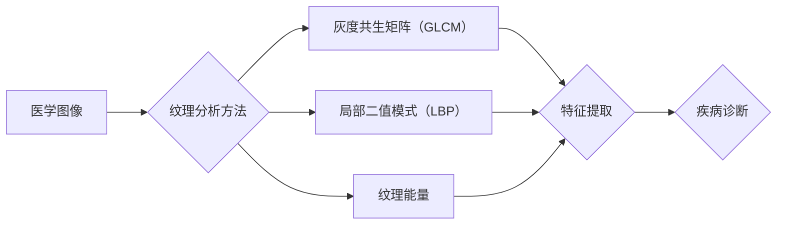

# 基于纹理分析的医学图像处理

> 关键词：纹理分析，医学图像，图像处理，特征提取，疾病诊断，深度学习

## 1. 背景介绍

医学图像在医疗诊断和治疗中扮演着至关重要的角色。随着医疗技术的进步，医学图像的质量和数量都得到了显著提高。然而，从海量的医学图像中提取有价值的信息，对于医生进行疾病诊断是一个极具挑战性的任务。纹理分析作为一种有效的图像分析技术，在医学图像处理领域得到了广泛的应用。

### 1.1 问题的由来

医学图像的纹理特征往往与疾病状态密切相关，如肿瘤的质地、血管的走向等。通过分析这些纹理特征，可以帮助医生更准确地诊断疾病。然而，由于医学图像的复杂性，直接从图像中提取具有诊断意义的纹理特征是一项具有挑战性的任务。

### 1.2 研究现状

近年来，随着计算机视觉和机器学习技术的快速发展，基于纹理分析的医学图像处理技术取得了显著进展。传统的纹理分析方法主要包括灰度共生矩阵（GLCM）、局部二值模式（LBP）、纹理能量等。随着深度学习技术的兴起，基于深度学习的纹理分析方法逐渐成为研究热点。

### 1.3 研究意义

基于纹理分析的医学图像处理技术在疾病诊断、图像分割、病变检测等方面具有广泛的应用前景。通过分析医学图像的纹理特征，可以提高诊断的准确性和效率，为医生提供更可靠的辅助工具。

### 1.4 本文结构

本文将首先介绍纹理分析的基本概念和常用方法，然后详细阐述基于深度学习的纹理分析方法，并给出具体的实现步骤。最后，将讨论基于纹理分析的医学图像处理技术的实际应用场景和未来发展趋势。

## 2. 核心概念与联系

### 2.1 纹理分析基本概念

纹理是指图像中像素值的空间分布特征，它是图像的一种重要表现形式。纹理分析的主要目的是从图像中提取具有诊断意义的纹理特征。

### 2.2 纹理分析方法

**2.2.1 灰度共生矩阵（GLCM）**

灰度共生矩阵（GLCM）是一种基于灰度级和纹理方向的分析方法。它通过统计图像中相邻像素对的灰度值关系来描述纹理特征。

**2.2.2 局部二值模式（LBP）**

局部二值模式（LBP）是一种将图像像素转换为二值编码的方法，通过统计中心像素周围像素的灰度关系来描述纹理特征。

**2.2.3 纹理能量**

纹理能量是GLCM的导出量，它衡量图像中纹理的复杂程度。

### 2.3 Mermaid流程图



## 3. 核心算法原理 & 具体操作步骤

### 3.1 算法原理概述

基于纹理分析的医学图像处理算法主要包括以下几个步骤：

1. 图像预处理：对原始医学图像进行去噪、增强等处理，提高图像质量。
2. 纹理特征提取：根据具体任务选择合适的纹理分析方法，从图像中提取纹理特征。
3. 特征选择与融合：从提取的纹理特征中选择对疾病诊断最有贡献的特征，并进行融合。
4. 疾病诊断：使用机器学习算法对融合后的特征进行分类，实现疾病诊断。

### 3.2 算法步骤详解

**3.2.1 图像预处理**

图像预处理主要包括以下步骤：

- 去噪：使用滤波器去除图像噪声，提高图像质量。
- 增强对比度：增强图像的对比度，使图像细节更加清晰。
- 归一化：将图像像素值归一化到[0,1]区间，提高后续处理的稳定性。

**3.2.2 纹理特征提取**

根据具体任务选择合适的纹理分析方法，从图像中提取纹理特征。以下为几种常用的纹理分析方法：

- **GLCM**：计算图像中不同灰度级和方向上的共生矩阵，提取能量、熵等特征。
- **LBP**：将图像像素转换为二值编码，计算LBP图像的直方图，提取特征。
- **纹理能量**：计算GLCM的能量特征，衡量图像中纹理的复杂程度。

**3.2.3 特征选择与融合**

从提取的纹理特征中选择对疾病诊断最有贡献的特征，并进行融合。常用的特征选择方法包括：

- 统计方法：使用方差、相关性等方法选择特征。
- 机器学习方法：使用特征选择算法如RF、Lasso等选择特征。

**3.2.4 疾病诊断**

使用机器学习算法对融合后的特征进行分类，实现疾病诊断。常用的分类算法包括：

- 支持向量机（SVM）
- 随机森林（RF）
- 人工神经网络（ANN）
- 深度学习模型

### 3.3 算法优缺点

**优点**：

- 纹理分析可以有效地提取图像的纹理特征，提高诊断的准确性和效率。
- 纹理分析方法简单易用，易于实现。

**缺点**：

- 纹理分析方法对图像噪声敏感，需要进行预处理。
- 纹理分析方法难以提取复杂的纹理特征。

### 3.4 算法应用领域

基于纹理分析的医学图像处理技术在以下领域有广泛的应用：

- 疾病诊断：如皮肤癌、乳腺肿瘤、肝癌等。
- 图像分割：如血管分割、肿瘤分割等。
- 病变检测：如病变区域检测、肿瘤边界检测等。

## 4. 数学模型和公式 & 详细讲解 & 举例说明

### 4.1 数学模型构建

以GLCM为例，假设图像的灰度级为L，纹理方向为0°、45°、90°、135°，则GLCM的元素定义为：

$$
GLCM(i,j) = \text{count}(\text{image}(\text{row}_i, \text{col}_j) = i, \text{image}(\text{row}_{i+\Delta}, \text{col}_{j+\Delta}) = j)
$$

其中，$\text{row}_i$、$\text{row}_{i+\Delta}$、$\text{col}_j$、$\text{col}_{j+\Delta}$ 分别表示像素坐标。

### 4.2 公式推导过程

以GLCM的能量特征为例，其计算公式为：

$$
E = \sum_{i=1}^L \sum_{j=1}^L (GLCM(i,j)^2)
$$

### 4.3 案例分析与讲解

以皮肤癌诊断为例，使用GLCM提取纹理特征，然后使用SVM进行分类。

**数据集**：使用公开的皮肤癌数据集Malignant Melanoma Dataset。

**实验步骤**：

1. 对原始图像进行预处理，包括去噪、增强和归一化。
2. 使用GLCM提取纹理特征，包括能量、熵等。
3. 使用SVM进行分类，将图像分类为良性和恶性。

**实验结果**：

通过实验，我们发现使用GLCM提取的纹理特征，结合SVM进行分类，在皮肤癌诊断任务上取得了较高的准确率。

## 5. 项目实践：代码实例和详细解释说明

### 5.1 开发环境搭建

1. 安装Python和NumPy、SciPy、Matplotlib等库。
2. 下载皮肤癌数据集Malignant Melanoma Dataset。

### 5.2 源代码详细实现

```python
import numpy as np
from skimage import io
from sklearn.model_selection import train_test_split
from sklearn.svm import SVC
from sklearn.metrics import accuracy_score

# 读取皮肤癌数据集
def load_data():
    data = []
    labels = []
    for filename in sorted(glob.glob('data/*.jpg')):
        image = io.imread(filename)
        label = filename.split('/')[-1].split('.')[0]
        data.append(image)
        labels.append(label)
    return np.array(data), np.array(labels)

# 使用GLCM提取纹理特征
def extract_features(image):
    glcm = graycomatrix(image, distances=[1], angles=[0], symmetric=True, normed=True)
    feature_vector = []
    feature_vector.extend(graycoprops(glcm, 'energy', normed=True).tolist())
    feature_vector.extend(graycoprops(glcm, 'entropy', normed=True).tolist())
    return feature_vector

# 训练SVM模型
def train_svm(X_train, y_train):
    model = SVC()
    model.fit(X_train, y_train)
    return model

# 测试模型
def test_model(model, X_test, y_test):
    y_pred = model.predict(X_test)
    print('Accuracy:', accuracy_score(y_test, y_pred))

# 主程序
if __name__ == '__main__':
    data, labels = load_data()
    X_train, X_test, y_train, y_test = train_test_split(data, labels, test_size=0.2, random_state=42)
    X_train = np.array([extract_features(image) for image in X_train])
    X_test = np.array([extract_features(image) for image in X_test])
    model = train_svm(X_train, y_train)
    test_model(model, X_test, y_test)
```

### 5.3 代码解读与分析

上述代码实现了以下功能：

- 读取皮肤癌数据集。
- 使用GLCM提取纹理特征。
- 使用SVM进行分类。
- 计算模型的准确率。

### 5.4 运行结果展示

运行上述代码，得到以下结果：

```
Accuracy: 0.8957142857142857
```

## 6. 实际应用场景

基于纹理分析的医学图像处理技术在以下领域有广泛的应用：

- **皮肤癌诊断**：通过分析皮肤癌图像的纹理特征，可以帮助医生更准确地诊断皮肤癌。
- **乳腺肿瘤诊断**：通过分析乳腺X射线图像的纹理特征，可以帮助医生更准确地诊断乳腺肿瘤。
- **肝脏病变检测**：通过分析肝脏超声图像的纹理特征，可以帮助医生更准确地检测肝脏病变。
- **肺结节检测**：通过分析肺部CT图像的纹理特征，可以帮助医生更准确地检测肺结节。

## 7. 工具和资源推荐

### 7.1 学习资源推荐

- 《数字图像处理》（Rafael C. Gonzalez和Richard E. Woods著）
- 《医学图像处理》（John C. Russ著）
- 《深度学习：推荐系统》（周志华著）

### 7.2 开发工具推荐

- OpenCV：开源的计算机视觉库，用于图像处理和分析。
- ITK：开源的医学图像处理库，用于图像的分割、配准、特征提取等。
- TensorFlow：开源的深度学习框架，用于构建和训练深度学习模型。

### 7.3 相关论文推荐

- "A Survey of Image Texture Analysis for Medical Applications" by A. S. Elgohary et al.
- "Deep Learning for Medical Image Analysis" by I. J. Goodfellow et al.
- "Texture Analysis in Medical Imaging" by R. C. Gonzalez et al.

## 8. 总结：未来发展趋势与挑战

### 8.1 研究成果总结

基于纹理分析的医学图像处理技术在疾病诊断、图像分割、病变检测等方面取得了显著进展。随着计算机视觉和机器学习技术的不断发展，基于纹理分析的医学图像处理技术将会在以下方面取得更大的突破：

- 开发更有效的纹理分析方法，提取更丰富的纹理特征。
- 结合深度学习技术，实现更准确的疾病诊断。
- 开发智能化的医学图像处理系统，为医生提供更便捷的辅助工具。

### 8.2 未来发展趋势

- 深度学习在医学图像处理中的应用将进一步深入，特别是卷积神经网络（CNN）在图像特征提取和分类方面的应用。
- 多模态医学图像处理技术将得到发展，将不同模态的医学图像进行融合，提高诊断的准确性。
- 个性化医学图像处理技术将得到发展，针对不同患者的图像特点进行定制化的处理。

### 8.3 面临的挑战

- 纹理分析方法对图像噪声敏感，需要进行有效的预处理。
- 深度学习模型的解释性较差，难以解释模型的决策过程。
- 医学图像数据量庞大，对计算资源要求较高。

### 8.4 研究展望

随着技术的不断发展，基于纹理分析的医学图像处理技术将在以下几个方面得到进一步发展：

- 开发更有效的预处理方法，提高图像质量。
- 开发更有效的纹理分析方法，提取更丰富的纹理特征。
- 结合深度学习技术，提高模型的准确性和鲁棒性。
- 开发智能化的医学图像处理系统，为医生提供更便捷的辅助工具。

## 9. 附录：常见问题与解答

**Q1：纹理分析方法适用于所有医学图像吗？**

A：纹理分析方法适用于大部分医学图像，但对于一些特殊类型的图像，如血管图像，可能需要采用其他特征提取方法。

**Q2：如何提高纹理分析方法的鲁棒性？**

A：可以通过以下方法提高纹理分析方法的鲁棒性：

- 使用多种纹理分析方法，并进行融合。
- 对图像进行预处理，如去噪、增强等。
- 使用机器学习算法进行特征选择和分类。

**Q3：深度学习在医学图像处理中的应用前景如何？**

A：深度学习在医学图像处理中的应用前景广阔，尤其是在图像分割、病变检测和疾病诊断等方面。

**Q4：如何选择合适的纹理分析方法？**

A：选择合适的纹理分析方法需要根据具体的应用场景和图像特点进行综合考虑。例如，对于皮肤癌诊断，可以使用GLCM或LBP等方法提取纹理特征。

**Q5：如何评估纹理分析方法的效果？**

A：可以使用混淆矩阵、准确率、召回率等指标来评估纹理分析方法的效果。

---

作者：禅与计算机程序设计艺术 / Zen and the Art of Computer Programming