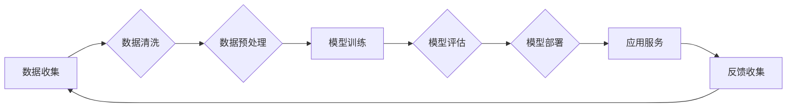

# 基础模型的医疗保健应用

> 关键词：基础模型，医疗保健，人工智能，深度学习，自然语言处理，图像识别，预测模型，个性化治疗

## 1. 背景介绍

医疗保健行业正经历着一场前所未有的变革，人工智能（AI）技术的应用成为推动行业发展的关键力量。随着深度学习、自然语言处理（NLP）和图像识别等技术的飞速发展，基础模型在医疗保健领域的应用越来越广泛。本文将深入探讨基础模型在医疗保健行业的应用，分析其原理、操作步骤、优缺点以及未来发展趋势。

### 1.1 问题的由来

医疗保健行业面临着许多挑战，包括：

- 疾病诊断的准确性
- 患者个性化治疗的制定
- 医疗资源的分配
- 医疗数据的分析和解读

传统方法在解决这些问题的过程中往往效率低下，且难以实现个性化服务。基础模型的出现为医疗保健行业带来了新的可能性，通过自动化、智能化的方式，有望提高医疗服务的质量和效率。

### 1.2 研究现状

目前，基础模型在医疗保健领域的应用主要集中在以下几个方面：

- 疾病诊断
- 预测模型
- 个性化治疗
- 医疗资源分配
- 医疗数据分析和解读

### 1.3 研究意义

基础模型在医疗保健领域的应用具有以下重要意义：

- 提高诊断准确性，减少误诊率
- 为患者提供个性化治疗方案
- 优化医疗资源配置，提高效率
- 促进医疗数据分析和解读，辅助临床决策
- 降低医疗成本，提高医疗服务可及性

### 1.4 本文结构

本文将按照以下结构进行论述：

- 第2部分，介绍基础模型在医疗保健领域的核心概念与联系。
- 第3部分，详细阐述基础模型的核心算法原理和具体操作步骤。
- 第4部分，探讨基础模型的数学模型和公式，并结合实例进行讲解。
- 第5部分，给出基础模型在医疗保健领域的代码实例和详细解释说明。
- 第6部分，分析基础模型在医疗保健领域的实际应用场景。
- 第7部分，展望基础模型在医疗保健领域的未来应用。
- 第8部分，总结研究成果，分析未来发展趋势和挑战。
- 第9部分，提供基础模型在医疗保健领域的工具和资源推荐。

## 2. 核心概念与联系

### 2.1 核心概念

- **基础模型**：指在大规模数据集上进行训练，学习通用特征和模式的深度学习模型，如卷积神经网络（CNN）、循环神经网络（RNN）和Transformer等。
- **自然语言处理（NLP）**：指使计算机理解和生成人类语言的技术，包括文本分类、情感分析、命名实体识别等。
- **图像识别**：指计算机识别和理解图像内容的技术，包括目标检测、图像分割、人脸识别等。
- **预测模型**：指根据历史数据预测未来事件或趋势的模型，如疾病预测、患者预后等。
- **个性化治疗**：指根据患者的个体特征制定个性化的治疗方案。
- **医疗资源分配**：指根据医疗资源的需求和可用性进行合理分配。

### 2.2 架构的 Mermaid 流程图



### 2.3 核心概念之间的联系

基础模型通过学习大量的医疗数据，可以应用于不同的医疗保健领域，如图像识别用于医学影像分析，NLP用于病历分析，预测模型用于疾病预测，个性化治疗根据患者的个体特征制定治疗方案，医疗资源分配根据需求进行资源优化。

## 3. 核心算法原理 & 具体操作步骤

### 3.1 算法原理概述

基础模型在医疗保健领域的应用通常包括以下步骤：

1. 数据收集：收集相关医疗数据，如病历、影像、基因数据等。
2. 数据预处理：清洗和预处理数据，包括数据清洗、归一化、特征工程等。
3. 模型训练：选择合适的模型架构，如CNN、RNN或Transformer，并使用预处理后的数据进行训练。
4. 模型评估：在验证集上评估模型的性能，包括准确性、召回率、F1分数等。
5. 模型部署：将训练好的模型部署到生产环境中，提供实际应用服务。
6. 反馈收集：收集用户反馈，对模型进行持续优化。

### 3.2 算法步骤详解

1. **数据收集**：根据具体任务收集相关数据，如疾病诊断、药物疗效评估等。
2. **数据预处理**：对数据进行清洗，去除噪声和异常值，并进行归一化处理。对于图像数据，需要进行图像预处理，如裁剪、缩放、翻转等。
3. **模型训练**：选择合适的模型架构，如CNN、RNN或Transformer，并根据数据特点和任务需求进行调整。使用预处理后的数据进行模型训练，训练过程中需要进行参数调整和优化。
4. **模型评估**：在验证集上评估模型的性能，包括准确性、召回率、F1分数等指标。根据评估结果调整模型参数，提高模型性能。
5. **模型部署**：将训练好的模型部署到生产环境中，提供实际应用服务。可以使用云平台、边缘计算或本地服务器进行部署。
6. **反馈收集**：收集用户反馈，如模型预测结果、用户满意度等，对模型进行持续优化和改进。

### 3.3 算法优缺点

**优点**：

- **准确性高**：基础模型能够学习到大量的特征和模式，从而提高预测和诊断的准确性。
- **自动化程度高**：基础模型可以自动化处理大量数据，提高工作效率。
- **可扩展性强**：基础模型可以应用于不同的医疗保健领域，具有较好的可扩展性。

**缺点**：

- **数据依赖性**：基础模型需要大量高质量的数据进行训练，数据质量对模型性能影响很大。
- **模型可解释性差**：深度学习模型通常被视为“黑盒”，难以解释其内部工作机制。
- **计算资源消耗大**：深度学习模型需要大量的计算资源进行训练和推理。

### 3.4 算法应用领域

基础模型在医疗保健领域的应用领域包括：

- **疾病诊断**：利用图像识别技术进行病理切片、X光片等医学影像的诊断。
- **药物研发**：利用深度学习技术预测药物的疗效和副作用。
- **患者管理**：利用NLP技术分析病历，进行患者管理。
- **健康监测**：利用可穿戴设备和传感器收集生理数据，进行健康监测和预警。

## 4. 数学模型和公式 & 详细讲解 & 举例说明

### 4.1 数学模型构建

基础模型的数学模型通常包括以下几个部分：

- **输入层**：接收输入数据，如图像、文本或序列数据。
- **隐藏层**：通过非线性变换学习输入数据的特征和模式。
- **输出层**：根据隐藏层输出，生成预测结果。

以CNN为例，其数学模型可以表示为：

$$
\text{CNN}(x) = f(L_{1}(\cdot), L_{2}(\cdot), ..., L_{N}(\cdot))
$$

其中，$L_{1}, L_{2}, ..., L_{N}$ 分别表示CNN的卷积层、池化层和激活层。

### 4.2 公式推导过程

以CNN为例，其公式推导过程如下：

1. **输入层**：输入数据 $x$ 经过预处理后，输入到CNN的输入层。
2. **卷积层**：卷积层通过卷积核对输入数据进行卷积操作，提取局部特征。
3. **池化层**：池化层对卷积层输出的特征进行降采样，减少参数数量，提高计算效率。
4. **激活层**：激活层对池化层输出的特征进行非线性变换，引入非线性因素。
5. **输出层**：输出层根据隐藏层输出，生成预测结果。

### 4.3 案例分析与讲解

以下以基于CNN的医学影像诊断为例，说明基础模型在医疗保健领域的应用。

**案例背景**：某医院需要利用深度学习技术对乳腺影像进行诊断，以区分良性和恶性病变。

**模型构建**：选择一个预训练的CNN模型，如ResNet，并添加一个输出层，用于输出病变的良恶性概率。

**数据预处理**：收集大量的乳腺影像数据，包括正常影像和病变影像。对数据进行清洗、裁剪、缩放等预处理操作。

**模型训练**：使用预处理后的数据对CNN模型进行训练，优化模型参数。

**模型评估**：在验证集上评估模型的性能，包括准确性、召回率、F1分数等指标。

**模型部署**：将训练好的模型部署到生产环境中，提供乳腺影像诊断服务。

## 5. 项目实践：代码实例和详细解释说明

### 5.1 开发环境搭建

以下是使用Python和TensorFlow搭建开发环境的基本步骤：

1. 安装Anaconda，创建Python虚拟环境。
2. 安装TensorFlow和必要的依赖库，如Keras、NumPy等。
3. 安装医学影像处理库，如OpenCV、ITK等。

### 5.2 源代码详细实现

以下是一个基于CNN的乳腺影像诊断的简单示例：

```python
import tensorflow as tf
from tensorflow.keras import layers, models

def create_cnn_model(input_shape, num_classes):
    model = models.Sequential()
    model.add(layers.Conv2D(32, (3, 3), activation='relu', input_shape=input_shape))
    model.add(layers.MaxPooling2D((2, 2)))
    model.add(layers.Conv2D(64, (3, 3), activation='relu'))
    model.add(layers.MaxPooling2D((2, 2)))
    model.add(layers.Conv2D(128, (3, 3), activation='relu'))
    model.add(layers.MaxPooling2D((2, 2)))
    model.add(layers.Flatten())
    model.add(layers.Dense(num_classes, activation='softmax'))
    return model

# 创建模型
model = create_cnn_model(input_shape=(224, 224, 3), num_classes=2)

# 编译模型
model.compile(optimizer='adam', loss='sparse_categorical_crossentropy', metrics=['accuracy'])

# 模型训练
model.fit(x_train, y_train, epochs=10, validation_data=(x_val, y_val))

# 模型评估
model.evaluate(x_test, y_test)
```

### 5.3 代码解读与分析

以上代码展示了使用TensorFlow和Keras构建一个简单的CNN模型的过程。

- `create_cnn_model`函数用于创建一个具有3个卷积层、3个池化层和一个全连接层的CNN模型。
- `model.fit`函数用于训练模型，`x_train`和`y_train`分别为训练数据和标签，`epochs`表示训练轮数，`validation_data`表示验证数据。
- `model.evaluate`函数用于评估模型在测试数据上的性能。

### 5.4 运行结果展示

运行上述代码后，将在控制台输出模型的训练和测试损失以及准确率。

## 6. 实际应用场景

### 6.1 疾病诊断

深度学习模型在疾病诊断领域的应用非常广泛，以下是一些具体的应用场景：

- **癌症诊断**：利用深度学习模型对病理切片进行图像识别，用于癌症的早期检测和诊断。
- **心血管疾病诊断**：利用深度学习模型分析X光片、心电图等数据，用于心脏病、高血压等疾病的诊断。
- **神经系统疾病诊断**：利用深度学习模型分析脑电图、MRI等数据，用于癫痫、帕金森病等疾病的诊断。

### 6.2 药物研发

深度学习模型在药物研发领域的应用主要体现在以下几个方面：

- **药物活性预测**：利用深度学习模型预测候选药物的活性，筛选出具有潜力的药物。
- **药物副作用预测**：利用深度学习模型预测候选药物的副作用，提高药物的安全性。
- **药物靶点预测**：利用深度学习模型预测药物的作用靶点，为药物研发提供方向。

### 6.3 患者管理

深度学习模型在患者管理领域的应用主要体现在以下几个方面：

- **病情预测**：利用深度学习模型预测患者的病情发展趋势，及时进行干预。
- **治疗方案推荐**：利用深度学习模型根据患者的病情和病史，推荐个性化的治疗方案。
- **健康监测**：利用可穿戴设备和传感器收集生理数据，利用深度学习模型进行健康监测和预警。

### 6.4 医疗资源分配

深度学习模型在医疗资源分配领域的应用主要体现在以下几个方面：

- **床位分配**：利用深度学习模型预测医院床位的占用情况，合理分配床位资源。
- **医疗设备分配**：利用深度学习模型预测医疗设备的利用率，合理分配医疗设备资源。
- **人力资源分配**：利用深度学习模型预测医院的人力资源需求，合理分配医护人员。

## 7. 工具和资源推荐

### 7.1 学习资源推荐

- 《深度学习》
- 《Python深度学习》
- 《自然语言处理入门》
- 《计算机视觉：一种现代方法》

### 7.2 开发工具推荐

- TensorFlow
- PyTorch
- Keras
- OpenCV

### 7.3 相关论文推荐

- **深度学习在医疗影像诊断中的应用**：
  - "Deep Learning for Radiology: Open Problems and Perspectives"
  - "Deep Learning for Radiology: A Review"
- **深度学习在药物研发中的应用**：
  - "Deep Learning in Drug Discovery and Development: A Survey"
  - "Deep Learning for Drug Discovery: A View from Industry"
- **深度学习在医疗保健中的应用**：
  - "Artificial Intelligence in Healthcare: A Survey"
  - "The Promise of Artificial Intelligence in Healthcare"

## 8. 总结：未来发展趋势与挑战

### 8.1 研究成果总结

基础模型在医疗保健领域的应用取得了显著成果，为疾病诊断、药物研发、患者管理、医疗资源分配等方面提供了有力支持。然而，基础模型在医疗保健领域的应用仍面临着许多挑战，需要进一步研究和探索。

### 8.2 未来发展趋势

未来，基础模型在医疗保健领域的应用将呈现以下发展趋势：

- **模型小型化**：为了提高模型的可部署性和可扩展性，模型将朝着小型化的方向发展。
- **可解释性增强**：为了提高模型的可信度和接受度，模型的可解释性将得到加强。
- **跨模态学习**：将文本、图像、音频等多模态信息进行整合，提高模型的全面性和鲁棒性。
- **个性化医疗**：利用深度学习模型为患者提供更加个性化的治疗方案。

### 8.3 面临的挑战

基础模型在医疗保健领域的应用仍面临着以下挑战：

- **数据质量**：医疗数据质量参差不齐，需要进一步研究和开发数据清洗和预处理技术。
- **隐私保护**：医疗数据包含大量敏感信息，需要加强数据安全和隐私保护措施。
- **伦理问题**：深度学习模型在医疗保健领域的应用需要遵守伦理道德规范，避免歧视和偏见。
- **模型可解释性**：深度学习模型的决策过程难以解释，需要开发可解释的深度学习模型。

### 8.4 研究展望

未来，基础模型在医疗保健领域的应用将朝着以下方向发展：

- **跨学科研究**：加强人工智能、医学、生物信息学等学科的交叉研究，推动医疗保健领域的创新发展。
- **标准化和规范化**：制定相关标准和规范，确保深度学习模型在医疗保健领域的应用质量和安全。
- **开源生态**：鼓励开源和共享深度学习模型和代码，推动医疗保健领域的技术创新和应用推广。

## 9. 附录：常见问题与解答

**Q1：基础模型在医疗保健领域的应用前景如何？**

A：基础模型在医疗保健领域的应用前景非常广阔，有望在疾病诊断、药物研发、患者管理、医疗资源分配等方面发挥重要作用。

**Q2：深度学习模型在医疗保健领域的应用有哪些挑战？**

A：深度学习模型在医疗保健领域的应用主要面临以下挑战：数据质量、隐私保护、伦理问题、模型可解释性等。

**Q3：如何提高深度学习模型的可解释性？**

A：提高深度学习模型的可解释性可以通过以下方法：可视化模型结构、解释模型决策过程、开发可解释的深度学习模型等。

**Q4：如何确保深度学习模型在医疗保健领域的应用符合伦理道德规范？**

A：确保深度学习模型在医疗保健领域的应用符合伦理道德规范，需要制定相关标准和规范，加强监管和伦理审查。

**Q5：基础模型在医疗保健领域的应用有哪些潜在风险？**

A：基础模型在医疗保健领域的应用可能存在的潜在风险包括：误诊、歧视、隐私泄露等。

**Q6：如何降低深度学习模型在医疗保健领域的应用成本？**

A：降低深度学习模型在医疗保健领域的应用成本可以通过以下方法：模型小型化、优化算法、开源技术等。

**Q7：基础模型在医疗保健领域的应用是否需要专业人才？**

A：基础模型在医疗保健领域的应用需要相关领域的专业人才，如人工智能工程师、医学专家、生物信息学专家等。

**Q8：未来深度学习模型在医疗保健领域的应用将如何发展？**

A：未来深度学习模型在医疗保健领域的应用将朝着跨学科研究、标准化和规范化、开源生态等方向发展。

作者：禅与计算机程序设计艺术 / Zen and the Art of Computer Programming