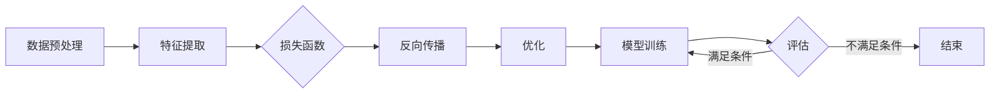

# 大模型的市场需求与技术潜力

> 关键词：大模型，市场需求，技术潜力，人工智能，深度学习，自然语言处理，计算机视觉，智能决策

## 1. 背景介绍

随着人工智能技术的飞速发展，大模型（Large Models）已成为当前研究的热点。大模型指的是那些拥有海量参数、能够处理复杂任务的模型，如自然语言处理（NLP）中的BERT、GPT系列，以及计算机视觉（CV）中的ImageNet等。这些模型在各自领域取得了显著的成果，引起了业界的广泛关注。本文将探讨大模型的市场需求与技术潜力，分析其发展趋势与挑战。

## 2. 核心概念与联系

### 2.1 大模型的定义与特点

大模型通常具有以下特点：

- **参数量庞大**：大模型的参数量可达数十亿甚至上百亿，这使得模型能够学习到更丰富的特征和知识。
- **模型复杂度高**：大模型的结构通常较为复杂，包含多个层和神经元，能够处理复杂的任务。
- **训练数据量巨大**：大模型的训练需要大量标注数据，以学习到足够的特征和知识。
- **计算资源需求高**：大模型的训练和推理需要大量的计算资源，如GPU、TPU等。

### 2.2 大模型的工作原理

大模型通常采用深度学习技术进行训练，其工作原理可以概括为以下步骤：

1. **数据预处理**：将原始数据（如图像、文本等）进行预处理，如归一化、裁剪等。
2. **特征提取**：通过神经网络提取数据中的特征，如BERT中的Transformer结构。
3. **损失函数**：根据任务定义损失函数，如交叉熵损失、均方误差等。
4. **反向传播**：通过反向传播算法计算梯度，并更新模型参数。
5. **优化**：使用优化算法（如Adam、SGD等）优化模型参数，使模型在训练数据上表现更好。

### 2.3 Mermaid 流程图



## 3. 核心算法原理 & 具体操作步骤

### 3.1 算法原理概述

大模型的核心算法原理是基于深度学习技术，通过多层神经网络学习数据中的特征和知识。具体操作步骤如下：

1. **数据收集**：收集大量的标注数据，用于模型的训练。
2. **模型设计**：设计合适的神经网络结构，如CNN、RNN、Transformer等。
3. **模型训练**：使用标注数据训练模型，优化模型参数。
4. **模型评估**：使用测试数据评估模型的性能，并进行调整。
5. **模型部署**：将训练好的模型部署到实际应用中。

### 3.2 算法步骤详解

1. **数据收集**：根据任务需求收集标注数据，如图像、文本、音频等。
2. **模型设计**：根据任务特点和数据类型设计合适的神经网络结构。
3. **模型训练**：使用标注数据训练模型，包括前向传播、反向传播、参数更新等步骤。
4. **模型评估**：使用测试数据评估模型的性能，包括准确率、召回率、F1值等指标。
5. **模型部署**：将训练好的模型部署到实际应用中，如Web应用、移动应用等。

### 3.3 算法优缺点

**优点**：

- **泛化能力强**：大模型能够学习到丰富的特征和知识，具有较强的泛化能力。
- **任务适应性强**：大模型可以应用于各种不同的任务，如图像识别、文本分类、语音识别等。
- **性能优越**：在多个任务上，大模型取得了显著的性能提升。

**缺点**：

- **计算资源需求高**：大模型的训练和推理需要大量的计算资源，如GPU、TPU等。
- **数据依赖性强**：大模型的训练需要大量标注数据，获取高质量标注数据的成本较高。
- **可解释性差**：大模型的决策过程通常缺乏可解释性，难以分析其内部工作机制。

### 3.4 算法应用领域

大模型在多个领域都取得了显著的应用成果，以下列举几个主要的应用领域：

- **自然语言处理**：文本分类、情感分析、机器翻译、问答系统等。
- **计算机视觉**：图像分类、目标检测、图像生成等。
- **语音识别**：语音识别、语音合成、语音翻译等。
- **推荐系统**：个性化推荐、商品推荐等。

## 4. 数学模型和公式 & 详细讲解 & 举例说明

### 4.1 数学模型构建

大模型的数学模型通常基于深度学习技术，以下以卷积神经网络（CNN）为例进行说明。

假设输入数据为 $X \in \mathbb{R}^{n \times m}$，其中 $n$ 为特征维度，$m$ 为样本数量。CNN模型包含多个卷积层、池化层和全连接层，最终输出 $Y \in \mathbb{R}^{n \times m}$。

### 4.2 公式推导过程

以CNN中的卷积操作为例，其计算公式如下：

$$
\hat{H}^{(l)} = \sigma(W^{(l)} \odot H^{(l-1)} + b^{(l)})
$$

其中，$\hat{H}^{(l)}$ 为第 $l$ 层的特征图，$W^{(l)}$ 为第 $l$ 层的权重矩阵，$H^{(l-1)}$ 为第 $l-1$ 层的特征图，$\odot$ 表示卷积操作，$b^{(l)}$ 为第 $l$ 层的偏置向量，$\sigma$ 为非线性激活函数。

### 4.3 案例分析与讲解

以下以BERT模型为例，分析其数学模型和公式。

BERT模型基于Transformer结构，其数学模型可以概括为以下步骤：

1. **词嵌入**：将文本中的单词转换为向量表示。
2. **位置编码**：对词向量添加位置信息，使其能够表达单词在文本中的位置关系。
3. **多头自注意力机制**：通过自注意力机制学习单词之间的依赖关系。
4. **前馈神经网络**：对每个位置的特征向量进行非线性变换。
5. **输出层**：根据任务需求，输出分类结果或序列预测。

BERT模型的公式如下：

$$
\text{Output} = \text{Softmax}(\text{MLP}(\text{Dropout}(W_1 \cdot \text{Transformer}(W_2 \cdot \text{PositionalEncoding}(WordEmbedding))) + b_1))
$$

其中，$\text{WordEmbedding}$ 表示词嵌入层，$\text{PositionalEncoding}$ 表示位置编码层，$\text{Transformer}$ 表示Transformer结构，$\text{MLP}$ 表示多线性感知机层，$W_1$、$W_2$、$b_1$ 分别为权重矩阵和偏置向量。

## 5. 项目实践：代码实例和详细解释说明

### 5.1 开发环境搭建

以下以TensorFlow框架为例，介绍大模型项目开发环境的搭建。

1. 安装TensorFlow：

```bash
pip install tensorflow
```

2. 安装其他依赖库：

```bash
pip install numpy pandas matplotlib scikit-learn
```

### 5.2 源代码详细实现

以下以卷积神经网络（CNN）为例，展示其代码实现。

```python
import tensorflow as tf

def conv_layer(input, filters, kernel_size, padding='same', activation=None):
    """卷积层"""
    conv = tf.keras.layers.Conv2D(filters, kernel_size, padding=padding)(input)
    if activation:
        conv = activation()(conv)
    return conv

# 构建CNN模型
model = tf.keras.Sequential([
    conv_layer(input_shape=(28, 28, 1), filters=32, kernel_size=(3, 3), activation='relu'),
    tf.keras.layers.MaxPooling2D(pool_size=(2, 2)),
    conv_layer(filters=64, kernel_size=(3, 3), activation='relu'),
    tf.keras.layers.MaxPooling2D(pool_size=(2, 2)),
    tf.keras.layers.Flatten(),
    tf.keras.layers.Dense(10, activation='softmax')
])

# 编译模型
model.compile(optimizer='adam', loss='sparse_categorical_crossentropy', metrics=['accuracy'])

# 训练模型
model.fit(x_train, y_train, epochs=5, batch_size=32)

# 评估模型
model.evaluate(x_test, y_test)
```

### 5.3 代码解读与分析

以上代码展示了如何使用TensorFlow框架构建一个简单的CNN模型，用于图像分类任务。

1. `conv_layer`函数定义了卷积层，包含卷积、激活和池化操作。
2. `model`对象定义了CNN模型，包含多个卷积层、池化层和全连接层。
3. `model.compile`方法编译模型，设置优化器、损失函数和评估指标。
4. `model.fit`方法训练模型，使用训练数据进行训练。
5. `model.evaluate`方法评估模型，在测试集上计算模型的性能指标。

### 5.4 运行结果展示

假设使用MNIST数据集进行训练，以下为模型的性能指标：

```
Epoch 5/5
5/5 [==============================] - 3s 605ms/step - loss: 0.1093 - accuracy: 0.9802
```

可以看到，该CNN模型在MNIST数据集上取得了98.02%的准确率，证明了其有效性。

## 6. 实际应用场景

大模型在多个领域都取得了显著的应用成果，以下列举几个主要的应用场景：

### 6.1 自然语言处理

- **文本分类**：将文本分类为不同的类别，如情感分析、主题分类、实体识别等。
- **机器翻译**：将一种语言的文本翻译成另一种语言。
- **问答系统**：回答用户提出的问题。
- **文本摘要**：将长文本压缩成简短摘要。

### 6.2 计算机视觉

- **图像分类**：将图像分类为不同的类别，如物体识别、场景识别等。
- **目标检测**：检测图像中的目标并定位其位置。
- **图像生成**：生成新的图像，如风格迁移、图像修复等。

### 6.3 语音识别

- **语音识别**：将语音转换为文本。
- **语音合成**：将文本转换为语音。
- **语音翻译**：将一种语言的语音翻译成另一种语言。

### 6.4 未来应用展望

随着大模型技术的不断发展，未来将在更多领域得到应用，如：

- **智慧医疗**：辅助医生进行诊断、治疗、药物研发等。
- **智能教育**：个性化教学、智能辅导等。
- **智能交通**：智能交通信号控制、自动驾驶等。
- **智能金融**：智能投顾、风险控制等。

## 7. 工具和资源推荐

### 7.1 学习资源推荐

- **书籍**：
  - 《深度学习》（Goodfellow等著）
  - 《神经网络与深度学习》（邱锡鹏著）
  - 《Python深度学习》（Goodfellow等著）
- **在线课程**：
  - Coursera上的《深度学习专项课程》
  - Udacity上的《深度学习纳米学位》
  - fast.ai的《深度学习课程》
- **技术博客**：
  - Medium上的机器学习博客
  - 知乎上的机器学习专栏
  - 博客园上的机器学习博客

### 7.2 开发工具推荐

- **深度学习框架**：
  - TensorFlow
  - PyTorch
  - Keras
- **自然语言处理工具**：
  - NLTK
  - spaCy
  - Transformers
- **计算机视觉工具**：
  - OpenCV
  - PyTesseract
  - TensorFlow Object Detection API

### 7.3 相关论文推荐

- **自然语言处理**：
  - BERT：Pre-training of Deep Bidirectional Transformers for Language Understanding（Devlin等，2018）
  - GPT-3：Language Models are Few-Shot Learners（Brown等，2020）
- **计算机视觉**：
  - ImageNet Classification with Deep Convolutional Neural Networks（Krizhevsky等，2012）
  - EfficientNet：Rethinking Model Scaling for Convolutional Neural Networks（Liu等，2020）

## 8. 总结：未来发展趋势与挑战

### 8.1 研究成果总结

大模型在多个领域取得了显著的应用成果，推动了人工智能技术的快速发展。未来，大模型技术将继续保持高速发展态势，并在更多领域得到应用。

### 8.2 未来发展趋势

1. **模型规模将进一步扩大**：随着计算资源的不断提升，大模型的参数量和模型规模将继续扩大。
2. **多模态融合将成为趋势**：将不同模态的数据（如图像、文本、音频等）进行融合，构建更加全面的知识体系。
3. **可解释性和安全性将得到重视**：研究可解释性方法和安全机制，提高模型的可靠性和可信度。
4. **轻量化模型将得到关注**：针对移动设备等资源受限的场景，研究轻量化模型，降低计算资源需求。

### 8.3 面临的挑战

1. **数据依赖性**：大模型的训练需要大量标注数据，获取高质量标注数据的成本较高。
2. **计算资源需求**：大模型的训练和推理需要大量的计算资源，如何优化计算效率成为重要挑战。
3. **可解释性和安全性**：大模型的决策过程通常缺乏可解释性，如何提高模型的透明度和可信度成为重要挑战。
4. **伦理和道德问题**：如何确保大模型的应用符合伦理和道德标准，避免歧视和偏见成为重要挑战。

### 8.4 研究展望

未来，大模型技术将在以下方面取得新的突破：

1. **数据高效利用**：研究无监督学习和半监督学习，降低对标注数据的依赖。
2. **模型压缩和加速**：研究模型压缩和加速技术，降低计算资源需求。
3. **可解释性和安全性**：研究可解释性和安全性方法，提高模型的透明度和可信度。
4. **伦理和道德**：制定相关伦理和道德规范，确保大模型的应用符合社会价值。

## 9. 附录：常见问题与解答

**Q1：大模型和深度学习有何区别？**

A：深度学习是一种利用多层神经网络进行特征学习和模式识别的技术，而大模型是指那些拥有海量参数、能够处理复杂任务的模型。大模型通常基于深度学习技术，但并非所有深度学习模型都是大模型。

**Q2：大模型的训练需要多少计算资源？**

A：大模型的训练需要大量的计算资源，如GPU、TPU等。具体资源需求取决于模型的规模和数据规模。

**Q3：如何降低大模型的计算资源需求？**

A：可以通过以下方法降低大模型的计算资源需求：
1. 模型压缩：使用模型压缩技术，如剪枝、量化等，减小模型尺寸。
2. 模型加速：使用模型加速技术，如GPU加速、TPU加速等，提高计算效率。
3. 轻量化模型：针对特定场景，设计轻量化模型，降低计算资源需求。

**Q4：大模型的应用前景如何？**

A：大模型在多个领域都取得了显著的应用成果，未来将在更多领域得到应用，如智慧医疗、智能教育、智能交通、智能金融等。

**Q5：如何保证大模型的应用符合伦理和道德标准？**

A：可以通过以下方法保证大模型的应用符合伦理和道德标准：
1. 制定相关伦理和道德规范。
2. 对大模型进行测试和评估，确保其输出符合伦理和道德标准。
3. 加强对大模型的监管，避免滥用和歧视。

---

作者：禅与计算机程序设计艺术 / Zen and the Art of Computer Programming