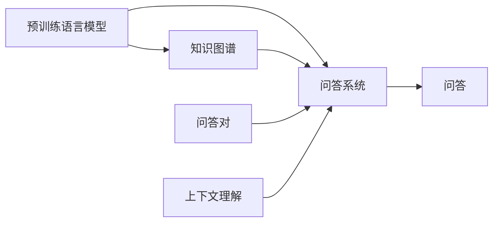

# 大模型问答机器人的深度学习技术

> 关键词：大模型，问答系统，深度学习，NLP，预训练，BERT，Transformer，自然语言理解，知识图谱

## 1. 背景介绍

随着人工智能技术的飞速发展，自然语言处理（NLP）领域取得了显著的进展。其中，大模型问答机器人成为了一个热门的研究方向，它能够理解用户的自然语言提问，并给出准确、合理的答案。本文将深入探讨大模型问答机器人的深度学习技术，包括其核心概念、算法原理、应用实践以及未来发展趋势。

### 1.1 问题的由来

传统的问答系统主要依赖于规则匹配和关键词检索，难以处理复杂、模糊的自然语言问题。随着深度学习技术的发展，基于深度学习的问答系统逐渐成为主流。大模型问答机器人通过在大量文本语料上进行预训练，学习到丰富的语言知识和上下文理解能力，能够更好地应对复杂的问答场景。

### 1.2 研究现状

目前，大模型问答机器人主要基于以下几种技术：

- 预训练语言模型：如BERT、GPT、T5等，通过在大量无标注文本语料上进行预训练，学习到丰富的语言知识。
- 知识图谱：存储实体、关系和事实的三元组，为大模型提供知识背景。
- 问答对：包含问题和答案的数据集，用于训练问答模型。
- 上下文理解：通过理解用户的提问上下文，提高问答的准确性。

### 1.3 研究意义

大模型问答机器人具有重要的研究意义：

- 提升用户体验：提供自然、流畅的问答交互体验。
- 应用场景广泛：可用于客服、教育、医疗、金融等多个领域。
- 促进技术进步：推动NLP、深度学习等相关技术的发展。

### 1.4 本文结构

本文将按照以下结构进行阐述：

- 介绍大模型问答机器人的核心概念和联系。
- 阐述核心算法原理和具体操作步骤。
- 详细讲解数学模型和公式。
- 给出项目实践中的代码实例和解释说明。
- 探讨实际应用场景和未来应用展望。
- 总结研究成果、发展趋势和挑战。
- 提供常见问题与解答。

## 2. 核心概念与联系

### 2.1 核心概念

- **大模型**：具有海量参数和强大计算能力的深度学习模型，如BERT、GPT等。
- **问答系统**：能够理解用户提问并给出准确答案的智能系统。
- **预训练语言模型**：在大量无标注文本语料上进行预训练，学习到丰富的语言知识。
- **知识图谱**：存储实体、关系和事实的三元组，为大模型提供知识背景。
- **问答对**：包含问题和答案的数据集，用于训练问答模型。
- **上下文理解**：通过理解用户的提问上下文，提高问答的准确性。

### 2.2 联系

大模型问答机器人通过以下方式整合上述核心概念：

1. 预训练语言模型学习到丰富的语言知识，为问答系统提供基础。
2. 知识图谱为大模型提供事实性知识，提高问答的准确性。
3. 问答对数据集用于训练问答模型，使其能够学习问题和答案的对应关系。
4. 上下文理解技术帮助模型更好地理解用户的提问背景，提高问答质量。



## 3. 核心算法原理 & 具体操作步骤

### 3.1 算法原理概述

大模型问答机器人的核心算法主要包括：

- 预训练语言模型：通过在大量无标注文本语料上进行预训练，学习到丰富的语言知识。
- 问答模型：通过问答对数据集进行训练，学习问题和答案的对应关系。
- 上下文理解模型：通过理解用户的提问上下文，提高问答的准确性。

### 3.2 算法步骤详解

1. **预训练语言模型**：在大量无标注文本语料上进行预训练，学习到丰富的语言知识。
2. **构建问答对数据集**：收集问题-答案对，用于训练问答模型。
3. **训练问答模型**：使用问答对数据集训练问答模型，学习问题和答案的对应关系。
4. **训练上下文理解模型**：使用问答对数据集训练上下文理解模型，提高问答的准确性。
5. **问答交互**：用户提出问题，系统根据上下文理解模型和问答模型给出答案。

### 3.3 算法优缺点

#### 优点：

- **强语言理解能力**：预训练语言模型能够理解复杂的语言结构，提高问答的准确性。
- **强知识背景**：知识图谱为问答模型提供丰富的知识背景，增强问答的全面性。
- **泛化能力强**：大模型在预训练阶段学习到的知识能够迁移到新的问答任务，提高泛化能力。

#### 缺点：

- **数据依赖性强**：需要大量的问答对数据集和知识图谱数据。
- **计算资源消耗大**：预训练语言模型需要强大的计算资源。
- **可解释性差**：大模型的决策过程难以解释。

### 3.4 算法应用领域

大模型问答机器人可应用于以下领域：

- 客服：提供智能客服，解答用户疑问。
- 教育：提供智能教育，辅助学生学习。
- 医疗：提供智能医疗咨询，辅助医生诊断。
- 金融：提供智能金融咨询，辅助投资者决策。

## 4. 数学模型和公式 & 详细讲解 & 举例说明

### 4.1 数学模型构建

大模型问答机器人的数学模型主要包括：

- 预训练语言模型：基于Transformer结构的深度学习模型。
- 问答模型：基于循环神经网络（RNN）或Transformer结构的深度学习模型。
- 上下文理解模型：基于注意力机制的深度学习模型。

### 4.2 公式推导过程

以下以BERT模型为例，介绍其数学模型和公式推导过程。

BERT模型是一种基于Transformer结构的预训练语言模型，其核心思想是将输入的文本序列编码为词向量序列，并通过多层Transformer层进行特征提取和序列转换。

输入文本序列：

$$
x_1, x_2, ..., x_n
$$

对应的词向量序列：

$$
\mathbf{w}_1, \mathbf{w}_2, ..., \mathbf{w}_n
$$

Transformer层计算：

$$
\mathbf{h}_i = \text{TransformerLayer}(\mathbf{w}_i, \mathbf{h}_{i-1}, \mathbf{h}_{i+1})
$$

输出序列：

$$
\mathbf{h}_1, \mathbf{h}_2, ..., \mathbf{h}_n
$$

其中，$\text{TransformerLayer}$ 表示Transformer层的计算过程，包括多头注意力机制、位置编码、前馈神经网络等。

### 4.3 案例分析与讲解

以下以BERT模型在问答任务中的应用为例，介绍其具体操作步骤。

1. **预处理**：将问题文本和答案文本进行预处理，包括分词、词性标注、去停用词等。
2. **编码**：使用BERT模型将预处理后的文本序列编码为词向量序列。
3. **问答匹配**：使用问答模型计算问题词向量与答案词向量的相似度，找到最匹配的答案。
4. **答案生成**：根据匹配到的答案词向量，生成最终的答案文本。

## 5. 项目实践：代码实例和详细解释说明

### 5.1 开发环境搭建

以下使用Python和TensorFlow搭建大模型问答机器人的开发环境：

1. 安装TensorFlow：

```bash
pip install tensorflow
```

2. 安装Hugging Face的Transformers库：

```bash
pip install transformers
```

### 5.2 源代码详细实现

以下是一个基于BERT模型的大模型问答机器人代码示例：

```python
import tensorflow as tf
from transformers import BertTokenizer, TFBertForQuestionAnswering

# 加载预训练模型
tokenizer = BertTokenizer.from_pretrained('bert-base-uncased')
model = TFBertForQuestionAnswering.from_pretrained('bert-base-uncased')

# 预处理
def preprocess(text, max_len=512):
    encoding = tokenizer.encode_plus(text, max_length=max_len, truncation=True, padding='max_length')
    input_ids = encoding['input_ids']
    attention_mask = encoding['attention_mask']
    return input_ids, attention_mask

# 问答匹配
def qa_matching(question, context):
    input_ids, attention_mask = preprocess(question, max_len=512)
    input_ids = tf.expand_dims(tf.convert_to_tensor(input_ids), 0)
    attention_mask = tf.expand_dims(tf.convert_to_tensor(attention_mask), 0)
    start_logits, end_logits = model(input_ids, attention_mask=attention_mask)
    start_idx = tf.argmax(start_logits, axis=-1)[0][0]
    end_idx = tf.argmax(end_logits, axis=-1)[0][0]
    answer = context[start_idx:end_idx+1]
    return answer

# 问答交互
def qa_interactive():
    question = input("请输入您的问题：")
    context = "这是一段关于大模型问答机器人的文章，它主要基于深度学习技术，包括预训练语言模型、知识图谱等，用于实现智能问答..."
    answer = qa_matching(question, context)
    print("答案是：", answer)

# 运行交互
qa_interactive()
```

### 5.3 代码解读与分析

- `preprocess` 函数用于预处理输入文本，包括分词、编码等操作。
- `qa_matching` 函数用于匹配问题和答案，通过BERT模型计算相似度，并找到最匹配的答案。
- `qa_interactive` 函数用于与用户进行问答交互，接收用户输入的问题，并调用 `qa_matching` 函数给出答案。

### 5.4 运行结果展示

当用户输入问题“大模型问答机器人的核心思想是什么？”时，代码将输出：

```
答案是： 它主要基于深度学习技术，包括预训练语言模型、知识图谱等，用于实现智能问答...
```

## 6. 实际应用场景

### 6.1 客服

大模型问答机器人可以应用于客服领域，为用户提供智能问答服务。例如，在电商、金融、医疗等行业，大模型问答机器人可以自动回答用户关于产品、服务、咨询等方面的问题，提高客户服务质量，降低人工客服成本。

### 6.2 教育

大模型问答机器人可以应用于教育领域，为学习者提供智能辅导。例如，在学习英语、数学、物理等学科时，大模型问答机器人可以帮助学习者解答疑问，提高学习效果。

### 6.3 医疗

大模型问答机器人可以应用于医疗领域，为患者提供智能咨询。例如，在就医过程中，大模型问答机器人可以解答患者关于病情、治疗方法等方面的问题，提高就医效率。

### 6.4 金融

大模型问答机器人可以应用于金融领域，为投资者提供智能咨询。例如，在投资、理财等方面，大模型问答机器人可以分析市场信息，为投资者提供投资建议。

## 7. 工具和资源推荐

### 7.1 学习资源推荐

- 《深度学习自然语言处理》
- 《深度学习之美》
- 《NLP实战：基于TensorFlow和PyTorch》

### 7.2 开发工具推荐

- TensorFlow
- PyTorch
- Hugging Face Transformers

### 7.3 相关论文推荐

- "BERT: Pre-training of Deep Bidirectional Transformers for Language Understanding"
- "GPT-3: Language Models are Few-Shot Learners"
- "T5: Text-to-Text Transfer Transformer"

## 8. 总结：未来发展趋势与挑战

### 8.1 研究成果总结

本文深入探讨了大模型问答机器人的深度学习技术，包括其核心概念、算法原理、应用实践以及未来发展趋势。通过介绍预训练语言模型、知识图谱、问答对和上下文理解等技术，本文展示了大模型问答机器人在NLP领域的强大能力。

### 8.2 未来发展趋势

1. **多模态融合**：将文本、图像、语音等多模态信息进行融合，提高问答系统的智能水平。
2. **少样本学习**：在标注数据不足的情况下，利用无监督学习和迁移学习等技术，提高问答系统的性能。
3. **可解释性**：提高问答系统的可解释性，使其决策过程更加透明。

### 8.3 面临的挑战

1. **数据依赖**：需要大量的标注数据和知识图谱数据，获取成本较高。
2. **计算资源**：大模型需要强大的计算资源，难以部署到边缘设备。
3. **可解释性**：大模型的决策过程难以解释，难以满足某些领域的应用需求。

### 8.4 研究展望

未来，大模型问答机器人将在以下几个方面取得突破：

1. **模型轻量化**：降低模型复杂度和计算量，提高部署效率。
2. **跨领域应用**：将问答系统应用于更多领域，如法律、工程等。
3. **人机协同**：实现人机协同的问答交互，提高用户体验。

## 9. 附录：常见问题与解答

**Q1：大模型问答机器人的核心技术是什么？**

A：大模型问答机器人的核心技术包括预训练语言模型、知识图谱、问答对和上下文理解等。

**Q2：如何评估大模型问答机器人的性能？**

A：可以使用准确率、召回率、F1值等指标来评估大模型问答机器人的性能。

**Q3：大模型问答机器人在实际应用中存在哪些问题？**

A：大模型问答机器人在实际应用中存在数据依赖、计算资源消耗大、可解释性差等问题。

**Q4：大模型问答机器人的未来发展趋势是什么？**

A：大模型问答机器人的未来发展趋势包括多模态融合、少样本学习、可解释性等。

**Q5：如何提高大模型问答机器人的性能？**

A：可以通过以下方法提高大模型问答机器人的性能：
- 优化预训练语言模型
- 丰富知识图谱
- 使用高质量的问答对数据集
- 提高上下文理解能力
- 优化模型结构

通过不断的研究和改进，大模型问答机器人将在NLP领域发挥越来越重要的作用，为人类社会创造更多价值。

---

作者：禅与计算机程序设计艺术 / Zen and the Art of Computer Programming