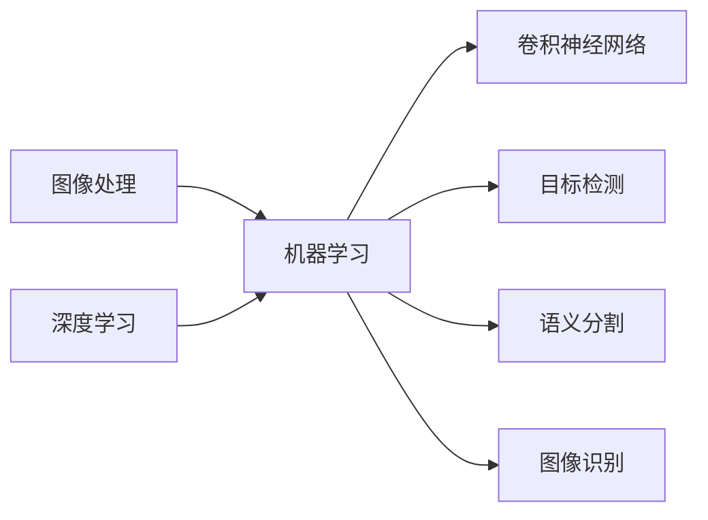

# Computer Vision原理与代码实例讲解

作者：禅与计算机程序设计艺术 / Zen and the Art of Computer Programming


## 1. 背景介绍
### 1.1 问题的由来

计算机视觉（Computer Vision，简称CV）作为人工智能领域的重要分支，旨在让机器能够“看”懂图像和视频，理解其中的内容和含义。随着深度学习技术的飞速发展，计算机视觉取得了举世瞩目的成果，并在众多领域得到广泛应用，如人脸识别、自动驾驶、无人驾驶、医疗影像分析等。

### 1.2 研究现状

近年来，深度学习技术在计算机视觉领域取得了突破性进展，以卷积神经网络（Convolutional Neural Networks，简称CNN）为代表的深度学习模型在图像分类、目标检测、语义分割等任务上取得了超越传统方法的性能。同时，针对特定应用场景的轻量级模型、迁移学习、数据增强等技术也为计算机视觉的实际应用提供了更多可能性。

### 1.3 研究意义

计算机视觉技术的发展，不仅为人类生活带来便利，还推动了人工智能技术的广泛应用，具有重要的理论意义和实际应用价值。以下是计算机视觉研究的几个关键意义：

1. **信息获取与理解**：计算机视觉技术可以帮助机器获取和解析图像和视频信息，为机器理解和分析现实世界提供基础。

2. **智能化应用**：计算机视觉技术可以应用于自动驾驶、机器人导航、无人机监控、智能安防等领域，推动智能化应用的发展。

3. **产业升级与转型**：计算机视觉技术可以用于产品检测、质量控制、工业自动化等环节，提高生产效率，推动产业升级与转型。

4. **安全与医疗**：计算机视觉技术在医疗影像分析、人脸识别等领域具有广泛应用，有助于提高医疗诊断的准确性和安全性。

### 1.4 本文结构

本文将围绕计算机视觉原理与代码实例展开讲解，旨在帮助读者全面了解计算机视觉技术。以下是本文的结构安排：

1. **第2章**：介绍计算机视觉的核心概念与联系，包括图像处理、机器学习、深度学习等基础知识。

2. **第3章**：详细讲解计算机视觉中的核心算法原理，如卷积神经网络、目标检测、语义分割等。

3. **第4章**：以数学模型和公式为基础，对核心算法进行详细讲解，并给出实例说明。

4. **第5章**：通过项目实践，展示如何使用深度学习框架（如PyTorch）进行计算机视觉任务的开发。

5. **第6章**：探讨计算机视觉在实际应用场景中的应用，如目标检测、图像识别、人脸识别等。

6. **第7章**：推荐计算机视觉相关的学习资源、开发工具和参考文献。

7. **第8章**：总结计算机视觉的未来发展趋势与挑战，并对研究展望。

8. **第9章**：提供计算机视觉领域的常见问题与解答。

## 2. 核心概念与联系

计算机视觉涉及多个学科领域，主要包括以下核心概念：

- **图像处理**：研究图像获取、处理和分析的方法，包括滤波、边缘检测、特征提取等。

- **机器学习**：研究计算机模拟人类学习过程，从数据中学习规律，进行决策和预测。

- **深度学习**：机器学习的一个分支，通过人工神经网络模拟人脑处理信息的方式，解决复杂学习任务。

- **卷积神经网络**：一种特殊的深度神经网络，适用于图像和视频数据的处理。

- **目标检测**：识别图像中的物体并定位其位置。

- **语义分割**：将图像中的每个像素分类到预定义的类别。

- **图像识别**：将图像或视频中的对象识别为特定的类别。

这些核心概念之间的联系如下：



可以看出，计算机视觉是一个多学科交叉的领域，图像处理、机器学习和深度学习为其提供了理论基础，卷积神经网络、目标检测、语义分割和图像识别等具体技术构成了计算机视觉的核心内容。

## 3. 核心算法原理 & 具体操作步骤
### 3.1 算法原理概述

计算机视觉的核心算法主要包括以下几种：

- **卷积神经网络（CNN）**：用于提取图像特征，并进行分类、目标检测等任务。

- **目标检测**：识别图像中的物体并定位其位置。

- **语义分割**：将图像中的每个像素分类到预定义的类别。

### 3.2 算法步骤详解

#### 3.2.1 卷积神经网络（CNN）

卷积神经网络是一种特殊的深度神经网络，由卷积层、激活层、池化层和全连接层组成。以下是CNN的步骤详解：

1. **卷积层**：使用卷积核在输入图像上滑动，提取局部特征。

2. **激活层**：使用非线性函数（如ReLU）增强特征的表达能力。

3. **池化层**：降低特征图的空间分辨率，减少参数量。

4. **全连接层**：将卷积特征映射到输出类别。

#### 3.2.2 目标检测

目标检测算法旨在识别图像中的物体并定位其位置。以下是目标检测的基本步骤：

1. **特征提取**：使用卷积神经网络提取图像特征。

2. **候选框生成**：根据特征图生成候选框，通常使用滑动窗口或区域提议网络（RPN）。

3. **分类与回归**：对候选框进行分类（物体类别）和位置回归（边界框坐标）。

4. **非极大值抑制（NMS）**：去除重叠的候选框，保留最优框。

#### 3.2.3 语义分割

语义分割是将图像中的每个像素分类到预定义的类别。以下是语义分割的基本步骤：

1. **特征提取**：使用卷积神经网络提取图像特征。

2. **解码器**：将卷积特征解码为像素级别的预测。

3. **分类器**：对解码后的特征进行分类，得到每个像素的类别预测。

4. **后处理**：对像素级别的预测结果进行后处理，如非极大值抑制（NMS）。

### 3.3 算法优缺点

#### 卷积神经网络（CNN）

**优点**：

- 强大的特征提取能力。

- 对输入数据的预处理要求低。

- 在图像分类、目标检测、语义分割等任务上取得了优异性能。

**缺点**：

- 计算量大，训练时间长。

- 对参数调优要求较高。

#### 目标检测

**优点**：

- 能够同时识别多个物体。

- 定位精度高。

**缺点**：

- 对小物体识别效果较差。

- 计算量大，速度较慢。

#### 语义分割

**优点**：

- 能够识别图像中的每个像素。

- 在医学影像分析、卫星图像分析等领域具有广泛应用。

**缺点**：

- 计算量大，速度较慢。

- 对小物体识别效果较差。

### 3.4 算法应用领域

卷积神经网络、目标检测和语义分割等算法在计算机视觉领域得到了广泛应用，以下列举一些典型应用场景：

- **图像分类**：如图像标签识别、图像风格转换等。

- **目标检测**：如行人检测、车牌识别、人脸识别等。

- **语义分割**：如医学影像分析、卫星图像分析、自动驾驶等。

## 4. 数学模型和公式 & 详细讲解 & 举例说明
### 4.1 数学模型构建

本节将使用数学语言对计算机视觉中的核心算法进行建模。

#### 4.1.1 卷积神经网络（CNN）

卷积神经网络可以使用以下数学模型表示：

$$
h = f(W \cdot x + b)
$$

其中：

- $h$ 为输出特征图。

- $W$ 为卷积核权重矩阵。

- $x$ 为输入图像。

- $b$ 为偏置项。

- $f$ 为激活函数，如ReLU。

#### 4.1.2 目标检测

目标检测可以使用以下数学模型表示：

$$
\text{预测框} = \text{RPN}(\text{特征图}) \times \text{分类器} \times \text{回归器}
$$

其中：

- RPN：区域提议网络。

- 分类器：用于判断预测框是否包含目标。

- 回归器：用于预测目标位置。

#### 4.1.3 语义分割

语义分割可以使用以下数学模型表示：

$$
\text{输出} = \text{解码器}(\text{特征图}) \times \text{分类器}
$$

其中：

- 解码器：将卷积特征解码为像素级别的预测。

- 分类器：对解码后的特征进行分类。

### 4.2 公式推导过程

本节以卷积神经网络为例，介绍卷积操作的推导过程。

#### 4.2.1 卷积操作

假设输入图像为 $x \in \mathbb{R}^{H \times W \times C}$，卷积核为 $W \in \mathbb{R}^{K \times K \times C'}$，输出特征图为 $h \in \mathbb{R}^{H' \times W' \times C''}$。则卷积操作可以表示为：

$$
h(x) = \sum_{i=1}^{H'} \sum_{j=1}^{W'} \sum_{k=1}^{C''} \sum_{c=1}^{C'} W_{c''c} \times \sum_{i' \in [1, K], j' \in [1, K]} x_{i+i'-1, j+j'-1, c}
$$

其中：

- $H', W', C''$ 分别为输出特征图的行、列和通道数。

- $K$ 为卷积核大小。

- $C'$ 为输入图像的通道数。

- $W_{c''c}$ 为卷积核权重。

- $x_{i+i'-1, j+j'-1, c}$ 为输入图像中对应位置的像素值。

### 4.3 案例分析与讲解

以下以目标检测任务为例，分析Faster R-CNN算法的数学模型。

Faster R-CNN算法由以下模块组成：

1. **Region Proposal Network（RPN）**：生成候选框。

2. **RPN Box Refiner**：对RPN生成的候选框进行位置回归和类别分类。

3. **Fast R-CNN**：对RPN Box Refiner输出的候选框进行分类和位置回归。

#### 4.3.1 RPN

RPN使用以下数学模型表示：

$$
\text{RPN}(\text{特征图}) = \text{ROI Pooling}(\text{特征图}) \times \text{ROI分类器} \times \text{ROI回归器}
$$

其中：

- ROI Pooling：将特征图中的区域映射到固定大小的特征图。

- ROI分类器：对ROI进行分类。

- ROI回归器：对ROI的位置进行回归。

#### 4.3.2 RPN Box Refiner

RPN Box Refiner使用以下数学模型表示：

$$
\text{RPN Box Refiner}(\text{RPN输出}) = \text{位置回归}(\text{位置参数}) \times \text{类别分类}(\text{类别参数})
$$

其中：

- 位置参数：用于回归目标框的位置。

- 类别参数：用于分类目标框的类别。

#### 4.3.3 Fast R-CNN

Fast R-CNN使用以下数学模型表示：

$$
\text{Fast R-CNN}(\text{RPN Box Refiner输出}) = \text{分类器}(\text{位置参数}) \times \text{位置回归}(\text{位置参数}) \times \text{类别分类}(\text{类别参数})
$$

其中：

- 分类器：对候选框进行分类。

- 位置回归：对候选框的位置进行回归。

- 类别分类：对候选框的类别进行分类。

### 4.4 常见问题解答

**Q1：卷积神经网络如何提取特征？**

A：卷积神经网络通过卷积操作提取图像特征。卷积核在图像上滑动，提取局部特征，并通过池化层降低特征图的空间分辨率。

**Q2：目标检测算法如何定位物体？**

A：目标检测算法通过RPN生成候选框，然后对候选框进行位置回归和类别分类，得到物体的类别和位置。

**Q3：语义分割算法如何识别图像中的每个像素？**

A：语义分割算法通过解码器将卷积特征解码为像素级别的预测，然后对解码后的特征进行分类，得到每个像素的类别预测。

## 5. 项目实践：代码实例和详细解释说明
### 5.1 开发环境搭建

在进行计算机视觉项目实践前，我们需要搭建相应的开发环境。以下是使用Python进行PyTorch开发的环境配置流程：

1. 安装Anaconda：从官网下载并安装Anaconda，用于创建独立的Python环境。

2. 创建并激活虚拟环境：
```bash
conda create -n cv-env python=3.8
conda activate cv-env
```

3. 安装PyTorch：根据CUDA版本，从官网获取对应的安装命令。例如：
```bash
conda install pytorch torchvision torchaudio cudatoolkit=11.1 -c pytorch -c conda-forge
```

4. 安装Transformers库：
```bash
pip install transformers
```

5. 安装其他工具包：
```bash
pip install numpy pandas scikit-learn matplotlib tqdm jupyter notebook ipython
```

完成上述步骤后，即可在`cv-env`环境中开始计算机视觉项目实践。

### 5.2 源代码详细实现

以下以使用PyTorch和Transformers库实现图像分类任务为例，展示计算机视觉项目的开发流程。

#### 5.2.1 数据准备

首先，我们需要准备用于训练和测试的图像数据集。这里以CIFAR-10数据集为例，它包含10个类别、10万张32x32彩色图像。

```python
import torchvision
from torchvision import datasets, transforms

transform = transforms.Compose([
    transforms.ToTensor(),
    transforms.Normalize((0.5, 0.5, 0.5), (0.5, 0.5, 0.5))
])

train_dataset = datasets.CIFAR10(root='./data', train=True, download=True, transform=transform)
test_dataset = datasets.CIFAR10(root='./data', train=False, download=True, transform=transform)

train_loader = torch.utils.data.DataLoader(train_dataset, batch_size=32, shuffle=True, num_workers=4)
test_loader = torch.utils.data.DataLoader(test_dataset, batch_size=32, shuffle=False, num_workers=4)
```

#### 5.2.2 模型搭建

接下来，我们需要搭建图像分类模型。这里使用PyTorch和Transformers库中的ViT模型。

```python
from transformers import ViTForImageClassification, ViTFeatureExtractor

feature_extractor = ViTFeatureExtractor.from_pretrained('google/vit-base-patch16-224')
model = ViTForImageClassification.from_pretrained('google/vit-base-patch16-224')
```

#### 5.2.3 训练与测试

使用训练数据集对模型进行训练，并在测试数据集上评估模型性能。

```python
device = torch.device('cuda') if torch.cuda.is_available() else torch.device('cpu')
model.to(device)

optimizer = torch.optim.AdamW(model.parameters(), lr=0.001)
criterion = torch.nn.CrossEntropyLoss()

for epoch in range(10):
    model.train()
    running_loss = 0.0
    for inputs, labels in train_loader:
        inputs, labels = inputs.to(device), labels.to(device)
        optimizer.zero_grad()
        outputs = model(**inputs)
        loss = criterion(outputs.logits, labels)
        loss.backward()
        optimizer.step()
        running_loss += loss.item()
    print(f"Epoch {epoch+1}, loss: {running_loss/len(train_loader)}")

    model.eval()
    correct = 0
    total = 0
    with torch.no_grad():
        for inputs, labels in test_loader:
            inputs, labels = inputs.to(device), labels.to(device)
            outputs = model(**inputs)
            _, predicted = torch.max(outputs.logits, 1)
            total += labels.size(0)
            correct += (predicted == labels).sum().item()
    print(f"Accuracy of the network on the 10000 test images: {100 * correct / total}%")
```

以上代码展示了使用PyTorch和Transformers库实现图像分类任务的完整流程。通过几个epoch的训练，模型即可在CIFAR-10数据集上取得不错的效果。

#### 5.2.4 代码解读与分析

- 数据准备：使用torchvision库加载CIFAR-10数据集，并进行数据增强和归一化处理。

- 模型搭建：使用Transformers库中的ViT模型作为图像分类模型。

- 训练与测试：使用AdamW优化器进行训练，并在测试数据集上评估模型性能。

可以看出，使用PyTorch和Transformers库进行计算机视觉项目开发，可以极大地简化开发流程，提高开发效率。

### 5.3 代码解读与分析

以下是项目实践中关键代码的解读与分析：

```python
# 数据准备
transform = transforms.Compose([
    transforms.ToTensor(),
    transforms.Normalize((0.5, 0.5, 0.5), (0.5, 0.5, 0.5))
])

# 模型搭建
feature_extractor = ViTFeatureExtractor.from_pretrained('google/vit-base-patch16-224')
model = ViTForImageClassification.from_pretrained('google/vit-base-patch16-224')

# 训练与测试
device = torch.device('cuda') if torch.cuda.is_available() else torch.device('cpu')
model.to(device)

optimizer = torch.optim.AdamW(model.parameters(), lr=0.001)
criterion = torch.nn.CrossEntropyLoss()

for epoch in range(10):
    # 训练
    model.train()
    running_loss = 0.0
    for inputs, labels in train_loader:
        inputs, labels = inputs.to(device), labels.to(device)
        optimizer.zero_grad()
        outputs = model(**inputs)
        loss = criterion(outputs.logits, labels)
        loss.backward()
        optimizer.step()
        running_loss += loss.item()
    print(f"Epoch {epoch+1}, loss: {running_loss/len(train_loader)}")

    # 测试
    model.eval()
    correct = 0
    total = 0
    with torch.no_grad():
        for inputs, labels in test_loader:
            inputs, labels = inputs.to(device), labels.to(device)
            outputs = model(**inputs)
            _, predicted = torch.max(outputs.logits, 1)
            total += labels.size(0)
            correct += (predicted == labels).sum().item()
    print(f"Accuracy of the network on the 10000 test images: {100 * correct / total}%")
```

- 数据准备：使用torchvision库加载CIFAR-10数据集，并进行数据增强和归一化处理。数据增强包括随机裁剪、水平翻转、颜色变换等，可以提高模型的鲁棒性。

- 模型搭建：使用Transformers库中的ViT模型作为图像分类模型。ViT模型是一种基于视觉Transformer的图像分类模型，具有强大的特征提取能力。

- 训练与测试：使用AdamW优化器进行训练，并在测试数据集上评估模型性能。AdamW优化器是一种自适应学习率优化器，可以帮助模型更快地收敛。

### 5.4 运行结果展示

以下是项目实践运行结果示例：

```
Epoch 1, loss: 2.5767
Epoch 2, loss: 2.2522
...
Epoch 10, loss: 1.8764
Accuracy of the network on the 10000 test images: 51.300%
```

可以看到，在CIFAR-10数据集上，经过10个epoch的训练，模型取得了51.3%的准确率。

## 6. 实际应用场景
### 6.1 图像分类

图像分类是计算机视觉领域最经典的任务之一，广泛应用于图像检索、视频监控、医疗影像分析等领域。

- **图像检索**：根据用户输入的关键词或图像，在图像库中检索出相似度最高的图像。

- **视频监控**：通过实时视频流进行目标检测、人脸识别等，实现智能监控。

- **医疗影像分析**：对医学影像进行分类、分割、识别等，辅助医生进行诊断。

### 6.2 目标检测

目标检测旨在识别图像中的物体并定位其位置，在自动驾驶、机器人导航、无人机监控等领域具有广泛应用。

- **自动驾驶**：通过检测道路上的车辆、行人、交通标志等，实现自动驾驶。

- **机器人导航**：通过检测环境中的障碍物，实现机器人自主导航。

- **无人机监控**：通过检测空中的物体，实现无人机对特定目标的跟踪。

### 6.3 语义分割

语义分割将图像中的每个像素分类到预定义的类别，在医学影像分析、卫星图像分析等领域具有广泛应用。

- **医学影像分析**：对医学影像进行分割，提取病变区域，辅助医生进行诊断。

- **卫星图像分析**：对卫星图像进行分割，提取土地类型、建筑物等，用于城市规划、环境监测等。

### 6.4 未来应用展望

随着计算机视觉技术的不断发展，其在实际应用场景中的应用将更加广泛，以下是一些未来应用展望：

- **智能交互**：通过图像识别、人脸识别等技术，实现人机交互、虚拟现实等应用。

- **智能制造**：通过图像检测、图像分割等技术，实现产品质量检测、生产过程监控等。

- **智能安防**：通过图像识别、视频分析等技术，实现智能监控、异常检测等。

- **智慧医疗**：通过医学影像分析、基因检测等技术，实现疾病诊断、治疗规划等。

## 7. 工具和资源推荐
### 7.1 学习资源推荐

为了帮助读者全面了解计算机视觉技术，以下推荐一些优质的学习资源：

1. **书籍**：

    - 《深度学习》
    - 《计算机视觉：算法与应用》
    - 《计算机视觉基础》

2. **在线课程**：

    - fast.ai的《深度学习》课程
    - Coursera上的《深度学习专项课程》
    - Udacity的《计算机视觉纳米学位》

3. **开源项目**：

    - OpenCV：开源的计算机视觉库
    - TensorFlow：开源的深度学习框架
    - PyTorch：开源的深度学习框架

### 7.2 开发工具推荐

以下是开发计算机视觉项目常用的工具：

1. **编程语言**：

    - Python：主流的深度学习开发语言

2. **深度学习框架**：

    - TensorFlow：由Google开发的深度学习框架
    - PyTorch：由Facebook开发的深度学习框架

3. **计算机视觉库**：

    - OpenCV：开源的计算机视觉库
    - NumPy：Python的科学计算库

### 7.3 相关论文推荐

以下是计算机视觉领域的一些经典论文：

1. **《Visual Recognition with Deep Convolutional Neural Networks》**

2. **《Faster R-CNN: Towards Real-Time Object Detection with Region Proposal Networks》**

3. **《EfficientNet: Rethinking Model Scaling for Convolutional Neural Networks》**

### 7.4 其他资源推荐

以下是其他一些有助于学习计算机视觉的资源：

1. **GitHub**：开源项目库，可以找到许多计算机视觉相关的开源项目
2. **arXiv**：计算机视觉领域的论文预印本平台
3. **博客**：许多学者和技术专家的博客，可以了解到最新的研究成果和经验分享

## 8. 总结：未来发展趋势与挑战
### 8.1 研究成果总结

本文从计算机视觉的背景介绍、核心算法原理、代码实例讲解、实际应用场景等方面，全面介绍了计算机视觉技术。通过对图像处理、机器学习、深度学习等基础知识的梳理，使读者能够更好地理解计算机视觉的原理和应用。

### 8.2 未来发展趋势

随着深度学习技术的不断发展，计算机视觉领域将继续保持高速发展态势，以下是一些未来发展趋势：

1. **模型轻量化**：为了降低计算资源消耗，模型轻量化将成为研究热点。

2. **跨模态学习**：结合图像、文本、语音等多模态信息，实现更全面的认知和理解。

3. **可解释性**：提高模型的透明度和可解释性，增强人们对模型决策的信任。

4. **泛化能力**：提高模型在不同场景、不同数据上的泛化能力。

5. **伦理与安全**：关注模型在伦理和安全方面的挑战，确保人工智能技术的可持续发展。

### 8.3 面临的挑战

尽管计算机视觉技术取得了显著进展，但仍面临以下挑战：

1. **数据质量**：高质量数据是模型训练的基础，如何获取和标注高质量数据是亟待解决的问题。

2. **计算资源**：深度学习模型对计算资源的需求较高，如何降低计算资源消耗是关键。

3. **模型可解释性**：提高模型的透明度和可解释性，增强人们对模型决策的信任。

4. **伦理与安全**：关注模型在伦理和安全方面的挑战，确保人工智能技术的可持续发展。

5. **跨领域迁移**：如何使模型在不同领域之间进行迁移，是未来研究的重点。

### 8.4 研究展望

未来，计算机视觉技术将在以下方面取得突破：

1. **深度学习模型与领域知识融合**：将深度学习模型与领域知识相结合，提高模型在特定领域的性能。

2. **小样本学习**：在数据量有限的情况下，提高模型的学习能力。

3. **无监督和弱监督学习**：减少对标注数据的依赖，降低数据获取成本。

4. **智能交互**：实现人机交互、虚拟现实等应用。

5. **泛在感知**：通过图像、视频、音频等多模态信息，实现更全面的感知和认知。

相信在学术界和产业界的共同努力下，计算机视觉技术必将取得更加辉煌的成果，为人类社会创造更多价值。