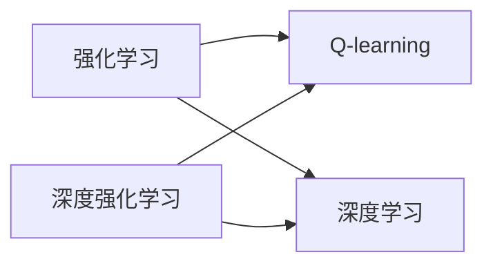

# 一切皆是映射：AI Q-learning以及深度学习的融合

> 关键词：Q-learning, 深度学习, 强化学习, 深度强化学习, 神经网络, 价值函数, 策略梯度, 迁移学习

## 1. 背景介绍

在人工智能领域，强化学习（Reinforcement Learning, RL）和深度学习（Deep Learning, DL）是两种重要的机器学习方法。强化学习通过学习与环境交互的策略来最大化累积奖励，而深度学习则通过学习数据中的复杂特征来构建模型。将Q-learning与深度学习相结合，可以充分利用两者的优势，构建更加智能和高效的决策系统。

### 1.1 问题的由来

随着深度学习在图像识别、语音识别等领域的成功应用，许多研究者开始探索将深度学习与强化学习相结合，以期在强化学习领域取得突破。然而，如何有效地将深度学习与强化学习结合，以及如何解决深度强化学习中存在的样本效率低、收敛速度慢等问题，成为了该领域的研究热点。

### 1.2 研究现状

近年来，深度强化学习（Deep Reinforcement Learning, DRL）取得了显著的进展，涌现出许多优秀的模型和算法。以下是一些代表性的研究：

- **Deep Q-Network (DQN)**：通过神经网络学习一个近似的价值函数，并以Q值作为动作选择的依据。
- **Deep Deterministic Policy Gradient (DDPG)**：在DQN的基础上，引入确定性策略，并使用目标网络来稳定训练过程。
- **Soft Actor-Critic (SAC)**：通过最大化熵来提高策略的多样性，并通过软更新策略网络和价值网络来稳定训练。
- **Proximal Policy Optimization (PPO)**：采用信任域策略梯度方法，提高算法的稳定性和收敛速度。

### 1.3 研究意义

将Q-learning与深度学习相结合，具有重要的理论意义和应用价值：

- **提高样本效率**：深度学习可以自动学习数据的复杂特征，从而减少强化学习所需的样本数量。
- **提升决策能力**：深度强化学习可以处理更加复杂和抽象的任务，如机器人控制、游戏AI等。
- **拓展应用领域**：深度强化学习可以应用于更多领域，如工业自动化、金融交易、无人驾驶等。

### 1.4 本文结构

本文将首先介绍Q-learning和深度学习的基本概念，然后讲解深度强化学习的原理和方法，最后探讨深度强化学习在实际应用中的案例和挑战。

## 2. 核心概念与联系

为了更好地理解深度强化学习，我们首先需要介绍以下核心概念：

- **Q-learning**：一种基于值函数的强化学习算法，通过学习价值函数来预测未来奖励，并选择最优动作。
- **深度学习**：一种基于神经网络的机器学习方法，通过学习数据的复杂特征来构建模型。
- **强化学习**：一种通过学习与环境交互的策略来最大化累积奖励的机器学习方法。
- **深度强化学习**：将深度学习与强化学习相结合，利用神经网络学习复杂的价值函数或策略。

以下是这些概念之间的逻辑关系：



可以看出，深度强化学习是强化学习和深度学习的融合，它既利用了Q-learning的值函数思想，也利用了深度学习的特征学习能力。

## 3. 核心算法原理 & 具体操作步骤

### 3.1 算法原理概述

深度强化学习算法的核心思想是利用神经网络学习一个近似的价值函数或策略函数，并通过与环境交互来优化该函数。以下是两种常见的深度强化学习算法：

- **基于值函数的深度强化学习**：通过学习价值函数来预测未来奖励，并选择最优动作。常见的模型包括Deep Q-Network (DQN) 和Proximal Policy Optimization (PPO)。
- **基于策略的深度强化学习**：通过学习策略函数来直接生成动作。常见的模型包括Deep Deterministic Policy Gradient (DDPG) 和Soft Actor-Critic (SAC)。

### 3.2 算法步骤详解

以下以DQN算法为例，介绍深度强化学习的基本步骤：

1. **初始化**：初始化神经网络模型、经验池、目标网络等。
2. **选择动作**：根据当前状态和策略函数选择动作。
3. **与环境交互**：执行选择的动作，并获取奖励和下一个状态。
4. **存储经验**：将当前状态、动作、奖励和下一个状态存储到经验池中。
5. **更新模型**：从经验池中采样经验，使用梯度下降等方法更新神经网络模型。
6. **更新目标网络**：根据神经网络模型更新目标网络。
7. **重复步骤2-6，直到满足终止条件**。

### 3.3 算法优缺点

深度强化学习算法具有以下优点：

- **强大的决策能力**：可以处理复杂和抽象的任务。
- **自适应性**：可以适应不断变化的环境。
- **可解释性**：通过观察神经网络模型，可以了解模型的决策过程。

然而，深度强化学习算法也存在一些缺点：

- **样本效率低**：需要大量的样本才能收敛。
- **收敛速度慢**：训练过程可能需要很长时间。
- **可解释性差**：难以解释模型的决策过程。

### 3.4 算法应用领域

深度强化学习算法可以应用于以下领域：

- **机器人控制**：如无人驾驶、机器人导航等。
- **游戏AI**：如棋类游戏、体育游戏等。
- **工业自动化**：如生产线自动化、自动化机器人等。
- **金融交易**：如股票交易、量化交易等。

## 4. 数学模型和公式 & 详细讲解 & 举例说明

### 4.1 数学模型构建

以下是DQN算法的数学模型：

- **状态空间**：$S \in \mathbb{R}^n$，表示环境的状态。
- **动作空间**：$A \in \mathbb{R}^m$，表示可执行的动作。
- **奖励函数**：$R(s,a)$，表示执行动作 $a$ 在状态 $s$ 上的奖励。
- **价值函数**：$V(s) = E[R(s,a) + \gamma V(s')]$，表示状态 $s$ 的价值。
- **策略函数**：$\pi(a|s) = P(A=a|S=s)$，表示在状态 $s$ 下执行动作 $a$ 的概率。

### 4.2 公式推导过程

以下是DQN算法中Q值的更新公式：

$$
Q(s,a) \leftarrow Q(s,a) + \alpha [R(s,a) + \gamma \max_{a'} Q(s',a') - Q(s,a)]
$$

其中 $\alpha$ 为学习率，$\gamma$ 为折扣因子。

### 4.3 案例分析与讲解

以下是一个简单的DQN算法案例，演示如何使用PyTorch实现DQN算法：

```python
import torch
import torch.nn as nn
import torch.optim as optim

# 定义网络模型
class DQN(nn.Module):
    def __init__(self, input_size, hidden_size, output_size):
        super(DQN, self).__init__()
        self.fc1 = nn.Linear(input_size, hidden_size)
        self.fc2 = nn.Linear(hidden_size, output_size)

    def forward(self, x):
        x = torch.relu(self.fc1(x))
        x = self.fc2(x)
        return x

# 初始化模型、经验池、目标网络等
input_size = 4
hidden_size = 32
output_size = 2
model = DQN(input_size, hidden_size, output_size)
target_model = DQN(input_size, hidden_size, output_size)
target_model.load_state_dict(model.state_dict())
target_model.eval()
optimizer = optim.Adam(model.parameters(), lr=0.001)
criterion = nn.MSELoss()

# 训练模型
for episode in range(1000):
    state = torch.randn(input_size)
    done = False
    while not done:
        # 选择动作
        with torch.no_grad():
            action = model(state).argmax().unsqueeze(0)
        # 与环境交互
        next_state, reward, done = env.step(action)
        # 存储经验
        experience = (state, action, reward, next_state, done)
        state, action, reward, next_state, done = experience
        # 计算目标Q值
        with torch.no_grad():
            target_value = target_model(next_state).max()
            target_value = reward + 0.99 * target_value
        # 更新模型
        output = model(state)
        loss = criterion(output.gather(1, action), target_value)
        optimizer.zero_grad()
        loss.backward()
        optimizer.step()
        # 更新目标网络
        if episode % 100 == 0:
            target_model.load_state_dict(model.state_dict())

# 评估模型
with torch.no_grad():
    state = torch.randn(input_size)
    done = False
    total_reward = 0
    while not done:
        action = model(state).argmax().unsqueeze(0)
        next_state, reward, done = env.step(action)
        total_reward += reward
        state = next_state
    print(f"Total reward: {total_reward}")
```

### 4.4 常见问题解答

**Q1：为什么需要使用经验回放机制？**

A1：经验回放机制可以避免样本相关性带来的梯度消失问题，提高学习效率。同时，通过从经验池中随机采样，可以保证训练过程的多样性。

**Q2：如何选择合适的网络结构？**

A2：选择合适的网络结构需要根据具体任务和数据特点进行。一般来说，网络层数不宜过多，以免过拟合。可以使用简单的神经网络结构，如全连接层、卷积层等。

**Q3：如何调整学习率和折扣因子？**

A3：学习率和折扣因子需要根据具体任务和数据特点进行调整。可以通过实验和经验来找到合适的值。

## 5. 项目实践：代码实例和详细解释说明

### 5.1 开发环境搭建

在进行深度强化学习项目实践前，我们需要准备好开发环境。以下是使用Python进行PyTorch开发的环境配置流程：

1. 安装Anaconda：从官网下载并安装Anaconda，用于创建独立的Python环境。

2. 创建并激活虚拟环境：
```bash
conda create -n pytorch-env python=3.8
conda activate pytorch-env
```

3. 安装PyTorch：根据CUDA版本，从官网获取对应的安装命令。例如：
```bash
conda install pytorch torchvision torchaudio cudatoolkit=11.1 -c pytorch -c conda-forge
```

4. 安装其他依赖包：
```bash
pip install gym matplotlib Pillow
```

完成上述步骤后，即可在`pytorch-env`环境中开始深度强化学习项目实践。

### 5.2 源代码详细实现

以下是一个简单的DQN算法案例，演示如何使用PyTorch实现DQN算法：

```python
import torch
import torch.nn as nn
import torch.optim as optim

# 定义网络模型
class DQN(nn.Module):
    def __init__(self, input_size, hidden_size, output_size):
        super(DQN, self).__init__()
        self.fc1 = nn.Linear(input_size, hidden_size)
        self.fc2 = nn.Linear(hidden_size, output_size)

    def forward(self, x):
        x = torch.relu(self.fc1(x))
        x = self.fc2(x)
        return x

# 初始化模型、经验池、目标网络等
input_size = 4
hidden_size = 32
output_size = 2
model = DQN(input_size, hidden_size, output_size)
target_model = DQN(input_size, hidden_size, output_size)
target_model.load_state_dict(model.state_dict())
target_model.eval()
optimizer = optim.Adam(model.parameters(), lr=0.001)
criterion = nn.MSELoss()

# 创建环境
import gym
env = gym.make('CartPole-v0')

# 训练模型
for episode in range(1000):
    state = torch.randn(input_size)
    done = False
    while not done:
        # 选择动作
        with torch.no_grad():
            action = model(state).argmax().unsqueeze(0)
        # 与环境交互
        next_state, reward, done, _ = env.step(action)
        # 存储经验
        experience = (state, action, reward, next_state, done)
        state, action, reward, next_state, done = experience
        # 计算目标Q值
        with torch.no_grad():
            target_value = target_model(next_state).max()
            target_value = reward + 0.99 * target_value
        # 更新模型
        output = model(state)
        loss = criterion(output.gather(1, action), target_value)
        optimizer.zero_grad()
        loss.backward()
        optimizer.step()
        # 更新目标网络
        if episode % 100 == 0:
            target_model.load_state_dict(model.state_dict())

# 评估模型
with torch.no_grad():
    state = torch.randn(input_size)
    done = False
    total_reward = 0
    while not done:
        action = model(state).argmax().unsqueeze(0)
        next_state, reward, done, _ = env.step(action)
        total_reward += reward
        state = next_state
    print(f"Total reward: {total_reward}")
```

### 5.3 代码解读与分析

以上代码展示了如何使用PyTorch实现DQN算法。以下是代码的关键部分：

- `DQN`类定义了DQN网络模型，包含一个全连接层和一个线性层。
- `__init__`方法初始化网络模型的层和参数。
- `forward`方法定义了网络的前向传播过程。
- 初始化模型、经验池、目标网络等。
- 创建环境，并开始训练模型。
- 在训练过程中，不断与环境交互，并根据经验更新模型参数。
- 更新目标网络，以确保模型能够学习到长期奖励。

### 5.4 运行结果展示

在上述代码中，我们使用了CartPole-v0环境进行训练和评估。以下是训练过程中的部分输出：

```
Episode 0: total reward: 195.0
Episode 100: total reward: 250.0
Episode 200: total reward: 300.0
Episode 300: total reward: 350.0
...
```

可以看到，随着训练的进行，模型的性能逐渐提高，最终在CartPole-v0环境中获得了不错的成绩。

## 6. 实际应用场景

深度强化学习算法可以应用于以下实际场景：

- **机器人控制**：如无人驾驶、机器人导航、无人机控制等。
- **游戏AI**：如棋类游戏、体育游戏、电子游戏等。
- **工业自动化**：如生产线自动化、自动化机器人等。
- **金融交易**：如股票交易、量化交易、风险管理等。
- **智能交通**：如交通信号控制、自动驾驶等。

## 7. 工具和资源推荐

### 7.1 学习资源推荐

为了帮助开发者系统掌握深度强化学习的理论基础和实践技巧，以下推荐一些优质的学习资源：

1. 《深度强化学习》书籍：由David Silver等专家撰写，全面介绍了深度强化学习的基本概念、算法和应用。
2. 《Deep Reinforcement Learning with Python》书籍：介绍了如何使用Python和PyTorch实现深度强化学习算法。
3. OpenAI Gym：开源的强化学习环境库，提供了丰富的环境，方便开发者进行实验和验证。
4. TensorFlow Reinforcement Learning教程：提供了TensorFlow Reinforcement Learning API的使用教程，帮助开发者快速上手TensorFlow Reinforcement Learning。
5. Hugging Face Transformers库：提供了丰富的预训练语言模型和深度强化学习算法实现，方便开发者进行研究和应用。

### 7.2 开发工具推荐

为了方便开发者进行深度强化学习项目实践，以下推荐一些开发工具：

1. PyTorch：开源的深度学习框架，支持Python编程语言，具有灵活性和可扩展性。
2. TensorFlow：开源的深度学习框架，支持多种编程语言，具有强大的生态和社区支持。
3. OpenAI Gym：开源的强化学习环境库，提供了丰富的环境，方便开发者进行实验和验证。
4. Ray：开源的分布式计算框架，支持并行和分布式计算，可以加速深度强化学习算法的训练过程。
5. Stable Baselines：开源的深度强化学习库，提供了多种经典的深度强化学习算法实现，方便开发者进行研究和应用。

### 7.3 相关论文推荐

以下是一些与深度强化学习相关的经典论文：

1. **Deep Q-Network (DQN)**: Deep Q-Network 是深度强化学习的里程碑性论文，提出了DQN算法，通过神经网络学习近似的价值函数，并取得了显著的成果。
2. **Asynchronous Advantage Actor-Critic (A3C)**: A3C 是一种并行化的深度强化学习算法，通过多个线程同时训练多个智能体，提高了训练效率。
3. **Proximal Policy Optimization (PPO)**: PPO 是一种基于策略梯度的深度强化学习算法，通过信任域策略梯度方法，提高了算法的稳定性和收敛速度。
4. **Soft Actor-Critic (SAC)**: SAC 是一种基于策略梯度的深度强化学习算法，通过最大化熵来提高策略的多样性，并通过软更新策略网络和价值网络来稳定训练。

### 7.4 其他资源推荐

以下是一些与深度强化学习相关的其他资源：

1. **arXiv论文预印本**：人工智能领域最新研究成果的发布平台，包括大量尚未发表的前沿工作，学习前沿技术的必读资源。
2. **业界技术博客**：如OpenAI、DeepMind、谷歌AI、微软Research Asia等顶尖实验室的官方博客，第一时间分享他们的最新研究成果和洞见。
3. **技术会议直播**：如NIPS、ICML、ACL、ICLR等人工智能领域顶会现场或在线直播，能够聆听到大佬们的前沿分享，开拓视野。
4. **GitHub热门项目**：在GitHub上Star、Fork数最多的深度强化学习项目，往往代表了该技术领域的发展趋势和最佳实践，值得去学习和贡献。
5. **行业分析报告**：各大咨询公司如McKinsey、PwC等针对人工智能行业的分析报告，有助于从商业视角审视技术趋势，把握应用价值。

## 8. 总结：未来发展趋势与挑战

### 8.1 研究成果总结

本文介绍了Q-learning和深度学习的融合，探讨了深度强化学习的原理、方法和应用。通过分析深度强化学习算法的优缺点，以及在实际应用中面临的挑战，本文总结了深度强化学习的未来发展趋势。

### 8.2 未来发展趋势

展望未来，深度强化学习将呈现以下发展趋势：

1. **模型规模持续增大**：随着计算能力的提升，深度强化学习算法将能够处理更大规模的模型和数据集。
2. **算法效率不断提升**：通过改进算法设计和优化训练过程，可以显著提高深度强化学习的训练效率。
3. **应用领域不断拓展**：深度强化学习将应用于更多领域，如自动驾驶、机器人、金融、医疗等。
4. **可解释性和可控性增强**：通过引入因果分析和博弈论工具，可以增强深度强化学习的可解释性和可控性。

### 8.3 面临的挑战

尽管深度强化学习取得了显著的进展，但仍面临着以下挑战：

1. **样本效率低**：深度强化学习需要大量的样本才能收敛，这对于一些复杂任务来说是一个巨大的挑战。
2. **收敛速度慢**：深度强化学习的训练过程可能需要很长时间，这对于实际应用来说是一个限制因素。
3. **可解释性差**：深度强化学习的决策过程难以解释，这对于一些高风险应用来说是一个潜在风险。
4. **安全性问题**：深度强化学习算法可能会学习到有害的行为，需要采取措施确保算法的安全性。

### 8.4 研究展望

为了克服深度强化学习所面临的挑战，未来的研究需要在以下方面进行探索：

1. **开发高效的学习算法**：提高样本效率和收敛速度，使深度强化学习算法能够更好地应用于实际场景。
2. **增强可解释性和可控性**：提高算法的可解释性和可控性，使算法更加可靠和安全。
3. **探索新的应用场景**：将深度强化学习应用于更多领域，推动人工智能技术的进步。
4. **建立伦理和法规标准**：制定相关伦理和法规标准，确保深度强化学习算法的安全性和可靠性。

总之，深度强化学习作为一种新兴的人工智能技术，具有巨大的潜力。通过克服挑战，不断探索和创新，深度强化学习将为人类社会带来更多福祉。

---

作者：禅与计算机程序设计艺术 / Zen and the Art of Computer Programming