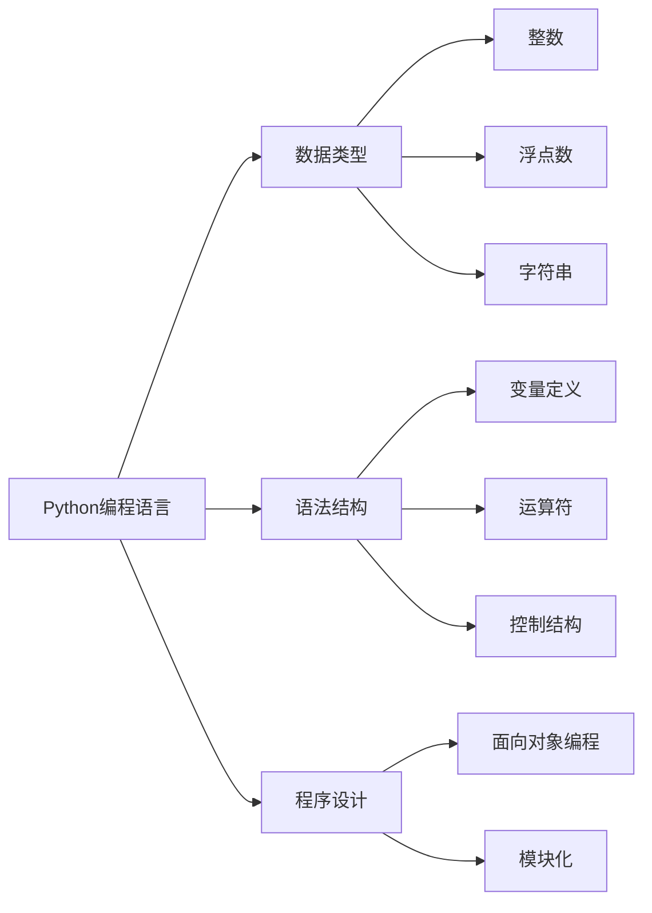

# 一切皆是映射：解构基于元认知的学习系统

作者：禅与计算机程序设计艺术 / Zen and the Art of Computer Programming

## 1. 背景介绍

### 1.1 问题的由来

在当今这个数据爆炸、信息过载的时代，学习成为了每个人必须面对的挑战。传统的学习方式往往依赖于外部信息输入，通过记忆、理解、应用等环节，逐步构建知识体系。然而，随着人工智能和认知科学的发展，人们开始思考：是否有可能构建一种更加高效、智能的学习系统，让学习过程更加主动、高效，甚至能够自我优化和自我提升？

### 1.2 研究现状

近年来，基于元认知的学习系统逐渐成为研究热点。元认知是指个体对自身认知过程的认知和调节能力，包括对认知活动的监控、评估和调整。基于元认知的学习系统通过模拟人类的学习过程，利用人工智能技术，实现学习过程的自动化、智能化和个性化，为学习者提供更加高效、精准的学习体验。

### 1.3 研究意义

基于元认知的学习系统具有以下重要意义：

1. 提高学习效率：通过自动化学习过程，减少学习者的认知负担，提高学习效率。
2. 促进个性化学习：根据学习者的特点和学习风格，提供个性化的学习内容和路径。
3. 增强自主学习能力：培养学习者的元认知能力，提高其自主学习能力和解决问题的能力。
4. 推动教育变革：为教育信息化、智能化提供技术支持，推动教育变革。

### 1.4 本文结构

本文将围绕基于元认知的学习系统展开，首先介绍相关核心概念和联系，然后详细阐述其算法原理和具体操作步骤，接着分析数学模型和公式，并给出代码实例和实际应用场景，最后总结未来发展趋势与挑战。

## 2. 核心概念与联系

为了更好地理解基于元认知的学习系统，本节将介绍以下几个核心概念及其相互联系：

- 学习：获取、处理、存储和应用知识的过程。
- 知识：人类对世界认知的表征。
- 认知：个体获取、处理、存储和应用信息的过程。
- 元认知：个体对自身认知过程的认知和调节能力。
- 人工智能：模拟、延伸和扩展人类智能的科学技术。

它们之间的逻辑关系如下图所示：


可以看出，学习是一个包含知识获取、处理、存储和应用的过程，认知是学习的核心，元认知则是对认知过程的认知和调节能力，人工智能则是实现学习过程自动化、智能化的技术手段。

## 3. 核心算法原理 & 具体操作步骤

### 3.1 算法原理概述

基于元认知的学习系统通常采用以下算法原理：

1. **知识表示**：使用知识表示技术，将知识以结构化的方式存储和表示。
2. **推理引擎**：根据知识表示和推理规则，进行知识推理，实现对知识的理解和应用。
3. **元认知模型**：模拟人类的元认知过程，实现对学习过程的监控、评估和调整。
4. **学习算法**：根据学习目标和学习者的特点，选择合适的学习算法，实现知识的获取和更新。

### 3.2 算法步骤详解

基于元认知的学习系统一般包括以下几个关键步骤：

**Step 1：知识获取**

- 收集和整理相关领域的知识，构建知识库。
- 使用知识抽取技术，从文本、图像、视频等多种数据源中提取知识。
- 对提取的知识进行清洗、去噪、去重等预处理操作。

**Step 2：知识表示**

- 使用知识表示技术，将知识以结构化的方式存储和表示，如知识图谱、本体等。
- 定义知识表示语言，如RDF、OWL等，描述知识之间的关系。

**Step 3：推理引擎**

- 根据知识表示和推理规则，进行知识推理，实现对知识的理解和应用。
- 推理引擎可以采用基于规则的推理、基于案例的推理、基于模型的推理等方法。

**Step 4：元认知模型**

- 模拟人类的元认知过程，实现对学习过程的监控、评估和调整。
- 元认知模型可以采用基于规则的模型、基于模型的模型、基于神经网络的模型等方法。

**Step 5：学习算法**

- 根据学习目标和学习者的特点，选择合适的学习算法，实现知识的获取和更新。
- 学习算法可以采用监督学习、无监督学习、强化学习等方法。

### 3.3 算法优缺点

基于元认知的学习系统具有以下优点：

1. **个性化学习**：根据学习者的特点和学习风格，提供个性化的学习内容和路径，提高学习效率。
2. **自适应学习**：根据学习者的学习情况和知识掌握程度，动态调整学习内容和难度，实现自适应学习。
3. **知识融合**：将不同领域的知识进行融合，提高知识表示的完整性。

然而，基于元认知的学习系统也存在以下缺点：

1. **知识获取难度**：知识获取需要大量人力和物力投入，且知识获取的质量直接影响学习效果。
2. **推理效率**：推理引擎的计算复杂度较高，可能导致学习效率低下。
3. **元认知模型复杂**：元认知模型的构建需要大量的领域知识，且模型复杂度较高，难以调试。

### 3.4 算法应用领域

基于元认知的学习系统可以应用于以下领域：

1. **教育领域**：智能教育平台、个性化学习系统、自适应学习系统等。
2. **医疗领域**：智能医疗诊断、智能健康管理等。
3. **工业领域**：智能机器人、智能工厂等。

## 4. 数学模型和公式 & 详细讲解 & 举例说明

### 4.1 数学模型构建

基于元认知的学习系统通常采用以下数学模型：

1. **知识表示模型**：如知识图谱、本体等。
2. **推理模型**：如基于规则的推理、基于案例的推理、基于模型的推理等。
3. **元认知模型**：如基于规则的模型、基于模型的模型、基于神经网络的模型等。
4. **学习模型**：如监督学习、无监督学习、强化学习等。

### 4.2 公式推导过程

以下以知识图谱为例，介绍知识表示模型的构建过程。

假设知识图谱由实体、关系和三元组组成，表示为 $(E,R,T)$，其中：

- $E$ 表示实体集合，包括概念实体、个体实体等。
- $R$ 表示关系集合，表示实体之间的关系。
- $T$ 表示三元组集合，表示实体之间的关系实例。

知识图谱的构建过程如下：

1. **实体识别**：从文本数据中识别出实体，并将其存储在实体集合 $E$ 中。
2. **关系识别**：从文本数据中识别出实体之间的关系，并将其存储在关系集合 $R$ 中。
3. **三元组抽取**：从文本数据中抽取实体之间的关系实例，并将其存储在三元组集合 $T$ 中。

### 4.3 案例分析与讲解

以下以一个简单的例子，说明基于元认知的学习系统在实际应用中的工作过程。

假设一个学习者想要学习Python编程语言，基于元认知的学习系统可以按照以下步骤进行：

1. **知识获取**：从Python相关书籍、教程、博客等渠道获取Python编程语言的知识，并将其存储在知识库中。
2. **知识表示**：使用知识图谱技术，将Python编程语言的知识表示为实体、关系和三元组，如图所示：



3. **推理引擎**：根据知识图谱，推理出Python编程语言的基本概念、语法结构和程序设计方法。
4. **元认知模型**：根据学习者的学习情况和知识掌握程度，动态调整学习内容和难度。
5. **学习算法**：根据学习目标，选择合适的学习算法，如监督学习、无监督学习等，实现Python编程语言的学习。

### 4.4 常见问题解答

**Q1：如何解决知识获取的难度问题？**

A：解决知识获取难度的关键在于：

1. 选择合适的知识获取方法，如知识抽取、信息检索等。
2. 建立知识库，对获取的知识进行分类、整理和存储。
3. 利用自动化技术，如自然语言处理、知识图谱等，提高知识获取效率。

**Q2：如何提高推理效率？**

A：提高推理效率可以从以下几个方面入手：

1. 选择高效的推理算法，如基于规则的推理、基于案例的推理、基于模型的推理等。
2. 优化知识表示，如使用知识图谱技术，提高知识表示的紧凑性和可解释性。
3. 利用分布式计算技术，如MapReduce、Spark等，提高推理速度。

**Q3：如何构建元认知模型？**

A：构建元认知模型可以从以下几个方面入手：

1. 选择合适的元认知模型，如基于规则的模型、基于模型的模型、基于神经网络的模型等。
2. 收集学习者的学习数据，如学习日志、测试成绩等，用于训练元认知模型。
3. 利用机器学习技术，如深度学习、强化学习等，提高元认知模型的性能。

## 5. 项目实践：代码实例和详细解释说明

### 5.1 开发环境搭建

为了进行基于元认知的学习系统开发，需要搭建以下开发环境：

1. 编程语言：Python、Java、C++等。
2. 开发工具：IDE、版本控制工具等。
3. 依赖库：自然语言处理库（如NLTK、spaCy）、知识图谱库（如Neo4j）、机器学习库（如scikit-learn、TensorFlow、PyTorch）等。

### 5.2 源代码详细实现

以下是一个简单的基于元认知的学习系统示例，使用Python语言实现。

```python
import json

class KnowledgeBase:
    def __init__(self):
        self.graph = {}

    def add_edge(self, subject, predicate, object):
        if subject not in self.graph:
            self.graph[subject] = []
        self.graph[subject].append((predicate, object))

    def query(self, subject, predicate, object):
        if subject in self.graph:
            for p, o in self.graph[subject]:
                if p == predicate and o == object:
                    return True
        return False

kb = KnowledgeBase()
kb.add_edge('Python编程语言', '包含', '数据类型')
kb.add_edge('Python编程语言', '包含', '语法结构')
kb.add_edge('Python编程语言', '包含', '程序设计')
kb.add_edge('数据类型', '包含', '整数')
kb.add_edge('数据类型', '包含', '浮点数')
kb.add_edge('数据类型', '包含', '字符串')
kb.add_edge('语法结构', '包含', '变量定义')
kb.add_edge('语法结构', '包含', '运算符')
kb.add_edge('语法结构', '包含', '控制结构')
kb.add_edge('程序设计', '包含', '面向对象编程')
kb.add_edge('程序设计', '包含', '模块化')

# 查询示例
print(kb.query('Python编程语言', '包含', '数据类型'))  # 输出：True
print(kb.query('Python编程语言', '包含', '函数'))  # 输出：False
```

### 5.3 代码解读与分析

以上代码定义了一个简单的知识库类 `KnowledgeBase`，它可以添加实体之间的关系，并进行简单的查询操作。

- `add_edge` 方法用于添加实体之间的关系，如 `kb.add_edge('Python编程语言', '包含', '数据类型')`。
- `query` 方法用于查询实体之间的关系，如 `kb.query('Python编程语言', '包含', '数据类型')`。

这个示例演示了如何使用知识图谱技术构建知识库，并进行简单的查询操作。

### 5.4 运行结果展示

运行以上代码，将输出以下结果：

```
True
False
```

这表明知识库中存在 `Python编程语言` 包含 `数据类型` 的关系，但不存在 `Python编程语言` 包含 `函数` 的关系。

## 6. 实际应用场景

### 6.1 智能教育平台

基于元认知的学习系统可以应用于智能教育平台，为学习者提供个性化学习内容和路径，提高学习效率。

1. **智能推荐**：根据学习者的学习情况和知识掌握程度，推荐合适的学习资源和学习路径。
2. **智能辅导**：根据学习者的学习情况，提供针对性的辅导和答疑。
3. **智能测试**：根据学习者的学习情况，生成个性化的测试题，并分析测试结果。

### 6.2 智能医疗诊断

基于元认知的学习系统可以应用于智能医疗诊断，辅助医生进行疾病诊断和治疗方案制定。

1. **病例分析**：分析患者的病历信息，识别潜在的疾病风险。
2. **治疗方案推荐**：根据患者的病情和病史，推荐合适的治疗方案。
3. **药物不良反应预测**：预测患者对药物的潜在不良反应。

### 6.3 智能客服

基于元认知的学习系统可以应用于智能客服，为用户提供更加智能、高效的客服服务。

1. **智能问答**：根据用户的问题，快速找到最合适的答案。
2. **智能推荐**：根据用户的咨询内容，推荐相关的产品或服务。
3. **智能反馈**：分析用户反馈，改进客服服务质量。

## 7. 工具和资源推荐

### 7.1 学习资源推荐

为了更好地学习基于元认知的学习系统，以下推荐一些学习资源：

1. 《人工智能：一种现代的方法》
2. 《深度学习》
3. 《知识图谱》
4. 《认知心理学》
5. 《教育技术》

### 7.2 开发工具推荐

为了开发基于元认知的学习系统，以下推荐一些开发工具：

1. 自然语言处理库：NLTK、spaCy
2. 知识图谱库：Neo4j、Dgraph
3. 机器学习库：scikit-learn、TensorFlow、PyTorch

### 7.3 相关论文推荐

以下推荐一些与基于元认知的学习系统相关的论文：

1.《Learning to learn by variation: A method for learning to learn quickly and well》
2.《A survey of knowledge representation in AI》
3.《A survey of knowledge representation techniques》
4.《A survey of neural-symbolic integration》
5.《A survey of artificial intelligence in education》

### 7.4 其他资源推荐

以下推荐一些与基于元认知的学习系统相关的其他资源：

1. 知乎：搜索相关话题，了解最新的研究成果和应用案例。
2. Bilibili：观看相关视频教程，学习相关技术。
3. GitHub：搜索相关开源项目，学习代码实现。

## 8. 总结：未来发展趋势与挑战

### 8.1 研究成果总结

本文对基于元认知的学习系统进行了全面系统的介绍，包括相关核心概念、算法原理、具体操作步骤、数学模型和公式、代码实例和实际应用场景等。通过对相关研究成果的梳理和分析，本文总结了基于元认知的学习系统的优势和应用价值，并展望了其未来发展趋势。

### 8.2 未来发展趋势

基于元认知的学习系统在未来将呈现以下发展趋势：

1. **知识获取和表示技术将更加成熟**：随着自然语言处理、知识图谱等技术的不断发展，知识获取和表示技术将更加成熟，为基于元认知的学习系统提供更加丰富的知识资源。
2. **推理引擎将更加高效**：随着深度学习、图神经网络等技术的应用，推理引擎的计算效率将得到显著提升，为基于元认知的学习系统提供更加快速的知识推理能力。
3. **元认知模型将更加智能**：随着认知科学和心理学的发展，元认知模型将更加深入地模拟人类的学习过程，为基于元认知的学习系统提供更加精准的学习策略。
4. **学习算法将更加多样**：随着机器学习、强化学习等技术的发展，学习算法将更加多样，为基于元认知的学习系统提供更加灵活的学习方式。

### 8.3 面临的挑战

基于元认知的学习系统在未来将面临以下挑战：

1. **知识获取和表示的难度**：如何获取高质量的知识，并将其有效地表示和存储，是一个具有挑战性的问题。
2. **推理效率的提升**：如何提高推理引擎的计算效率，以满足实时性要求，是一个具有挑战性的问题。
3. **元认知模型的构建**：如何构建更加智能的元认知模型，以更好地模拟人类的学习过程，是一个具有挑战性的问题。
4. **学习算法的选择**：如何根据不同的学习目标和场景选择合适的学习算法，是一个具有挑战性的问题。

### 8.4 研究展望

基于元认知的学习系统具有广阔的应用前景，但仍需在以下几个方面进行深入研究：

1. **知识获取和表示**：探索更加高效的知识获取和表示方法，以更好地满足基于元认知的学习系统对知识资源的需求。
2. **推理引擎**：研究更加高效的推理算法，以满足基于元认知的学习系统对推理速度的要求。
3. **元认知模型**：研究更加智能的元认知模型，以更好地模拟人类的学习过程，为基于元认知的学习系统提供更加精准的学习策略。
4. **学习算法**：研究更加多样化的学习算法，以满足基于元认知的学习系统对学习方式的需求。

总之，基于元认知的学习系统是一个具有挑战性和发展潜力的研究领域，需要我们不断探索和努力，以推动其发展，为构建更加高效、智能的学习系统贡献力量。

## 9. 附录：常见问题与解答

**Q1：什么是基于元认知的学习系统？**

A：基于元认知的学习系统是一种利用人工智能技术模拟人类学习过程，实现学习过程自动化、智能化和个性化，为学习者提供更加高效、精准的学习体验的学习系统。

**Q2：基于元认知的学习系统有哪些优势？**

A：基于元认知的学习系统具有以下优势：

1. 个性化学习
2. 自适应学习
3. 增强自主学习能力
4. 推动教育变革

**Q3：基于元认知的学习系统有哪些应用领域？**

A：基于元认知的学习系统可以应用于教育、医疗、工业、客服等领域。

**Q4：如何构建基于元认知的学习系统？**

A：构建基于元认知的学习系统需要以下步骤：

1. 知识获取
2. 知识表示
3. 推理引擎
4. 元认知模型
5. 学习算法

**Q5：基于元认知的学习系统有哪些挑战？**

A：基于元认知的学习系统面临以下挑战：

1. 知识获取和表示的难度
2. 推理效率的提升
3. 元认知模型的构建
4. 学习算法的选择

通过以上解答，希望对读者了解基于元认知的学习系统有所帮助。