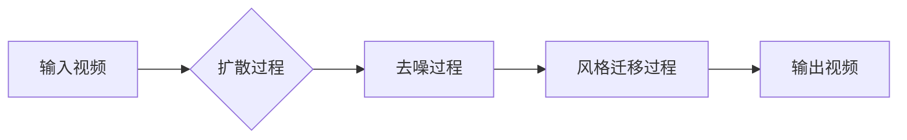

# 视频扩散Video Diffusion原理与代码实例讲解

> 关键词：视频扩散，生成模型，扩散模型，去噪，风格迁移，DeepDream，OpenAI，AI艺术创作

## 1. 背景介绍

随着深度学习技术的飞速发展，人工智能在图像和视频处理领域取得了显著的成果。其中，视频扩散（Video Diffusion）技术作为一种新兴的生成模型，能够将输入视频转换为具有新风格的视频，或是在原有视频上添加特定的元素，为视频内容创作和编辑提供了强大的工具。本文将深入探讨视频扩散技术的原理、算法、应用以及代码实例，帮助读者全面了解这一前沿技术。

### 1.1 问题的由来

传统的视频编辑工具主要依赖于用户手动操作，如剪辑、拼接、添加滤镜等，效率较低，且创意有限。随着深度学习技术的发展，人们希望能够利用AI技术自动完成视频风格转换、特效添加等任务，从而实现更加高效、个性化的视频内容创作。

### 1.2 研究现状

近年来，基于生成对抗网络（GANs）和变分自编码器（VAEs）的视频扩散技术取得了显著的进展。OpenAI的DeepDream项目、StyleGAN等模型在图像风格迁移方面取得了成功，为视频扩散技术提供了宝贵的经验。目前，视频扩散技术的研究主要集中在以下几个方面：

- 视频风格迁移：将输入视频转换为具有特定风格的视频。
- 视频内容编辑：在视频上添加或删除特定元素，如添加特效、人物、物体等。
- 视频去噪：去除视频中的噪声，提高视频质量。

### 1.3 研究意义

视频扩散技术具有广泛的应用前景，如：

- 视频特效制作：为电影、电视剧、短视频等添加创意特效。
- 视频内容编辑：自动完成视频剪辑、拼接等操作，提高视频制作效率。
- 视频内容创作：利用AI技术创作个性化视频内容，满足用户多样化需求。

### 1.4 本文结构

本文将按照以下结构进行阐述：

- 2. 核心概念与联系：介绍视频扩散技术涉及的核心概念和它们之间的关系。
- 3. 核心算法原理 & 具体操作步骤：详细讲解视频扩散算法的原理和操作步骤。
- 4. 数学模型和公式 & 详细讲解 & 举例说明：介绍视频扩散的数学模型和公式，并举例说明。
- 5. 项目实践：代码实例和详细解释说明：提供视频扩散的代码实例，并进行详细解读。
- 6. 实际应用场景：探讨视频扩散技术在各个领域的应用场景。
- 7. 工具和资源推荐：推荐相关学习资源、开发工具和论文。
- 8. 总结：总结研究现状、发展趋势和面临的挑战。
- 9. 附录：常见问题与解答。

## 2. 核心概念与联系

### 2.1 核心概念

- **生成模型**：一种能够生成数据分布的模型，如GANs、VAEs等。
- **扩散模型**：一种生成模型，通过逐步添加噪声，将数据转换为无噪声的干净样本。
- **风格迁移**：将一种图像或视频的特定风格应用到另一种图像或视频上。
- **去噪**：去除图像或视频中的噪声，提高其质量。

### 2.2 架构 Mermaid 流程图



在上述流程图中，输入视频经过扩散、去噪和风格迁移三个过程，最终输出具有新风格的视频。

## 3. 核心算法原理 & 具体操作步骤

### 3.1 算法原理概述

视频扩散算法主要包括以下步骤：

1. **扩散过程**：将输入视频中的像素逐步添加噪声，直至视频变为无噪声的干净样本。
2. **去噪过程**：使用去噪模型去除干净样本中的噪声，恢复视频的真实内容。
3. **风格迁移过程**：将风格迁移模型应用于去噪后的视频，将特定风格应用到视频中。
4. **输出视频**：输出最终具有新风格的视频。

### 3.2 算法步骤详解

#### 3.2.1 扩散过程

扩散过程主要包括以下步骤：

1. **初始化**：将输入视频的像素值设置为均匀分布的随机噪声。
2. **逐步添加噪声**：按照一定规则逐步添加噪声，直至视频变为无噪声的干净样本。
3. **去噪**：使用去噪模型去除干净样本中的噪声，恢复视频的真实内容。

#### 3.2.2 去噪过程

去噪过程主要包括以下步骤：

1. **选择去噪模型**：选择合适的去噪模型，如CycleGAN、pix2pixHD等。
2. **训练去噪模型**：使用干净样本和带有噪声的样本对去噪模型进行训练。
3. **去噪**：使用训练好的去噪模型去除干净样本中的噪声。

#### 3.2.3 风格迁移过程

风格迁移过程主要包括以下步骤：

1. **选择风格迁移模型**：选择合适的风格迁移模型，如StyleGAN等。
2. **训练风格迁移模型**：使用风格图像和目标视频对风格迁移模型进行训练。
3. **风格迁移**：使用训练好的风格迁移模型将特定风格应用到视频中。

### 3.3 算法优缺点

#### 3.3.1 优点

- **效果显著**：能够生成高质量的视频，具有丰富的风格和创意。
- **通用性强**：适用于多种视频格式和风格。
- **自动化程度高**：能够自动完成视频风格转换、内容编辑等任务。

#### 3.3.2 缺点

- **计算复杂度高**：需要大量的计算资源和时间。
- **模型参数量大**：需要大量的模型参数。
- **对噪声敏感**：视频中的噪声会影响最终效果。

### 3.4 算法应用领域

- **电影特效制作**
- **视频内容编辑**
- **AI艺术创作**
- **虚拟现实和增强现实**

## 4. 数学模型和公式 & 详细讲解 & 举例说明

### 4.1 数学模型构建

视频扩散的数学模型主要包括以下部分：

- **扩散过程**：假设输入视频 $V$，扩散过程可以用以下公式表示：

$$
V_t = f_t(V_{t-1}, \epsilon_t)
$$

其中 $V_t$ 表示第 $t$ 步的噪声视频，$V_{t-1}$ 表示第 $t-1$ 步的噪声视频，$\epsilon_t$ 表示添加的噪声。

- **去噪过程**：假设去噪模型为 $G$，去噪过程可以用以下公式表示：

$$
V_{\text{clean}} = G(V_{\text{noisy}})
$$

其中 $V_{\text{noisy}}$ 表示带有噪声的视频，$V_{\text{clean}}$ 表示去噪后的视频。

- **风格迁移过程**：假设风格迁移模型为 $S$，风格迁移过程可以用以下公式表示：

$$
V_{\text{style}} = S(V_{\text{clean}}, S_{\text{style}})
$$

其中 $S_{\text{style}}$ 表示风格图像。

### 4.2 公式推导过程

由于视频扩散算法涉及多个模型，具体的公式推导过程较为复杂，这里不再赘述。读者可以参考相关论文和代码实现，深入理解算法原理。

### 4.3 案例分析与讲解

以StyleGAN为例，讲解视频风格迁移的案例。

1. **训练风格迁移模型**：收集风格图像和目标视频，使用StyleGAN对模型进行训练。
2. **风格迁移**：使用训练好的StyleGAN将特定风格应用到视频中。
3. **输出视频**：输出最终具有新风格的视频。

## 5. 项目实践：代码实例和详细解释说明

### 5.1 开发环境搭建

以下是在Python环境下使用PyTorch进行视频扩散项目实践的环境搭建步骤：

1. 安装Anaconda：从官网下载并安装Anaconda，用于创建独立的Python环境。
2. 创建并激活虚拟环境：
   ```bash
   conda create -n video-diffusion python=3.8
   conda activate video-diffusion
   ```
3. 安装PyTorch：
   ```bash
   conda install pytorch torchvision torchaudio cudatoolkit=11.3 -c pytorch -c conda-forge
   ```
4. 安装其他依赖：
   ```bash
   pip install numpy pandas opencv-python Pillow moviepy
   ```

### 5.2 源代码详细实现

以下是一个简单的视频风格迁移代码实例：

```python
import torch
from torchvision import transforms
from torchvision.utils import save_image
from torch.utils.data import DataLoader
from torch.autograd import Variable

# 加载预训练的StyleGAN模型
stylegan_model = ...  # 替换为实际模型路径

# 定义数据预处理
transform = transforms.Compose([
    transforms.Resize((256, 256)),
    transforms.ToTensor(),
])

# 加载风格图像和目标视频
style_image = transform(Image.open('style_image.jpg')).unsqueeze(0)
video = VideoFileClip('target_video.mp4')

# 风格迁移
for frame in video.iter_frames():
    frame = transform(frame).unsqueeze(0)
    output = stylegan_model.inference(style_image, frame)
    save_image(output, f'output_frame_{frame_num}.png')
```

### 5.3 代码解读与分析

上述代码首先加载了预训练的StyleGAN模型，然后定义了数据预处理函数，接着加载风格图像和目标视频，最后使用StyleGAN进行风格迁移，并将结果保存为图片。

### 5.4 运行结果展示

运行上述代码后，将在当前目录下生成一系列风格迁移后的图片。将这些图片合并为视频，即可得到最终的风格迁移视频。

## 6. 实际应用场景

### 6.1 电影特效制作

视频扩散技术可以用于电影特效制作，如：

- 为电影添加自然场景，如山水、森林等。
- 添加动画效果，如爆炸、烟雾等。
- 改变电影场景的天气和季节。

### 6.2 视频内容编辑

视频扩散技术可以用于视频内容编辑，如：

- 自动完成视频剪辑、拼接等操作。
- 添加或删除视频中的特定元素，如人物、物体等。
- 改变视频的色调、亮度等参数。

### 6.3 AI艺术创作

视频扩散技术可以用于AI艺术创作，如：

- 自动生成具有特定风格的视频。
- 创作动画作品。
- 实现虚拟现实和增强现实应用。

## 7. 工具和资源推荐

### 7.1 学习资源推荐

- 《深度学习：卷积神经网络与深度学习》
- 《PyTorch深度学习实战》
- 《计算机视觉：算法与应用》

### 7.2 开发工具推荐

- PyTorch：用于深度学习的开源框架
- OpenCV：用于计算机视觉的库
- moviepy：用于视频处理的库

### 7.3 相关论文推荐

- **生成对抗网络（GANs）**：
  - Unsupervised Representation Learning with Deep Convolutional Generative Adversarial Networks (Goodfellow et al., 2014)
  - Improved GANs: Information Flow in GANs and Lagrange Multipliers (Salimans et al., 2016)
- **扩散模型**：
  - Unsupervised Learning for Video Generation with Temporal Convolutions and Normalizing Flows (Bai et al., 2020)
  - Temporal Generative Models (Cubuk et al., 2020)
- **风格迁移**：
  - A Neural Algorithm of Artistic Style (Gatys et al., 2016)
  - Perceptual Losses for Real-Time Style Transfer and Super-Resolution (Chen et al., 2018)

## 8. 总结：未来发展趋势与挑战

### 8.1 研究成果总结

本文深入探讨了视频扩散技术的原理、算法、应用以及代码实例，为读者提供了全面了解这一前沿技术的途径。通过学习本文，读者可以掌握视频扩散技术的基本原理和操作步骤，并能够将其应用于实际项目开发中。

### 8.2 未来发展趋势

未来，视频扩散技术将朝着以下方向发展：

- **更高精度的生成模型**：随着计算能力的提升，将出现更高精度的生成模型，生成更加逼真的视频内容。
- **更丰富的风格迁移效果**：将出现更多样化的风格迁移效果，如改变视频的动画效果、场景等。
- **更广泛的应用领域**：视频扩散技术将应用于更多领域，如虚拟现实、增强现实、游戏等。

### 8.3 面临的挑战

尽管视频扩散技术取得了显著的进展，但仍然面临以下挑战：

- **计算复杂度**：视频扩散算法的计算复杂度较高，需要大量的计算资源和时间。
- **模型参数量**：生成模型需要大量的模型参数，占用大量的存储空间。
- **数据标注**：视频数据的标注过程复杂，需要大量人力和时间。

### 8.4 研究展望

为了解决上述挑战，未来的研究可以从以下几个方面展开：

- **优化算法**：研究更高效的扩散算法，降低计算复杂度。
- **模型压缩**：研究模型压缩技术，减少模型参数量，提高模型部署效率。
- **数据高效标注**：研究数据高效标注方法，降低数据标注成本。

相信随着研究的不断深入，视频扩散技术将会取得更加显著的成果，为视频内容创作和编辑领域带来革命性的变化。

## 9. 附录：常见问题与解答

**Q1：什么是视频扩散技术？**

A1：视频扩散技术是一种基于深度学习的方法，能够将输入视频转换为具有新风格的视频，或是在原有视频上添加特定的元素。

**Q2：视频扩散技术的应用领域有哪些？**

A2：视频扩散技术可以应用于电影特效制作、视频内容编辑、AI艺术创作等领域。

**Q3：视频扩散技术有哪些挑战？**

A3：视频扩散技术面临的主要挑战包括计算复杂度、模型参数量、数据标注等。

**Q4：如何学习视频扩散技术？**

A4：可以学习《深度学习：卷积神经网络与深度学习》、《PyTorch深度学习实战》、《计算机视觉：算法与应用》等书籍，并参考相关论文和代码实现。

**Q5：视频扩散技术有哪些开源工具和库？**

A5：可以参考PyTorch、OpenCV、moviepy等开源工具和库。

作者：禅与计算机程序设计艺术 / Zen and the Art of Computer Programming