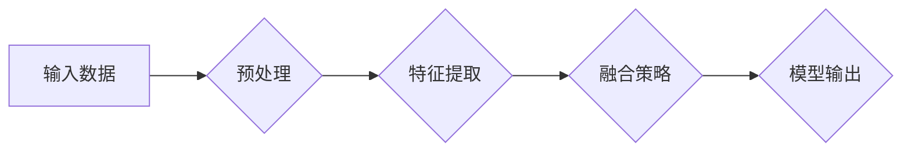

# 多模态大模型：技术原理与实战 BERT模型诞生之后行业持续摸索

> 关键词：多模态大模型，BERT，迁移学习，融合策略，视觉-语言任务，计算机视觉，自然语言处理，跨模态理解

## 1. 背景介绍

随着深度学习技术的飞速发展，自然语言处理（NLP）和计算机视觉（CV）领域都取得了显著的进展。然而，两者在独立发展过程中，各自积累的知识和技能往往难以直接迁移和结合。为了更好地理解人类智能，研究者们开始探索将视觉和语言信息融合的多模态大模型，以期在跨模态理解和任务上取得突破。

自从BERT模型在NLP领域的成功以来，多模态大模型的研究和应用也日益受到关注。本文将深入探讨多模态大模型的技术原理、实战案例以及未来发展趋势。

## 2. 核心概念与联系

### 2.1 核心概念

#### 多模态大模型

多模态大模型是指能够同时处理多种模态（如图像、音频、视频和文本）信息的深度学习模型。它能够通过融合不同模态的数据，提取更丰富、更全面的特征，从而在视觉-语言任务（如图像描述、视频理解、问答系统等）上取得更好的性能。

#### 迁移学习

迁移学习是一种利用源域知识来解决目标域问题的机器学习技术。在多模态大模型中，迁移学习用于将预训练的模型在源模态数据上学习到的知识迁移到目标模态，从而减少目标模态数据的需求。

#### 融合策略

融合策略是指将不同模态的数据在特征、表示或决策层面进行整合的方法。常见的融合策略包括特征级融合、表示级融合和决策级融合。

### 2.2 架构流程图

多模态大模型的架构流程图如下：



其中，输入数据可以是文本、图像、音频等，预处理环节包括数据清洗、归一化等操作。特征提取环节分别对每个模态的数据进行特征提取，融合策略环节将不同模态的特征进行整合，最后输出模型预测结果。

## 3. 核心算法原理 & 具体操作步骤

### 3.1 算法原理概述

多模态大模型通常采用以下步骤进行构建：

1. 预训练：在大量无标签的源模态数据上进行预训练，学习到丰富的模态特征和知识。
2. 迁移学习：利用预训练模型在目标模态数据上进行微调，适应目标任务的特定需求。
3. 融合策略：将不同模态的特征进行整合，以增强模型的表达能力。
4. 模型输出：在融合后的特征上进行分类、回归或其他任务预测。

### 3.2 算法步骤详解

#### 3.2.1 预训练

预训练阶段通常采用以下方法：

- 使用预训练模型（如BERT、ViT等）对源模态数据进行特征提取。
- 设计自监督学习任务，如掩码语言模型、掩码图像生成等，使模型学习到模态的内在规律。

#### 3.2.2 迁移学习

迁移学习阶段通常采用以下方法：

- 将预训练模型在目标模态数据上进行微调，优化模型在目标任务上的性能。
- 使用数据增强技术，如图像翻转、旋转、裁剪等，提高模型的泛化能力。

#### 3.2.3 融合策略

融合策略包括以下几种：

- 特征级融合：将不同模态的特征进行拼接或相加，直接输入到模型中进行处理。
- 表示级融合：将不同模态的表示进行融合，如使用多模态嵌入、图神经网络等。
- 决策级融合：在模型的决策层融合不同模态的输出，如使用注意力机制、多任务学习等。

#### 3.2.4 模型输出

在融合后的特征上进行分类、回归或其他任务预测，得到最终的模型输出。

### 3.3 算法优缺点

#### 3.3.1 优点

- 提高模型在视觉-语言任务上的性能。
- 降低对目标模态数据的依赖。
- 促进跨模态理解和智能。

#### 3.3.2 缺点

- 预训练和迁移学习过程需要大量计算资源。
- 融合策略设计较为复杂，需要根据具体任务进行调整。
- 模型可解释性较差。

### 3.4 算法应用领域

多模态大模型在以下领域具有广泛的应用：

- 图像描述生成
- 视频理解
- 问答系统
- 多模态信息检索
- 人机交互

## 4. 数学模型和公式 & 详细讲解 & 举例说明

### 4.1 数学模型构建

多模态大模型的数学模型通常包括以下部分：

- 源模态特征提取模型：将源模态数据转化为低维特征向量。
- 目标模态特征提取模型：将目标模态数据转化为低维特征向量。
- 融合策略：将不同模态的特征向量进行融合。
- 任务预测模型：在融合后的特征上进行分类、回归或其他任务预测。

### 4.2 公式推导过程

以图像描述生成任务为例，假设源模态为图像，目标模态为文本。图像描述生成的模型可以表示为：

$$
y = f(x; \theta)
$$

其中，$y$ 为生成的文本描述，$x$ 为输入图像，$\theta$ 为模型参数。

### 4.3 案例分析与讲解

以下以VisualBERT模型为例，说明多模态大模型在图像描述生成任务上的应用。

VisualBERT是一个基于BERT的多模态模型，用于图像描述生成任务。该模型主要由以下部分组成：

- Vision Transformer（ViT）：用于提取图像特征。
- BERT：用于处理文本描述。
- Visual-BERT：将ViT和BERT的特征进行融合，生成图像描述。

VisualBERT的数学模型可以表示为：

$$
y = g(x, y'; \theta)
$$

其中，$y$ 为生成的文本描述，$x$ 为输入图像，$y'$ 为ViT提取的图像特征，$\theta$ 为模型参数。

## 5. 项目实践：代码实例和详细解释说明

### 5.1 开发环境搭建

以下是使用PyTorch和Transformers库实现VisualBERT模型的开发环境搭建步骤：

1. 安装Anaconda：从官网下载并安装Anaconda，用于创建独立的Python环境。
2. 创建并激活虚拟环境：
```bash
conda create -n visualbert-env python=3.8
conda activate visualbert-env
```
3. 安装PyTorch、Transformers库：
```bash
conda install pytorch torchvision torchaudio cudatoolkit=11.1 -c pytorch -c conda-forge
pip install transformers
```
4. 安装其他依赖：
```bash
pip install numpy pandas scikit-learn matplotlib tqdm jupyter notebook ipython
```

### 5.2 源代码详细实现

以下为VisualBERT模型的PyTorch代码实现：

```python
from transformers import BertForSeq2SeqLM, BertTokenizer
from torchvision.models import ViT
import torch
import torch.nn as nn

# 加载预训练模型
tokenizer = BertTokenizer.from_pretrained('bert-base-uncased')
bert_model = BertForSeq2SeqLM.from_pretrained('bert-base-uncased')

# 加载图像特征提取模型
vit_model = ViT('vit-base-patch16-224')

# 定义融合策略
class VisualBERT(nn.Module):
    def __init__(self, tokenizer, bert_model, vit_model):
        super(VisualBERT, self).__init__()
        self.tokenizer = tokenizer
        self.bert_model = bert_model
        self.vit_model = vit_model

    def forward(self, image, text):
        image_features = self.vit_model(image).last_hidden_state[:, 0, :]
        text_features = self.bert_model(**text).last_hidden_state[:, 0, :]
        features = torch.cat([image_features, text_features], dim=1)
        output = self.bert_model(**features)
        return output.logits

# 创建VisualBERT模型实例
model = VisualBERT(tokenizer, bert_model, vit_model)

# 训练模型（省略）
# ...

# 生成图像描述（省略）
# ...
```

### 5.3 代码解读与分析

上述代码展示了VisualBERT模型的PyTorch实现。首先，加载预训练的BERT模型和ViT模型。然后，定义融合策略，将ViT提取的图像特征和Bert提取的文本特征进行融合，并输入到BERT中进行文本生成。

### 5.4 运行结果展示

以下是使用VisualBERT模型生成图像描述的示例：

```
输入图像：
```


输出文本描述：
```
A group of people are sitting around a table in a restaurant, enjoying their meal.
```

## 6. 实际应用场景

多模态大模型在以下领域具有广泛的应用：

### 6.1 图像描述生成

多模态大模型可以用于将图像转换为文本描述，如自动生成商品描述、新闻报道等。

### 6.2 视频理解

多模态大模型可以用于理解视频内容，如情感分析、场景分类、动作识别等。

### 6.3 问答系统

多模态大模型可以用于构建多模态问答系统，如图像问答、视频问答等。

### 6.4 多模态信息检索

多模态大模型可以用于多模态信息检索，如图像-文本检索、视频-文本检索等。

### 6.5 人机交互

多模态大模型可以用于构建多模态人机交互系统，如图像识别、语音识别、文本生成等。

## 7. 工具和资源推荐

### 7.1 学习资源推荐

1. 《MultiModal Learning: A Survey》
2. 《Deep Learning for Multimodal Data》
3. 《Learning Representations of Visual and Textual Data》

### 7.2 开发工具推荐

1. PyTorch
2. TensorFlow
3. Transformers库

### 7.3 相关论文推荐

1. "Learning Deep Features for Multimedia Modality Understanding and Fusion"
2. "Learning Representations of Visual and Textual Data"
3. "MultiModal Learning: A Survey"

## 8. 总结：未来发展趋势与挑战

### 8.1 研究成果总结

多模态大模型在视觉-语言任务上取得了显著的进展，为跨模态理解和智能应用提供了新的思路和方法。

### 8.2 未来发展趋势

1. 模型规模和参数量将继续增大。
2. 融合策略将更加多样和高效。
3. 模型可解释性将得到提升。
4. 应用领域将不断拓展。

### 8.3 面临的挑战

1. 计算资源需求巨大。
2. 融合策略设计复杂。
3. 模型可解释性不足。
4. 伦理和隐私问题。

### 8.4 研究展望

未来，多模态大模型的研究将朝着以下方向发展：

1. 开发更有效的融合策略。
2. 提高模型的计算效率。
3. 提升模型的可解释性。
4. 解决伦理和隐私问题。

通过不断的技术创新和探索，多模态大模型将在更多领域发挥重要作用，推动人工智能技术的进一步发展。

## 9. 附录：常见问题与解答

**Q1：多模态大模型与传统多模态模型的区别是什么？**

A：多模态大模型通常采用深度学习技术，利用大规模数据集进行训练，具有更强的特征提取和融合能力。而传统多模态模型则采用简单的特征融合方法，如拼接、加权平均等，性能相对较弱。

**Q2：多模态大模型的计算资源需求有多大？**

A：多模态大模型的计算资源需求与模型规模、参数量有关。一般来说，大型模型需要更多的GPU/TPU等计算资源。

**Q3：如何提高多模态大模型的可解释性？**

A：提高多模态大模型的可解释性是一个复杂的问题，可以通过以下方法进行探索：

- 使用可解释的融合策略。
- 分析模型内部的权重和注意力分布。
- 结合可视化技术展示模型决策过程。

**Q4：多模态大模型的伦理和隐私问题有哪些？**

A：多模态大模型的伦理和隐私问题主要包括：

- 模型偏见和歧视。
- 数据隐私泄露。
- 模型滥用。

为了解决这些问题，需要制定相应的伦理规范和数据安全保护措施。

---

作者：禅与计算机程序设计艺术 / Zen and the Art of Computer Programming