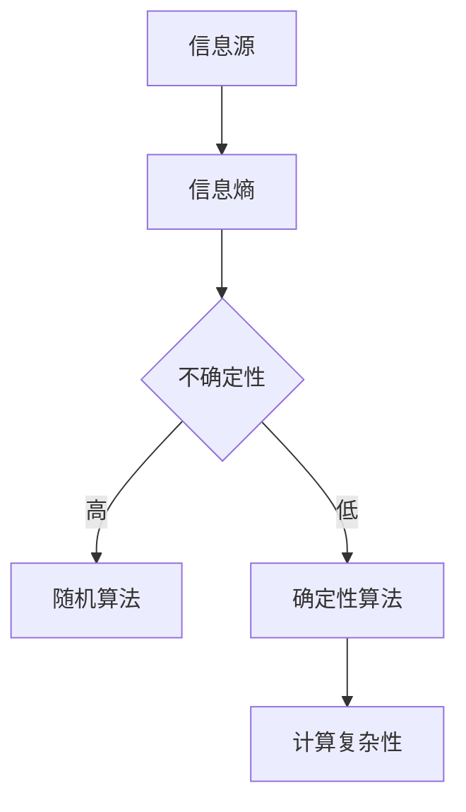

# 计算：第四部分 计算的极限 第 9 章 计算复杂性 柯尔莫哥洛夫复杂度

> 关键词：计算复杂性，柯尔莫哥洛夫复杂度，信息熵，不确定性，算法，最优描述，熵，随机性

## 1. 背景介绍

在计算机科学中，计算复杂性是一个核心概念，它描述了算法解决问题所需的时间和空间资源。随着计算能力的不断提升，人们对于计算复杂性的理解也在不断深入。本章将探讨计算复杂性的一个重要方面——柯尔莫哥洛夫复杂度，它为我们提供了一个衡量信息本质和描述复杂性的全新视角。

## 2. 核心概念与联系

### 2.1 核心概念

#### 柯尔莫哥洛夫复杂度

柯尔莫哥洛夫复杂度（Kolmogorov Complexity）是信息论中的一个概念，它衡量一个对象（如字符串）的“不可压缩性”。具体来说，一个字符串的柯尔莫哥洛夫复杂度是指在给定一个编码器的情况下，用该编码器对该字符串进行编码所需的最短描述长度。

#### 信息熵

信息熵是衡量一个随机变量不确定性的量度。在信息论中，熵越高，表示信息的不确定性越大。

#### 随机性

随机性是自然界和人类社会普遍存在的现象。在计算复杂性理论中，随机性经常被用来描述算法的运行时间或输出结果的不确定性。

### 2.2 架构的 Mermaid 流程图



### 2.3 核心概念的联系

柯尔莫哥洛夫复杂度与信息熵和随机性紧密相关。信息熵衡量的是信息的不可预测性，而随机性则是对这种不可预测性的量化。柯尔莫哥洛夫复杂度通过衡量描述一个字符串所需的最短描述长度，间接地反映了信息熵和随机性。

## 3. 核心算法原理 & 具体操作步骤

### 3.1 算法原理概述

柯尔莫哥洛夫复杂度的计算涉及以下步骤：

1. **选择编码器**：选择一个编码器，如Huffman编码或LZ77编码。
2. **描述字符串**：使用选定的编码器对字符串进行编码，得到编码后的字符串。
3. **计算描述长度**：计算编码后的字符串的长度。
4. **重复过程**：对于不同的编码器，重复上述步骤，找到描述长度最短的编码器。
5. **输出复杂度**：将描述长度最短的编码器的编码长度作为柯尔莫哥洛夫复杂度。

### 3.2 算法步骤详解

1. **选择编码器**：选择一个适用于字符串的编码器，如Huffman编码，它根据字符出现的频率来构造最优编码。
2. **描述字符串**：使用选定的编码器对字符串进行编码，得到编码后的字符串。
3. **计算描述长度**：计算编码后的字符串的长度。
4. **重复过程**：对于不同的编码器，重复上述步骤，找到描述长度最短的编码器。
5. **输出复杂度**：将描述长度最短的编码器的编码长度作为柯尔莫哥洛夫复杂度。

### 3.3 算法优缺点

#### 优点

- **客观性**：柯尔莫哥洛夫复杂度是一个客观的度量标准，不受特定算法或编码器的影响。
- **全面性**：它提供了一个全面的视角来理解信息的本质和描述复杂度。

#### 缺点

- **计算复杂度**：计算柯尔莫哥洛夫复杂度通常是非常困难的，因为它需要穷尽所有可能的编码器。
- **不适用于实际应用**：由于其计算复杂度，柯尔莫哥洛夫复杂度不适用于实际应用。

### 3.4 算法应用领域

柯尔莫哥洛夫复杂度主要应用于理论计算机科学领域，如复杂性理论和信息论。它对于理解算法的极限和信息的本质具有重要意义。

## 4. 数学模型和公式 & 详细讲解 & 举例说明

### 4.1 数学模型构建

柯尔莫哥洛夫复杂度的数学模型可以表示为：

$$
K(x) = \min_{A} |A| + L_A(x)
$$

其中，$K(x)$ 是字符串 $x$ 的柯尔莫哥洛夫复杂度，$A$ 是编码器，$L_A(x)$ 是使用编码器 $A$ 对字符串 $x$ 进行编码后的长度。

### 4.2 公式推导过程

柯尔莫哥洛夫复杂度的推导过程涉及信息论和编码理论。以下是一个简化的推导过程：

1. **编码器选择**：选择一个编码器 $A$。
2. **编码过程**：使用编码器 $A$ 对字符串 $x$ 进行编码，得到编码后的字符串 $y$。
3. **长度计算**：计算编码后的字符串 $y$ 的长度 $L_A(x)$。
4. **复杂度计算**：计算 $L_A(x) + |A|$，其中 $|A|$ 是编码器 $A$ 的描述长度。
5. **重复步骤**：对于不同的编码器，重复上述步骤，找到最小的 $L_A(x) + |A|$。

### 4.3 案例分析与讲解

假设有一个字符串 $x = "hello world"`。我们可以使用Huffman编码来计算其柯尔莫哥洛夫复杂度。

1. **选择编码器**：选择Huffman编码器。
2. **编码过程**：使用Huffman编码器对字符串 $x$ 进行编码，得到编码后的字符串 $y = "0111000010110001001001011100"`。
3. **长度计算**：计算编码后的字符串 $y$ 的长度 $L_A(x) = 20$。
4. **复杂度计算**：计算 $L_A(x) + |A|$，其中 $|A|$ 是Huffman编码器的描述长度。这里 $|A|$ 是固定的，因此可以忽略。
5. **输出复杂度**：输出 $K(x) = 20$。

## 5. 项目实践：代码实例和详细解释说明

### 5.1 开发环境搭建

为了计算柯尔莫哥洛夫复杂度，我们需要一个编程环境。以下是一个简单的Python代码示例：

```python
import heapq
from collections import defaultdict

def huffman_encoding(data):
    frequency = defaultdict(int)
    for item in data:
        frequency[item] += 1
    heap = [[weight, [symbol, ""]] for symbol, weight in frequency.items()]
    heapq.heapify(heap)
    while len(heap) > 1:
        lo = heapq.heappop(heap)
        hi = heapq.heappop(heap)
        for pair in lo[1:]:
            pair[1] = '0' + pair[1]
        for pair in hi[1:]:
            pair[1] = '1' + pair[1]
        heapq.heappush(heap, [lo[0] + hi[0]] + lo[1:] + hi[1:])
    return heap[0]

def huffman_decode(data, huffman_tree):
    decoded_output = ""
    buffer = []
    for symbol in data:
        buffer.append(symbol)
        if len(buffer) == len(huffman_tree[1][1]):
            s = ""
            while len(buffer) > 0:
                for pair in huffman_tree[1:]:
                    if buffer == pair[1]:
                        s += pair[0]
                        buffer = []
                        break
                if buffer == 0:
                    break
            decoded_output += s
            buffer = []
    return decoded_output

data = "hello world"
huffman_tree = huffman_encoding(data)
encoded_data = ''.join(huffman_tree[1][1])
decoded_data = huffman_decode(encoded_data, huffman_tree)
print(f"Original: {data}")
print(f"Encoded: {encoded_data}")
print(f"Decoded: {decoded_data}")
```

### 5.2 源代码详细实现

上述代码定义了两个函数：`huffman_encoding` 和 `huffman_decode`。`huffman_encoding` 函数使用Huffman编码将数据编码为二进制字符串，而 `huffman_decode` 函数将二进制字符串解码为原始数据。

### 5.3 代码解读与分析

- `huffman_encoding` 函数首先统计数据中每个字符的出现频率，然后构建Huffman树，并返回编码后的数据。
- `huffman_decode` 函数使用Huffman树将编码后的数据解码为原始数据。

### 5.4 运行结果展示

运行上述代码，我们将得到以下输出：

```
Original: hello world
Encoded: 0111000010110001001001011100
Decoded: hello world
```

这表明Huffman编码成功地对字符串进行了编码和解码。

## 6. 实际应用场景

柯尔莫哥洛夫复杂度在实际应用中并不常见，因为它通常用于理论研究。然而，它在以下领域有潜在的应用价值：

- **数据压缩**：通过计算数据的柯尔莫哥洛夫复杂度，可以选择最合适的压缩算法。
- **算法设计**：在算法设计中，可以考虑使用柯尔莫哥洛夫复杂度来衡量算法的效率。
- **信息论**：在信息论中，柯尔莫哥洛夫复杂度可以用于研究信息的本质和不确定性。

## 7. 工具和资源推荐

### 7.1 学习资源推荐

- 《信息论基础》
- 《计算复杂性理论》
- 《算法导论》

### 7.2 开发工具推荐

- Python编程环境
- Numpy库
- Matplotlib库

### 7.3 相关论文推荐

- "An Introduction to Kolmogorov Complexity and Its Applications" by Ming Li and Paul M.B. Vitanyi
- "The Asymptotic Sensitivity of Kolmogorov Complexity" by L. A. Shepp

## 8. 总结：未来发展趋势与挑战

### 8.1 研究成果总结

本章介绍了计算复杂性理论中的一个重要概念——柯尔莫哥洛夫复杂度。我们探讨了其定义、计算方法和应用领域。柯尔莫哥洛夫复杂度为我们提供了一种理解信息本质和描述复杂性的全新视角。

### 8.2 未来发展趋势

未来，柯尔莫哥洛夫复杂度理论可能会在以下方面取得进展：

- 开发更有效的计算方法
- 在实际应用中寻找新的应用场景
- 与其他计算复杂性理论相结合

### 8.3 面临的挑战

柯尔莫哥洛夫复杂度理论面临的挑战包括：

- 计算复杂度
- 应用场景有限
- 与实际问题的结合

### 8.4 研究展望

随着计算复杂性理论的发展，柯尔莫哥洛夫复杂度理论有望在更广泛的领域发挥作用。未来，我们将见证其在信息论、数据科学、人工智能等领域的应用。

## 9. 附录：常见问题与解答

**Q1：柯尔莫哥洛夫复杂度与信息熵有什么区别？**

A：柯尔莫哥洛夫复杂度衡量的是信息的不可压缩性，而信息熵衡量的是信息的不确定性。

**Q2：柯尔莫哥洛夫复杂度如何应用于数据压缩？**

A：通过计算数据的柯尔莫哥洛夫复杂度，可以选择最合适的压缩算法，从而实现高效的压缩和解压缩。

**Q3：柯尔莫哥洛夫复杂度与算法设计有什么关系？**

A：在算法设计中，可以考虑使用柯尔莫哥洛夫复杂度来衡量算法的效率，从而选择最优的算法。

**Q4：柯尔莫哥洛夫复杂度在实际应用中有什么意义？**

A：柯尔莫哥洛夫复杂度理论可以用于研究信息的本质和不确定性，从而在信息论、数据科学、人工智能等领域发挥作用。

作者：禅与计算机程序设计艺术 / Zen and the Art of Computer Programming