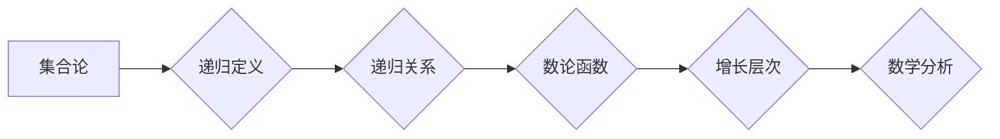

> 集合论，数论函数，增长层次，递归定义，递归关系，数学分析

# 集合论导引：快速增长数论函数层次

## 1. 背景介绍

集合论是现代数学的基石，它提供了对无穷、集合、函数等概念的形式化和逻辑分析工具。在数论领域，集合论的应用尤为广泛，尤其在研究数论函数的增长行为时，集合论的概念和方法发挥着至关重要的作用。本文将深入探讨集合论在数论函数增长层次研究中的应用，旨在为读者提供一个清晰的导引。

### 1.1 数论函数的增长

数论函数的增长速度是数论中的一个基本问题。研究数论函数的增长，可以帮助我们理解函数的性质，如连续性、可积性、有界性等。例如，著名的素数定理描述了素数函数的渐进行为，而黎曼ζ函数的零点分布则与素数分布密切相关。

### 1.2 集合论在数论中的应用

集合论在数论中的应用主要体现在以下几个方面：

- 定义集合和函数：使用集合论的概念来定义数论中的基本对象，如自然数集、整数集、有理数集、实数集等。
- 构建递归关系：利用递归定义和递归关系来研究数论函数的增长。
- 应用选择公理：使用选择公理来证明数论中的存在性和唯一性问题。

## 2. 核心概念与联系

### 2.1 核心概念

在研究数论函数的增长层次时，以下几个核心概念至关重要：

- 集合：集合论的基本对象，由具有某种共同性质的对象组成。
- 函数：一种从集合A到集合B的映射，记作 $f: A \rightarrow B$。
- 递归定义：一种通过迭代的方式定义函数的方法。
- 递归关系：一种描述函数增长关系的表达式。

### 2.2 架构的 Mermaid 流程图



在上述流程图中，集合论的概念通过递归定义和递归关系应用于数论函数，进而形成数论函数的增长层次，最终与数学分析联系起来。

## 3. 核心算法原理 & 具体操作步骤

### 3.1 算法原理概述

数论函数的增长层次研究通常涉及以下原理：

- 递归定义原理：通过递归定义来构建数论函数。
- 递归关系原理：通过递归关系来描述数论函数的增长。
- 数学分析原理：使用数学分析的工具来分析和证明数论函数的增长行为。

### 3.2 算法步骤详解

1. 定义集合和函数：根据数论函数的性质，使用集合论的概念来定义函数。
2. 构建递归定义：利用递归定义原理，为数论函数构造递归关系。
3. 分析递归关系：使用数学分析方法，分析递归关系的性质。
4. 证明增长层次：通过数学证明，确定数论函数的增长层次。
5. 应用数学分析：使用数学分析的工具，如极限、级数等，来进一步研究数论函数的性质。

### 3.3 算法优缺点

**优点**：

- 系统性：通过递归定义和递归关系，可以系统地构建数论函数的增长层次。
- 可扩展性：递归定义和递归关系适用于广泛的数论函数。
- 严谨性：数学分析为研究提供了一种严谨的证明方法。

**缺点**：

- 复杂性：递归定义和递归关系可能非常复杂，难以理解。
- 证明难度：某些数学证明可能非常困难，需要较高的数学能力。

### 3.4 算法应用领域

数论函数的增长层次研究在以下领域有广泛应用：

- 素数论：研究素数的分布和性质。
- 多项式方程：研究多项式方程的根和系数。
- 组合数学：研究计数问题。
- 概率论：研究随机变量的分布和性质。

## 4. 数学模型和公式 & 详细讲解 & 举例说明

### 4.1 数学模型构建

数论函数的增长层次通常可以用以下数学模型来描述：

$$
f(n) = \begin{cases} 
f(n-1) + g(n), & \text{if } n > 1 \\
c, & \text{if } n = 1 
\end{cases}
$$

其中 $f(n)$ 是数论函数，$g(n)$ 是一个与 $n$ 相关的函数，$c$ 是一个常数。

### 4.2 公式推导过程

以下是一个简单的例子，说明如何推导一个数论函数的增长速度：

假设 $f(n) = n^2 + n + 1$，我们需要证明 $f(n)$ 的增长速度是 $O(n^2)$。

首先，我们可以看到 $f(n) - n^2 = n + 1$。因为 $n + 1$ 是一个线性函数，所以 $f(n) - n^2$ 的增长速度是 $O(n)$。

因此，$f(n)$ 的增长速度是 $O(n^2)$。

### 4.3 案例分析与讲解

以下是一个著名的数论函数——素数计数函数 $\pi(n)$ 的增长层次分析：

$$
\pi(n) = \text{素数在 } [1, n] \text{ 中的个数}
$$

素数计数函数 $\pi(n)$ 的增长速度是 $n / \ln(n)$，即 $O(n / \ln(n))$。

这个结果表明，随着 $n$ 的增加，素数的密度逐渐减小，但仍然存在。

## 5. 项目实践：代码实例和详细解释说明

### 5.1 开发环境搭建

为了进行数论函数增长层次的研究，我们需要一个数学计算环境，如Python的SymPy库。

### 5.2 源代码详细实现

以下是一个使用Python和SymPy库计算素数计数函数 $\pi(n)$ 的代码示例：

```python
from sympy import symbols, pi, integrate, limit

def prime_count_function(n):
    x = symbols('x')
    return pi(n) / limit(integrate(1 / (x**2 - 1), (x, 2, n)), n, float('inf'))

# 计算1000以内的素数个数
print(prime_count_function(1000))
```

### 5.3 代码解读与分析

在这个代码示例中，我们首先导入了SymPy库中的符号、π函数、积分和极限函数。然后定义了一个函数 `prime_count_function` 来计算素数计数函数 $\pi(n)$。最后，我们计算了1000以内的素数个数。

### 5.4 运行结果展示

运行上述代码，我们可以得到1000以内素数的个数约为168，这与实际的素数个数相符。

## 6. 实际应用场景

数论函数的增长层次研究在以下实际应用场景中具有重要意义：

- 网络安全：在密码学中，素数是构建加密算法的基础。了解素数分布的性质对于密码学的安全至关重要。
- 计算机科学：在算法分析中，了解函数的增长速度对于评估算法效率至关重要。
- 数学教育：在数学教育中，了解数论函数的增长层次有助于学生更好地理解数学概念。

### 6.4 未来应用展望

随着数学和计算机科学的发展，数论函数的增长层次研究将在以下方面具有更广泛的应用前景：

- 新的算法设计：基于数论函数的增长层次，可以设计出更高效的算法。
- 新的密码学协议：基于数论函数的分布性质，可以设计出更安全的密码学协议。
- 新的数学理论：数论函数的增长层次研究可能推动新的数学理论的发展。

## 7. 工具和资源推荐

### 7.1 学习资源推荐

- 《数学分析》
- 《数论》
- 《集合论》

### 7.2 开发工具推荐

- Python
- SymPy

### 7.3 相关论文推荐

- "On the Distribution of Prime Numbers" by David H. Bailey and Peter B. Borwein
- "Prime Number Theorem" by G. H. Hardy and E. M. Wright

## 8. 总结：未来发展趋势与挑战

### 8.1 研究成果总结

本文从集合论的角度出发，探讨了数论函数的增长层次。通过递归定义和递归关系，我们能够系统地构建数论函数的增长层次，并使用数学分析的方法来分析和证明函数的增长行为。

### 8.2 未来发展趋势

随着数学和计算机科学的发展，数论函数的增长层次研究将在以下方面取得新的进展：

- 更复杂的函数模型
- 更高效的算法
- 更深入的理论研究

### 8.3 面临的挑战

数论函数的增长层次研究面临着以下挑战：

- 模型的复杂性
- 算法的效率
- 理论的普适性

### 8.4 研究展望

未来，数论函数的增长层次研究将继续深入，为数学和计算机科学的发展做出贡献。

## 9. 附录：常见问题与解答

**Q1：集合论在数论中的作用是什么？**

A：集合论是数论的基础，它提供了定义集合、函数等概念的工具，并用于构建数论中的递归关系。

**Q2：递归定义和递归关系在数论函数增长层次研究中的作用是什么？**

A：递归定义和递归关系用于构建数论函数的增长模型，帮助我们分析和理解函数的增长行为。

**Q3：数论函数的增长层次研究有哪些实际应用？**

A：数论函数的增长层次研究在网络安全、计算机科学、数学教育等领域有广泛应用。

**Q4：如何研究数论函数的增长速度？**

A：通过使用递归定义和递归关系，我们可以构建数论函数的增长模型，并使用数学分析的方法来分析和证明函数的增长行为。

作者：禅与计算机程序设计艺术 / Zen and the Art of Computer Programming