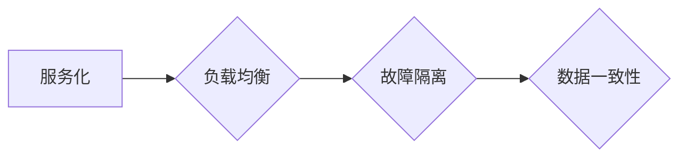
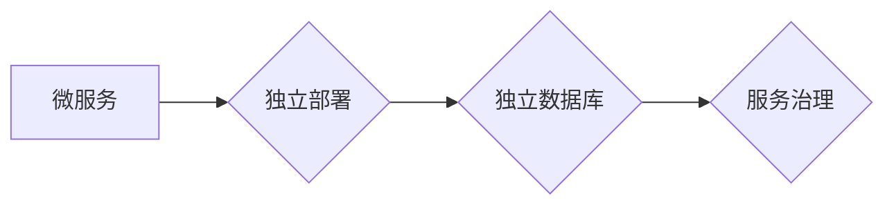
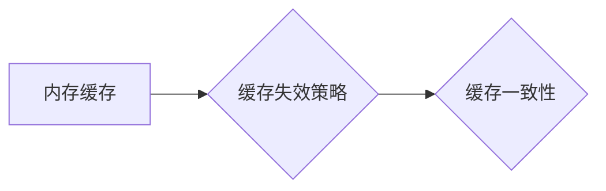
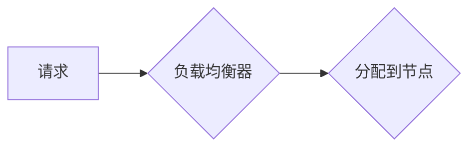

# 高吞吐量系统设计的实际案例

> 关键词：高吞吐量，系统设计，分布式系统，微服务架构，负载均衡，缓存策略，性能优化，实际案例

## 1. 背景介绍

随着互联网的快速发展，用户数量和访问量呈爆炸式增长，对于系统设计的挑战也越来越大。如何设计出能够处理海量请求、保证系统稳定性和高可用性的高吞吐量系统，成为了IT行业一个重要的研究方向。本文将结合实际案例，深入探讨高吞吐量系统设计的核心概念、设计原则、关键技术以及实践应用。

### 1.1 问题的由来

传统单体应用在面对高并发请求时，往往会因为单点过载、资源瓶颈、响应时间过长等问题而出现性能瓶颈。为了解决这些问题，近年来，分布式系统和微服务架构得到了广泛应用。然而，高吞吐量系统设计不仅仅是技术选型的选择，更是一个综合性的系统工程，涉及到架构设计、性能优化、资源管理等各个方面。

### 1.2 研究现状

当前，高吞吐量系统设计的研究主要集中在以下几个方面：

- **分布式系统架构**：通过将应用拆分成多个独立的服务，实现负载均衡、故障隔离和水平扩展。
- **微服务架构**：进一步将服务拆分到更细粒度，提高系统解耦度和可扩展性。
- **缓存策略**：利用缓存减少数据库压力，提高系统响应速度。
- **负载均衡**：通过负载均衡器分散请求，避免单个节点过载。
- **性能优化**：通过代码优化、数据库优化、网络优化等手段提高系统性能。

### 1.3 研究意义

研究高吞吐量系统设计，对于提升系统性能、保证系统稳定性和高可用性、降低运维成本等方面具有重要意义。

- **提升系统性能**：通过合理的系统设计，可以大幅度提升系统处理请求的能力，提高用户满意度。
- **保证系统稳定性**：通过分布式架构和故障隔离机制，可以保证系统在面对高并发请求和故障时仍然稳定运行。
- **降低运维成本**：通过自动化运维工具和资源池化技术，可以降低系统运维成本。

### 1.4 本文结构

本文将按照以下结构进行阐述：

- 第2部分，介绍高吞吐量系统设计的相关核心概念。
- 第3部分，详细讲解高吞吐量系统设计的关键技术和方法。
- 第4部分，通过实际案例展示高吞吐量系统设计在实践中的应用。
- 第5部分，探讨高吞吐量系统设计的未来发展趋势和挑战。
- 第6部分，总结全文并展望未来。

## 2. 核心概念与联系

### 2.1 分布式系统架构

分布式系统架构是指将应用拆分成多个独立的服务，每个服务运行在独立的节点上，通过网络进行通信和协作。其核心概念包括：

- **服务化**：将应用拆分成多个独立的服务，每个服务负责特定的功能。
- **负载均衡**：通过负载均衡器分散请求，避免单个节点过载。
- **故障隔离**：通过故障隔离机制，保证系统在面对单个节点故障时仍然稳定运行。
- **数据一致性**：保证数据在不同节点之间的同步和一致性。

Mermaid流程图如下：



### 2.2 微服务架构

微服务架构是在分布式系统架构的基础上，进一步将服务拆分到更细粒度，每个服务更加独立、自治。其核心概念包括：

- **独立部署**：每个服务可以独立部署和升级，不影响其他服务。
- **独立数据库**：每个服务可以使用独立的数据库，数据解耦。
- **服务治理**：通过服务治理框架管理服务的注册、发现、监控和治理。

Mermaid流程图如下：



### 2.3 缓存策略

缓存策略是指将热点数据存储在内存中，以减少对数据库的访问，提高系统响应速度。其核心概念包括：

- **内存缓存**：将数据存储在内存中，访问速度快。
- **缓存失效策略**：处理缓存数据的过期和更新。
- **缓存一致性**：保证缓存数据与数据库数据的一致性。

Mermaid流程图如下：



### 2.4 负载均衡

负载均衡是指通过负载均衡器分散请求，避免单个节点过载。其核心概念包括：

- **负载均衡算法**：如轮询、最少连接数、响应时间等。
- **硬件负载均衡器**：如F5 BIG-IP、Nginx等。
- **软件负载均衡器**：如HAProxy、LVS等。

Mermaid流程图如下：



## 3. 核心算法原理 & 具体操作步骤

### 3.1 算法原理概述

高吞吐量系统设计涉及多个关键技术，以下分别进行概述：

#### 3.1.1 分布式系统架构

分布式系统架构的核心是服务化，将应用拆分成多个独立的服务。每个服务负责特定的功能，通过定义良好的接口进行通信和协作。

#### 3.1.2 微服务架构

微服务架构是在分布式系统架构的基础上，进一步将服务拆分到更细粒度，每个服务更加独立、自治。通过独立部署、独立数据库和服务治理，提高系统的灵活性和可扩展性。

#### 3.1.3 缓存策略

缓存策略通过将热点数据存储在内存中，减少对数据库的访问，提高系统响应速度。

#### 3.1.4 负载均衡

负载均衡通过分散请求，避免单个节点过载，提高系统处理能力。

### 3.2 算法步骤详解

以下分别详细介绍分布式系统架构、微服务架构、缓存策略和负载均衡的具体操作步骤。

#### 3.2.1 分布式系统架构

1. 分析应用功能，确定拆分粒度。
2. 设计服务接口，定义服务之间的通信协议。
3. 选择合适的分布式技术栈，如Dubbo、Spring Cloud等。
4. 实现服务接口，实现服务功能。
5. 部署服务，配置服务注册和发现。
6. 进行服务测试和性能优化。

#### 3.2.2 微服务架构

1. 分析应用功能，确定拆分粒度。
2. 设计服务接口，定义服务之间的通信协议。
3. 选择合适的微服务框架，如Spring Boot、Django等。
4. 实现服务接口，实现服务功能。
5. 部署服务，配置服务注册和发现、配置中心、链路追踪等。
6. 进行服务测试和性能优化。

#### 3.2.3 缓存策略

1. 选择合适的缓存技术，如Redis、Memcached等。
2. 确定缓存存储的数据和过期策略。
3. 实现缓存接口，处理缓存的存取操作。
4. 集成缓存到应用，优化数据访问。

#### 3.2.4 负载均衡

1. 选择合适的负载均衡技术，如Nginx、HAProxy等。
2. 配置负载均衡器，设置负载均衡算法。
3. 部署负载均衡器，配置服务列表。
4. 监控负载均衡器，调整配置。

### 3.3 算法优缺点

以下分别介绍分布式系统架构、微服务架构、缓存策略和负载均衡的优缺点。

#### 3.3.1 分布式系统架构

优点：

- 提高系统可扩展性。
- 增强系统可用性和容错性。
- 降低单点故障风险。

缺点：

- 代码复杂度增加。
- 需要处理分布式事务和数据一致性。

#### 3.3.2 微服务架构

优点：

- 提高系统可维护性和可扩展性。
- 增强系统可用性和容错性。
- 代码可复用性高。

缺点：

- 需要处理服务之间的通信和数据一致性。
- 容易出现服务治理问题。

#### 3.3.3 缓存策略

优点：

- 提高系统响应速度。
- 减轻数据库压力。

缺点：

- 需要处理缓存数据的一致性和过期问题。

#### 3.3.4 负载均衡

优点：

- 提高系统处理能力。
- 避免单点过载。

缺点：

- 需要配置和监控负载均衡器。

### 3.4 算法应用领域

以上介绍的关键技术在以下领域得到广泛应用：

- **电商系统**：如淘宝、京东等。
- **金融系统**：如银行、证券等。
- **社交网络**：如微信、微博等。
- **视频网站**：如优酷、爱奇艺等。

## 4. 数学模型和公式 & 详细讲解 & 举例说明

### 4.1 数学模型构建

以下以负载均衡为例，介绍数学模型的构建。

假设有N个服务器节点，当前请求流量为R，则每个节点的平均请求流量为：

$$
Q = \frac{R}{N}
$$

其中，$Q$ 为平均请求流量，$R$ 为请求流量，$N$ 为节点数量。

### 4.2 公式推导过程

根据题意，请求流量 $R$ 可以表示为：

$$
R = Q \times N
$$

将 $R$ 代入 $Q$ 的公式中，得：

$$
Q = \frac{R}{N}
$$

### 4.3 案例分析与讲解

以下以淘宝为例，分析负载均衡的应用。

假设淘宝共有100个服务器节点，当前请求流量为10万/秒，则每个节点的平均请求流量为：

$$
Q = \frac{10\text{万}}{100} = 1000\text{个/秒}
$$

通过负载均衡，可以将请求均匀分配到100个节点，每个节点处理1000个请求/秒，从而保证系统稳定运行。

## 5. 项目实践：代码实例和详细解释说明

### 5.1 开发环境搭建

以下以Nginx为例，介绍负载均衡的实践。

1. 安装Nginx。
2. 编写Nginx配置文件，设置负载均衡算法和服务器列表。

```nginx
http {
    upstream myapp1 {
        server app1-1.example.com;
        server app1-2.example.com;
        server app1-3.example.com;
    }
    
    server {
        listen 80;
        server_name example.com;
        
        location / {
            proxy_pass http://myapp1;
        }
    }
}
```

3. 启动Nginx服务。

### 5.2 源代码详细实现

以下以Spring Cloud为例，介绍微服务架构的实践。

1. 创建Spring Boot项目，并添加依赖。
2. 编写服务接口和实现类。
3. 编写服务配置，配置服务注册和发现、配置中心、链路追踪等。
4. 启动服务。

### 5.3 代码解读与分析

以上代码展示了Nginx和Spring Cloud在负载均衡和微服务架构中的应用。Nginx通过配置文件设置负载均衡算法和服务器列表，将请求转发到不同的服务器。Spring Cloud通过注册中心、配置中心和链路追踪等组件，实现微服务架构的注册、配置和监控。

### 5.4 运行结果展示

启动Nginx和Spring Cloud服务后，可以通过访问example.com来测试负载均衡和微服务架构的功能。

## 6. 实际应用场景

以下列举一些高吞吐量系统设计的实际应用场景：

- **电商平台**：如淘宝、京东等，需要处理海量商品信息和订单请求。
- **金融系统**：如银行、证券等，需要处理大规模资金交易和查询请求。
- **社交网络**：如微信、微博等，需要处理海量用户信息和社交请求。
- **视频网站**：如优酷、爱奇艺等，需要处理海量视频播放和下载请求。

## 7. 工具和资源推荐

### 7.1 学习资源推荐

- **《大型网站技术架构》**：系统介绍大型网站技术架构的原理和实践。
- **《微服务设计》**：介绍微服务架构的设计原则和实践方法。
- **《高性能MySQL》**：介绍MySQL数据库的性能优化和故障排除。

### 7.2 开发工具推荐

- **Nginx**：高性能的HTTP和反向代理服务器。
- **HAProxy**：开源的负载均衡器。
- **Dubbo**：Java高性能RPC框架。
- **Spring Cloud**：基于Spring Boot的微服务架构开发框架。

### 7.3 相关论文推荐

- **《大规模分布式存储系统》**：介绍分布式存储系统的原理和设计。
- **《大型网站技术架构》**：介绍大型网站技术架构的原理和实践。
- **《微服务设计》**：介绍微服务架构的设计原则和实践方法。

## 8. 总结：未来发展趋势与挑战

### 8.1 研究成果总结

本文深入探讨了高吞吐量系统设计的核心概念、设计原则、关键技术以及实践应用。通过对分布式系统架构、微服务架构、缓存策略和负载均衡等关键技术的介绍，展示了高吞吐量系统设计的实际应用案例。同时，本文还展望了高吞吐量系统设计的未来发展趋势和挑战。

### 8.2 未来发展趋势

未来，高吞吐量系统设计将呈现以下发展趋势：

- **分布式存储**：随着数据量的不断增长，分布式存储技术将成为高吞吐量系统设计的重要方向。
- **边缘计算**：将计算能力下沉到网络边缘，实现更快的响应速度和更低的延迟。
- **人工智能**：利用人工智能技术优化系统性能、提高资源利用率。

### 8.3 面临的挑战

高吞吐量系统设计在发展过程中也面临着以下挑战：

- **数据一致性**：在分布式系统中，如何保证数据一致性是一个难题。
- **系统安全**：随着系统规模的扩大，如何保证系统安全也是一个挑战。
- **资源利用率**：如何提高资源利用率，降低运维成本，也是一个重要问题。

### 8.4 研究展望

未来，高吞吐量系统设计的研究需要在以下方面取得突破：

- **分布式系统一致性**：研究更加高效、可靠的分布式一致性协议。
- **系统安全**：研究更加安全、可靠的系统安全方案。
- **资源调度**：研究更加智能、高效的资源调度算法。

相信通过不断地技术创新和探索，高吞吐量系统设计将在未来发挥更大的作用，为人类社会创造更多的价值。

## 9. 附录：常见问题与解答

**Q1：如何选择合适的负载均衡算法？**

A：选择合适的负载均衡算法需要根据具体场景和需求进行分析。常见的负载均衡算法包括轮询、最少连接数、响应时间、IP哈希等。轮询算法简单易用，适用于请求均匀的场景；最少连接数算法适合连接建立开销较大的场景；响应时间算法适合对延迟敏感的场景；IP哈希算法适用于需要会话保持的场景。

**Q2：微服务架构与分布式系统架构有什么区别？**

A：微服务架构是分布式系统架构的一种实现方式。微服务架构将应用拆分成多个独立的服务，每个服务更加独立、自治；而分布式系统架构则更加关注于系统的整体架构设计，包括服务化、负载均衡、故障隔离等。

**Q3：如何解决分布式系统中的数据一致性问题？**

A：分布式系统中的数据一致性问题可以通过以下方法解决：

- **分布式事务**：通过两阶段提交、三阶段提交等协议保证分布式事务的一致性。
- **分布式锁**：通过分布式锁保证对共享数据的并发访问。
- **最终一致性**：通过事件驱动的方式保证数据最终一致性。

**Q4：如何提高系统吞吐量？**

A：提高系统吞吐量可以从以下几个方面进行：

- **优化代码**：优化代码逻辑，减少计算复杂度。
- **数据库优化**：优化数据库查询，使用索引、缓存等手段。
- **网络优化**：优化网络配置，提高网络带宽。
- **系统架构优化**：采用分布式系统架构、微服务架构等，提高系统可扩展性。

**Q5：如何保证系统高可用性？**

A：保证系统高可用性可以从以下几个方面进行：

- **分布式架构**：采用分布式架构，实现故障隔离和负载均衡。
- **冗余备份**：对关键数据进行冗余备份，保证数据不丢失。
- **监控告警**：实时监控系统运行状态，及时发现问题并进行处理。
- **故障转移**：实现故障转移机制，保证系统在故障发生时仍然可用。

作者：禅与计算机程序设计艺术 / Zen and the Art of Computer Programming