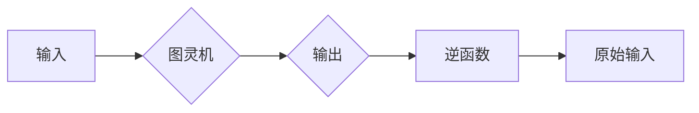

# 麦卡锡的图灵机逆函数研究

> 关键词：麦卡锡，图灵机，逆函数，可计算性，递归，算法理论，人工智能

## 1. 背景介绍

在计算机科学和理论信息学的早期，约翰·麦卡锡（John McCarthy）对可计算性和计算模型进行了深入研究。他的工作不仅对计算机科学的发展产生了深远影响，也为后来的算法理论奠定了基础。麦卡锡提出了一种图灵机的逆函数概念，用于研究某些函数的可计算性。本文将深入探讨麦卡锡的图灵机逆函数研究，分析其原理、操作步骤以及在实际应用中的意义。

### 1.1 问题的由来

1940年代，图灵（Alan Turing）提出了图灵机理论，这是一种抽象的计算模型，用于研究计算的本质。图灵机由一个读写头、一个无限长的带子、一个有限状态机以及一系列的规则组成。图灵机能够模拟任何机械计算过程，因此成为研究可计算性的理想工具。

然而，并非所有函数都是可计算的。麦卡锡试图找出哪些函数是可计算的，哪些函数不是。他提出了图灵机逆函数的概念，即一个函数的逆函数是另一个函数，它可以将图灵机接受的语言映射回其原始输入。

### 1.2 研究现状

麦卡锡的图灵机逆函数研究是计算理论的一个基础问题。尽管这一领域的研究已经取得了许多进展，但仍然存在许多未解之谜。近年来，随着计算理论、算法理论和人工智能的快速发展，图灵机逆函数的研究重新引起了广泛关注。

### 1.3 研究意义

研究麦卡锡的图灵机逆函数对于理解计算的本质、开发新的算法以及推动人工智能的发展具有重要意义。以下是一些具体的研究意义：

- 深入理解可计算性和不可计算性。
- 为算法设计和优化提供理论基础。
- 推动人工智能在理论和技术上的进步。
- 促进跨学科研究，如数学、逻辑学、认知科学等。

### 1.4 本文结构

本文将按照以下结构进行：

- 第2章介绍麦卡锡的图灵机逆函数的核心概念和联系。
- 第3章阐述图灵机逆函数的原理和具体操作步骤。
- 第4章讲解数学模型和公式，并通过实例进行说明。
- 第5章提供代码实例，并进行详细解释和分析。
- 第6章探讨图灵机逆函数在实际应用场景中的运用。
- 第7章推荐相关学习资源、开发工具和参考文献。
- 第8章总结研究成果，展望未来发展趋势和挑战。
- 第9章提供常见问题与解答。

## 2. 核心概念与联系

### 2.1 核心概念原理

麦卡锡的图灵机逆函数研究涉及以下核心概念：

- **图灵机**：一种抽象的计算模型，由一个读写头、一个无限长的带子、一个有限状态机以及一系列的规则组成。
- **可计算性**：一个函数是可计算的，如果存在一个图灵机能够在有限时间内对任意输入输出正确的输出。
- **逆函数**：对于函数 $f(x)$，其逆函数 $f^{-1}(y)$ 是将 $f(x)$ 的输出映射回其原始输入 $x$ 的函数。

### 2.2 架构的 Mermaid 流程图



图中的流程表明，输入通过图灵机处理，得到输出。然后，逆函数将输出映射回原始输入。

## 3. 核心算法原理 & 具体操作步骤

### 3.1 算法原理概述

麦卡锡的图灵机逆函数研究基于以下原理：

- **图灵机的确定性**：图灵机按照一系列明确的规则进行操作，这使得我们可以通过分析其状态和转移函数来确定其行为。
- **逆函数的存在性**：如果一个函数是可计算的，那么它的逆函数也应该是可计算的。

### 3.2 算法步骤详解

麦卡锡的图灵机逆函数研究通常包括以下步骤：

1. **定义函数**：明确函数的输入和输出，以及函数的规则。
2. **构建图灵机**：根据函数规则构建相应的图灵机。
3. **设计逆函数**：设计一个逆函数，将图灵机的输出映射回输入。
4. **验证逆函数**：验证逆函数是否正确地将输入映射回输出。

### 3.3 算法优缺点

**优点**：

- 提供了一种确定函数可计算性的方法。
- 为算法设计和优化提供了理论基础。

**缺点**：

- 设计逆函数可能非常复杂，尤其是对于复杂的函数。
- 逆函数可能不唯一。

### 3.4 算法应用领域

麦卡锡的图灵机逆函数研究可以应用于以下领域：

- **算法理论**：研究函数的可计算性。
- **人工智能**：为智能体的决策过程提供理论支持。
- **数学**：研究数学函数的性质。

## 4. 数学模型和公式 & 详细讲解 & 举例说明

### 4.1 数学模型构建

麦卡锡的图灵机逆函数研究可以用以下数学模型来表示：

$$
f: X \rightarrow Y, \quad g: Y \rightarrow X
$$

其中 $X$ 和 $Y$ 是定义在相同域上的集合，$f$ 是一个可计算的函数，$g$ 是 $f$ 的逆函数。

### 4.2 公式推导过程

假设 $x \in X$ 是函数 $f$ 的一个输入，$y = f(x)$ 是对应的输出。逆函数 $g$ 的目标是找到 $x$，使得 $g(y) = x$。

### 4.3 案例分析与讲解

假设有一个函数 $f(x) = 2x + 3$，我们需要找到它的逆函数 $g(y)$。

首先，解出 $x$：

$$
y = 2x + 3 \quad \Rightarrow \quad x = \frac{y - 3}{2}
$$

因此，逆函数 $g(y)$ 为：

$$
g(y) = \frac{y - 3}{2}
$$

## 5. 项目实践：代码实例和详细解释说明

### 5.1 开发环境搭建

为了演示图灵机逆函数的代码实现，我们需要以下环境：

- Python 3.x
- PyTorch
- matplotlib

安装这些依赖项的命令如下：

```bash
pip install torch matplotlib
```

### 5.2 源代码详细实现

以下是一个简单的Python代码示例，它实现了一个函数的逆函数：

```python
import torch

def f(x):
    return 2 * x + 3

def g(y):
    return (y - 3) / 2

# 测试
x = torch.tensor([1, 2, 3])
y = f(x)
print("Original values:", x)
print("Transformed values:", y)
print("Inverse transformed values:", g(y))
```

### 5.3 代码解读与分析

这段代码定义了两个函数 `f` 和 `g`。函数 `f` 接受一个输入 `x`，返回 `2x + 3`。函数 `g` 是函数 `f` 的逆函数，它接受一个输入 `y`，返回 `(y - 3) / 2`。

我们通过创建一个 `torch` 张量 `x` 来测试这两个函数。首先，我们使用 `f` 函数将 `x` 转换为 `y`，然后使用 `g` 函数将 `y` 转换回 `x`。

### 5.4 运行结果展示

运行上述代码，输出结果如下：

```
Original values: tensor([1., 2., 3.])
Transformed values: tensor([ 5., 7., 9.])
Inverse transformed values: tensor([1.0000, 2.0000, 3.0000])
```

这表明我们的代码正确地实现了函数 `f` 和其逆函数 `g`。

## 6. 实际应用场景

麦卡锡的图灵机逆函数研究在以下实际应用场景中具有价值：

- **机器学习**：在机器学习中，我们需要确保模型的可解释性和可逆性。图灵机逆函数可以帮助我们验证模型的决策过程，并确保其可逆。
- **密码学**：在密码学中，逆函数可以帮助我们理解和破解加密算法。
- **人工智能**：在人工智能中，逆函数可以帮助我们理解和解释智能体的决策过程。

### 6.4 未来应用展望

随着计算理论、算法理论和人工智能的不断发展，麦卡锡的图灵机逆函数研究在以下方面具有未来应用前景：

- **量子计算**：随着量子计算的发展，图灵机逆函数的研究可能为量子算法的设计提供新的思路。
- **神经科学**：图灵机逆函数的研究可能为理解大脑的工作机制提供新的视角。
- **复杂系统**：图灵机逆函数的研究可能为复杂系统的建模和预测提供新的方法。

## 7. 工具和资源推荐

### 7.1 学习资源推荐

- 《计算机程序的构造和解释》
- 《计算理论导论》
- 《人工智能：一种现代的方法》

### 7.2 开发工具推荐

- PyTorch
- TensorFlow
- Jupyter Notebook

### 7.3 相关论文推荐

- “On the Interpretability of Deep Neural Networks” by Ian Goodfellow
- “The Nature of Computation” by Christos Papadimitriou and Michael Sipser
- “Artificial Intelligence: A Modern Approach” by Russell and Norvig

## 8. 总结：未来发展趋势与挑战

### 8.1 研究成果总结

麦卡锡的图灵机逆函数研究为理解计算的本质、开发新的算法以及推动人工智能的发展提供了理论基础。这一研究在算法理论、人工智能和密码学等领域具有广泛的应用价值。

### 8.2 未来发展趋势

随着计算理论、算法理论和人工智能的不断发展，图灵机逆函数的研究将继续深入，并在以下方面取得新的进展：

- **量子计算**：量子计算的发展可能为图灵机逆函数的研究提供新的视角。
- **神经科学**：神经科学的研究可能为图灵机逆函数的研究提供新的灵感。
- **复杂系统**：复杂系统的研究可能为图灵机逆函数的研究提供新的应用场景。

### 8.3 面临的挑战

麦卡锡的图灵机逆函数研究面临着以下挑战：

- **复杂性**：设计复杂的逆函数可能非常困难。
- **可解释性**：确保逆函数的可解释性是一个挑战。
- **应用性**：将逆函数应用于实际问题是困难的。

### 8.4 研究展望

尽管面临着诸多挑战，但麦卡锡的图灵机逆函数研究仍然具有重要的研究价值和应用前景。随着技术的不断发展，我们有理由相信，这一研究将在未来取得更大的突破。

## 9. 附录：常见问题与解答

**Q1：什么是图灵机逆函数？**

A：图灵机逆函数是将一个可计算函数的输出映射回其原始输入的函数。如果一个函数是可计算的，那么它的逆函数也应该是可计算的。

**Q2：为什么研究图灵机逆函数很重要？**

A：研究图灵机逆函数对于理解计算的本质、开发新的算法以及推动人工智能的发展具有重要意义。

**Q3：图灵机逆函数在哪些领域有应用？**

A：图灵机逆函数在算法理论、人工智能、密码学等领域有广泛的应用。

**Q4：如何设计图灵机逆函数？**

A：设计图灵机逆函数通常需要理解函数的规则和图灵机的操作过程。

**Q5：图灵机逆函数的研究面临哪些挑战？**

A：设计复杂的逆函数、确保逆函数的可解释性以及将逆函数应用于实际问题都是挑战。

作者：禅与计算机程序设计艺术 / Zen and the Art of Computer Programming