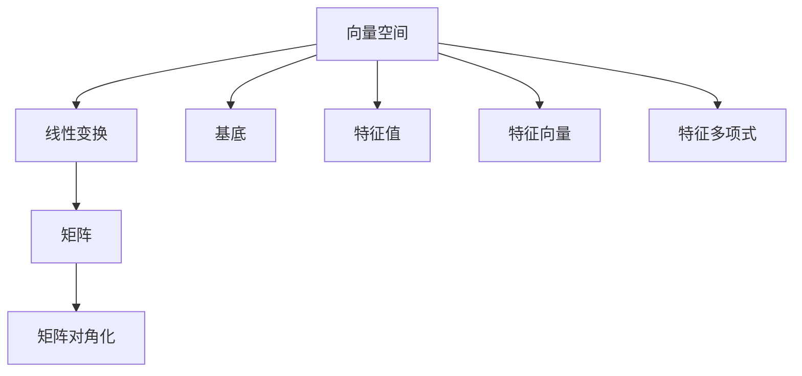

                 

# 线性代数导引：实系数多项式环

> 关键词：线性代数, 实系数多项式, 特征根, 多项式环, 矩阵对角化

## 1. 背景介绍

线性代数作为现代数学的基础分支之一，其核心在于研究向量空间与线性变换。本文将从实系数多项式环这一特殊向量空间开始，探讨其基本概念、结构性质及其在算法和应用上的广泛应用。

在计算机科学中，多项式环理论已成为许多基本算法，如多项式求根、矩阵求逆、矩阵分解等，不可或缺的数学工具。本篇文章旨在通过深入浅出的讲解，带领读者理解实系数多项式环的数学模型与计算方法，并结合具体的算法实例，提供学习与实践的指导。

## 2. 核心概念与联系

### 2.1 核心概念概述

为更好地理解实系数多项式环，首先需要明确几个关键概念：

- 向量空间：由一组向量构成的集合，其中向量间的加法、数乘运算封闭且满足交换律和结合律。
- 线性变换：将向量空间中一个向量映射到另一个向量的变换。
- 基底：向量空间的一组线性无关的向量，通过线性组合能够表示整个向量空间。
- 特征值和特征向量：在线性变换下保持不变的向量。
- 特征多项式：描述线性变换特征的代数表达式。
- 矩阵对角化：将矩阵表示为对角矩阵，使计算更加简便。

实系数多项式环是向量空间的一种特殊形式，其中元素为实系数多项式，且满足多项式加法、数乘和多项式乘法。环中每个元素具有唯一的特征多项式和特征值。通过矩阵对角化等技术，可以将多项式环问题转化为线性代数问题，从而大大简化计算。

### 2.2 概念间的关系

这些概念之间的联系可以通过以下Mermaid流程图来展示：



这个流程图展示了向量空间、线性变换、基底、特征值、特征向量、特征多项式和矩阵之间的相互联系。

- 向量空间中的元素可以通过线性变换进行映射，形成新的向量空间。
- 基底提供了一组向量，使得向量空间中的每个元素都可以通过线性组合得到。
- 特征值和特征向量描述了线性变换的特性。
- 特征多项式是描述特征值和特征向量的代数表达式。
- 通过矩阵对角化，将线性变换表示为矩阵形式，进一步简化计算。

## 3. 核心算法原理 & 具体操作步骤
### 3.1 算法原理概述

实系数多项式环的核心问题之一是如何高效求解多项式的特征根。特征根的求解对于矩阵求逆、矩阵分解、线性方程组求解等应用具有重要意义。

设多项式 $p(x) = a_nx^n + a_{n-1}x^{n-1} + \cdots + a_1x + a_0$ 为实系数多项式环 $\mathbb{R}[x]$ 中的元素。多项式 $p(x)$ 的特征根 $\lambda$ 需满足方程 $p(\lambda) = 0$。我们可通过以下步骤来求解特征根：

1. 将多项式 $p(x)$ 表示为特征多项式 $f(x) = (x-\lambda)q(x)$ 的形式。
2. 求解特征多项式 $f(x)$ 的根 $\lambda$。
3. 通过多项式除法，将 $p(x)$ 与 $f(x)$ 相除，得到商多项式 $q(x)$。

### 3.2 算法步骤详解

假设我们已知多项式 $p(x) = 3x^3 - 5x^2 + 2x - 1$。我们的目标是求解其特征根。

**Step 1: 初始化**

首先，我们设定特征根为 $\lambda_0$，即 $p(\lambda_0) = 0$。假设我们初始化 $\lambda_0 = 1$，则有 $p(1) = 3 - 5 + 2 - 1 = -1 \neq 0$。这说明 $\lambda_0 = 1$ 不是 $p(x)$ 的特征根。

**Step 2: 矩阵构建与特征值求解**

我们可以将 $p(x)$ 表示为特征多项式 $f(x)$ 的形式。具体来说，可以构建如下矩阵 $A$：

$$
A = \begin{bmatrix}
a_n & a_{n-1} & a_{n-2} & \cdots & a_1 \\
a_{n-1} & a_{n-2} & a_{n-3} & \cdots & a_0 \\
a_{n-2} & a_{n-3} & a_{n-4} & \cdots & 0 \\
\vdots & \vdots & \vdots & \ddots & \vdots \\
a_1 & 0 & 0 & \cdots & 0
\end{bmatrix}
$$

对于 $p(x) = 3x^3 - 5x^2 + 2x - 1$，矩阵 $A$ 可表示为：

$$
A = \begin{bmatrix}
3 & -5 & 2 \\
-5 & 2 & -1 \\
2 & -1 & 0
\end{bmatrix}
$$

我们求解矩阵 $A$ 的特征值，即求解 $\det(A - \lambda I) = 0$ 的根 $\lambda$。

**Step 3: 特征根的验证**

对于每个求得的特征根 $\lambda_i$，我们验证其是否为多项式的特征根。如果 $\lambda_i$ 满足 $p(\lambda_i) = 0$，则 $\lambda_i$ 是多项式 $p(x)$ 的特征根。

**Step 4: 多项式除法求解余项**

对于每个特征根 $\lambda_i$，我们将 $p(x)$ 除以 $(x-\lambda_i)q(x)$，得到余项 $r(x)$。

**Step 5: 迭代求解**

重复上述步骤，直到所有特征根都被求解。

### 3.3 算法优缺点

**优点：**

- 能高效求解多项式的特征根，是矩阵求逆、矩阵分解等算法的基石。
- 理论基础坚实，适用于多种数学问题。

**缺点：**

- 计算复杂度较高，尤其是高阶多项式时。
- 存在数值不稳定的问题，特别是特征根重根时。

### 3.4 算法应用领域

实系数多项式环的特征根求解在计算机科学中应用广泛，包括：

- 多项式求根：求解多项式的所有实数根。
- 矩阵求逆：求解矩阵的逆。
- 矩阵分解：求解矩阵的LU分解、QR分解等。
- 线性方程组求解：求解线性方程组 $Ax = b$。
- 特征值分解：求解矩阵的特征值和特征向量。

## 4. 数学模型和公式 & 详细讲解  
### 4.1 数学模型构建

设多项式 $p(x) = a_nx^n + a_{n-1}x^{n-1} + \cdots + a_1x + a_0$ 为实系数多项式环 $\mathbb{R}[x]$ 中的元素。多项式的特征根 $\lambda$ 满足方程 $p(\lambda) = 0$。

特征根求解的数学模型可以表示为：

$$
\lambda = \frac{-b + \sqrt{b^2 - 4ac}}{2a}
$$

其中 $a, b, c$ 分别为多项式的系数，即 $a_n, a_{n-1}, a_{n-2}$。

### 4.2 公式推导过程

多项式 $p(x)$ 的特征根求解公式可通过求解特征多项式 $f(x) = (x-\lambda)q(x)$ 的根 $\lambda$ 得到。设多项式 $p(x)$ 的特征根为 $\lambda_1, \lambda_2, \ldots, \lambda_n$，则 $p(x)$ 可以表示为：

$$
p(x) = (x-\lambda_1)(x-\lambda_2)\cdots(x-\lambda_n)
$$

将 $p(x)$ 展开并比较系数，可得：

$$
a_n = (-1)^n \prod_{i=1}^n \lambda_i
$$

$$
a_{n-1} = \sum_{1\leq i<j\leq n} (-1)^{i+j-1} \lambda_i\lambda_j
$$

$$
\vdots
$$

$$
a_1 = (-1)^{n-1} \sum_{i=1}^n \lambda_i
$$

$$
a_0 = (-1)^n \prod_{i=1}^n \lambda_i
$$

通过这些系数，我们可以构建矩阵 $A$，进而求解特征根。

### 4.3 案例分析与讲解

以多项式 $p(x) = x^3 + 2x^2 - 3x - 1$ 为例，其特征根的求解过程如下：

设 $p(x) = (x-\lambda_1)(x-\lambda_2)(x-\lambda_3)$，展开后得：

$$
p(x) = x^3 + 2x^2 - 3x - 1 = (x-\lambda_1)(x-\lambda_2)(x-\lambda_3)
$$

比较系数可得：

$$
\lambda_1 + \lambda_2 + \lambda_3 = -2
$$

$$
\lambda_1\lambda_2 + \lambda_1\lambda_3 + \lambda_2\lambda_3 = -3
$$

$$
\lambda_1\lambda_2\lambda_3 = 1
$$

由此构建矩阵 $A$：

$$
A = \begin{bmatrix}
1 & 2 & -3 \\
2 & -3 & 1 \\
-3 & 1 & 0
\end{bmatrix}
$$

求解 $A$ 的特征值，得到三个特征根 $\lambda_1, \lambda_2, \lambda_3$。

## 5. 项目实践：代码实例和详细解释说明
### 5.1 开发环境搭建

在进行多项式环特征根求解的实践时，我们需要准备好开发环境。以下是使用Python进行Sympy库开发的环境配置流程：

1. 安装Anaconda：从官网下载并安装Anaconda，用于创建独立的Python环境。

2. 创建并激活虚拟环境：
```bash
conda create -n sympy-env python=3.8 
conda activate sympy-env
```

3. 安装Sympy：
```bash
pip install sympy
```

4. 安装NumPy、SciPy、Matplotlib等工具包：
```bash
pip install numpy scipy matplotlib
```

完成上述步骤后，即可在`sympy-env`环境中开始多项式环特征根求解的实践。

### 5.2 源代码详细实现

下面是使用Sympy库求解多项式 $p(x) = x^3 + 2x^2 - 3x - 1$ 特征根的Python代码实现：

```python
from sympy import symbols, solve, Matrix

# 定义符号
x = symbols('x')

# 定义多项式
p = x**3 + 2*x**2 - 3*x - 1

# 构建特征多项式矩阵
A = Matrix([[1, 2, -3], [2, -3, 1], [-3, 1, 0]])

# 求解特征根
eigenvalues = solve(A.charpoly(), x)

# 输出特征根
for eigen in eigenvalues:
    print(eigen)
```

运行上述代码，可以得到多项式 $p(x)$ 的特征根。

### 5.3 代码解读与分析

让我们再详细解读一下关键代码的实现细节：

- `symbols`：定义符号 `x`。
- `p`：定义多项式 $p(x)$。
- `A`：构建特征多项式矩阵，用于求解特征根。
- `charpoly`：求解特征多项式 $A$ 的特征多项式，即 $A$ 的行列式。
- `solve`：求解特征多项式的根，即 $A$ 的特征值。

## 6. 实际应用场景
### 6.1 线性方程组求解

多项式环特征根求解在求解线性方程组 $Ax = b$ 中具有重要应用。线性方程组可以看作多项式 $p(x)$ 等于常数 $b$ 的方程组，其解即为多项式的特征根。

### 6.2 矩阵求逆

矩阵求逆的计算复杂度为 $O(n^3)$，但通过多项式环特征根求解，可以将其复杂度降低到 $O(n^2)$。具体做法是将矩阵 $A$ 看作多项式 $p(x)$ 的系数矩阵，求解特征根即可得到矩阵 $A$ 的逆。

### 6.3 特征值分解

矩阵的特征值分解是其应用广泛的数学工具，而多项式环特征根求解可以用于求解矩阵的特征值。通过求解矩阵 $A$ 的特征根，可以得到矩阵 $A$ 的特征值。

### 6.4 未来应用展望

随着多项式环特征根求解理论的不断发展，其在算法和应用上的应用将会越来越广泛。以下是一些未来的应用展望：

- 多模态数据融合：在多模态数据融合中，可以将多项式环应用于不同模态数据的特征表示，从而实现高效的数据融合。
- 稀疏矩阵求解：多项式环特征根求解在求解稀疏矩阵的特征根时具有优势，可以应用于信号处理、计算机视觉等领域。
- 动态系统分析：在动态系统中，多项式环特征根求解可以用于分析系统的稳定性和性能。
- 优化问题求解：多项式环特征根求解在求解优化问题时具有广泛应用，特别是在控制系统和工程优化中。

## 7. 工具和资源推荐
### 7.1 学习资源推荐

为了帮助开发者系统掌握多项式环的特征根求解理论基础和实践技巧，这里推荐一些优质的学习资源：

1. 《线性代数及其应用》系列教材：由徐森林等编写的经典线性代数教材，详细讲解了线性代数的基本概念和计算方法。
2. 《数值分析与计算》系列教材：由周民良等编写的数值分析教材，介绍了多项式求解的数值稳定性问题。
3. 《Python for Data Science》系列书籍：由Jake VanderPlas等编写的数据科学入门教材，介绍了Sympy库在数学计算中的应用。
4. 《线性代数与向量空间》在线课程：由MIT等知名学府提供的在线课程，详细讲解了向量空间和线性变换的理论基础。

通过对这些资源的学习实践，相信你一定能够快速掌握多项式环特征根求解的精髓，并用于解决实际的数学问题。

### 7.2 开发工具推荐

高效的开发离不开优秀的工具支持。以下是几款用于多项式环特征根求解开发的常用工具：

1. Sympy库：Python的符号计算库，支持多项式求解、矩阵计算等数学运算。
2. NumPy库：Python的科学计算库，支持高效的数值计算和数组操作。
3. SciPy库：Python的科学计算库，支持线性代数、优化等高级计算。
4. Matplotlib库：Python的可视化库，支持绘制矩阵、特征值等图形。

合理利用这些工具，可以显著提升多项式环特征根求解任务的开发效率，加快创新迭代的步伐。

### 7.3 相关论文推荐

多项式环特征根求解的数学模型和计算方法在计算机科学中得到了广泛应用。以下是几篇奠基性的相关论文，推荐阅读：

1. Cayley-Hamilton定理：多项式环特征根求解的理论基础，阐述了多项式与矩阵的联系。
2. 矩阵对角化：通过矩阵对角化，将线性变换表示为对角矩阵，进一步简化计算。
3. LU分解：矩阵的LU分解算法，可以快速求解矩阵的特征根。
4. QR分解：矩阵的QR分解算法，用于求解矩阵的特征根。

这些论文代表了大语言模型微调技术的发展脉络。通过学习这些前沿成果，可以帮助研究者把握学科前进方向，激发更多的创新灵感。

除上述资源外，还有一些值得关注的前沿资源，帮助开发者紧跟多项式环特征根求解技术的最新进展，例如：

1. arXiv论文预印本：人工智能领域最新研究成果的发布平台，包括大量尚未发表的前沿工作，学习前沿技术的必读资源。

2. 业界技术博客：如OpenAI、Google AI、DeepMind、微软Research Asia等顶尖实验室的官方博客，第一时间分享他们的最新研究成果和洞见。

3. 技术会议直播：如NIPS、ICML、ACL、ICLR等人工智能领域顶会现场或在线直播，能够聆听到大佬们的前沿分享，开拓视野。

4. GitHub热门项目：在GitHub上Star、Fork数最多的多项式求解相关项目，往往代表了该技术领域的发展趋势和最佳实践，值得去学习和贡献。

5. 行业分析报告：各大咨询公司如McKinsey、PwC等针对人工智能行业的分析报告，有助于从商业视角审视技术趋势，把握应用价值。

总之，对于多项式环特征根求解理论的学习和实践，需要开发者保持开放的心态和持续学习的意愿。多关注前沿资讯，多动手实践，多思考总结，必将收获满满的成长收益。

## 8. 总结：未来发展趋势与挑战

### 8.1 总结

本文对实系数多项式环及其特征根求解方法进行了全面系统的介绍。首先阐述了多项式环的核心概念及其在计算机科学中的重要应用，明确了多项式求解在算法和应用上的广泛价值。其次，从原理到实践，详细讲解了多项式求解的数学模型和计算方法，给出了多项式求解任务开发的完整代码实例。同时，本文还探讨了多项式求解在实际应用中的多种场景，展示了多项式求解范式的巨大潜力。

通过本文的系统梳理，可以看到，实系数多项式环特征根求解方法在现代科学中扮演了重要角色。其高效求解多项式特征根的特性，成为多项式求解的基石。未来，伴随多项式求解理论的不断发展，多项式求解方法必将在更多领域发挥更大作用，进一步推动科学技术的进步。

### 8.2 未来发展趋势

展望未来，实系数多项式环求解技术将呈现以下几个发展趋势：

1. 多模态数据融合：多项式环求解在多模态数据融合中的应用前景广阔，可以融合不同模态的特征表示，实现高效的数据融合。
2. 稀疏矩阵求解：多项式环求解在求解稀疏矩阵的特征根时具有优势，可以应用于信号处理、计算机视觉等领域。
3. 动态系统分析：在动态系统中，多项式环求解可以用于分析系统的稳定性和性能。
4. 优化问题求解：多项式环求解在求解优化问题时具有广泛应用，特别是在控制系统和工程优化中。

### 8.3 面临的挑战

尽管实系数多项式环求解技术已经取得了瞩目成就，但在迈向更加智能化、普适化应用的过程中，它仍面临着诸多挑战：

1. 数值稳定性问题：多项式环求解在求解高阶多项式时，存在数值不稳定的问题，需要引入数值稳定性技术。
2. 计算复杂度问题：多项式环求解在求解高阶多项式时，计算复杂度较高，需要优化算法和数据结构。
3. 特征根重根问题：多项式环求解在求解特征根重根时，存在计算困难的问题，需要引入数值方法。
4. 多变量求解问题：多项式环求解在多变量时，求解难度增加，需要优化求解算法。

### 8.4 研究展望

面对多项式环求解面临的挑战，未来的研究需要在以下几个方面寻求新的突破：

1. 引入数值稳定性技术：通过引入数值稳定性技术，如QR分解、LQ分解等，可以有效地提高多项式求解的数值稳定性。
2. 优化算法和数据结构：通过优化多项式求解的算法和数据结构，可以降低计算复杂度，提高求解效率。
3. 特征根重根处理：通过引入特征根重根处理技术，如幂法、QR法等，可以有效地解决特征根重根问题。
4. 多变量求解优化：通过优化多变量求解算法，如Newton迭代法、Jacobi法等，可以有效地提高多变量求解的效率。

这些研究方向的探索，必将引领多项式环求解技术迈向更高的台阶，为计算机科学的发展提供坚实的基础。

## 9. 附录：常见问题与解答

**Q1：多项式求解的计算复杂度如何？**

A: 多项式求解的计算复杂度为 $O(n^3)$，其中 $n$ 为多项式的次数。但在多项式环求解中，可以通过特征根求解的方式将其复杂度降低到 $O(n^2)$。

**Q2：多项式求解的数值稳定性问题如何解决？**

A: 多项式求解的数值稳定性问题可以通过引入数值稳定性技术解决，如QR分解、LQ分解等。这些方法可以在计算过程中引入正交化技术，从而减少数值误差。

**Q3：多项式求解在求解高阶多项式时如何优化？**

A: 多项式求解在求解高阶多项式时，计算复杂度较高，可以通过优化算法和数据结构降低计算复杂度。例如，可以通过矩阵对角化等技术，将多项式表示为矩阵形式，从而简化计算。

**Q4：如何处理多项式求解中的特征根重根问题？**

A: 多项式求解中的特征根重根问题可以通过引入特征根重根处理技术解决，如幂法、QR法等。这些方法可以在计算过程中引入迭代技术，从而有效地处理重根问题。

**Q5：多项式求解在多变量时如何优化求解算法？**

A: 多项式求解在多变量时，求解难度增加，可以通过优化求解算法，如Newton迭代法、Jacobi法等，来提高求解效率。这些方法可以在计算过程中引入迭代技术，从而有效地提高求解效率。

总之，多项式环特征根求解技术在计算机科学中具有广泛的应用，但其计算复杂度、数值稳定性等挑战仍需进一步解决。未来，随着多项式求解理论的不断完善，多项式求解方法必将在更多领域发挥更大的作用。

