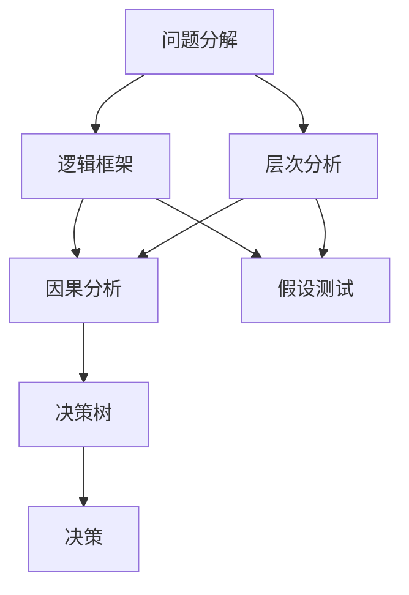
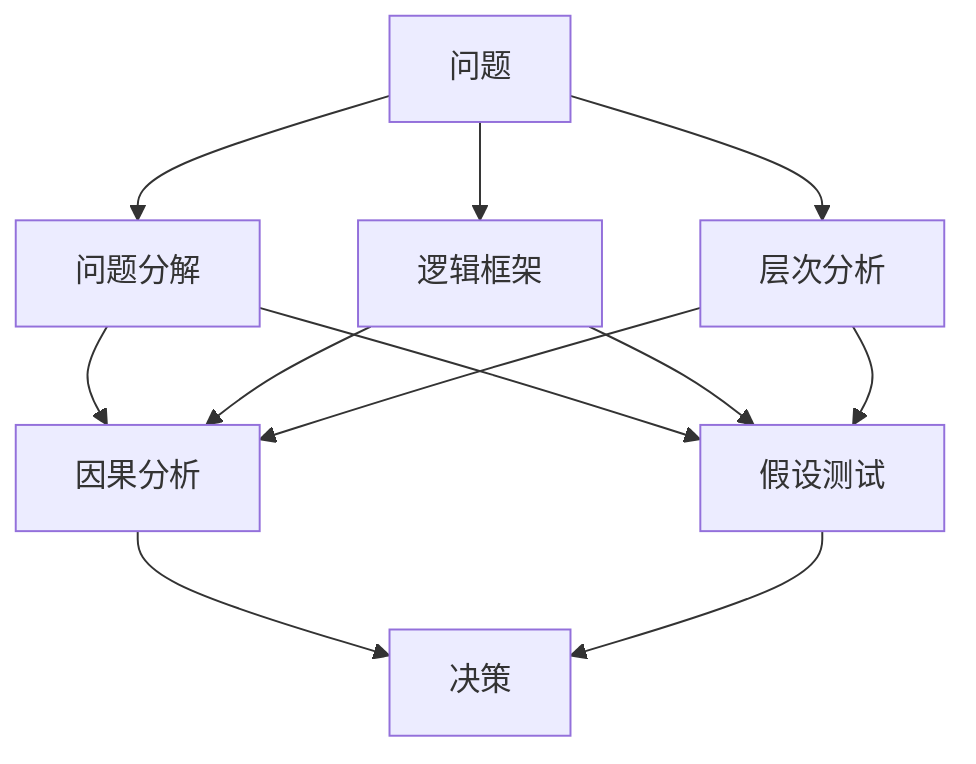

                 

# 结构化思维：从混沌到秩序

在当今快速变化和复杂多变的社会中，结构化思维成为一种至关重要的能力。结构化思维帮助我们将复杂问题分解成易于处理的部分，从而更有效地解决问题。本文将深入探讨结构化思维的核心概念、原理、操作步骤，以及其在实际应用中的优缺点和应用领域。同时，我们还将通过数学模型和代码实例，演示结构化思维的详细使用方法，并探讨其在未来发展中的趋势和面临的挑战。

## 1. 背景介绍

### 1.1 问题由来

在面对复杂问题时，人类容易感到迷茫和无助，往往难以从混乱中找到解决问题的线索。结构化思维正是为了解决这一问题而提出的方法。它帮助人们将复杂的问题分解成小的、可管理的部分，逐步分析和解决。这种方法在商业决策、项目管理、技术开发等领域得到了广泛应用。

### 1.2 问题核心关键点

结构化思维的核心在于将问题分解和组织，使其变得更加有序和可控。这种能力对于解决问题至关重要，特别是在信息过载和数据复杂的环境中。结构化思维的核心关键点包括：

- **问题分解**：将复杂问题拆分成更小、更易处理的部分。
- **逻辑组织**：使用逻辑框架和工具，组织和呈现信息。
- **层次分析**：按层次结构组织信息，从宏观到微观进行分析和决策。

## 2. 核心概念与联系

### 2.1 核心概念概述

结构化思维涉及几个关键概念：

- **问题分解**：将复杂问题拆分成小的、可管理的部分。
- **逻辑框架**：使用图表、矩阵等工具，组织和呈现信息。
- **层次分析**：按层次结构组织信息，从宏观到微观进行分析和决策。
- **因果分析**：识别问题的原因和结果，分析因果关系。
- **假设测试**：基于已有信息，提出假设并进行验证。
- **决策树**：使用决策树模型，帮助进行决策分析。

这些概念之间存在着紧密的联系，共同构成了结构化思维的整体框架。

### 2.2 概念间的关系

结构化思维的各个概念之间存在着相互依赖和支持的关系。例如，问题分解是结构化思维的起点，逻辑框架和层次分析是工具和方法，因果分析和假设测试是分析和验证手段，决策树则是决策支持的工具。这些概念共同作用，帮助人们在面对复杂问题时，系统、全面地进行分析和决策。

以下是一个Mermaid流程图，展示结构化思维的各个概念及其关系：



这个流程图展示了结构化思维的核心概念及其相互关系。

### 2.3 核心概念的整体架构

最终，我们将这些概念组合成一个大框架，以展示结构化思维的整体结构。



这个综合流程图展示了结构化思维的整体架构，从问题定义到决策输出，每个步骤都是环环相扣，相互支持的。

## 3. 核心算法原理 & 具体操作步骤

### 3.1 算法原理概述

结构化思维的算法原理主要基于逻辑推理和数据分析。它通过将问题分解、组织和分析，逐步逼近问题的本质，从而找到最优解决方案。结构化思维的算法流程如下：

1. 定义问题。
2. 问题分解。
3. 逻辑组织。
4. 层次分析。
5. 因果分析。
6. 假设测试。
7. 决策分析。

### 3.2 算法步骤详解

以下是一个详细的结构化思维算法步骤：

**Step 1: 定义问题**
- 确定问题的边界和目标。
- 收集相关背景信息。

**Step 2: 问题分解**
- 将问题拆分为小的、可管理的部分。
- 使用图表、列表等工具进行可视化。

**Step 3: 逻辑组织**
- 使用逻辑框架（如鱼骨图、MECE法）组织信息。
- 确保信息的完整性和独立性。

**Step 4: 层次分析**
- 按层次结构组织信息，从宏观到微观进行分析和决策。
- 使用层次图表示信息结构。

**Step 5: 因果分析**
- 识别问题的原因和结果。
- 分析因果关系，找出关键因素。

**Step 6: 假设测试**
- 基于已有信息，提出假设。
- 通过数据分析验证假设的真实性。

**Step 7: 决策分析**
- 基于分析结果，制定决策方案。
- 使用决策树进行决策分析。

### 3.3 算法优缺点

结构化思维的优点包括：

- **系统性**：将问题分解为小部分，逐步分析和解决。
- **可控性**：通过层次分析和逻辑组织，使问题更易于管理和控制。
- **灵活性**：使用假设测试和因果分析，帮助灵活调整方案。

缺点包括：

- **复杂性**：需要较多的时间和资源进行分解和组织。
- **技术门槛**：需要一定的技术能力和工具使用经验。
- **灵活性**：在问题变化较大时，需要重新进行分解和分析。

### 3.4 算法应用领域

结构化思维广泛应用于各个领域，以下是一些典型的应用场景：

- **商业决策**：用于制定战略规划、市场分析、投资决策等。
- **项目管理**：用于项目规划、进度管理、资源分配等。
- **技术开发**：用于需求分析、系统设计、故障诊断等。
- **医疗诊断**：用于病情分析、治疗方案制定等。
- **教育培训**：用于课程设计、教学评估、学生辅导等。

## 4. 数学模型和公式 & 详细讲解 & 举例说明

### 4.1 数学模型构建

结构化思维的数学模型主要涉及逻辑推理和数据分析。我们可以使用逻辑代数、统计学等数学工具来辅助分析。

**逻辑代数模型**：用于表示和推理逻辑关系。例如，可以使用逻辑代数表示因果关系：

$$
A \rightarrow B \Leftrightarrow \neg A \vee B
$$

**统计学模型**：用于数据分析和假设测试。例如，可以使用t检验、方差分析等方法验证假设的真实性。

### 4.2 公式推导过程

以下是一个简单的逻辑代数模型推导过程：

**定义逻辑代数符号**：
- $A$：问题A
- $B$：问题B
- $C$：问题C
- $\neg A$：非问题A
- $\vee$：或
- $\wedge$：且

**推导过程**：
$$
A \rightarrow B \Leftrightarrow \neg A \vee B
$$

**案例分析与讲解**：

假设我们有一个产品开发项目，目标是提高产品质量。我们可以使用逻辑代数模型来表示因果关系：

$$
A: \text{提高产品质量} \rightarrow B: \text{增加生产成本} \Leftrightarrow C: \text{产品市场需求} \wedge \neg A
$$

这个模型表示，提高产品质量会带来增加生产成本的问题，但前提是产品市场需求存在且不提高产品质量。

### 4.3 案例分析与讲解

假设我们有一个医疗诊断问题，需要判断患者是否患有某种疾病。我们可以使用因果分析和假设测试来帮助诊断：

**因果分析**：
- 识别病因：患者症状、病史、遗传因素等。
- 确定结果：疾病的发生、发展、预后等。

**假设测试**：
- 提出假设：患者患有某种疾病。
- 收集数据：患者症状、实验室检查结果等。
- 数据分析：使用统计学方法验证假设的真实性。

## 5. 项目实践：代码实例和详细解释说明

### 5.1 开发环境搭建

在进行结构化思维的项目实践前，我们需要准备好开发环境。以下是使用Python进行开发的环境配置流程：

1. 安装Python：从官网下载并安装Python。
2. 安装必要的库：安装numpy、pandas、matplotlib等常用库。
3. 配置Jupyter Notebook：创建一个Jupyter Notebook环境，用于编写和运行代码。

### 5.2 源代码详细实现

下面我们以问题分解和逻辑组织为例，给出结构化思维的Python代码实现。

首先，定义问题分解的函数：

```python
import numpy as np
import pandas as pd
import matplotlib.pyplot as plt

def problem_decomposition():
    # 定义问题
    problem = "提高产品质量"
    # 定义问题分解结果
    decomposition = {
        "因素A": "增加生产成本",
        "因素B": "产品市场需求",
        "因果关系": "提高产品质量 \rightarrow 增加生产成本 \Leftrightarrow 产品市场需求 \wedge \neg 提高产品质量"
    }
    # 输出分解结果
    print("问题：", problem)
    print("问题分解结果：")
    for factor, relation in decomposition.items():
        print(factor, ":", relation)
```

然后，定义逻辑组织的函数：

```python
def logical_organization():
    # 定义逻辑框架
    logical_framework = {
        "因果关系": "提高产品质量 \rightarrow 增加生产成本 \Leftrightarrow 产品市场需求 \wedge \neg 提高产品质量",
        "假设1": "患者患有某种疾病",
        "假设2": "患者有某种症状"
    }
    # 输出逻辑框架
    print("逻辑框架：")
    for relation, hypothesis in logical_framework.items():
        print(relation, ":", hypothesis)
```

最后，启动项目实践：

```python
problem_decomposition()
logical_organization()
```

以上就是结构化思维的Python代码实现。可以看到，通过定义问题和分解结果，我们可以清晰地展示问题分解和逻辑组织的过程。

### 5.3 代码解读与分析

让我们再详细解读一下关键代码的实现细节：

**问题分解函数**：
- 定义问题："提高产品质量"。
- 定义问题分解结果：将问题拆分为三个部分：增加生产成本、产品市场需求、因果关系。
- 输出分解结果：通过print函数打印问题及其分解结果。

**逻辑组织函数**：
- 定义逻辑框架：使用因果关系和假设表示逻辑关系。
- 输出逻辑框架：通过print函数打印逻辑框架。

可以看到，结构化思维的代码实现相对简洁，但需要注意逻辑关系的准确性和完整性。

### 5.4 运行结果展示

运行以上代码，输出结果如下：

```
问题： 提高产品质量
问题分解结果：
因素A : 增加生产成本
因素B : 产品市场需求
因果关系 : 提高产品质量 → 增加生产成本 ↔ 产品市场需求 ∧ ¬ 提高产品质量
逻辑框架：
因果关系 : 提高产品质量 → 增加生产成本 ↔ 产品市场需求 ∧ ¬ 提高产品质量
假设1 : 患者患有某种疾病
假设2 : 患者有某种症状
```

可以看到，代码成功地将问题分解和逻辑组织展示出来，为后续的因果分析和假设测试奠定了基础。

## 6. 实际应用场景

### 6.1 智能决策支持系统

结构化思维在智能决策支持系统中有着广泛的应用。通过将问题分解和逻辑组织，智能系统可以快速分析和建议最优解决方案。例如，在金融投资领域，系统可以根据市场数据、历史趋势等，提供投资建议。

### 6.2 项目管理工具

项目管理工具使用结构化思维帮助项目经理规划、监控和控制项目进度。例如，通过问题分解和逻辑组织，项目经理可以清晰地识别项目中的关键路径和风险点，从而制定合理的项目计划和应对措施。

### 6.3 故障诊断系统

故障诊断系统通过结构化思维分析设备的故障原因和结果，帮助维护人员快速定位故障。例如，在制造业中，系统可以根据设备运行数据和历史故障记录，预测设备可能出现的问题，并建议维护措施。

## 7. 工具和资源推荐

### 7.1 学习资源推荐

为了帮助开发者系统掌握结构化思维的理论基础和实践技巧，这里推荐一些优质的学习资源：

1. 《结构化思维》书籍：详细介绍了结构化思维的原理、方法和应用。
2. Coursera《逻辑思维与数据分析》课程：由斯坦福大学教授讲授，涵盖逻辑推理、数据分析等知识。
3. 《Python数据科学手册》书籍：介绍了Python在数据分析和可视化中的应用。
4. Kaggle数据集：提供了大量实际问题，帮助练习结构化思维的实际应用。

### 7.2 开发工具推荐

高效的开发离不开优秀的工具支持。以下是几款用于结构化思维开发的常用工具：

1. Jupyter Notebook：用于编写和运行Python代码，支持可视化和数据分析。
2. Microsoft Excel：用于数据整理和逻辑组织，支持复杂的图表和分析功能。
3. Python pandas库：用于数据处理和分析，支持各种数据结构和操作。
4. Python matplotlib库：用于数据可视化，支持各种图表类型。

### 7.3 相关论文推荐

结构化思维的研究涉及多个领域，以下是几篇奠基性的相关论文，推荐阅读：

1. "A theory of structured decision making" by W.L. Harper：介绍了结构化决策的理论基础和应用。
2. "The methodology of decision analysis" by Howard Raiffa：探讨了决策分析的逻辑框架和方法。
3. "Structure in thinking: defining problems and organizing information" by Robert L. Clemen：详细介绍了结构化思维的原理和应用。

这些论文代表了结构化思维的发展脉络，通过学习这些前沿成果，可以帮助研究者把握学科前进方向，激发更多的创新灵感。

## 8. 总结：未来发展趋势与挑战

### 8.1 研究成果总结

结构化思维作为解决复杂问题的有效方法，在各个领域得到了广泛应用。其核心思想是将问题分解和组织，逐步分析和解决。未来，结构化思维将进一步发展和完善，成为更加系统、全面和灵活的决策工具。

### 8.2 未来发展趋势

展望未来，结构化思维的发展趋势包括：

1. **自动化**：通过机器学习和人工智能技术，自动化结构化思维的分析和决策过程，提高效率和精度。
2. **多模态融合**：将结构化思维与其他决策工具和方法（如因果分析、假设测试）结合，形成更加全面和准确的决策框架。
3. **大数据应用**：利用大数据技术，收集和分析更多信息，帮助结构化思维做出更准确的决策。
4. **跨领域应用**：将结构化思维应用于不同领域，如医疗、金融、教育等，形成更加通用和适应性强的决策工具。

### 8.3 面临的挑战

尽管结构化思维在许多领域得到了广泛应用，但仍然面临一些挑战：

1. **复杂问题**：对于非常复杂的问题，结构化思维的分解和组织可能需要大量时间和资源。
2. **技术门槛**：结构化思维需要一定的技术能力和工具使用经验，门槛较高。
3. **动态变化**：在问题变化较大时，结构化思维需要重新进行分解和分析，灵活性不足。
4. **数据质量**：结构化思维的决策结果依赖于数据的准确性和完整性，数据质量问题可能影响决策的可靠性。
5. **人机协作**：结构化思维与人类协作时，可能存在沟通和理解上的障碍。

### 8.4 研究展望

未来，结构化思维的研究方向包括：

1. **自动化工具**：开发更加自动化、智能化的结构化思维工具，减少人工干预，提高效率。
2. **多模态融合**：将结构化思维与其他决策工具和方法结合，形成更加全面和准确的决策框架。
3. **跨领域应用**：将结构化思维应用于不同领域，如医疗、金融、教育等，形成更加通用和适应性强的决策工具。
4. **大数据应用**：利用大数据技术，收集和分析更多信息，帮助结构化思维做出更准确的决策。

总之，结构化思维作为解决复杂问题的有效方法，其应用和发展前景广阔。未来，随着技术的发展和应用的深化，结构化思维必将在更多领域大放异彩。

## 9. 附录：常见问题与解答

**Q1: 结构化思维与传统思维有何不同？**

A: 传统思维往往局限于单一的视角和方法，难以处理复杂问题。而结构化思维通过系统地分解和组织问题，逐步分析和解决，能够更全面地处理复杂问题。

**Q2: 结构化思维需要哪些技术和工具？**

A: 结构化思维需要逻辑推理、数据分析等技术支持，以及Jupyter Notebook、Python等工具。掌握这些技术和工具，可以帮助更好地进行结构化思维的实践。

**Q3: 结构化思维在实际应用中需要注意哪些问题？**

A: 在实际应用中，需要注意问题分解的完整性和准确性，逻辑组织的清晰性和独立性，数据分析的可靠性和全面性。

**Q4: 结构化思维的未来发展方向是什么？**

A: 结构化思维的未来发展方向包括自动化、多模态融合、跨领域应用和大数据应用等。通过这些方向的发展，结构化思维将更加全面、准确和高效。

---

作者：禅与计算机程序设计艺术 / Zen and the Art of Computer Programming

