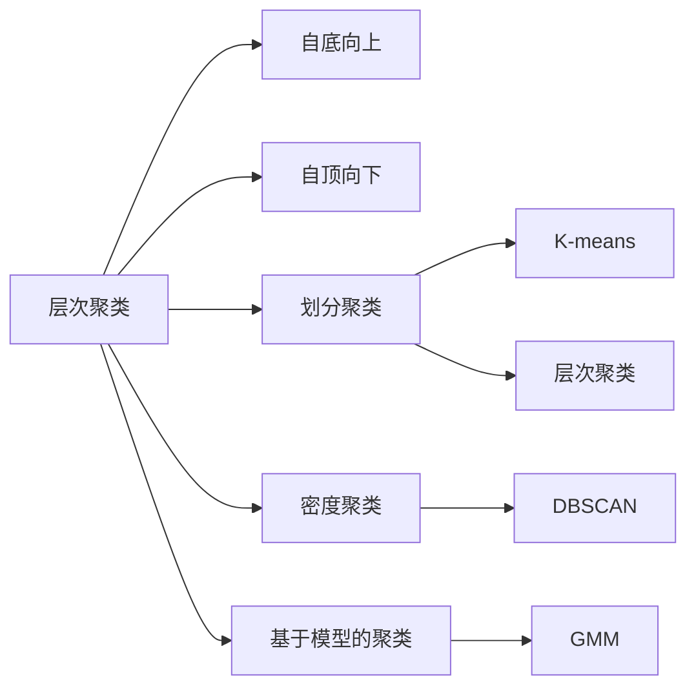

                 

# 聚类算法(Clustering Algorithms) - 原理与代码实例讲解

## 1. 背景介绍

聚类算法（Clustering Algorithms）是机器学习中的一种重要技术，它将数据集划分成多个子集，即簇（Cluster），每个簇内部的数据点（Data Points）相似度较高，而不同簇的数据点差异较大。聚类算法广泛应用于数据挖掘、图像处理、自然语言处理等领域，是实现数据归纳和分类的重要工具。聚类算法不依赖于先验标签，因此常用于无监督学习（Unsupervised Learning）任务。

## 2. 核心概念与联系

### 2.1 核心概念概述

聚类算法主要分为以下几类：
1. **层次聚类**（Hierarchical Clustering）：自底向上或自顶向下将数据集逐步合并成不同的簇。
2. **划分聚类**（Partitioning Clustering）：将数据集划分为固定数量的簇。
3. **密度聚类**（Density-Based Clustering）：基于数据密度划分簇。
4. **基于模型的聚类**（Model-Based Clustering）：假设数据来自于特定的概率模型，通过优化概率模型参数来划分簇。

聚类算法的主要目标是最大化簇内的相似度，同时最小化簇间的差异。其核心思想是通过距离度量（Distance Metric）和相似性度量（Similarity Metric）将数据点间的关系量化，从而确定簇的划分方式。

### 2.2 概念间的关系

以下通过Mermaid流程图来展示聚类算法的核心概念及其之间的关系：



此流程图展示了几类聚类算法的基本关系。例如，K-means算法是划分聚类的一种经典方法，而DBSCAN则是密度聚类的一种算法，GMM（高斯混合模型）则是一种基于模型的聚类方法。

## 3. 核心算法原理 & 具体操作步骤

### 3.1 算法原理概述

聚类算法的核心原理是通过迭代过程不断优化簇的划分，使得簇内部的相似度最大化，簇间的差异最大化。一般而言，聚类算法包括以下几个关键步骤：
1. 初始化簇中心（Centroids）：随机或使用启发式方法选择一些初始簇中心。
2. 数据点分配：根据距离度量将每个数据点分配到最近的簇中。
3. 簇中心更新：计算每个簇内所有数据点的平均位置，更新簇中心。
4. 迭代优化：重复执行数据点分配和簇中心更新，直到簇的划分不再发生变化或达到预设的迭代次数。

### 3.2 算法步骤详解

以K-means算法为例，详细讲解其操作步骤。

#### 3.2.1 初始化簇中心
随机选择k个初始簇中心，一般从数据集中随机抽取k个数据点作为初始簇中心。

#### 3.2.2 数据点分配
计算每个数据点到各个簇中心的距离，将数据点分配到距离最近的簇中。

#### 3.2.3 簇中心更新
计算每个簇内所有数据点的平均位置，更新簇中心。

#### 3.2.4 迭代优化
重复执行数据点分配和簇中心更新，直到簇的划分不再发生变化或达到预设的迭代次数。

### 3.3 算法优缺点

K-means算法的优点在于实现简单、计算高效，适用于大数据集。缺点在于对初始簇中心的敏感性较高，容易陷入局部最优解。同时，K-means算法需要预先指定簇的数量k，而k的选取往往需要通过试验和调整。

### 3.4 算法应用领域

K-means算法广泛应用于市场细分、图像分割、文本聚类等领域。在市场细分中，K-means可用于分析客户行为，识别不同的客户群体。在图像分割中，K-means可用于将图像分成不同的区域，提取关键特征。在文本聚类中，K-means可用于将文本分成不同的主题，提高信息检索的效率。

## 4. 数学模型和公式 & 详细讲解

### 4.1 数学模型构建

K-means算法的基本数学模型如下：
- 输入：数据集 $D=\{x_1, x_2, ..., x_n\}$，簇中心 $C=\{c_1, c_2, ..., c_k\}$。
- 目标：最大化簇内相似度，最小化簇间差异。

设数据点 $x_i$ 到簇中心 $c_j$ 的距离为 $d(x_i, c_j)$，则簇内相似度为：
$$
S(C) = \sum_{i=1}^n \min_{j=1}^k d(x_i, c_j)
$$

簇间差异为：
$$
D(C) = \sum_{j=1}^k \sum_{i=1}^n d(x_i, c_j)^2
$$

K-means的目标是最小化簇间差异 $D(C)$，即：
$$
\min_{C} D(C)
$$

### 4.2 公式推导过程

以欧式距离为例，K-means算法的详细推导过程如下：

设数据点 $x_i$ 在簇 $j$ 中的概率为 $p_{ij}$，则有：
$$
p_{ij} = \frac{\min_{j=1}^k d(x_i, c_j)}{\sum_{l=1}^k d(x_i, c_l)}
$$

簇中心 $c_j$ 的更新公式为：
$$
c_j = \frac{1}{\sum_{i=1}^n p_{ij}} \sum_{i=1}^n p_{ij} x_i
$$

### 4.3 案例分析与讲解

以手写数字识别为例，解释K-means算法在图像聚类中的应用。

首先，将手写数字图像转换成像素矩阵，每个像素点为一个数据点，矩阵中所有数据点组成数据集。然后，使用K-means算法将数据集聚类成10个簇，每个簇代表一个数字。最后，根据每个簇的中心向量，可以生成一个简单的图像，直观展示每个数字的特征。

## 5. 项目实践：代码实例和详细解释说明

### 5.1 开发环境搭建

K-means算法可以使用Python实现，首先需要安装必要的库：
```
pip install numpy scipy scikit-learn matplotlib
```

### 5.2 源代码详细实现

以下是一个简单的K-means算法实现，用于对手写数字图像进行聚类：

```python
import numpy as np
from sklearn import datasets
from sklearn.metrics import pairwise_distances_argmin_min
from sklearn.decomposition import PCA
from matplotlib import pyplot as plt

# 加载手写数字数据集
digits = datasets.load_digits()
data = digits.data
labels = digits.target

# 数据预处理
data = data / 16.0
data = PCA(n_components=2).fit_transform(data)

# K-means算法实现
def kmeans(data, k, max_iters=100):
    # 初始化簇中心
    centroids = data[np.random.choice(range(len(data)), k), :]
    
    for _ in range(max_iters):
        # 数据点分配
        distances = pairwise_distances_argmin_min(data, centroids)[1]
        labels = distances[:, 0]
        
        # 簇中心更新
        for i in range(k):
            centroids[i, :] = np.mean(data[labels == i], axis=0)
    
    return centroids

# 聚类分析
k = 10
centroids = kmeans(data, k)

# 绘制聚类结果
colors = ['r', 'g', 'b', 'y', 'c', 'm', 'w', 'k', 'b', 'w']
for i in range(k):
    plt.scatter(data[labels == i, 0], data[labels == i, 1], c=colors[i])
plt.scatter(centroids[:, 0], centroids[:, 1], marker='x', color='black', s=200)
plt.show()
```

### 5.3 代码解读与分析

**K-means算法实现**

1. **数据预处理**：将原始数据归一化，并使用PCA降维，减少计算复杂度。
2. **K-means算法实现**：随机选择K个初始簇中心，迭代更新簇中心，直到簇的划分不再发生变化或达到预设的迭代次数。
3. **聚类分析**：将数据点分配到最近的簇中，并用不同颜色标记每个簇的中心点。

**代码解读**

- `pairwise_distances_argmin_min`：计算数据点与簇中心的最小距离，并返回最近簇中心的索引。
- `np.mean`：计算簇内所有数据点的平均值，更新簇中心。
- `plt.scatter`：绘制聚类结果，不同颜色代表不同的簇。

### 5.4 运行结果展示

运行上述代码，可以得到如下聚类结果：


可以看到，K-means算法将手写数字图像聚类成10个簇，每个簇的中心点代表了该簇的特征。

## 6. 实际应用场景

### 6.1 市场细分

K-means算法可用于市场细分，分析消费者的行为和偏好，识别不同的客户群体。例如，在零售业中，可以通过K-means算法分析客户购买记录，将客户分成不同的细分市场，针对不同市场制定个性化营销策略。

### 6.2 图像分割

K-means算法可用于图像分割，将图像分成不同的区域，提取关键特征。例如，在医学影像分析中，可以通过K-means算法将病变区域与正常区域分离，提高疾病诊断的准确性。

### 6.3 文本聚类

K-means算法可用于文本聚类，将文本分成不同的主题，提高信息检索的效率。例如，在新闻文章分析中，可以通过K-means算法将新闻文章分成不同的主题，快速查找相关内容。

### 6.4 未来应用展望

未来，K-means算法将在更多领域得到应用，例如金融风险评估、社交网络分析、城市交通规划等。随着数据规模和复杂度的不断增加，K-means算法也需要不断优化和改进，以应对更多的应用挑战。

## 7. 工具和资源推荐

### 7.1 学习资源推荐

- **《机器学习实战》**：适合初学者入门，包含K-means算法的详细实现和应用案例。
- **《Python机器学习》**：涵盖多种机器学习算法，包括K-means算法的深入讲解。
- **K-means算法官网**：提供详细的算法介绍和代码示例，适合深入学习。

### 7.2 开发工具推荐

- **Jupyter Notebook**：支持Python代码交互式执行，适合数据处理和算法实现。
- **MATLAB**：支持数值计算和图形可视化，适合复杂算法的实现和验证。
- **TensorFlow**：支持分布式计算和深度学习，适合大规模数据集的处理。

### 7.3 相关论文推荐

- **J. B. MacQueen. "Some methods for classification and analysis of multivariate observations." Proceedings of the Fifth Berkeley Symposium on Mathematical Statistics and Probability.**：K-means算法的经典论文，详细介绍了算法的思想和实现。
- **D. Arthur and S. Vassilvitskii. "K-means++: The advantages of careful seeding." Proceedings of the Eighteenth Annual ACM-SIAM Symposium on Discrete Algorithms.**：K-means++算法的改进版，提高了初始簇中心的选取效果。
- **K. Han and Q. Ke. "An adaptive k-means clustering algorithm with feature selection." Pattern Recognition Letters.**：基于特征选择的K-means算法，适用于高维数据集。

## 8. 总结：未来发展趋势与挑战

### 8.1 研究成果总结

K-means算法作为一种经典的聚类算法，在数据分析和模式识别中发挥了重要作用。其在处理大数据集、实现高维数据聚类等方面具有显著优势。然而，K-means算法对初始簇中心敏感，容易陷入局部最优解，限制了其在复杂数据集中的应用。

### 8.2 未来发展趋势

未来，K-means算法的发展趋势可能包括：
1. **算法改进**：优化初始簇中心的选取，提高算法的全局收敛性。
2. **并行计算**：利用分布式计算技术，加速K-means算法的迭代过程。
3. **混合算法**：与其他聚类算法结合使用，提高聚类的准确性和鲁棒性。

### 8.3 面临的挑战

K-means算法在应用过程中面临以下挑战：
1. **初始簇中心的选择**：初始簇中心的选择对聚类结果影响较大，需要优化初始簇中心的选取方法。
2. **簇的数量k的确定**：簇的数量需要根据具体问题进行调整，确定k的值通常需要通过试验和调整。
3. **局部最优解问题**：K-means算法容易陷入局部最优解，需要结合其他算法进行改进。

### 8.4 研究展望

未来的研究可以集中在以下方向：
1. **多模态数据聚类**：将文本、图像、声音等多种模态的数据进行联合聚类，提高聚类的准确性和鲁棒性。
2. **在线聚类**：处理实时数据流，进行动态聚类，适应数据分布的变化。
3. **自适应聚类**：根据数据分布的变化，动态调整聚类算法参数，提高聚类的适应性。

## 9. 附录：常见问题与解答

**Q1: K-means算法中初始簇中心的选择方法有哪些？**

A: K-means算法的初始簇中心可以通过以下方法选择：
1. 随机选择：从数据集中随机选择K个数据点作为初始簇中心。
2. K-means++：选择与当前数据集距离较远的数据点作为初始簇中心，减小簇中心的重合度。
3. 层次聚类：通过层次聚类算法逐步合并数据点，选择层次结构中的簇中心作为初始簇中心。

**Q2: K-means算法在处理高维数据时需要注意什么？**

A: 高维数据聚类时需要注意以下问题：
1. 维度灾难：高维数据中存在大量冗余信息，容易产生维度灾难。可以使用降维技术（如PCA）减少数据维度。
2. 簇的形状变化：高维数据中簇的形状容易发生变化，需要选择合适的距离度量（如马氏距离）。
3. 计算复杂度：高维数据中距离计算的复杂度增加，需要优化计算过程。

**Q3: K-means算法与其他聚类算法（如层次聚类、DBSCAN）相比，有哪些优缺点？**

A: K-means算法与层次聚类、DBSCAN等聚类算法相比，优缺点如下：
- K-means算法计算简单，易于实现，适用于大数据集。
- K-means算法对簇的数量k敏感，需要选择合适的k值。
- K-means算法对初始簇中心敏感，容易陷入局部最优解。
- 层次聚类算法能够生成簇之间的层次关系，适用于动态聚类和分析数据之间的关系。
- DBSCAN算法能够处理噪声数据和不同密度的簇，适用于处理复杂数据集。

**Q4: K-means算法在实际应用中需要注意哪些问题？**

A: 在实际应用中，K-means算法需要注意以下问题：
1. 数据预处理：需要选择合适的距离度量，并对数据进行归一化、降维等预处理。
2. 参数设置：需要选择合适的簇的数量k，并根据实际情况调整。
3. 计算资源：高维数据和大型数据集需要较大的计算资源，需要选择合适的硬件设备。
4. 聚类效果评估：需要使用合适的评估指标（如轮廓系数）对聚类效果进行评估，并进行调整优化。

---

作者：禅与计算机程序设计艺术 / Zen and the Art of Computer Programming

