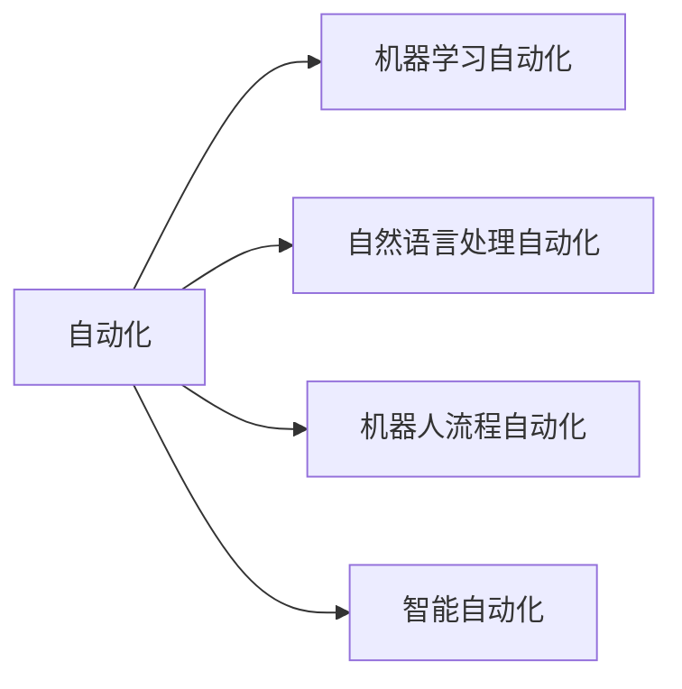
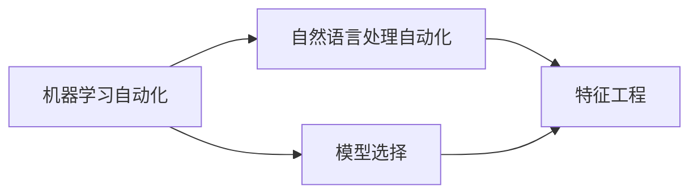
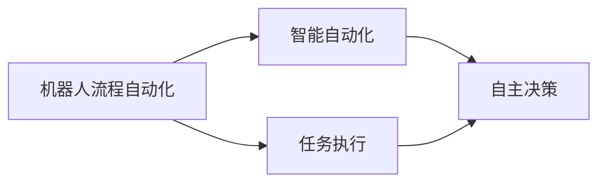

                 

# 自动化的最新发展与挑战

> 关键词：自动化、AI自动化、机器学习自动化、自然语言处理自动化、未来发展趋势

## 1. 背景介绍

### 1.1 问题由来

随着人工智能(AI)技术的不断进步，自动化已经成为了各行各业提升效率、降低成本的重要手段。自动化技术不仅能够减少人为错误，提高工作效率，还能够释放人力资源，使其能专注于更高价值的工作。然而，自动化技术在普及过程中也遇到了诸多挑战，如系统可解释性、数据隐私、模型公平性等问题，制约了其进一步的发展和应用。

### 1.2 问题核心关键点

当前，自动化技术主要集中在以下几个方面：

- **机器学习自动化**：通过自动化机器学习(AutoML)技术，自动化模型选择、超参数调整和模型优化，提高模型的开发和部署效率。
- **自然语言处理自动化**：利用自然语言处理(NLP)技术，实现自动化的文本分析、翻译、情感分析、对话系统等功能。
- **企业自动化**：引入自动化流程和机器人流程自动化(RPA)技术，提升企业的生产、运营和客户服务效率。
- **智能自动化**：结合AI和机器人技术，实现自主决策和自主执行，进一步提升自动化水平。

这些自动化技术在各个行业的应用已经取得了显著的成效，但同时也面临着新的挑战和机遇。本文将从自动化技术的最新发展、核心概念、算法原理、实际应用、未来趋势等方面进行系统探讨，以期为自动化技术的进一步发展提供有益的参考和思考。

## 2. 核心概念与联系

### 2.1 核心概念概述

为更好地理解自动化技术，本节将介绍几个密切相关的核心概念：

- **自动化**：通过计算机程序或软件实现的任务自动化执行，减少人为操作，提高效率和准确性。
- **机器学习自动化**：利用算法和模型自动化机器学习流程，包括数据预处理、特征工程、模型训练和评估等步骤。
- **自然语言处理自动化**：应用NLP技术实现文本数据的自动化处理，包括自动文本分类、情感分析、问答系统等。
- **机器人流程自动化**：通过软件机器人自动执行企业中的重复性、规则性工作流程，提升运营效率。
- **智能自动化**：结合AI和机器人技术，实现自主决策和执行，进一步提高自动化水平。

这些核心概念之间的逻辑关系可以通过以下Mermaid流程图来展示：



这个流程图展示了自动化技术的主要分支和其相互关联的关系：自动化通过机器学习自动化和自然语言处理自动化提高数据处理和决策的智能化水平，通过机器人流程自动化和智能自动化提高企业运营的效率和灵活性。

### 2.2 概念间的关系

这些核心概念之间存在着紧密的联系，形成了自动化的完整生态系统。下面我们通过几个Mermaid流程图来展示这些概念之间的关系。

#### 2.2.1 机器学习自动化与自然语言处理自动化的联系



这个流程图展示了机器学习自动化和自然语言处理自动化的联系。自然语言处理自动化可以通过机器学习自动化中的模型选择、特征工程等步骤，提高自动化文本分析的精度和效率。

#### 2.2.2 机器人流程自动化与智能自动化的联系



这个流程图展示了机器人流程自动化与智能自动化的联系。机器人流程自动化可以实现简单规则性的任务执行，智能自动化则结合AI技术，实现自主决策和执行，进一步提高自动化水平。

## 3. 核心算法原理 & 具体操作步骤

### 3.1 算法原理概述

自动化技术的核心算法原理主要包括机器学习自动化、自然语言处理自动化和机器人流程自动化的算法。这些算法通过优化模型选择、特征提取、决策优化等过程，实现任务的自动化执行。

- **机器学习自动化**：主要通过AutoML技术实现模型的自动化构建和优化。AutoML算法利用自动化算法选择、超参数调整和模型优化，提高模型的开发和部署效率。
- **自然语言处理自动化**：主要通过NLP技术实现文本数据的自动化处理。NLP算法利用词向量、深度学习模型等技术，实现文本分类、情感分析、自动问答等自动化功能。
- **机器人流程自动化**：主要通过RPA技术实现流程的自动化执行。RPA算法利用规则引擎、流程建模等技术，实现业务流程的自动化。

### 3.2 算法步骤详解

以下是自动化技术的核心算法步骤详解：

**Step 1: 数据收集与预处理**

- 收集相关的数据集，包括结构化数据和非结构化数据。
- 对数据进行清洗和预处理，包括去除噪声、处理缺失值、标准化等步骤。

**Step 2: 特征工程与模型选择**

- 根据任务需求，选择合适的特征并进行特征工程，包括特征提取、特征选择等。
- 使用AutoML算法进行模型选择，包括模型候选、交叉验证、模型评估等步骤。

**Step 3: 模型训练与优化**

- 使用训练数据集训练模型，并通过优化算法进行超参数调整和模型优化。
- 使用验证数据集评估模型性能，并根据评估结果调整模型参数。

**Step 4: 自动化执行与监控**

- 使用训练好的模型进行自动化执行，包括数据处理、任务执行等。
- 对自动化执行过程进行实时监控，确保系统的稳定性和可靠性。

**Step 5: 数据反馈与模型更新**

- 对自动化执行结果进行数据反馈，用于模型更新和优化。
- 根据反馈数据不断更新和优化模型，提高自动化执行的准确性和效率。

### 3.3 算法优缺点

自动化技术的核心算法具有以下优点：

- **效率提升**：通过自动化算法，可以快速构建和优化模型，提高数据处理和决策效率。
- **成本降低**：自动化技术可以减少人为错误，降低人力成本和时间成本。
- **精度提升**：通过自动化特征工程和模型优化，可以提高模型的精度和泛化能力。

然而，自动化技术也存在以下缺点：

- **可解释性不足**：自动化算法通常缺乏可解释性，难以理解其内部决策机制。
- **数据依赖性强**：自动化技术的性能依赖于数据的质量和数量，数据获取成本高。
- **模型公平性问题**：自动化模型可能会引入数据偏差，导致模型预测存在偏见。
- **安全风险**：自动化技术在数据处理和决策过程中，可能存在隐私泄露和安全性问题。

### 3.4 算法应用领域

自动化技术已经在多个领域得到了广泛应用，涵盖了从企业运营到智能制造，从医疗诊断到金融分析等多个方面：

- **企业运营**：在企业运营中，通过自动化流程和机器人流程自动化，提升生产效率和运营质量。
- **医疗诊断**：利用自动化机器学习技术，提高疾病诊断的精度和效率。
- **金融分析**：通过自动化文本分析和情感分析，提升金融风险评估和市场预测的准确性。
- **智能制造**：结合自动化和机器人技术，实现生产流程的智能化和自动化。

## 4. 数学模型和公式 & 详细讲解 & 举例说明

### 4.1 数学模型构建

本节将使用数学语言对自动化技术中的机器学习自动化进行详细阐述。

假设自动化任务为数据分类，输入为 $x$，输出为 $y$，则分类问题的数学模型可以表示为：

$$
P(y|x) = \frac{P(x|y)P(y)}{P(x)}
$$

其中 $P(y|x)$ 为条件概率，表示在给定输入 $x$ 的情况下，输出 $y$ 的概率；$P(x|y)$ 为边缘概率，表示在给定输出 $y$ 的情况下，输入 $x$ 的概率；$P(y)$ 为先验概率，表示输出 $y$ 的先验概率；$P(x)$ 为归一化常数，表示输入 $x$ 的归一化概率。

### 4.2 公式推导过程

分类问题的训练过程，即通过最大化条件概率 $P(y|x)$ 来进行模型训练。常用的分类算法包括逻辑回归、支持向量机(SVM)、决策树等。以逻辑回归为例，其目标函数为：

$$
\mathcal{L}(w,b) = -\frac{1}{2m}\sum_{i=1}^m(y^ix^Tw_i+b_i)^2
$$

其中 $w$ 和 $b$ 为模型的权重和偏置，$m$ 为训练样本数。目标函数表示模型对每个样本的预测误差平方和，最小化该目标函数可以使得模型对训练样本的预测误差最小。

### 4.3 案例分析与讲解

以自然语言处理中的情感分析为例，情感分析的目标是对输入文本进行情感分类，通常使用卷积神经网络(CNN)或长短时记忆网络(LSTM)等深度学习模型进行处理。具体步骤如下：

1. 文本预处理：将输入文本进行分词、去停用词等预处理。
2. 特征提取：使用词向量或双向LSTM等模型，将文本转换为向量表示。
3. 模型训练：使用训练数据集对模型进行训练，优化模型参数。
4. 模型评估：使用测试数据集对模型进行评估，计算情感分类准确率。

## 5. 项目实践：代码实例和详细解释说明

### 5.1 开发环境搭建

在进行自动化技术开发前，我们需要准备好开发环境。以下是使用Python进行机器学习自动化的环境配置流程：

1. 安装Anaconda：从官网下载并安装Anaconda，用于创建独立的Python环境。

2. 创建并激活虚拟环境：
```bash
conda create -n pytorch-env python=3.8 
conda activate pytorch-env
```

3. 安装PyTorch：根据CUDA版本，从官网获取对应的安装命令。例如：
```bash
conda install pytorch torchvision torchaudio cudatoolkit=11.1 -c pytorch -c conda-forge
```

4. 安装transformers库：
```bash
pip install transformers
```

5. 安装各类工具包：
```bash
pip install numpy pandas scikit-learn matplotlib tqdm jupyter notebook ipython
```

完成上述步骤后，即可在`pytorch-env`环境中开始自动化技术的开发。

### 5.2 源代码详细实现

这里我们以机器学习自动化中的AutoML为例，给出使用AutoML工具包进行自动化模型构建和优化的PyTorch代码实现。

首先，定义数据集：

```python
from sklearn.datasets import load_iris
from sklearn.model_selection import train_test_split

iris = load_iris()
X_train, X_test, y_train, y_test = train_test_split(iris.data, iris.target, test_size=0.3, random_state=42)
```

然后，使用AutoML库进行模型构建和优化：

```python
from automl import AutoML
from automl.metrics import mean_absolute_error

automl = AutoML()
automl.fit(X_train, y_train, metric=mean_absolute_error, verbose=True)

print("Best model:", automl.best_model)
print("Best hyperparameters:", automl.best_hyperparameters)
```

最后，使用训练好的模型进行预测：

```python
from sklearn.metrics import classification_report

y_pred = automl.predict(X_test)
print(classification_report(y_test, y_pred))
```

以上就是使用AutoML进行机器学习自动化的完整代码实现。可以看到，使用AutoML库，可以轻松地进行模型选择、超参数优化和模型评估，极大地提高了机器学习模型的开发效率。

### 5.3 代码解读与分析

让我们再详细解读一下关键代码的实现细节：

**sklearn库**：
- 导入sklearn库中的数据集和模型评估模块，用于数据集划分和模型评估。

**AutoML库**：
- 导入AutoML库，用于自动化模型选择和优化。
- 定义模型评估指标，使用绝对误差作为评估指标。
- 使用AutoML的fit方法对模型进行训练，并打印出最佳模型和超参数。

**模型评估**：
- 使用AutoML训练好的模型进行预测，并使用sklearn的classification_report函数输出分类报告。

**AutoML库的使用**：
- AutoML提供了自动化的机器学习流程，可以自动进行模型选择、特征选择和超参数优化，极大地简化了模型开发流程。

## 6. 实际应用场景

### 6.1 智能客服系统

在智能客服系统中，自动化技术可以通过自然语言处理和机器学习技术，实现自动化的问答系统、情感分析等功能，提升客服系统的智能化水平。具体应用场景包括：

- **自动问答系统**：通过自然语言理解技术，自动回答客户常见问题，减少人工客服的工作量。
- **情感分析**：分析客户在聊天中的情感倾向，提供个性化的服务。
- **意图识别**：识别客户意图，提供针对性的解决方案。

### 6.2 金融风险评估

在金融风险评估中，自动化技术可以通过文本分析和机器学习技术，提升风险评估的准确性和效率。具体应用场景包括：

- **文本分类**：对金融新闻、评论等文本进行情感分类，评估市场情绪。
- **情感分析**：分析客户在交易中的情感倾向，评估交易风险。
- **风险预警**：基于市场数据和情感分析结果，提前预警市场风险。

### 6.3 智能制造

在智能制造中，自动化技术可以通过机器学习和机器人流程自动化技术，提升生产效率和质量。具体应用场景包括：

- **设备监控**：自动监控设备运行状态，预测设备故障。
- **质量检测**：自动检测产品缺陷，提高产品质量。
- **生产调度**：基于预测结果进行生产调度，优化生产流程。

### 6.4 未来应用展望

未来，自动化技术将继续在各个领域发挥重要作用，预计会有以下趋势：

1. **AI与机器人融合**：结合AI和机器人技术，实现更高程度的自动化和智能化。
2. **多模态融合**：结合文本、图像、语音等多模态数据，提升自动化任务的泛化能力和准确性。
3. **边缘计算**：将自动化任务部署在边缘设备上，提高数据处理和决策的实时性。
4. **自动化伦理**：引入伦理和公平性约束，确保自动化系统的可解释性和公平性。

这些趋势将进一步推动自动化技术的发展，使其在更多领域中发挥更大的价值。

## 7. 工具和资源推荐

### 7.1 学习资源推荐

为了帮助开发者系统掌握自动化技术的理论基础和实践技巧，这里推荐一些优质的学习资源：

1. 《机器学习实战》系列博文：由大模型技术专家撰写，深入浅出地介绍了机器学习自动化技术的基本原理和实现方法。

2. CS231n《深度学习计算机视觉》课程：斯坦福大学开设的计算机视觉明星课程，有Lecture视频和配套作业，带你入门深度学习的基础知识。

3. 《机器学习入门与实战》书籍：全面介绍了机器学习自动化的原理、算法和应用，是入门学习的必备资料。

4. HuggingFace官方文档：Transformer库的官方文档，提供了海量预训练模型和完整的机器学习自动化样例代码，是上手实践的必备资料。

5. Kaggle竞赛平台：数据科学竞赛平台，提供丰富的数据集和竞赛任务，助力机器学习自动化的学习和实践。

通过对这些资源的学习实践，相信你一定能够快速掌握机器学习自动化的精髓，并用于解决实际的NLP问题。

### 7.2 开发工具推荐

高效的开发离不开优秀的工具支持。以下是几款用于机器学习自动化开发的常用工具：

1. PyTorch：基于Python的开源深度学习框架，灵活动态的计算图，适合快速迭代研究。大部分预训练语言模型都有PyTorch版本的实现。

2. TensorFlow：由Google主导开发的开源深度学习框架，生产部署方便，适合大规模工程应用。同样有丰富的预训练语言模型资源。

3. transformers库：HuggingFace开发的NLP工具库，集成了众多SOTA语言模型，支持PyTorch和TensorFlow，是进行机器学习自动化开发的利器。

4. Weights & Biases：模型训练的实验跟踪工具，可以记录和可视化模型训练过程中的各项指标，方便对比和调优。与主流深度学习框架无缝集成。

5. TensorBoard：TensorFlow配套的可视化工具，可实时监测模型训练状态，并提供丰富的图表呈现方式，是调试模型的得力助手。

6. Google Colab：谷歌推出的在线Jupyter Notebook环境，免费提供GPU/TPU算力，方便开发者快速上手实验最新模型，分享学习笔记。

合理利用这些工具，可以显著提升机器学习自动化任务的开发效率，加快创新迭代的步伐。

### 7.3 相关论文推荐

机器学习自动化和自然语言处理自动化的发展源于学界的持续研究。以下是几篇奠基性的相关论文，推荐阅读：

1. "AutoML: Automated Machine Learning"：介绍了自动机器学习的理念和实现方法，是AutoML领域的重要文献。

2. "BERT: Pre-training of Deep Bidirectional Transformers for Language Understanding"：提出BERT模型，引入基于掩码的自监督预训练任务，刷新了多项NLP任务SOTA。

3. "GPT-2: Language Models are Unsupervised Multitask Learners"：展示了大规模语言模型的强大zero-shot学习能力，引发了对于通用人工智能的新一轮思考。

4. "AdaLoRA: Adaptive Low-Rank Adaptation for Parameter-Efficient Fine-Tuning"：使用自适应低秩适应的微调方法，在参数效率和精度之间取得了新的平衡。

这些论文代表了大语言模型微调技术的发展脉络。通过学习这些前沿成果，可以帮助研究者把握学科前进方向，激发更多的创新灵感。

除上述资源外，还有一些值得关注的前沿资源，帮助开发者紧跟大语言模型微调技术的最新进展，例如：

1. arXiv论文预印本：人工智能领域最新研究成果的发布平台，包括大量尚未发表的前沿工作，学习前沿技术的必读资源。

2. 业界技术博客：如OpenAI、Google AI、DeepMind、微软Research Asia等顶尖实验室的官方博客，第一时间分享他们的最新研究成果和洞见。

3. 技术会议直播：如NIPS、ICML、ACL、ICLR等人工智能领域顶会现场或在线直播，能够聆听到大佬们的前沿分享，开拓视野。

4. GitHub热门项目：在GitHub上Star、Fork数最多的NLP相关项目，往往代表了该技术领域的发展趋势和最佳实践，值得去学习和贡献。

5. 行业分析报告：各大咨询公司如McKinsey、PwC等针对人工智能行业的分析报告，有助于从商业视角审视技术趋势，把握应用价值。

总之，对于机器学习自动化的学习，需要开发者保持开放的心态和持续学习的意愿。多关注前沿资讯，多动手实践，多思考总结，必将收获满满的成长收益。

## 8. 总结：未来发展趋势与挑战

### 8.1 总结

本文对机器学习自动化技术进行了全面系统的介绍。首先阐述了机器学习自动化的研究背景和意义，明确了自动化在提高效率、降低成本、提升模型精度方面的独特价值。其次，从原理到实践，详细讲解了自动化技术的数学模型、算法步骤和实际应用，给出了机器学习自动化的完整代码实例。同时，本文还探讨了自动化技术在智能客服、金融风险评估、智能制造等领域的实际应用前景，展示了自动化技术的巨大潜力。最后，本文精选了机器学习自动化的各类学习资源，力求为开发者提供全方位的技术指引。

通过本文的系统梳理，可以看到，机器学习自动化技术已经成为AI技术的重要组成部分，极大地提升了模型开发和部署的效率。未来，随着自动化技术的不断发展，AI技术将更加深入地融入各个行业，为人类社会带来深远的影响。

### 8.2 未来发展趋势

展望未来，机器学习自动化技术将呈现以下几个发展趋势：

1. **深度学习与传统方法的结合**：自动化技术将更加注重深度学习与传统方法的结合，提升自动化任务的泛化能力和鲁棒性。
2. **多模态融合**：结合文本、图像、语音等多模态数据，提升自动化任务的泛化能力和准确性。
3. **自动化与AI融合**：结合自动化和AI技术，实现更加智能化、普适化的自动化系统。
4. **自动化伦理**：引入伦理和公平性约束，确保自动化系统的可解释性和公平性。

以上趋势凸显了机器学习自动化技术的广阔前景。这些方向的探索发展，必将进一步提升AI技术的应用范围和效果，为社会带来更加智能化、高效化的服务。

### 8.3 面临的挑战

尽管机器学习自动化技术已经取得了显著成效，但在迈向更加智能化、普适化应用的过程中，仍面临诸多挑战：

1. **数据质量与标注成本**：数据质量和标注成本是自动化技术面临的主要挑战。高质量的数据和标注是自动化技术的基础，但获取这些数据往往需要高昂的成本和复杂的工作。
2. **模型公平性与偏见**：自动化模型可能会引入数据偏差，导致模型预测存在偏见。如何在自动化过程中避免偏见，确保模型的公平性，是未来的重要研究方向。
3. **系统可解释性与透明度**：自动化系统的可解释性和透明度不足，难以理解其内部决策机制。如何在自动化过程中提高系统的可解释性和透明度，是一个重要的研究方向。
4. **系统安全性与可靠性**：自动化系统在数据处理和决策过程中，可能存在隐私泄露和安全性问题。如何确保自动化系统的安全性和可靠性，是一个重要研究方向。
5. **算力与资源瓶颈**：自动化系统的运行需要大量的算力和资源，如何在保证性能的同时，优化算力和资源使用，是一个重要的研究方向。

### 8.4 研究展望

面对自动化技术面临的挑战，未来的研究需要在以下几个方面寻求新的突破：

1. **无监督学习与半监督学习**：摆脱对大规模标注数据的依赖，利用无监督学习和半监督学习技术，提高自动化任务的泛化能力和泛化能力。
2. **多模态融合**：结合文本、图像、语音等多模态数据，提升自动化任务的泛化能力和准确性。
3. **自动化伦理**：引入伦理和公平性约束，确保自动化系统的可解释性和公平性。
4. **自动化系统集成**：结合自动化与AI技术，实现更加智能化、普适化的自动化系统。

这些研究方向将引领机器学习自动化技术迈向更高的台阶，为构建安全、可靠、可解释、可控的智能系统铺平道路。面向未来，机器学习自动化技术还需要与其他AI技术进行更深入的融合，如知识表示、因果推理、强化学习等，多路径协同发力，共同推动人工智能技术的发展。只有勇于创新、敢于突破，才能不断拓展机器学习自动化的边界，让智能技术更好地造福人类社会。

## 9. 附录：常见问题与解答

**Q1：机器学习自动化是否适用于所有NLP任务？**

A: 机器学习自动化在大多数NLP任务上都能取得不错的效果，特别是对于数据量较小的任务。但对于一些特定领域的任务，如医学、法律等，仅仅依靠通用语料预训练的模型可能难以很好地适应。此时需要在特定领域语料上进一步预训练，再进行自动化微调，才能获得理想效果。此外，对于一些需要时效性、个性化很强的任务，如对话、推荐等，自动化方法也需要针对性的改进优化。

**Q2：自动化过程中如何选择合适的超参数？**

A: 自动化过程中，超参数的选择对模型的性能和泛化能力有着重要影响。一般采用网格搜索、随机搜索、贝叶斯优化等方法来自动搜索超参数。网格搜索是一种暴力搜索方法，适合参数空间较小的情况；随机搜索则通过随机采样，适合参数空间较大的情况；贝叶斯优化则通过贝叶斯模型来指导超参数搜索，适合高维参数空间。

**Q3：自动化系统在数据处理过程中如何避免数据偏差？**

A: 数据偏差是自动化系统面临的主要挑战之一。为避免数据偏差，可以采用以下方法：

1. 数据清洗：对数据进行清洗和预处理，去除噪声和异常值。
2. 数据增强：通过数据增强技术，扩充数据集，增加数据的多样性。
3. 模型公平性约束：在模型训练过程中，加入公平性约束，确保模型预测的公平性。
4. 数据平衡：在数据集划分时，确保不同类别的数据样本均衡分布。

这些方法可以有效地避免数据偏差，提高自动化系统的公平性和可靠性。

**Q4：自动化系统在落地部署时需要注意哪些问题？**

A: 将自动化系统转化为实际应用，还需要考虑以下因素：

1. 系统集成：将自动化系统集成到实际应用中，确保系统的稳定性和可靠性。
2. 数据存储：对自动化系统生成的数据进行存储和保护，确保数据的安全性和隐私性。
3. 模型优化：对自动化系统进行持续优化，提升系统的性能和效率。
4. 用户交互：优化用户界面和交互设计，提升用户的使用体验。

自动化系统在落地部署过程中，需要全面考虑系统的各个环节，确保系统的稳定性和用户体验。

---

作者：禅与计算机程序设计艺术 / Zen and the Art of Computer Programming

