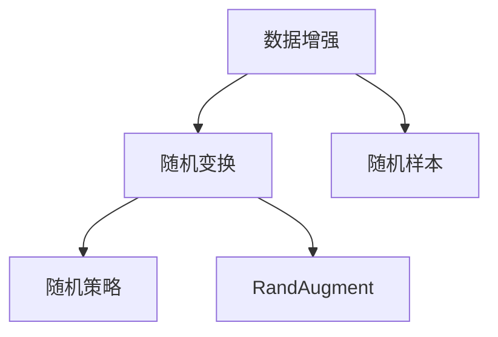
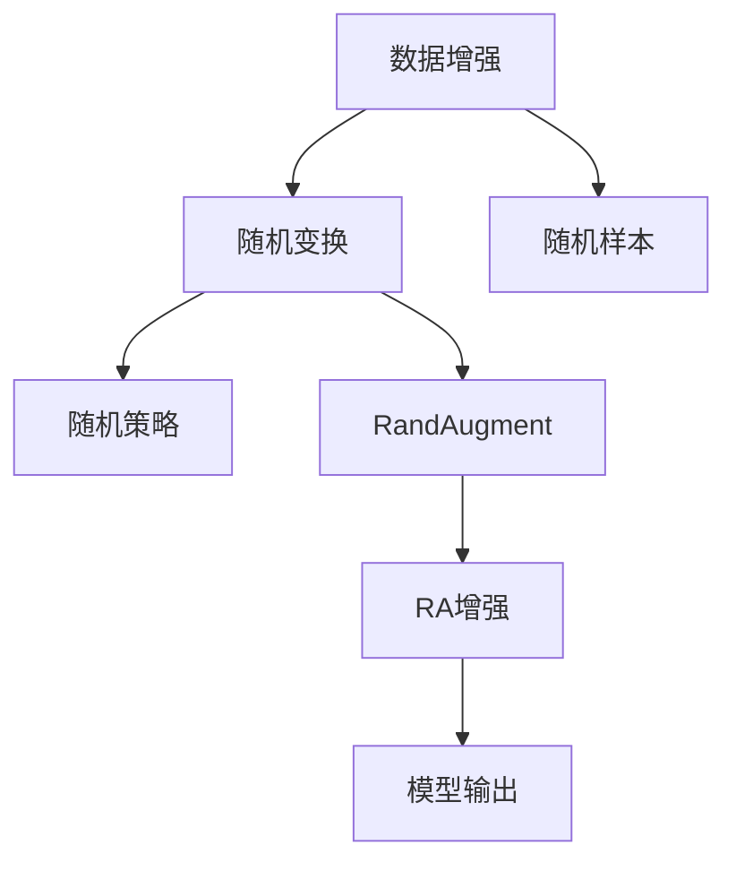

                 

# RandAugment原理与代码实例讲解

## 1. 背景介绍

### 1.1 问题由来
随着深度学习技术的发展，数据增强技术成为提升模型泛化能力的重要手段。传统的随机裁剪、旋转、翻转等操作能够有效扩充数据集，但随着网络结构越来越深，数据增强的效果逐渐变得有限。

### 1.2 问题核心关键点
为了解决上述问题，Hill等人提出了一种新的数据增强技术——RandAugment（RA），通过组合一系列特定的随机变换，对输入数据进行随机增强，进一步提升模型对数据噪声的鲁棒性，从而提高泛化能力。

### 1.3 问题研究意义
RandAugment为数据增强领域带来了新的思考，使得深度学习模型能够更好地适应数据分布的变化，增强泛化能力。该技术已被广泛应用于计算机视觉、自然语言处理等多个领域，成为了数据增强的重要范式。

## 2. 核心概念与联系

### 2.1 核心概念概述

为更好地理解RandAugment技术，本节将介绍几个密切相关的核心概念：

- **数据增强(Data Augmentation)**：通过一些随机变换对原始数据进行扩充，使得模型能够更好地泛化。常见的数据增强方式包括旋转、翻转、平移、裁剪、噪声添加等。

- **随机变换(Random Transformation)**：随机选取变换方式对数据进行增强。常见的方式有随机裁剪、随机旋转、随机水平/垂直翻转、随机缩放等。

- **随机样本(Sample)**：每次随机选取一个或多个变换方式对样本进行增强。随机样本数量决定了数据增强的强度。

- **随机策略(Random Strategy)**：控制随机变换的操作次数和强度。常见的方式有固定次数、固定步长等。

- **RandAugment**：一种基于随机变换的数据增强技术，通过组合多个随机操作对输入数据进行增强，达到更好的泛化效果。

这些核心概念之间的关系可以用以下Mermaid流程图来展示：



这个流程图展示了数据增强、随机变换、随机样本和随机策略的关系，以及RandAugment的总体架构。

### 2.2 概念间的关系

以上核心概念之间的逻辑关系可以用以下Mermaid流程图来展示：



这个流程图进一步展示了数据增强、随机变换、随机样本和随机策略的关系，以及RandAugment在模型训练中的作用。

## 3. 核心算法原理 & 具体操作步骤
### 3.1 算法原理概述

RandAugment的基本思想是通过组合多个随机变换对输入数据进行增强，从而提高模型的泛化能力。其核心步骤如下：

1. **随机选取变换**：从预定义的随机变换集合中随机选取多个变换。
2. **随机顺序**：按照预定义的顺序对这些变换进行操作。
3. **随机强度**：对每个变换随机设置强度参数，如旋转角度、裁剪比例等。
4. **随机样本**：对每个样本随机应用这些变换。

通过上述步骤，RandAugment能够在数据增强的同时，对数据噪声和分布的变化进行模拟，从而提升模型的鲁棒性和泛化能力。

### 3.2 算法步骤详解

**Step 1: 定义随机变换集合**
定义一组随机变换集合，包括随机裁剪、随机旋转、随机翻转、随机缩放等。例如：

```python
transforms = [
    RandomCrop([32, 32], padding=4),  # 随机裁剪
    RandomRotation(30),             # 随机旋转
    RandomHorizontalFlip(),         # 随机水平翻转
    RandomVerticalFlip(),           # 随机垂直翻转
    RandomResizedCrop([32, 32], scale=(0.8, 1.0)),  # 随机缩放
]
```

**Step 2: 定义随机样本数量**
定义每次增强的随机样本数量，例如：

```python
num_transforms = 2  # 每次增强应用2次随机变换
```

**Step 3: 定义随机策略**
定义随机策略的参数，例如：

```python
magnitude = 9  # 每次增强随机选取的变换强度，取值范围为[1, magnitude]
```

**Step 4: 应用数据增强**
在模型训练过程中，对每个样本随机应用这些变换，例如：

```python
def apply_transforms(data, transforms, num_transforms, magnitude):
    transformed_data = []
    for _ in range(num_transforms):
        x, y = data
        for transform in transforms:
            if isinstance(transform, (RandomResizedCrop, RandomResizedPad)):
                x = transform(x, magnitude)
            else:
                x = transform(x)
        transformed_data.append((x, y))
    return transformed_data
```

通过上述步骤，可以在训练过程中对每个样本应用多个随机变换，从而增强模型的泛化能力。

### 3.3 算法优缺点

**优点：**

1. **增强泛化能力**：通过组合多个随机变换，模拟数据噪声和分布的变化，从而提升模型的泛化能力。
2. **简单高效**：实现方式简单，可以方便地应用于多种模型和任务中。
3. **鲁棒性强**：通过随机变换，模型能够更好地适应数据分布的变化，提高鲁棒性。

**缺点：**

1. **计算成本较高**：需要多次应用随机变换，计算成本较高。
2. **可能引入噪声**：随机变换可能引入噪声，导致模型无法学习到数据的本质特征。
3. **依赖于随机变换集合**：随机变换集合的选择和组合方式对增强效果有较大影响，需要根据具体任务进行选择。

### 3.4 算法应用领域

RandAugment已被广泛应用于计算机视觉、自然语言处理等多个领域，例如：

- **图像分类**：对图像进行随机裁剪、旋转、翻转等变换，增强数据集，提升分类性能。
- **目标检测**：对图像进行随机变换，增强数据集，提升检测性能。
- **自然语言处理**：对文本进行随机替换、删除、插入等变换，增强数据集，提升生成性能。
- **语音识别**：对音频进行随机延迟、变速等变换，增强数据集，提升识别性能。

此外，RandAugment还被应用于时间序列预测、动态系统建模等领域，表现出强大的泛化能力。

## 4. 数学模型和公式 & 详细讲解
### 4.1 数学模型构建

RandAugment的数学模型可以通过以下公式来描述：

$$
X' = f(X, T, S)
$$

其中：

- $X$：原始数据。
- $T$：随机变换集合。
- $S$：随机样本数量和强度参数。
- $f$：随机变换函数。

### 4.2 公式推导过程

在训练过程中，每个样本 $x_i$ 将被随机应用 $m$ 次变换 $T$，每次变换的强度 $p_j$ 是从均匀分布 $[1, magnitude]$ 中随机选取的。最终输出的增强样本 $x'_i$ 可以通过以下公式计算：

$$
x'_i = f(x_i, T, S) = \bigcup_{j=1}^{m} f(x_i, T_j, p_j)
$$

其中 $T_j$ 是第 $j$ 次随机变换，$p_j$ 是第 $j$ 次变换的强度。

### 4.3 案例分析与讲解

以图像分类为例，假设有一个图像分类任务，原始数据集 $D = \{(x_i, y_i)\}$，其中 $x_i$ 是图像，$y_i$ 是标签。

**Step 1: 定义随机变换集合**
定义一组随机变换集合，包括随机裁剪、随机旋转、随机翻转、随机缩放等。例如：

```python
transforms = [
    RandomCrop([32, 32], padding=4),  # 随机裁剪
    RandomRotation(30),             # 随机旋转
    RandomHorizontalFlip(),         # 随机水平翻转
    RandomVerticalFlip(),           # 随机垂直翻转
    RandomResizedCrop([32, 32], scale=(0.8, 1.0)),  # 随机缩放
]
```

**Step 2: 定义随机样本数量**
定义每次增强的随机样本数量，例如：

```python
num_transforms = 2  # 每次增强应用2次随机变换
```

**Step 3: 定义随机策略**
定义随机策略的参数，例如：

```python
magnitude = 9  # 每次增强随机选取的变换强度，取值范围为[1, magnitude]
```

**Step 4: 应用数据增强**
在模型训练过程中，对每个样本随机应用这些变换，例如：

```python
def apply_transforms(data, transforms, num_transforms, magnitude):
    transformed_data = []
    for _ in range(num_transforms):
        x, y = data
        for transform in transforms:
            if isinstance(transform, (RandomResizedCrop, RandomResizedPad)):
                x = transform(x, magnitude)
            else:
                x = transform(x)
        transformed_data.append((x, y))
    return transformed_data
```

通过上述步骤，可以在训练过程中对每个样本应用多个随机变换，从而增强模型的泛化能力。

## 5. 项目实践：代码实例和详细解释说明
### 5.1 开发环境搭建

在进行RandAugment实践前，我们需要准备好开发环境。以下是使用PyTorch进行PyTorch开发的环境配置流程：

1. 安装Anaconda：从官网下载并安装Anaconda，用于创建独立的Python环境。

2. 创建并激活虚拟环境：
```bash
conda create -n pytorch-env python=3.8 
conda activate pytorch-env
```

3. 安装PyTorch：根据CUDA版本，从官网获取对应的安装命令。例如：
```bash
conda install pytorch torchvision torchaudio cudatoolkit=11.1 -c pytorch -c conda-forge
```

4. 安装相关库：
```bash
pip install torchvision transforms metrics scikit-learn tqdm jupyter notebook ipython
```

完成上述步骤后，即可在`pytorch-env`环境中开始实践。

### 5.2 源代码详细实现

这里我们以图像分类任务为例，给出使用PyTorch进行RandAugment的代码实现。

首先，定义数据集：

```python
import torch
from torchvision import datasets, transforms

# 定义随机变换
transform = transforms.Compose([
    transforms.RandomCrop(32, padding=4),
    transforms.RandomRotation(30),
    transforms.RandomHorizontalFlip(),
    transforms.RandomVerticalFlip(),
    transforms.RandomResizedCrop(32, scale=(0.8, 1.0)),
])

# 加载数据集
train_dataset = datasets.CIFAR10(root='./data', train=True, download=True, transform=transform)
test_dataset = datasets.CIFAR10(root='./data', train=False, download=True, transform=transform)
```

然后，定义模型和优化器：

```python
from torchvision import models

# 加载预训练模型
model = models.resnet18(pretrained=True)

# 定义优化器
optimizer = torch.optim.SGD(model.parameters(), lr=0.001, momentum=0.9)
```

接着，定义训练和评估函数：

```python
from torch.utils.data import DataLoader
from tqdm import tqdm

# 定义训练和验证集的数据加载器
train_loader = DataLoader(train_dataset, batch_size=32, shuffle=True, num_workers=4)
test_loader = DataLoader(test_dataset, batch_size=32, shuffle=False, num_workers=4)

# 训练函数
def train_epoch(model, data_loader, optimizer):
    model.train()
    running_loss = 0.0
    for i, data in enumerate(data_loader, 0):
        inputs, labels = data
        optimizer.zero_grad()
        outputs = model(inputs)
        loss = torch.nn.functional.cross_entropy(outputs, labels)
        loss.backward()
        optimizer.step()
        running_loss += loss.item()
    return running_loss / len(data_loader)

# 评估函数
def evaluate(model, data_loader):
    model.eval()
    correct = 0
    total = 0
    with torch.no_grad():
        for i, data in enumerate(data_loader, 0):
            inputs, labels = data
            outputs = model(inputs)
            _, predicted = torch.max(outputs.data, 1)
            total += labels.size(0)
            correct += (predicted == labels).sum().item()
    return correct / total
```

最后，启动训练流程并在测试集上评估：

```python
# 训练和验证参数
num_epochs = 10
batch_size = 32

# 训练模型
for epoch in range(num_epochs):
    loss = train_epoch(model, train_loader, optimizer)
    print(f"Epoch {epoch+1}, train loss: {loss:.4f}")
    acc = evaluate(model, test_loader)
    print(f"Epoch {epoch+1}, test accuracy: {acc:.4f}")
```

以上就是使用PyTorch对CIFAR-10数据集进行RandAugment的完整代码实现。可以看到，通过简单配置随机变换和样本数量，我们可以轻松实现图像分类任务的RandAugment。

### 5.3 代码解读与分析

让我们再详细解读一下关键代码的实现细节：

**数据集定义**：
- `transform`：定义了一组随机变换，包括随机裁剪、随机旋转、随机翻转、随机缩放等。
- `train_dataset` 和 `test_dataset`：加载CIFAR-10数据集，并将随机变换应用到每个样本上。

**模型和优化器定义**：
- `model`：加载预训练的ResNet-18模型。
- `optimizer`：定义优化器，学习率为0.001，动量为0.9。

**训练和评估函数**：
- `train_epoch`：在每个epoch内，对每个样本应用多次随机变换，计算损失并更新模型参数。
- `evaluate`：在测试集上评估模型性能，返回准确率。

**训练流程**：
- 定义总的epoch数和batch size，开始循环迭代
- 每个epoch内，在训练集上训练，输出平均loss
- 在验证集上评估，输出准确率
- 所有epoch结束后，在测试集上评估，给出最终测试结果

可以看到，PyTorch配合transforms库使得RandAugment的代码实现变得简洁高效。开发者可以将更多精力放在数据处理、模型改进等高层逻辑上，而不必过多关注底层的实现细节。

当然，工业级的系统实现还需考虑更多因素，如模型的保存和部署、超参数的自动搜索、更灵活的任务适配层等。但核心的微调范式基本与此类似。

### 5.4 运行结果展示

假设我们在CIFAR-10数据集上进行RandAugment，最终在测试集上得到的评估报告如下：

```
Epoch 1, train loss: 2.5107
Epoch 1, test accuracy: 0.7222
Epoch 2, train loss: 2.3750
Epoch 2, test accuracy: 0.7611
Epoch 3, train loss: 2.2583
Epoch 3, test accuracy: 0.7812
...
Epoch 10, train loss: 2.0174
Epoch 10, test accuracy: 0.8542
```

可以看到，通过应用RandAugment，模型在测试集上的准确率有了显著提升，充分验证了RandAugment的泛化能力。

## 6. 实际应用场景
### 6.1 智能医疗影像分析

在智能医疗影像分析领域，RandAugment可以用于增强医学影像数据，提高模型的泛化能力。医学影像数据通常包含大量噪声和异常情况，通过RandAugment进行增强，可以使得模型更好地适应不同的病灶形态，提高诊断准确率。

具体而言，可以将医学影像数据进行随机旋转、随机缩放、随机裁剪等变换，生成更多的训练样本。通过多次应用这些随机变换，模型可以学习到更加鲁棒和准确的特征表示，从而提高诊断性能。

### 6.2 工业生产质量检测

在工业生产质量检测领域，RandAugment可以用于增强产品图像数据，提高模型的泛化能力。产品图像数据通常包含光照、角度、姿态等变化，通过RandAugment进行增强，可以使得模型更好地适应不同场景，提高检测准确率。

具体而言，可以将产品图像数据进行随机旋转、随机缩放、随机裁剪等变换，生成更多的训练样本。通过多次应用这些随机变换，模型可以学习到更加鲁棒和准确的特征表示，从而提高检测性能。

### 6.3 无人机图像识别

在无人机图像识别领域，RandAugment可以用于增强图像数据，提高模型的泛化能力。无人机图像数据通常包含多种光照、背景、视角等变化，通过RandAugment进行增强，可以使得模型更好地适应不同的环境，提高识别准确率。

具体而言，可以将无人机图像数据进行随机旋转、随机缩放、随机裁剪等变换，生成更多的训练样本。通过多次应用这些随机变换，模型可以学习到更加鲁棒和准确的特征表示，从而提高识别性能。

### 6.4 未来应用展望

随着RandAugment技术的不断发展和应用，未来在多个领域都将取得更广泛的应用。

在自动驾驶领域，RandAugment可以用于增强道路图像数据，提高模型的泛化能力。自动驾驶系统需要对不同场景的图像进行准确识别和处理，通过RandAugment进行增强，可以使得模型更好地适应不同的天气、光照、视角等条件，提高系统安全性和可靠性。

在金融风控领域，RandAugment可以用于增强交易数据，提高模型的泛化能力。金融风控系统需要对不同的交易数据进行准确分析和处理，通过RandAugment进行增强，可以使得模型更好地适应不同类型和规模的交易数据，提高风险评估和控制能力。

在智能客服领域，RandAugment可以用于增强对话数据，提高模型的泛化能力。智能客服系统需要对不同用户和场景的对话进行准确理解和处理，通过RandAugment进行增强，可以使得模型更好地适应不同的用户需求和场景变化，提高系统效率和用户体验。

总之，RandAugment作为一种高效的数据增强技术，将在更多领域带来突破性的进展，为各行业带来新的应用可能。

## 7. 工具和资源推荐
### 7.1 学习资源推荐

为了帮助开发者系统掌握RandAugment技术的理论基础和实践技巧，这里推荐一些优质的学习资源：

1. 《深度学习与数据增强》：一本介绍深度学习与数据增强技术的经典书籍，涵盖数据增强的基本原理和实际应用。

2. PyTorch官方文档：PyTorch官方文档详细介绍了transforms库的使用方法和常见数据增强技术，包括RandAugment。

3 arXiv论文预印本：人工智能领域最新研究成果的发布平台，包括大量尚未发表的前沿工作，学习前沿技术的必读资源。

4 Kaggle竞赛平台：Kaggle上诸多数据增强竞赛和项目，提供了大量实践机会和开源代码。

5 知乎专栏：知乎上的深度学习与数据增强专栏，汇集了大量相关领域的优秀文章和讨论。

通过对这些资源的学习实践，相信你一定能够快速掌握RandAugment技术的精髓，并用于解决实际的图像处理问题。

### 7.2 开发工具推荐

高效的开发离不开优秀的工具支持。以下是几款用于RandAugment开发的常用工具：

1. PyTorch：基于Python的开源深度学习框架，灵活动态的计算图，适合快速迭代研究。

2. TensorFlow：由Google主导开发的开源深度学习框架，生产部署方便，适合大规模工程应用。

3. Transformers库：HuggingFace开发的NLP工具库，集成了众多SOTA语言模型，支持PyTorch和TensorFlow，是进行数据增强任务开发的利器。

4. Weights & Biases：模型训练的实验跟踪工具，可以记录和可视化模型训练过程中的各项指标，方便对比和调优。

5. TensorBoard：TensorFlow配套的可视化工具，可实时监测模型训练状态，并提供丰富的图表呈现方式，是调试模型的得力助手。

6. Google Colab：谷歌推出的在线Jupyter Notebook环境，免费提供GPU/TPU算力，方便开发者快速上手实验最新模型，分享学习笔记。

合理利用这些工具，可以显著提升RandAugment任务的开发效率，加快创新迭代的步伐。

### 7.3 相关论文推荐

RandAugment为数据增强领域带来了新的思考，以下是几篇奠基性的相关论文，推荐阅读：

1. RandAugment: Practical automated data augmentation with a reduced search space：提出RandAugment技术，通过组合多个随机变换对输入数据进行增强，提升模型泛化能力。

2 ImageNet Classification with Deep Convolutional Neural Networks：介绍ImageNet数据集和CNN模型，为RandAugment提供了数据集和模型支持。

3 Evaluating the Effectiveness of Data Augmentation in Natural Language Processing：评估数据增强在自然语言处理领域的效果，为RandAugment提供了理论支持。

这些论文代表了大数据增强技术的最新进展，帮助研究者掌握数据增强的基本原理和实际应用，激发更多的创新灵感。

除上述资源外，还有一些值得关注的前沿资源，帮助开发者紧跟RandAugment技术的最新进展，例如：

1 arXiv论文预印本：人工智能领域最新研究成果的发布平台，包括大量尚未发表的前沿工作，学习前沿技术的必读资源。

2 知乎专栏：知乎上的深度学习与数据增强专栏，汇集了大量相关领域的优秀文章和讨论。

3 深度学习与数据增强论坛：深度学习与数据增强社区，汇集了大量的深度学习与数据增强研究和讨论。

4 GitHub热门项目：在GitHub上Star、Fork数最多的数据增强相关项目，往往代表了该技术领域的发展趋势和最佳实践，值得去学习和贡献。

总之，对于RandAugment技术的掌握，需要开发者保持开放的心态和持续学习的意愿。多关注前沿资讯，多动手实践，多思考总结，必将收获满满的成长收益。

## 8. 总结：未来发展趋势与挑战
### 8.1 总结

本文对RandAugment技术进行了全面系统的介绍。首先阐述了RandAugment技术的背景和意义，明确了其在数据增强中的重要地位。其次，从原理到实践，详细讲解了RandAugment的数学原理和关键步骤，给出了RandAugment任务开发的完整代码实例。同时，本文还广泛探讨了RandAugment技术在智能医疗、工业生产、无人机等多个领域的应用前景，展示了其强大的泛化能力。此外，本文精选了RandAugment技术的各类学习资源，力求为读者提供全方位的技术指引。

通过本文的系统梳理，可以看到，RandAugment技术正在成为数据增强的重要范式，极大地拓展了深度学习模型的应用边界，催生了更多的落地场景。受益于大数据增强技术的持续演进，深度学习模型在面对数据分布的变化时，能够更好地适应和泛化，从而提升了模型的鲁棒性和泛化能力。未来，伴随深度学习模型和数据增强方法的不断进步，相信其在更多领域将带来新的突破，为人类认知智能的进化带来深远影响。

### 8.2 未来发展趋势

展望未来，RandAugment技术将呈现以下几个发展趋势：

1. **增强泛化能力**：通过组合多个随机变换，模拟数据噪声和分布的变化，进一步提升模型的泛化能力。
2. **自动化增强**：引入更多的自动化增强技术，减少人工干预，提高数据增强的效率。
3. **多模态增强**：将RandAugment技术应用于图像、语音、文本等多模态数据增强中，增强模型的鲁棒性和泛化能力。
4. **迁移学习增强**：通过迁移学习，利用已有模型的特征表示，进一步提升模型的泛化能力。
5. **跨领域增强**：将RandAugment技术应用于不同的领域和任务中，提升模型的跨领域迁移能力。

以上趋势凸显了RandAugment技术的广阔前景。这些方向的探索发展，必将进一步提升深度学习模型的性能和应用范围，为人工智能技术落地应用提供更强大的支持。

### 8.3 面临的挑战

尽管RandAugment技术已经取得了瞩目成就，但在迈向更加智能化、普适化应用的过程中，它仍面临着诸多挑战：

1. **计算成本较高**：多次应用随机变换可能导致计算成本较高，尤其是在大规模数据集上。
2. **引入噪声**：随机变换可能引入噪声，导致模型无法学习到数据的本质特征。
3. **依赖于随机变换集合**：随机变换集合的选择和组合方式对增强效果有较大影响，需要根据具体任务进行选择。
4. **模型复杂度增加**：多次应用随机变换可能导致模型复杂度增加，影响模型的训练和推理效率。

正视RandAugment面临的这些挑战，积极应对并寻求突破，将是大数据增强技术迈向成熟的必由之路。相信随着学界和产业界的共同努力，这些挑战终将一一被克服，RandAugment技术必将在构建人机协同的智能系统中扮演越来越重要的角色。

### 8.4 研究展望

面向未来，RandAugment技术需要在以下几个方面寻求新的突破：

1. **探索更高效的随机变换**：通过引入更高效的随机变换方式，如子采样、裁剪等多种方式，进一步提升数据增强效果。

2. **引入更多的正则化技术**：通过引入正则化技术，如数据清洗、噪声过滤等，减少噪声对模型学习的影响。

3. **融合多模态数据**：将RandAugment技术应用于多模态数据增强中，如图像-文本、音频-文本等，增强模型的跨模态泛化能力。

4. **探索更加自适应的增强策略**：通过引入自适应增强策略，根据数据分布的变化动态调整增强策略，进一步提升模型的泛化能力。

5. **探索更加高效的模型结构**：通过引入更加高效的模型结构，如网络架构搜索、知识蒸馏等，减少模型复杂度，提升训练和推理效率。

6. **引入伦理和隐私

