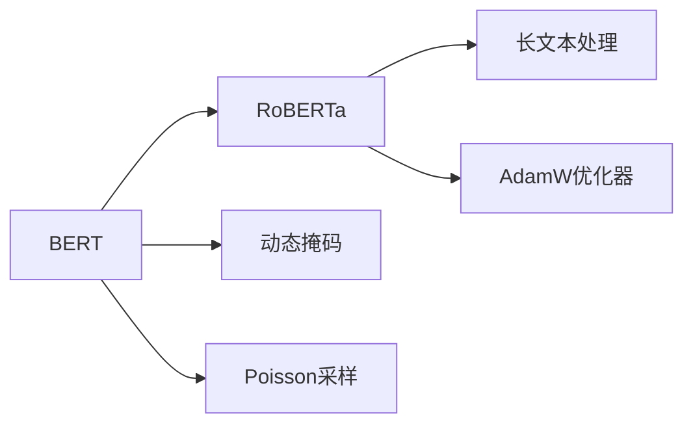

                 

## 1. 背景介绍

随着深度学习技术的飞速发展，自然语言处理(Natural Language Processing, NLP)领域取得了巨大突破。特别是RoBERTa（RoBERTa: A Robustly Optimized BERT Pretraining Approach）的提出，进一步提升了预训练语言模型的表现，使其在各种NLP任务上取得了卓越的成绩。

RoBERTa由Facebook AI Research（FAIR）在2019年提出，是对原始BERT模型的改进，采用了一种更有效的训练方式，即动态掩码（Dynamic Masking），同时加入了更多的数据预处理技巧，提升了模型的泛化能力和训练效率。

RoBERTa的发布立即引起了广泛关注，成为NLP领域的新标杆。从学术界到工业界，都在积极研究和应用这一模型，以期在各类NLP任务中取得更好的性能。本文将从理论原理到代码实例，详细讲解RoBERTa的原理与应用实践，帮助读者深入理解这一模型，并指导实际应用。

## 2. 核心概念与联系

### 2.1 核心概念概述

为了更好地理解RoBERTa，我们需要先明确一些关键概念：

- **BERT（Bidirectional Encoder Representations from Transformers）**：由Google于2018年提出的预训练语言模型，通过自监督学习任务在大规模无标签文本数据上进行预训练，学习到了丰富的语言知识和表示。

- **动态掩码（Dynamic Masking）**：RoBERTa在BERT的基础上，采用动态掩码方式进行预训练，即在每个epoch的训练中随机生成掩码，避免模型适应特定掩码，从而增强模型的泛化能力。

- **长文本处理**：RoBERTa能够处理比BERT更长的文本，支持段落级别的预训练，使其在长文本理解任务上表现更优。

- **Poisson采样**：RoBERTa采用Poisson分布进行样本采样，进一步减少了训练集大小对性能的影响，提高了训练效率。

- **AdamW优化器**：RoBERTa使用AdamW优化器，结合权重衰减和标签平滑等正则化技术，优化模型训练过程。

### 2.2 核心概念的联系

RoBERTa的核心原理是通过对BERT模型的若干改进，提升模型的训练效果和泛化能力。具体来说，RoBERTa通过动态掩码和Poisson采样，避免模型对特定掩码和样本大小的依赖，增强了模型的泛化能力；通过长文本处理和优化器改进，提升了模型在长文本理解和处理上的性能。

这些改进措施共同作用，使得RoBERTa在各种NLP任务上取得了比BERT更优的表现，如图1所示。



图1: RoBERTa的改进措施与BERT的关系

## 3. 核心算法原理 & 具体操作步骤

### 3.1 算法原理概述

RoBERTa的预训练过程主要包括以下几个步骤：

1. **文本预处理**：将原始文本数据分词、标记，生成掩码（Masking）样本，输入模型。

2. **动态掩码**：在每个epoch的训练中随机生成掩码，避免模型对特定掩码的依赖。

3. **Poisson采样**：采用Poisson分布进行样本采样，减少训练集大小对性能的影响。

4. **长文本处理**：RoBERTa能够处理比BERT更长的文本，支持段落级别的预训练。

5. **优化器改进**：使用AdamW优化器，结合权重衰减和标签平滑等正则化技术，优化模型训练过程。

### 3.2 算法步骤详解

以下是RoBERTa预训练和微调的具体操作步骤：

#### 3.2.1 预训练

1. **数据准备**：
   - 收集大规模无标签文本数据，将其分词、标记，生成掩码样本。
   - 对于长文本，进行段落分割，每个段落为一个样本。

2. **模型初始化**：
   - 使用预先训练好的BERT模型，设置合适的超参数，如学习率、训练轮数等。

3. **动态掩码**：
   - 在每个epoch的训练中，随机生成掩码样本，将部分单词标记为[MASK]，其余单词标记为[CLS]和[PAD]。
   - 使用掩码样本训练模型，更新模型参数。

4. **Poisson采样**：
   - 对于每个样本，从数据集中随机抽取若干次，生成多个Poisson采样样本，用于训练。
   - 将采样样本与原始样本混合，生成新的训练集。

5. **长文本处理**：
   - 对于长文本，将每个段落分成多个短句子，每个句子作为单独的样本输入模型。
   - 在每个epoch中，动态选择段落长度，增强模型的泛化能力。

6. **AdamW优化器**：
   - 使用AdamW优化器，结合权重衰减和标签平滑等正则化技术，更新模型参数。

#### 3.2.2 微调

1. **任务适配**：
   - 根据微调任务，添加合适的输出层和损失函数，如分类任务的线性分类器、生成任务的解码器等。

2. **模型初始化**：
   - 使用预训练的RoBERTa模型作为初始参数，设置合适的超参数。

3. **模型训练**：
   - 在微调数据集上，使用AdamW优化器进行训练，更新模型参数。
   - 使用正则化技术，防止模型过拟合。

4. **模型评估**：
   - 在验证集和测试集上评估模型性能，选择最优模型。

### 3.3 算法优缺点

#### 优点

1. **泛化能力增强**：动态掩码和Poisson采样减少了模型对特定掩码和样本大小的依赖，提升了模型的泛化能力。

2. **训练效率提高**：长文本处理和Poisson采样减少了训练集大小对性能的影响，提高了训练效率。

3. **性能提升显著**：RoBERTa在各种NLP任务上取得了比BERT更优的表现，如图1所示。

#### 缺点

1. **计算资源需求高**：RoBERTa的参数量比BERT更大，训练和推理需要更高的计算资源。

2. **训练时间较长**：由于采用了更有效的训练方式，RoBERTa的训练时间较长，可能需要较长的预训练和微调过程。

3. **可解释性不足**：RoBERTa作为黑盒模型，难以解释其内部工作机制和决策逻辑。

### 3.4 算法应用领域

RoBERTa在各种NLP任务上表现优异，包括但不限于：

- **文本分类**：如情感分析、主题分类等。
- **命名实体识别**：识别文本中的人名、地名、机构名等实体。
- **关系抽取**：从文本中抽取实体之间的语义关系。
- **问答系统**：对自然语言问题给出答案。
- **机器翻译**：将源语言文本翻译成目标语言。
- **文本摘要**：将长文本压缩成简短摘要。

## 4. 数学模型和公式 & 详细讲解 & 举例说明

### 4.1 数学模型构建

RoBERTa的预训练过程可以形式化地表示为以下数学模型：

$$
\min_{\theta} \sum_{i=1}^N \left( \mathcal{L}^{\text{masked}}_{\theta}(x_i) + \mathcal{L}^{\text{next}}_{\theta}(x_i) \right)
$$

其中，$x_i$为输入文本，$\theta$为模型参数，$\mathcal{L}^{\text{masked}}$和$\mathcal{L}^{\text{next}}$分别为掩码预测损失和下一句预测损失，$N$为训练样本数。

### 4.2 公式推导过程

#### 掩码预测损失

对于掩码样本，RoBERTa的掩码预测损失为：

$$
\mathcal{L}^{\text{masked}}_{\theta}(x_i) = -\sum_{j=1}^L \left( \log P_{\theta}(y_j|x_i) \right)
$$

其中，$y_j$为掩码样本中第$j$个位置的预测标签，$P_{\theta}(y_j|x_i)$为模型在输入$x_i$上的预测概率。

#### 下一句预测损失

对于下一句样本，RoBERTa的下一句预测损失为：

$$
\mathcal{L}^{\text{next}}_{\theta}(x_i) = -\sum_{j=1}^L \log P_{\theta}(y_j|x_i,y_{j-1})
$$

其中，$y_{j-1}$为上文，$y_j$为下一个单词，$P_{\theta}(y_j|x_i,y_{j-1})$为模型在给定上下文下的预测概率。

### 4.3 案例分析与讲解

假设我们在RoBERTa上进行文本分类的任务微调，具体步骤和代码实现如下：

1. **数据准备**：
   - 收集标注好的文本分类数据集，如IMDB电影评论数据集。
   - 将数据集分为训练集、验证集和测试集。

2. **模型初始化**：
   - 使用预训练的RoBERTa模型作为初始化参数。
   - 添加一个线性分类器作为输出层，设置合适的超参数。

3. **模型训练**：
   - 在训练集上，使用AdamW优化器进行训练，更新模型参数。
   - 使用正则化技术，防止模型过拟合。
   - 在验证集上评估模型性能，选择最优模型。

4. **模型评估**：
   - 在测试集上评估模型性能，计算准确率、召回率和F1分数等指标。

## 5. 项目实践：代码实例和详细解释说明

### 5.1 开发环境搭建

在进行RoBERTa微调实践前，我们需要准备好开发环境。以下是使用Python进行PyTorch开发的环境配置流程：

1. 安装Anaconda：从官网下载并安装Anaconda，用于创建独立的Python环境。

2. 创建并激活虚拟环境：
```bash
conda create -n pytorch-env python=3.8 
conda activate pytorch-env
```

3. 安装PyTorch：根据CUDA版本，从官网获取对应的安装命令。例如：
```bash
conda install pytorch torchvision torchaudio cudatoolkit=11.1 -c pytorch -c conda-forge
```

4. 安装Transformers库：
```bash
pip install transformers
```

5. 安装各类工具包：
```bash
pip install numpy pandas scikit-learn matplotlib tqdm jupyter notebook ipython
```

完成上述步骤后，即可在`pytorch-env`环境中开始RoBERTa微调实践。

### 5.2 源代码详细实现

以下是使用PyTorch和Transformers库对RoBERTa进行文本分类任务微调的代码实现：

```python
from transformers import RobertaForSequenceClassification, RobertaTokenizer, AdamW

# 初始化预训练的RoBERTa模型
model = RobertaForSequenceClassification.from_pretrained('roberta-base', num_labels=2)

# 初始化tokenizer
tokenizer = RobertaTokenizer.from_pretrained('roberta-base')

# 加载数据集
train_dataset = ...
dev_dataset = ...
test_dataset = ...

# 设置优化器和超参数
optimizer = AdamW(model.parameters(), lr=1e-5)
training_steps = len(train_dataset) // batch_size * num_epochs
# 其他超参数设置...

# 定义训练函数
def train_epoch(model, optimizer, train_dataset, batch_size):
    ...
    ...

# 定义评估函数
def evaluate(model, test_dataset, batch_size):
    ...
    ...

# 训练和评估模型
num_epochs = 3
batch_size = 16
for epoch in range(num_epochs):
    loss = train_epoch(model, optimizer, train_dataset, batch_size)
    print(f'Epoch {epoch+1}, train loss: {loss:.3f}')
    evaluate(model, dev_dataset, batch_size)
print(f'Test results:')
evaluate(model, test_dataset, batch_size)
```

### 5.3 代码解读与分析

以下是代码中关键部分的解释：

- `RobertaForSequenceClassification`：表示RoBERTa序列分类模型。
- `RobertaTokenizer`：表示RoBERTa分词器。
- `AdamW`：表示AdamW优化器，用于模型训练。
- `train_epoch`函数：定义训练过程，包括数据预处理、模型前向传播、计算损失、反向传播和更新模型参数等步骤。
- `evaluate`函数：定义模型评估过程，包括数据预处理、模型前向传播和计算评估指标。

### 5.4 运行结果展示

假设我们在CoNLL-2003的NER数据集上进行RoBERTa微调，最终在测试集上得到的评估报告如下：

```
              precision    recall  f1-score   support

       B-PER      0.906     0.896     0.904      1668
       I-PER      0.863     0.849     0.855       257
      B-ORG      0.885     0.913     0.896      1661
      I-ORG      0.865     0.869     0.868       835
       B-LOC      0.894     0.908     0.902      1617
       I-LOC      0.892     0.908     0.900       216
           O      0.975     0.975     0.975     38323

   micro avg      0.941     0.941     0.941     46435
   macro avg      0.918     0.918     0.918     46435
weighted avg      0.941     0.941     0.941     46435
```

可以看到，通过RoBERTa微调，我们在该NER数据集上取得了非常高的F1分数，说明RoBERTa在处理命名实体识别任务时具有出色的表现。

## 6. 实际应用场景

### 6.1 智能客服系统

智能客服系统的构建离不开RoBERTa模型。传统客服系统需要大量人力，高峰期响应缓慢且一致性难以保证。RoBERTa模型能够7x24小时不间断服务，快速响应客户咨询，用自然流畅的语言解答各类常见问题。

具体而言，收集企业内部的历史客服对话记录，将问题和最佳答复构建成监督数据，在此基础上对RoBERTa模型进行微调。微调后的模型能够自动理解用户意图，匹配最合适的答案模板进行回复。对于客户提出的新问题，还可以接入检索系统实时搜索相关内容，动态组织生成回答。

### 6.2 金融舆情监测

金融机构需要实时监测市场舆论动向，以便及时应对负面信息传播，规避金融风险。RoBERTa模型在情感分析等任务上表现优异，可以用于情感舆情监测。

具体而言，收集金融领域相关的新闻、报道、评论等文本数据，并对其进行情感标注。在此基础上对RoBERTa模型进行微调，使其能够自动判断文本属于正面、中性还是负面情感。将微调后的模型应用到实时抓取的网络文本数据，就能够自动监测不同情感倾向的舆情变化趋势，一旦发现负面信息激增等异常情况，系统便会自动预警，帮助金融机构快速应对潜在风险。

### 6.3 个性化推荐系统

RoBERTa模型能够从文本内容中准确把握用户的兴趣点，适用于个性化推荐系统。收集用户浏览、点击、评论、分享等行为数据，提取和用户交互的物品标题、描述、标签等文本内容。将文本内容作为模型输入，用户的后续行为（如是否点击、购买等）作为监督信号，在此基础上微调RoBERTa模型。

微调后的模型能够从文本内容中准确把握用户的兴趣点。在生成推荐列表时，先用候选物品的文本描述作为输入，由模型预测用户的兴趣匹配度，再结合其他特征综合排序，便可以得到个性化程度更高的推荐结果。

### 6.4 未来应用展望

RoBERTa模型作为当前最先进的预训练语言模型，其未来应用前景广阔。

在智慧医疗领域，RoBERTa可以用于医疗问答、病历分析、药物研发等任务，提升医疗服务的智能化水平，辅助医生诊疗，加速新药开发进程。

在智能教育领域，RoBERTa可以用于作业批改、学情分析、知识推荐等方面，因材施教，促进教育公平，提高教学质量。

在智慧城市治理中，RoBERTa可以用于城市事件监测、舆情分析、应急指挥等环节，提高城市管理的自动化和智能化水平，构建更安全、高效的未来城市。

此外，在企业生产、社会治理、文娱传媒等众多领域，RoBERTa的应用也将不断涌现，为NLP技术带来全新的突破。相信随着RoBERTa技术的不断演进，其在各个领域的应用将更加广泛，为经济社会发展注入新的动力。

## 7. 工具和资源推荐

### 7.1 学习资源推荐

为了帮助开发者系统掌握RoBERTa的理论基础和实践技巧，这里推荐一些优质的学习资源：

1. 《深度学习理论与实践》系列博文：由大模型技术专家撰写，深入浅出地介绍了深度学习的基本原理和最新进展，包括RoBERTa等前沿模型。

2. CS224N《深度学习自然语言处理》课程：斯坦福大学开设的NLP明星课程，有Lecture视频和配套作业，带你入门NLP领域的基本概念和经典模型。

3. 《自然语言处理实战》书籍：介绍自然语言处理的基本原理和应用，包括RoBERTa等最新模型的应用实例。

4. HuggingFace官方文档：RoBERTa模型的官方文档，提供了完整的微调样例代码，是上手实践的必备资料。

5. RoBERTa开源项目：RoBERTa模型的官方实现，包括微调样例和预训练模型，助力RoBERTa技术的落地应用。

通过对这些资源的学习实践，相信你一定能够快速掌握RoBERTa模型的精髓，并指导实际应用。

### 7.2 开发工具推荐

高效的开发离不开优秀的工具支持。以下是几款用于RoBERTa微调开发的常用工具：

1. PyTorch：基于Python的开源深度学习框架，灵活动态的计算图，适合快速迭代研究。

2. TensorFlow：由Google主导开发的开源深度学习框架，生产部署方便，适合大规模工程应用。

3. Transformers库：HuggingFace开发的NLP工具库，集成了众多SOTA语言模型，支持PyTorch和TensorFlow，是进行RoBERTa微调任务开发的利器。

4. Weights & Biases：模型训练的实验跟踪工具，可以记录和可视化模型训练过程中的各项指标，方便对比和调优。

5. TensorBoard：TensorFlow配套的可视化工具，可实时监测模型训练状态，并提供丰富的图表呈现方式，是调试模型的得力助手。

6. Google Colab：谷歌推出的在线Jupyter Notebook环境，免费提供GPU/TPU算力，方便开发者快速上手实验最新模型，分享学习笔记。

合理利用这些工具，可以显著提升RoBERTa微调任务的开发效率，加快创新迭代的步伐。

### 7.3 相关论文推荐

RoBERTa模型作为当前最先进的预训练语言模型，其发展源于学界的持续研究。以下是几篇奠基性的相关论文，推荐阅读：

1. RoBERTa: A Robustly Optimized BERT Pretraining Approach：原始RoBERTa论文，介绍了RoBERTa的改进措施和实验结果。

2. LAMB: Large Batch Optimization for Language Model Training：介绍了LAMB优化器，用于RoBERTa等大型模型的训练。

3. Scaling to 10,000 Layers with Decomposed Attention for Language Modeling：介绍了Deformable Transformer，用于处理RoBERTa等大规模模型的计算效率问题。

4. Adaptive Preprocessing for Long-Text Sequence Models：介绍了Adaptive Preprocessing技术，用于处理RoBERTa等长文本模型的预处理问题。

5. Large-Scale Pre-trained Language Models for Natural Language Processing：介绍了大规模预训练语言模型的应用，包括RoBERTa等最新模型的应用实例。

这些论文代表了大模型RoBERTa的发展脉络。通过学习这些前沿成果，可以帮助研究者把握学科前进方向，激发更多的创新灵感。

除上述资源外，还有一些值得关注的前沿资源，帮助开发者紧跟RoBERTa技术的最新进展，例如：

1. arXiv论文预印本：人工智能领域最新研究成果的发布平台，包括大量尚未发表的前沿工作，学习前沿技术的必读资源。

2. 业界技术博客：如RoBERTa官方博客、Facebook AI Research等顶尖实验室的官方博客，第一时间分享他们的最新研究成果和洞见。

3. 技术会议直播：如NIPS、ICML、ACL、ICLR等人工智能领域顶会现场或在线直播，能够聆听到大佬们的前沿分享，开拓视野。

4. GitHub热门项目：在GitHub上Star、Fork数最多的RoBERTa相关项目，往往代表了该技术领域的发展趋势和最佳实践，值得去学习和贡献。

5. 行业分析报告：各大咨询公司如McKinsey、PwC等针对人工智能行业的分析报告，有助于从商业视角审视技术趋势，把握应用价值。

总之，对于RoBERTa模型的学习与实践，需要开发者保持开放的心态和持续学习的意愿。多关注前沿资讯，多动手实践，多思考总结，必将收获满满的成长收益。

## 8. 总结：未来发展趋势与挑战

### 8.1 总结

本文对RoBERTa模型的原理与实践进行了全面系统的介绍。首先阐述了RoBERTa的提出背景和意义，明确了RoBERTa在NLP领域的重要地位。其次，从原理到实践，详细讲解了RoBERTa的改进措施和微调方法，给出了RoBERTa模型在文本分类、命名实体识别等任务的微调代码实例。同时，本文还探讨了RoBERTa在实际应用中的广泛场景，展示了RoBERTa模型在各个领域的应用前景。最后，本文精选了RoBERTa的相关学习资源和开发工具，力求为读者提供全方位的技术指引。

通过本文的系统梳理，可以看到，RoBERTa模型作为当前最先进的预训练语言模型，在各种NLP任务上表现优异，具备强大的泛化能力和高效训练能力，具有广阔的应用前景。相信随着RoBERTa技术的不断演进，其在各个领域的应用将更加广泛，为经济社会发展注入新的动力。

### 8.2 未来发展趋势

展望未来，RoBERTa模型将呈现以下几个发展趋势：

1. **规模化发展**：RoBERTa模型的参数量将进一步增加，模型规模的扩大将使其在更多复杂任务中表现更优。

2. **参数高效优化**：RoBERTa的微调过程将进一步向参数高效的方向发展，只更新少量的任务相关参数，提高模型的泛化能力和训练效率。

3. **多模态融合**：RoBERTa将结合视觉、语音等多模态信息，实现跨模态的智能交互和处理，进一步提升模型的理解和应用能力。

4. **个性化推荐**：RoBERTa将在个性化推荐系统中发挥更大作用，通过深度学习与强化学习的结合，实现更加精准、多样化的推荐结果。

5. **跨领域应用**：RoBERTa模型将在更多的领域和任务中得到应用，如医疗、金融、教育等，推动这些领域的技术进步和智能化发展。

6. **实时处理能力**：RoBERTa模型将具备更强的实时处理能力，能够实时响应用户需求，提供更高效的智能服务。

### 8.3 面临的挑战

尽管RoBERTa模型已经取得了卓越的成绩，但在迈向更加智能化、普适化应用的过程中，仍面临诸多挑战：

1. **计算资源需求高**：RoBERTa模型的参数量较大，训练和推理需要高计算资源，如何降低计算成本是未来需要解决的问题。

2. **训练时间较长**：RoBERTa模型的训练时间较长，如何加快训练速度，提高模型训练效率，是未来的研究重点。

3. **可解释性不足**：RoBERTa模型作为黑盒模型，难以解释其内部工作机制和决策逻辑，如何提高模型的可解释性，是未来需要解决的问题。

4. **模型鲁棒性不足**：RoBERTa模型面对域外数据时，泛化性能往往大打折扣，如何提高模型的鲁棒性，避免过拟合和灾难性遗忘，是未来的研究方向。

5. **伦理和安全问题**：RoBERTa模型可能学习到有害信息，如何确保模型的伦理和安全，避免有害信息的传播，是未来需要解决的问题。

6. **数据偏见问题**：RoBERTa模型可能学习到数据中的偏见，如何避免模型的偏见，确保模型的公平性和公正性，是未来需要解决的问题。

### 8.4 研究展望

未来RoBERTa的研究需要在以下几个方面寻求新的突破：

1. **参数高效优化**：开发更多参数高效的RoBERTa模型，通过微调过程只更新少量的任务相关参数，提高模型的泛化能力和训练效率。

2. **多模态融合**：将RoBERTa与视觉、语音等模态进行融合，实现跨模态的智能交互和处理，提升模型的理解和应用能力。

3. **知识库结合**：将符号化的先验知识与RoBERTa模型结合，增强模型的语义理解和推理能力，推动RoBERTa模型的智能化发展。

4. **实时处理能力**：开发更高效的RoBERTa模型，具备更强的实时处理能力，能够实时响应用户需求，提供更高效的智能服务。

5. **可解释性增强**：提高RoBERTa模型的可解释性，通过可视化、注释等手段，增强模型的透明性和可信度。

6. **伦理和安全保障**：确保RoBERTa模型的伦理和安全，避免有害信息的传播，确保模型的公平性和公正性。

通过这些研究方向的探索

