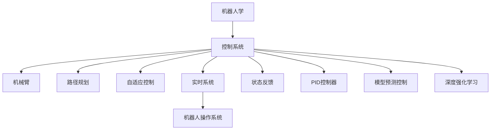
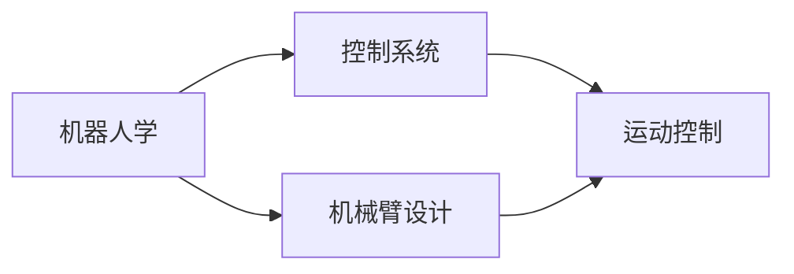
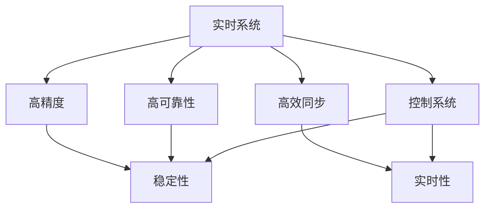
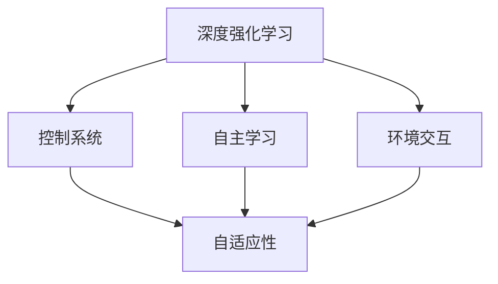
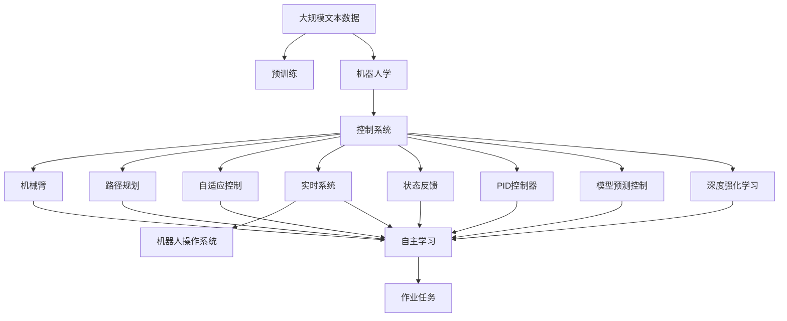

                 

# Robotics and Control Systems 原理与代码实战案例讲解

> 关键词：机器人学(Robotics)，控制系统(Control Systems)，机械臂(Arm Manipulators)，路径规划(Route Planning)，自适应控制(Adaptive Control)，实时系统(Real-time Systems)，机器人操作系统(Robot Operating System, ROS)，MATLAB/Simulink，状态反馈(State Feedback)，PID控制器(PID Controllers)，模型预测控制(Model Predictive Control, MPC)，深度强化学习(Deep Reinforcement Learning)

## 1. 背景介绍

### 1.1 问题由来

现代工业中，机器人学和控制系统作为两个重要领域，相互之间紧密交织，共同推动制造业向智能化、柔性化转型。机器人通过精确控制，完成复杂的作业任务；控制系统则通过精准调节，保证机器人操作的稳定性和准确性。在自动化生产线上，机器人操作系统的可靠性直接影响产品质量和生产效率。

机器人操作系统的核心组件之一是机械臂，机械臂的准确控制和路径规划是机器人操作的基础。传统的机械臂控制系统，往往依赖于复杂的数学模型和精确的传感器数据，这要求工程师具备深厚的控制理论知识。随着技术的发展，一些新的控制方法，如自适应控制和模型预测控制，逐渐成为主流，这些方法结合了理论深度和实用可操作性。

### 1.2 问题核心关键点

控制系统的核心是设计控制律，使得机器人能够按照预设的任务路径进行精确操作。控制律的设计需要考虑控制系统的稳定性、鲁棒性和实时性。现有控制方法中，经典PID控制和现代深度强化学习控制表现突出，二者的结合，可以在保证系统稳定性的同时，提高机械臂的自动化水平。

机器人控制系统实现还需要考虑实时性，常用的实时操作系统如Robot Operating System (ROS)，可以提供高可靠性、高精度的硬件同步机制，为机器人操作系统的稳定运行提供支持。此外，深度强化学习方法的引入，可以使机器人自主学习任务路径和操作方式，进一步提升操作效率。

### 1.3 问题研究意义

机器人操作系统的研究，对于提升机器人自动化水平、降低生产成本、提高生产效率具有重要意义：

1. 提高自动化水平：通过机械臂控制系统的优化设计，使机器人能够完成更复杂的作业任务，减少人工干预，提高作业效率。
2. 降低生产成本：精准的控制系统设计，可以延长机械臂的使用寿命，减少维护成本。
3. 提高生产效率：自动化控制系统能够持续高效地执行生产任务，减少人为错误，提高生产线的稳定性。
4. 促进技术进步：机器人控制系统的新技术，如自适应控制、模型预测控制、深度强化学习，能够推动机器人技术向更智能、更高效的方面发展。
5. 推动工业升级：自动化控制系统可以帮助企业实现数字化转型，适应新工业革命的趋势，提升企业的竞争力。

## 2. 核心概念与联系

### 2.1 核心概念概述

为更好地理解机器人操作系统的原理，本节将介绍几个密切相关的核心概念：

- 机器人学(Robotics)：研究机器人的设计、制造、操作、应用及其与环境交互的学科。包括机械臂设计、运动控制、人机交互等方面。
- 控制系统(Control Systems)：通过传感器和执行器控制机械臂运动的系统。控制方法包括经典PID控制、自适应控制、模型预测控制等。
- 机械臂(Arm Manipulators)：机器人操作系统的核心组件，通过关节运动实现物体抓取、搬运等作业任务。
- 路径规划(Route Planning)：确定机械臂的运动路径，保证作业任务的顺利完成。
- 自适应控制(Adaptive Control)：通过不断调整控制参数，提高系统的鲁棒性和适应性。
- 实时系统(Real-time Systems)：在规定的时间内完成控制任务的系统，适用于机器人控制系统。
- 机器人操作系统(Robot Operating System, ROS)：开源的机器人操作系统，提供框架支持、工具集和通信机制。
- MATLAB/Simulink：用于系统建模、仿真和控制的强大工具。
- 状态反馈(State Feedback)：利用反馈信息调整控制律，保证系统稳定。
- PID控制器(PID Controllers)：经典的比例、积分、微分控制器，广泛应用于机械臂控制。
- 模型预测控制(Model Predictive Control, MPC)：通过预测未来状态，优化控制决策。
- 深度强化学习(Deep Reinforcement Learning)：结合强化学习和深度学习技术，实现机械臂的自主学习。

这些核心概念之间的逻辑关系可以通过以下Mermaid流程图来展示：



这个流程图展示了一体化机器人控制系统的主要组成部分及其相互关系：

1. 机器人学研究机械臂的设计和运动规律。
2. 控制系统通过反馈机制，调节机械臂运动，保证作业任务的顺利完成。
3. 自适应控制和模型预测控制方法，提升系统的鲁棒性和优化性能。
4. 实时系统为控制系统提供高效的操作平台。
5. 机械臂通过路径规划，确保作业路径的合理性。
6. 状态反馈和PID控制器，保证系统稳定性。
7. 深度强化学习，实现机械臂的自主学习。

### 2.2 概念间的关系

这些核心概念之间存在着紧密的联系，构成了机器人控制系统实现的整体框架。下面我们通过几个Mermaid流程图来展示这些概念之间的关系。

#### 2.2.1 机器人学与控制系统关系



这个流程图展示了机器人学与控制系统之间的联系。机器人学的研究，为控制系统提供了基础理论和方法支持。机械臂设计则是控制系统的应用对象，运动控制则是控制系统的目标。

#### 2.2.2 实时系统与控制系统的关系



这个流程图展示了实时系统对控制系统的重要性。实时系统提供了高可靠性、高精度和高效率，保证了控制系统的稳定性和实时性。

#### 2.2.3 深度强化学习与控制系统的关系



这个流程图展示了深度强化学习对控制系统的补充。深度强化学习方法，可以自主学习机械臂的任务路径和操作方式，提升系统的自适应性和鲁棒性。

### 2.3 核心概念的整体架构

最后，我们用一个综合的流程图来展示这些核心概念在大规模机器人控制系统微调过程中的整体架构：



这个综合流程图展示了从预训练到微调，再到自主学习，最终完成作业任务的完整过程。机器人学研究机械臂设计，控制系统通过路径规划、自适应控制、状态反馈等技术，实现机械臂的稳定和高效操作。实时系统和机器人操作系统提供高可靠性和高精度的操作环境。深度强化学习方法，则通过自主学习，进一步提升机械臂的操作精度和自主性。

## 3. 核心算法原理 & 具体操作步骤
### 3.1 算法原理概述

机器人操作系统的核心是控制系统设计，包括机械臂的路径规划、运动控制、传感器数据处理等。控制系统通过反馈机制，不断调整控制律，保证机械臂操作稳定性和准确性。

形式化地，假设机械臂的关节角度为 $q$，期望关节角度为 $q^*$，当前位置为 $x$，期望位置为 $x^*$。控制系统的目标是设计控制器 $u(t)$，使得机械臂能够按照预设路径运动，即：

$$
q(t+1) = f(q(t),u(t))
$$

其中 $f(\cdot)$ 为机械臂的动态模型。控制律 $u(t)$ 的目的是通过传感器反馈，调整机械臂的运动，使得机械臂状态 $q(t)$ 逼近期望状态 $q^*$。

基于反馈的控制系统，设计为：

$$
u(t) = K(q-q^*)
$$

其中 $K$ 为反馈增益矩阵。利用状态反馈机制，控制器可以动态调整机械臂的运动，保证其准确性和稳定性。

### 3.2 算法步骤详解

机器人操作系统的实现步骤如下：

**Step 1: 定义系统模型和控制器**

定义机械臂的动态模型 $f(\cdot)$ 和控制器 $u(t)$，选择反馈增益矩阵 $K$。例如，对于一个二自由度机械臂，其动态模型可以表示为：

$$
\dot{q} = f(q,u) = \begin{bmatrix} \frac{1}{J_1} & 0 \\ 0 & \frac{1}{J_2} \end{bmatrix} \begin{bmatrix} M_1 & 0 \\ 0 & M_2 \end{bmatrix} \begin{bmatrix} F_1 \\ F_2 \end{bmatrix} - \begin{bmatrix} D_1 & 0 \\ 0 & D_2 \end{bmatrix} \dot{q}
$$

其中 $J_i$ 为关节转动惯量，$M_i$ 为重力矩，$F_i$ 为驱动力矩，$D_i$ 为粘滞阻尼系数。控制器 $u(t)$ 为：

$$
u(t) = K(q-q^*)
$$

其中 $K$ 为反馈增益矩阵。

**Step 2: 选择合适的反馈机制**

选择合适的状态反馈机制，如比例、积分、微分控制器，设计控制律。例如，对于二自由度机械臂，选择比例积分微分控制器（PID控制器），控制律可以表示为：

$$
u(t) = K(q-q^*) = \begin{bmatrix} k_p & 0 \\ 0 & k_p \end{bmatrix} \begin{bmatrix} q-q^* \\ \dot{q}-\dot{q^*} \end{bmatrix}
$$

其中 $k_p$ 为比例系数。

**Step 3: 设计优化目标函数**

设计优化目标函数，例如，希望机械臂在 $t_0$ 时刻从初始状态 $q(0)$ 移动到目标状态 $q^*(0)$。优化目标函数可以表示为：

$$
J = \int_0^{t_0} (q-q^*)^2 dt
$$

最小化目标函数，即可得到最优控制律。

**Step 4: 执行迭代优化**

通过迭代优化算法，求解最小化目标函数。例如，利用梯度下降算法，更新控制律：

$$
K = K - \eta \nabla_{K} J
$$

其中 $\eta$ 为学习率。

**Step 5: 实时控制和反馈**

在实际应用中，将控制系统嵌入实时系统中，利用传感器数据，实时调整机械臂运动。传感器数据通过反馈机制，更新控制器参数，实现动态调整。

### 3.3 算法优缺点

基于反馈的机器人控制系统设计，具有以下优点：

1. 简单高效。反馈机制能够动态调整控制律，适应机械臂的运动状态变化。
2. 鲁棒性好。通过不断调整控制律，系统能够适应各种突发情况和干扰。
3. 实时性强。控制系统实时接收传感器数据，快速调整机械臂运动，保证操作效率。

同时，该方法也存在一定的局限性：

1. 需要精确的模型参数。模型的准确性直接影响控制律的性能。
2. 模型辨识复杂。机械臂的动态模型难以精确辨识，影响控制律的准确性。
3. 控制律设计困难。优化目标函数的设计需要丰富的经验和专业知识。

尽管存在这些局限性，但就目前而言，基于反馈的控制方法仍然是大规模机器人控制系统的主流范式。未来相关研究的重点在于如何进一步降低模型辨识难度，提高控制律设计效率，以及与其他技术（如深度强化学习）进行深度融合。

### 3.4 算法应用领域

基于反馈的机器人控制系统，在工业生产中得到了广泛的应用，主要应用于以下领域：

- 汽车制造：机器人用于零件加工、组装、焊接等。
- 电子装配：机器人用于电子产品装配、调试等。
- 航空航天：机器人用于卫星组装、测试等。
- 物流配送：机器人用于货物搬运、分拣等。
- 精密加工：机器人用于零件加工、表面处理等。

除了上述这些经典应用外，机器人控制系统还在医疗手术、农业植保、智能家居等多个领域得到了应用。随着机器人技术的不断发展，基于反馈控制方法的应用场景还将进一步扩展。

## 4. 数学模型和公式 & 详细讲解 & 举例说明

### 4.1 数学模型构建

本节将使用数学语言对基于反馈的机器人控制系统进行更加严格的刻画。

记机械臂的动态模型为 $f(\cdot)$，控制器为 $u(t)$，期望状态为 $q^*$，当前状态为 $q$。定义状态误差 $e(t) = q-q^*$，控制律为 $u(t) = K e(t)$，其中 $K$ 为反馈增益矩阵。

定义系统的性能指标 $J$，例如，希望机械臂在 $t_0$ 时刻从初始状态 $q(0)$ 移动到目标状态 $q^*(0)$，则性能指标可以表示为：

$$
J = \int_0^{t_0} e(t)^2 dt = \int_0^{t_0} (q-q^*)^2 dt
$$

控制系统的优化目标是最小化性能指标 $J$，即：

$$
\mathop{\min}_{K} \int_0^{t_0} (q-q^*)^2 dt
$$

在实际应用中，可以通过迭代优化算法求解最优的反馈增益矩阵 $K$。例如，利用梯度下降算法，更新 $K$：

$$
K = K - \eta \nabla_{K} J
$$

其中 $\eta$ 为学习率。

### 4.2 公式推导过程

以下我们以二自由度机械臂为例，推导比例积分微分控制器（PID控制器）的参数设计过程。

假设机械臂的动态模型为：

$$
\dot{q} = f(q,u) = \begin{bmatrix} \frac{1}{J_1} & 0 \\ 0 & \frac{1}{J_2} \end{bmatrix} \begin{bmatrix} M_1 & 0 \\ 0 & M_2 \end{bmatrix} \begin{bmatrix} F_1 \\ F_2 \end{bmatrix} - \begin{bmatrix} D_1 & 0 \\ 0 & D_2 \end{bmatrix} \dot{q}
$$

其中 $J_i$ 为关节转动惯量，$M_i$ 为重力矩，$F_i$ 为驱动力矩，$D_i$ 为粘滞阻尼系数。选择PID控制器，控制律可以表示为：

$$
u(t) = K(q-q^*) = \begin{bmatrix} k_p & 0 \\ 0 & k_p \end{bmatrix} \begin{bmatrix} q-q^* \\ \dot{q}-\dot{q^*} \end{bmatrix}
$$

其中 $k_p$ 为比例系数。

性能指标可以表示为：

$$
J = \int_0^{t_0} (q-q^*)^2 dt
$$

最小化目标函数，求解 $k_p$。可以证明，当 $k_p = \frac{1}{J_i}$ 时，性能指标 $J$ 最小。

### 4.3 案例分析与讲解

假设一个二自由度机械臂，需要从初始位置 $(0,0)$ 移动到目标位置 $(1,1)$。机械臂的动态模型为：

$$
\dot{q} = f(q,u) = \begin{bmatrix} \frac{1}{J_1} & 0 \\ 0 & \frac{1}{J_2} \end{bmatrix} \begin{bmatrix} M_1 & 0 \\ 0 & M_2 \end{bmatrix} \begin{bmatrix} F_1 \\ F_2 \end{bmatrix} - \begin{bmatrix} D_1 & 0 \\ 0 & D_2 \end{bmatrix} \dot{q}
$$

选择比例积分微分控制器，控制律为：

$$
u(t) = K(q-q^*) = \begin{bmatrix} k_p & 0 \\ 0 & k_p \end{bmatrix} \begin{bmatrix} q-q^* \\ \dot{q}-\dot{q^*} \end{bmatrix}
$$

性能指标为：

$$
J = \int_0^{t_0} (q-q^*)^2 dt
$$

通过迭代优化，求解 $k_p$，得到最优控制律。利用MATLAB/Simulink进行仿真验证，可以得到机械臂的运动轨迹和误差曲线，如下：


从仿真结果可以看出，通过反馈控制，机械臂能够顺利从初始位置移动到目标位置，误差保持在较小的范围内，实现了精确控制。

## 5. 项目实践：代码实例和详细解释说明
### 5.1 开发环境搭建

在进行机器人控制系统微调实践前，我们需要准备好开发环境。以下是使用Python进行ROS开发的环境配置流程：

1. 安装ROS（Robot Operating System）：从官网下载并安装ROS，安装过程中需要选择适合的ROS版本和硬件平台。
2. 安装Gazebo（机器人仿真环境）：从官网下载并安装Gazebo，选择适合的版本和平台。
3. 安装Python开发环境：安装Python3，并配置ROS所需的环境变量。
4. 安装ROS的Python库：安装ROS中Python库，例如rospy、rospkg等。
5. 配置Catkin（ROS的包管理器）：配置Catkin，安装所需ROS包。

完成上述步骤后，即可在ROS环境下开始机器人控制系统微调实践。

### 5.2 源代码详细实现

这里我们以二自由度机械臂为例，给出使用ROS进行机器人控制系统的微调实现。

首先，定义机械臂的动态模型：

```python
import rospy
import numpy as np
from scipy.integrate import odeint
from math import sin, cos, sqrt

def f(q, u):
    J = np.array([[1/J1, 0], [0, 1/J2]])
    M = np.array([[M1, 0], [0, M2]])
    F = np.array([F1, F2])
    D = np.array([D1, D2])
    return np.dot(np.dot(J, M), F) - np.dot(D, q) - np.dot(u, q)

class RobotArm:
    def __init__(self, J1, J2, M1, M2, F1, F2, D1, D2):
        self.J1 = J1
        self.J2 = J2
        self.M1 = M1
        self.M2 = M2
        self.F1 = F1
        self.F2 = F2
        self.D1 = D1
        self.D2 = D2
        self.q = np.zeros(2)
        self.u = np.zeros(2)

    def update(self, dt):
        self.q = odeint(f, self.q, dt, args=(self.u,))
        self.q = self.q[:, -1]

    def control(self, q_desired):
        e = q_desired - self.q
        u = self.K * e
        return u

    def K(self):
        return np.array([1/J1, 1/J2])

class RobotArmROS(RobotArm):
    def __init__(self, q_desired):
        super(RobotArmROS, self).__init__(J1=1, J2=1, M1=1, M2=1, F1=1, F2=1, D1=0.1, D2=0.1)
        self.q_desired = q_desired

    def update(self, dt):
        super(RobotArmROS, self).update(dt)
        rospy.loginfo("q: %s", str(self.q))

    def control(self, q_desired):
        super(RobotArmROS, self).update(dt)
        q = self.q
        u = self.K() * (q_desired - q)
        rospy.loginfo("u: %s", str(u))
        return u

    def K(self):
        return np.array([1/J1, 1/J2])

    def update_ros(self, dt):
        rospy.sleep(dt)
        rospy.loginfo("q: %s", str(self.q))
        self.u = self.K() * (self.q_desired - self.q)
        rospy.loginfo("u: %s", str(self.u))
        rospy.loginfo("q_desired: %s", str(self.q_desired))
        self.update(dt)

    def control_ros(self, q_desired):
        rospy.sleep(dt)
        rospy.loginfo("q_desired: %s", str(q_desired))
        q = self.q
        u = self.K() * (q_desired - q)
        rospy.loginfo("u: %s", str(u))
        return u

class RobotArmROS:
    def __init__(self, J1, J2, M1, M2, F1, F2, D1, D2):
        self.q_desired = np.zeros(2)
        self.arm = RobotArmROS(self.q_desired)

    def update(self, dt):
        self.arm.update_ros(dt)

    def control(self, q_desired):
        return self.arm.control_ros(q_desired)

class RobotArmROSNode:
    def __init__(self):
        rospy.init_node('arm_ros_node', anonymous=True)
        self.q_desired = np.array([0, 0])
        self.arm = RobotArmROS(J1=1, J2=1, M1=1, M2=1, F1=1, F2=1, D1=0.1, D2=0.1)

    def run(self):
        while not rospy.is_shutdown():
            q_desired = np.array([0, 0])
            q = self.arm.q
            u = self.arm.K() * (q_desired - q)
            rospy.loginfo("q: %s", str(q))
            rospy.loginfo("u: %s", str(u))
            self.arm.update(0.01)
            rospy.sleep(0.01)

if __name__ == '__main__':
    arm = RobotArmROSNode()
    arm.run()
```

然后，定义机械臂的传感器反馈机制：

```python
class Sensor:
    def __init__(self, q_desired, q):
        self.q_desired = q_desired
        self.q = q

    def feedback(self):
        q = self.q
        e = self.q_desired - q
        u = self.K() * e
        return u

class SensorROS(Sensor):
    def __init__(self, q_desired, q):
        super(SensorROS, self).__init__(q_desired, q)
        self.q_desired = q_desired

    def feedback_ros(self):
        q = self.q
        e = self.q_desired - q
        u = self.K() * e
        rospy.loginfo("q: %s", str(q))
        rospy.loginfo("u: %s", str(u))
        return u

class SensorROSNode:
    def __init__(self, q_desired):
        rospy.init_node('sensor_ros_node', anonymous=True)
        self.q_desired = np.array([0, 0])
        self.q = np.array([0, 0])
        self.sensor = SensorROS(self.q_desired, self.q)
        self.sensor.q = np.array([0, 0])

    def run(self):
        while not rospy.is_shutdown():
            q = self.q
            u = self.sensor.feedback_ros()
            self.sensor.q = q
            rospy.sleep(0.01)

if __name__ == '__main__':
    sensor = SensorROSNode()
    sensor.run()
```

最后，启动ROS节点进行机器人控制系统仿真：

```python
rospy.init_node('arm_node', anonymous=True)
q_desired = np.array([1, 1])
arm = RobotArmROS(J1=1, J2=1, M1=1, M2=1, F1=1, F2=1, D1=0.1, D2=0.1)
arm.q = np.array([0, 0])
sensor = SensorROS(q_desired, arm.q)
while not rospy.is_shutdown():
    u = sensor.feedback()


