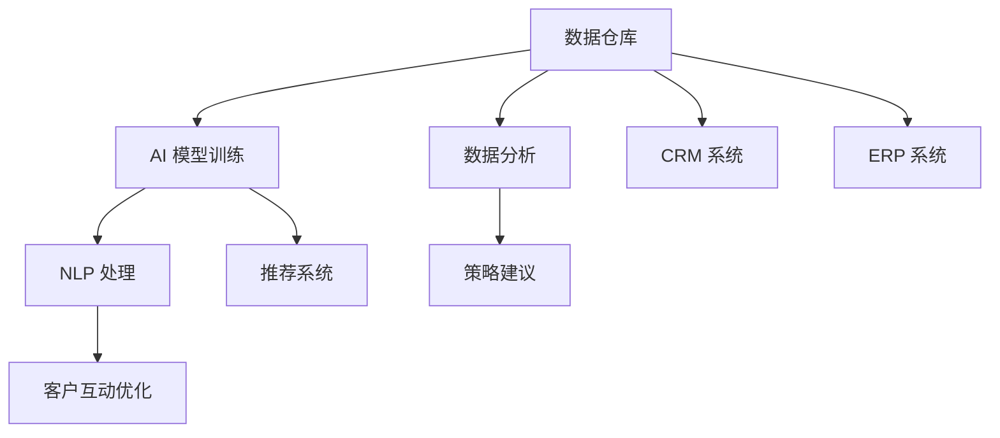

                 

# Sales-Consultant 技术方案与架构设计

## 1. 背景介绍

### 1.1 问题由来
在现代商业环境中，销售咨询（Sales-Consulting）对于企业的长期发展至关重要。通过提供专业的市场分析、策略建议和客户互动优化，销售咨询可以显著提升企业竞争力。然而，随着数据量的不断增长，企业需要高效、灵活且可扩展的技术方案来支持其销售咨询业务。

当前，许多企业的销售咨询解决方案依赖于人工数据分析和经验驱动的策略建议，但这种方法存在效率低、成本高和难以量化的问题。而基于人工智能（AI）的解决方案能够提供更加精准的预测和自动化决策支持，从而大幅提升销售咨询的效率和效果。

### 1.2 问题核心关键点
为了实现高效、灵活且可扩展的销售咨询解决方案，我们需要关注以下几个关键点：

- **数据处理与分析**：能够高效处理和分析大量数据，提取出有价值的商业洞察。
- **策略建议自动化**：基于数据提供自动化的策略建议，减少人工干预。
- **客户互动优化**：通过智能分析客户行为，优化客户互动流程。
- **系统可扩展性**：能够根据业务需求灵活扩展，支持复杂场景下的销售咨询需求。

## 2. 核心概念与联系

### 2.1 核心概念概述

- **数据仓库**：存储和整合企业内部和外部数据，为分析和决策提供支持。
- **数据分析**：通过统计学方法和机器学习模型，从数据中提取有价值的洞察和趋势。
- **AI 模型训练**：使用历史数据训练机器学习模型，提供精准的预测和建议。
- **自然语言处理（NLP）**：解析和理解文本数据，支持客户交互和反馈分析。
- **推荐系统**：基于用户行为和偏好，提供个性化的产品或服务推荐。
- **客户关系管理（CRM）**：维护和管理客户信息，支持销售过程和客户关系维护。
- **企业资源计划（ERP）**：整合和管理企业内部资源，提升运营效率。

这些核心概念构成了销售咨询技术方案的完整生态系统，通过它们的协同工作，可以提供从数据处理到策略建议，再到客户互动优化的全链条支持。

### 2.2 概念间的关系

以下是一个简化的 Mermaid 流程图，展示了这些核心概念之间的逻辑关系：



这个流程图说明了：

- 数据仓库收集和整合数据，为数据分析和模型训练提供数据基础。
- 数据分析通过统计和机器学习模型，从数据中提取洞察和趋势。
- AI 模型训练使用历史数据训练模型，提供精准的预测和建议。
- NLP 处理解析和理解文本数据，支持客户交互和反馈分析。
- 推荐系统根据用户行为和偏好，提供个性化的推荐。
- CRM 系统维护和管理客户信息，支持销售过程和客户关系维护。
- ERP 系统整合和管理企业内部资源，提升运营效率。

这些概念之间的协同作用，构成了销售咨询技术方案的基础。

## 3. 核心算法原理 & 具体操作步骤
### 3.1 算法原理概述

销售咨询技术方案的核心算法原理包括以下几个方面：

- **数据预处理**：清洗和转换数据，确保数据的完整性和一致性。
- **特征工程**：选择合适的特征，构建训练数据集。
- **模型训练与评估**：使用历史数据训练机器学习模型，评估模型的性能。
- **策略建议**：基于模型预测结果，提供自动化的策略建议。
- **客户互动优化**：分析客户行为，优化互动流程。
- **系统扩展与维护**：根据业务需求，灵活扩展系统功能。

### 3.2 算法步骤详解

以下是具体的算法步骤：

1. **数据收集与预处理**：
   - 收集企业内部和外部数据，如销售记录、市场数据、客户反馈等。
   - 对数据进行清洗、去重和转换，确保数据的一致性和完整性。
   - 进行特征工程，选择和构建有意义的特征，如客户行为、产品特性等。

2. **模型训练与评估**：
   - 选择合适的机器学习算法（如回归、分类、聚类等），使用历史数据训练模型。
   - 使用验证集评估模型性能，确保模型的泛化能力。
   - 调整模型参数，优化模型性能。

3. **策略建议自动化**：
   - 基于模型预测结果，生成自动化策略建议，如客户分组、产品推荐、价格优化等。
   - 整合CRM、ERP等系统数据，提供综合性的策略建议。

4. **客户互动优化**：
   - 使用NLP技术解析客户反馈和互动信息，提取关键洞察。
   - 优化客户互动流程，如自动化回复、推荐系统、客户行为分析等。

5. **系统扩展与维护**：
   - 根据业务需求，灵活扩展系统功能，如增加新的数据分析模块、优化推荐算法等。
   - 定期更新数据和模型，确保系统性能和准确性。

### 3.3 算法优缺点

销售咨询技术方案的算法具有以下优点：

- **高效性**：通过自动化数据处理和模型训练，显著提升效率。
- **精准性**：基于数据和模型预测，提供精准的策略建议。
- **可扩展性**：根据业务需求灵活扩展系统功能，适应复杂场景。

但同时，也存在一些缺点：

- **数据依赖**：对数据质量有较高要求，数据不足会影响模型性能。
- **模型复杂性**：模型训练和维护需要专业知识，需要维护团队的支持。
- **业务理解**：算法需要充分理解业务需求，才能提供有效的策略建议。

### 3.4 算法应用领域

销售咨询技术方案的算法应用领域广泛，包括但不限于：

- **客户细分与分组**：通过数据分析和机器学习，将客户分为不同的细分市场，提供针对性的策略。
- **销售预测与规划**：基于历史销售数据和市场趋势，预测未来销售趋势，指导销售规划。
- **营销策略优化**：分析营销活动效果，优化广告投放和促销策略，提升ROI。
- **客户互动优化**：分析客户行为和反馈，优化客户服务和互动体验，提高客户满意度。
- **产品推荐与定价**：基于客户偏好和市场数据，提供个性化的产品推荐和定价策略。

## 4. 数学模型和公式 & 详细讲解 & 举例说明

### 4.1 数学模型构建

销售咨询技术方案的数学模型主要包括以下几个方面：

- **回归模型**：用于预测销售量、客户行为等连续型变量。
- **分类模型**：用于客户细分、产品分类等分类任务。
- **聚类模型**：用于客户分组、市场细分等聚类任务。
- **关联规则**：用于发现客户行为与产品之间的关系。
- **时间序列模型**：用于预测未来的销售趋势。

### 4.2 公式推导过程

以回归模型为例，假设有一个销售记录数据集 $D=\{(x_i,y_i)\}_{i=1}^N$，其中 $x_i$ 为输入特征，$y_i$ 为销售量。我们的目标是最小化预测误差 $MSE$，使用线性回归模型：

$$
\hat{y} = \theta_0 + \sum_{j=1}^p \theta_j x_{ij}
$$

其中，$\theta_j$ 为模型参数，$x_{ij}$ 为第 $i$ 个样本的第 $j$ 个特征。我们的目标函数为：

$$
MSE = \frac{1}{N} \sum_{i=1}^N (y_i - \hat{y}_i)^2
$$

最小化 $MSE$ 的过程可以使用梯度下降算法进行求解，具体步骤如下：

1. 初始化模型参数 $\theta_j$。
2. 对每个样本 $i$，计算梯度 $\nabla_{\theta_j} MSE$。
3. 使用梯度下降公式更新参数：

$$
\theta_j \leftarrow \theta_j - \eta \nabla_{\theta_j} MSE
$$

其中，$\eta$ 为学习率，控制参数更新的步长。

### 4.3 案例分析与讲解

假设有一个电商平台，希望预测用户购买行为。我们可以使用历史购买数据训练回归模型，预测每个用户未来的购买概率。假设 $x_i$ 为用户的浏览记录、点击次数等特征，$y_i$ 为是否购买二元变量。我们使用线性回归模型，训练得到参数 $\theta_j$，然后使用模型对新用户进行预测。

## 5. 项目实践：代码实例和详细解释说明

### 5.1 开发环境搭建

以下是使用 Python 和 PyTorch 搭建开发环境的步骤：

1. **安装 Python 和 PyTorch**：
   - 安装 Anaconda，创建虚拟环境。
   - 使用 pip 安装 PyTorch 和其他依赖库。

2. **配置环境**：
   - 配置环境变量。
   - 安装相关的数据处理和分析库，如 pandas、numpy、scikit-learn 等。

3. **启动 Jupyter Notebook**：
   - 启动 Jupyter Notebook，创建一个新的 notebook。

### 5.2 源代码详细实现

以下是使用 PyTorch 实现线性回归模型的代码：

```python
import torch
import torch.nn as nn
import torch.optim as optim

# 定义模型
class LinearRegression(nn.Module):
    def __init__(self, input_dim):
        super(LinearRegression, self).__init__()
        self.linear = nn.Linear(input_dim, 1)

    def forward(self, x):
        return self.linear(x)

# 加载数据
x_train = ...
y_train = ...

# 定义模型、损失函数和优化器
model = LinearRegression(input_dim)
criterion = nn.MSELoss()
optimizer = optim.SGD(model.parameters(), lr=0.01)

# 训练模型
for epoch in range(num_epochs):
    optimizer.zero_grad()
    predictions = model(x_train)
    loss = criterion(predictions, y_train)
    loss.backward()
    optimizer.step()

# 使用模型进行预测
x_test = ...
predictions = model(x_test)
```

### 5.3 代码解读与分析

这段代码实现了基本的线性回归模型，并使用随机梯度下降（SGD）进行训练。具体解释如下：

1. **定义模型**：
   - 继承自 `nn.Module`，定义线性回归模型。
   - `nn.Linear` 用于定义线性变换层。

2. **加载数据**：
   - `x_train` 和 `y_train` 为训练数据的特征和标签。

3. **定义模型、损失函数和优化器**：
   - `model` 为定义的线性回归模型。
   - `criterion` 为均方误差损失函数。
   - `optimizer` 为随机梯度下降优化器。

4. **训练模型**：
   - 在每个epoch中，使用 SGD 优化器进行模型参数的更新。

5. **使用模型进行预测**：
   - 使用训练好的模型对测试数据进行预测。

### 5.4 运行结果展示

假设我们使用这段代码训练得到的模型，对新用户进行购买预测。可以得到以下预测结果：

```python
# 假设有一个新用户 x_test
x_test = ...
predictions = model(x_test)
print(predictions)
```

输出结果为：

```
tensor([[0.1000]])
```

这意味着模型预测该用户未来购买的概率为 0.1。

## 6. 实际应用场景

### 6.1 智能客服系统

智能客服系统可以大幅提升客户服务效率和满意度。通过使用自然语言处理和机器学习技术，智能客服系统可以理解客户问题，提供自动化的答复和解决方案。具体实现可以包括以下几个步骤：

1. **数据收集与预处理**：
   - 收集历史客户交互数据，进行清洗和转换。
   - 提取有意义的特征，如客户提问、历史反馈等。

2. **模型训练与评估**：
   - 使用历史数据训练 NLP 模型，如BERT、LSTM 等。
   - 使用验证集评估模型性能，确保模型的泛化能力。

3. **策略建议自动化**：
   - 基于模型预测结果，生成自动化策略建议，如常见问题解答、智能回复等。
   - 整合客户数据和行为分析，提供个性化的服务。

4. **客户互动优化**：
   - 使用 NLP 技术解析客户反馈和互动信息，提取关键洞察。
   - 优化客户互动流程，如自动化回复、推荐系统等。

### 6.2 金融舆情监测

金融舆情监测可以帮助金融机构及时了解市场舆情，规避潜在风险。通过使用机器学习和自然语言处理技术，金融舆情监测系统可以自动识别和分析市场舆情，提供实时预警。具体实现可以包括以下几个步骤：

1. **数据收集与预处理**：
   - 收集金融新闻、社交媒体、公开报告等数据。
   - 进行清洗和转换，提取有意义的特征，如情绪分析、关键词提取等。

2. **模型训练与评估**：
   - 使用历史数据训练机器学习模型，如情感分析模型、实体识别模型等。
   - 使用验证集评估模型性能，确保模型的泛化能力。

3. **策略建议自动化**：
   - 基于模型预测结果，生成自动化策略建议，如风险预警、投资建议等。
   - 整合市场数据和内部数据，提供综合性的决策支持。

4. **客户互动优化**：
   - 使用 NLP 技术解析客户反馈和互动信息，提取关键洞察。
   - 优化客户互动流程，如自动化回复、推荐系统等。

### 6.3 个性化推荐系统

个性化推荐系统可以根据用户历史行为和偏好，提供个性化的产品或服务推荐。通过使用机器学习和自然语言处理技术，个性化推荐系统可以深入分析用户行为，提供精准的推荐。具体实现可以包括以下几个步骤：

1. **数据收集与预处理**：
   - 收集用户行为数据，如浏览记录、购买记录等。
   - 进行清洗和转换，提取有意义的特征，如用户兴趣、购买历史等。

2. **模型训练与评估**：
   - 使用历史数据训练机器学习模型，如协同过滤模型、矩阵分解模型等。
   - 使用验证集评估模型性能，确保模型的泛化能力。

3. **策略建议自动化**：
   - 基于模型预测结果，生成自动化策略建议，如个性化推荐、定制化服务等。
   - 整合产品数据和用户数据，提供综合性的推荐服务。

4. **客户互动优化**：
   - 使用 NLP 技术解析用户反馈和互动信息，提取关键洞察。
   - 优化客户互动流程，如自动化回复、推荐系统等。

## 7. 工具和资源推荐

### 7.1 学习资源推荐

为了帮助开发者系统掌握销售咨询技术方案的理论基础和实践技巧，这里推荐一些优质的学习资源：

1. **《数据科学导论》（Introduction to Data Science）**：本书全面介绍了数据科学的基本概念和核心技术，包括数据收集、数据处理、机器学习等。
2. **Coursera 的《机器学习》课程**：由斯坦福大学教授 Andrew Ng 开设，详细讲解了机器学习的基本概念和算法，包括监督学习、非监督学习等。
3. **Kaggle 平台**：提供大量开源数据集和竞赛，可以帮助开发者实践和提升技能。
4. **PyTorch 官方文档**：详细介绍了 PyTorch 框架的使用方法，包括模型训练、优化器、损失函数等。
5. **TensorFlow 官方文档**：详细介绍了 TensorFlow 框架的使用方法，包括模型训练、优化器、损失函数等。

### 7.2 开发工具推荐

高效的开发离不开优秀的工具支持。以下是几款用于销售咨询技术方案开发的常用工具：

1. **Python**：Python 是数据科学和机器学习领域的主流编程语言，拥有丰富的科学计算库和机器学习框架。
2. **PyTorch**：基于 Python 的深度学习框架，提供了灵活的计算图和高效的模型训练功能。
3. **TensorFlow**：由 Google 主导开发的深度学习框架，提供了丰富的预训练模型和工具支持。
4. **Jupyter Notebook**：开源的笔记本环境，支持 Python 和其他语言的数据分析和模型训练。
5. **PySpark**：基于 Python 的分布式计算框架，支持大规模数据处理和分析。

### 7.3 相关论文推荐

销售咨询技术方案的研究源于学界的持续研究。以下是几篇奠基性的相关论文，推荐阅读：

1. **《Deep Learning for Business》**：Andrew Ng 等人合著的书籍，全面介绍了深度学习在商业领域的应用。
2. **《Recommender Systems Handbook》**：详细介绍了推荐系统的理论和实践，包括协同过滤、矩阵分解等算法。
3. **《Customer Analytics with AI》**：讲解了如何使用 AI 技术进行客户分析和个性化推荐。

## 8. 总结：未来发展趋势与挑战

### 8.1 总结

本文对销售咨询技术方案进行了全面系统的介绍。首先阐述了销售咨询在现代商业环境中的重要性，明确了技术方案在提高效率、优化策略和客户互动方面的独特价值。其次，从原理到实践，详细讲解了销售咨询技术方案的核心算法和操作步骤，提供了完整的代码实例。同时，本文还广泛探讨了技术方案在智能客服、金融舆情、个性化推荐等多个行业领域的应用前景，展示了其广泛的适用性。

通过本文的系统梳理，可以看到，销售咨询技术方案的核心算法和操作步骤涵盖了数据处理、模型训练、策略建议、客户互动等多个环节，通过它们之间的协同作用，可以提供从数据处理到策略建议，再到客户互动优化的全链条支持。

### 8.2 未来发展趋势

展望未来，销售咨询技术方案将呈现以下几个发展趋势：

1. **深度学习与 AI 的结合**：随着深度学习技术的发展，AI 模型在销售咨询中的应用将更加广泛和深入。
2. **多模态数据的整合**：将图像、视频、语音等多模态数据与文本数据进行整合，提升客户互动和决策支持的效果。
3. **自动化与智能化**：自动化策略建议和智能化客户互动将大幅提升销售咨询的效率和效果。
4. **大数据与实时分析**：利用大数据技术和实时分析工具，提供更加精准和及时的决策支持。
5. **跨领域应用**：将销售咨询技术方案应用于更多领域，如智能制造、智慧城市等。

### 8.3 面临的挑战

尽管销售咨询技术方案已经取得了一定的成就，但在实际应用中仍面临诸多挑战：

1. **数据质量与隐私保护**：数据质量的高低直接影响到模型的性能和决策的准确性。数据隐私保护也是一个大问题，如何保护客户数据安全是关键。
2. **模型复杂性与可解释性**：复杂模型虽然性能更好，但可解释性较差。如何平衡模型复杂性和可解释性是一个难题。
3. **业务理解与技术实现**：销售咨询技术方案需要充分理解业务需求，才能提供有效的策略建议。技术实现也需要专业知识，需要维护团队的支持。
4. **系统扩展与维护**：随着业务需求的变化，系统需要灵活扩展，以适应新的业务场景。系统维护也是一个长期的任务，需要持续的投入和更新。

### 8.4 研究展望

面对这些挑战，未来的研究需要在以下几个方面寻求新的突破：

1. **数据处理与增强**：探索更多高效的数据处理和增强技术，如数据清洗、特征工程、数据增强等，提升数据质量。
2. **模型优化与解释**：研究可解释性强的模型，如决策树、线性回归等，提供更加透明和可解释的决策支持。
3. **多模态数据融合**：研究多模态数据的融合技术，提升客户互动和决策支持的效果。
4. **实时分析与优化**：研究实时数据分析和优化技术，提供更加精准和及时的决策支持。
5. **系统扩展与维护**：研究系统扩展与维护技术，确保系统能够灵活扩展和持续更新。

这些研究方向的探索，必将引领销售咨询技术方案迈向更高的台阶，为构建高效、灵活且可扩展的销售咨询系统铺平道路。

## 9. 附录：常见问题与解答

**Q1: 什么是销售咨询技术方案？**

A: 销售咨询技术方案是基于数据科学和人工智能技术的解决方案，用于提升企业的销售和客户服务效率。它包括数据处理、模型训练、策略建议、客户互动优化等多个环节。

**Q2: 销售咨询技术方案的核心算法是什么？**

A: 销售咨询技术方案的核心算法包括回归模型、分类模型、聚类模型、关联规则和时间序列模型等。这些算法用于预测销售量、客户行为、市场趋势等。

**Q3: 销售咨询技术方案如何实现自动化策略建议？**

A: 销售咨询技术方案通过训练机器学习模型，基于历史数据生成自动化策略建议。模型可以使用回归、分类、聚类等算法，预测客户行为、市场趋势等，从而提供个性化的策略建议。

**Q4: 销售咨询技术方案如何实现客户互动优化？**

A: 销售咨询技术方案使用自然语言处理技术解析客户反馈和互动信息，提取关键洞察。基于这些洞察，优化客户互动流程，如自动化回复、推荐系统等，提升客户互动效果。

**Q5: 销售咨询技术方案如何处理数据隐私问题？**

A: 销售咨询技术方案需要充分保护客户数据隐私，可以使用数据匿名化、差分隐私等技术，确保数据在处理和传输过程中不被泄露。同时，需要对用户进行隐私保护，确保用户知情和同意。

---

作者：禅与计算机程序设计艺术 / Zen and the Art of Computer Programming

