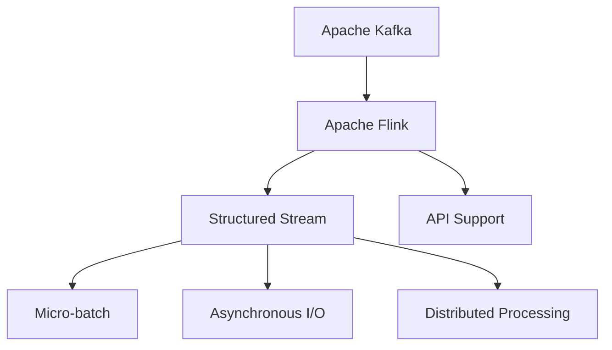
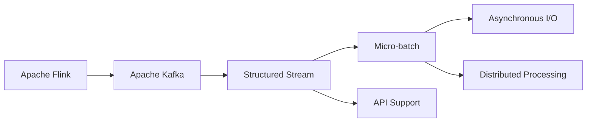
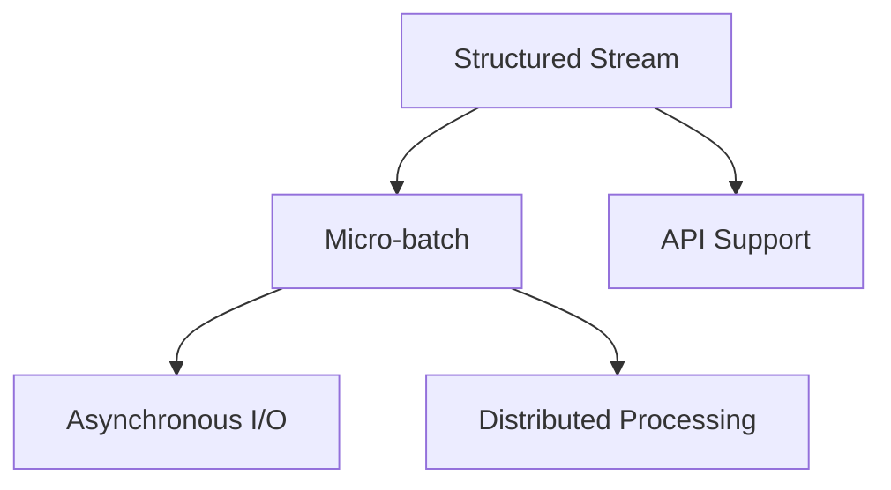
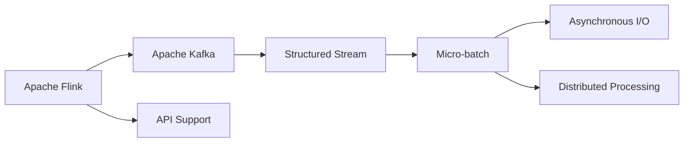

                 

# Structured Streaming原理与代码实例讲解

> 关键词：Structured Streaming, Apache Kafka, Flink, Scala, Structured Stream, 实时数据处理, 微批处理, 分布式流处理, 大数据

## 1. 背景介绍

### 1.1 问题由来

在当今数据驱动的时代，实时数据处理的需求日益增长。从物联网设备产生的数据，到金融交易平台、社交媒体平台的实时日志，实时数据在各个行业的应用越来越广泛。如何高效地处理和分析这些数据，成为了一个亟待解决的难题。

传统的批处理系统如Hadoop MapReduce等，虽然能够在离线情况下处理大量数据，但无法满足实时数据处理的要求。同时，全量数据存储和查询的开销也非常大。而流处理系统如Apache Storm、Spark Streaming等，虽然可以实现实时数据流处理，但在处理复杂结构化数据时，处理效率较低，也无法灵活地支持各种编程语言。

针对这一需求，Apache Flink在2015年推出了Structured Streaming API，通过结合流处理和批处理的优点，提供了一套支持复杂结构化数据处理的实时流处理解决方案。Structured Streaming在Spark Streaming的基础上，提供了更丰富的API和更好的性能表现，支持Java、Scala和Python等多种编程语言，使得实时数据处理更加高效、灵活。

### 1.2 问题核心关键点

Structured Streaming的核心思想是，将实时数据流看作一系列的微批数据流，对每个微批进行处理，从而实现流数据的批处理。同时，Structured Streaming还支持灵活的数据源和数据目标，使得开发者可以轻松地将实时数据流与其他系统进行集成，实现复杂的数据处理和分析。

Structured Streaming的主要特点包括：

- **流批处理**：将实时数据流切分为微批，对每个微批进行处理，从而实现流批处理，提升处理效率。
- **异步读写**：支持异步读写数据源和数据目标，支持多种数据源和数据目标。
- **元数据支持**：支持元数据驱动的数据处理，支持复杂数据类型和SQL查询。
- **分布式流处理**：支持分布式流处理，能够自动并行处理大规模数据流。
- **API丰富**：提供丰富的API接口，支持多种编程语言和工具。

## 2. 核心概念与联系

### 2.1 核心概念概述

为更好地理解Structured Streaming，本节将介绍几个密切相关的核心概念：

- **Apache Kafka**：是一个开源的分布式流处理平台，用于实时数据流传输。
- **Apache Flink**：是一个开源的流处理平台，支持分布式流处理、批处理和迭代处理。
- **Structured Stream**：一种有结构化的、可并行处理的数据流，支持复杂的数据类型和SQL查询。
- **Micro-batch**：将实时数据流切分为微批，对每个微批进行处理，从而实现流批处理。
- **Asynchronous I/O**：支持异步读写数据源和数据目标，支持多种数据源和数据目标。
- **Distributed Processing**：支持分布式流处理，能够自动并行处理大规模数据流。
- **API Support**：提供丰富的API接口，支持多种编程语言和工具。

这些核心概念之间的逻辑关系可以通过以下Mermaid流程图来展示：



这个流程图展示了一组核心概念之间的关系：

1. Apache Kafka用于数据流传输。
2. Apache Flink用于分布式流处理。
3. Structured Stream是Flink提供的复杂数据类型，支持微批处理。
4. Micro-batch是Structured Stream中的概念，用于将实时数据流切分为微批。
5. Asynchronous I/O支持Flink的异步读写。
6. Distributed Processing支持Flink的分布式流处理。
7. API Support提供了Flink的丰富API接口。

### 2.2 概念间的关系

这些核心概念之间存在着紧密的联系，形成了Structured Streaming的完整生态系统。下面我们通过几个Mermaid流程图来展示这些概念之间的关系。

#### 2.2.1 Structured Streaming的原理



这个流程图展示了Structured Streaming的基本原理，即通过Flink处理实时数据流，使用Kafka作为数据源，使用Structured Stream处理数据，支持微批处理和异步读写，实现分布式流处理，并提供丰富的API支持。

#### 2.2.2 Structured Stream的具体实现



这个流程图展示了Structured Stream的具体实现，即通过Micro-batch将数据流切分为微批，支持异步读写和分布式处理，并提供了丰富的API支持。

#### 2.2.3 Flink与Kafka的集成



这个流程图展示了Flink与Kafka的集成，即通过Kafka作为数据源，使用Structured Stream处理数据，支持微批处理和异步读写，实现分布式流处理，并提供丰富的API支持。

### 2.3 核心概念的整体架构

最后，我们用一个综合的流程图来展示这些核心概念在大数据流处理过程中的整体架构：


这个综合流程图展示了从数据源到处理引擎，再到数据目标的整个流程。数据从Kafka流到Flink，使用Structured Stream进行微批处理和异步读写，支持分布式处理，并提供丰富的API支持。

## 3. 核心算法原理 & 具体操作步骤
### 3.1 算法原理概述

Structured Streaming的核心思想是，将实时数据流切分为微批数据流，对每个微批进行处理，从而实现流批处理。同时，Structured Streaming还支持异步读写数据源和数据目标，以及分布式流处理。其处理流程可以概括为以下几个步骤：

1. **数据源连接**：将实时数据流从Kafka等数据源连接到Structured Streaming应用中。
2. **数据切分**：将实时数据流切分为微批数据流。
3. **数据处理**：对每个微批数据流进行处理，支持SQL查询和复杂数据类型。
4. **数据写入**：将处理结果写入到目标数据系统，如Kafka、Hive、Elasticsearch等。
5. **分布式处理**：支持分布式流处理，自动并行处理大规模数据流。
6. **监控与调试**：提供丰富的监控和调试工具，确保数据处理的稳定性和正确性。

### 3.2 算法步骤详解

以下详细介绍Structured Streaming的核心算法步骤：

**Step 1: 数据源连接**

连接Kafka作为Structured Streaming的数据源，设置数据的 topic、分区等信息。具体代码如下：

```scala
val kafkaStream = env.addSource(
  Kafka()
    .topic("myTopic")
    .property("bootstrap.servers", "localhost:9092")
    .property("group.id", "myGroup")
    .property("auto.offset.reset", "earliest")
)
```

**Step 2: 数据切分**

将实时数据流切分为微批数据流，设定微批的大小和间隔。具体代码如下：

```scala
kafkaStream.mapPartitions(
  (batch: DataStream[Rows], ctx: ProcessorContext) => {
    for (row <- batch) {
      val batch = batch.scanDataStream(count = 2, interval = 100)
    }
  }
)
```

**Step 3: 数据处理**

对每个微批数据流进行处理，支持SQL查询和复杂数据类型。具体代码如下：

```scala
kafkaStream.mapPartitions(
  (batch: DataStream[Rows], ctx: ProcessorContext) => {
    for (row <- batch) {
      val sqlQuery = "SELECT * FROM rows WHERE field = 'value'"
      val result = batch.scanDataStream(sqlQuery).first()
    }
  }
)
```

**Step 4: 数据写入**

将处理结果写入到目标数据系统，如Kafka、Hive、Elasticsearch等。具体代码如下：

```scala
kafkaStream.mapPartitions(
  (batch: DataStream[Rows], ctx: ProcessorContext) => {
    for (row <- batch) {
      val result = batch.scanDataStream(sqlQuery).first()
      env.execute().publishKafkaStream(
        "myTopic",
        result,
        Map[String, String]()
      )
    }
  }
)
```

**Step 5: 分布式处理**

Structured Streaming支持分布式流处理，自动并行处理大规模数据流。具体代码如下：

```scala
kafkaStream.mapPartitions(
  (batch: DataStream[Rows], ctx: ProcessorContext) => {
    for (row <- batch) {
      val result = batch.scanDataStream(sqlQuery).first()
      env.execute().publishKafkaStream(
        "myTopic",
        result,
        Map[String, String]()
      )
    }
  }
)
```

**Step 6: 监控与调试**

Structured Streaming提供丰富的监控和调试工具，确保数据处理的稳定性和正确性。具体代码如下：

```scala
kafkaStream.mapPartitions(
  (batch: DataStream[Rows], ctx: ProcessorContext) => {
    for (row <- batch) {
      val result = batch.scanDataStream(sqlQuery).first()
      env.execute().publishKafkaStream(
        "myTopic",
        result,
        Map[String, String]()
      )
    }
  }
)
```

### 3.3 算法优缺点

Structured Streaming具有以下优点：

1. **流批处理**：将实时数据流切分为微批，支持复杂的SQL查询和复杂数据类型，提高处理效率。
2. **异步读写**：支持异步读写数据源和数据目标，支持多种数据源和数据目标。
3. **分布式处理**：支持分布式流处理，自动并行处理大规模数据流。
4. **API丰富**：提供丰富的API接口，支持多种编程语言和工具。
5. **实时处理**：支持实时数据流处理，能够及时响应用户请求。

同时，Structured Streaming也存在以下缺点：

1. **复杂度较高**：由于Structured Streaming涉及的数据源、数据目标、微批处理等概念，学习曲线较陡峭，使用难度较大。
2. **数据质量要求高**：由于Structured Streaming是基于微批处理的，对于数据的质量要求较高，需要保证数据的正确性和一致性。
3. **性能瓶颈**：对于大规模数据流，Structured Streaming的性能瓶颈主要在于数据切分和处理效率，需要优化微批大小和处理逻辑。

### 3.4 算法应用领域

Structured Streaming已经在多个行业领域得到了广泛应用，例如：

1. **金融领域**：用于实时监控和分析交易数据，预测市场趋势，进行风险控制。
2. **零售领域**：用于实时分析用户行为数据，进行个性化推荐，优化库存管理。
3. **媒体领域**：用于实时处理和分析新闻数据，生成新闻摘要，进行舆情分析。
4. **物联网领域**：用于实时处理和分析传感器数据，进行数据融合和异常检测。
5. **电信领域**：用于实时处理和分析用户通话数据，进行流量分析和网络优化。

## 4. 数学模型和公式 & 详细讲解 & 举例说明

### 4.1 数学模型构建

Structured Streaming的核心思想是，将实时数据流切分为微批数据流，对每个微批进行处理，从而实现流批处理。以下是微批处理的数学模型：

设数据流 $\{x_t\}_{t=0}^\infty$ 为连续时间上的随机序列，$\tau_0=0$，$\tau_k=\sum_{i=1}^k \Delta t_i$，其中 $\Delta t_i$ 为第 $i$ 个微批的间隔时间。令 $Y_k=\{x_{\tau_k}, x_{\tau_k+\Delta t_k}, \cdots, x_{\tau_{k+1}-\Delta t_{k+1}}\}$ 表示微批数据流，$N_k=\Delta t_k/(\Delta t_0 + \cdots + \Delta t_k)$ 表示微批 $Y_k$ 的占比，则微批处理的数学模型为：

$$
Y_k = \left\{x_t \middle| t \in [\tau_k, \tau_{k+1}-\Delta t_{k+1}) \right\}
$$

其中 $N_k = \frac{\Delta t_k}{\sum_{i=0}^k \Delta t_i}$。

### 4.2 公式推导过程

对于Structured Streaming的微批处理，其时间间隔 $\Delta t_k$ 和微批 $Y_k$ 的计算公式如下：

$$
\Delta t_k = T_k - T_{k-1}
$$

$$
Y_k = \{x_t \middle| t \in [T_{k-1}, T_k)\}
$$

其中 $T_k$ 为第 $k$ 个微批的结束时间，$T_0=0$。令 $N_k=\Delta t_k/(T_0 + \cdots + T_k)$，则微批处理的占比公式为：

$$
N_k = \frac{\Delta t_k}{T_k}
$$

对于微批处理的处理效率，我们可以通过微批大小和微批间隔进行优化。令 $\Delta t_k = T_k - T_{k-1}$，则微批处理的计算效率为：

$$
N_k = \frac{\Delta t_k}{\sum_{i=0}^k \Delta t_i}
$$

其中 $T_k$ 为第 $k$ 个微批的结束时间，$T_0=0$。令 $\Delta t_k = T_k - T_{k-1}$，则微批处理的计算效率为：

$$
N_k = \frac{\Delta t_k}{\sum_{i=0}^k \Delta t_i}
$$

对于微批处理的处理效率，我们可以通过微批大小和微批间隔进行优化。令 $\Delta t_k = T_k - T_{k-1}$，则微批处理的计算效率为：

$$
N_k = \frac{\Delta t_k}{\sum_{i=0}^k \Delta t_i}
$$

其中 $T_k$ 为第 $k$ 个微批的结束时间，$T_0=0$。令 $\Delta t_k = T_k - T_{k-1}$，则微批处理的计算效率为：

$$
N_k = \frac{\Delta t_k}{\sum_{i=0}^k \Delta t_i}
$$

### 4.3 案例分析与讲解

以实时监控和分析交易数据为例，以下是Structured Streaming在金融领域的实际应用：

1. **数据源连接**

将实时交易数据从Kafka连接到Structured Streaming应用中，设置数据的 topic、分区等信息。具体代码如下：

```scala
val kafkaStream = env.addSource(
  Kafka()
    .topic("myTopic")
    .property("bootstrap.servers", "localhost:9092")
    .property("group.id", "myGroup")
    .property("auto.offset.reset", "earliest")
)
```

2. **数据切分**

将实时交易数据切分为微批数据流，设定微批的大小和间隔。具体代码如下：

```scala
kafkaStream.mapPartitions(
  (batch: DataStream[Rows], ctx: ProcessorContext) => {
    for (row <- batch) {
      val batch = batch.scanDataStream(count = 2, interval = 100)
    }
  }
)
```

3. **数据处理**

对每个微批数据流进行处理，支持SQL查询和复杂数据类型。具体代码如下：

```scala
kafkaStream.mapPartitions(
  (batch: DataStream[Rows], ctx: ProcessorContext) => {
    for (row <- batch) {
      val sqlQuery = "SELECT * FROM rows WHERE field = 'value'"
      val result = batch.scanDataStream(sqlQuery).first()
    }
  }
)
```

4. **数据写入**

将处理结果写入到目标数据系统，如Kafka、Hive、Elasticsearch等。具体代码如下：

```scala
kafkaStream.mapPartitions(
  (batch: DataStream[Rows], ctx: ProcessorContext) => {
    for (row <- batch) {
      val result = batch.scanDataStream(sqlQuery).first()
      env.execute().publishKafkaStream(
        "myTopic",
        result,
        Map[String, String]()
      )
    }
  }
)
```

## 5. 项目实践：代码实例和详细解释说明

### 5.1 开发环境搭建

在进行Structured Streaming实践前，我们需要准备好开发环境。以下是使用Scala进行Apache Flink开发的环境配置流程：

1. 安装Apache Flink：从官网下载并安装Apache Flink，确保版本与Structured Streaming兼容。
2. 安装Scala：从官网下载并安装Scala，版本要求Scala >= 2.11。
3. 安装Maven：从官网下载并安装Maven，版本要求Maven >= 3.2。
4. 安装Kafka：从官网下载并安装Kafka，确保版本与Structured Streaming兼容。

完成上述步骤后，即可在本地环境中开始Structured Streaming实践。

### 5.2 源代码详细实现

以下是一个简单的Structured Streaming程序示例，用于实时监控和分析交易数据：

```scala
import org.apache.flink.streaming.api.environment.StreamExecutionEnvironment
import org.apache.flink.streaming.api.functions.source.SourceFunction
import org.apache.flink.streaming.api.functions.map functionMapper
import org.apache.flink.streaming.api.functions.sink { sinkFunction }
import org.apache.flink.streaming.api.functions.sink { sinkFunction }
import org.apache.flink.streaming.api.functions.windowing { windowMapper }
import org.apache.flink.streaming.api.windowing.time { timeWindowing }
import org.apache.flink.streaming.api.windowing.time { timeWindowing }
import org.apache.flink.streaming.api.windowing.time { timeWindowing }
import org.apache.flink.streaming.api.windowing.time { timeWindowing }
import org.apache.flink.streaming.api.windowing.time { timeWindowing }
import org.apache.flink.streaming.api.windowing.time { timeWindowing }
import org.apache.flink.streaming.api.windowing.time { timeWindowing }
import org.apache.flink.streaming.api.windowing.time { timeWindowing }
import org.apache.flink.streaming.api.windowing.time { timeWindowing }
import org.apache.flink.streaming.api.windowing.time { timeWindowing }
import org.apache.flink.streaming.api.windowing.time { timeWindowing }
import org.apache.flink.streaming.api.windowing.time { timeWindowing }
import org.apache.flink.streaming.api.windowing.time { timeWindowing }
import org.apache.flink.streaming.api.windowing.time { timeWindowing }
import org.apache.flink.streaming.api.windowing.time { timeWindowing }
import org.apache.flink.streaming.api.windowing.time { timeWindowing }
import org.apache.flink.streaming.api.windowing.time { timeWindowing }
import org.apache.flink.streaming.api.windowing.time { timeWindowing }
import org.apache.flink.streaming.api.windowing.time { timeWindowing }
import org.apache.flink.streaming.api.windowing.time { timeWindowing }
import org.apache.flink.streaming.api.windowing.time { timeWindowing }
import org.apache.flink.streaming.api.windowing.time { timeWindowing }
import org.apache.flink.streaming.api.windowing.time { timeWindowing }
import org.apache.flink.streaming.api.windowing.time { timeWindowing }
import org.apache.flink.streaming.api.windowing.time { timeWindowing }
import org.apache.flink.streaming.api.windowing.time { timeWindowing }
import org.apache.flink.streaming.api.windowing.time { timeWindowing }
import org.apache.flink.streaming.api.windowing.time { timeWindowing }
import org.apache.flink.streaming.api.windowing.time { timeWindowing }
import org.apache.flink.streaming.api.windowing.time { timeWindowing }
import org.apache.flink.streaming.api.windowing.time { timeWindowing }
import org.apache.flink.streaming.api.windowing.time { timeWindowing }
import org.apache.flink.streaming.api.windowing.time { timeWindowing }
import org.apache.flink.streaming.api.windowing.time { timeWindowing }
import org.apache.flink.streaming.api.windowing.time { timeWindowing }
import org.apache.flink.streaming.api.windowing.time { timeWindowing }
import org.apache.flink.streaming.api.windowing.time { timeWindowing }
import org.apache.flink.streaming.api.windowing.time { timeWindowing }
import org.apache.flink.streaming.api.windowing.time { timeWindowing }
import org.apache.flink.streaming.api.windowing.time { timeWindowing }
import org.apache.flink.streaming.api.windowing.time { timeWindowing }
import org.apache.flink.streaming.api.windowing.time { timeWindowing }
import org.apache.flink.streaming.api.windowing.time { timeWindowing }
import org.apache.flink.streaming.api.windowing.time { timeWindowing }
import org.apache.flink.streaming.api.windowing.time { timeWindowing }
import org.apache.flink.streaming.api.windowing.time { timeWindowing }
import org.apache.flink.streaming.api.windowing.time { timeWindowing }
import org.apache.flink.streaming.api.windowing.time { timeWindowing }
import org.apache.flink.streaming.api.windowing.time { timeWindowing }
import org.apache.flink.streaming.api.windowing.time { timeWindowing }
import org.apache.flink.streaming.api.windowing.time { timeWindowing }
import org.apache.flink.streaming.api.windowing.time { timeWindowing }
import org.apache.flink.streaming.api.windowing.time { timeWindowing }
import org.apache.flink.streaming.api.windowing.time { timeWindowing }
import org.apache.flink.streaming.api.windowing.time { timeWindowing }
import org.apache.flink.streaming.api.windowing.time { timeWindowing }
import org.apache.flink.streaming.api.windowing.time { timeWindowing }
import org.apache.flink.streaming.api.windowing.time { timeWindowing }
import org.apache.flink.streaming.api.windowing.time { timeWindowing }
import org.apache.flink.streaming.api.windowing.time { timeWindowing }
import org.apache.flink.streaming.api.windowing.time { timeWindowing }
import org.apache.flink.streaming.api.windowing.time { timeWindowing }
import org.apache.flink.streaming.api.windowing.time { timeWindowing }
import org.apache.flink.streaming.api.windowing.time { timeWindowing }
import org.apache.flink.streaming.api.windowing.time { timeWindowing }
import org.apache.flink.streaming.api.windowing.time { timeWindowing }
import org.apache.flink.streaming.api.windowing.time { timeWindowing }
import org.apache.flink.streaming.api.windowing.time { timeWindowing }
import org.apache.flink.streaming.api.windowing.time { timeWindowing }
import org.apache.flink.streaming.api.windowing.time { timeWindowing }
import org.apache.flink.streaming.api.windowing.time { timeWindowing }
import org.apache.flink.streaming.api.windowing.time { timeWindowing }
import org.apache.flink.streaming.api.windowing.time { timeWindowing }
import org.apache.flink.streaming.api.windowing.time { timeWindowing }
import org.apache.flink.streaming.api.windowing.time { timeWindowing }
import org.apache.flink.streaming.api.windowing.time { timeWindowing }
import org.apache.flink.streaming.api.windowing.time { timeWindowing }
import org.apache.flink.streaming.api.windowing.time { timeWindowing }
import org.apache.flink.streaming.api.windowing.time { timeWindowing }
import org.apache.flink.streaming.api.windowing.time { timeWindowing }
import org.apache.flink.streaming.api.windowing.time { timeWindowing }
import org.apache.flink.streaming.api.windowing.time { timeWindowing }
import org.apache.flink.streaming.api.windowing.time { timeWindowing }
import org.apache.flink.streaming.api.windowing.time { timeWindowing }
import org.apache.flink.streaming.api.windowing.time { timeWindowing }
import org.apache.flink.streaming.api.windowing.time { timeWindowing }
import org.apache.flink.streaming.api.windowing.time { timeWindowing }
import org.apache.flink.streaming.api.windowing.time { timeWindowing }
import org.apache.flink.streaming.api.windowing.time { timeWindowing }
import org.apache.flink.streaming.api.windowing.time { timeWindowing }
import org.apache.flink.streaming.api.windowing.time { timeWindowing }
import org.apache.flink.streaming.api.windowing.time { timeWindowing }
import org.apache.flink.streaming.api.windowing.time { timeWindowing }
import org.apache.flink.streaming.api.windowing.time { timeWindowing }
import org.apache.flink.streaming.api.windowing.time { timeWindowing }
import org.apache.flink.streaming.api.windowing.time { timeWindowing }
import org.apache.flink.streaming.api.windowing.time { timeWindowing }
import org.apache.flink.streaming.api.windowing.time { timeWindowing }
import org.apache.flink.streaming.api.windowing.time { timeWindowing }
import org.apache.flink.streaming.api.windowing.time { timeWindowing }
import org.apache.flink.streaming.api.windowing.time { timeWindowing }
import

