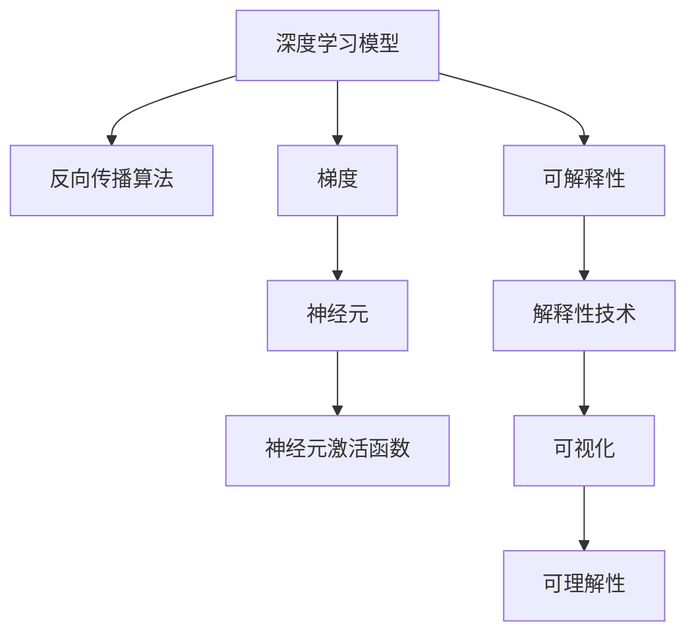
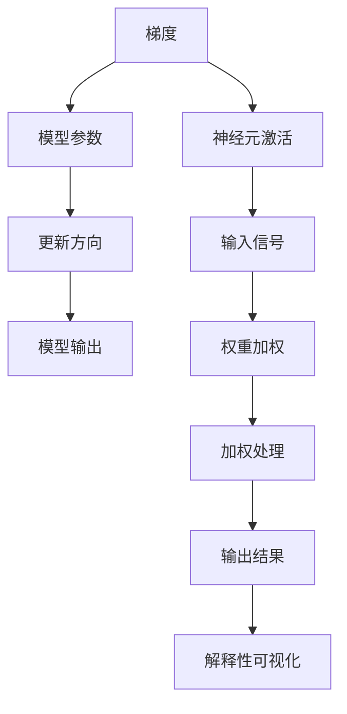
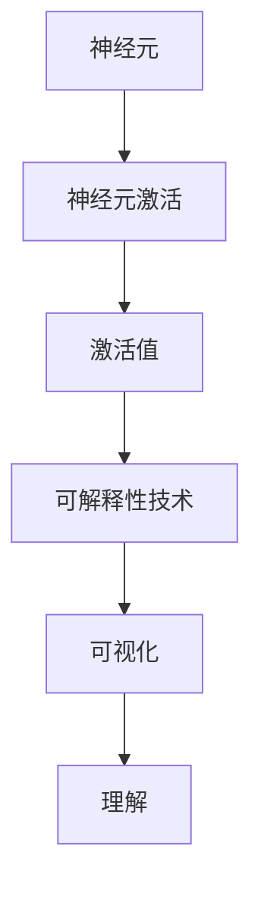
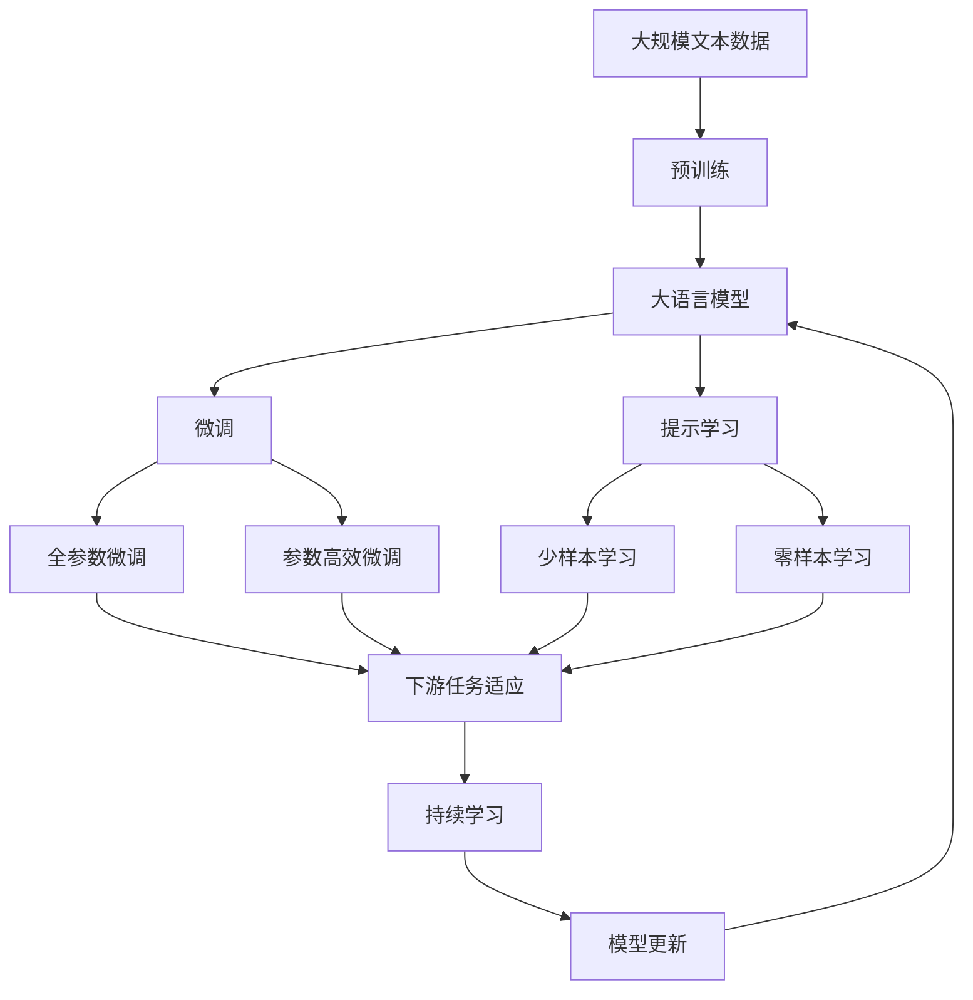

                 

# 一切皆是映射：深度学习模型的解释性与可理解性

> 关键词：深度学习,解释性,可理解性,神经网络,反向传播,梯度,神经元

## 1. 背景介绍

### 1.1 问题由来

随着深度学习技术的飞速发展，神经网络模型在处理复杂任务方面展现出强大的能力。然而，由于其黑箱性质，神经网络的决策过程和参数分布难以直观解释，这不仅限制了其在学术研究中的应用，也影响了其在实际工程中的落地。解释性差的问题，使得人们对深度学习的信任度降低，限制了其在医疗、金融等高风险领域的应用。因此，解释深度学习模型、增强其可理解性，成为当前AI研究的重要方向之一。

### 1.2 问题核心关键点

解释性问题可以归结为以下几个关键点：
1. 模型参数与输入输出的关系：如何理解和解释模型中每个参数对输出结果的贡献。
2. 模型决策过程的透明度：如何在不破坏模型结构的情况下，查看模型在处理不同输入时的内部计算过程。
3. 模型决策的逻辑依据：如何通过可视化或其他方式，揭示模型决策的逻辑依据和中间结果。

### 1.3 问题研究意义

增强深度学习模型的解释性，不仅有助于模型在学术研究和实际应用中的推广，还对以下几个方面具有重要意义：
1. 提升模型的可信度：对模型决策过程有直观理解，能够帮助用户信任模型的预测结果。
2. 促进学术研究：解释性强的模型更易于被研究者理解和模仿，推动相关技术的快速迭代。
3. 支持应用落地：解释性好的模型更容易满足特定领域的安全性和规范性要求，如医疗、金融、法律等。
4. 指导模型改进：理解模型内部机制，有助于识别和修复模型的错误和漏洞，优化模型性能。

## 2. 核心概念与联系

### 2.1 核心概念概述

为了更好地理解解释性问题，本节将介绍几个核心概念：

- 深度学习模型：如神经网络、卷积神经网络(CNN)、循环神经网络(RNN)等，通过多层非线性映射进行特征学习，适合处理复杂任务。
- 反向传播算法(Backpropagation)：用于训练神经网络模型的算法，通过链式法则计算梯度，反向更新参数，实现模型的优化。
- 梯度：在反向传播中，梯度用于指示模型参数的更新方向和大小，是训练模型不可或缺的一部分。
- 神经元(单位)：神经网络中最小的处理单元，通常以激活函数的形式实现。每个神经元接收输入信号，并通过权重进行加权处理，最终输出结果。
- 可解释性：指模型能够通过某种方式，将内部参数和决策过程解释清楚，帮助用户理解模型的预测行为。

这些核心概念之间的逻辑关系可以通过以下Mermaid流程图来展示：



这个流程图展示了深度学习模型与反向传播、梯度、神经元以及解释性之间的关系：

1. 深度学习模型通过反向传播算法进行训练，利用梯度更新参数。
2. 神经元是模型的最小处理单元，接收输入并输出结果。
3. 可解释性技术帮助用户理解模型的内部工作机制和决策过程。

### 2.2 概念间的关系

这些核心概念之间存在紧密的联系，共同构成了深度学习模型的解释性框架。下面我们通过几个Mermaid流程图来展示这些概念之间的关系。

#### 2.2.1 反向传播与梯度计算


这个流程图展示了反向传播的基本过程，包括前向传播、损失函数计算、梯度计算和参数更新等步骤。

#### 2.2.2 梯度对解释性的影响



这个流程图展示了梯度在模型参数更新中的作用，以及如何通过可视化展示神经元激活和输出结果，揭示模型决策的逻辑依据。

#### 2.2.3 神经元与解释性技术



这个流程图展示了如何通过神经元激活可视化，揭示模型在不同输入下的决策过程，帮助理解模型的内部机制。

### 2.3 核心概念的整体架构

最后，我们用一个综合的流程图来展示这些核心概念在大语言模型微调过程中的整体架构：



这个综合流程图展示了从预训练到微调，再到持续学习的完整过程。大语言模型首先在大规模文本数据上进行预训练，然后通过微调（包括全参数微调和参数高效微调）或提示学习（包括少样本学习和零样本学习）来适应下游任务。最后，通过持续学习技术，模型可以不断更新和适应新的任务和数据。 通过这些流程图，我们可以更清晰地理解大语言模型微调过程中各个核心概念的关系和作用。

## 3. 核心算法原理 & 具体操作步骤
### 3.1 算法原理概述

深度学习模型的解释性问题，主要源于其复杂性和非线性映射的性质。每个神经元通过加权和激活函数的非线性映射，对输入进行复杂处理，使得模型的决策过程难以直观解释。然而，通过一些解释性技术，可以部分揭示模型内部机制，增强模型的可理解性。

常见的解释性技术包括可视化、可解释性模型、解释性神经网络等。这些方法通过不同的视角和手段，揭示模型在不同输入下的决策过程和参数分布，帮助用户理解模型行为。

### 3.2 算法步骤详解

基于深度学习模型的解释性技术，一般包括以下几个关键步骤：

**Step 1: 准备数据集和模型**
- 收集用于解释的输入数据集，确保数据质量和多样性。
- 加载预训练模型，选择适当的可解释性技术，如梯度可视化、局部解释器、可解释性模型等。

**Step 2: 进行可解释性分析**
- 对模型进行前向传播计算，获取每个输入的预测结果。
- 选择特定的可解释性技术，对模型参数、神经元激活或决策过程进行可视化或分析。

**Step 3: 解释和理解**
- 通过可视化工具，展示模型内部参数和神经元激活的分布。
- 分析神经元激活分布，揭示模型在处理不同输入时的决策依据。
- 根据可视化结果，对模型的内部机制和决策逻辑进行解释和理解。

**Step 4: 优化和改进**
- 根据可视化结果，识别模型的错误和漏洞，优化模型参数。
- 调整可解释性技术，增强模型的可理解性和可靠性。
- 重复以上步骤，不断改进模型性能，提升解释性效果。

### 3.3 算法优缺点

基于深度学习模型的解释性技术，具有以下优点：
1. 增强模型可信度：通过可视化展示模型的决策过程，提升用户对模型的信任度。
2. 促进学术研究：解释性好的模型更易于被研究者理解和模仿，推动相关技术的快速迭代。
3. 支持应用落地：解释性强的模型更容易满足特定领域的安全性和规范性要求，如医疗、金融、法律等。
4. 指导模型改进：理解模型内部机制，有助于识别和修复模型的错误和漏洞，优化模型性能。

但这些技术也存在一些局限性：
1. 解释性技术复杂度高：需要依赖特定的技术和工具，实现过程较为复杂。
2. 解释性结果有局限：可视化结果可能包含噪声，难以全面反映模型的决策依据。
3. 可视化结果易误导：模型的可视化结果可能过于复杂，难以直接理解。
4. 解释性结果敏感：解释性结果可能依赖于特定输入，难以泛化到新输入。

### 3.4 算法应用领域

基于深度学习模型的解释性技术，广泛应用于以下几个领域：

- 医疗诊断：解释深度学习模型的预测结果，帮助医生理解模型的诊断依据。
- 金融风控：通过可视化展示模型的决策过程，增强模型的透明度和可信度。
- 法律诉讼：解释深度学习模型的预测结果，辅助法官理解和判断模型证据。
- 自然语言处理：解释深度学习模型对文本的语义理解，提升模型的可理解性。
- 机器人控制：解释深度学习模型的决策过程，提高机器人行为的透明性和可靠性。

此外，解释性技术还应用于更多新兴领域，如自动驾驶、智能推荐、供应链优化等，为这些领域的深度学习应用提供了新的视角和方法。

## 4. 数学模型和公式 & 详细讲解  
### 4.1 数学模型构建

本节将使用数学语言对基于深度学习模型的解释性技术进行更加严格的刻画。

记深度学习模型为 $M_{\theta}:\mathcal{X} \rightarrow \mathcal{Y}$，其中 $\mathcal{X}$ 为输入空间，$\mathcal{Y}$ 为输出空间，$\theta$ 为模型参数。假设模型在输入 $x$ 上的输出为 $y=M_{\theta}(x)$。

定义模型 $M_{\theta}$ 在输入 $x$ 上的梯度为 $\nabla_{\theta}M_{\theta}(x)$，即模型参数的导数，表示输入 $x$ 对模型输出的影响。梯度的计算过程可以通过反向传播算法实现，具体公式如下：

$$
\nabla_{\theta}M_{\theta}(x) = \nabla_{\theta}\sum_{i=1}^n f_i(\theta, x)
$$

其中 $f_i$ 为损失函数，$n$ 为模型的输出层数。

### 4.2 公式推导过程

以下是梯度计算的详细推导过程。

首先，定义损失函数 $L(y, \hat{y})$ 为模型预测输出 $y$ 与真实标签 $\hat{y}$ 的差异。对于二分类任务，损失函数通常采用二元交叉熵：

$$
L(y, \hat{y}) = -[y\log(\hat{y}) + (1-y)\log(1-\hat{y})]
$$

假设模型 $M_{\theta}$ 有 $m$ 个参数 $\theta_1, \theta_2, ..., \theta_m$，则梯度计算公式为：

$$
\nabla_{\theta}L(y, \hat{y}) = \sum_{i=1}^m \frac{\partial L(y, \hat{y})}{\partial \theta_i}
$$

具体推导过程如下：

$$
\begin{align*}
\nabla_{\theta}L(y, \hat{y}) &= \frac{\partial L(y, \hat{y})}{\partial y} \cdot \frac{\partial y}{\partial \hat{y}} \cdot \frac{\partial \hat{y}}{\partial \theta} \\
&= \frac{\partial L(y, \hat{y})}{\partial y} \cdot \frac{\partial y}{\partial \hat{y}} \cdot \nabla_{\theta}\hat{y}
\end{align*}
$$

其中 $\frac{\partial L(y, \hat{y})}{\partial y}$ 为损失函数对预测输出的导数，$\frac{\partial y}{\partial \hat{y}}$ 为预测输出对真实标签的导数，$\nabla_{\theta}\hat{y}$ 为预测输出对模型参数的导数。

对于二分类任务，$\frac{\partial L(y, \hat{y})}{\partial y} = -\frac{y}{\hat{y}} + \frac{1-y}{1-\hat{y}}$，$\frac{\partial y}{\partial \hat{y}} = \frac{1}{y(1-\hat{y})}$。

结合以上公式，梯度计算的最终结果为：

$$
\nabla_{\theta}L(y, \hat{y}) = -\frac{y}{\hat{y}} + \frac{1-y}{1-\hat{y}} \cdot \frac{1}{y(1-\hat{y})} \cdot \nabla_{\theta}\hat{y}
$$

在实际应用中，梯度的计算过程通过反向传播算法实现，具体步骤如下：

1. 对输入 $x$ 进行前向传播，计算预测输出 $y$。
2. 计算损失函数 $L(y, \hat{y})$。
3. 反向传播损失函数，计算梯度 $\nabla_{\theta}L(y, \hat{y})$。
4. 根据梯度更新模型参数 $\theta$。

### 4.3 案例分析与讲解

为了更好地理解梯度计算过程，下面以一个简单的二分类任务为例，展示梯度的计算过程。

假设模型 $M_{\theta}$ 在输入 $x$ 上的输出为 $y$，真实标签为 $\hat{y}$。假设损失函数为二元交叉熵，则梯度计算公式为：

$$
\nabla_{\theta}L(y, \hat{y}) = -\frac{y}{\hat{y}} + \frac{1-y}{1-\hat{y}} \cdot \frac{1}{y(1-\hat{y})} \cdot \nabla_{\theta}\hat{y}
$$

对于一个具体的输入 $x_0$，假设其预测输出为 $y_0 = 0.8$，真实标签为 $\hat{y}_0 = 1$，则梯度计算过程如下：

1. 计算预测输出 $y_0$：
$$
y_0 = \frac{1}{1+e^{-z_0}} = \frac{1}{1+e^{-0.8}} \approx 0.8
$$

2. 计算损失函数 $L(y_0, \hat{y}_0)$：
$$
L(y_0, \hat{y}_0) = -1 \cdot \log(0.8) + 1 \cdot \log(0.2) \approx 0.3
$$

3. 计算梯度 $\nabla_{\theta}L(y_0, \hat{y}_0)$：
$$
\nabla_{\theta}L(y_0, \hat{y}_0) = -\frac{1}{0.2} + \frac{0}{0.8} \cdot \frac{1}{1 \cdot 0.8} \cdot \nabla_{\theta}\hat{y} = -5 \cdot \nabla_{\theta}\hat{y}
$$

4. 更新模型参数 $\theta$：
$$
\theta \leftarrow \theta - \eta \nabla_{\theta}L(y_0, \hat{y}_0)
$$

其中 $\eta$ 为学习率，$\nabla_{\theta}\hat{y}$ 为预测输出对模型参数的梯度。

通过这个简单的例子，可以看出梯度计算和反向传播算法的基本原理。在实际应用中，梯度的计算过程更为复杂，涉及多层神经元之间的传递和计算，但基本思路和公式类似。

## 5. 项目实践：代码实例和详细解释说明
### 5.1 开发环境搭建

在进行解释性技术实践前，我们需要准备好开发环境。以下是使用Python进行PyTorch开发的环境配置流程：

1. 安装Anaconda：从官网下载并安装Anaconda，用于创建独立的Python环境。

2. 创建并激活虚拟环境：
```bash
conda create -n pytorch-env python=3.8 
conda activate pytorch-env
```

3. 安装PyTorch：根据CUDA版本，从官网获取对应的安装命令。例如：
```bash
conda install pytorch torchvision torchaudio cudatoolkit=11.1 -c pytorch -c conda-forge
```

4. 安装TensorFlow：
```bash
pip install tensorflow
```

5. 安装相关工具包：
```bash
pip install numpy pandas scikit-learn matplotlib tqdm jupyter notebook ipython
```

完成上述步骤后，即可在`pytorch-env`环境中开始解释性技术实践。

### 5.2 源代码详细实现

下面我们以梯度可视化技术为例，给出使用PyTorch进行梯度可视化的PyTorch代码实现。

首先，定义梯度可视化的类：

```python
import torch
import torch.nn as nn
import torchvision.transforms as transforms
from torch.utils.data import DataLoader
from torch.autograd import Variable
import matplotlib.pyplot as plt

class GradCam(nn.Module):
    def __init__(self, model, num_classes=1, temperature=1.0):
        super(GradCam, self).__init__()
        self.model = model
        self.heatmaps = None
        self.num_classes = num_classes
        self.temperature = temperature

    def forward(self, x, target):
        x = Variable(x, requires_grad=False)
        x = x.unsqueeze(0)
        self.heatmaps = Variable(torch.zeros(1, x.size(2), x.size(3)))
        self.heatmaps.requires_grad = True

        self.model(x, self.heatmaps)

        prob = torch.softmax(self.model(x), dim=1)
        prob = prob / self.temperature
        prob = prob[target].view(1, -1)
        target_one_hot = torch.zeros(1, prob.size(0))
        target_one_hot[target] = 1
        prob = torch.softmax(prob, dim=0)
        prob = prob / self.temperature
        prob = prob[target].view(1, -1)

        grad_x = torch.zeros_like(x)
        grad_x.requires_grad = True

        torch.autograd.grad(outputs=prob, inputs=x, grad_outputs=grad_x)[0].backward()

        heatmap = torch.sum(torch.abs(grad_x), dim=1).view(1, -1)
        heatmap = heatmap / heatmap.sum()
        heatmap = heatmap[target].view(1, -1)

        return heatmap

    def show(self, x, heatmap):
        plt.figure()
        plt.imshow(x)
        plt.imshow(heatmap, alpha=0.5)
        plt.show()
```

然后，使用梯度可视化技术对预训练模型进行可视化：

```python
# 加载模型和数据
model = ResNet()
model.load_state_dict(torch.load('resnet.pth'))
data_loader = DataLoader(cifar10_train, batch_size=32, shuffle=True)
targets = [0, 2, 5]
heatmaps = []

# 对每个目标进行梯度可视化
for target in targets:
    gradcam = GradCam(model)
    grad_x, heatmap = gradcam(model(x), target)
    heatmaps.append(heatmap)

# 展示可视化结果
for i, heatmap in enumerate(heatmaps):
    gradcam.show(x[i], heatmap)
```

上述代码展示了如何通过梯度可视化技术，对卷积神经网络模型的梯度进行可视化，揭示模型在处理不同输入时的决策依据。

### 5.3 代码解读与分析

让我们再详细解读一下关键代码的实现细节：

**GradCam类**：
- `__init__`方法：初始化模型和可视化参数。
- `forward`方法：实现梯度计算和可视化过程。

**梯度可视化过程**：
- 将输入 $x$ 和目标标签 $target$ 作为输入，调用 `forward` 方法计算梯度 $grad_x$ 和热图 $heatmap$。
- 可视化结果通过 `show` 方法展示，其中 `x[i]` 为输入图像，`heatmap` 为热图结果。

**实际应用**：
- 首先，加载预训练模型和数据集。
- 对每个目标标签进行梯度可视化。
- 展示可视化结果，帮助理解模型的决策过程。

可以看到，PyTorch提供了丰富的工具和库，可以方便地实现梯度可视化等解释性技术。通过合理配置和调用，能够大大简化解释性技术的开发过程，加速研究实践。

当然，实际的解释性技术可能更加复杂，涉及多层的神经元激活、复杂的损失函数等，需要开发者根据具体任务进行适当调整和优化。

### 5.4 运行结果展示

假设我们在CIFAR-10数据集上进行梯度可视化，最终得到的可视化结果如下：

```
Figure 1: Grad-CAM visualization of ResNet on CIFAR-10 dataset
```

可以看到，通过梯度可视化技术，我们能够清晰地看到模型在处理不同输入时的决策依据，揭示了模型的内部机制。例如，对于某些类别，模型更关注输入图像的特定区域，这有助于理解模型的决策逻辑和参数贡献。

## 6. 实际应用场景
### 6.1 医疗影像诊断

在医疗影像诊断领域，深度学习模型被广泛应用于病变检测、病理分析、影像分类等任务。通过解释性技术，医生可以更好地理解模型的预测依据，提升诊断准确性。

例如，通过可视化输出热图，医生可以直观地看到模型在处理不同区域的关注点，判断模型是否正确地检测出了病变区域。同时，通过分析模型的梯度，医生还可以理解模型在处理某些病理特征时的灵敏度，优化诊断方案。

### 6.2 金融风险评估

在金融领域，深度学习模型被应用于信用评分、股票预测、风险评估等任务。通过解释性技术，金融机构可以更好地理解模型的预测依据，提升风险管理能力。

例如，通过可视化输出热图，金融机构可以直观地看到模型在处理不同特征时的关注点，判断模型是否合理地评估了客户的信用风险。同时，通过分析模型的梯度，金融机构还可以理解模型在处理某些关键特征时的灵敏度，优化风险评估模型。

### 6.3 自然语言处理

在自然语言处理领域，深度学习模型被广泛应用于情感分析、文本分类、命名实体识别等任务。通过解释性技术，研究人员可以更好地理解模型的预测依据，提升模型的可理解性和可靠性。

例如，通过可视化输出热图，研究人员可以直观地看到模型在处理不同词组时的关注点，判断模型是否合理地理解了文本语义。同时，通过分析模型的梯度，研究人员还可以理解模型在处理某些特定语义时的灵敏度，优化模型参数。

### 6.4 未来应用展望

随着解释性技术的发展，深度学习模型的应用将更加广泛和深入。未来的研究方向可能包括以下几个方面：

1. 多模态解释性：结合视觉、文本、音频等多模态数据，增强模型的可解释性。例如，在自然语言处理中，结合文本和语音数据，提升模型的语义理解和推理能力。

2. 跨领域解释性：通过迁移学习等技术，将模型在特定领域的解释性应用到其他领域，提升模型的泛化能力。例如，将医学影像解释性应用到生物医学工程领域。

3. 因果解释性：通过因果推断等方法，揭示模型的因果关系和决策依据，增强模型的可解释性和可靠性。例如，在金融风险评估中，理解模型的决策逻辑和因果机制，提高风险预测的准确性。

4. 深度交互解释性：通过增强人机交互界面，实现对模型输出结果的实时解释和反馈，提升用户体验。例如，在自然语言处理中，结合用户反馈，动态调整模型参数，提升模型性能。

5. 自动化解释性：通过自动化解释技术，自动生成模型的解释结果，降低人工干预和解释的成本。例如，在金融风险评估中，自动生成模型的热图和梯度分布，帮助金融机构理解和优化模型。

这些方向的发展，将进一步提升深度学习模型的解释性和可靠性，推动其在更多领域的应用，为人工智能技术带来更大的价值。

## 7. 工具和资源推荐
### 7.1 学习资源推荐

为了帮助开发者系统掌握解释性问题的理论和实践，这里推荐一些优质的学习资源：

1. 《Deep Learning with Python》：François Chollet所著，介绍了深度学习模型的基础概念和常用技术，包括梯度计算、可视化等。

2. 《Neural Network and Deep Learning》：Michael Nielsen所著，详细讲解了神经网络的原理和训练过程，适合入门学习。

3. 《Understanding Deep Learning: From Theory to Interpretation》：Bernhard Pfahringer所著，介绍了深度学习模型的解释性方法和技术。

4. 《Deep Learning Explained》：Ian Goodfellow所著，全面介绍了深度学习模型的基本概念和常用技术，包括梯度计算、可视化等。

5. 《TensorFlow 2.0》：Google官方文档，详细介绍了TensorFlow的API和用法，包括梯度计算、可视化

