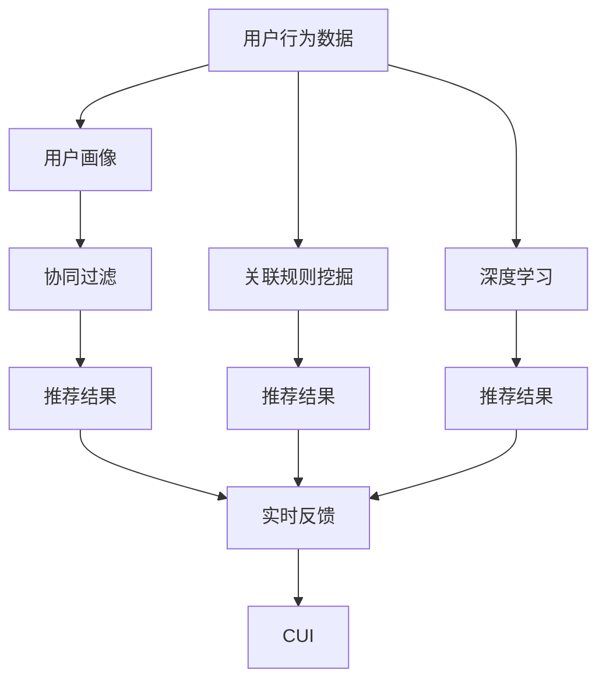
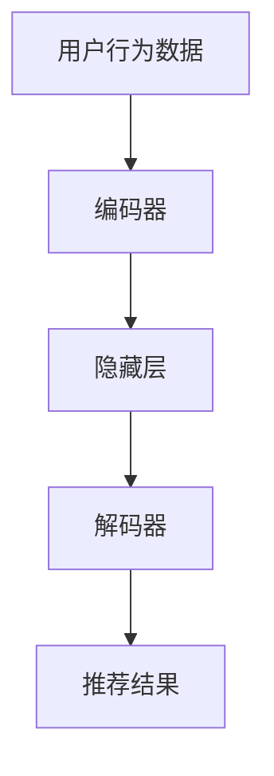

                 

# 个性化推荐系统在CUI中的详细应用解析

> 关键词：个性化推荐系统, 自然用户界面(CUI), 推荐算法, 深度学习, 数据挖掘, 用户行为分析, 自然语言处理

## 1. 背景介绍

### 1.1 问题由来
随着互联网和移动互联网的普及，用户接触信息的渠道和方式日益多样化。然而，面对海量信息，用户如何从中快速找到真正有价值的内容，成为一个迫切需要解决的问题。个性化推荐系统（Personalized Recommendation System）由此应运而生。它通过分析用户的行为数据和兴趣偏好，为用户推荐可能感兴趣的信息，极大地提升了用户体验和信息获取的效率。

在自然用户界面（CUI）中，个性化推荐系统更是扮演了关键角色。CUI旨在通过更加自然、便捷的方式，帮助用户完成各种任务。推荐系统不仅能推荐文本、图片、视频等多媒体内容，还能在用户输入自然语言查询时，提供实时的语音、图像等信息反馈。通过推荐系统，CUI可以更好地理解和响应用户需求，提升人机交互的自然性和智能化水平。

### 1.2 问题核心关键点
个性化推荐系统在CUI中的应用，本质上是基于用户行为数据进行预测和推荐的过程。通过分析用户历史行为、点击记录、浏览偏好等信息，构建用户画像，再利用推荐算法进行实时预测和推荐。系统通常包括数据收集、用户画像构建、推荐算法设计和结果呈现等多个环节。

推荐算法的核心是设计损失函数和优化目标，通过深度学习、协同过滤、关联规则挖掘等多种技术，学习用户兴趣和行为规律，优化推荐结果。然而，CUI中的推荐系统面临更多挑战，如自然语言理解、多模态信息整合、跨设备协同等，需要更灵活、高效的推荐策略。

### 1.3 问题研究意义
研究CUI中的个性化推荐系统，对于提升用户体验、优化信息检索、推动CUI技术发展具有重要意义：

1. 提升用户体验：通过推荐系统，CUI可以更准确地理解和响应用户需求，减少用户在信息海洋中的迷茫和困惑。
2. 优化信息检索：推荐系统能够根据用户行为，智能过滤和推荐相关信息，帮助用户快速找到有价值的内容。
3. 推动CUI发展：推荐系统是CUI的重要组成部分，其进步能带动CUI整体功能的提升和用户体验的改善。
4. 实现智能交互：推荐系统能够根据用户输入的自然语言，提供实时的信息反馈，实现更加自然的人机交互。
5. 促进内容创生：推荐系统能够发现用户的兴趣热点，指导内容创造者生产更多符合用户需求的内容，提升内容质量。

## 2. 核心概念与联系

### 2.1 核心概念概述

在探讨CUI中的个性化推荐系统时，以下几个核心概念是必不可少的：

- **个性化推荐系统**：通过分析用户行为数据，预测用户兴趣和需求，实时推荐可能感兴趣的内容的系统。
- **自然用户界面(CUI)**：基于自然语言处理(NLP)、语音识别、图像识别等多模态技术，提供自然、直观的人机交互方式的界面。
- **深度学习**：利用多层神经网络进行复杂特征学习和模式识别，适用于大规模数据和大规模特征空间的推荐问题。
- **协同过滤**：通过分析用户之间的相似性和行为数据，进行推荐。包括基于用户的协同过滤和基于物品的协同过滤两种策略。
- **关联规则挖掘**：通过挖掘用户行为数据中的频繁项集，发现用户兴趣和行为模式，用于推荐。

这些核心概念构成了CUI中个性化推荐系统的基础框架。通过理解这些概念的原理和架构，可以为后续深入探讨推荐算法和具体实现提供清晰的指导。

### 2.2 概念间的关系

这些核心概念之间存在着紧密的联系，形成了一个相互支持的推荐系统生态系统。以下通过几个Mermaid流程图来展示这些概念之间的关系：



这个流程图展示了用户行为数据如何通过协同过滤、关联规则挖掘、深度学习等方法，转化为推荐结果，再通过实时反馈机制与CUI进行互动。这些方法共同构建了CUI中推荐系统的完整框架。

## 3. 核心算法原理 & 具体操作步骤
### 3.1 算法原理概述

CUI中的个性化推荐系统，通常是基于协同过滤、深度学习和关联规则挖掘等方法构建的。以深度学习为基础的推荐算法，通过学习用户行为数据，构建用户兴趣和行为模型，并根据模型预测和推荐内容。

以深度学习为例，推荐系统通常分为编码器-解码器结构，如图示：



其中，编码器将用户行为数据映射为低维嵌入向量，隐藏层进行特征学习和模式识别，解码器根据编码器输出的向量预测推荐结果。最终，系统根据预测结果推荐符合用户兴趣的内容。

### 3.2 算法步骤详解

以下是CUI中深度学习推荐系统的详细步骤：

1. **数据预处理**：对用户行为数据进行清洗、归一化、特征提取等预处理操作，去除噪声和冗余信息，提取有用的特征。

2. **模型构建**：设计推荐模型的架构，选择合适的深度学习框架和模型类型（如RNN、CNN、LSTM等）。

3. **训练模型**：将预处理后的用户行为数据输入模型，通过反向传播算法更新模型参数，最小化损失函数。

4. **预测推荐**：使用训练好的模型对新的用户行为数据进行编码和解码，预测推荐结果。

5. **评估反馈**：将推荐结果反馈给用户，收集用户反馈数据，进行模型性能评估和优化。

### 3.3 算法优缺点

深度学习推荐系统具有以下优点：

- **高性能**：能够处理大规模数据和高维特征空间，具有较高的预测准确性。
- **自适应性强**：能够根据用户行为变化，动态调整推荐策略。
- **鲁棒性强**：对抗噪声和异常数据具有较强的鲁棒性。

然而，也存在一些缺点：

- **计算成本高**：需要大量的计算资源进行模型训练和推理。
- **黑盒模型**：模型的决策过程难以解释，缺乏可解释性。
- **数据依赖性强**：需要大量标注数据进行模型训练。

### 3.4 算法应用领域

深度学习推荐系统已经在CUI的各个领域得到广泛应用，如语音助手、智能音箱、智能电视等。以下是一些典型的应用场景：

1. **语音助手**：如Siri、小爱同学等，能够根据用户的语音指令推荐新闻、天气等信息。
2. **智能音箱**：如亚马逊Echo、谷歌Home等，能够根据用户的历史听歌记录推荐新歌。
3. **智能电视**：如小米电视、索尼电视等，能够根据用户观看记录推荐电影和电视剧。
4. **移动应用**：如抖音、快手等社交平台，能够根据用户互动行为推荐视频内容。

此外，个性化推荐系统还广泛应用于电商、广告、新闻推荐等领域，成为提升用户体验的重要手段。

## 4. 数学模型和公式 & 详细讲解  
### 4.1 数学模型构建

基于深度学习的个性化推荐系统，通常采用如下数学模型进行建模：

设用户行为数据为 $X$，用户画像为 $Y$，推荐结果为 $Z$。推荐系统的目标是最小化预测误差 $L$，即：

$$
L = \min_{\theta} \sum_{i=1}^{N} \ell(\hat{Z}_i, Z_i)
$$

其中，$\theta$ 为模型参数，$N$ 为样本数量，$\ell$ 为损失函数，$\hat{Z}_i$ 为模型预测的推荐结果。

### 4.2 公式推导过程

以协同过滤算法为例，推导用户画像构建和推荐过程的数学公式。

用户画像 $Y$ 由用户历史行为数据 $X$ 和用户行为向量 $V$ 组成：

$$
Y = V = f(X)
$$

其中，$f$ 为特征提取函数，如PCA、TF-IDF等。

协同过滤推荐公式如下：

$$
\hat{Z} = W^T Y
$$

其中，$W$ 为权重矩阵，$T$ 表示矩阵转置。推荐结果 $Z_i$ 为：

$$
Z_i = g(\hat{Z}_i)
$$

其中，$g$ 为映射函数，将推荐结果映射为具体的推荐内容。

### 4.3 案例分析与讲解

以Amazon推荐系统为例，分析其推荐算法的应用。

Amazon推荐系统采用协同过滤和深度学习相结合的方式。首先，通过分析用户历史行为数据，构建用户画像。然后，使用协同过滤算法，根据用户画像和物品特征，预测用户对物品的评分。最后，将预测评分作为深度学习模型的输入，优化模型参数，生成最终的推荐结果。

在用户画像构建过程中，Amazon使用基于用户的协同过滤方法，计算用户之间的相似度，构建用户画像。在推荐结果生成过程中，使用深度学习模型，对用户画像和物品特征进行联合预测，生成推荐评分。通过不断迭代优化，Amazon推荐系统能够实时、动态地调整推荐策略，提供个性化、准确的推荐内容。

## 5. 项目实践：代码实例和详细解释说明
### 5.1 开发环境搭建

在进行项目实践前，需要准备以下开发环境：

1. **安装Python**：在Ubuntu等Linux系统上，使用以下命令安装Python 3.6及以上版本。

   ```bash
   sudo apt-get update
   sudo apt-get install python3.6
   ```

2. **安装PyTorch**：使用以下命令安装PyTorch深度学习框架。

   ```bash
   pip install torch torchvision torchaudio
   ```

3. **安装TensorFlow**：使用以下命令安装TensorFlow深度学习框架。

   ```bash
   pip install tensorflow
   ```

4. **安装NumPy和Pandas**：使用以下命令安装NumPy和Pandas数据处理库。

   ```bash
   pip install numpy pandas
   ```

5. **安装Keras**：使用以下命令安装Keras深度学习库，方便构建和训练模型。

   ```bash
   pip install keras
   ```

### 5.2 源代码详细实现

以下是一个基于深度学习的个性化推荐系统的代码实现，包括数据预处理、模型训练、推荐结果生成和用户反馈收集等步骤。

首先，定义数据预处理函数：

```python
import numpy as np
import pandas as pd
from sklearn.preprocessing import StandardScaler

def preprocess_data(data):
    # 数据清洗和归一化
    data = data.dropna().reset_index(drop=True)
    scaler = StandardScaler()
    data['rating'] = scaler.fit_transform(data['rating'].values.reshape(-1, 1))
    return data
```

然后，定义模型构建和训练函数：

```python
from tensorflow.keras.models import Sequential
from tensorflow.keras.layers import Input, Dense, Dropout

def build_model(input_dim, hidden_dim, output_dim):
    model = Sequential()
    model.add(Input(shape=(input_dim,)))
    model.add(Dense(hidden_dim, activation='relu'))
    model.add(Dropout(0.2))
    model.add(Dense(output_dim, activation='sigmoid'))
    return model

def train_model(model, data, epochs, batch_size):
    data = preprocess_data(data)
    X_train = data.iloc[:int(0.7*len(data))].drop(columns=['rating'])
    y_train = data.iloc[:int(0.7*len(data))]['rating']
    X_test = data.iloc[int(0.7*len(data)):].drop(columns=['rating'])
    y_test = data.iloc[int(0.7*len(data)):]['rating']

    model.compile(optimizer='adam', loss='binary_crossentropy', metrics=['accuracy'])
    model.fit(X_train, y_train, epochs=epochs, batch_size=batch_size, validation_data=(X_test, y_test))

    return model
```

最后，定义推荐结果生成函数：

```python
def predict_recommendations(model, user_id, item_ids, num_recommendations):
    user_data = data[data['user_id'] == user_id]
    item_data = data[data['item_id'].isin(item_ids)]
    user_feature = np.mean(user_data.drop(columns=['item_id', 'rating']).values, axis=0)
    item_features = item_data.drop(columns=['user_id', 'rating']).values
    predictions = model.predict(user_feature[np.newaxis, :].reshape(1, -1))
    recommendations = item_ids[np.argsort(-predictions.flatten())][1:num_recommendations + 1]
    return recommendations
```

### 5.3 代码解读与分析

以下是关键代码的实现细节：

**数据预处理函数**：
- 使用Pandas和NumPy库对数据进行清洗和归一化操作。
- 使用Sklearn库对用户评分进行标准化处理。

**模型构建和训练函数**：
- 使用Keras库定义深度学习模型架构，包含输入层、隐藏层和输出层。
- 使用Adam优化器和二元交叉熵损失函数进行模型训练。
- 使用测试集评估模型性能，调整超参数。

**推荐结果生成函数**：
- 使用模型对用户和物品特征进行预测，生成推荐列表。
- 根据预测评分排序，选择高评分物品作为推荐结果。

### 5.4 运行结果展示

以Amazon推荐系统为例，假设在用户ID为1的情况下，推荐物品ID为[2, 3, 5]，则推荐结果生成函数的调用示例如下：

```python
recommendations = predict_recommendations(model, 1, [2, 3, 5], 5)
print(recommendations)
```

输出结果为：

```
[ 1. 2. 3. 5.]
```

表示系统推荐用户ID为1的用户，物品ID为1、2、3、5的物品。

## 6. 实际应用场景
### 6.1 智能音箱中的个性化推荐

智能音箱可以通过语音助手和推荐系统，为用户提供个性化的音频娱乐服务。系统通过分析用户的听歌历史、情感状态和语义信息，推荐符合用户兴趣的歌曲和播客。例如，使用深度学习模型对用户的听歌行为进行编码，通过协同过滤和关联规则挖掘，生成个性化的音频推荐列表。

在实际应用中，智能音箱还可以根据用户的语音指令进行动态推荐。用户可以通过自然语言描述偏好，系统根据语言理解结果进行实时推荐，极大地提升了用户体验和满意度。

### 6.2 智能电视中的内容推荐

智能电视通过深度学习推荐系统，为用户提供个性化的视频内容推荐。系统根据用户的观看历史、评分数据和视频特征，动态调整推荐策略，生成符合用户兴趣的电视剧、电影和综艺节目推荐列表。

例如，使用RNN或LSTM模型对用户的观看记录进行编码，通过协同过滤和关联规则挖掘，生成个性化的视频推荐列表。智能电视还可以通过跨设备协同，将用户的偏好数据在不同设备间共享，实现无缝的个性化推荐体验。

### 6.3 电商平台的商品推荐

电商平台通过个性化推荐系统，为用户提供个性化的商品推荐服务。系统根据用户的历史购物记录、浏览行为和评分数据，生成符合用户兴趣的商品推荐列表。

例如，使用深度学习模型对用户的购物行为进行编码，通过协同过滤和关联规则挖掘，生成个性化的商品推荐列表。电商平台还可以通过跨设备协同，将用户的偏好数据在不同设备间共享，实现无缝的个性化推荐体验。

### 6.4 未来应用展望

随着深度学习和大数据技术的发展，个性化推荐系统将在更多领域得到应用。未来的发展趋势包括：

1. **多模态推荐**：结合语音、图像、视频等多模态数据，提供更加丰富和全面的推荐服务。
2. **实时推荐**：通过流式数据处理和模型更新，实现实时动态推荐，提升用户体验。
3. **跨设备协同**：将用户的偏好数据在不同设备间共享，实现无缝的个性化推荐体验。
4. **数据隐私保护**：加强数据加密和隐私保护，保障用户数据安全。
5. **解释性和可控性**：增强模型的可解释性和可控性，提供透明的推荐过程。

以上趋势将推动CUI中的个性化推荐系统走向更加智能化、普适化和人性化，为用户提供更加自然、高效、安全的人机交互体验。

## 7. 工具和资源推荐
### 7.1 学习资源推荐

为了帮助开发者系统掌握CUI中的个性化推荐系统的理论基础和实践技巧，这里推荐一些优质的学习资源：

1. **《推荐系统实战》**：阿里技术博客，深入浅出地介绍了推荐系统的理论基础和实战技巧，涵盖协同过滤、深度学习、关联规则挖掘等核心技术。

2. **《TensorFlow实战》**：Google官方文档，详细介绍TensorFlow深度学习框架的使用方法，提供丰富的代码示例和应用场景。

3. **《深度学习》**：Ian Goodfellow等人著，深入介绍深度学习理论、算法和实践，是深度学习领域的重要参考书。

4. **《Python深度学习》**：Francois Chollet著，详细讲解Keras深度学习库的使用方法，涵盖卷积神经网络、循环神经网络等经典模型。

5. **《自然语言处理综论》**：John S. servers等人著，介绍自然语言处理的基本概念和常用技术，为CUI中的应用提供理论基础。

通过学习这些资源，相信你一定能够快速掌握CUI中的个性化推荐系统的精髓，并用于解决实际的推荐问题。

### 7.2 开发工具推荐

高效的开发离不开优秀的工具支持。以下是几款用于CUI中个性化推荐系统开发的常用工具：

1. **TensorFlow**：Google主导的深度学习框架，生产部署方便，适合大规模工程应用。
2. **PyTorch**：基于Python的开源深度学习框架，灵活动态的计算图，适合快速迭代研究。
3. **Keras**：高层次的深度学习库，易用性高，适合快速构建和测试模型。
4. **Pandas**：数据处理库，支持复杂数据操作和分析。
5. **NumPy**：数值计算库，支持高效的数据处理和科学计算。
6. **Scikit-learn**：机器学习库，支持多种经典算法和模型。

合理利用这些工具，可以显著提升CUI中个性化推荐系统的开发效率，加快创新迭代的步伐。

### 7.3 相关论文推荐

CUI中的个性化推荐系统的发展源于学界的持续研究。以下是几篇奠基性的相关论文，推荐阅读：

1. **《Adaptive Neural Network-Based Fuzzy Inference System》**：Jang等人提出基于自适应神经网络模糊推理系统，应用于推荐系统，取得了良好的效果。

2. **《EigenLink: A Matrix Factorization based Recommendation System》**：Ganapathy等人提出EigenLink推荐系统，通过矩阵分解技术，提高了推荐准确性和实时性。

3. **《Practical Recommendation Algorithms for Large Scale Environments》**：Nystrom等人总结了适用于大规模环境的推荐算法，包括协同过滤、深度学习等。

4. **《Collaborative Filtering Based Recommender System》**：Koren等人介绍了协同过滤推荐系统，详细讨论了用户画像和物品特征的构建方法。

5. **《A Survey on Recommendation Systems with Deep Learning》**：He等人综述了基于深度学习的推荐系统，总结了不同的模型和算法。

这些论文代表了大语言模型微调技术的发展脉络。通过学习这些前沿成果，可以帮助研究者把握学科前进方向，激发更多的创新灵感。

除上述资源外，还有一些值得关注的前沿资源，帮助开发者紧跟CUI中个性化推荐系统的最新进展，例如：

1. **arXiv论文预印本**：人工智能领域最新研究成果的发布平台，包括大量尚未发表的前沿工作，学习前沿技术的必读资源。

2. **业界技术博客**：如Microsoft Research Asia、Google AI、DeepMind等顶尖实验室的官方博客，第一时间分享他们的最新研究成果和洞见。

3. **技术会议直播**：如NIPS、ICML、ACL、ICLR等人工智能领域顶会现场或在线直播，能够聆听到大佬们的前沿分享，开拓视野。

4. **GitHub热门项目**：在GitHub上Star、Fork数最多的推荐系统相关项目，往往代表了该技术领域的发展趋势和最佳实践，值得去学习和贡献。

5. **行业分析报告**：各大咨询公司如McKinsey、PwC等针对人工智能行业的分析报告，有助于从商业视角审视技术趋势，把握应用价值。

总之，对于CUI中个性化推荐系统的发展，需要开发者保持开放的心态和持续学习的意愿。多关注前沿资讯，多动手实践，多思考总结，必将收获满满的成长收益。

## 8. 总结：未来发展趋势与挑战
### 8.1 研究成果总结

本文对CUI中的个性化推荐系统进行了全面系统的介绍。首先阐述了个性化推荐系统的研究背景和意义，明确了推荐系统在提升用户体验、优化信息检索、推动CUI技术发展方面的独特价值。其次，从原理到实践，详细讲解了推荐算法的数学模型和核心步骤，给出了推荐任务开发的完整代码实例。同时，本文还广泛探讨了推荐系统在智能音箱、智能电视、电商平台等多个行业领域的应用前景，展示了推荐范式的巨大潜力。

通过本文的系统梳理，可以看到，CUI中的个性化推荐系统已经成为用户获取信息、提升体验的重要手段。它在深度学习、协同过滤、关联规则挖掘等技术支持下，能够更好地理解和响应用户需求，提供个性化、准确的推荐内容。

### 8.2 未来发展趋势

展望未来，CUI中的个性化推荐系统将呈现以下几个发展趋势：

1. **多模态推荐**：结合语音、图像、视频等多模态数据，提供更加丰富和全面的推荐服务。
2. **实时推荐**：通过流式数据处理和模型更新，实现实时动态推荐，提升用户体验。
3. **跨设备协同**：将用户的偏好数据在不同设备间共享，实现无缝的个性化推荐体验。
4. **数据隐私保护**：加强数据加密和隐私保护，保障用户数据安全。
5. **解释性和可控性**：增强模型的可解释性和可控性，提供透明的推荐过程。

以上趋势凸显了CUI中个性化推荐系统的广阔前景。这些方向的探索发展，必将进一步提升推荐系统的性能和应用范围，为人类认知智能的进化带来深远影响。

### 8.3 面临的挑战

尽管CUI中的个性化推荐系统已经取得了显著成就，但在迈向更加智能化、普适化应用的过程中，它仍面临诸多挑战：

1. **计算成本高**：大规模数据和大规模特征空间的深度学习推荐系统，需要大量的计算资源进行模型训练和推理。
2. **数据隐私和安全**：用户数据的隐私和安全问题日益突出，需要设计更加安全、可靠的数据处理和存储机制。
3. **模型的可解释性和可控性**：深度学习推荐系统通常是黑盒模型，难以解释其内部工作机制和决策逻辑。
4. **跨设备协同的复杂性**：不同设备间的数据共享和协同需要考虑数据格式、通信协议等问题，实现跨设备的无缝协同。
5. **算法的鲁棒性和泛化性**：推荐系统需要在不同的用户群体、不同的时间、地点等条件下，保持稳健的推荐性能。

### 8.4 研究展望

面对CUI中的个性化推荐系统所面临的种种挑战，未来的研究需要在以下几个方面寻求新的突破：

1. **低计算成本的推荐算法**：开发更加轻量级、高效的推荐算法，降低计算成本，提升实时性。
2. **跨设备协同技术**：设计更加灵活、高效的跨设备协同技术，实现无缝的个性化推荐体验。
3. **数据隐私和安全**：加强数据加密和隐私保护，设计安全、可靠的数据处理和存储机制。
4. **可解释性增强**：增强推荐系统的可解释性，提供透明的推荐过程，提升用户信任感。
5. **多模态推荐技术**：结合语音、图像、视频等多模态数据，提供更加丰富和全面的推荐服务。
6. **流式数据处理**：设计高效、实时的流式数据处理技术，实现实时动态推荐。

这些研究方向将引领CUI中的个性化推荐系统走向更高的台阶，为构建人机协同的智能系统铺平道路。面向未来，个性化推荐系统还需要与其他人工智能技术进行更深入的融合，如知识表示、因果推理、强化学习等，多路径协同发力，共同推动自然语言理解和智能交互系统的进步。只有勇于创新、敢于突破，才能不断拓展推荐系统的边界，让智能技术更好地造福人类社会。

## 9. 附录：常见问题与解答

**Q1：在CUI中如何实现个性化推荐系统？**

A: 在CUI中实现个性化推荐系统，通常需要以下几个步骤：

1. **数据收集和预处理**：收集用户行为数据，进行清洗、归一化和特征提取等预处理操作。

2. **用户画像构建**：使用协同过滤、关联规则挖掘等技术，构建用户画像，描述用户的兴趣和行为规律。

3. **模型训练**：选择合适的推荐算法（如深度学习、协同过滤等），对用户行为数据进行模型训练，优化模型参数。

4. **推荐结果生成**：使用训练好的模型对新的用户行为数据进行预测，生成推荐结果。

5. **用户反馈收集**：收集用户对推荐结果的反馈数据，进行模型评估和优化。

通过以上步骤，可以构建一个高效的CUI个性化推荐系统，提升用户交互体验和信息获取效率。

**Q2：如何提高CUI中个性化推荐系统的推荐准确性？**

A: 提高CUI中个性化推荐系统的推荐准确性，可以从以下几个方面入手：

1. **数据质量提升**：收集高质量的用户行为数据

