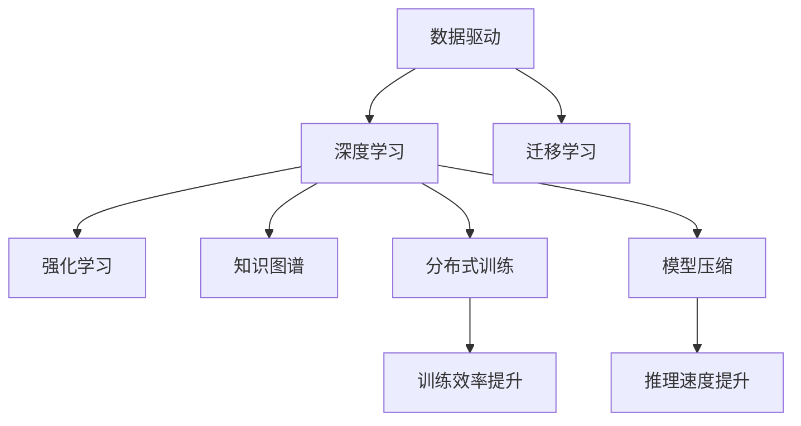

                 

## 1. 背景介绍

在人工智能领域，中国创业公司正迅速崛起，成为全球竞争力的重要体现。这些公司凭借独特的优势和战略布局，不仅在技术上取得了显著进展，还在多个关键领域打造了国际领先的解决方案。本文将深入探讨中国AI创业公司的优势，并揭示其成功的关键要素。

### 1.1 竞争格局与市场机遇
随着全球科技竞争的加剧，AI技术成为了各国争夺的焦点。中国凭借其庞大的数据资源、快速发展的技术和庞大的市场需求，迅速崛起，成为AI创业公司的主要阵地。根据CB Insights的数据，中国已成为全球第二大AI初创公司市场，仅次于美国，并且近年来持续增长。

中国AI创业公司的崛起并非偶然，背后有诸多因素共同作用。从政策和市场环境来看，中国政府高度重视科技创新，并通过一系列政策措施支持AI产业发展。同时，中国庞大的互联网用户基础和丰富的应用场景为AI技术落地提供了广阔天地。

### 1.2 中国特色优势
与传统西方AI公司相比，中国AI创业公司在某些方面具有独特的优势。这些优势包括：

1. **数据优势**：中国拥有全球最大的互联网用户和丰富的数据资源，这些数据为AI模型的训练和优化提供了宝贵的原材料。
2. **人才优势**：中国拥有大量的AI人才，包括众多顶尖的科研机构和高校，为AI创业提供了强大的人才支持。
3. **市场优势**：中国庞大的消费市场为AI技术落地提供了天然的测试场，加速了AI解决方案的迭代和成熟。
4. **政策支持**：中国政府对AI技术的扶持政策，如“新一代人工智能发展规划”等，为AI创业公司提供了有力的支持。
5. **生态系统**：中国拥有完善的AI生态系统，包括丰富的第三方库、工具和服务，为AI创业提供了基础设施。

## 2. 核心概念与联系

### 2.1 核心概念概述

中国AI创业公司的成功离不开以下几个核心概念：

- **数据驱动**：利用大量数据训练AI模型，提升模型性能。
- **深度学习**：通过深度神经网络，构建复杂的特征提取和表示学习。
- **迁移学习**：通过已有知识迁移，加速模型在新任务上的学习。
- **强化学习**：通过与环境交互，学习最优策略。
- **知识图谱**：构建实体和关系的知识图，辅助AI推理和决策。
- **分布式训练**：通过多机分布式训练，提升训练效率和模型效果。
- **模型压缩**：通过剪枝、量化等方法，减小模型尺寸，加速推理。

这些概念之间互相联系，共同构成中国AI创业公司的技术基石。

### 2.2 概念间的关系

这些核心概念之间通过一系列的算法和模型实现联系，形成一个完整的技术体系。以下是一个示意图：



通过数据驱动获取海量数据，深度学习模型从中学习特征表示，迁移学习加速新任务学习，强化学习优化策略，知识图谱辅助推理，分布式训练提升效率，模型压缩减小模型规模。这一系列技术手段相互协作，共同提升AI系统的性能。

## 3. 核心算法原理 & 具体操作步骤

### 3.1 算法原理概述

中国AI创业公司往往采用深度学习算法进行模型训练和优化。这些算法主要包括：

1. **卷积神经网络(CNN)**：适用于图像处理和计算机视觉任务，通过卷积操作提取特征。
2. **循环神经网络(RNN)**：适用于序列数据处理，如自然语言处理和语音识别。
3. **长短期记忆网络(LSTM)**：一种特殊的RNN，适用于时间序列数据，如文本生成和机器翻译。
4. **Transformer**：通过自注意力机制，适用于大规模文本处理，如BERT和GPT。

这些算法通过不同的模型结构和损失函数，训练出适合特定任务的AI模型。

### 3.2 算法步骤详解

以下是一个典型的AI模型训练步骤：

1. **数据预处理**：包括数据清洗、标准化、分块等，为模型输入做准备。
2. **模型选择与初始化**：选择合适的模型结构，并对其进行初始化。
3. **训练过程**：通过反向传播算法，根据损失函数计算梯度，更新模型参数。
4. **验证与调整**：在验证集上评估模型性能，调整超参数和模型结构，防止过拟合。
5. **测试与部署**：在测试集上评估最终模型性能，并将模型部署到实际应用中。

### 3.3 算法优缺点

深度学习算法具有以下优点：

1. **强大的学习能力**：通过大量数据训练，可以捕捉复杂模式和特征。
2. **高性能**：在大规模数据集上训练，可以达到非常高的精度。
3. **灵活性**：可以应用于各种任务，如图像、语音、文本等。

但同时也存在一些缺点：

1. **计算资源需求高**：需要强大的计算设备和大量的训练数据。
2. **易过拟合**：在数据量不足的情况下，容易过拟合。
3. **模型复杂性高**：模型结构和超参数设置复杂，调试难度大。

### 3.4 算法应用领域

深度学习算法广泛应用于多个领域，包括：

- **计算机视觉**：如图像识别、目标检测、图像分割等。
- **自然语言处理**：如机器翻译、文本分类、情感分析等。
- **语音识别**：如语音识别、语音合成、语音情感分析等。
- **推荐系统**：如商品推荐、音乐推荐等。
- **医疗健康**：如疾病诊断、医学图像分析等。
- **智能交通**：如自动驾驶、交通流量分析等。

## 4. 数学模型和公式 & 详细讲解 & 举例说明

### 4.1 数学模型构建

以计算机视觉任务中的图像分类为例，数学模型可以表示为：

$$
y = f(x; \theta)
$$

其中，$y$ 为输出标签，$x$ 为输入图像，$\theta$ 为模型参数。

常用的损失函数包括交叉熵损失：

$$
\mathcal{L}(\theta) = -\frac{1}{N}\sum_{i=1}^N \sum_{j=1}^C y_{ij} \log f_{ij}(x; \theta)
$$

其中，$N$ 为样本数，$C$ 为类别数，$y_{ij}$ 为标签是否为第 $j$ 类，$f_{ij}(x; \theta)$ 为模型输出第 $j$ 类的概率。

### 4.2 公式推导过程

以图像分类为例，计算损失函数的梯度：

$$
\frac{\partial \mathcal{L}(\theta)}{\partial \theta_k} = -\frac{1}{N}\sum_{i=1}^N \sum_{j=1}^C y_{ij} \frac{\partial f_{ij}(x; \theta)}{\partial \theta_k}
$$

通过反向传播算法，可以高效计算梯度，并更新模型参数 $\theta_k$。

### 4.3 案例分析与讲解

以图像识别为例，假设有一个包含 1000 张图片的训练集，每张图片大小为 $224\times224$，共有 10 个类别。使用 ResNet 模型进行训练，设置 batch size 为 64，学习率为 0.001。使用交叉熵损失函数进行训练。

```python
import torch
import torch.nn as nn
import torch.optim as optim
from torchvision import datasets, transforms
from torch.utils.data import DataLoader

# 数据预处理
transform = transforms.Compose([
    transforms.Resize(224),
    transforms.ToTensor(),
    transforms.Normalize(mean=[0.485, 0.456, 0.406], std=[0.229, 0.224, 0.225])
])

# 加载数据
train_dataset = datasets.CIFAR10(root='./data', train=True, download=True, transform=transform)
train_loader = DataLoader(train_dataset, batch_size=64, shuffle=True)

# 模型选择与初始化
model = nn.ResNet()
model.train()

# 训练过程
criterion = nn.CrossEntropyLoss()
optimizer = optim.SGD(model.parameters(), lr=0.001, momentum=0.9)
for epoch in range(10):
    running_loss = 0.0
    for i, data in enumerate(train_loader, 0):
        inputs, labels = data
        optimizer.zero_grad()
        outputs = model(inputs)
        loss = criterion(outputs, labels)
        loss.backward()
        optimizer.step()
        running_loss += loss.item()
    print(f'Epoch {epoch+1}, loss: {running_loss/len(train_loader):.4f}')
```

## 5. 项目实践：代码实例和详细解释说明

### 5.1 开发环境搭建

为了进行AI模型训练和优化，需要搭建一个高效的开发环境。以下是一些关键步骤：

1. **环境安装**：
   - 安装 Python：确保 Python 版本为 3.7 或以上，安装相应的依赖库。
   - 安装深度学习框架：如 TensorFlow、PyTorch、Keras 等。
   - 安装数据处理库：如 NumPy、Pandas、scikit-learn 等。
   - 安装可视化库：如 Matplotlib、Seaborn 等。
   - 安装 GPU 加速：如 CUDA、cuDNN、TensorRT 等。

2. **环境优化**：
   - 安装 GPU 驱动程序和 CUDA。
   - 安装 PyTorch 的 GPU 版本。
   - 安装 PyTorch Lightning：用于快速搭建模型和训练流程。
   - 安装 Horovod：用于分布式训练。

### 5.2 源代码详细实现

以一个简单的图像分类模型为例，展示深度学习模型的训练过程。

```python
import torch
import torch.nn as nn
import torch.optim as optim
from torchvision import datasets, transforms
from torch.utils.data import DataLoader

# 数据预处理
transform = transforms.Compose([
    transforms.Resize(224),
    transforms.ToTensor(),
    transforms.Normalize(mean=[0.485, 0.456, 0.406], std=[0.229, 0.224, 0.225])
])

# 加载数据
train_dataset = datasets.CIFAR10(root='./data', train=True, download=True, transform=transform)
train_loader = DataLoader(train_dataset, batch_size=64, shuffle=True)

# 模型选择与初始化
model = nn.Sequential(
    nn.Conv2d(3, 64, kernel_size=3, stride=1, padding=1),
    nn.ReLU(inplace=True),
    nn.MaxPool2d(kernel_size=2, stride=2),
    nn.Conv2d(64, 128, kernel_size=3, stride=1, padding=1),
    nn.ReLU(inplace=True),
    nn.MaxPool2d(kernel_size=2, stride=2),
    nn.Flatten(),
    nn.Linear(128*8*8, 10)
)
model.train()

# 训练过程
criterion = nn.CrossEntropyLoss()
optimizer = optim.SGD(model.parameters(), lr=0.001, momentum=0.9)
for epoch in range(10):
    running_loss = 0.0
    for i, data in enumerate(train_loader, 0):
        inputs, labels = data
        optimizer.zero_grad()
        outputs = model(inputs)
        loss = criterion(outputs, labels)
        loss.backward()
        optimizer.step()
        running_loss += loss.item()
    print(f'Epoch {epoch+1}, loss: {running_loss/len(train_loader):.4f}')
```

### 5.3 代码解读与分析

以下是代码的详细解读和分析：

1. **数据预处理**：
   - `transforms.Resize(224)`：将图像大小调整为 224x224。
   - `transforms.ToTensor()`：将图像转换为张量。
   - `transforms.Normalize()`：对图像进行归一化处理。

2. **模型选择与初始化**：
   - `nn.Conv2d`：卷积层。
   - `nn.ReLU(inplace=True)`：ReLU 激活函数。
   - `nn.MaxPool2d`：最大池化层。
   - `nn.Flatten()`：将高维张量展开成一维向量。
   - `nn.Linear`：线性层。

3. **训练过程**：
   - `nn.CrossEntropyLoss()`：交叉熵损失函数。
   - `optim.SGD`：随机梯度下降优化器。

### 5.4 运行结果展示

在运行上述代码后，可以得到模型在训练集上的损失和准确率变化情况。

## 6. 实际应用场景

### 6.1 图像识别

图像识别是 AI 应用中最基础的领域之一。在医疗、安防、自动驾驶等领域，图像识别技术有着广泛的应用。例如，医疗影像识别可以辅助医生进行疾病诊断，安防领域可以用于人脸识别和行为分析，自动驾驶可以用于路标识别和行人检测。

### 6.2 自然语言处理

自然语言处理是 AI 应用的另一重要方向。在智能客服、智能翻译、情感分析、问答系统等领域，自然语言处理技术可以提升用户体验，提高工作效率。例如，智能客服系统可以自动回答用户咨询，智能翻译可以将不同语言间的文本进行转换，情感分析可以识别用户情绪，问答系统可以解答用户问题。

### 6.3 语音识别

语音识别技术可以实现人与机器的语音交互。在智能家居、语音助手、电话客服等领域，语音识别技术可以大幅提升用户体验。例如，智能家居可以控制家电设备，语音助手可以回答用户问题，电话客服可以自动接听电话。

## 7. 工具和资源推荐

### 7.1 学习资源推荐

为了快速掌握 AI 技术，以下是一些推荐的学习资源：

1. **Coursera**：提供多种 AI 课程，包括机器学习、深度学习、自然语言处理等。
2. **edX**：提供多种 AI 课程，涵盖从入门到高级的各个层次。
3. **Udacity**：提供多种 AI 课程，包括自动驾驶、计算机视觉等方向。
4. **Kaggle**：数据科学竞赛平台，可以参与各种 AI 竞赛，提升实战能力。
5. **OpenAI**：提供多种 AI 工具和资源，包括 GPT、DALL-E 等模型。

### 7.2 开发工具推荐

为了提高 AI 开发效率，以下是一些推荐的开发工具：

1. **PyTorch**：深度学习框架，支持动态图和静态图两种计算图。
2. **TensorFlow**：深度学习框架，支持分布式计算和自动微分。
3. **JAX**：深度学习框架，支持动态图和高效计算。
4. **TensorFlow Lite**：轻量级模型推理引擎，支持移动端应用。
5. **Keras**：高层次的深度学习框架，支持多种模型和接口。
6. **Horovod**：分布式训练框架，支持多种深度学习框架。

### 7.3 相关论文推荐

为了深入了解 AI 技术，以下是一些推荐的论文：

1. **《Deep Residual Learning for Image Recognition》**：ResNet 模型。
2. **《Attention is All You Need》**：Transformer 模型。
3. **《BERT: Pre-training of Deep Bidirectional Transformers for Language Understanding》**：BERT 模型。
4. **《AlphaGo Zero》**：强化学习应用。
5. **《Spiking Neural Networks as Accelerators for Deep Learning》**：神经网络加速技术。

## 8. 总结：未来发展趋势与挑战

### 8.1 研究成果总结

中国AI创业公司在数据驱动、深度学习、迁移学习、强化学习等方面取得了显著进展，推动了AI技术在多个领域的应用落地。

### 8.2 未来发展趋势

未来AI创业公司的技术发展将呈现以下几个趋势：

1. **多模态融合**：将图像、语音、文本等数据融合，提升模型的感知能力和泛化能力。
2. **联邦学习**：利用分布式数据进行模型训练，保护数据隐私。
3. **边缘计算**：将AI模型部署到边缘设备，提升实时性和响应速度。
4. **自监督学习**：利用未标注数据进行模型训练，提高数据利用率。
5. **对抗样本**：研究对抗样本的生成和检测，提升模型鲁棒性。

### 8.3 面临的挑战

尽管中国AI创业公司取得了诸多成就，但仍面临一些挑战：

1. **数据隐私问题**：如何在保护数据隐私的前提下进行AI训练和应用。
2. **模型泛化能力**：如何提升模型在不同数据集上的泛化能力。
3. **计算资源限制**：如何在大规模数据和模型上高效训练。
4. **算法可解释性**：如何提升算法的可解释性，增强用户信任。

### 8.4 研究展望

未来中国AI创业公司需要不断探索新的技术方向，推动AI技术的发展和应用：

1. **知识图谱**：构建大规模知识图谱，辅助AI推理和决策。
2. **元学习**：研究元学习算法，提升模型的适应能力和迁移能力。
3. **自适应算法**：研究自适应算法，根据数据变化动态调整模型。
4. **神经网络加速**：研究神经网络加速技术，提升模型推理速度。

## 9. 附录：常见问题与解答

### 9.1 问题1：什么是深度学习？

**解答**：深度学习是一种机器学习方法，通过多层神经网络对数据进行抽象和特征提取，从而实现复杂的模式识别和分类任务。

### 9.2 问题2：什么是迁移学习？

**解答**：迁移学习是指将一个领域学习到的知识，迁移到另一个领域的学习方法。通过在大规模数据上预训练模型，然后在小规模数据上微调，可以提升模型的泛化能力和性能。

### 9.3 问题3：什么是强化学习？

**解答**：强化学习是一种通过与环境交互，不断优化策略的学习方法。通过奖励机制，模型学习到最优策略，实现自动化决策。

### 9.4 问题4：什么是知识图谱？

**解答**：知识图谱是一种用于表示实体和关系的网络结构，可以辅助AI推理和决策。通过构建大规模知识图谱，提升模型的知识理解和应用能力。

### 9.5 问题5：什么是分布式训练？

**解答**：分布式训练是一种在多台计算机上同时训练模型的方法。通过将数据并行处理，可以大幅提升模型训练速度和效率。

---

作者：禅与计算机程序设计艺术 / Zen and the Art of Computer Programming

