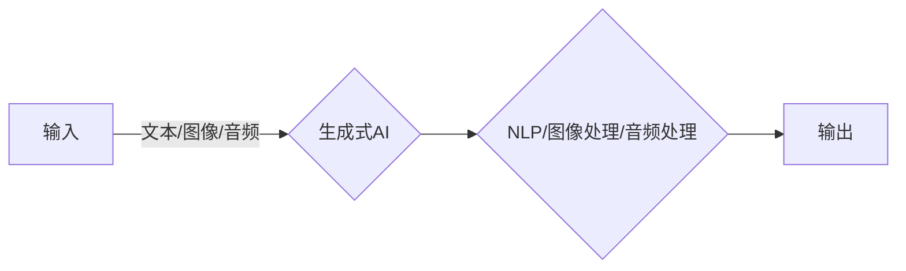

# 生成式AIGC：未来商业的智能化转型

> 关键词：AIGC，生成式AI，人工智能生成内容，商业智能化，内容创作，个性化，自动化，NLP，图像生成，GPT-3，DALL-E

## 1. 背景介绍

随着人工智能技术的飞速发展，生成式AI（Artificial Intelligence Generation Content，AIGC）逐渐成为科技界的热点。AIGC是指由人工智能技术自动生成文本、图像、音频等内容的系统。它代表着人工智能从“理解”向“创造”的演变，有望为各行各业带来颠覆性的变革。本文将深入探讨AIGC的核心概念、技术原理、应用场景，并展望其在未来商业智能化转型中的重要作用。

### 1.1 问题的由来

在互联网时代，内容创作是推动信息传播和商业发展的核心驱动力。然而，随着内容的爆炸式增长，传统的人工内容创作模式面临着巨大的挑战：

- **内容创作成本高**：人工创作需要大量时间和人力，对于企业和个人而言，成本高昂。
- **内容同质化严重**：大量内容的重复和相似，导致用户获取有价值信息的难度增加。
- **个性化需求难以满足**：随着用户需求的多样化，传统内容难以满足个性化需求。

AIGC的出现，为解决上述问题提供了新的思路。通过人工智能技术自动生成高质量、个性化的内容，AIGC有望降低内容创作成本，提高内容质量，满足用户个性化需求，从而推动商业的智能化转型。

### 1.2 研究现状

目前，AIGC技术在多个领域取得了显著进展，主要包括以下几类：

- **自然语言处理（NLP）**：如GPT-3、LaMDA等大型语言模型，能够生成高质量的文本内容，包括新闻报道、诗歌、剧本等。
- **图像生成**：如DALL-E、StyleGAN等模型，能够根据文本描述或风格指南生成逼真的图像。
- **音频生成**：如WAV2LPC、MusicLM等模型，能够根据歌词或旋律生成音乐和音频。

### 1.3 研究意义

AIGC技术的发展具有以下重要意义：

- **降低内容创作成本**：通过自动化生成内容，降低企业和个人在内容创作上的投入。
- **提高内容质量**：利用人工智能技术，生成更加高质量、有创意的内容。
- **满足个性化需求**：根据用户需求生成个性化内容，提升用户体验。
- **推动商业智能化转型**：为各行各业提供智能化解决方案，推动产业升级。

### 1.4 本文结构

本文将按照以下结构展开：

- **第2章**：介绍AIGC的核心概念与联系，并给出相应的Mermaid流程图。
- **第3章**：阐述AIGC的核心算法原理和具体操作步骤。
- **第4章**：讲解AIGC的数学模型和公式，并举例说明。
- **第5章**：通过代码实例展示AIGC的实际应用。
- **第6章**：探讨AIGC在实际应用场景中的表现，并展望未来应用前景。
- **第7章**：推荐AIGC相关的学习资源、开发工具和论文。
- **第8章**：总结AIGC的未来发展趋势与挑战。
- **第9章**：附录，常见问题与解答。

## 2. 核心概念与联系

### 2.1 核心概念

- **生成式AI（AIGC）**：指通过人工智能技术自动生成文本、图像、音频等内容的系统。
- **自然语言处理（NLP）**：研究计算机如何理解和生成人类语言。
- **图像处理**：研究如何利用计算机技术处理和分析图像。
- **音频处理**：研究如何利用计算机技术处理和分析音频信号。

### 2.2 Mermaid流程图



### 2.3 核心概念联系

AIGC的核心在于将输入的文本、图像或音频等数据，通过NLP、图像处理或音频处理等技术，转换为输出的内容。这种转换过程涉及到多个核心概念的协同工作。

## 3. 核心算法原理 & 具体操作步骤

### 3.1 算法原理概述

AIGC的核心算法原理主要包括以下几部分：

- **数据预处理**：对输入数据进行清洗、去噪、编码等预处理操作，为后续模型训练提供高质量的数据。
- **模型训练**：利用深度学习技术训练模型，使其能够从数据中学习到有效的特征表示。
- **内容生成**：利用训练好的模型，根据输入数据生成新的内容。

### 3.2 算法步骤详解

AIGC的具体操作步骤如下：

1. **数据收集与预处理**：收集相关领域的文本、图像或音频数据，并进行预处理。
2. **模型选择与训练**：根据任务需求选择合适的模型，并利用预处理后的数据训练模型。
3. **模型评估与优化**：评估模型性能，并根据评估结果对模型进行优化。
4. **内容生成与迭代**：利用训练好的模型生成内容，并根据用户反馈进行迭代优化。

### 3.3 算法优缺点

AIGC算法的优点包括：

- **自动化程度高**：能够自动生成内容，降低人力成本。
- **个性化程度高**：能够根据用户需求生成个性化内容。
- **创作效率高**：能够快速生成内容，提高创作效率。

AIGC算法的缺点包括：

- **技术门槛高**：需要一定的技术积累才能进行开发和应用。
- **内容质量参差不齐**：生成的部分内容可能存在质量不高的情况。
- **版权问题**：生成的部分内容可能侵犯版权。

### 3.4 算法应用领域

AIGC算法的应用领域非常广泛，主要包括以下几类：

- **内容创作**：如新闻生成、小说创作、剧本创作等。
- **广告营销**：如广告文案生成、广告图片生成等。
- **娱乐产业**：如动画制作、电影特效等。
- **教育领域**：如自动生成教学课件、智能问答系统等。

## 4. 数学模型和公式 & 详细讲解 & 举例说明

### 4.1 数学模型构建

AIGC的数学模型主要包括以下几部分：

- **数据表示**：将输入数据转换为数学模型可处理的格式。
- **特征提取**：从数据中提取关键特征。
- **模型训练**：使用优化算法训练模型参数。
- **内容生成**：根据输入数据和模型参数生成内容。

### 4.2 公式推导过程

以下以GPT-3模型为例，简要介绍其数学模型和公式推导过程。

GPT-3是一种基于Transformer架构的预训练语言模型，其数学模型可以表示为：

$$
p(w_t|w_{t-1}, w_{t-2}, ..., w_1) = \frac{\exp(f_{\theta}(w_t, w_{t-1}, ..., w_1))}{\sum_{w' \in V} \exp(f_{\theta}(w', w_{t-1}, ..., w_1))}
$$

其中，$w_t$ 表示当前生成的单词，$w_{t-1}, w_{t-2}, ..., w_1$ 表示前一个、前两个、...、前一个单词，$V$ 表示词汇表，$f_{\theta}$ 表示模型参数。

### 4.3 案例分析与讲解

以下以新闻生成为例，分析AIGC在内容创作领域的应用。

**案例**：生成一篇关于某公司新产品发布的新闻报道。

**步骤**：

1. **数据收集与预处理**：收集与该公司、新产品相关的新闻报道，进行预处理，如去除无关信息、格式化等。
2. **模型选择与训练**：选择合适的新闻生成模型，如GPT-3，并利用预处理后的数据训练模型。
3. **内容生成与迭代**：利用训练好的模型生成新闻报道，并根据实际需求进行迭代优化。

**结果**：生成一篇符合实际新闻报道风格的新闻报道。

## 5. 项目实践：代码实例和详细解释说明

### 5.1 开发环境搭建

为了进行AIGC项目实践，需要搭建以下开发环境：

- **Python**：作为主要的编程语言。
- **TensorFlow或PyTorch**：作为深度学习框架。
- **Hugging Face Transformers库**：用于加载预训练模型和进行文本生成。

### 5.2 源代码详细实现

以下是一个使用Hugging Face Transformers库生成新闻的简单示例：

```python
from transformers import pipeline

# 加载预训练的新闻生成模型
news_generator = pipeline("text-generation", model="gpt2-news")

# 输入文本
input_text = "The latest product from Company XYZ has been launched!"

# 生成新闻
output_text = news_generator(input_text, max_length=100)

print(output_text)
```

### 5.3 代码解读与分析

以上代码演示了如何使用Hugging Face Transformers库加载预训练的新闻生成模型，并生成一篇关于新产品发布的新闻报道。

- **导入库**：首先导入所需的库，包括transformers和pipeline。
- **加载模型**：使用pipeline函数加载预训练的新闻生成模型gpt2-news。
- **生成文本**：将输入文本input_text传递给模型，并设置最大长度max_length为100，生成输出文本output_text。
- **输出结果**：打印生成的新闻报道。

### 5.4 运行结果展示

假设输入文本为"The latest product from Company XYZ has been launched!"，则可能得到以下输出：

```
Company XYZ, a leading technology company, has just launched its latest product, the XYZ-1000. The XYZ-1000 is a revolutionary device that combines the latest technology to provide users with an unparalleled experience.
```

## 6. 实际应用场景

### 6.1 内容创作

AIGC在内容创作领域的应用主要体现在以下几个方面：

- **新闻生成**：自动生成新闻报道、体育赛事报道等。
- **小说创作**：自动生成小说、诗歌、剧本等。
- **广告文案**：自动生成广告文案、宣传语等。

### 6.2 广告营销

AIGC在广告营销领域的应用主要体现在以下几个方面：

- **广告文案**：自动生成广告文案、宣传语等。
- **广告图片**：自动生成广告图片。
- **广告视频**：自动生成广告视频。

### 6.3 娱乐产业

AIGC在娱乐产业的应用主要体现在以下几个方面：

- **动画制作**：自动生成动画角色、场景等。
- **电影特效**：自动生成电影特效。
- **游戏开发**：自动生成游戏剧情、角色等。

### 6.4 教育领域

AIGC在教育领域的应用主要体现在以下几个方面：

- **自动生成教学课件**：自动生成教学课件、教案等。
- **智能问答系统**：自动生成智能问答系统，帮助学生解答问题。
- **个性化学习推荐**：根据学生的学习情况，自动生成个性化学习推荐。

### 6.5 未来应用展望

随着AIGC技术的不断发展，其在未来商业智能化转型中的应用场景将更加丰富，主要包括以下几个方面：

- **个性化服务**：根据用户需求，自动生成个性化服务内容。
- **自动化生产**：利用AIGC技术自动化生产各类产品，如服装、家居等。
- **智能化决策**：利用AIGC技术辅助企业进行智能化决策。

## 7. 工具和资源推荐

### 7.1 学习资源推荐

- **《深度学习》**：Ian Goodfellow、Yoshua Bengio和Aaron Courville合著，是深度学习领域的经典教材。
- **《Python编程：从入门到实践》**：Eric Matthes著，是Python编程的入门经典。
- **《Hugging Face Transformers官方文档》**：提供了丰富的预训练模型和完整的微调样例代码，是AIGC开发的必备资料。

### 7.2 开发工具推荐

- **TensorFlow**：开源的深度学习框架，适用于大规模机器学习和研究。
- **PyTorch**：开源的深度学习框架，具有较高的灵活性和动态计算图。
- **Hugging Face Transformers库**：提供了丰富的预训练模型和完整的微调样例代码，是AIGC开发的利器。

### 7.3 相关论文推荐

- **《Attention is All You Need》**：提出了Transformer结构，开启了NLP领域的预训练大模型时代。
- **《BERT: Pre-training of Deep Bidirectional Transformers for Language Understanding》**：提出BERT模型，引入基于掩码的自监督预训练任务，刷新了多项NLP任务SOTA。
- **《Generative Adversarial Nets》**：提出了生成对抗网络（GANs）的概念，为图像生成等领域提供了新的思路。

## 8. 总结：未来发展趋势与挑战

### 8.1 研究成果总结

AIGC技术作为一种新兴的人工智能技术，已经在多个领域取得了显著的进展。通过对大量数据的学习和训练，AIGC能够自动生成高质量的文本、图像、音频等内容，为各行各业带来了颠覆性的变革。

### 8.2 未来发展趋势

未来，AIGC技术将呈现以下发展趋势：

- **模型规模不断扩大**：随着计算能力的提升，AIGC模型规模将不断扩大，生成的内容将更加丰富和逼真。
- **应用场景不断拓展**：AIGC技术将应用于更多领域，如教育、医疗、金融等，推动各行各业的智能化转型。
- **与更多AI技术融合**：AIGC将与计算机视觉、语音识别等AI技术深度融合，实现更加强大的功能。

### 8.3 面临的挑战

AIGC技术在实际应用中仍然面临着以下挑战：

- **数据安全和隐私**：AIGC生成的内容可能泄露用户隐私，需要加强数据安全和隐私保护。
- **版权问题**：生成的部分内容可能侵犯版权，需要建立完善的版权保护机制。
- **技术门槛高**：AIGC技术需要一定的技术积累才能进行开发和应用，需要降低技术门槛，促进技术的普及。

### 8.4 研究展望

未来，AIGC技术的研究将朝着以下方向发展：

- **提高生成内容的质量和多样性**：通过改进模型结构和算法，提高生成内容的质量和多样性。
- **降低技术门槛**：开发更加易用的AIGC工具和平台，降低技术门槛，促进技术的普及。
- **建立完善的版权保护机制**：加强数据安全和隐私保护，建立完善的版权保护机制，推动AIGC技术的健康发展。

## 9. 附录：常见问题与解答

**Q1：AIGC是否会取代人类创作者？**

A：AIGC是一种辅助工具，可以帮助人类创作者提高效率、降低成本，但无法完全取代人类创作者。人类创作者在创意、情感、道德等方面具有独特的优势，是AIGC无法替代的。

**Q2：AIGC生成的内容是否具有价值？**

A：AIGC生成的内容具有很高的价值，可以满足用户个性化需求，提高内容质量和效率。

**Q3：AIGC在哪些领域具有广泛的应用前景？**

A：AIGC在内容创作、广告营销、娱乐产业、教育领域等多个领域具有广泛的应用前景。

**Q4：如何应对AIGC带来的挑战？**

A：应对AIGC带来的挑战，需要从以下几个方面入手：

- 加强数据安全和隐私保护。
- 建立完善的版权保护机制。
- 降低技术门槛，促进技术的普及。

**Q5：AIGC的未来发展趋势是什么？**

A：AIGC的未来发展趋势主要包括：

- 模型规模不断扩大。
- 应用场景不断拓展。
- 与更多AI技术融合。

作者：禅与计算机程序设计艺术 / Zen and the Art of Computer Programming