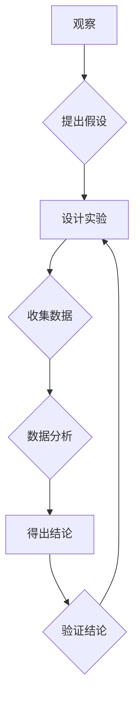

# 科学探究：从观察到结论

> 关键词：科学方法，观察，假设，实验，数据分析，结论，推理，批判性思维，科学研究

## 1. 背景介绍

科学探究是人类认识世界、理解自然规律的基本方法。从古希腊哲学家亚里士多德开始，科学方法就被用来指导人类对世界的探索。经过数千年的发展，科学方法已经成为现代科学技术进步的重要驱动力。本文将深入探讨科学探究的过程，从观察、假设到结论，以及其中涉及的原理、方法和工具。

## 2. 核心概念与联系

### 2.1 科学方法概述

科学方法是一种系统化的探究过程，它通过观察、假设、实验、数据分析和结论等步骤，帮助科学家们理解自然现象和揭示科学规律。

**Mermaid 流程图：**



### 2.2 核心概念原理

- **观察**：科学探究的起点是观察，通过感官或仪器对自然现象进行记录和描述。
- **假设**：基于观察和已有知识，提出可能的解释或预测。
- **实验**：设计实验来验证假设，通过控制变量和实验设计，确保实验结果的有效性。
- **数据分析**：对实验数据进行统计分析和解释，以评估假设的真实性。
- **结论**：根据实验结果和数据分析，得出关于自然现象的结论。
- **验证**：通过重复实验或进一步研究，验证结论的可靠性和普遍性。

## 3. 核心算法原理 & 具体操作步骤

### 3.1 算法原理概述

科学探究的过程可以抽象为一个算法，其核心是逻辑推理和统计分析。

### 3.2 算法步骤详解

1. **观察**：通过感官或仪器进行系统性的记录和描述，确保观察结果的准确性。
2. **提出假设**：基于观察结果和已有知识，提出可能的解释或预测。
3. **设计实验**：根据假设，设计实验来测试假设的有效性。实验设计应包括实验目的、实验方法、实验设备和实验步骤。
4. **收集数据**：在实验过程中，收集相关数据，确保数据的完整性和准确性。
5. **数据分析**：对收集到的数据进行分析，使用统计方法评估假设的真实性。
6. **得出结论**：根据数据分析结果，得出关于自然现象的结论。
7. **验证结论**：通过重复实验或进一步研究，验证结论的可靠性和普遍性。

### 3.3 算法优缺点

**优点**：
- 系统化：科学方法提供了一个系统化的探究过程，确保科学研究的严谨性。
- 可重复性：通过重复实验，可以验证结论的可靠性和普遍性。
- 可证伪性：科学方法强调假设的可证伪性，只有可证伪的假设才能被称为科学假设。

**缺点**：
- 实验设计难度大：设计有效的实验往往需要深厚的专业知识。
- 数据分析复杂：数据分析往往涉及复杂的统计方法，对研究者提出了较高的要求。

### 3.4 算法应用领域

科学方法广泛应用于各个领域，包括物理学、化学、生物学、医学、心理学、经济学等。

## 4. 数学模型和公式 & 详细讲解 & 举例说明

### 4.1 数学模型构建

科学探究过程中，数学模型是一种重要的工具，它可以帮助我们更精确地描述自然现象。

### 4.2 公式推导过程

以牛顿第二定律为例，其公式为：

$$
F = ma
$$

其中，$F$ 是力，$m$ 是质量，$a$ 是加速度。这个公式的推导过程基于观察和实验数据，通过对力和加速度之间的关系进行数学建模，得到了上述公式。

### 4.3 案例分析与讲解

以量子力学中的薛定谔方程为例，其公式为：

$$
i\hbar\frac{\partial}{\partial t} \Psi(\boldsymbol{r},t) = \hat{H} \Psi(\boldsymbol{r},t)
$$

其中，$\Psi(\boldsymbol{r},t)$ 是波函数，$\hat{H}$ 是哈密顿算子，$\hbar$ 是约化普朗克常数。这个公式的推导过程涉及到量子力学的基本假设和实验数据，通过对微观粒子运动进行数学建模，得到了上述方程。

## 5. 项目实践：代码实例和详细解释说明

### 5.1 开发环境搭建

以Python为例，搭建科学探究的开发环境需要以下步骤：

1. 安装Python环境。
2. 安装科学计算库，如NumPy、SciPy、Pandas等。
3. 安装可视化库，如Matplotlib、Seaborn等。

### 5.2 源代码详细实现

以下是一个简单的线性回归模型的Python代码实现：

```python
import numpy as np
import matplotlib.pyplot as plt

# 生成数据
x = np.linspace(0, 10, 100)
y = 2 * x + np.random.normal(0, 1, 100)

# 构建设计矩阵
X = np.vstack([x, np.ones(len(x))]).T

# 拟合线性回归模型
model = np.linalg.inv(X.T @ X) @ X.T @ y

# 可视化结果
plt.scatter(x, y)
plt.plot(x, model[0] * x + model[1], color='red')
plt.show()
```

### 5.3 代码解读与分析

- 代码首先生成了一组线性关系的数据，并添加了随机噪声。
- 然后构建了设计矩阵，包含了自变量和常数项。
- 接下来使用最小二乘法拟合线性回归模型，得到模型的参数。
- 最后，使用Matplotlib可视化数据点和拟合的直线。

### 5.4 运行结果展示

运行上述代码，会得到一个散点图和一个拟合的红色直线，展示了数据的线性关系。

## 6. 实际应用场景

### 6.1 天文科学

在天文学中，科学家使用望远镜观察恒星、行星等天体，并使用数学模型分析其运动轨迹，从而揭示了天体的运动规律。

### 6.2 生物学

在生物学中，科学家通过观察生物体的形态、生理功能等，并使用实验和数据分析方法，揭示了生物的生长、发育和遗传规律。

### 6.3 经济学

在经济学中，经济学家通过观察经济现象，并使用统计分析方法，揭示了经济运行的规律。

## 7. 工具和资源推荐

### 7.1 学习资源推荐

- 《科学方法导论》
- 《实验设计原理与方法》
- 《数据分析基础》

### 7.2 开发工具推荐

- Python
- R
- MATLAB

### 7.3 相关论文推荐

- 《科学探究的方法》
- 《实验设计原理与方法》
- 《数据分析基础》

## 8. 总结：未来发展趋势与挑战

### 8.1 研究成果总结

科学探究的方法和工具在过去几十年取得了巨大的进步，极大地推动了科学技术的发展。

### 8.2 未来发展趋势

- 跨学科研究：未来科学探究将更加注重跨学科研究，不同学科之间的交叉融合将为科学研究带来新的突破。
- 数据驱动：随着大数据时代的到来，数据驱动将成为科学探究的重要趋势。
- 人工智能：人工智能技术将在科学探究中发挥越来越重要的作用，帮助科学家们更好地理解和分析数据。

### 8.3 面临的挑战

- 复杂系统：复杂系统的探究需要新的理论和方法。
- 数据质量：数据的质量和准确性对科学探究的结果至关重要。
- 伦理道德：科学探究过程中需要遵循伦理道德原则。

### 8.4 研究展望

未来，科学探究将继续发展，并将为人类认识世界、改善生活做出更大的贡献。

## 9. 附录：常见问题与解答

**Q1：科学探究的方法适用于所有领域吗？**

A：科学探究的方法主要适用于自然科学领域，但在社会科学和人文科学等领域也有一定的应用价值。

**Q2：科学探究的过程中，如何避免主观因素的影响？**

A：通过严格的实验设计和数据分析，可以尽量减少主观因素的影响。

**Q3：科学探究的过程是如何保证结论的可靠性的？**

A：通过重复实验和数据分析，可以验证结论的可靠性。

**Q4：科学探究的过程中，如何处理未知的因素？**

A：通过假设和实验，可以逐步揭示未知因素的作用。

**Q5：科学探究的过程是如何推动科技进步的？**

A：科学探究的过程推动了科学理论的建立，为科技进步提供了理论基础和技术支持。

作者：禅与计算机程序设计艺术 / Zen and the Art of Computer Programming