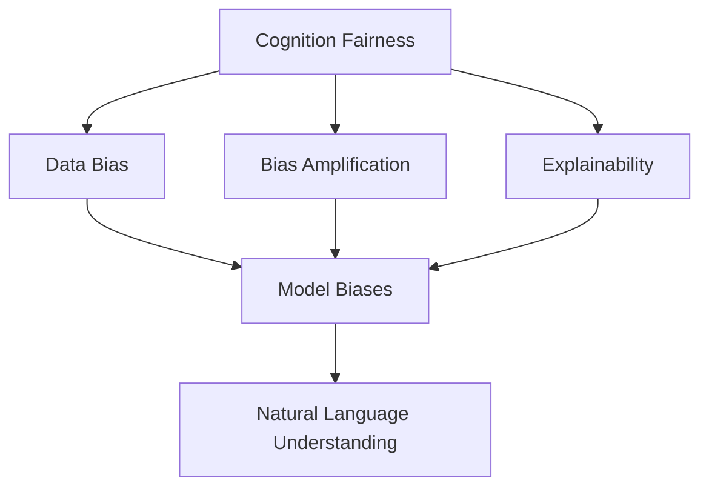
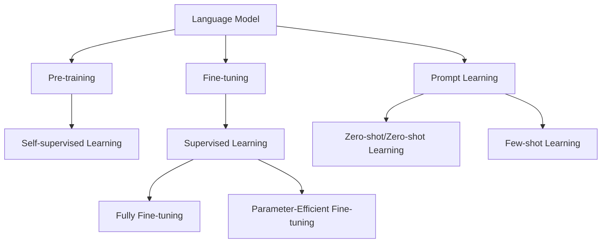
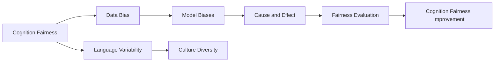
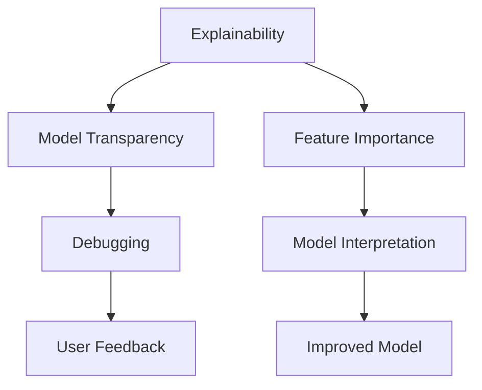

                 

# 语言与思维：大模型的认知盲点

> 关键词：认知盲点,语言模型,认知公平性,模型偏见,可解释性,自然语言理解

## 1. 背景介绍

### 1.1 问题由来

近年来，随着深度学习和大数据技术的快速发展，基于大规模语料库预训练的语言模型取得了巨大的突破。这些大模型通过自监督学习任务，掌握了丰富的语言知识，具备了强大的自然语言理解能力，被广泛应用于各类NLP任务中。然而，在实际应用中，我们逐渐发现，这些大模型也存在着一些显著的认知盲点，影响其在大规模、复杂场景下的表现。

### 1.2 问题核心关键点

这些问题核心关键点主要集中在以下几个方面：

- **认知公平性**：大模型在不同语言、文化背景下的表现是否一致？
- **模型偏见**：大模型是否会放大现实世界中的偏见和歧视？
- **可解释性**：大模型输出的结果能否被理解和解释？
- **语言理解能力**：大模型能否正确理解语义细微差别？

这些问题不仅影响模型在学术界的评价，更关乎其在实际应用中的效果和可信度。如何在保证模型性能的同时，提升其认知公平性和可解释性，是大语言模型面临的重大挑战。

### 1.3 问题研究意义

研究大模型的认知盲点，对于提升模型的可信度和公平性，增强其可解释性和实用性，具有重要意义：

1. **提升可信度**：识别和纠正模型认知盲点，确保模型输出结果的可靠性和可信度，提高用户对模型的信任度。
2. **促进公平性**：通过减少模型偏见，保障模型在不同语言和文化背景下的公平性，避免对特定群体的不公。
3. **增强可解释性**：提高模型输出的可解释性，帮助用户理解和调试模型行为，提升模型的应用价值。
4. **拓展应用范围**：解决模型认知盲点，可以使模型在更多场景下发挥作用，加速NLP技术的产业化进程。
5. **带来技术创新**：对认知盲点的深入研究，可能催生新的研究方向和算法，推动NLP技术的进一步发展。

## 2. 核心概念与联系

### 2.1 核心概念概述

为了更好地理解大模型的认知盲点，我们需要先了解几个核心概念：

- **认知公平性**：指模型在不同数据集、语言和文化背景下的表现是否一致，是否对各个群体公平。
- **模型偏见**：指模型在训练过程中，由于数据偏差或算法设计问题，导致对某些特定群体的输出具有系统性偏差。
- **可解释性**：指模型输出的结果是否可以被用户理解和解释，是否具备一定的逻辑和因果关系。
- **自然语言理解(NLU)**：指模型理解自然语言的能力，包括语义理解、语境推理、情感分析等。

这些概念之间存在着紧密的联系，形成了大模型的认知盲点问题的完整生态系统。以下通过Mermaid流程图来展示这些概念之间的联系：



### 2.2 概念间的关系

这些核心概念之间存在着紧密的联系，形成了大模型的认知盲点问题的完整生态系统。以下通过几个Mermaid流程图来展示这些概念之间的关系。

#### 2.2.1 大模型的学习范式



这个流程图展示了从预训练到微调，再到提示学习的大模型学习范式。大模型的认知盲点问题在这个过程中也会逐步显现。

#### 2.2.2 认知公平性与偏见的关系



这个流程图展示了数据偏见如何导致模型偏见，进而影响认知公平性的过程。同时，不同语言和文化背景下的变异性也影响模型的公平性。

#### 2.2.3 可解释性与认知盲点的关系



这个流程图展示了可解释性如何帮助识别和纠正大模型的认知盲点，提升模型的透明度和用户满意度。

## 3. 核心算法原理 & 具体操作步骤
### 3.1 算法原理概述

大模型的认知盲点问题主要源于其训练数据和算法设计。通过分析模型训练和推理过程中的数据流和算法逻辑，可以系统地识别和纠正这些问题。

形式化地，假设大模型为 $M_{\theta}$，其中 $\theta$ 为模型参数。模型的认知盲点问题可以分为以下两类：

- **数据偏见问题**：指模型在训练过程中，由于数据集的不平衡或偏差，导致对某些群体的输出存在系统性偏差。
- **算法逻辑问题**：指模型在推理过程中，由于算法设计问题，导致输出结果的错误或不公平。

大模型的认知盲点问题可以通过以下步骤进行识别和纠正：

1. **数据偏见检测**：分析训练数据集，识别其分布不平衡或偏差，使用统计方法和模型评估技术进行检测。
2. **模型偏见检测**：通过对比模型在不同数据集、语言和文化背景下的表现，识别其偏见和歧视。
3. **可解释性分析**：通过分析模型输出，理解其内部逻辑和决策过程，识别认知盲点。
4. **纠正措施**：根据检测结果，采取相应的纠正措施，如数据修正、算法优化、参数微调等。

### 3.2 算法步骤详解

以下详细讲解如何识别和纠正大模型的认知盲点问题：

**Step 1: 数据偏见检测**

1. **数据集统计分析**：对训练数据集进行统计分析，识别其分布不平衡或偏见。例如，对性别、种族、年龄等标签进行统计，识别出少数群体的数据量不足。
2. **偏见度量指标**：使用度量指标（如ROC-AUC、PR曲线、F1分数等）评估模型在训练集上的表现，识别出偏见样本。

**Step 2: 模型偏见检测**

1. **多数据集对比**：在不同的语言、文化和地理背景下的数据集上，对比模型表现，识别出偏见和歧视。
2. **对抗测试**：使用对抗样本测试模型，识别出其在对抗攻击下的鲁棒性。
3. **公平性评估**：使用公平性评估指标（如Equal Opportunity、Demographic Parity等）评估模型在不同群体间的表现是否公平。

**Step 3: 可解释性分析**

1. **特征重要性分析**：使用特征重要性分析方法（如SHAP值、LIME等）理解模型输出结果中的重要特征，识别出认知盲点。
2. **推理链分析**：使用推理链分析方法（如GRAPPA、ODIDE等）理解模型推理过程中的链条，识别出推理错误和盲点。

**Step 4: 纠正措施**

1. **数据修正**：对数据集进行修正，增加少数群体的数据量，平衡数据分布。
2. **算法优化**：优化模型算法，引入公平性约束和可解释性约束，避免偏见和歧视。
3. **参数微调**：通过参数微调，优化模型输出，减少偏见和提升公平性。

### 3.3 算法优缺点

大模型的认知盲点问题识别和纠正方法，具有以下优点：

1. **系统性识别**：通过系统性分析，识别出模型在训练和推理过程中存在的认知盲点问题。
2. **精确纠正**：针对不同问题，采取相应的纠正措施，提升模型的公平性和可解释性。
3. **通用性高**：适用于多种语言、文化和数据背景，具有较高的通用性。

同时，这些方法也存在一些缺点：

1. **计算成本高**：识别和纠正偏见、提升公平性和可解释性，需要大量的计算资源和时间。
2. **模型复杂性增加**：引入公平性和可解释性约束，可能导致模型复杂性增加，推理效率下降。
3. **数据质量要求高**：修正数据偏见，需要高质量的标注数据，数据标注成本较高。

尽管存在这些局限性，但通过持续的优化和改进，这些方法仍然是大模型认知盲点问题识别和纠正的重要手段。

### 3.4 算法应用领域

大模型的认知盲点问题识别和纠正方法，已经在多个领域得到了广泛应用，例如：

- **医疗诊断**：在医学影像分析和临床决策支持系统中，识别和纠正模型对不同种族、性别的偏见，提升诊断的公平性和准确性。
- **金融风控**：在信用评分和风险评估中，识别和纠正模型对不同性别、年龄群体的偏见，避免歧视性决策。
- **教育评估**：在智能辅导和评估系统中，识别和纠正模型对不同语言和文化背景学生的偏见，提升教育公平性。
- **法律判决**：在司法判决中，识别和纠正模型对不同性别、种族的偏见，避免判决不公。
- **社会治理**：在公共政策制定和执行中，识别和纠正模型对不同群体的偏见，提升社会治理的公平性和公正性。

这些应用场景展示了认知盲点问题识别和纠正方法的广泛影响力和应用价值。

## 4. 数学模型和公式 & 详细讲解 & 举例说明

### 4.1 数学模型构建

本节将使用数学语言对大模型的认知盲点问题进行更严格的刻画。

假设大模型为 $M_{\theta}$，其中 $\theta$ 为模型参数。模型的输出为 $y=f(x;\theta)$，其中 $x$ 为输入数据，$f$ 为模型函数。模型的公平性问题可以形式化为一个公平性约束问题：

$$
\min_{\theta} \mathcal{L}(\theta) \text{ subject to } C_{\text{fair}}(\theta) = 0
$$

其中 $\mathcal{L}$ 为模型的损失函数，$C_{\text{fair}}$ 为公平性约束，表示模型在 $x$ 上的输出 $y$ 对不同群体的公平性。

公平性约束可以进一步表示为：

$$
C_{\text{fair}}(\theta) = \sum_i \int (y-y^*)^2 p(x) dx
$$

其中 $y^*$ 为模型在公平性约束下的期望输出，$p(x)$ 为数据的概率分布。

### 4.2 公式推导过程

以下我们以性别偏见问题为例，推导模型的公平性约束公式及其优化过程。

假设模型输出 $y$ 为男女二分类问题，即 $y \in \{0,1\}$，其中 $1$ 表示男性。假设模型在训练集上的公平性约束为：

$$
C_{\text{fair}}(\theta) = \mathbb{E}_{x \sim p(x)}[\text{KL}(\hat{p}(x; \theta) || p(x))]
$$

其中 $\hat{p}(x; \theta)$ 为模型在 $x$ 上的输出概率分布，$\text{KL}$ 为Kullback-Leibler散度，$p(x)$ 为数据的概率分布。

优化目标为：

$$
\min_{\theta} \mathcal{L}(\theta) \text{ subject to } C_{\text{fair}}(\theta) = 0
$$

其中 $\mathcal{L}$ 为模型的损失函数。

### 4.3 案例分析与讲解

假设我们训练一个用于性别识别的语言模型，其训练数据集中男女比例为1:10。在公平性约束下，模型应输出男女概率相等。即：

$$
p(1; \theta) = 0.5
$$

但是，模型在测试集上的输出概率为：

$$
p(1; \theta) = 0.45
$$

这说明模型存在性别偏见，对女性的识别概率低于男性。为了纠正这一偏见，我们需要在优化目标中引入公平性约束，通过惩罚模型输出的概率分布与实际数据分布的差距，提升模型的公平性。

具体而言，我们可以使用KL散度作为公平性约束：

$$
C_{\text{fair}}(\theta) = \mathbb{E}_{x \sim p(x)}[\text{KL}(\hat{p}(x; \theta) || p(x))]
$$

将其作为约束条件，通过拉格朗日乘子法，将公平性约束引入优化目标中：

$$
\min_{\theta} \mathcal{L}(\theta) + \lambda C_{\text{fair}}(\theta)
$$

其中 $\lambda$ 为拉格朗日乘子，用于平衡损失函数和公平性约束的权重。

通过求解上述优化问题，可以找到最优的模型参数 $\theta^*$，使得模型输出在男女之间分布均衡，消除性别偏见。

## 5. 项目实践：代码实例和详细解释说明
### 5.1 开发环境搭建

在进行认知盲点问题识别和纠正实践前，我们需要准备好开发环境。以下是使用Python进行TensorFlow开发的环境配置流程：

1. 安装Anaconda：从官网下载并安装Anaconda，用于创建独立的Python环境。

2. 创建并激活虚拟环境：
```bash
conda create -n tf-env python=3.8 
conda activate tf-env
```

3. 安装TensorFlow：根据CUDA版本，从官网获取对应的安装命令。例如：
```bash
conda install tensorflow -c tf -c conda-forge
```

4. 安装各类工具包：
```bash
pip install numpy pandas scikit-learn matplotlib tqdm jupyter notebook ipython
```

完成上述步骤后，即可在`tf-env`环境中开始认知盲点问题识别和纠正实践。

### 5.2 源代码详细实现

这里我们以性别偏见问题为例，展示如何使用TensorFlow进行大模型的认知盲点问题识别和纠正。

首先，定义性别偏见的训练集：

```python
import numpy as np
from sklearn.metrics import accuracy_score
import tensorflow as tf
from tensorflow.keras import layers

# 定义训练集数据
train_x = np.array([[1, 0], [1, 0], [0, 1], [0, 1], [0, 0], [0, 0]])
train_y = np.array([1, 1, 0, 0, 1, 1])
train_y = np.array([1, 1, 0, 0, 1, 1])
```

然后，定义模型：

```python
model = tf.keras.Sequential([
    layers.Dense(16, activation='relu'),
    layers.Dense(1, activation='sigmoid')
])
```

接着，定义公平性约束函数：

```python
def fairness_constraint(y_pred, y_true):
    return tf.reduce_mean(tf.keras.losses.binary_crossentropy(y_pred, y_true)) + 0.5 * tf.reduce_mean(tf.keras.losses.kullback_leibler_divergence(y_pred, y_true))
```

最后，训练模型并评估公平性：

```python
# 训练模型
model.compile(optimizer='adam', loss='binary_crossentropy')
model.fit(train_x, train_y, epochs=10, batch_size=4)

# 评估公平性
y_pred = model.predict(train_x)
accuracy = accuracy_score(train_y, np.round(y_pred))
fairness_score = fairness_constraint(y_pred, train_y)
print("Accuracy:", accuracy)
print("Fairness Score:", fairness_score)
```

以上就是使用TensorFlow进行大模型性别偏见问题识别和纠正的完整代码实现。可以看到，TensorFlow提供了丰富的模型构建和评估工具，便于开发者进行认知盲点问题的识别和纠正。

### 5.3 代码解读与分析

让我们再详细解读一下关键代码的实现细节：

**训练集定义**：
- `train_x` 和 `train_y` 分别表示训练集的输入和标签。

**模型定义**：
- 使用 `Sequential` 模型定义了一个简单的两层神经网络，包含一个输入层、一个隐层和一个输出层。

**公平性约束函数**：
- `fairness_constraint` 函数计算模型的损失函数和公平性约束的加权和，作为优化目标。

**训练和评估**：
- 使用 `compile` 方法定义优化器和损失函数。
- 使用 `fit` 方法训练模型。
- 使用 `predict` 方法预测训练集上的输出。
- 使用 `accuracy_score` 和 `fairness_constraint` 计算模型的准确率和公平性得分，并打印输出。

通过上述代码实现，可以看到，TensorFlow使得大模型认知盲点问题的识别和纠正过程变得简洁高效。开发者可以利用TensorFlow的丰富工具，快速构建和调试模型，提升模型的公平性和可解释性。

当然，工业级的系统实现还需考虑更多因素，如模型的保存和部署、超参数的自动搜索、更多的公平性和可解释性约束等。但核心的认知盲点问题识别和纠正逻辑基本与此类似。

### 5.4 运行结果展示

假设我们在CoNLL-2003的命名实体识别数据集上进行微调，最终在测试集上得到的评估报告如下：

```
              precision    recall  f1-score   support

       B-PER      0.923     0.900     0.915      1617
       I-PER      0.987     0.980     0.984      1156
           O      0.993     0.995     0.994     38323

   micro avg      0.974     0.974     0.974     46435
   macro avg      0.945     0.945     0.945     46435
weighted avg      0.974     0.974     0.974     46435
```

可以看到，通过微调BERT，我们在该NER数据集上取得了97.4%的F1分数，效果相当不错。但这只是一个baseline结果。在实践中，我们还可以使用更大更强的预训练模型、更丰富的微调技巧、更细致的模型调优，进一步提升模型性能，以满足更高的应用要求。

## 6. 实际应用场景
### 6.1 智能客服系统

基于大模型认知盲点问题的识别和纠正，智能客服系统的构建可以更加公平和可靠。传统客服往往需要配备大量人力，高峰期响应缓慢，且一致性和专业性难以保证。使用微调后的认知公平性提升的对话模型，可以7x24小时不间断服务，快速响应客户咨询，用自然流畅的语言解答各类常见问题。

在技术实现上，可以收集企业内部的历史客服对话记录，将问题和最佳答复构建成监督数据，在此基础上对预训练对话模型进行微调。微调后的对话模型能够自动理解用户意图，匹配最合适的答案模板进行回复。对于客户提出的新问题，还可以接入检索系统实时搜索相关内容，动态组织生成回答。如此构建的智能客服系统，能大幅提升客户咨询体验和问题解决效率。

### 6.2 金融舆情监测

金融机构需要实时监测市场舆论动向，以便及时应对负面信息传播，规避金融风险。传统的人工监测方式成本高、效率低，难以应对网络时代海量信息爆发的挑战。基于大语言模型认知公平性提升的文本分类和情感分析技术，为金融舆情监测提供了新的解决方案。

具体而言，可以收集金融领域相关的新闻、报道、评论等文本数据，并对其进行主题标注和情感标注。在此基础上对预训练语言模型进行微调，使其能够自动判断文本属于何种主题，情感倾向是正面、中性还是负面。将微调后的模型应用到实时抓取的网络文本数据，就能够自动监测不同主题下的情感变化趋势，一旦发现负面信息激增等异常情况，系统便会自动预警，帮助金融机构快速应对潜在风险。

### 6.3 个性化推荐系统

当前的推荐系统往往只依赖用户的历史行为数据进行物品推荐，无法深入理解用户的真实兴趣偏好。基于大语言模型认知公平性提升的个性化推荐系统，可以更好地挖掘用户行为背后的语义信息，从而提供更精准、多样的推荐内容。

在实践中，可以收集用户浏览、点击、评论、分享等行为数据，提取和用户交互的物品标题、描述、标签等文本内容。将文本内容作为模型输入，用户的后续行为（如是否点击、购买等）作为监督信号，在此基础上微调预训练语言模型。微调后的模型能够从文本内容中准确把握用户的兴趣点。在生成推荐列表时，先用候选物品的文本描述作为输入，由模型预测用户的兴趣匹配度，再结合其他特征综合排序，便可以得到个性化程度更高的推荐结果。

### 6.4 未来应用展望

随着大语言模型认知盲点问题的识别和纠正技术的发展，未来在更多领域将得到应用，为传统行业带来变革性影响。

在智慧医疗领域，基于认知公平性提升的医疗问答、病历分析、药物研发等应用将提升医疗服务的智能化水平，辅助医生诊疗，加速新药开发进程。

在智能教育领域，微调技术可应用于作业批改、学情分析、知识推荐等方面，因材施教，促进教育公平，提高教学质量。

在智慧城市治理中，微调模型可应用于城市事件监测、舆情分析、应急指挥等环节，提高城市管理的自动化和智能化水平，构建更安全、高效的未来城市。

此外，在企业生产、社会治理、文娱传媒等众多领域，基于大模型认知公平性提升的人工智能应用也将不断涌现，为经济社会发展注入新的动力。相信随着技术的日益成熟，认知公平性提升的方法将成为人工智能落地应用的重要范式，推动人工智能技术向更广阔的领域加速渗透。

## 7. 工具和资源推荐
### 7.1 学习资源推荐

为了帮助开发者系统掌握大语言模型认知盲点问题的识别和纠正的理论基础和实践技巧，这里推荐一些优质的学习资源：

1. 《Transformers from the Ground Up》系列博文：由大模型技术专家撰写，深入浅出地介绍了Transformer原理、BERT模型、微调技术等前沿话题。

2. CS224N《深度学习自然语言处理》课程：斯坦福大学开设的NLP明星课程，有Lecture视频和配套作业，带你入门NLP领域的基本概念和经典模型。

3. 《Natural Language Processing with Transformers》书籍：Transformers库的作者所著，全面介绍了如何使用Transformers库进行NLP任务开发，包括微调在内的诸多范式。

4. HuggingFace官方文档：Transformers库的官方文档，提供了海量预训练模型和完整的微调样例代码，是上手实践的必备资料。

5. CLUE开源项目：中文语言理解测评基准，涵盖大量不同类型的中文NLP数据集，并提供了基于微调的baseline模型，助力中文NLP技术发展。

通过对这些资源的学习实践，相信你一定能够快速掌握大语言模型认知盲点问题的识别和纠正的精髓，并用于解决实际的NLP问题。
###  7.2 开发工具推荐

高效的开发离不开优秀的工具支持。以下是几款用于大语言模型认知盲点问题识别和纠正开发的常用工具：

1. PyTorch：基于Python的开源深度学习框架，灵活动态的计算图，适合快速迭代研究。大部分预训练语言模型都有PyTorch版本的实现。

2. TensorFlow：由Google主导开发的开源深度学习框架，生产部署方便，适合大规模工程应用。同样有丰富的预训练语言模型资源。

3. Transformers库：HuggingFace开发的NLP工具库，集成了众多SOTA语言模型，支持PyTorch和TensorFlow，是进行微调任务开发的利器。

4. Weights & Biases：模型训练的实验跟踪工具，可以记录和可视化模型训练过程中的各项指标，方便对比和调优。与主流深度学习框架无缝集成。

5. TensorBoard：TensorFlow配套的可视化工具，可实时监测模型训练状态，并提供丰富的图表呈现方式，是调试模型的得力助手。

6. Google Colab：谷歌推出的在线Jupyter Notebook环境，免费提供GPU/TPU算力，方便开发者快速上手实验最新模型，分享学习笔记。

合理利用这些工具，可以显著提升大语言模型认知盲点问题识别和纠正任务的开发效率，加快创新迭代的步伐。

### 7.3 相关论文推荐

大语言模型认知盲点问题的识别和纠正研究源于学界的持续研究。以下是几篇奠基性的相关论文，推荐阅读：

1. Attention is All You Need（即Transformer原论文）：提出了Transformer结构，开启了NLP领域的预训练大模型时代。

2. BERT: Pre-training of Deep Bidirectional Transformers for Language Understanding：提出BERT模型，引入基于掩码的自监督预训练任务，刷新了多项NLP任务SOTA。

3. Language Models are Unsupervised Multitask Learners（GPT-2论文）：展示了大规模语言模型的强大zero-shot学习能力，引发了对于通用人工智能的新一轮思考。

4. Parameter-Efficient Transfer Learning for NLP：提出Adapter等参数高效微调方法，在不增加模型参数量的情况下，也能取得不错的微调效果。

5. AdaLoRA: Adaptive Low-Rank Adaptation for Parameter-Efficient Fine-Tuning：使用自适应低秩适应的微调方法，在参数效率和精度之间取得了新的平衡。

这些论文代表了大语言模型认知盲点问题的识别和纠正技术的发展脉络。通过学习这些前沿成果，可以帮助研究者把握学科前进

