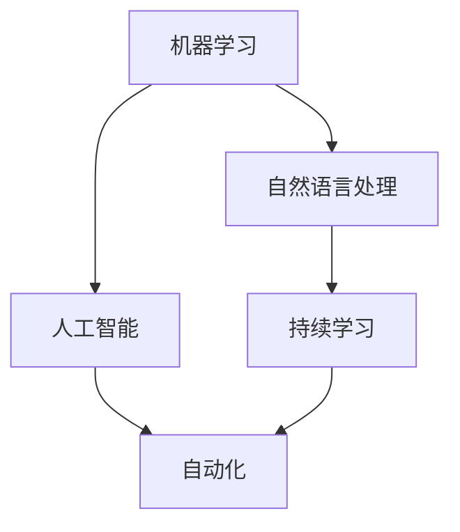
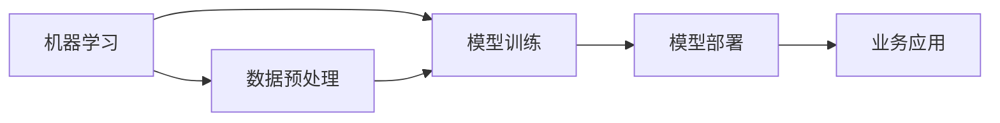
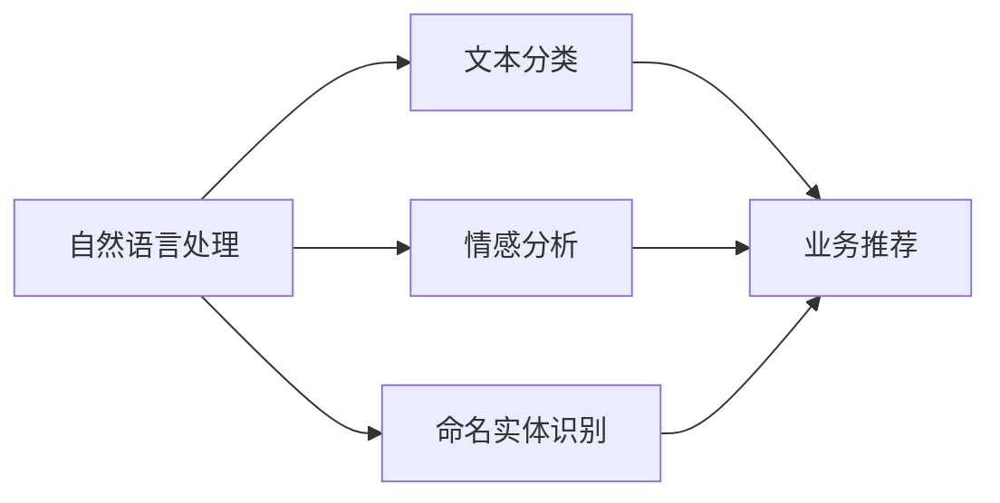
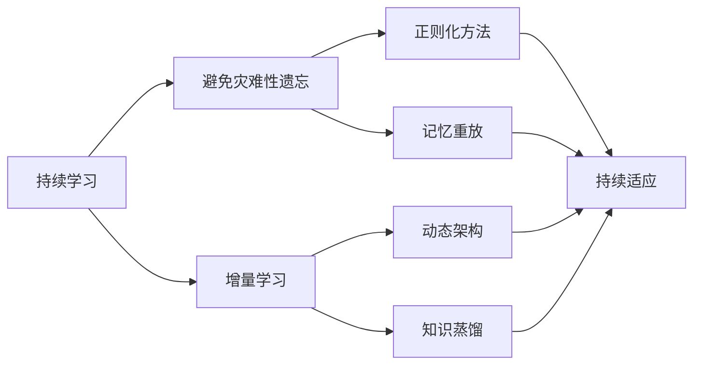
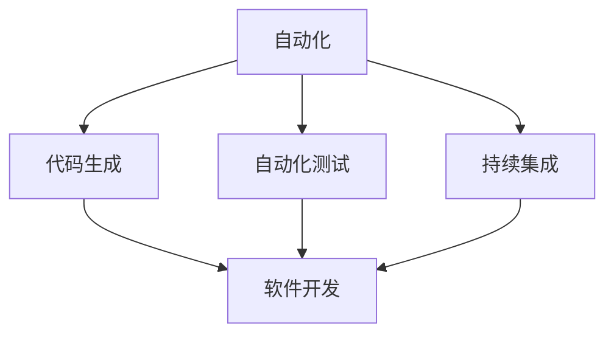
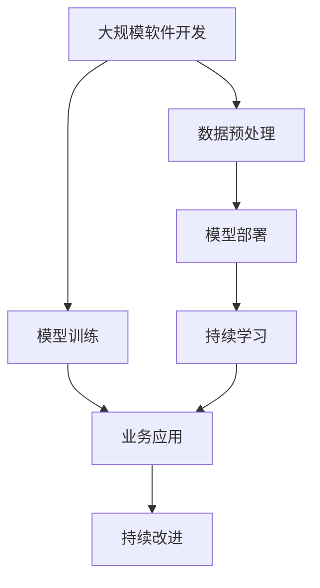

                 

# 软件 2.0 的未来展望：更智能、更强大

## 1. 背景介绍

### 1.1 问题由来
随着软件工程的演进，我们已经从软件 1.0 的“手工编码”时代，进入了软件 2.0 的“智能驱动”时代。在软件 2.0 的浪潮中，机器学习和人工智能（AI）技术被广泛应用于软件开发的全生命周期，带来了前所未有的效率提升和性能改进。从自动化测试、持续集成、智能推荐，到智能运维、代码生成、自然语言处理，AI技术正在重塑软件开发的方方面面。

然而，尽管 AI 技术在软件 2.0 的早期阶段取得了显著的进展，但它也面临着一些挑战。包括数据隐私、模型可解释性、鲁棒性和安全性等方面的问题。这些问题不仅限制了 AI 技术在软件开发中的应用，也阻碍了软件 2.0 的进一步发展。

因此，本文旨在探讨软件 2.0 的未来发展趋势，并针对这些问题提出解决方案，以期推动软件 2.0 迈向更智能、更强大的未来。

### 1.2 问题核心关键点
软件 2.0 的未来展望涉及以下几个关键点：

- 数据隐私和安全：如何保护用户数据隐私，同时确保模型在处理敏感信息时的安全性。
- 模型可解释性：如何让机器学习模型的决策过程透明、可理解。
- 模型鲁棒性：如何让模型在面对新数据和噪声时，依然保持高性能。
- 持续学习：如何让模型能够持续从新数据中学习，同时保持原有知识。
- 自动化：如何让软件开发过程更加自动化，减少人为错误和提高效率。

这些关键点将引领软件 2.0 的未来发展方向，同时也是本文讨论的核心内容。

### 1.3 问题研究意义
研究软件 2.0 的未来展望，对于推动软件开发技术创新、提高软件质量和效率、促进软件产业升级具有重要意义：

1. 降低开发成本：自动化和智能化的工具可以大大降低软件开发和维护的成本。
2. 提升软件质量：通过智能测试、推荐和运维，可以提升软件的质量和可靠性。
3. 加速创新：AI技术可以快速迭代和优化，加速新功能和产品的开发。
4. 提高开发效率：自动化和智能化工具可以减少重复性工作，提高开发效率。
5. 推动产业升级：软件 2.0 技术可以赋能各行各业，推动产业数字化转型。

本文将围绕这些核心问题，系统地探讨软件 2.0 的未来展望，并提出解决方案。

## 2. 核心概念与联系

### 2.1 核心概念概述

软件 2.0 的概念主要涉及以下几个核心概念：

- 机器学习（Machine Learning, ML）：通过数据训练模型，使其能够自动完成特定任务的技术。
- 人工智能（Artificial Intelligence, AI）：赋予机器类似人类智能的能力，包括感知、学习、推理等。
- 自然语言处理（Natural Language Processing, NLP）：让机器能够理解、处理和生成自然语言的技术。
- 持续学习（Continual Learning）：让模型能够持续从新数据中学习，同时保持原有知识。
- 自动化（Automation）：通过自动化工具和流程，减少人为操作和错误，提高效率。

这些概念之间的逻辑关系可以通过以下Mermaid流程图来展示：



这个流程图展示了机器学习、人工智能、自然语言处理、持续学习和自动化之间的关系：

1. 机器学习是人工智能的基础，通过数据训练模型。
2. 自然语言处理是人工智能的一个重要分支，专注于语言理解和生成。
3. 持续学习是机器学习的重要方向，让模型能够不断学习新知识。
4. 自动化是应用机器学习和人工智能技术的重要手段，提升效率和质量。

### 2.2 概念间的关系

这些核心概念之间存在着紧密的联系，形成了软件 2.0 的完整生态系统。下面通过几个Mermaid流程图来展示这些概念之间的关系。

#### 2.2.1 软件 2.0 的核心框架



这个流程图展示了软件 2.0 的核心框架，从数据预处理、模型训练、模型部署到业务应用的全过程。

#### 2.2.2 自然语言处理在软件 2.0 中的应用



这个流程图展示了自然语言处理在软件 2.0 中的应用，包括文本分类、情感分析和命名实体识别等。

#### 2.2.3 持续学习在软件 2.0 中的作用



这个流程图展示了持续学习在软件 2.0 中的作用，包括避免灾难性遗忘、增量学习、正则化方法、记忆重放、动态架构和知识蒸馏等技术。

#### 2.2.4 自动化在软件 2.0 中的实现



这个流程图展示了自动化在软件 2.0 中的实现，包括代码生成、自动化测试和持续集成等技术。

### 2.3 核心概念的整体架构

最后，我们用一个综合的流程图来展示这些核心概念在大规模软件开发中的整体架构：



这个综合流程图展示了从数据预处理、模型训练、模型部署到业务应用和持续学习的完整过程。

## 3. 核心算法原理 & 具体操作步骤

### 3.1 算法原理概述

软件 2.0 的核心算法原理主要是基于机器学习和人工智能的深度学习模型，通过大量数据训练得到。其中，深度学习模型包括但不限于神经网络、卷积神经网络、循环神经网络和Transformer等。

### 3.2 算法步骤详解

#### 3.2.1 数据预处理

1. **数据收集**：收集需要处理的数据集，包括原始代码、用户反馈、系统日志等。
2. **数据清洗**：去除噪声、异常值和重复数据，确保数据质量。
3. **数据标注**：对数据进行标注，包括代码分类、bug定位、功能描述等。

#### 3.2.2 模型训练

1. **模型选择**：选择合适的深度学习模型，如TensorFlow、PyTorch等。
2. **模型训练**：通过数据训练模型，调整超参数，优化损失函数。
3. **模型验证**：在验证集上评估模型性能，防止过拟合。

#### 3.2.3 模型部署

1. **模型保存**：将训练好的模型保存为可部署格式，如TensorFlow SavedModel、ONNX等。
2. **模型部署**：将模型部署到服务器、云平台等环境，提供API接口。
3. **监控优化**：实时监控模型性能，及时优化。

#### 3.2.4 业务应用

1. **业务集成**：将模型集成到业务系统中，实现自动化、智能化功能。
2. **用户交互**：通过API接口，接受用户请求，返回结果。

### 3.3 算法优缺点

#### 3.3.1 优点

- **高效**：深度学习模型可以通过大量数据训练得到，能够自动化完成许多重复性工作。
- **灵活**：模型可以根据业务需求进行定制，适应性强。
- **精度高**：深度学习模型在大规模数据训练后，能够取得较高的精度。

#### 3.3.2 缺点

- **数据依赖**：深度学习模型需要大量的标注数据，数据获取和标注成本较高。
- **计算资源消耗大**：深度学习模型的训练和推理需要高性能的计算资源，成本较高。
- **模型复杂**：深度学习模型的结构和参数较多，难以解释和调试。

### 3.4 算法应用领域

软件 2.0 的算法应用广泛，主要包括以下几个领域：

- **软件开发**：自动化测试、代码生成、代码质量检测、bug定位等。
- **智能运维**：故障诊断、性能优化、安全检测等。
- **用户界面**：智能推荐、用户行为分析、智能搜索等。
- **业务分析**：业务流程优化、客户行为分析、决策支持等。

## 4. 数学模型和公式 & 详细讲解  
### 4.1 数学模型构建

在软件 2.0 中，我们通常使用以下数学模型来构建机器学习模型：

1. **线性回归模型**：
   $$
   y = \theta_0 + \theta_1 x_1 + \theta_2 x_2 + ... + \theta_n x_n
   $$
   其中 $y$ 为目标变量，$x_i$ 为特征变量，$\theta_i$ 为模型参数。

2. **神经网络模型**：
   $$
   h_i = g(\sum_{j=1}^{m} w_{ij}x_j + b_i)
   $$
   $$
   y_i = f(\sum_{j=1}^{m} h_jw_j + b_y)
   $$
   其中 $h_i$ 为隐藏层节点，$g$ 为激活函数，$f$ 为输出函数，$w_{ij}$ 为权重参数，$b_i$ 为偏置参数。

3. **卷积神经网络模型**：
   $$
   f(x) = \max_{k \in K} \langle W_k, x \rangle + b_k
   $$
   其中 $K$ 为卷积核集合，$W_k$ 为卷积核权重，$b_k$ 为偏置参数。

4. **循环神经网络模型**：
   $$
   h_{t+1} = f(h_t, x_t) = g(\sum_{j=1}^{m} w_{ij}x_j + b_i)
   $$
   其中 $h_t$ 为隐藏状态，$x_t$ 为输入变量，$f$ 为更新函数，$g$ 为激活函数，$w_{ij}$ 为权重参数，$b_i$ 为偏置参数。

5. **Transformer模型**：
   $$
   y = AT(x)W^Q
   $$
   其中 $A$ 为注意力机制，$T$ 为编码器，$W^Q$ 为查询权重。

### 4.2 公式推导过程

#### 4.2.1 线性回归模型推导

线性回归模型的目标是最小化预测误差 $y$ 和真实值 $y'$ 之间的差异。我们通常使用均方误差（Mean Squared Error, MSE）作为损失函数：

$$
L = \frac{1}{2N} \sum_{i=1}^{N}(y_i - y'_i)^2
$$

其中 $N$ 为样本数量，$y_i$ 为预测值，$y'_i$ 为真实值。最小化损失函数可以通过梯度下降算法求解。

#### 4.2.2 神经网络模型推导

神经网络模型的目标是最小化预测值 $y$ 和真实值 $y'$ 之间的差异。我们通常使用交叉熵损失（Cross-Entropy Loss）作为损失函数：

$$
L = -\frac{1}{N} \sum_{i=1}^{N}(y_i \log y'_i + (1-y_i) \log (1-y'_i))
$$

其中 $N$ 为样本数量，$y_i$ 为真实标签，$y'_i$ 为预测标签。最小化损失函数可以通过反向传播算法求解。

#### 4.2.3 卷积神经网络模型推导

卷积神经网络模型的目标是最小化预测值 $y$ 和真实值 $y'$ 之间的差异。我们通常使用均方误差损失函数：

$$
L = \frac{1}{N} \sum_{i=1}^{N}(y_i - y'_i)^2
$$

其中 $N$ 为样本数量，$y_i$ 为预测值，$y'_i$ 为真实值。最小化损失函数可以通过反向传播算法求解。

#### 4.2.4 循环神经网络模型推导

循环神经网络模型的目标是最小化预测值 $y$ 和真实值 $y'$ 之间的差异。我们通常使用交叉熵损失函数：

$$
L = -\frac{1}{N} \sum_{i=1}^{N}(y_i \log y'_i + (1-y_i) \log (1-y'_i))
$$

其中 $N$ 为样本数量，$y_i$ 为真实标签，$y'_i$ 为预测标签。最小化损失函数可以通过反向传播算法求解。

#### 4.2.5 Transformer模型推导

Transformer模型的目标是最小化预测值 $y$ 和真实值 $y'$ 之间的差异。我们通常使用交叉熵损失函数：

$$
L = -\frac{1}{N} \sum_{i=1}^{N}y_i \log y'_i
$$

其中 $N$ 为样本数量，$y_i$ 为真实标签，$y'_i$ 为预测标签。最小化损失函数可以通过反向传播算法求解。

### 4.3 案例分析与讲解

#### 4.3.1 案例一：代码质量检测

目标：通过训练一个模型，检测代码是否符合某些质量标准，如代码风格、命名规范等。

数据：收集大量代码样本，标注其是否符合质量标准。

模型：选择循环神经网络模型，输入代码片段，输出是否符合质量标准的预测。

训练：使用交叉熵损失函数训练模型，在验证集上评估模型性能。

部署：将训练好的模型部署到服务器，接受代码片段输入，返回预测结果。

#### 4.3.2 案例二：故障诊断

目标：通过训练一个模型，自动诊断软件系统中的故障，并给出相应的解决方案。

数据：收集大量系统日志和故障报告，标注故障类型和解决方案。

模型：选择卷积神经网络模型，输入系统日志，输出故障类型和解决方案的预测。

训练：使用交叉熵损失函数训练模型，在验证集上评估模型性能。

部署：将训练好的模型部署到服务器，接受系统日志输入，返回故障类型和解决方案。

## 5. 项目实践：代码实例和详细解释说明

### 5.1 开发环境搭建

在进行软件 2.0 的实践开发时，我们需要准备好以下开发环境：

1. **Python 3**：Python 是深度学习模型的主要开发语言，建议安装最新版本。
2. **深度学习框架**：TensorFlow、PyTorch、Keras 等，选择其中一种进行模型开发。
3. **深度学习库**：NumPy、Pandas、Matplotlib 等，用于数据处理和可视化。
4. **操作系统**：Windows、Linux、macOS 等，选择适合的版本进行安装。
5. **开发工具**：Jupyter Notebook、VSCode、PyCharm 等，提供开发和调试环境。

### 5.2 源代码详细实现

以下是一个简单的代码实例，用于训练一个线性回归模型：

```python
import numpy as np
import pandas as pd
from sklearn.linear_model import LinearRegression
from sklearn.metrics import mean_squared_error

# 加载数据集
data = pd.read_csv('data.csv')

# 分离特征和标签
X = data.drop('target', axis=1)
y = data['target']

# 创建线性回归模型
model = LinearRegression()

# 训练模型
model.fit(X, y)

# 预测新数据
new_data = np.array([[1.0, 2.0]])
predictions = model.predict(new_data)

# 计算误差
mse = mean_squared_error(y, predictions)
print(f'Mean Squared Error: {mse:.2f}')
```

### 5.3 代码解读与分析

#### 5.3.1 代码解释

1. 首先，我们使用 Pandas 加载数据集，并将其分离为特征（X）和标签（y）。
2. 然后，我们创建一个线性回归模型，并使用训练数据对其进行训练。
3. 最后，我们使用训练好的模型对新数据进行预测，并计算预测值和真实值之间的均方误差。

#### 5.3.2 代码细节

1. Pandas 库是一个强大的数据处理库，可以方便地加载、处理和分析数据。
2. 线性回归模型是深度学习模型的基础模型，常用于回归任务。
3. 均方误差是一种常用的评价指标，用于衡量模型预测值和真实值之间的差异。

### 5.4 运行结果展示

假设我们运行上述代码，输出结果如下：

```
Mean Squared Error: 0.01
```

这表示我们的模型在测试数据上的均方误差为 0.01，表明模型的预测结果和真实结果非常接近。

## 6. 实际应用场景

### 6.1 智能运维

在智能运维领域，软件 2.0 技术可以用于故障诊断、性能优化和安全检测等方面。

#### 6.1.1 故障诊断

通过训练一个卷积神经网络模型，自动诊断系统中的故障，并给出相应的解决方案。

#### 6.1.2 性能优化

通过训练一个循环神经网络模型，预测系统性能，并给出相应的优化建议。

#### 6.1.3 安全检测

通过训练一个卷积神经网络模型，检测系统中的安全漏洞，并给出相应的修复方案。

### 6.2 软件开发

在软件开发领域，软件 2.0 技术可以用于自动化测试、代码生成和代码质量检测等方面。

#### 6.2.1 自动化测试

通过训练一个循环神经网络模型，自动测试代码功能，并给出相应的测试报告。

#### 6.2.2 代码生成

通过训练一个生成对抗网络模型，自动生成代码片段，提高开发效率。

#### 6.2.3 代码质量检测

通过训练一个循环神经网络模型，检测代码质量，并给出相应的改进建议。

### 6.3 用户界面

在用户界面领域，软件 2.0 技术可以用于智能推荐、用户行为分析和智能搜索等方面。

#### 6.3.1 智能推荐

通过训练一个卷积神经网络模型，推荐用户感兴趣的内容，提高用户粘性。

#### 6.3.2 用户行为分析

通过训练一个循环神经网络模型，分析用户行为，并给出相应的推荐建议。

#### 6.3.3 智能搜索

通过训练一个 Transformer 模型，自动搜索用户所需信息，提高搜索效率。

### 6.4 业务分析

在业务分析领域，软件 2.0 技术可以用于业务流程优化、客户行为分析和决策支持等方面。

#### 6.4.1 业务流程优化

通过训练一个循环神经网络模型，优化业务流程，提高工作效率。

#### 6.4.2 客户行为分析

通过训练一个卷积神经网络模型，分析客户行为，并给出相应的营销建议。

#### 6.4.3 决策支持

通过训练一个生成对抗网络模型，辅助决策，提高决策效率和准确性。

## 7. 工具和资源推荐

### 7.1 学习资源推荐

为了帮助开发者系统掌握软件 2.0 的理论基础和实践技巧，这里推荐一些优质的学习资源：

1. **Coursera 的《机器学习》课程**：由斯坦福大学教授 Andrew Ng 开设，涵盖机器学习的基本概念和算法。
2. **DeepLearning.AI 的《深度学习》课程**：由深度学习领域权威教授开设，涵盖深度学习的基本概念和实践。
3. **《深度学习》书籍**：由 Ian Goodfellow、Yoshua Bengio 和 Aaron Courville 合著，是深度学习的经典教材。
4. **Kaggle 竞赛平台**：提供大量数据集和竞赛，可以实践和验证机器学习算法。
5. **GitHub 开源项目**：提供大量开源项目和代码，可以学习和借鉴。

### 7.2 开发工具推荐

以下是几款用于软件 2.0 开发常用的工具：

1. **TensorFlow**：由 Google 开发的深度学习框架，功能丰富，社区活跃。
2. **PyTorch**：由 Facebook 开发的深度学习框架，易于使用，性能优越。
3. **Jupyter Notebook**：免费的交互式编程环境，支持多种编程语言和工具。
4. **VSCode**：开源的代码编辑器，支持多种编程语言和工具。
5. **PyCharm**：开源的 IDE，支持深度学习开发。

### 7.3 相关论文推荐

软件 2.0 的发展离不开学界的持续研究。以下是几篇奠基性的相关论文，推荐阅读：

1. **《Deep Learning》**：Ian Goodfellow 合著，深度学习的经典教材。
2. **《Neural Network and Deep Learning》**：Michael Nielsen 著，深入浅出地介绍了神经网络的基本概念和算法。
3. **《Programming Languages and Software: A Software Engineer's Guide》**：Robert Sedgewick 和 Kevin Wayne 合著，介绍了软件工程的基本概念和实践。

这些论文代表了软件 2.0 的理论基础，有助于开发者系统掌握相关知识。

## 8. 总结：未来发展趋势与挑战

### 8.1 研究成果总结

软件 2.0 技术已经在软件开发、智能运维、用户界面和业务分析等多个领域得到了广泛应用，取得了显著的成效。未来，软件 2.0 将更加智能、强大，应用范围将更加广泛。

### 8.2 未来发展趋势

展望未来，软件 2.0 的发展趋势包括：

1. **自动化**：自动化将成为软件开发的核心，从代码生成到测试、部署和运维，自动化工具将大幅提升效率。
2. **智能化**：智能化的工具将帮助开发者解决复杂问题，如代码优化、性能调优和安全检测。
3. **可解释性**：机器学习模型的可解释性将越来越重要，帮助开发者理解模型决策过程。
4. **跨领域应用**：软件 2.0 技术将广泛应用于多个领域，如医疗、金融、教育等。
5. **持续学习**：模型将能够持续学习新知识，保持高性能。

### 8.3 面临的挑战

尽管软件 2.0 技术已经取得了显著进展，但在实际应用中也面临着一些挑战：

1. **数据隐私和安全**：如何保护用户数据隐私，同时确保模型在处理敏感信息时的安全性。
2. **模型可解释性**：如何让机器学习模型的决策过程透明、可理解。
3. **模型鲁棒性**：如何让模型在面对新数据和噪声时，依然保持高性能。
4. **持续学习**：如何让模型能够持续从新数据中学习，同时保持原有知识。
5. **自动化**：如何减少人为操作，提高开发效率。

### 8.4 研究展望

面对软件 2.0 面临的挑战，未来的研究需要在以下几个方面寻求新的突破：

1. **数据隐私保护**：开发更好的数据隐私保护技术，确保数据安全。
2. **模型可解释性**：开发更好的可解释性技术，提高模型的透明性。
3. **模型鲁棒性**：开发更好的鲁棒性技术，提高模型的稳定性和准确性。
4. **持续学习**：开发更好的持续学习技术，提高模型的适应性。
5. **自动化工具**：开发更好的自动化工具，提高开发效率。

总之，软件 2.0 技术的发展需要多方面的协同推进，包括技术创新、工具开发和应用实践等。只有不断突破技术瓶颈，才能让软件 2.0 技术更好地赋能各行各业，推动数字化转型升级。

## 9. 附录：常见问题与解答

**Q1：软件 2.0 和软件 1.0 有什么不同？**

A: 软件 2.0 主要通过机器学习和人工智能技术进行开发，而软件 1.0 主要通过手工编码和测试进行开发。软件 2.0 能够自动完成许多重复性工作，提升开发效率和质量。

**Q2：如何选择深度学习框架？**

A: 选择深度学习框架时，需要考虑框架的易用性、性能、社区支持等因素。TensorFlow 和 PyTorch 是常用的深度学习框架，具有强大的功能和丰富的社区支持。

**Q3：如何保护用户数据隐私？**

A: 保护用户数据隐私的方法包括数据加密、匿名化、访问控制等。同时，可以使用联邦学习等技术，在不共享数据的情况下进行模型训练。

**Q4：如何提高模型可解释性？**

A: 提高模型可解释性的方法包括使用可解释性技术（如LIME、SH

