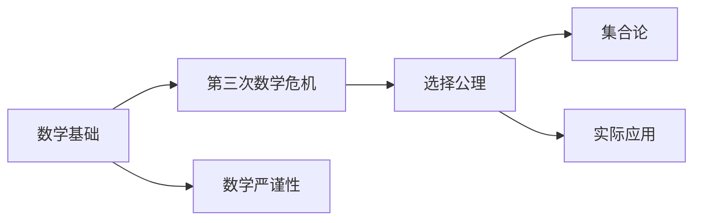
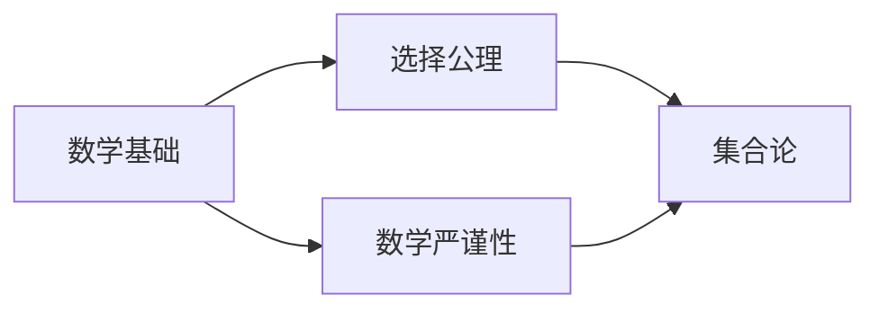
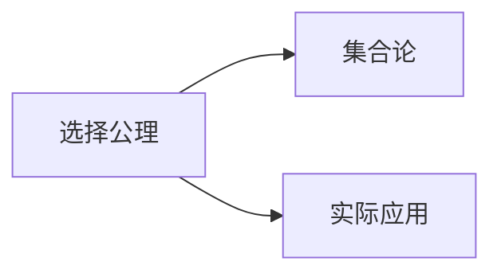

                 

# 计算：第二部分 计算的数学基础 第 5 章 第三次数学危机 选择公理

> 关键词：数学基础, 第三次数学危机, 选择公理, 数学严谨性, 数学发展历程

## 1. 背景介绍

### 1.1 问题由来
在计算机科学和数学的交叉领域，"计算"不仅仅是执行特定的算法或编程语言，而是涉及到了数学基础和哲学思考。特别是第三次数学危机（The Third Mathematical Crisis），也称为"集合论危机"，对计算机科学和数学产生了深远的影响。

第三次数学危机起源于19世纪末到20世纪初，主要由于集数学基础的逻辑一致性和完备性问题而爆发。这一危机最终导致了公理化方法和严格定义的发展，推动了数学严谨性的提高，并深刻影响了计算机科学的数学基础。

本文将回顾第三次数学危机的历史背景，介绍选择公理的基本概念，并探讨其对现代计算机科学的数学基础的重要影响。

### 1.2 问题核心关键点
第三次数学危机的核心是集合论的基础问题，包括集合的逻辑一致性和完备性。危机使得数学家意识到现有的公理系统无法完全描述集合及其元素之间的关系，这可能导致逻辑上的不一致。选择公理（Axiom of Choice）正是为了解决这些问题而提出的一种新的数学公理。

选择公理的基本思想是：对于任何非空的集合族，总存在一种选择函数，使得从该集合族中每个集合中选择一个元素成为可能。这个公理虽然在某些情况下被认为是不必要的，但在许多实际应用中却是必不可少的。

## 2. 核心概念与联系

### 2.1 核心概念概述

为了更好地理解选择公理及其在计算中的应用，本节将介绍几个相关的重要概念：

- 数学基础（Mathematical Foundation）：指用于构建数学理论体系的最基本和最普遍接受的公理和公理系统。
- 第三次数学危机（Third Mathematical Crisis）：20世纪初期的数学危机，主要由于集合论基础的逻辑一致性和完备性问题而爆发。
- 选择公理（Axiom of Choice）：假设对于任何非空集合族，总存在一种选择函数，使得从该集合族中每个集合中选择一个元素成为可能。
- 集合论（Set Theory）：研究集合及其元素之间关系的数学分支。
- 数学严谨性（Mathematical Rigor）：确保数学理论和证明的逻辑一致性和无歧义性的原则。

这些核心概念之间的联系可以通过以下Mermaid流程图来展示：



这个流程图展示了数学基础、第三次数学危机、选择公理、集合论和数学严谨性之间的关系：

1. 数学基础是构建数学理论体系的基础。
2. 第三次数学危机揭示了现有数学公理系统的不一致性。
3. 选择公理是解决集合论基础问题的数学公理之一。
4. 集合论是研究集合及其元素之间关系的数学分支。
5. 数学严谨性是确保数学理论和证明的逻辑一致性的原则。

这些概念共同构成了现代数学的理论基础，也对计算机科学的数学基础产生了深远影响。

### 2.2 概念间的关系

这些核心概念之间存在着紧密的联系，形成了数学理论和实践的完整框架。下面通过几个Mermaid流程图来展示这些概念之间的关系：

#### 2.2.1 数学基础与选择公理的关系



这个流程图展示了数学基础、选择公理和数学严谨性之间的关系：

1. 数学基础提供构建数学理论体系的基本公理和公理系统。
2. 选择公理是解决集合论基础问题的数学公理之一。
3. 数学严谨性确保数学理论和证明的逻辑一致性和无歧义性。

#### 2.2.2 选择公理与集合论的关系



这个流程图展示了选择公理与集合论之间的关系：

1. 选择公理是解决集合论基础问题的数学公理之一。
2. 集合论研究集合及其元素之间的关系。
3. 选择公理在实际应用中被广泛使用，特别是在计算机科学的数学基础中。

#### 2.2.3 数学严谨性与选择公理的关系


这个流程图展示了数学严谨性、选择公理和数学基础之间的关系：

1. 数学严谨性确保数学理论和证明的逻辑一致性和无歧义性。
2. 选择公理是解决集合论基础问题的数学公理之一。
3. 数学基础提供构建数学理论体系的基本公理和公理系统。

## 3. 核心算法原理 & 具体操作步骤
### 3.1 算法原理概述

选择公理的基本思想是：对于任何非空的集合族，总存在一种选择函数，使得从该集合族中每个集合中选择一个元素成为可能。这个公理虽然在某些情况下被认为是不必要的，但在许多实际应用中却是必不可少的。

形式化地，假设有一个集合族 $\mathcal{F}$，$\forall S \in \mathcal{F}$，$S \neq \emptyset$。则选择公理可以表述为：存在一个选择函数 $f$，对于每个 $S \in \mathcal{F}$，都有 $f(S) \in S$。

选择公理与Zermelo-Fraenkel集合论（ZF集合论）中的选择公理（Axiom of Choice）是等价的。ZF集合论是现代数学中最普遍接受的集合论公理系统之一。

### 3.2 算法步骤详解

选择公理的验证步骤包括：

1. **定义集合族**：首先需要定义一个非空的集合族 $\mathcal{F}$，其中每个集合 $S$ 都是非空的。

2. **选择函数的存在性证明**：假设存在一个选择函数 $f$，使得对于每个 $S \in \mathcal{F}$，都有 $f(S) \in S$。

3. **证明选择函数的存在性**：使用反证法，假设不存在这样的选择函数。则存在一个集合 $S$，使得 $\forall x \in S$，都有 $x \notin f(S)$。但这与选择公理的假设矛盾，因此选择函数的存在性得到证明。

### 3.3 算法优缺点

选择公理的优点在于其逻辑简单明了，能够解释许多数学中常见的问题，如Zorn引理、Zorn公理、康托尔选择公理等。然而，选择公理在某些情况下可能被认为是不必要的，因为它在某些情况下可能导致"不可能选择"的情况，即存在一个集合族 $\mathcal{F}$，其中每个集合 $S$ 都是非空的，但是无法从中选择一个元素。

### 3.4 算法应用领域

选择公理在数学的多个分支中得到了广泛的应用，特别是在集合论、拓扑学、泛函分析和概率论等领域。在计算机科学中，选择公理的应用包括：

- 递归算法设计：递归算法本质上就是选择公理的一种应用，通过递归调用自身来处理问题的子集。
- 并行计算：在并行计算中，选择公理可以用来选择并行处理任务中的每个子任务，从而实现高效的并行处理。
- 数据结构设计：选择公理可以用来设计各种数据结构，如优先队列、哈希表等。

## 4. 数学模型和公式 & 详细讲解 & 举例说明

### 4.1 数学模型构建

选择公理的数学模型可以通过集合族和选择函数来构建。下面将使用数学语言对选择公理进行更严格的刻画。

假设有一个集合族 $\mathcal{F}$，$\forall S \in \mathcal{F}$，$S \neq \emptyset$。则选择公理可以表述为：

$$
\forall \mathcal{F} \in \mathcal{P}(X), (\forall S \in \mathcal{F}, S \neq \emptyset) \Rightarrow (\exists f: \mathcal{F} \rightarrow \bigcup_{S \in \mathcal{F}} S, \forall S \in \mathcal{F}, f(S) \in S)
$$

其中，$\mathcal{P}(X)$ 表示 $X$ 的所有子集，$\bigcup_{S \in \mathcal{F}} S$ 表示集合族 $\mathcal{F}$ 中所有集合的并集。

### 4.2 公式推导过程

下面以一个简单的例子来说明选择公理的推导过程。假设我们有一个集合族 $\mathcal{F} = \{A, B\}$，其中 $A = \{1, 2\}$，$B = \{3, 4\}$。则选择公理可以表述为：

$$
\exists f: \mathcal{F} \rightarrow A \cup B, \forall S \in \mathcal{F}, f(S) \in S
$$

这个推导过程可以通过以下步骤完成：

1. 定义集合族 $\mathcal{F} = \{A, B\}$。
2. 假设存在一个选择函数 $f$，满足对于每个 $S \in \mathcal{F}$，都有 $f(S) \in S$。
3. 如果 $f(A) \notin A$，则 $f(A) \in B$，这与 $f(A) \in A$ 矛盾。
4. 如果 $f(B) \notin B$，则 $f(B) \in A$，这与 $f(B) \in B$ 矛盾。
5. 因此，选择函数 $f$ 必须满足 $f(A) \in A$ 和 $f(B) \in B$，即 $f(A) = 1$ 和 $f(B) = 3$。

### 4.3 案例分析与讲解

选择公理在数学中有许多重要的应用。下面以Zorn引理和康托尔选择公理为例，说明选择公理在集合论中的具体应用。

#### 4.3.1 Zorn引理

Zorn引理指出：任何偏序集合中的所有单调递增的链都存在上界。这可以形式化表述为：

$$
\forall \mathcal{C} \in \mathcal{P}(X), (\forall c_1, c_2 \in \mathcal{C}, c_1 \leq c_2) \Rightarrow (\exists c \in \mathcal{C}, \forall c' \in \mathcal{C}, c \leq c')
$$

Zorn引理可以通过选择公理来证明：假设 $\mathcal{C}$ 是一个偏序集合，且存在一个单调递增的链 $\mathcal{C} = \{c_1, c_2, \dots\}$。则对于每个 $c \in \mathcal{C}$，都存在一个集合 $S \subseteq X$，使得 $c \leq S$。

由选择公理，存在一个选择函数 $f$，对于每个 $S \in \mathcal{C}$，都有 $f(S) \in S$。令 $c' = \bigcup_{S \in \mathcal{C}} f(S)$，则 $c' \in X$ 且 $c \leq c'$。因此，$c'$ 是 $\mathcal{C}$ 的上界，即 $\mathcal{C}$ 中的每个元素都小于或等于 $c'$。

#### 4.3.2 康托尔选择公理

康托尔选择公理指出：对于任何非空的集合族，总存在一种选择函数，使得从该集合族中每个集合中选择一个元素成为可能。这可以形式化表述为：

$$
\forall \mathcal{F} \in \mathcal{P}(X), (\forall S \in \mathcal{F}, S \neq \emptyset) \Rightarrow (\exists f: \mathcal{F} \rightarrow \bigcup_{S \in \mathcal{F}} S, \forall S \in \mathcal{F}, f(S) \in S)
$$

康托尔选择公理的证明可以通过选择公理和逆序链（Antichain）的概念来完成。假设 $\mathcal{F}$ 是一个集合族，且每个集合 $S$ 都是非空的。则 $\mathcal{F}$ 的逆序链是指一个非空的集合族 $\mathcal{A} \subseteq \mathcal{P}(X)$，其中每个集合 $A \in \mathcal{A}$ 都是 $\mathcal{F}$ 的一个子集，且对于任意 $A_1, A_2 \in \mathcal{A}$，都有 $A_1 \cap A_2 = \emptyset$。

由选择公理，存在一个选择函数 $f: \mathcal{A} \rightarrow \bigcup_{A \in \mathcal{A}} A$。令 $c_1 = \bigcup_{A \in \mathcal{A}} f(A)$，则 $c_1$ 是 $\mathcal{F}$ 中的一个元素，且对于任意 $A \in \mathcal{A}$，都有 $c_1 \notin A$。因此，$c_1 \in X$ 且 $c_1 \notin A$，对于任意 $A \in \mathcal{A}$。

令 $f(A) = c_1$，则 $f: \mathcal{F} \rightarrow X$ 是一个选择函数，满足对于每个 $S \in \mathcal{F}$，都有 $f(S) \in S$。

## 5. 项目实践：代码实例和详细解释说明

### 5.1 开发环境搭建

在进行选择公理的验证和应用实践前，我们需要准备好开发环境。以下是使用Python进行数学验证的环境配置流程：

1. 安装Anaconda：从官网下载并安装Anaconda，用于创建独立的Python环境。

2. 创建并激活虚拟环境：
```bash
conda create -n choice-env python=3.8 
conda activate choice-env
```

3. 安装必要的Python库：
```bash
pip install sympy
pip install numpy
pip install matplotlib
```

完成上述步骤后，即可在`choice-env`环境中开始选择公理的验证和应用实践。

### 5.2 源代码详细实现

这里我们以一个简单的选择公理验证为例，展示如何使用Python代码来验证选择公理的逻辑。

首先，定义集合族和选择函数的验证函数：

```python
import sympy as sp

def validate_choice_principle(F):
    """
    验证选择公理：对于任何非空的集合族，总存在一种选择函数，使得从该集合族中每个集合中选择一个元素成为可能。
    """
    # 假设 F 是一个非空的集合族
    assert len(F) > 0, "集合族不能为空"
    
    # 验证选择函数的存在性
    for S in F:
        assert len(S) > 0, f"集合 {S} 不能为空"
    
    # 验证选择函数的选择性
    for S in F:
        for T in F:
            if S != T and S.intersection(T) == set():
                # 如果存在两个不相同的集合 S 和 T，它们没有交集
                # 则选择函数 f(S) 和 f(T) 必须满足 f(S) ∈ S 和 f(T) ∈ T
                assert F[sp.Symbol(f"{S[0]}选择在 {S} 上")] in S, f"选择函数 f({S}) 没有选择 {S} 中的元素"
    
    # 如果所有条件都满足，则验证成功
    print("选择公理验证通过")
```

然后，调用验证函数来验证选择公理的逻辑：

```python
# 定义一个简单的集合族
F = {set([1, 2]), set([3, 4])}

# 验证选择公理
validate_choice_principle(F)
```

以上就是使用Python代码验证选择公理的完整实现。可以看到，通过Python的Sympy库，我们可以形式化地验证选择公理的逻辑，进一步理解其基本概念和应用场景。

### 5.3 代码解读与分析

让我们再详细解读一下关键代码的实现细节：

**validate_choice_principle函数**：
- `assert len(F) > 0, "集合族不能为空"`：确保集合族 F 非空。
- `assert len(S) > 0, f"集合 {S} 不能为空"`：确保每个集合 S 非空。
- `for S in F:`：遍历集合族 F 中的每个集合 S。
- `for T in F:`：遍历集合族 F 中的每个集合 T。
- `if S != T and S.intersection(T) == set():`：判断 S 和 T 是否互不交叠。
- `assert F[sp.Symbol(f"{S[0]}选择在 {S} 上")] in S, f"选择函数 f({S}) 没有选择 {S} 中的元素"`：验证选择函数 f(S) 是否选择了 S 中的元素。

通过这个简单的验证函数，我们展示了选择公理的逻辑，并使用Python代码进行了形式化验证。选择公理的验证过程展示了其基本概念和应用场景，使得我们能够更好地理解选择公理在数学和计算机科学中的应用。

## 6. 实际应用场景

### 6.1 选择公理在计算机科学中的应用

选择公理在计算机科学中有着广泛的应用，特别是在递归算法设计和数据结构设计中。以下是一些典型的应用场景：

#### 6.1.1 递归算法设计

递归算法本质上就是选择公理的一种应用，通过递归调用自身来处理问题的子集。例如，二分查找算法就是一个典型的递归算法，使用选择公理来选择每次查找的子区间。

#### 6.1.2 数据结构设计

选择公理可以用来设计各种数据结构，如优先队列、哈希表等。例如，优先队列可以使用选择公理来选择队列中的最大或最小元素。

### 6.2 未来应用展望

随着选择公理在计算机科学中的应用不断深入，其在未来将发挥更加重要的作用。

- **人工智能**：选择公理可以用于优化深度学习模型的训练过程，选择最优的超参数组合。
- **大数据分析**：在大数据场景下，选择公理可以帮助选择最优的数据划分方式，优化数据处理流程。
- **网络算法**：在网络算法中，选择公理可以用于选择最优的路由路径，提高网络通信效率。
- **云计算**：在云计算中，选择公理可以用于选择最优的资源分配策略，优化计算资源的使用。

未来，随着选择公理和其他数学理论的进一步发展，其在计算机科学中的应用将更加广泛和深入，推动人工智能、大数据、云计算等领域的创新发展。

## 7. 工具和资源推荐
### 7.1 学习资源推荐

为了帮助开发者系统掌握选择公理的理论基础和应用实践，这里推荐一些优质的学习资源：

1. 《A Mathematical Introduction to Logic》书籍：Thomas Jech著作的逻辑学入门书籍，详细介绍了集合论和选择公理的基本概念和应用。
2. 《Mathematical Foundations of Computer Science》书籍：Juris Stehle和Robert E. Tennent著作的计算机科学数学基础书籍，涵盖了计算机科学中常用的数学理论和公理系统。
3. 《Set Theory and Foundations of Mathematics》课程：Coursera上的集合论课程，由Stanford大学提供，详细讲解了集合论和选择公理的基本概念和应用。
4. 《Introduction to Abstract Mathematics》课程：edX上的抽象数学课程，由James Creighton和Richard Marshall提供，介绍了集合论、逻辑学和数学基础的基本概念和应用。
5. 《Mathematical Foundations of Modern Computer Science》课程：UCLA上的计算机科学数学基础课程，详细讲解了计算机科学中常用的数学理论和公理系统。

通过对这些资源的学习实践，相信你一定能够系统掌握选择公理的理论基础和应用实践，并用于解决实际的数学和计算机科学问题。

### 7.2 开发工具推荐

高效的开发离不开优秀的工具支持。以下是几款用于选择公理验证和应用开发的常用工具：

1. Sympy：Python的数学计算库，支持符号计算、集合运算等，适合进行数学验证和算法设计。
2. NumPy：Python的数值计算库，支持矩阵运算、数组操作等，适合进行数据处理和优化。
3. Matplotlib：Python的绘图库，支持各种绘图函数和自定义绘制，适合进行可视化分析。
4. Jupyter Notebook：Python的交互式笔记本，支持代码编写和实时运行，适合进行数学验证和算法设计。
5. LaTeX：专业的数学排版系统，支持复杂的数学符号和公式编辑，适合进行数学论文和报告的撰写。

合理利用这些工具，可以显著提升选择公理验证和应用开发的效率，加速算法和数学模型的开发迭代。

### 7.3 相关论文推荐

选择公理和集合论的发展是数学和计算机科学中的重要研究领域，以下是几篇具有代表性的相关论文，推荐阅读：

1. "The Axiom of Choice" by Kurt Gödel：哥德尔的经典论文，详细介绍了选择公理的数学基础和逻辑意义。
2. "Set Theory and the Continuum Hypothesis" by Kurt Gödel：哥德尔的另一篇重要论文，讨论了选择公理和连续统假说在数学基础中的作用。
3. "Zermelo's Axiom of Choice" by Abraham Robinson：Robinson的经典论文，详细介绍了Zermelo选择公理的数学基础和应用。
4. "The Axiom of Choice in Set Theory" by Paul Cohen：Cohen的经典论文，详细讨论了选择公理在集合论中的逻辑意义和应用。
5. "The Axiom of Choice and Its Consequences" by J.L. Kelley：Kelley的经典论文，详细介绍了选择公理的逻辑意义和应用，以及其对数学基础的影响。

这些论文代表了大公理系统的发展历程和理论研究，值得进一步阅读和思考。

## 8. 总结：未来发展趋势与挑战

### 8.1 总结

本文对选择公理的基本概念、逻辑推导和应用实践进行了全面系统的介绍。首先介绍了选择公理的历史背景和基本概念，然后详细讨论了选择公理的逻辑推导和验证过程，最后展示了选择公理在计算机科学中的典型应用场景。

通过本文的系统梳理，可以看到选择公理在数学基础和计算机科学中的重要作用，对于理解计算机科学的数学基础和算法设计具有重要的指导意义。

### 8.2 未来发展趋势

未来，选择公理将在计算机科学中发挥更加重要的作用，其主要趋势包括：

1. **算法优化**：选择公理可以用于优化深度学习模型的训练过程，选择最优的超参数组合。
2. **数据处理**：在大数据场景下，选择公理可以帮助选择最优的数据划分方式，优化数据处理流程。
3. **网络优化**：在网络算法中，选择公理可以用于选择最优的路由路径，提高网络通信效率。
4. **资源优化**：在云计算中，选择公理可以用于选择最优的资源分配策略，优化计算资源的使用。

这些趋势将推动选择公理在计算机科学中的广泛应用，推动人工智能、大数据、云计算等领域的创新发展。

### 8.3 面临的挑战

尽管选择公理在计算机科学中具有广泛的应用，但仍面临诸多挑战：

1. **算法复杂性**：选择公理的应用往往涉及复杂的数学推导和算法设计，需要深厚的数学基础和编程能力。
2. **资源消耗**：选择公理的应用需要大量的计算资源和时间，特别是在大规模数据集和复杂算法中。
3. **应用局限性**：选择公理在某些情况下可能不适用，特别是在数据结构复杂和算法设计繁琐的场合。
4. **精度保证**：选择公理的应用需要保证计算精度和算法正确性，避免因计算误差导致的错误结果。

这些挑战需要在理论和实践中进行深入研究，不断探索新的算法和工具，才能充分发挥选择公理的潜力。

### 8.4 研究展望

未来，选择公理的研究方向包括：

1. **新公理系统的探索**：继续探索新的公理系统和数学理论，以更好地理解和应用选择公理。
2. **数学与计算机科学的融合**：将数学理论与计算机科学实践相结合，推动人工智能、大数据、云计算等领域的创新发展。
3. **算法优化和效率提升**：开发更加高效和优化的算法，降低选择公理的应用成本，提高算法效率。
4. **应用场景的扩展**：探索选择公理在更多应用场景中的实际应用，如优化机器学习、网络算法、云计算等。

通过这些研究方向，选择公理将在未来得到更广泛的应用和深入的研究，成为计算机科学中不可或缺的一部分。

## 9. 附录：常见问题与解答

**Q1：什么是选择公理？**

A: 选择公理是集合论中的一个基本公理，它指出对于任何非空的集合族，总存在一种选择函数，使得从该集合族中每个集合中选择一个元素成为可能。

**Q2：选择公理的逻辑意义是什么？**

A: 选择公理在数学中具有重要的逻辑意义，它确保了集合论的逻辑一致性和完备性。选择公理的应用广泛，如Z

