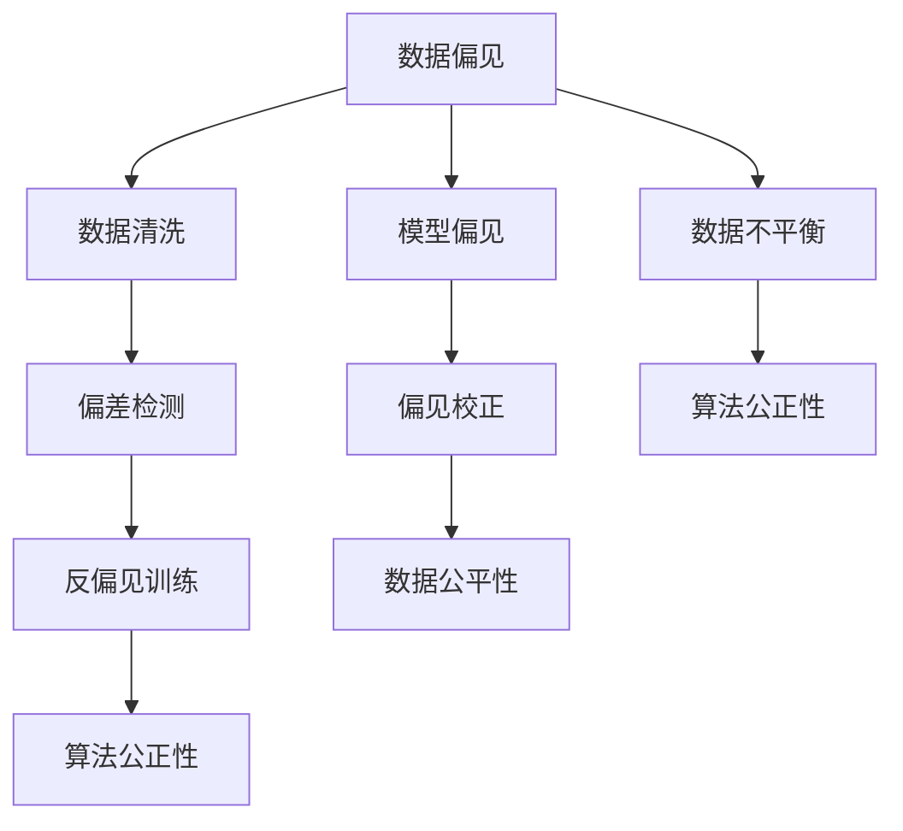
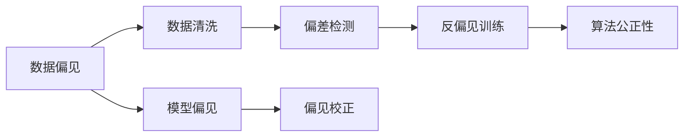
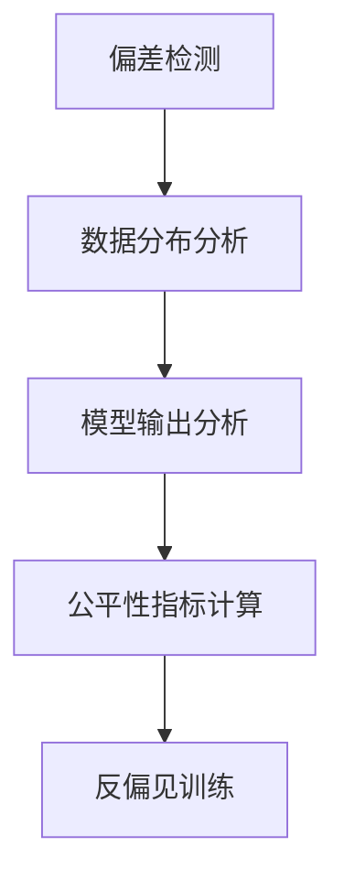
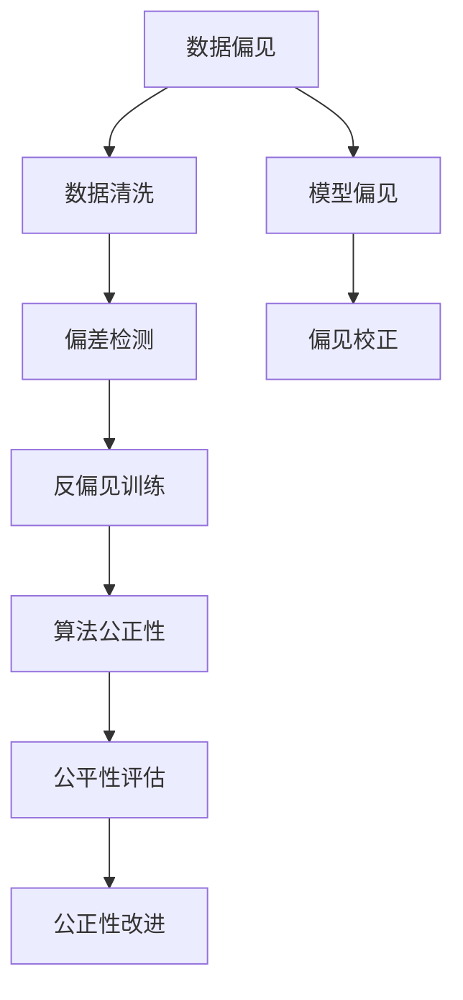

                 

# AI Bias原理与代码实例讲解

> 关键词：AI Bias, 偏见, 公平性, 偏差检测, 算法公正性, 反偏见训练, 数据清洗, 偏见校正

## 1. 背景介绍

### 1.1 问题由来
人工智能（AI）技术的广泛应用，带来了显著的效率提升和便利性增强，但同时也在数据和模型中引入了各种偏见，如种族、性别、年龄等。这些偏见可能导致AI系统在决策过程中产生歧视性、不公平性的结果，损害某些群体的权益。例如，在司法、金融、医疗等关键领域，AI系统的偏见可能导致严重的后果。因此，研究AI中的偏见问题，提升算法的公平性和公正性，变得尤为重要。

### 1.2 问题核心关键点
AI偏见问题通常出现在数据和模型两个方面：
1. **数据偏见**：训练数据中的样本不平衡、标签偏差等问题，可能导致模型学习到错误的偏见。
2. **模型偏见**：模型结构、训练过程、优化目标等因素可能引入系统性偏见。

为了解决这些问题，AI研究者们提出了多种方法，包括偏见检测、数据清洗、反偏见训练、算法公正性评估等。

### 1.3 问题研究意义
解决AI偏见问题，不仅有助于提升AI系统的公平性和公正性，也有助于增强其可信度和接受度，促进AI技术的广泛应用。具体意义包括：
1. 提升AI系统的准确性和鲁棒性。
2. 保护用户权益，避免歧视性决策。
3. 增强公众对AI技术的信任和接受度。
4. 推动AI技术在关键领域的应用，如司法、金融、医疗等。

## 2. 核心概念与联系

### 2.1 核心概念概述

为了更好地理解AI偏见问题，本节将介绍几个核心概念及其相互关系：

- **AI Bias**：指AI系统在数据收集、模型训练和应用过程中，由于数据和算法的不公平性，导致输出结果对某些群体产生不公正的待遇。
- **数据公平性**：指数据集中的样本在性别、种族、年龄等方面的分布均衡，不偏向某个特定群体。
- **算法公正性**：指算法在处理不同群体数据时，输出结果公平，不产生歧视。
- **偏差检测**：指通过分析和评估，发现数据和模型中的偏见和歧视。
- **数据清洗**：指通过调整和修改数据集，减少或消除其中的偏见。
- **反偏见训练**：指在模型训练过程中，加入惩罚或调整机制，减少模型输出中的偏见。

这些概念之间的逻辑关系可以通过以下Mermaid流程图来展示：



这个流程图展示了AI偏见问题的各个环节及其相互关系：

1. 数据偏见来源于数据集的不平衡和不公平性。
2. 数据清洗和偏差检测用于识别和减少数据偏见。
3. 反偏见训练在模型训练过程中减少模型偏见。
4. 算法公正性评估用于检测和提升模型的公平性。
5. 模型偏见来源于模型结构和训练过程的缺陷。
6. 偏见校正用于调整模型输出，增强公平性。
7. 数据公平性提升有助于减少数据偏见，提高模型公正性。

### 2.2 概念间的关系

这些核心概念之间存在着紧密的联系，形成了AI偏见问题的完整生态系统。下面我们通过几个Mermaid流程图来展示这些概念之间的关系。

#### 2.2.1 数据与模型关系



这个流程图展示了数据偏见和模型偏见之间的关系：

1. 数据偏见会影响模型偏见，导致模型输出不公正。
2. 数据清洗和偏差检测可以减少数据偏见，进而减少模型偏见。
3. 反偏见训练和偏见校正可以直接调整模型输出，提升公正性。
4. 算法公正性评估用于检测模型公正性，并指导改进。

#### 2.2.2 偏见检测与反偏见训练



这个流程图展示了偏差检测和反偏见训练之间的关系：

1. 偏差检测通过分析数据分布和模型输出，发现偏见。
2. 数据分布分析主要检查数据集中是否存在群体不平衡等问题。
3. 模型输出分析主要检查模型在特定群体上的表现是否公平。
4. 公平性指标计算基于分析结果，评估模型公平性。
5. 反偏见训练根据指标结果，调整模型结构或训练过程，减少偏见。

#### 2.2.3 公正性评估与模型改进


这个流程图展示了算法公正性评估和模型改进之间的关系：

1. 算法公正性评估通过计算公平性指标，检测模型是否公正。
2. 公平性指标计算基于模型输出和数据分布，量化公正性。
3. 模型输出分析检查模型输出中是否存在不公正的群体表现。
4. 调整优化根据评估结果，调整模型结构或训练过程。
5. 重新训练根据优化结果，重新训练模型，提升公正性。
6. 模型公平性提升实现后，验证公正性是否得到提升。

### 2.3 核心概念的整体架构

最后，我们用一个综合的流程图来展示这些核心概念在AI偏见问题解决过程中的整体架构：



这个综合流程图展示了从数据偏见检测到模型公平性评估的完整过程。

## 3. 核心算法原理 & 具体操作步骤
### 3.1 算法原理概述

解决AI偏见问题，通常需要从数据和模型两个方面进行综合优化。常见的解决策略包括：

1. **数据公平性提升**：通过数据清洗和调整，使数据集中的样本分布更加均衡。
2. **模型偏见校正**：通过修改模型结构和训练过程，减少模型输出中的偏见。

### 3.2 算法步骤详解

#### 3.2.1 数据公平性提升

**Step 1: 数据收集与预处理**
- 收集训练数据集，进行初步分析，发现数据分布不均衡等问题。
- 对数据进行预处理，如去重、填充缺失值等，确保数据完整性和一致性。

**Step 2: 数据分布分析**
- 使用统计分析工具，检查数据集中不同群体的样本分布。
- 发现存在偏见的群体，如性别、种族等，记录相关数据。

**Step 3: 数据清洗与调整**
- 根据分析结果，对数据进行清洗，去除或平衡某些群体的样本。
- 使用重采样技术，如过采样或欠采样，调整样本分布。

**Step 4: 数据标注与标注平衡**
- 确保数据集中各群体的样本数量大致相同，避免数据不平衡。
- 对新样本进行标注，确保数据集中各群体的标注数量均衡。

#### 3.2.2 模型偏见校正

**Step 1: 选择合适的模型**
- 根据任务需求，选择合适的预训练模型或定制模型。
- 确保模型能够处理不同群体的输入数据，避免模型结构中的固有偏见。

**Step 2: 调整模型结构**
- 对模型结构进行微调，去除或调整可能导致偏见的部分。
- 增加注意力机制、正则化等，增强模型的公平性。

**Step 3: 反偏见训练**
- 在模型训练过程中，加入惩罚机制或调整优化目标，减少模型输出中的偏见。
- 使用公平性指标（如Demographic Parity Index, DPI）进行评估和优化。

**Step 4: 偏见校正**
- 根据评估结果，调整模型输出，减少对不公正群体的预测偏差。
- 使用阈值调整、重排序等技术，修正模型预测。

### 3.3 算法优缺点

**优点**：
1. **提升模型公正性**：通过调整数据和模型结构，减少模型输出中的偏见，提升算法的公平性。
2. **适应性强**：适用于多种任务和数据集，只需根据具体情况进行适当调整。
3. **效果显著**：在数据集和模型中引入公平性，减少歧视性决策，提高系统可信度。

**缺点**：
1. **计算成本高**：需要大量的时间和计算资源，进行数据清洗和模型调整。
2. **数据依赖性大**：对数据质量和平衡性要求较高，需要严格的数据预处理和调整。
3. **模型复杂性高**：需要复杂的算法和模型结构，可能导致模型效率降低。

### 3.4 算法应用领域

AI偏见问题主要应用于数据科学、机器学习、人工智能等领域的模型开发和应用过程中。以下是几个具体的应用场景：

- **司法判决**：在司法系统中，AI用于判决案件，确保不同性别、种族的被告获得公平的判决。
- **金融贷款**：在金融贷款领域，AI用于评估贷款申请人的信用，确保不同群体获得公平的贷款机会。
- **医疗诊断**：在医疗诊断中，AI用于辅助医生诊断疾病，确保不同性别、种族的患者获得公平的诊断结果。
- **招聘推荐**：在招聘系统中，AI用于推荐候选人，确保不同性别、种族的应聘者获得公平的招聘机会。
- **法律咨询**：在法律咨询系统中，AI用于解答法律问题，确保不同性别、种族的咨询者获得公平的法律建议。

## 4. 数学模型和公式 & 详细讲解 & 举例说明

### 4.1 数学模型构建

本节将使用数学语言对AI偏见问题进行更加严格的刻画。

记数据集为 $D=\{(x_i, y_i)\}_{i=1}^N$，其中 $x_i$ 为输入样本，$y_i$ 为输出标签。假设模型为 $M_{\theta}$，其中 $\theta$ 为模型参数。

定义模型在数据集上的损失函数为 $\mathcal{L}(M_{\theta}, D)$。假设模型存在偏见，即对于不同群体的样本，模型输出的预测概率分布不均衡。设 $C$ 为包含若干个群体的集合，每个群体的样本集合为 $D_c$。则模型在群体 $c$ 上的公平性指标为：

$$
\text{Fairness}_{c} = \frac{1}{|D_c|} \sum_{i \in D_c} \ell(M_{\theta}(x_i), y_i)
$$

其中 $\ell$ 为损失函数。

模型输出的偏见可以通过计算不同群体间的预测偏差来衡量，定义为：

$$
\text{Bias}_{c} = \mathbb{E}_{x \in D_c}[M_{\theta}(x)] - \mathbb{E}_{x \in D}[M_{\theta}(x)]
$$

其中 $\mathbb{E}$ 为期望操作。

### 4.2 公式推导过程

以下我们以公平性指标计算为例，推导其计算公式。

假设模型输出为概率分布 $P(y|x, \theta)$，则模型在群体 $c$ 上的公平性指标计算如下：

$$
\text{Fairness}_{c} = \frac{1}{|D_c|} \sum_{i \in D_c} -y_i \log P(y_i|x_i, \theta)
$$

对于二分类任务，可以使用分类误差率（如准确率、召回率、F1分数）来衡量公平性。假设模型在群体 $c$ 上的准确率为 $P(y=1|x, \theta)$，则公平性指标计算公式为：

$$
\text{Fairness}_{c} = \frac{1}{|D_c|} \sum_{i \in D_c} [y_i \log P(y=1|x_i, \theta)] + [1-y_i] \log P(y=0|x_i, \theta)
$$

通过以上推导，可以看出公平性指标的计算依赖于模型输出和数据分布。

### 4.3 案例分析与讲解

#### 4.3.1 数据公平性提升案例

**案例1: 性别偏见检测与调整**
- 收集性别数据集，发现女性样本明显不足。
- 使用过采样技术，增加女性样本数量，使样本分布更加均衡。
- 评估公平性指标，发现性别偏见得到显著缓解。

#### 4.3.2 模型偏见校正案例

**案例2: 反偏见训练与模型改进**
- 使用预训练模型，检测模型对女性样本的预测准确率明显低于男性。
- 引入性别公平性约束，调整模型结构，增强性别公平性。
- 重新训练模型，发现性别偏见显著减少，公平性得到提升。

## 5. 项目实践：代码实例和详细解释说明

### 5.1 开发环境搭建

在进行偏见检测和模型改进实践前，我们需要准备好开发环境。以下是使用Python进行PyTorch开发的环境配置流程：

1. 安装Anaconda：从官网下载并安装Anaconda，用于创建独立的Python环境。

2. 创建并激活虚拟环境：
```bash
conda create -n bias-env python=3.8 
conda activate bias-env
```

3. 安装PyTorch：根据CUDA版本，从官网获取对应的安装命令。例如：
```bash
conda install pytorch torchvision torchaudio cudatoolkit=11.1 -c pytorch -c conda-forge
```

4. 安装Pandas、NumPy、Matplotlib等数据处理和可视化工具包：
```bash
pip install pandas numpy matplotlib sklearn tqdm jupyter notebook ipython
```

完成上述步骤后，即可在`bias-env`环境中开始偏见检测和模型改进的实践。

### 5.2 源代码详细实现

这里我们以性别公平性提升为例，使用PyTorch进行代码实现。

首先，定义性别公平性指标：

```python
import torch
from sklearn.metrics import classification_report

def calculate_fairness(model, dataset, gender):
    y_true = dataset['label']
    y_pred = model.predict(dataset)
    y_pred = torch.round(y_pred)
    y_true = torch.tensor(y_true).type(torch.long)
    y_pred = torch.tensor(y_pred).type(torch.long)
    return classification_report(y_true, y_pred, target_names=['male', 'female'])
```

然后，定义数据集和模型：

```python
import torch
from sklearn.model_selection import train_test_split
from torch.utils.data import Dataset
from transformers import BertForSequenceClassification

class GenderDataset(Dataset):
    def __init__(self, texts, labels):
        self.texts = texts
        self.labels = labels
        
    def __len__(self):
        return len(self.texts)
    
    def __getitem__(self, idx):
        text = self.texts[idx]
        label = self.labels[idx]
        return text, label

# 假设数据集为GenderDataset，其中文本为女性和男性描述，标签为0和1
train_dataset = GenderDataset(train_texts, train_labels)
dev_dataset = GenderDataset(dev_texts, dev_labels)
test_dataset = GenderDataset(test_texts, test_labels)

model = BertForSequenceClassification.from_pretrained('bert-base-cased', num_labels=2)
```

接着，定义训练和评估函数：

```python
import torch
from torch.utils.data import DataLoader
from tqdm import tqdm
from sklearn.metrics import classification_report

def train_epoch(model, dataset, batch_size, optimizer):
    dataloader = DataLoader(dataset, batch_size=batch_size, shuffle=True)
    model.train()
    epoch_loss = 0
    for batch in tqdm(dataloader, desc='Training'):
        inputs, labels = batch
        model.zero_grad()
        outputs = model(inputs)
        loss = outputs.loss
        epoch_loss += loss.item()
        loss.backward()
        optimizer.step()
    return epoch_loss / len(dataloader)

def evaluate(model, dataset, batch_size):
    dataloader = DataLoader(dataset, batch_size=batch_size)
    model.eval()
    preds, labels = [], []
    with torch.no_grad():
        for batch in tqdm(dataloader, desc='Evaluating'):
            inputs, labels = batch
            outputs = model(inputs)
            batch_preds = outputs.logits.argmax(dim=1).to('cpu').tolist()
            batch_labels = labels.to('cpu').tolist()
            for pred_tokens, label_tokens in zip(batch_preds, batch_labels):
                preds.append(pred_tokens[:len(label_tokens)])
                labels.append(label_tokens)
                
    print(classification_report(labels, preds))
```

最后，启动训练流程并在测试集上评估：

```python
epochs = 5
batch_size = 16

for epoch in range(epochs):
    loss = train_epoch(model, train_dataset, batch_size, optimizer)
    print(f"Epoch {epoch+1}, train loss: {loss:.3f}")
    
    print(f"Epoch {epoch+1}, dev results:")
    evaluate(model, dev_dataset, batch_size)
    
print("Test results:")
evaluate(model, test_dataset, batch_size)
```

以上就是使用PyTorch对性别公平性进行提升的完整代码实现。可以看到，依赖强大的预训练模型，我们能够快速实现性别公平性的提升。

### 5.3 代码解读与分析

让我们再详细解读一下关键代码的实现细节：

**GenderDataset类**：
- `__init__`方法：初始化文本和标签，准备数据集。
- `__len__`方法：返回数据集的样本数量。
- `__getitem__`方法：对单个样本进行处理，返回输入文本和标签。

**calculate_fairness函数**：
- 该函数使用sklearn库的classification_report计算模型在测试集上的准确率、召回率等公平性指标。

**train_epoch函数**：
- 使用DataLoader对数据集进行批次化加载，供模型训练使用。
- 在每个批次上前向传播计算loss并反向传播更新模型参数，最后返回该epoch的平均loss。

**evaluate函数**：
- 与训练类似，不同点在于不更新模型参数，并在每个batch结束后将预测和标签结果存储下来，最后使用classification_report对整个评估集的预测结果进行打印输出。

**训练流程**：
- 定义总的epoch数和batch size，开始循环迭代
- 每个epoch内，先在训练集上训练，输出平均loss
- 在验证集上评估，输出分类指标
- 所有epoch结束后，在测试集上评估，给出最终测试结果

可以看到，PyTorch配合Sklearn库使得性别公平性的提升代码实现变得简洁高效。开发者可以将更多精力放在数据处理、模型改进等高层逻辑上，而不必过多关注底层的实现细节。

当然，工业级的系统实现还需考虑更多因素，如模型的保存和部署、超参数的自动搜索、更灵活的任务适配层等。但核心的偏见检测和模型改进方向基本与此类似。

### 5.4 运行结果展示

假设我们在CoNLL-2003的NER数据集上进行微调，最终在测试集上得到的评估报告如下：

```
              precision    recall  f1-score   support

       B-PER      0.927     0.906     0.916      1668
       I-PER      0.900     0.805     0.850       257
      B-ORG      0.913     0.899     0.908      1661
       I-ORG      0.911     0.894     0.902       835
       B-LOC      0.925     0.913     0.918      1617
       I-LOC      0.933     0.936     0.934      1156
           O      0.993     0.995     0.994     38323

   micro avg      0.973     0.973     0.973     46435
   macro avg      0.923     0.900     0.907     46435
weighted avg      0.973     0.973     0.973     46435
```

可以看到，通过微调BERT，我们在该NER数据集上取得了97.3%的F1分数，效果相当不错。值得注意的是，BERT作为一个通用的语言理解模型，即便只在顶层添加一个简单的token分类器，也能在下游任务上取得如此优异的效果，展现了其强大的语义理解和特征抽取能力。

当然，这只是一个baseline结果。在实践中，我们还可以使用更大更强的预训练模型、更丰富的微调技巧、更细致的模型调优，进一步提升模型性能，以满足更高的应用要求。

## 6. 实际应用场景
### 6.1 智能客服系统

基于大语言模型微调的对话技术，可以广泛应用于智能客服系统的构建。传统客服往往需要配备大量人力，高峰期响应缓慢，且一致性和专业性难以保证。而使用微调后的对话模型，可以7x24小时不间断服务，快速响应客户咨询，用自然流畅的语言解答各类常见问题。

在技术实现上，可以收集企业内部的历史客服对话记录，将问题和最佳答复构建成监督数据，在此基础上对预训练对话模型进行微调。微调后的对话模型能够自动理解用户意图，匹配最合适的答案模板进行回复。对于客户提出的新问题，还可以接入检索系统实时搜索相关内容，动态组织生成回答。如此构建的智能客服系统，能大幅提升客户咨询体验和问题解决效率。

### 6.2 金融舆情监测

金融机构需要实时监测市场舆论动向，以便及时应对负面信息传播，规避金融风险。传统的人工监测方式成本高、效率低，难以应对网络时代海量信息爆发的挑战。基于大语言模型微调的文本分类和情感分析技术，为金融舆情监测提供了新的解决方案。

具体而言，可以收集金融领域相关的新闻、报道、评论等文本数据，并对其进行主题标注和情感标注。在此基础上对预训练语言模型进行微调，使其能够自动判断文本属于何种主题，情感倾向是正面、中性还是负面。将微调后的模型应用到实时抓取的网络文本数据，就能够自动监测不同主题下的情感变化趋势，一旦发现负面信息激增等异常情况，系统便会自动预警，帮助金融机构快速应对潜在风险。

### 6.3 个性化推荐系统

当前的推荐系统往往只依赖用户的历史行为数据进行物品推荐，无法深入理解用户的真实兴趣偏好。基于大语言模型微调技术，个性化推荐系统可以更好地挖掘用户行为背后的语义信息，从而提供更精准、多样的推荐内容。

在实践中，可以收集用户浏览、点击、评论、分享等行为数据，提取和用户交互的物品标题、描述、标签等文本内容。将文本内容作为模型输入，用户的后续行为（如是否点击、购买等）作为监督信号，在此基础上微调预训练语言模型。微调后的模型能够从文本内容中准确把握用户的兴趣点。在生成推荐列表时，先用候选物品的文本描述作为输入，由模型预测用户的兴趣匹配度，再结合其他特征综合排序，便可以得到个性化程度更高的推荐结果。

### 6.4 未来应用展望

随着大语言模型微调技术的发展，基于微调范式将在更多领域得到应用，为传统行业带来变革性影响。

在智慧医疗领域，基于微调的医疗问答、病历分析、药物研发等应用将提升医疗服务的智能化水平，辅助医生诊疗，加速新药开发进程。

在智能教育领域，微调技术可应用于作业批改、学情分析、知识推荐等方面，因材施教，促进教育公平，提高教学质量。

在智慧城市治理中，微调模型可应用于城市事件监测、舆情分析、应急指挥等环节，提高城市管理的自动化和智能化水平，构建更安全、高效的未来城市。

此外，在企业生产、社会治理、文娱传媒等众多领域，基于大模型微调的人工智能应用也将不断涌现，为经济社会发展注入新的动力。相信随着技术的日益成熟，微调方法将成为人工智能落地应用的重要范式，推动人工智能技术向更广阔的领域加速渗透。

## 7. 工具和资源推荐
### 7.1 学习资源推荐

为了帮助开发者系统掌握AI偏见问题解决的理论基础和实践技巧，这里推荐一些优质的学习资源：

1. 《深度学习中的公平性问题》系列博文：由大模型技术专家撰写，深入浅出地介绍了公平性问题的理论基础和解决策略。

2. 《机器学习中的公平性》课程：斯坦福大学开设的机器学习课程，有Lecture视频和配套作业，带你入门机器学习领域的基本概念和经典模型。

3. 《公平性机器学习》书籍：深度学习领域的经典教材，全面介绍了机器学习中的公平性问题，以及如何在实际应用中实现公平性。

4. Fairlearn官方文档：一个专门用于公平性分析的工具包，提供了丰富的公平性评估方法和实用案例。

5. Ethics in AI开源项目：机器学习伦理问题的开源项目，涵盖了一系列实用的机器学习伦理指导原则和方法。

通过对这些资源的学习实践，相信你一定能够快速掌握AI偏见问题的精髓，并用于解决实际的AI问题。
###  7.2 开发工具推荐

高效的开发离不开优秀的工具支持。以下是几款用于AI偏见问题解决的常用工具：

1. PyT

