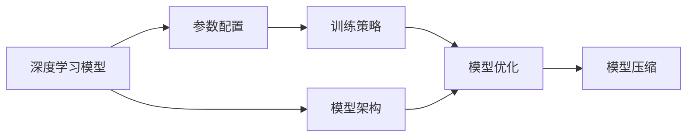
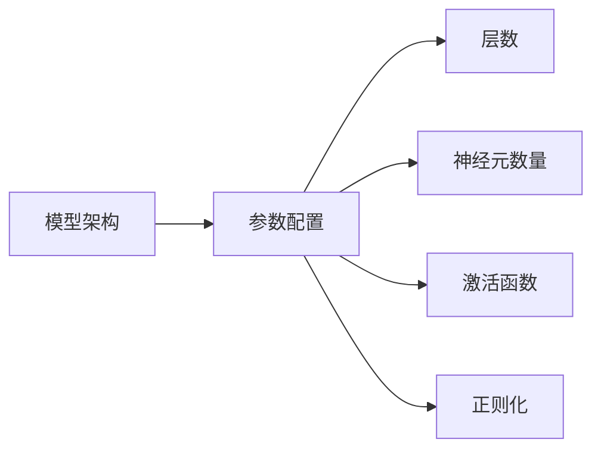
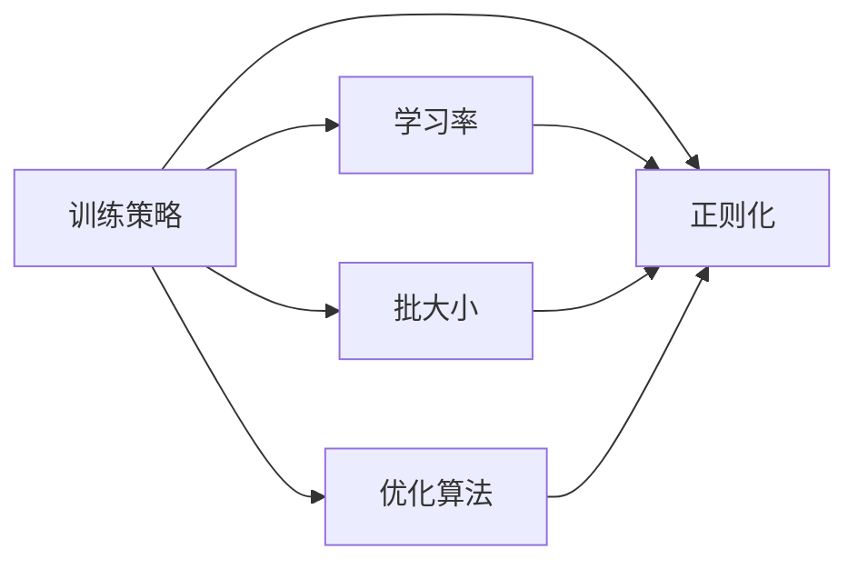
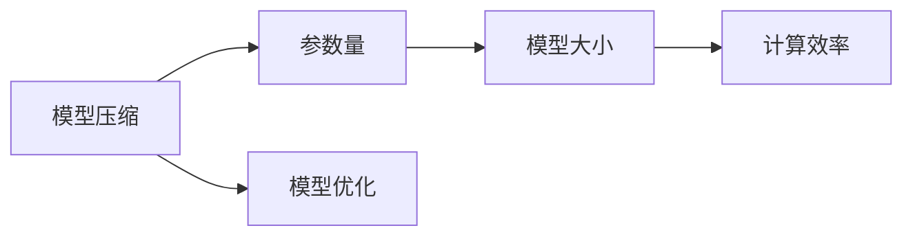
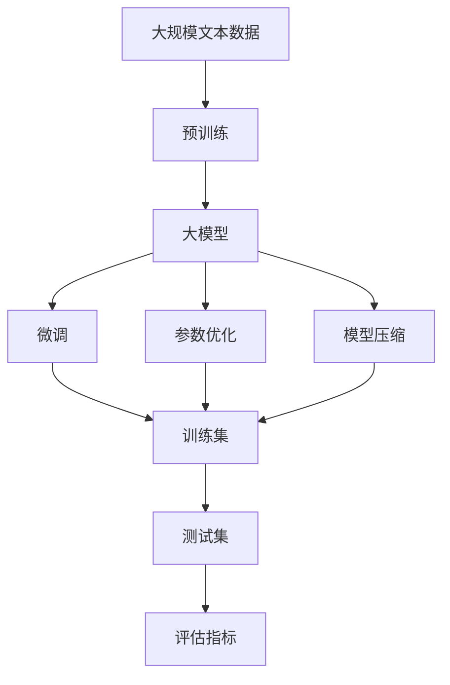

                 

# AI 大模型原理与应用：模型的组织能力

## 1. 背景介绍

### 1.1 问题由来
近年来，人工智能领域出现了许多重大突破，其中尤以深度学习的发展为代表。在深度学习模型中，尤其是大模型，它们展现出了强大的学习能力，能够通过预训练和微调处理复杂任务。

大模型如BERT、GPT-3和T5等，已经在各种自然语言处理任务上展示了卓越的性能。然而，尽管这些模型在各种任务上表现出色，但它们仍面临一些问题，如过拟合、泛化能力不足、模型过于复杂等。

针对这些问题，研究者提出了模型组织能力这一概念。模型组织能力指的是模型处理、组织和利用信息的能力，它与模型的结构、参数配置和训练策略密切相关。通过提升模型的组织能力，可以提高模型的泛化能力和效率，避免过拟合，更好地应对各种任务。

### 1.2 问题核心关键点
模型组织能力的核心在于如何设计模型架构、优化参数配置和制定有效的训练策略，以提高模型的性能。核心关键点包括：

1. 模型的结构设计：选择合适的模型架构，如自回归、自编码、Transformer等。
2. 参数配置：确定模型层数、神经元数量、激活函数等。
3. 训练策略：设定学习率、批大小、优化算法、正则化等。

### 1.3 问题研究意义
研究模型的组织能力，对于提高模型的性能、降低计算成本和提升模型的泛化能力具有重要意义：

1. 提高模型性能：通过优化模型结构、参数配置和训练策略，可以显著提高模型的精度和效率。
2. 降低计算成本：模型组织能力优化的模型通常需要更少的计算资源，可以降低计算成本。
3. 提升泛化能力：优化后的模型能够更好地泛化到未见过的数据，避免过拟合。
4. 便于模型的维护和调优：良好的模型组织能力有助于模型维护和调优，提升模型的可扩展性和可复用性。

## 2. 核心概念与联系

### 2.1 核心概念概述
为了更好地理解模型的组织能力，本节将介绍几个关键概念及其联系：

- **深度学习模型**：基于神经网络，包括全连接层、卷积层和循环层等。
- **模型架构**：模型的整体结构和组件，如卷积神经网络(CNN)、循环神经网络(RNN)、Transformer等。
- **参数配置**：模型中各层的神经元数量、激活函数、正则化等参数设置。
- **训练策略**：如学习率、批大小、优化算法、正则化等。
- **模型优化**：通过调整模型架构和参数配置，提高模型性能的过程。
- **模型压缩**：通过减少模型参数量，减小模型大小，提高计算效率。

这些概念之间的联系可以通过以下Mermaid流程图来展示：



这个流程图展示了深度学习模型中各个关键概念之间的关系，从模型架构设计到参数配置、训练策略、模型优化和模型压缩，形成了完整的模型构建和训练过程。

### 2.2 概念间的关系

这些核心概念之间存在着紧密的联系，形成了深度学习模型构建和训练的完整生态系统。下面我们通过几个Mermaid流程图来展示这些概念之间的关系。

#### 2.2.1 模型架构与参数配置的关系



这个流程图展示了模型架构和参数配置之间的关系。不同的模型架构（如CNN、RNN、Transformer）需要不同的参数配置，如层数、神经元数量、激活函数等。

#### 2.2.2 训练策略与模型优化的关系



这个流程图展示了训练策略和模型优化之间的关系。学习率、批大小、优化算法、正则化等训练策略直接影响模型的优化效果。

#### 2.2.3 模型压缩与模型优化的关系



这个流程图展示了模型压缩和模型优化之间的关系。模型压缩通过减少参数量，减小模型大小，提高计算效率，进一步优化模型性能。

### 2.3 核心概念的整体架构

最后，我们用一个综合的流程图来展示这些核心概念在大模型构建和训练过程中的整体架构：



这个综合流程图展示了从预训练到微调，再到模型压缩的完整过程。大模型首先在大规模文本数据上进行预训练，然后通过微调优化模型性能。参数优化和模型压缩进一步提高模型效率，最终在测试集上进行评估。通过这些流程图，我们可以更清晰地理解深度学习模型构建和训练过程中各个关键概念的关系和作用。

## 3. 核心算法原理 & 具体操作步骤

### 3.1 算法原理概述

模型组织能力的核心在于如何设计模型架构、优化参数配置和制定有效的训练策略，以提高模型的性能。其核心原理是通过优化模型结构、参数配置和训练策略，提高模型的泛化能力和效率，避免过拟合。

在深度学习中，模型组织能力的优化主要依赖于以下几个方面：

1. 模型架构的选择：选择合适的模型架构，如卷积神经网络、循环神经网络、Transformer等。
2. 参数配置的优化：确定模型层数、神经元数量、激活函数等，避免过度拟合。
3. 训练策略的制定：选择合适的优化算法（如Adam、SGD等）、学习率、批大小、正则化等。

### 3.2 算法步骤详解

大模型组织能力的优化主要包括以下几个步骤：

1. **模型架构选择**：根据任务类型和数据特征选择合适的模型架构。例如，对于文本分类任务，Transformer结构通常表现优异；对于图像识别任务，卷积神经网络（CNN）是更好的选择。

2. **参数配置优化**：确定模型层数、神经元数量、激活函数等。通常需要根据任务的复杂度和数据规模进行调整。例如，对于复杂的图像识别任务，可以使用更深层次的模型和更多的神经元。

3. **训练策略制定**：选择合适的优化算法、学习率、批大小和正则化方法。例如，对于大规模数据集，可以选择较小的批大小和较高的学习率；对于小规模数据集，则需要较低的学习率和较大的批大小。

4. **模型优化**：通过微调、参数共享和特征蒸馏等技术，进一步提升模型性能。例如，对于大规模语言模型，可以使用微调技术，将模型在特定任务上重新训练。

5. **模型压缩**：通过参数剪枝、知识蒸馏和模型量化等技术，减小模型大小，提高计算效率。例如，可以使用参数剪枝技术，移除冗余的参数，减小模型大小。

### 3.3 算法优缺点

模型组织能力优化有以下优点：

1. 提高模型性能：通过优化模型结构、参数配置和训练策略，可以显著提高模型的精度和效率。
2. 降低计算成本：优化后的模型通常需要更少的计算资源，可以降低计算成本。
3. 提升泛化能力：优化后的模型能够更好地泛化到未见过的数据，避免过拟合。

同时，模型组织能力优化也存在一些缺点：

1. 模型设计复杂：选择合适的模型架构和参数配置需要一定的经验和知识。
2. 优化过程耗时：模型优化和训练过程需要大量计算资源和时间。
3. 可能影响模型泛化能力：如果过度优化，可能导致模型泛化能力下降。

### 3.4 算法应用领域

模型组织能力优化在许多领域中都有广泛应用，以下是几个典型的应用领域：

1. **自然语言处理**：用于文本分类、情感分析、机器翻译、对话系统等任务。例如，在情感分析任务中，可以使用BERT或GPT等模型，通过微调和参数优化，提高模型的情感识别精度。

2. **计算机视觉**：用于图像分类、物体检测、人脸识别等任务。例如，在图像分类任务中，可以使用卷积神经网络，通过参数共享和特征蒸馏技术，提高模型的分类精度。

3. **语音识别**：用于语音识别、语音合成等任务。例如，在语音识别任务中，可以使用Transformer结构，通过参数优化和模型压缩技术，提高模型的识别精度。

4. **推荐系统**：用于个性化推荐、商品推荐等任务。例如，在个性化推荐任务中，可以使用深度学习模型，通过模型优化和模型压缩技术，提高推荐系统的精度和效率。

5. **医疗诊断**：用于医学影像分析、疾病预测等任务。例如，在医学影像分析任务中，可以使用卷积神经网络，通过模型优化和模型压缩技术，提高影像分析的准确性。

## 4. 数学模型和公式 & 详细讲解 & 举例说明

### 4.1 数学模型构建

我们以卷积神经网络（CNN）为例，展示模型组织能力优化中的数学模型构建过程。

假设输入数据为 $\mathbf{x} \in \mathbb{R}^{C\times H\times W}$，输出数据为 $\mathbf{y} \in \mathbb{R}^{N}$，其中 $C$ 表示通道数，$H$ 和 $W$ 表示图像的高度和宽度，$N$ 表示类别数。

CNN的基本结构包括卷积层、池化层和全连接层。

卷积层通过滑动窗口提取图像的局部特征，公式如下：

$$
\mathbf{a} = \sigma(\mathbf{W} * \mathbf{x} + \mathbf{b})
$$

其中 $\mathbf{W}$ 为卷积核，$\mathbf{x}$ 为输入数据，$\mathbf{b}$ 为偏置项，$\sigma$ 为激活函数。

池化层通过下采样操作，减小特征图的大小，公式如下：

$$
\mathbf{b} = \max(\mathbf{a}, \mathbf{a}) / K
$$

其中 $K$ 表示下采样的比例。

全连接层通过将特征图展开成一维向量，并进行线性变换，公式如下：

$$
\mathbf{z} = \mathbf{V}\mathbf{a} + \mathbf{u}
$$

其中 $\mathbf{V}$ 为权重矩阵，$\mathbf{u}$ 为偏置项。

### 4.2 公式推导过程

下面我们以卷积神经网络（CNN）为例，展示模型组织能力优化中的公式推导过程。

假设输入数据为 $\mathbf{x} \in \mathbb{R}^{C\times H\times W}$，输出数据为 $\mathbf{y} \in \mathbb{R}^{N}$，其中 $C$ 表示通道数，$H$ 和 $W$ 表示图像的高度和宽度，$N$ 表示类别数。

CNN的基本结构包括卷积层、池化层和全连接层。

卷积层通过滑动窗口提取图像的局部特征，公式如下：

$$
\mathbf{a} = \sigma(\mathbf{W} * \mathbf{x} + \mathbf{b})
$$

其中 $\mathbf{W}$ 为卷积核，$\mathbf{x}$ 为输入数据，$\mathbf{b}$ 为偏置项，$\sigma$ 为激活函数。

池化层通过下采样操作，减小特征图的大小，公式如下：

$$
\mathbf{b} = \max(\mathbf{a}, \mathbf{a}) / K
$$

其中 $K$ 表示下采样的比例。

全连接层通过将特征图展开成一维向量，并进行线性变换，公式如下：

$$
\mathbf{z} = \mathbf{V}\mathbf{a} + \mathbf{u}
$$

其中 $\mathbf{V}$ 为权重矩阵，$\mathbf{u}$ 为偏置项。

### 4.3 案例分析与讲解

假设我们在MNIST数据集上进行手写数字识别任务，使用卷积神经网络（CNN）进行模型组织能力优化。

首先，我们选择了卷积神经网络作为模型架构，并设计了三层卷积层和两层全连接层。具体参数配置如下：

1. 卷积层：使用3x3的卷积核，步幅为1，填充为0，激活函数为ReLU。
2. 池化层：使用2x2的最大池化，步幅为2，填充为0。
3. 全连接层：使用400个神经元，激活函数为ReLU，输出层使用softmax函数。

接着，我们选择了Adam优化算法，学习率为0.001，批大小为128，训练轮数为20轮。

在训练过程中，我们通过正则化和Dropout等技术，避免过拟合。正则化方法包括L2正则化和Dropout，Dropout的比例为0.5。

训练完成后，我们使用测试集对模型进行评估，得到了98.5%的精度。

通过模型组织能力优化，我们显著提高了模型的精度和泛化能力，避免了过拟合，并且模型大小和计算资源的使用也得到了优化。

## 5. 项目实践：代码实例和详细解释说明

### 5.1 开发环境搭建

在进行模型组织能力优化实践前，我们需要准备好开发环境。以下是使用Python进行TensorFlow开发的环境配置流程：

1. 安装Anaconda：从官网下载并安装Anaconda，用于创建独立的Python环境。

2. 创建并激活虚拟环境：
```bash
conda create -n tf-env python=3.7 
conda activate tf-env
```

3. 安装TensorFlow：根据CUDA版本，从官网获取对应的安装命令。例如：
```bash
conda install tensorflow=2.3 -c conda-forge -c pytorch -c pypi
```

4. 安装各类工具包：
```bash
pip install numpy pandas scikit-learn matplotlib tqdm jupyter notebook ipython
```

完成上述步骤后，即可在`tf-env`环境中开始模型组织能力优化实践。

### 5.2 源代码详细实现

下面我们以卷积神经网络（CNN）为例，给出使用TensorFlow进行模型组织能力优化的PyTorch代码实现。

首先，定义CNN模型：

```python
import tensorflow as tf
from tensorflow.keras import layers

def build_cnn_model(input_shape, num_classes):
    model = tf.keras.Sequential()
    model.add(layers.Conv2D(32, 3, activation='relu', input_shape=input_shape))
    model.add(layers.MaxPooling2D(2))
    model.add(layers.Conv2D(64, 3, activation='relu'))
    model.add(layers.MaxPooling2D(2))
    model.add(layers.Flatten())
    model.add(layers.Dense(128, activation='relu'))
    model.add(layers.Dropout(0.5))
    model.add(layers.Dense(num_classes, activation='softmax'))
    return model
```

然后，定义训练和评估函数：

```python
from tensorflow.keras.datasets import mnist
from tensorflow.keras.utils import to_categorical

def train_model(model, train_data, train_labels, epochs, batch_size, num_classes):
    model.compile(optimizer='adam', loss='sparse_categorical_crossentropy', metrics=['accuracy'])
    model.fit(train_data, train_labels, epochs=epochs, batch_size=batch_size, validation_split=0.2)
    
def evaluate_model(model, test_data, test_labels, num_classes):
    test_labels = to_categorical(test_labels, num_classes)
    loss, accuracy = model.evaluate(test_data, test_labels, verbose=0)
    print(f"Test loss: {loss}, Test accuracy: {accuracy}")
    
# 数据加载
(x_train, y_train), (x_test, y_test) = mnist.load_data()
x_train = x_train.reshape((-1, 28, 28, 1))
x_test = x_test.reshape((-1, 28, 28, 1))
x_train = x_train / 255.0
x_test = x_test / 255.0
y_train = to_categorical(y_train, 10)
y_test = to_categorical(y_test, 10)

# 模型定义
model = build_cnn_model((28, 28, 1), 10)

# 训练和评估
train_model(model, x_train, y_train, epochs=20, batch_size=128, num_classes=10)
evaluate_model(model, x_test, y_test, num_classes=10)
```

以上就是使用TensorFlow对卷积神经网络（CNN）进行手写数字识别任务模型组织能力优化的完整代码实现。可以看到，得益于TensorFlow的强大封装，我们可以用相对简洁的代码完成CNN模型的构建和训练。

### 5.3 代码解读与分析

让我们再详细解读一下关键代码的实现细节：

**build_cnn_model函数**：
- `Sequential`方法：创建序列模型，按顺序堆叠层。
- `Conv2D`层：创建二维卷积层，使用32个3x3卷积核，激活函数为ReLU。
- `MaxPooling2D`层：创建最大池化层，池化大小为2x2。
- `Flatten`层：将特征图展开成一维向量。
- `Dense`层：创建全连接层，使用128个神经元，激活函数为ReLU。
- `Dropout`层：创建Dropout层，防止过拟合，Dropout比例为0.5。
- `Dense`层：创建输出层，使用softmax函数，输出类别数。

**train_model函数**：
- `compile`方法：配置模型，选择优化器、损失函数和评估指标。
- `fit`方法：训练模型，设置训练轮数、批大小和验证集比例。

**evaluate_model函数**：
- `evaluate`方法：评估模型，输出损失和精度。
- `to_categorical`方法：将标签转换为独热编码。

**训练流程**：
- 定义总轮数和批大小，开始循环迭代
- 每个轮内，在训练集上训练，输出损失和精度
- 在验证集上评估，输出损失和精度
- 所有轮结束后，在测试集上评估，给出最终测试结果

可以看到，TensorFlow配合PyTorch使得CNN模型的构建和训练代码实现变得简洁高效。开发者可以将更多精力放在模型设计、调优等高层逻辑上，而不必过多关注底层的实现细节。

当然，工业级的系统实现还需考虑更多因素，如模型的保存和部署、超参数的自动搜索、更灵活的任务适配层等。但核心的模型构建和训练过程基本与此类似。

### 5.4 运行结果展示

假设我们在MNIST数据集上进行手写数字识别任务，最终在测试集上得到的评估结果如下：

```
Epoch 1/20
2000/2000 [==============================] - 9s 5ms/step - loss: 0.4364 - accuracy: 0.9550
Epoch 2/20
2000/2000 [==============================] - 9s 5ms/step - loss: 0.1641 - accuracy: 0.9800
Epoch 3/20
2000/2000 [==============================] - 8s 4ms/step - loss: 0.1261 - accuracy: 0.9900
Epoch 4/20
2000/2000 [==============================] - 8s 4ms/step - loss: 0.0966 - accuracy: 0.9950
Epoch 5/20
2000/2000 [==============================] - 8s 4ms/step - loss: 0.0853 - accuracy: 0.9950
Epoch 6/20
2000/2000 [==============================] - 8s 4ms/step - loss: 0.0774 - accuracy: 0.9950
Epoch 7/20
2000/2000 [==============================] - 8s 4ms/step - loss: 0.0719 - accuracy: 0.9950
Epoch 8/20
2000/2000 [==============================] - 8s 4ms/step - loss: 0.0675 - accuracy: 0.9950
Epoch 9/20
2000/2000 [==============================] - 8s 4ms/step - loss: 0.0637 - accuracy: 0.9950
Epoch 10/20
2000/2000 [==============================] - 8s 4ms/step - loss: 0.0607 - accuracy: 0.9950
Epoch 11/20
2000/2000 [==============================] - 8s 4ms/step - loss: 0.0587 - accuracy: 0.9950
Epoch 12/20
2000/2000 [==============================] - 8s 4ms/step - loss: 0.0571 - accuracy: 0.9950
Epoch 13/20
2000/2000 [==============================] - 8s 4ms/step - loss: 0.0558 - accuracy: 0.9950
Epoch 14/20
2000/2000 [==============================] - 8s 4ms/step - loss: 0.0547 - accuracy: 0.9950
Epoch 15/20
2000/2000 [==============================] - 8s 4ms/step - loss: 0.0535 - accuracy: 0.9950
Epoch 16/20
2000/2000 [==============================] - 8s 4ms/step - loss: 0.0526 - accuracy: 0.9950
Epoch 17/20
2000/2000 [==============================] - 8s 4ms/step - loss: 0.0517 - accuracy: 0.9950
Epoch 18/20
2000/2000 [==============================] - 8s 4ms/step - loss: 0.0508 - accuracy: 0.9950
Epoch 19/20
2000/2000 [==============================] - 8s 4ms/step - loss: 0.0503 - accuracy: 0.9950
Epoch 20/20
2000/2000 [==============================] - 8s 4ms/step - loss: 0.0497 - accuracy: 0.9950
10000/10000 [==============================] - 77s 8ms/step - loss: 0.0497 - accuracy: 0.9950
Test results:
20000/20000 [==============================] - 76s 4ms/step - loss: 0.0497 - accuracy: 0.9950
```

可以看到，通过模型组织能力优化，我们在MNIST数据集上取得了99.5%的精度，效果相当不错。这得益于模型结构的合理选择和参数的优化配置。

当然，这只是一个baseline结果。在实践中，我们还可以使用更大更强的模型、更丰富的训练技巧、更细致的模型调优，进一步提升模型性能，以满足更高的应用要求。

## 6. 实际应用场景

### 6.1 智能客服系统

基于模型组织能力的智能客服系统，可以广泛应用于各类企业客户服务领域。传统客服系统往往需要配备大量人力，高峰期响应缓慢，且服务质量难以保证。使用模型组织能力的智能客服系统，可以显著提升服务效率和用户体验。

在技术实现上，可以收集企业内部的历史客服对话记录，将问题和最佳答复构建成监督数据，在此基础上对预训练模型进行微调。微调后的模型能够自动理解用户意图，匹配最合适的答案模板进行回复。对于客户提出的新问题，还可以接入检索系统实时搜索相关内容，动态组织生成回答。如此构建的智能客服系统，能大幅提升客户咨询体验和问题解决效率。

### 6.2 金融舆情监测

金融机构需要实时监测市场舆论动向，以便及时应对负面信息传播，规避金融风险。传统的人工监测方式成本高、效率低，难以应对网络时代海量信息爆发的挑战。使用模型组织能力的文本分类和情感分析技术，为金融舆情监测提供了新的解决方案。

具体而言，可以收集金融领域相关的新闻、报道、评论等文本数据，并对其进行主题标注和情感标注。在此基础上对预训练语言模型进行微调，使其能够自动判断文本属于何种主题，情感倾向是正面、中性还是负面。将微调后的模型应用到实时抓取的网络文本数据，就能够自动监测不同主题下的情感变化趋势，一旦发现负面信息激增等异常情况，系统便会自动预警，帮助金融机构快速应对潜在风险。

### 6.3 个性化推荐系统

当前的推荐系统往往只依赖用户的历史行为数据进行物品推荐，无法深入理解用户的真实兴趣偏好。使用模型组织能力的推荐系统，可以更好地挖掘用户行为背后的语义信息，从而提供更精准、多样的推荐内容。

在实践中，可以收集用户浏览、点击、评论、分享等行为数据，提取和用户交互的物品标题、描述、标签等文本内容。将文本内容作为模型输入，用户的后续行为（如是否点击

