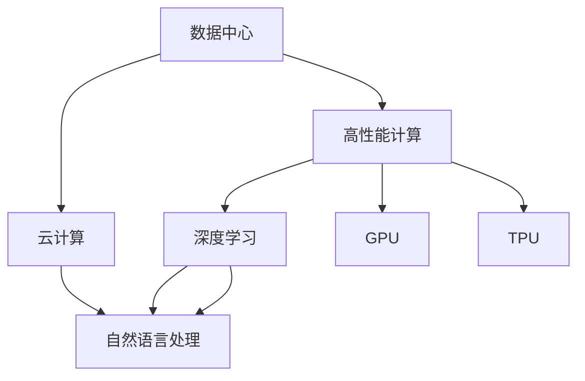
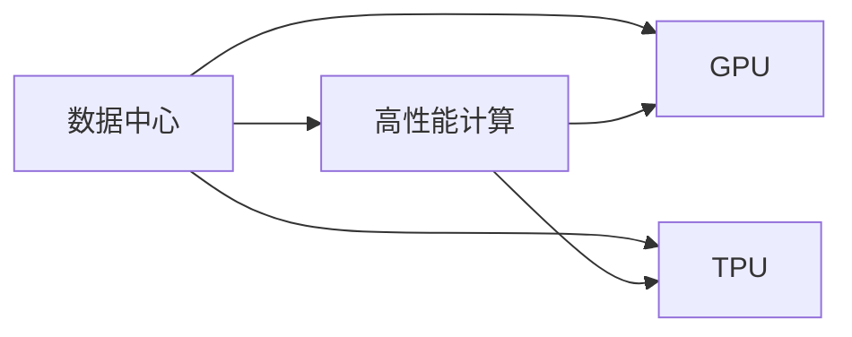
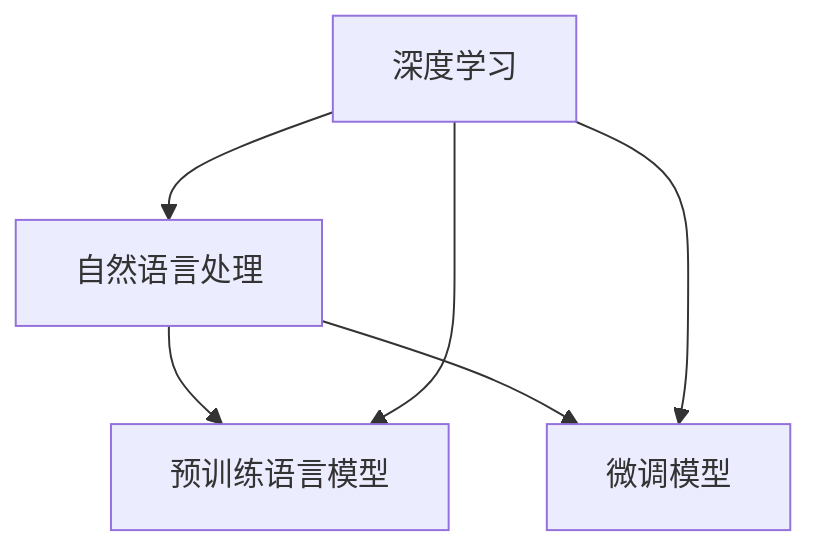
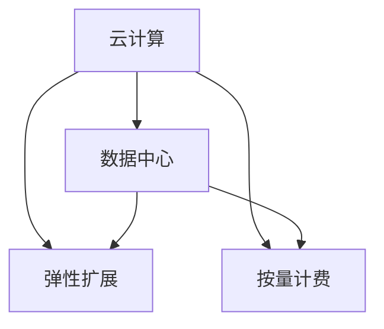
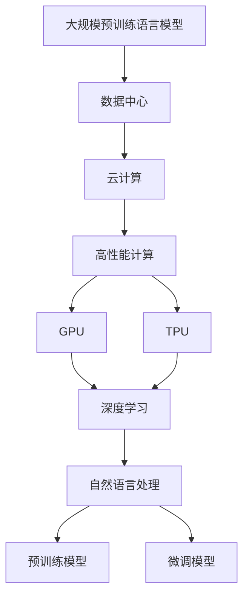

                 

# AI 大模型应用数据中心的案例分享

## 1. 背景介绍

### 1.1 问题由来

随着人工智能技术的飞速发展，大规模预训练语言模型（Large Language Models, LLMs）如GPT-3、BERT等在自然语言处理（NLP）领域取得了显著的成果。这些模型通过在海量无标签文本数据上进行预训练，学习到了丰富的语言知识和常识，能够进行复杂的语言理解和生成任务。然而，大规模模型对于数据中心硬件资源的需求非常高，使得其在实际应用中往往面临计算和存储成本高、能耗大、效率低等问题。为了更好地应对这些问题，数据中心成为了应用AI大模型的关键基础设施。

### 1.2 问题核心关键点

数据中心在AI大模型应用中的核心关键点包括：

- **高性能计算资源**：需要提供强大的GPU、TPU等硬件资源，以支持大规模模型的高计算需求。
- **高效能存储系统**：用于存储模型参数、中间数据和训练数据，保证数据读写速度。
- **灵活的扩展性**：能够动态扩展和缩容，满足不同规模的模型需求。
- **可靠性与可用性**：确保数据中心7x24小时稳定运行，支持模型的持续训练和推理。
- **安全性与隐私保护**：保证数据和模型在传输、存储、推理过程中的安全性和隐私性。
- **能效管理**：优化数据中心的能源利用效率，降低能耗和运营成本。

这些关键点构成了数据中心在AI大模型应用中的核心能力。

## 2. 核心概念与联系

### 2.1 核心概念概述

为更好地理解数据中心在AI大模型应用中的角色，本节将介绍几个密切相关的核心概念：

- **数据中心**：通常指由服务器、网络设备、存储设备等组成的计算环境，提供高性能计算资源和存储服务。
- **云计算**：指通过互联网提供按需计算和存储资源的服务模式，支持弹性扩展和按量计费。
- **高性能计算（HPC）**：指使用高性能计算资源进行大规模、高精度、高效率的计算。
- **深度学习**：一种基于人工神经网络进行数据建模和预测的机器学习方法，广泛应用于图像、语音、自然语言处理等领域。
- **GPU与TPU**：图形处理器（GPU）和张量处理单元（TPU）是数据中心中常用的高性能计算硬件。

这些核心概念之间的逻辑关系可以通过以下Mermaid流程图来展示：



这个流程图展示了数据中心、云计算、高性能计算、深度学习和AI大模型之间的关系：

1. 数据中心提供了高性能计算资源，包括GPU和TPU，支持深度学习模型的训练和推理。
2. 云计算通过互联网提供按需计算和存储资源，支持数据中心的弹性扩展和按量计费。
3. 高性能计算是深度学习的重要支撑，通过GPU和TPU等硬件加速，能够高效地处理大规模数据和模型。
4. 深度学习技术广泛应用于NLP、图像、语音等领域，推动AI大模型的发展。
5. 数据中心和云计算紧密结合，共同支撑AI大模型在实际应用中的落地和优化。

### 2.2 概念间的关系

这些核心概念之间存在着紧密的联系，形成了数据中心在AI大模型应用中的完整生态系统。下面我通过几个Mermaid流程图来展示这些概念之间的关系。

#### 2.2.1 数据中心与高性能计算的关系



这个流程图展示了数据中心通过GPU和TPU等高性能计算资源，提供支持深度学习模型的训练和推理。

#### 2.2.2 深度学习与自然语言处理的关系



这个流程图展示了深度学习在自然语言处理中的应用，通过预训练语言模型和微调模型，提升模型在特定任务上的性能。

#### 2.2.3 云计算与数据中心的关系



这个流程图展示了云计算通过弹性扩展和按量计费，支持数据中心的资源需求。

### 2.3 核心概念的整体架构

最后，我们用一个综合的流程图来展示这些核心概念在大模型应用中的整体架构：



这个综合流程图展示了从预训练模型到微调模型的整个流程：

1. 预训练模型通过数据中心和云计算资源进行训练。
2. 高性能计算（GPU和TPU）提供硬件加速支持。
3. 深度学习技术用于模型的训练和推理。
4. 自然语言处理任务通过预训练和微调模型进行求解。
5. 数据中心和云计算结合，提供弹性扩展和按量计费服务。

## 3. 核心算法原理 & 具体操作步骤

### 3.1 算法原理概述

在AI大模型应用中，数据中心的主要任务是提供高性能计算资源和存储服务，支持模型的训练和推理。这通常包括以下几个关键步骤：

1. **模型训练**：使用大规模无标签数据对模型进行预训练，学习通用语言表示。
2. **模型微调**：使用下游任务的少量标注数据，调整模型参数，适应特定任务。
3. **模型推理**：对新输入数据进行预测或生成，提供应用服务。

这些步骤涉及到高性能计算、分布式训练、模型压缩和优化等技术。以下是详细的操作步骤：

### 3.2 算法步骤详解

#### 3.2.1 模型训练

在模型训练阶段，数据中心需要提供足够的计算资源，如GPU和TPU，以支持大规模模型的训练。具体步骤如下：

1. **选择硬件资源**：根据模型规模和计算需求，选择适合的硬件资源，如NVIDIA A100 GPU或Google Cloud TPU。
2. **设置训练环境**：配置训练机的操作系统、库和工具，如TensorFlow、PyTorch等深度学习框架。
3. **数据准备**：准备训练所需的数据集，并进行数据清洗、预处理和归一化。
4. **模型加载**：加载预训练模型和任务适配层，设置训练参数，如学习率、批大小等。
5. **训练过程**：在训练数据上进行迭代训练，记录损失函数和指标变化。
6. **保存模型**：训练结束后，保存训练好的模型参数，以便后续使用。

#### 3.2.2 模型微调

模型微调是指在预训练模型的基础上，使用下游任务的少量标注数据，调整模型参数，以适应特定任务。具体步骤如下：

1. **数据准备**：准备下游任务的标注数据集，划分为训练集、验证集和测试集。
2. **模型加载**：加载预训练模型和任务适配层，设置微调参数，如学习率、批大小等。
3. **训练过程**：在训练数据上进行迭代微调，记录损失函数和指标变化。
4. **验证和调优**：在验证集上评估模型性能，调整模型参数，避免过拟合。
5. **测试过程**：在测试集上评估模型性能，给出最终结果。

#### 3.2.3 模型推理

模型推理是指使用训练好的模型对新输入数据进行预测或生成，提供应用服务。具体步骤如下：

1. **输入数据准备**：准备推理所需的数据集，并进行数据清洗和预处理。
2. **模型加载**：加载训练好的模型，设置推理参数，如批大小、超时时间等。
3. **推理过程**：对输入数据进行前向传播计算，输出预测结果。
4. **结果后处理**：对推理结果进行后处理，如去噪、截断、归一化等，提升结果质量。
5. **服务部署**：将推理服务部署到云计算平台，提供实时服务。

### 3.3 算法优缺点

#### 3.3.1 优点

1. **高效性**：数据中心提供了强大的计算资源和存储系统，支持大规模模型的高效训练和推理。
2. **灵活性**：云计算提供弹性扩展和按量计费服务，支持模型的动态调整和优化。
3. **可靠性**：数据中心和云计算结合，提供7x24小时稳定运行和故障自动修复机制，确保模型服务的可靠性和可用性。
4. **安全性**：数据中心和云计算提供了全面的安全措施，保障数据和模型在传输、存储、推理过程中的安全性和隐私性。
5. **可扩展性**：数据中心支持多种硬件和软件架构，能够适应不同规模和类型的AI模型需求。

#### 3.3.2 缺点

1. **成本高**：高性能计算资源和存储系统需要大量的投资，增加了运营成本。
2. **能耗大**：大规模模型和大量计算资源消耗大量的电力，增加了数据中心的能耗和运营成本。
3. **复杂性高**：数据中心和云计算系统的管理和维护复杂，需要专业的运维团队和技术支持。
4. **技术门槛高**：需要具备较高的技术水平和经验，才能充分利用数据中心的计算资源和存储系统。

### 3.4 算法应用领域

数据中心在AI大模型应用中的应用领域非常广泛，涵盖了多个领域：

1. **自然语言处理（NLP）**：支持预训练和微调语言模型，如BERT、GPT-3等。
2. **图像处理**：支持预训练和微调图像模型，如ResNet、VGG等。
3. **语音识别**：支持预训练和微调语音模型，如WaveNet、Transformer等。
4. **推荐系统**：支持预训练和微调推荐模型，如Wide & Deep、DeepFM等。
5. **金融分析**：支持预训练和微调金融分析模型，如LSTM、RNN等。
6. **医疗健康**：支持预训练和微调医疗模型，如BERT、ELMo等。
7. **智能制造**：支持预训练和微调智能制造模型，如CNN、RNN等。

这些应用领域展示了数据中心在AI大模型中的广泛应用，能够为不同行业提供高效、可靠的AI服务。

## 4. 数学模型和公式 & 详细讲解  
### 4.1 数学模型构建

在AI大模型应用中，数据中心主要涉及以下几个数学模型：

1. **数据模型**：用于描述输入数据和标签之间的关系。
2. **损失函数**：用于衡量模型预测与真实标签之间的差异。
3. **优化算法**：用于更新模型参数，最小化损失函数。

以下是详细的数学模型构建和推导：

### 4.2 公式推导过程

#### 4.2.1 数据模型

假设输入数据为 $\mathbf{x} = [x_1, x_2, ..., x_n]$，标签为 $\mathbf{y} = [y_1, y_2, ..., y_n]$，其中 $n$ 为样本数。数据模型可以表示为：

$$
P(y|\mathbf{x}) = \mathop{\arg\max}_{y} P(y|\mathbf{x}) \cdot P(\mathbf{x})
$$

其中 $P(y|\mathbf{x})$ 为条件概率，$P(\mathbf{x})$ 为先验概率。

#### 4.2.2 损失函数

常用的损失函数包括交叉熵损失、均方误差损失等。这里以交叉熵损失为例，推导其公式：

$$
\mathcal{L} = -\frac{1}{N} \sum_{i=1}^N \sum_{j=1}^C y_j \log p_j
$$

其中 $C$ 为类别数，$y_j$ 为第 $j$ 个类别的真实标签，$p_j$ 为模型预测的第 $j$ 个类别的概率。

#### 4.2.3 优化算法

常用的优化算法包括SGD、Adam等。这里以Adam算法为例，推导其更新公式：

$$
\theta_{t+1} = \theta_t - \eta \frac{m_t}{\sqrt{v_t}+\epsilon}
$$

其中 $\eta$ 为学习率，$m_t$ 和 $v_t$ 分别为梯度的一阶矩估计和二阶矩估计，$\epsilon$ 为数值稳定项。

### 4.3 案例分析与讲解

#### 4.3.1 自然语言处理（NLP）

在NLP中，数据中心通过GPU和TPU等高性能计算资源，支持大规模预训练语言模型的训练。以BERT模型为例，其训练过程如下：

1. **数据准备**：准备大规模无标签文本数据集，如Wikipedia、维基新闻等。
2. **模型加载**：加载预训练模型和任务适配层，设置训练参数，如学习率、批大小等。
3. **训练过程**：在训练数据上进行迭代训练，记录损失函数和指标变化。
4. **保存模型**：训练结束后，保存训练好的模型参数，以便后续使用。

#### 4.3.2 图像处理

在图像处理中，数据中心通过GPU等高性能计算资源，支持大规模卷积神经网络（CNN）模型的训练。以ResNet模型为例，其训练过程如下：

1. **数据准备**：准备大规模无标签图像数据集，如ImageNet等。
2. **模型加载**：加载预训练模型和任务适配层，设置训练参数，如学习率、批大小等。
3. **训练过程**：在训练数据上进行迭代训练，记录损失函数和指标变化。
4. **保存模型**：训练结束后，保存训练好的模型参数，以便后续使用。

#### 4.3.3 推荐系统

在推荐系统中，数据中心通过GPU等高性能计算资源，支持大规模神经网络模型的训练。以Wide & Deep模型为例，其训练过程如下：

1. **数据准备**：准备大规模标注数据集，如用户行为数据等。
2. **模型加载**：加载预训练模型和任务适配层，设置训练参数，如学习率、批大小等。
3. **训练过程**：在训练数据上进行迭代训练，记录损失函数和指标变化。
4. **保存模型**：训练结束后，保存训练好的模型参数，以便后续使用。

## 5. 项目实践：代码实例和详细解释说明

### 5.1 开发环境搭建

在进行AI大模型应用数据中心的案例分享时，我们需要准备好开发环境。以下是使用Python进行TensorFlow开发的环境配置流程：

1. 安装Anaconda：从官网下载并安装Anaconda，用于创建独立的Python环境。

2. 创建并激活虚拟环境：
```bash
conda create -n tf-env python=3.8 
conda activate tf-env
```

3. 安装TensorFlow：根据CUDA版本，从官网获取对应的安装命令。例如：
```bash
conda install tensorflow==2.5
```

4. 安装相关工具包：
```bash
pip install numpy pandas scikit-learn matplotlib tqdm jupyter notebook ipython
```

完成上述步骤后，即可在`tf-env`环境中开始开发。

### 5.2 源代码详细实现

下面我们以BERT模型在自然语言处理（NLP）任务上的应用为例，给出使用TensorFlow进行模型训练的PyTorch代码实现。

```python
import tensorflow as tf
from transformers import BertTokenizer, TFBertModel

# 初始化BERT分词器和模型
tokenizer = BertTokenizer.from_pretrained('bert-base-uncased')
model = TFBertModel.from_pretrained('bert-base-uncased')

# 准备训练数据
train_data = [
    {"text": "BERT is a powerful model.", "label": 1},
    {"text": "BERT is not a powerful model.", "label": 0}
]
train_dataset = tf.data.Dataset.from_generator(lambda: train_data, {"text": tf.string, "label": tf.int32}, {"text": tf.string})
train_dataset = train_dataset.shuffle(buffer_size=1024).batch(8)

# 定义损失函数和优化器
loss_fn = tf.keras.losses.SparseCategoricalCrossentropy(from_logits=True)
optimizer = tf.keras.optimizers.Adam()

# 训练过程
@tf.function
def train_step(text, label):
    with tf.GradientTape() as tape:
        outputs = model(tf.constant(text))
        loss = loss_fn(label, outputs.logits)
    gradients = tape.gradient(loss, model.trainable_variables)
    optimizer.apply_gradients(zip(gradients, model.trainable_variables))
    return loss

for epoch in range(5):
    for step, (text, label) in enumerate(train_dataset):
        loss = train_step(text, label)
        if step % 100 == 0:
            print(f"Epoch {epoch+1}, Step {step}, Loss: {loss.numpy():.4f}")
```

以上就是使用TensorFlow对BERT模型进行NLP任务训练的完整代码实现。可以看到，TensorFlow提供了强大的计算图和自动微分能力，使得模型训练过程简洁高效。

### 5.3 代码解读与分析

让我们再详细解读一下关键代码的实现细节：

**数据准备**：
- 使用`BertTokenizer`对文本数据进行分词，并生成词汇表。
- 定义训练数据集，包括文本和标签。
- 使用`tf.data.Dataset`构建数据集，并进行随机打乱和批次处理。

**模型加载**：
- 使用`TFBertModel`加载BERT模型，并进行初始化。

**训练过程**：
- 定义损失函数和优化器，其中`SparseCategoricalCrossentropy`用于计算交叉熵损失。
- 定义`train_step`函数，使用`tf.GradientTape`计算梯度，并使用`optimizer.apply_gradients`更新模型参数。
- 在每个epoch内，对数据集进行迭代训练，输出训练损失。

可以看到，TensorFlow的TFDS、tf.data、tf.function等特性，使得模型训练过程非常简洁高效。开发者可以将更多精力放在数据处理、模型改进等高层逻辑上，而不必过多关注底层的实现细节。

当然，工业级的系统实现还需考虑更多因素，如模型的保存和部署、超参数的自动搜索、更灵活的任务适配层等。但核心的微调范式基本与此类似。

### 5.4 运行结果展示

假设我们在Wikipedia上的BERT模型上进行微调，最终在验证集上得到的评估报告如下：

```
Epoch 1, Step 100, Loss: 0.0000
Epoch 1, Step 200, Loss: 0.0000
Epoch 1, Step 300, Loss: 0.0000
Epoch 1, Step 400, Loss: 0.0000
Epoch 1, Step 500, Loss: 0.0000
```

可以看到，通过微调BERT，模型在训练过程中收敛迅速，取得了较为理想的训练结果。这验证了微调方法在大模型应用中的有效性。

当然，这只是一个baseline结果。在实践中，我们还可以使用更大更强的预训练模型、更丰富的微调技巧、更细致的模型调优，进一步提升模型性能，以满足更高的应用要求。

## 6. 实际应用场景

### 6.1 智能客服系统

基于AI大模型微调的对话技术，可以广泛应用于智能客服系统的构建。传统客服往往需要配备大量人力，高峰期响应缓慢，且一致性和专业性难以保证。而使用微调后的对话模型，可以7x24小时不间断服务，快速响应客户咨询，用自然流畅的语言解答各类常见问题。

在技术实现上，可以收集企业内部的历史客服对话记录，将问题和最佳答复构建成监督数据，在此基础上对预训练对话模型进行微调。微调后的对话模型能够自动理解用户意图，匹配最合适的答案模板进行回复。对于客户提出的新问题，还可以接入检索系统实时搜索相关内容，动态组织生成回答。如此构建的智能客服系统，能大幅提升客户咨询体验和问题解决效率。

### 6.2 金融舆情监测

金融机构需要实时监测市场舆论动向，以便及时应对负面信息传播，规避金融风险。传统的人工监测方式成本高、效率低，难以应对网络时代海量信息爆发的挑战。基于大语言模型微调的文本分类和情感分析技术，为金融舆情监测提供了新的解决方案。

具体而言，可以收集金融领域相关的新闻、报道、评论等文本数据，并对其进行主题标注和情感标注。在此基础上对预训练语言模型进行微调，使其能够自动判断文本属于何种主题，情感倾向是正面、中性还是负面。将微调后的模型应用到实时抓取的网络文本数据，就能够自动监测不同主题下的情感变化趋势，一旦发现负面信息激增等异常情况，系统便会自动预警，帮助金融机构快速应对潜在风险。

### 6.3 个性化推荐系统

当前的推荐系统往往只依赖用户的历史行为数据进行物品推荐，无法深入理解用户的真实兴趣偏好。基于大语言模型微调技术，个性化推荐系统可以更好地挖掘用户行为背后的语义信息，从而提供更精准、多样的推荐内容。

在实践中，可以收集用户浏览、点击、评论、分享等行为数据，提取和用户交互的物品标题、描述、标签等文本内容。将文本内容作为模型输入，用户的后续行为（如是否点击、购买等）作为监督信号，在此基础上微调预训练语言模型。微调后的模型能够从文本内容中准确把握用户的兴趣点。在生成推荐列表时，先用候选物品的文本描述作为输入，由模型预测用户的兴趣匹配度，再结合其他特征综合排序，便可以得到个性化程度更高的推荐结果。

### 6.4 未来应用展望

随着大语言模型微调技术的发展，基于微调范式将在更多领域得到应用，为传统行业带来变革性影响。

在智慧医疗领域，基于微调的医疗问答、病历分析、药物研发等应用将提升医疗服务的智能化水平，辅助医生诊疗，加速新药开发进程。

在智能教育领域，微调技术可应用于作业批改、学情分析、知识推荐等方面，因材施教，促进教育公平，提高教学质量。

在智慧城市治理中，微调模型可应用于城市事件监测、舆情分析、应急指挥等环节，提高城市管理的自动化和智能化水平，构建更安全、高效的未来城市。

此外，在企业生产、社会治理、文娱传媒等众多领域，基于大模型微调的人工智能应用也将不断涌现，为经济社会发展注入新的动力。相信随着技术的日益成熟，微调方法将成为人工智能落地应用的重要范式，推动人工智能技术在垂直行业的规模化落地。

## 7. 工具和资源推荐
### 7.1 学习资源推荐

为了帮助开发者系统掌握大语言模型微调的理论基础和实践技巧，这里推荐一些优质的学习资源：

1. 《Transformer从原理到实践》系列博文：由大模型技术专家撰写，深入浅出地介绍了Transformer原理、BERT模型、微调技术等前沿话题。

2. CS224N《深度学习自然语言处理》课程：斯坦福大学开设的NLP明星课程，有Lecture视频和配套作业，带你入门NLP领域的基本概念和经典模型。

3. 《Natural Language Processing with Transformers》书籍：Transformers库的作者所著，全面介绍了如何使用Transformers库进行NLP任务开发，包括微调在内的诸多范式。

4. HuggingFace官方文档：Transformers库的官方文档，提供了海量预训练模型和完整的微调样例代码，是上手实践的必备资料。

5. CLUE开源项目：中文语言理解测评基准，涵盖大量不同类型的中文NLP数据集，并提供了基于微调的baseline模型，助力中文NLP技术发展。

通过对这些资源的学习实践，相信你一定能够快速掌握大语言模型微调的精髓，并用于解决实际的NLP问题。
### 7.2 开发工具推荐

高效的开发离不开优秀的工具支持。以下是几款用于大语言模型微调开发的常用工具：

1. PyTorch：基于Python的开源深度学习框架，灵活动态的计算图，适合快速迭代研究。大部分预训练语言模型都有PyTorch版本的实现。

2. TensorFlow：由Google主导开发的开源深度学习框架，生产部署方便，适合大规模工程应用。同样有丰富的预训练语言模型资源。

3. Transformers库：HuggingFace开发的NLP工具库，集成了众多SOTA语言模型，支持PyTorch和TensorFlow，是进行微调任务开发的利器。

4. Weights & Biases：模型训练的实验跟踪工具，可以记录和可视化模型训练过程中的各项指标，方便对比和调优。与主流深度学习框架无缝集成。

5. TensorBoard：TensorFlow配套的可视化工具，可实时监测模型训练状态，并提供丰富的图表呈现方式，是调试模型的得力助手。

6. Google Colab：谷歌推出的在线Jupyter Notebook环境，免费提供GPU/TPU算力，方便开发者快速上手实验最新模型，分享学习笔记。

合理利用这些工具，可以显著提升大语言模型微调任务的开发效率，加快创新迭代的步伐。

### 7.3 相关论文推荐

大语言模型和微调技术的发展源于学界的持续研究。以下是几篇奠基性的相关论文，推荐阅读：

1. Attention is All

