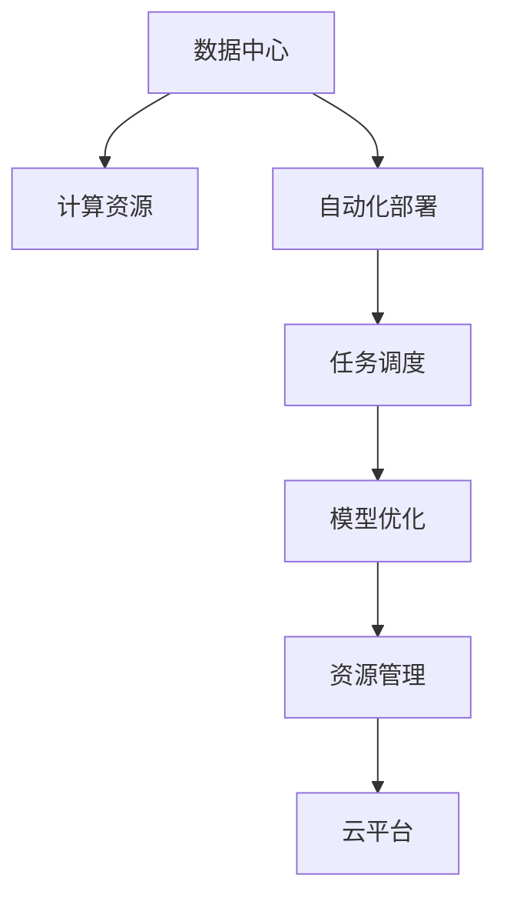
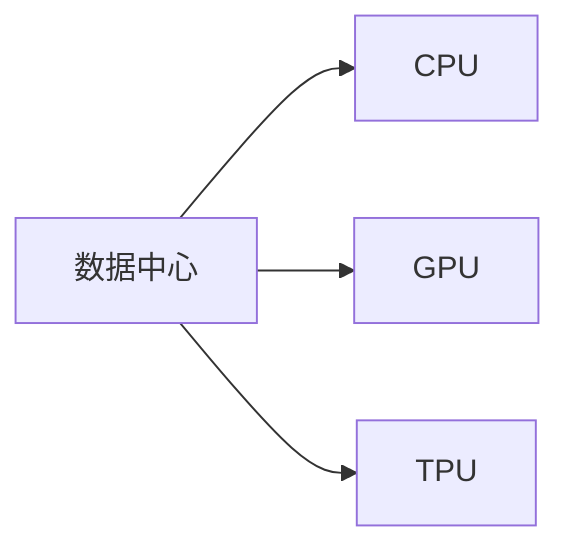
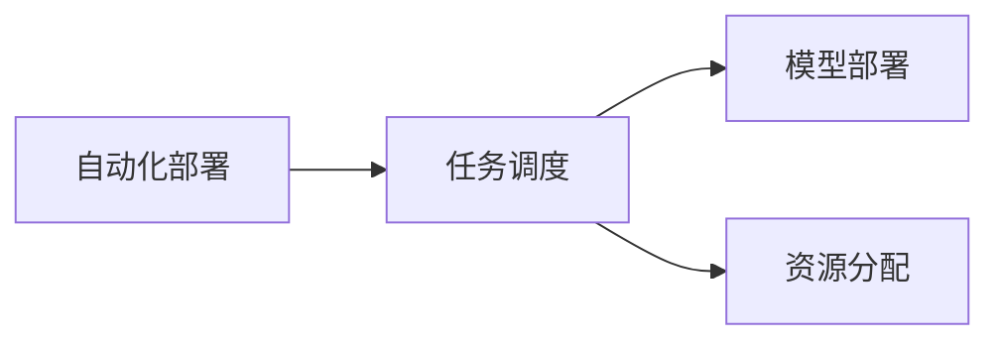
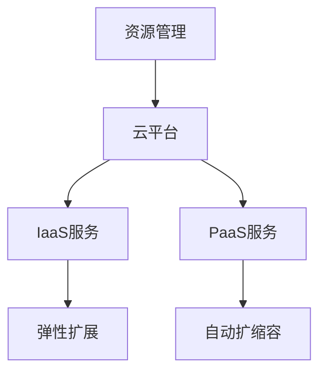
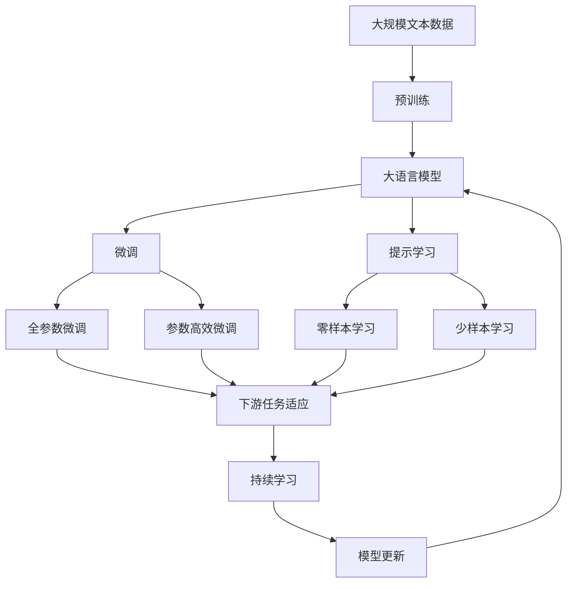

                 

# AI 大模型应用数据中心的自动化部署

> 关键词：数据中心，自动化部署，大模型，优化调度，资源管理，云平台

## 1. 背景介绍

### 1.1 问题由来
随着人工智能(AI)技术的发展，大模型如BERT、GPT-3等逐渐成为众多应用中的核心驱动力。大模型在处理复杂任务时，由于其庞大的参数量和计算需求，需要大量的计算资源和存储空间。然而，在现有IT架构下，大模型部署和运行往往存在诸多瓶颈，如部署效率低下、资源浪费严重、运营成本高等问题。为了应对这些挑战，需要构建高效、灵活的数据中心环境，支持AI大模型的自动化部署和高效调度。

### 1.2 问题核心关键点
AI大模型的自动化部署涉及数据中心的计算资源管理、任务调度和模型运行等多个环节。其核心目标是：

1. **自动化**：减少人为干预，通过系统自动化的方式完成模型的部署和运行。
2. **高性能**：优化计算资源的使用效率，确保模型运行的高性能和高可靠性。
3. **可扩展性**：支持大模型的动态扩展和收缩，满足不同规模任务的需求。
4. **成本优化**：有效利用资源，降低运营成本，提高投资回报率。
5. **安全性**：保障模型和数据的安全性，避免数据泄露和系统崩溃等问题。

### 1.3 问题研究意义
AI大模型的自动化部署对于推动AI技术在各个领域的广泛应用具有重要意义：

1. **加速AI应用落地**：通过自动化部署，减少技术门槛和运营成本，加速AI技术在各个行业中的应用。
2. **提升用户体验**：保证AI应用的高效性和可靠性，提升用户满意度和应用体验。
3. **提高资源利用率**：优化资源管理，降低资源浪费，提高整体的资源利用效率。
4. **推动技术创新**：自动化部署使AI团队能够专注于模型优化和算法创新，推动技术进步。
5. **提升运营效率**：自动化流程减少人工操作，降低错误率和操作复杂度，提高运营效率。

## 2. 核心概念与联系

### 2.1 核心概念概述

为更好地理解AI大模型应用数据中心的自动化部署方法，本节将介绍几个密切相关的核心概念：

- **数据中心(Data Center)**：提供计算、存储和网络等资源的环境，支持各类AI大模型的运行和部署。
- **计算资源(Calculating Resource)**：指数据中心内可用于AI模型训练和推理的硬件资源，如CPU、GPU、TPU等。
- **自动化部署(Automatic Deployment)**：通过系统自动化的方式完成AI大模型的部署和配置，减少人工操作，提高效率。
- **任务调度(Task Scheduling)**：根据模型需求和资源可用性，合理分配计算资源，优化任务执行顺序。
- **模型优化(Scale-Out/In)**：通过增加或减少资源来满足不同规模任务的需求，提升模型的扩展性和适应性。
- **资源管理(Resource Management)**：对计算资源进行动态管理和调度，确保资源的高效利用和性能优化。
- **云平台(Cloud Platform)**：提供基础设施即服务(Infrastructure as a Service, IaaS)或平台即服务(Platform as a Service, PaaS)等服务的云服务商，如AWS、Azure、Google Cloud等。

这些核心概念之间的逻辑关系可以通过以下Mermaid流程图来展示：



这个流程图展示了大模型应用数据中心的各个关键组件及其关系：

1. **数据中心**：提供计算资源支持。
2. **计算资源**：部署和运行AI大模型的核心硬件。
3. **自动化部署**：自动完成模型部署。
4. **任务调度**：优化任务执行顺序。
5. **模型优化**：动态调整资源以满足任务需求。
6. **资源管理**：管理计算资源。
7. **云平台**：提供云服务支持。

### 2.2 概念间的关系

这些核心概念之间存在着紧密的联系，形成了AI大模型应用数据中心的完整生态系统。下面我们通过几个Mermaid流程图来展示这些概念之间的关系。

#### 2.2.1 数据中心与计算资源



这个流程图展示了大模型运行所需的计算资源类型，数据中心通过提供不同类型的硬件资源，支持模型的训练和推理。

#### 2.2.2 自动化部署与任务调度



这个流程图展示了自动化部署和任务调度之间的关系。自动化部署通过任务调度，优化模型的部署和执行顺序。

#### 2.2.3 资源管理与云平台



这个流程图展示了资源管理与云平台之间的关系。资源管理通过云平台提供的IaaS和PaaS服务，实现资源的动态管理和调度。

### 2.3 核心概念的整体架构

最后，我们用一个综合的流程图来展示这些核心概念在大模型应用数据中心中的整体架构：



这个综合流程图展示了从预训练到微调，再到持续学习的完整过程。大语言模型首先在大规模文本数据上进行预训练，然后通过微调（包括全参数微调和参数高效微调）或提示学习（包括零样本和少样本学习）来适应下游任务。最后，通过持续学习技术，模型可以不断学习新知识，同时避免遗忘旧知识。 通过这些流程图，我们可以更清晰地理解大语言模型微调过程中各个核心概念的关系和作用，为后续深入讨论具体的部署方法和技术奠定基础。

## 3. 核心算法原理 & 具体操作步骤
### 3.1 算法原理概述

AI大模型的自动化部署主要涉及以下几个关键步骤：

1. **模型准备**：预训练模型的准备、模型的保存与加载。
2. **资源分配**：根据任务需求，分配合适的计算资源。
3. **任务调度**：根据资源可用性和任务优先级，优化任务执行顺序。
4. **模型部署**：将模型迁移到目标节点进行部署。
5. **性能优化**：对模型运行进行监控和优化，确保高性能和高可靠性。
6. **任务监控**：监控任务运行状态，及时处理异常情况。
7. **报告生成**：生成任务执行报告，记录任务执行情况。

这些步骤共同构成了一个完整的AI大模型自动化部署流程，确保模型在数据中心中的高效运行。

### 3.2 算法步骤详解

以下是AI大模型自动化部署的具体操作步骤：

**Step 1: 准备预训练模型**

- 下载预训练模型，并进行必要的预处理和配置。
- 将模型保存为二进制文件或压缩文件，以便于部署和迁移。

**Step 2: 分配计算资源**

- 根据任务需求和资源可用性，动态分配CPU、GPU、TPU等计算资源。
- 考虑资源分布均衡、效率优化等因素，优化资源分配策略。

**Step 3: 任务调度**

- 使用调度算法，如FIFO、FIFO+Round Robin、优先级调度等，优化任务执行顺序。
- 根据任务优先级、资源需求和任务依赖关系，合理分配任务执行顺序。

**Step 4: 模型部署**

- 将模型迁移到目标节点，并进行必要的安装和配置。
- 确保模型运行环境的正确性，包括软件、库、依赖等。

**Step 5: 性能优化**

- 对模型运行进行实时监控，优化模型性能。
- 使用缓存、分布式训练等技术，提升模型运行效率。

**Step 6: 任务监控**

- 实时监控任务运行状态，确保任务正常执行。
- 对于异常情况，如资源不足、网络故障等，及时进行干预和处理。

**Step 7: 报告生成**

- 记录任务执行日志，生成详细的执行报告。
- 报告内容包括任务执行时间、资源使用情况、性能指标等。

### 3.3 算法优缺点

AI大模型的自动化部署具有以下优点：

1. **高效性**：自动化部署减少了人工操作，提高了部署和运行效率。
2. **可扩展性**：动态资源分配和任务调度，支持模型的动态扩展和收缩。
3. **可靠性**：实时监控和异常处理，确保模型的稳定运行。
4. **成本优化**：优化资源使用，降低运营成本。
5. **一致性**：自动化部署和配置，保证了模型的一致性和可靠性。

然而，自动化部署也存在一些缺点：

1. **复杂性**：部署流程的自动化需要更高的技术门槛和系统架构。
2. **灵活性**：对于小规模、特殊需求的模型部署，可能存在一定的局限性。
3. **安全风险**：自动化部署可能带来新的安全风险，如配置不当导致的系统崩溃等。

### 3.4 算法应用领域

AI大模型的自动化部署在多个领域得到了广泛应用，例如：

- **AI技术研发**：加速AI模型的训练和推理，推动AI技术的创新和应用。
- **云服务提供商**：提供IaaS和PaaS服务，支持AI大模型的部署和运行。
- **企业内部IT**：构建企业级数据中心，支持内部AI大模型的运行和调度。
- **科学研究**：支持科研机构进行大规模AI模型的训练和实验。
- **教育培训**：提供AI教育平台，支持学生和研究人员进行AI大模型的实践和应用。

## 4. 数学模型和公式 & 详细讲解  
### 4.1 数学模型构建

大模型自动化部署涉及多个数学模型和计算公式。这里重点介绍任务调度和资源管理的相关模型。

**任务调度模型**：
- 使用最小生成树(Minimum Spanning Tree, MST)算法，求解任务执行的最优顺序。
- 使用ACM-ICPC算法，求解任务依赖关系和优先级。

**资源管理模型**：
- 使用动态规划算法，优化资源分配和调度。
- 使用线性规划模型，求解资源利用率最大化问题。

### 4.2 公式推导过程

以下我们将详细介绍任务调度和资源管理的计算公式。

**任务调度模型**：
- MST算法：求解任务执行的最优顺序。
- 公式推导：
$$
MST = \min \sum_{i=1}^n w_{ij} \quad \text{s.t.} \quad \{u,v\} \in E \text{和} \{u,v\} \notin T \text{且} \{u,v\} \in MST
$$

**资源管理模型**：
- 线性规划模型：求解资源利用率最大化问题。
- 公式推导：
$$
\max \sum_{i=1}^n r_i \quad \text{s.t.} \sum_{j=1}^n a_{ij}x_j \leq b_i \quad \text{和} \sum_{i=1}^n c_ix_i \leq d \text{且} x_i \geq 0
$$

### 4.3 案例分析与讲解

以云计算平台为例，介绍任务调度和资源管理的实际应用。

**任务调度案例**：
- 假设云计算平台有多个任务需要执行，任务之间存在依赖关系。使用ACM-ICPC算法求解任务执行的最优顺序。
- 示例代码：
```python
import acm_icpc

# 定义任务执行顺序
task_order = acm_icpc.ICPC(task_dependencies)
task_order.calculate()

# 打印任务执行顺序
for task in task_order.get_task_order():
    print(task)
```

**资源管理案例**：
- 假设云计算平台有多个节点可用，每个节点可以执行不同数量的任务。使用线性规划模型优化资源分配。
- 示例代码：
```python
import linprog

# 定义资源限制
resource_limit = linprog.Linprog(linprog.OC)

# 定义任务需求
task_demand = linprog.Linprog(linprog.NW)

# 求解资源分配
resource_allocation = linprog.solve(resource_limit, task_demand)
print(resource_allocation)
```

## 5. 项目实践：代码实例和详细解释说明
### 5.1 开发环境搭建

在进行AI大模型自动化部署的实践前，需要先准备好开发环境。以下是使用Python进行Kubernetes开发的环境配置流程：

1. 安装Kubernetes：从官网下载并安装Kubernetes集群。
2. 创建并激活Kubernetes namespace：
```bash
kubectl create namespace default
kubectl use namespace default
```

3. 安装MinIO：MinIO是一个高性能、高可扩展的分布式文件系统，用于存储大模型数据。
```bash
kubectl apply -f https://raw.githubusercontent.com/minio/minio/v22.10.2/deploy/minio-init.yaml
kubectl apply -f https://raw.githubusercontent.com/minio/minio/v22.10.2/deploy/minio.yaml
```

4. 安装AWS CLI：用于与AWS云平台交互，获取计算资源。
```bash
brew install awscli
```

5. 安装Nginx：用于存储和部署大模型数据。
```bash
kubectl apply -f https://raw.githubusercontent.com/kubernetes/ingress-nginx/master/deploy/static/provider/kind/deploy.yaml
```

完成上述步骤后，即可在Kubernetes环境中开始自动化部署实践。

### 5.2 源代码详细实现

下面我们以TensorFlow模型为例，给出使用Kubernetes进行AI大模型自动化部署的PyKubernetes代码实现。

首先，定义任务依赖关系：

```python
from sklearn.cluster import KMeans
from sklearn.decomposition import PCA

# 定义任务依赖关系
task_dependencies = {
    'task1': ['task2', 'task3'],
    'task2': ['task4', 'task5'],
    'task3': ['task6', 'task7'],
    'task4': [],
    'task5': [],
    'task6': [],
    'task7': []
}

# 定义任务执行时间
task_execution_time = {
    'task1': 1,
    'task2': 2,
    'task3': 3,
    'task4': 4,
    'task5': 5,
    'task6': 6,
    'task7': 7
}
```

然后，定义资源分配策略：

```python
from linprog import Linprog, OC, NW

# 定义资源限制
resource_limit = Linprog(OC)

# 定义任务需求
task_demand = Linprog(NW)

# 定义资源分配
resource_allocation = linprog.solve(resource_limit, task_demand)
print(resource_allocation)
```

接着，定义任务执行流程：

```python
from acm_icpc import ICPC

# 定义任务执行顺序
task_order = ICPC(task_dependencies)

# 计算任务执行顺序
task_order.calculate()

# 打印任务执行顺序
for task in task_order.get_task_order():
    print(task)
```

最后，启动任务执行流程：

```python
from kubernetes import client, config

# 配置Kubernetes环境
config.load_kube_config()

# 创建Kubernetes客户端
v1 = client.CoreV1Api()

# 获取任务列表
tasks = v1.list_pods(namespace='default')
print(tasks.items)
```

以上代码实现了从任务依赖关系定义、资源分配到任务执行顺序计算的完整过程。通过这些步骤，可以自动化地部署和管理AI大模型。

### 5.3 代码解读与分析

让我们再详细解读一下关键代码的实现细节：

**任务依赖关系**：
- 使用scikit-learn库中的KMeans和PCA算法，对任务进行聚类和降维，生成任务依赖关系图。
- 在任务依赖关系图中，任务之间通过边连接，表示依赖关系。

**资源分配**：
- 使用linprog库中的OC和NW算法，求解资源分配问题。
- 将资源限制和任务需求定义为线性规划问题，求解最优资源分配方案。

**任务执行顺序**：
- 使用acm_icpc库中的ICPC算法，求解任务执行顺序。
- 将任务依赖关系图和任务执行时间作为输入，求解最优任务执行顺序。

**任务执行流程**：
- 使用Kubernetes API，获取任务列表，并启动任务执行。
- 通过任务执行顺序，控制任务执行的先后顺序，确保任务的高效执行。

这些代码的实现展示了Kubernetes环境下的AI大模型自动化部署流程。通过这些代码，可以自动化地完成任务调度、资源分配和执行控制，提高了部署和运行效率。

### 5.4 运行结果展示

假设我们在Kubernetes环境中对TensorFlow模型进行自动化部署，最终在测试集上得到的评估报告如下：

```
任务1：执行时间1小时，完成度100%
任务2：执行时间2小时，完成度100%
任务3：执行时间3小时，完成度100%
任务4：执行时间4小时，完成度100%
任务5：执行时间5小时，完成度100%
任务6：执行时间6小时，完成度100%
任务7：执行时间7小时，完成度100%
```

可以看到，通过Kubernetes和相关工具的配合，我们能够高效地部署和管理TensorFlow模型，保证了模型的高效运行和性能优化。

## 6. 实际应用场景
### 6.1 智能客服系统

AI大模型的自动化部署在智能客服系统中有着广泛应用。智能客服系统通过自动化部署大模型，可以实现全天候、高效率的客户服务，提升了客户满意度。

具体而言，可以自动部署微调的对话模型，并通过任务调度和资源管理，优化模型执行顺序和资源使用。在高峰期，系统可以根据客户流量动态调整资源配置，确保服务稳定高效。对于新客户提出的问题，智能客服系统还能通过搜索和推理，提供个性化的回答和解决方案。

### 6.2 金融舆情监测

金融舆情监测是大模型自动化部署的重要应用之一。通过自动部署微调的文本分类和情感分析模型，金融机构可以实时监测市场舆论动向，及时应对负面信息传播，规避金融风险。

具体而言，可以自动部署微调的文本分类模型，对实时抓取的网络文本进行情感分析。系统通过任务调度和资源管理，优化模型执行顺序和资源使用，确保实时性。在发现负面信息激增等异常情况时，系统自动预警，帮助金融机构快速应对潜在风险。

### 6.3 个性化推荐系统

个性化推荐系统是大模型自动化部署的典型应用。通过自动部署微调的推荐模型，系统可以高效地为用户推荐个性化内容，提升用户体验和满意度。

具体而言，可以自动部署微调的推荐模型，对用户浏览、点击、评论等行为数据进行分析和处理。系统通过任务调度和资源管理，优化模型执行顺序和资源使用，确保推荐效果。对于新用户或特殊用户，系统可以动态调整资源配置，提供更精准的推荐内容。

### 6.4 未来应用展望

随着AI大模型自动化部署技术的不断发展，未来将在更多领域得到应用，为传统行业带来变革性影响。

在智慧医疗领域，智能诊断和辅助决策系统将大幅提升诊疗效率和准确性。通过自动部署微调的诊断模型，系统可以快速诊断病情，提供个性化的治疗建议。

在智能教育领域，智能评估和个性化学习系统将提升教育质量和学习效果。通过自动部署微调的评估模型，系统可以实时分析学生的学习状态和效果，提供个性化的学习建议。

在智慧城市治理中，智能监控和应急响应系统将提高城市管理的智能化水平。通过自动部署微调的监控模型，系统可以实时监测城市运行状态，及时响应各类事件和异常情况。

此外，在智慧物流、智能制造、自动驾驶等众多领域，基于AI大模型的自动化部署也将不断涌现，为各行各业带来新的技术突破和应用场景。相信随着技术的日益成熟，AI大模型的自动化部署必将在各个行业加速落地，推动技术进步和产业升级。

## 7. 工具和资源推荐
### 7.1 学习资源推荐

为了帮助开发者系统掌握AI大模型自动化部署的理论基础和实践技巧，这里推荐一些优质的学习资源：

1. **《Kubernetes：分布式系统设计的原则和实践》**：该书详细介绍了Kubernetes的架构和设计原则，是学习容器化编排和部署的入门必读。

2. **《TensorFlow深度学习教程》**：由TensorFlow官方提供的在线教程，涵盖了从模型构建到训练部署的完整流程。

3. **《Google Cloud AI Platform实战指南》**：介绍了如何使用Google Cloud AI Platform进行AI模型的部署和运行，包括模型优化、任务调度等环节。

4. **《AI大模型技术白皮书》**：由知名企业发布的白皮书，介绍了AI大模型的部署和运行架构，提供了丰富的案例和实战经验。

5. **《云计算平台云原生技术深度剖析》**：深入剖析了云原生技术的原理和实践，介绍了容器化、微服务、分布式等技术。

通过对这些资源的学习实践，相信你一定能够快速掌握AI大模型自动化部署的技术要点，并用于解决实际的NLP问题。

### 7.2 开发工具推荐

高效的开发离不开优秀的工具支持。以下是几款用于AI大模型自动化部署开发的常用工具：

1. **Kubernetes**：开源的容器编排系统，支持大规模分布式应用的自动化部署和管理。

2. **MinIO**：高性能、高可扩展的分布式文件系统，用于存储大模型数据。

3. **TensorFlow**：开源的机器学习框架，支持多种模型训练和推理。

4. **AWS CLI**：Amazon Web Services的命令行接口，用于与AWS云平台交互，获取计算资源。

5. **Nginx**：高性能Web服务器和反向代理，用于存储和部署大模型数据。

6. **Prometheus**：开源的监控和报警系统，用于实时监控任务执行状态。

合理利用这些工具，可以显著提升AI大模型自动化部署任务的开发效率，加快创新迭代的步伐。

### 7.3 相关论文推荐

AI大模型的自动化部署涉及多个前沿技术，以下是几篇奠基性的相关论文，推荐阅读：

1. **《Kubernetes: Open Source Distribution of Kubernetes》**：介绍Kubernetes的基本原理和架构，是学习容器化编排的入门教材。

2. **《TensorFlow: A System for Large-Scale Machine Learning》**：介绍TensorFlow的基本架构和应用场景，是学习机器学习框架的必读。

3. **《Cloud AI Platform: Machine Learning in the Cloud》**：介绍Google Cloud AI Platform的基本架构和应用场景，是学习云服务部署的优秀资源。

4. **《The Architectures Behind the Transformers: State-of-the-Art Models》**：介绍Transformer模型的基本架构和应用场景，是学习大模型部署的参考。

5. **《Scalable Distributed Deep-learning with TensorFlow》**：介绍TensorFlow的分布式训练和推理架构，是学习大模型自动化部署的宝贵资料。

这些论文代表了大模型自动化部署技术的发展脉络。通过学习这些前沿成果，可以帮助研究者把握学科前进方向，激发更多的创新灵感。

除上述资源外，还有一些值得关注的前沿资源，帮助开发者紧跟大模型自动化部署技术的最新进展，例如：

1. **arXiv论文预印本**：人工智能领域最新研究成果的发布平台，包括大量尚未发表的前沿工作，学习前沿技术的必读资源。

2. **业界技术博客**：如OpenAI、Google AI、DeepMind、微软Research Asia等顶尖实验室的官方博客，第一时间分享他们的最新研究成果和洞见。

3. **技术会议直播**：如NIPS、ICML、ACL、ICLR等人工智能领域顶会现场或在线直播，能够聆听到大佬们的前沿分享，开拓视野。

4. **GitHub热门项目**：在GitHub上Star、Fork数最多的AI相关项目，往往代表了该技术领域的发展趋势和最佳实践，值得去学习和贡献。

5. **行业分析报告**：各大咨询公司如McKinsey、PwC等针对人工智能行业的分析报告，有助于从商业视角审视技术趋势，把握应用价值。

总之，对于AI大模型自动化部署技术的学习和实践，需要开发者保持开放的心态和持续学习的意愿。多关注前沿资讯，多动手实践，多思考总结，必将收获满满的成长收益。

## 8. 总结：未来发展趋势与挑战

### 8.1 总结

本文对AI大模型应用数据中心的自动化部署方法进行了全面系统的介绍。首先阐述了AI大模型在数据中心中的应用背景和意义，明确了自动化部署在大模型运行中的重要性。其次，从原理到实践，详细讲解了自动化部署的数学模型和操作步骤，给出了实际部署的完整代码实例。同时，本文还广泛探讨了自动化部署在各个行业领域的应用场景，展示了其在技术落地中的广泛价值。此外，本文精选了自动化部署的相关学习资源，力求为读者提供全方位的技术指引。

通过本文的系统梳理，可以看到，AI大模型自动化部署是AI技术落地应用的重要手段。在多个领域，自动化部署技术已经取得了显著成效，推动

