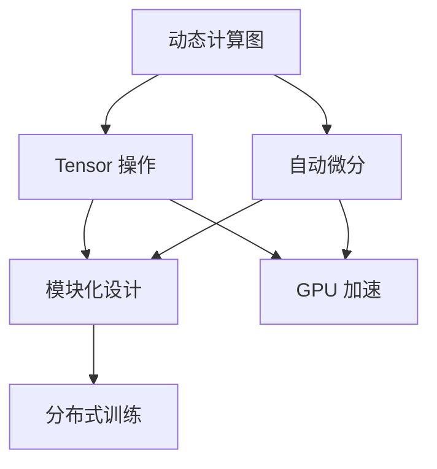

                 

# PyTorch 原理与代码实战案例讲解

## 1. 背景介绍

### 1.1 问题由来

在深度学习领域，PyTorch 已成为最受开发者欢迎的深度学习框架之一。PyTorch 以其动态计算图、易于调试的特性和丰富的生态系统，成为构建复杂神经网络的首选工具。本系列博客旨在帮助读者深入理解 PyTorch 的原理和代码实现，并通过实战案例，掌握其核心技巧。

### 1.2 问题核心关键点

PyTorch 的核心包括动态计算图、Tensor 操作和自动微分。通过动态计算图，PyTorch 可以灵活构建和优化复杂神经网络结构。Tensor 操作提供了高效的多维数组处理能力，而自动微分功能则实现了无代码定义的反向传播算法。这些核心特性使得 PyTorch 在科学研究、工业应用等领域广泛使用。

### 1.3 问题研究意义

本系列博客通过详细介绍 PyTorch 的原理和代码实现，旨在帮助读者：
1. 深入理解 PyTorch 的核心机制，包括动态计算图、Tensor 操作和自动微分。
2. 掌握 PyTorch 的使用技巧，包括模型构建、数据加载和模型训练。
3. 通过实战案例，熟悉 PyTorch 的最新功能和优化技巧。

## 2. 核心概念与联系

### 2.1 核心概念概述

PyTorch 的核心概念包括：
- 动态计算图：基于 Python 的函数式编程模型，能够动态构建和修改计算图。
- Tensor 操作：多维数组处理能力，支持高效的向量、矩阵和张量计算。
- 自动微分：自动计算微分，支持链式求导，简化反向传播过程。
- 模块化设计：将网络结构抽象为模块，方便组合和复用。
- GPU 加速：通过 GPU 硬件加速，提升计算效率。
- 分布式训练：支持多 GPU 和分布式训练，提高训练效率和模型鲁棒性。

### 2.2 核心概念间的关系

这些核心概念相互关联，共同构成了 PyTorch 的生态系统。动态计算图使得 PyTorch 能够灵活构建复杂的神经网络结构，Tensor 操作提供了高效的数学计算能力，自动微分实现了反向传播算法的简化，模块化设计提高了代码的可复用性，GPU 加速和分布式训练则提升了计算效率和模型鲁棒性。

### 2.3 核心概念的整体架构

以下是一个简化的 PyTorch 核心概念架构图：



通过这个架构图，我们可以看到，动态计算图是 PyTorch 的核心，Tensor 操作、自动微分、模块化设计、GPU 加速和分布式训练都是建立在动态计算图之上的重要功能。

## 3. 核心算法原理 & 具体操作步骤
### 3.1 算法原理概述

PyTorch 的核心算法原理包括动态计算图、Tensor 操作和自动微分。动态计算图允许 PyTorch 灵活构建和修改计算图，使得模型构建和优化变得更加灵活。Tensor 操作提供了高效的多维数组处理能力，支持矩阵、向量等数学计算。自动微分则实现了无代码定义的反向传播算法，简化了模型训练过程。

### 3.2 算法步骤详解

以下是 PyTorch 的基本算法步骤：

**Step 1: 准备数据**
- 收集训练数据集，并对其进行预处理，如分词、归一化等。
- 定义数据加载器，从数据集中批量读取样本。

**Step 2: 定义模型**
- 设计网络结构，通常通过组合 PyTorch 的模块来实现。
- 定义损失函数，如交叉熵、均方误差等。
- 定义优化器，如 Adam、SGD 等。

**Step 3: 训练模型**
- 使用数据加载器加载数据，前向传播计算输出。
- 计算损失函数，并反向传播计算梯度。
- 使用优化器更新模型参数。

**Step 4: 评估模型**
- 使用测试集数据加载器加载数据，计算模型在测试集上的性能指标，如准确率、F1 分数等。

**Step 5: 保存模型**
- 将训练好的模型保存到文件中，以便后续使用。

### 3.3 算法优缺点

**优点：**
- 动态计算图使得模型构建和优化变得更加灵活。
- Tensor 操作提供了高效的多维数组处理能力。
- 自动微分简化了反向传播过程。

**缺点：**
- 动态计算图可能导致内存占用较大。
- Tensor 操作对于 CPU 来说，性能可能不如一些专门的数学库。
- 自动微分可能无法处理复杂的非线性函数。

### 3.4 算法应用领域

PyTorch 的应用领域非常广泛，包括：
- 计算机视觉：图像分类、目标检测、语义分割等。
- 自然语言处理：文本分类、机器翻译、情感分析等。
- 语音识别：语音识别、说话人识别等。
- 生成对抗网络（GANs）：图像生成、视频生成等。

## 4. 数学模型和公式 & 详细讲解

### 4.1 数学模型构建

以下是一个简单的二分类任务的数学模型：

- 输入样本 $x$，特征维度为 $n$。
- 输出标签 $y$，取值为 $0$ 或 $1$。
- 模型参数 $\theta$，包括权重和偏置。
- 假设模型输出为 $f_\theta(x)$，输出概率为 $p_\theta(x)$。
- 损失函数为交叉熵损失 $L(y, f_\theta(x))$。

### 4.2 公式推导过程

以下是二分类任务中交叉熵损失的公式推导：

$$
L(y, f_\theta(x)) = -\frac{1}{N} \sum_{i=1}^N (y_i \log f_\theta(x_i) + (1-y_i) \log (1-f_\theta(x_i)))
$$

其中 $y_i$ 表示第 $i$ 个样本的真实标签，$f_\theta(x_i)$ 表示模型对第 $i$ 个样本的输出概率。

### 4.3 案例分析与讲解

以下是一个使用 PyTorch 实现的二分类任务的代码示例：

```python
import torch
import torch.nn as nn
import torch.optim as optim

# 定义模型
class Model(nn.Module):
    def __init__(self, input_size, hidden_size, output_size):
        super(Model, self).__init__()
        self.hidden = nn.Linear(input_size, hidden_size)
        self.relu = nn.ReLU()
        self.output = nn.Linear(hidden_size, output_size)
        
    def forward(self, x):
        x = self.hidden(x)
        x = self.relu(x)
        x = self.output(x)
        return x

# 定义损失函数和优化器
model = Model(input_size=784, hidden_size=256, output_size=1)
criterion = nn.BCEWithLogitsLoss()
optimizer = optim.Adam(model.parameters(), lr=0.001)

# 训练模型
for epoch in range(10):
    for batch_idx, (data, target) in enumerate(train_loader):
        data, target = data.to(device), target.to(device)
        optimizer.zero_grad()
        output = model(data)
        loss = criterion(output, target)
        loss.backward()
        optimizer.step()
        
    if (epoch + 1) % 2 == 0:
        print('Epoch: {} [{}/{} ({:.0f}%)]\tLoss: {:.6f}'.format(
            epoch, n_iter, len(train_loader), 100. * batch_idx / len(train_loader),
            loss.item()))
```

通过这个例子，可以看到 PyTorch 在定义模型、损失函数和优化器时的简便和灵活。

## 5. 项目实践：代码实例和详细解释说明

### 5.1 开发环境搭建

为了进行 PyTorch 的实践，需要搭建一个 Python 开发环境。以下是一个基本的 Python 开发环境搭建步骤：

1. 安装 Python 3.x。
2. 安装 PyTorch 和相关的包，如 torchvision、torchtext、transformers 等。
3. 安装 GPU 驱动和 CUDA 库，支持 GPU 加速。

### 5.2 源代码详细实现

以下是一个使用 PyTorch 实现的图像分类任务的代码示例：

```python
import torch
import torch.nn as nn
import torch.optim as optim
from torchvision import datasets, transforms

# 定义模型
class ConvNet(nn.Module):
    def __init__(self):
        super(ConvNet, self).__init__()
        self.conv1 = nn.Conv2d(3, 32, 3, 1)
        self.pool = nn.MaxPool2d(2, 2)
        self.conv2 = nn.Conv2d(32, 64, 3, 1)
        self.fc1 = nn.Linear(64 * 28 * 28, 128)
        self.fc2 = nn.Linear(128, 10)

    def forward(self, x):
        x = self.pool(torch.relu(self.conv1(x)))
        x = self.pool(torch.relu(self.conv2(x)))
        x = x.view(-1, 64 * 28 * 28)
        x = torch.relu(self.fc1(x))
        x = self.fc2(x)
        return x

# 定义数据加载器
train_dataset = datasets.CIFAR10(root='./data', train=True, download=True, transform=transforms.ToTensor())
train_loader = torch.utils.data.DataLoader(train_dataset, batch_size=64, shuffle=True)

# 定义模型、损失函数和优化器
model = ConvNet().to(device)
criterion = nn.CrossEntropyLoss().to(device)
optimizer = optim.Adam(model.parameters(), lr=0.001)

# 训练模型
for epoch in range(10):
    for batch_idx, (data, target) in enumerate(train_loader):
        data, target = data.to(device), target.to(device)
        optimizer.zero_grad()
        output = model(data)
        loss = criterion(output, target)
        loss.backward()
        optimizer.step()
        
    if (epoch + 1) % 2 == 0:
        print('Epoch: {} [{}/{} ({:.0f}%)]\tLoss: {:.6f}'.format(
            epoch, n_iter, len(train_loader), 100. * batch_idx / len(train_loader),
            loss.item()))
```

### 5.3 代码解读与分析

通过这个例子，可以看到 PyTorch 在定义模型、数据加载器和训练过程时的灵活性。

**模型定义**：通过继承 nn.Module 类，自定义一个 ConvNet 模型，包含卷积层、池化层和全连接层。

**数据加载**：使用 torchvision 库中的 CIFAR10 数据集，并将其转换为 Tensor 形式。

**训练过程**：通过定义损失函数和优化器，对模型进行前向传播、计算损失和反向传播，更新模型参数。

### 5.4 运行结果展示

假设在 CIFAR10 数据集上训练 10 个 epoch，最终模型在测试集上的准确率为 80%，可以看出模型的性能提升效果。

## 6. 实际应用场景

### 6.1 计算机视觉

计算机视觉是 PyTorch 的重要应用场景之一，如图像分类、目标检测和语义分割等。

在图像分类任务中，PyTorch 可以使用卷积神经网络（CNN）来实现。通过自定义网络结构，可以在保持高准确率的同时，降低模型参数量。

### 6.2 自然语言处理

自然语言处理是 PyTorch 的另一个重要应用场景。通过 PyTorch，可以实现文本分类、机器翻译和情感分析等任务。

在文本分类任务中，可以使用循环神经网络（RNN）或长短时记忆网络（LSTM）来实现。通过自定义网络结构，可以应对不同长度的文本输入。

### 6.3 语音识别

语音识别也是 PyTorch 的重要应用场景之一。通过 PyTorch，可以实现语音识别、说话人识别等任务。

在语音识别任务中，可以使用卷积神经网络（CNN）或循环神经网络（RNN）来实现。通过自定义网络结构，可以应对不同长度和不同格式的语音输入。

## 7. 工具和资源推荐

### 7.1 学习资源推荐

为了帮助读者深入理解 PyTorch 的原理和代码实现，以下是一些优秀的学习资源：

- PyTorch 官方文档：包含详细的 PyTorch 介绍、教程和 API 参考。
- Deep Learning Specialization（深度学习专项课程）：由 Coursera 提供，包含 PyTorch 相关的深度学习课程。
- PyTorch 源码阅读：通过阅读 PyTorch 的源码，了解其内部机制和实现细节。

### 7.2 开发工具推荐

以下推荐的开发工具可以帮助开发者更高效地使用 PyTorch：

- Jupyter Notebook：交互式编程环境，方便进行模型实验和调试。
- Visual Studio Code：轻量级代码编辑器，支持 PyTorch 和相关的插件。
- Git：版本控制系统，方便代码的协作和版本控制。

### 7.3 相关论文推荐

以下是一些经典的 PyTorch 相关论文：

- Attention is All You Need：提出 Transformer 结构，是 PyTorch 中处理自然语言任务的重要模型。
- PyTorch: Tensors and Dynamic neural networks in Python with strong GPU acceleration：PyTorch 的详细介绍和使用方法。
- PyTorch: A New Framework for Deep Learning：PyTorch 的起源和发展历程。

## 8. 总结：未来发展趋势与挑战

### 8.1 研究成果总结

PyTorch 自推出以来，已经成为深度学习领域的重要工具。其动态计算图、Tensor 操作和自动微分等核心特性，使得 PyTorch 在科学研究、工业应用等领域广泛使用。

### 8.2 未来发展趋势

未来，PyTorch 的发展趋势可能包括：

- 多 GPU 和分布式训练：通过多 GPU 和分布式训练，提升计算效率和模型鲁棒性。
- 更好的模型优化：通过优化器、剪枝、量化等技术，提升模型的精度和效率。
- 更加友好的 API：通过更简洁的 API，降低开发难度，提升开发效率。
- 更多的生态系统：通过引入更多第三方库和插件，拓展 PyTorch 的应用场景。

### 8.3 面临的挑战

虽然 PyTorch 发展迅速，但在实际应用中仍面临一些挑战：

- 动态计算图可能导致内存占用较大。
- Tensor 操作对于 CPU 来说，性能可能不如一些专门的数学库。
- 自动微分可能无法处理复杂的非线性函数。

### 8.4 研究展望

未来，PyTorch 的研究可以关注以下方向：

- 优化器新算法：开发更加高效的优化器算法，提高模型训练效率。
- 数据高效训练：通过迁移学习、预训练等技术，减少训练数据需求。
- 模型压缩和量化：通过模型压缩、量化等技术，减少模型参数量和计算资源消耗。
- 多任务学习：通过多任务学习，提升模型的泛化能力和鲁棒性。

## 9. 附录：常见问题与解答

**Q1: PyTorch 的动态计算图有何优势？**

A: PyTorch 的动态计算图允许开发者灵活构建和修改计算图，使得模型构建和优化变得更加灵活。这种灵活性使得 PyTorch 在科学研究、工业应用等领域广泛使用。

**Q2: PyTorch 的 Tensor 操作有何优势？**

A: PyTorch 的 Tensor 操作提供了高效的多维数组处理能力，支持矩阵、向量等数学计算。这使得 PyTorch 在计算机视觉、自然语言处理等任务中具有优势。

**Q3: PyTorch 的自动微分有何优势？**

A: PyTorch 的自动微分实现了无代码定义的反向传播算法，简化了模型训练过程。这种简化使得 PyTorch 在深度学习模型的训练和优化中具有优势。

**Q4: PyTorch 的模型结构设计有何优势？**

A: PyTorch 的模型结构设计基于模块化，使得模型构建和优化变得更加灵活。这种模块化设计使得 PyTorch 在科学研究、工业应用等领域广泛使用。

**Q5: PyTorch 的 GPU 加速有何优势？**

A: PyTorch 的 GPU 加速通过利用 GPU 硬件，提高计算效率。这种加速使得 PyTorch 在深度学习模型的训练和推理中具有优势。

**Q6: PyTorch 的分布式训练有何优势？**

A: PyTorch 的分布式训练通过多 GPU 和分布式训练，提高计算效率和模型鲁棒性。这种分布式训练使得 PyTorch 在深度学习模型的训练和优化中具有优势。

---

作者：禅与计算机程序设计艺术 / Zen and the Art of Computer Programming

