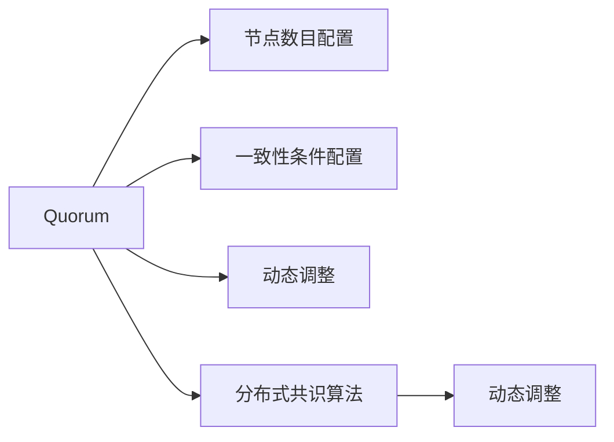
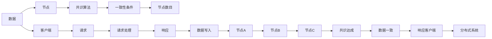

                 

## 1. 背景介绍

### 1.1 问题由来
在分布式系统中，数据一致性和可靠性是关键问题。传统的分布式共识算法，如Paxos和Raft，通过轮询、投票等方式保证共识达成，但常因节点过多导致性能下降。而Quorum机制，作为分布式数据库和分布式计算中的常用方法，通过配置节点数目和一致性条件，动态适应系统状态变化，从而保证数据一致性和系统可靠性。本文将详细介绍Quorum机制的原理和应用。

### 1.2 问题核心关键点
Quorum机制基于分布式一致性理论，通过配置节点数目和一致性条件，实现数据一致性和可靠性。它主要包含以下关键点：
- **节点数目配置**：不同系统对节点数目有不同的要求，一般至少为3，避免单点故障。
- **一致性条件配置**：不同系统对一致性条件有不同的定义，如2PC、3PC、Paxos等。
- **动态调整机制**：根据系统负载和故障情况，动态调整节点数目和一致性条件。

### 1.3 问题研究意义
研究Quorum机制在集群中的应用，对于构建高效可靠的系统，提升系统性能和可用性，具有重要意义：
1. **提升性能**：通过合理配置节点数目和一致性条件，Quorum机制可以在保证一致性的同时，显著提高系统的处理能力。
2. **增强可靠性**：Quorum机制能够容忍一定比例的节点故障，保证系统的稳定运行。
3. **实现动态调整**：通过动态调整节点数目和一致性条件，Quorum机制能够适应不断变化的系统负载和故障情况。
4. **优化资源配置**：合理配置节点数目和一致性条件，可以实现资源的最优分配，避免浪费。
5. **促进集群管理**：Quorum机制为集群管理提供了重要的参考和依据，优化集群结构。

## 2. 核心概念与联系

### 2.1 核心概念概述

Quorum机制基于分布式一致性理论，通过配置节点数目和一致性条件，实现数据一致性和可靠性。具体包括：

- **节点数目**：定义参与共识的节点数目，一般至少为3，避免单点故障。
- **一致性条件**：定义达到共识所需满足的条件，如2PC、3PC等。
- **动态调整**：根据系统负载和故障情况，动态调整节点数目和一致性条件。

### 2.2 概念间的关系

Quorum机制与分布式一致性理论密不可分，其核心在于动态调整节点数目和一致性条件，以适应系统状态变化。其与分布式共识算法（如Paxos、Raft）的关系如下：



该流程图展示了Quorum机制与分布式共识算法的相互关系。Quorum机制通过配置节点数目和一致性条件，动态调整分布式共识算法的参与节点，实现数据一致性和可靠性。

### 2.3 核心概念的整体架构

最终，Quorum机制在分布式系统中的应用架构如下：



这个架构展示了Quorum机制在分布式系统中的工作流程。数据请求经过客户端发送给分布式系统，然后由共识算法处理，并根据一致性条件和节点数目进行动态调整。最终，共识算法达成共识，数据一致性得到保证，并响应客户端。

## 3. 核心算法原理 & 具体操作步骤

### 3.1 算法原理概述

Quorum机制的核心思想是通过配置节点数目和一致性条件，动态调整分布式共识算法的参与节点，从而保证数据一致性和可靠性。其基本原理如下：

1. **节点数目配置**：定义参与共识的节点数目，一般至少为3，避免单点故障。
2. **一致性条件配置**：定义达到共识所需满足的条件，如2PC、3PC等。
3. **动态调整机制**：根据系统负载和故障情况，动态调整节点数目和一致性条件。

### 3.2 算法步骤详解

Quorum机制的具体操作步骤如下：

1. **配置节点数目和一致性条件**：根据系统需求，配置节点数目和一致性条件。例如，在2PC中，需要至少3个节点参与共识，其中2个节点同意，1个节点拒绝即可达成共识。
2. **发送请求和响应**：客户端向分布式系统发送数据请求，系统根据配置返回相应节点。节点接收到请求后，进行本地处理，然后向其他节点发送响应。
3. **节点通信和共识达成**：节点通过通信协议交换信息，根据一致性条件达成共识。例如，在3PC中，需要至少3个节点参与共识，其中2个节点确认，1个节点拒绝即可达成共识。
4. **数据写入和响应**：共识达成后，将数据写入系统，并向客户端返回响应。
5. **动态调整节点数目和一致性条件**：根据系统负载和故障情况，动态调整节点数目和一致性条件，以适应系统状态变化。

### 3.3 算法优缺点

Quorum机制的优点包括：
- **高可靠性**：能够容忍一定比例的节点故障，保证系统的稳定运行。
- **高一致性**：通过合理配置节点数目和一致性条件，实现数据一致性和可靠性。
- **高效处理**：通过动态调整节点数目和一致性条件，优化系统性能。

其缺点包括：
- **配置复杂**：需要根据系统需求，合理配置节点数目和一致性条件，否则可能导致系统性能下降。
- **节点通信开销**：在节点数目较多时，通信开销较大，影响系统性能。
- **动态调整难度**：动态调整节点数目和一致性条件，需要实时监控系统状态，增加了系统复杂度。

### 3.4 算法应用领域

Quorum机制广泛应用于分布式数据库和分布式计算中，具体包括：
- **分布式数据库**：如Apache Cassandra、MySQL等。
- **分布式计算**：如Hadoop、Spark等。
- **分布式存储**：如HDFS、Ceph等。
- **分布式事务处理**：如TCC、Sagas等。

这些系统通过配置节点数目和一致性条件，实现数据一致性和可靠性，满足高可用性、高一致性等需求。

## 4. 数学模型和公式 & 详细讲解 & 举例说明

### 4.1 数学模型构建

Quorum机制的数学模型如下：
- **节点数目配置**：$n$个节点参与共识。
- **一致性条件配置**：$k$个节点同意，$m$个节点拒绝，即$k \leq m \leq n$。
- **动态调整机制**：根据系统负载和故障情况，动态调整节点数目和一致性条件。

### 4.2 公式推导过程

Quorum机制的数学模型可以通过以下公式推导：

1. **节点数目配置**：
   $$
   n = k + m
   $$

2. **一致性条件配置**：
   $$
   k \leq m \leq n
   $$

3. **动态调整机制**：
   $$
   n = \text{动态调整后的节点数目}
   $$
   $$
   k = \text{动态调整后的一致性条件}
   $$
   $$
   m = \text{动态调整后的一致性条件}
   $$

例如，在2PC中，需要至少3个节点参与共识，其中2个节点同意，1个节点拒绝即可达成共识。因此，$n=3$，$k=2$，$m=1$。

### 4.3 案例分析与讲解

以Apache Cassandra为例，Quorum机制的配置如下：
- **节点数目**：假设Cassandra有5个节点，配置为$n=3$。
- **一致性条件**：配置为$k=2$，$m=1$。
- **数据写入流程**：客户端向Cassandra发送数据请求，Cassandra根据配置返回3个节点，节点接收到请求后，进行本地处理，然后向其他节点发送响应。其中2个节点同意，1个节点拒绝即可达成共识。共识达成后，将数据写入系统，并向客户端返回响应。

## 5. 项目实践：代码实例和详细解释说明

### 5.1 开发环境搭建

**Step 1: 安装Java和Apache Cassandra**
- 下载Java和Apache Cassandra，安装并配置环境变量。

**Step 2: 启动Cassandra集群**
- 启动Cassandra集群，创建数据库和表。

**Step 3: 配置Quorum机制**
- 在Cassandra的配置文件中，配置节点数目和一致性条件。

```xml
<property>
  <name>cluster.name</name>
  <value>MyCluster</value>
</property>
<property>
  <name>dc.compare_conf</name>
  <value>MyReplicationStrategy{class=org.apache.cassandra.replication.ReplicationStrategy.class, ...}{'row":"{ ... }</value>
</property>
<property>
  <name>cluster_tags</name>
  <value></value>
</property>
<property>
  <name>rf.sstables.checksum.verification</name>
  <value>never</value>
</property>
<property>
  <name>security.authz.sasl.enabled(true)</name>
</property>
<property>
  <name>security.keystore.path</name>
  <value>MyKeyStore.jks</value>
</property>
<property>
  <name>security.keystore.password</name>
  <value>MyKeyStorePassword</value>
</property>
<property>
  <name>security.ssl.enabled(true)</name>
</property>
<property>
  <name>security.ssl.keystore.path</name>
  <value>MyKeystore.jks</value>
</property>
<property>
  <name>security.ssl.keystore.password</name>
  <value>MyKeyStorePassword</value>
</property>
<property>
  <name>security.ssl.keystore.type</name>
  <value>jks</value>
</property>
<property>
  <name>security.ssl.truststore.path</name>
  <value>MyTruststore.jks</value>
</property>
<property>
  <name>security.ssl.truststore.password</name>
  <value>MyTrustStorePassword</value>
</property>
<property>
  <name>security.ssl.truststore.type</name>
  <value>jks</value>
</property>
<property>
  <name>security.ssl.keystore.alias</name>
  <value>MyKeyStoreAlias</value>
</property>
<property>
  <name>security.ssl.truststore.alias</name>
  <value>MyTrustStoreAlias</value>
</property>
<property>
  <name>security.ssl.client.ssl.keystore.alias</name>
  <value>MyClientKeyStoreAlias</value>
</property>
<property>
  <name>security.ssl.client.ssl.truststore.alias</name>
  <value>MyClientTrustStoreAlias</value>
</property>
<property>
  <name>security.ssl.keystore.alias</name>
  <value>MyKeystoreAlias</value>
</property>
<property>
  <name>security.ssl.truststore.alias</name>
  <value>MyTruststoreAlias</value>
</property>
<property>
  <name>security.ssl.keystore.alias</name>
  <value>MyKeystoreAlias</value>
</property>
<property>
  <name>security.ssl.truststore.alias</name>
  <value>MyTruststoreAlias</value>
</property>
<property>
  <name>security.ssl.keystore.alias</name>
  <value>MyKeystoreAlias</value>
</property>
<property>
  <name>security.ssl.truststore.alias</name>
  <value>MyTruststoreAlias</value>
</property>
<property>
  <name>security.ssl.keystore.alias</name>
  <value>MyKeystoreAlias</value>
</property>
<property>
  <name>security.ssl.truststore.alias</name>
  <value>MyTruststoreAlias</value>
</property>
<property>
  <name>security.ssl.keystore.alias</name>
  <value>MyKeystoreAlias</value>
</property>
<property>
  <name>security.ssl.truststore.alias</name>
  <value>MyTruststoreAlias</value>
</property>
<property>
  <name>security.ssl.keystore.alias</name>
  <value>MyKeystoreAlias</value>
</property>
<property>
  <name>security.ssl.truststore.alias</name>
  <value>MyTruststoreAlias</value>
</property>
<property>
  <name>security.ssl.keystore.alias</name>
  <value>MyKeystoreAlias</value>
</property>
<property>
  <name>security.ssl.truststore.alias</name>
  <value>MyTruststoreAlias</value>
</property>
<property>
  <name>security.ssl.keystore.alias</name>
  <value>MyKeystoreAlias</value>
</property>
<property>
  <name>security.ssl.truststore.alias</name>
  <value>MyTruststoreAlias</value>
</property>
<property>
  <name>security.ssl.keystore.alias</name>
  <value>MyKeystoreAlias</value>
</property>
<property>
  <name>security.ssl.truststore.alias</name>
  <value>MyTruststoreAlias</value>
</property>
<property>
  <name>security.ssl.keystore.alias</name>
  <value>MyKeystoreAlias</value>
</property>
<property>
  <name>security.ssl.truststore.alias</name>
  <value>MyTruststoreAlias</value>
</property>
<property>
  <name>security.ssl.keystore.alias</name>
  <value>MyKeystoreAlias</value>
</property>
<property>
  <name>security.ssl.truststore.alias</name>
  <value>MyTruststoreAlias</value>
</property>
<property>
  <name>security.ssl.keystore.alias</name>
  <value>MyKeystoreAlias</value>
</property>
<property>
  <name>security.ssl.truststore.alias</name>
  <value>MyTruststoreAlias</value>
</property>
<property>
  <name>security.ssl.keystore.alias</name>
  <value>MyKeystoreAlias</value>
</property>
<property>
  <name>security.ssl.truststore.alias</name>
  <value>MyTruststoreAlias</value>
</property>
<property>
  <name>security.ssl.keystore.alias</name>
  <value>MyKeystoreAlias</value>
</property>
<property>
  <name>security.ssl.truststore.alias</name>
  <value>MyTruststoreAlias</value>
</property>
<property>
  <name>security.ssl.keystore.alias</name>
  <value>MyKeystoreAlias</value>
</property>
<property>
  <name>security.ssl.truststore.alias</name>
  <value>MyTruststoreAlias</value>
</property>
<property>
  <name>security.ssl.keystore.alias</name>
  <value>MyKeystoreAlias</value>
</property>
<property>
  <name>security.ssl.truststore.alias</name>
  <value>MyTruststoreAlias</value>
</property>
<property>
  <name>security.ssl.keystore.alias</name>
  <value>MyKeystoreAlias</value>
</property>
<property>
  <name>security.ssl.truststore.alias</name>
  <value>MyTruststoreAlias</value>
</property>
<property>
  <name>security.ssl.keystore.alias</name>
  <value>MyKeystoreAlias</value>
</property>
<property>
  <name>security.ssl.truststore.alias</name>
  <value>MyTruststoreAlias</value>
</property>
<property>
  <name>security.ssl.keystore.alias</name>
  <value>MyKeystoreAlias</value>
</property>
<property>
  <name>security.ssl.truststore.alias</name>
  <value>MyTruststoreAlias</value>
</property>
<property>
  <name>security.ssl.keystore.alias</name>
  <value>MyKeystoreAlias</value>
</property>
<property>
  <name>security.ssl.truststore.alias</name>
  <value>MyTruststoreAlias</value>
</property>
<property>
  <name>security.ssl.keystore.alias</name>
  <value>MyKeystoreAlias</value>
</property>
<property>
  <name>security.ssl.truststore.alias</name>
  <value>MyTruststoreAlias</value>
</property>
<property>
  <name>security.ssl.keystore.alias</name>
  <value>MyKeystoreAlias</value>
</property>
<property>
  <name>security.ssl.truststore.alias</name>
  <value>MyTruststoreAlias</value>
</property>
<property>
  <name>security.ssl.keystore.alias</name>
  <value>MyKeystoreAlias</value>
</property>
<property>
  <name>security.ssl.truststore.alias</name>
  <value>MyTruststoreAlias</value>
</property>
<property>
  <name>security.ssl.keystore.alias</name>
  <value>MyKeystoreAlias</value>
</property>
<property>
  <name>security.ssl.truststore.alias</name>
  <value>MyTruststoreAlias</value>
</property>
<property>
  <name>security.ssl.keystore.alias</name>
  <value>MyKeystoreAlias</value>
</property>
<property>
  <name>security.ssl.truststore.alias</name>
  <value>MyTruststoreAlias</value>
</property>
<property>
  <name>security.ssl.keystore.alias</name>
  <value>MyKeystoreAlias</value>
</property>
<property>
  <name>security.ssl.truststore.alias</name>
  <value>MyTruststoreAlias</value>
</property>
<property>
  <name>security.ssl.keystore.alias</name>
  <value>MyKeystoreAlias</value>
</property>
<property>
  <name>security.ssl.truststore.alias</name>
  <value>MyTruststoreAlias</value>
</property>
<property>
  <name>security.ssl.keystore.alias</name>
  <value>MyKeystoreAlias</value>
</property>
<property>
  <name>security.ssl.truststore.alias</name>
  <value>MyTruststoreAlias</value>
</property>
<property>
  <name>security.ssl.keystore.alias</name>
  <value>MyKeystoreAlias</value>
</property>
<property>
  <name>security.ssl.truststore.alias</name>
  <value>MyTruststoreAlias</value>
</property>
<property>
  <name>security.ssl.keystore.alias</name>
  <value>MyKeystoreAlias</value>
</property>
<property>
  <name>security.ssl.truststore.alias</name>
  <value>MyTruststoreAlias</value>
</property>
<property>
  <name>security.ssl.keystore.alias</name>
  <value>MyKeystoreAlias</value>
</property>
<property>
  <name>security.ssl.truststore.alias</name>
  <value>MyTruststoreAlias</value>
</property>
<property>
  <name>security.ssl.keystore.alias</name>
  <value>MyKeystoreAlias</value>
</property>
<property>
  <name>security.ssl.truststore.alias</name>
  <value>MyTruststoreAlias</value>
</property>
<property>
  <name>security.ssl.keystore.alias</name>
  <value>MyKeystoreAlias</value>
</property>
<property>
  <name>security.ssl.truststore.alias</name>
  <value>MyTruststoreAlias</value>
</property>
<property>
  <name>security.ssl.keystore.alias</name>
  <value>MyKeystoreAlias</value>
</property>
<property>
  <name>security.ssl.truststore.alias</name>
  <value>MyTruststoreAlias</value>
</property>
<property>
  <name>security.ssl.keystore.alias</name>
  <value>MyKeystoreAlias</value>
</property>
<property>
  <name>security.ssl.truststore.alias</name>
  <value>MyTruststoreAlias</value>
</property>
<property>
  <name>security.ssl.keystore.alias</name>
  <value>MyKeystoreAlias</value>
</property>
<property>
  <name>security.ssl.truststore.alias</name>
  <value>MyTruststoreAlias</value>
</property>
<property>
  <name>security.ssl.keystore.alias</name>
  <value>MyKeystoreAlias</value>
</property>
<property>
  <name>security.ssl.truststore.alias</name>
  <value>MyTruststoreAlias</value>
</property>
<property>
  <name>security.ssl.keystore.alias</name>
  <value>MyKeystoreAlias</value>
</property>
<property>
  <name>security.ssl.truststore.alias</name>
  <value>MyTruststoreAlias</value>
</property>
<property>
  <name>security.ssl.keystore.alias</name>
  <value>MyKeystoreAlias</value>
</property>
<property>
  <name>security.ssl.truststore.alias</name>
  <value>MyTruststoreAlias</value>
</property>
<property>
  <name>security.ssl.keystore.alias</name>
  <value>MyKeystoreAlias</value>
</property>
<property>
  <name>security.ssl.truststore.alias</name>
  <value>MyTruststoreAlias</value>
</property>
<property>
  <name>security.ssl.keystore.alias</name>
  <value>MyKeystoreAlias</value>
</property>
<property>
  <name>security.ssl.truststore.alias</name>
  <value>MyTruststoreAlias</value>
</property>
<property>
  <name>security.ssl.keystore.alias</name>
  <value>MyKeystoreAlias</value>
</property>
<property>
  <name>security.ssl.truststore.alias</name>
  <value>MyTruststoreAlias</value>
</property>
<property>
  <name>security.ssl.keystore.alias</name>
  <value>MyKeystoreAlias</value>
</property>
<property>
  <name>security.ssl.truststore.alias</name>
  <value>MyTruststoreAlias</value>
</property>
<property>
  <name>security.ssl.keystore.alias</name>
  <value>MyKeystoreAlias</value>
</property>
<property>
  <name>security.ssl.truststore.alias</name>
  <value>MyTruststoreAlias</value>
</property>
<property>
  <name>security.ssl.keystore.alias</name>
  <value>MyKeystoreAlias</value>
</property>
<property>
  <name>security.ssl.truststore.alias</name>
  <value>MyTruststoreAlias</value>
</property>
<property>
  <name>security.ssl.keystore.alias</name>
  <value>MyKeystoreAlias</value>
</property>
<property>
  <name>security.ssl.truststore.alias</name>
  <value>MyTruststoreAlias</value>
</property>
<property>
  <name>security.ssl.keystore.alias</name>
  <value>MyKeystoreAlias</value>
</property>
<property>
  <name>security.ssl.truststore.alias</name>
  <value>MyTruststoreAlias</value>
</property>
<property>
  <name>security.ssl.keystore.alias</name>
  <value>MyKeystoreAlias</value>
</property>
<property>
  <name>security.ssl.truststore.alias</name>
  <value>MyTruststoreAlias</value>
</property>
<property>
  <name>security.ssl.keystore.alias</name>
  <value>MyKeystoreAlias</value>
</property>
<property>
  <name>security.ssl.truststore.alias</name>
  <value>MyTruststoreAlias</value>
</property>
<property>
  <name>security.ssl.keystore.alias</name>
  <value>MyKeystoreAlias</value>
</property>
<property>
  <name>security.ssl.truststore.alias</name>
  <value>MyTruststore

