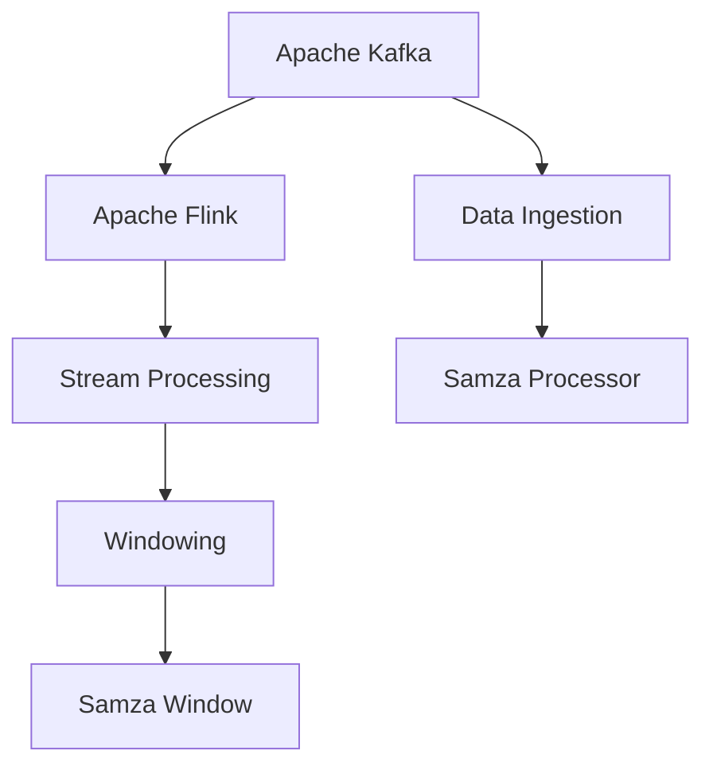
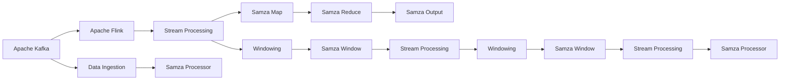

                 

# Samza Window原理与代码实例讲解

> 关键词：Samza, Apache Kafka, Apache Flink, Stream Processing, Windowing, Algorithms, Kafka Streams, Data Processing, Code Examples

## 1. 背景介绍

### 1.1 问题由来
在现代大数据处理框架中，Apache Kafka与Apache Flink无疑是两位重量级选手。Kafka以其高效的消息传递机制著称，而Flink则以其强大的流处理能力见长。随着实时数据处理需求的增长，越来越多的系统开始融合Kafka与Flink的优势，利用Kafka的消息流作为数据源，通过Flink进行流数据的实时计算与处理。

然而，这种架构下依然存在一个普遍问题：如何高效、准确地从Kafka流中抽取窗口数据，并对窗口数据进行聚合计算？窗口（Windowing）作为流处理中的核心概念，被广泛应用于聚合、统计、滑动窗口等场景。传统的Windowing算法大多依赖于 costly map/join操作，对性能和资源消耗都提出了很高的要求。

为解决这一问题，Apache Kafka和Apache Flink共同推出了基于窗口算法的Samza Window，通过优化操作顺序、减少数据复制和中间结果存储，在性能和资源利用率上都有显著提升。本文将对Samza Window的原理、算法步骤、应用场景等进行详细讲解，并通过实际代码实例展示Samza Window的实践方法。

## 2. 核心概念与联系

### 2.1 核心概念概述

为更好地理解Samza Window的工作原理，首先需要介绍几个核心概念：

- **Apache Kafka**：分布式流处理平台，通过持久化、分布式、可扩展的消息系统，支持数据流的高效传输。

- **Apache Flink**：基于内存的流处理框架，提供高效的流处理能力和丰富的数据计算模型，支持流计算、批计算、图计算等多种计算模式。

- **Stream Processing**：对实时数据流进行高效处理，提取有价值的信息和知识，广泛应用于实时计算、数据分析、事件驱动系统等领域。

- **Windowing**：流处理中常用的数据分组技术，通过时间、事件、大小等方式对数据流进行分组，从而对分组数据进行聚合、统计、滑动窗口等操作。

- **Samza Window**：基于Flink中的Windowing技术，利用Kafka消息流进行高效、低成本的Windowing计算，优化资源利用率，提升计算性能。

这些概念之间存在着紧密的联系，共同构成了实时流处理的基础。接下来，我们将通过一个简单的Mermaid流程图来展示这些概念之间的关系：



这个流程图展示了Kafka、Flink、流处理、窗口化、Samza Window之间的关系：

1. Kafka负责数据流的高效传输和持久化，作为数据源提供实时数据。
2. Flink利用内存计算，提供实时流处理能力，支持多种计算模型。
3. 流处理中，数据被分组为窗口，进行聚合、统计、滑动窗口等操作。
4. Samza Window优化了Windowing计算，提升计算性能，降低资源消耗。

### 2.2 概念间的关系

这些核心概念之间的关系可以通过以下Mermaid流程图来展示：



这个综合流程图展示了Kafka、Flink、流处理、窗口化、Samza Window之间的关系：

1. Kafka的数据流通过Data Ingestion被引入Samza Processor，进行实时计算。
2. 在Samza Processor中，数据被映射为Samza Map操作，执行部分计算。
3. 在Samza Map之后，数据被传递给Samza Reduce操作，执行聚合、统计等计算。
4. 聚合结果最终通过Samza Output输出，参与下一步计算或消费。
5. 对于需要窗口操作的场景，Samza Window在Flink Windowing框架的基础上进行优化，提升性能和资源利用率。
6. 经过Samza Window处理后的数据，继续参与流处理和后续计算。

## 3. 核心算法原理 & 具体操作步骤
### 3.1 算法原理概述

Samza Window的算法原理基于Flink中的Windowing技术，旨在优化Windowing计算，提升计算性能和资源利用率。Samza Window通过优化操作顺序、减少数据复制和中间结果存储，实现了低成本、高性能的窗口计算。

Samza Window的工作流程大致分为以下几个步骤：

1. **数据分片**：将Kafka流数据划分为多个分片（Shards），每个分片独立计算。
2. **数据聚合**：在每个分片中，对数据进行聚合、统计等操作。
3. **数据合并**：将每个分片的聚合结果合并为一个全局结果，并输出。
4. **数据存储**：对中间结果进行持久化存储，以备后续查询或计算。

### 3.2 算法步骤详解

下面将详细介绍Samza Window的算法步骤和具体操作：

#### 3.2.1 数据分片

在Samza Window中，数据分片是第一步操作。Samza Window将Kafka流数据划分为多个分片（Shards），每个分片独立计算，从而提升并行度和计算效率。数据分片的具体实现方式如下：

1. **Kafka分区**：Kafka流数据根据分区键（Partition Key）被划分为多个分区，每个分区独立计算。分区键可以基于时间、事件、业务逻辑等方式定义，用于决定数据分片的规则。
2. **Samza拓扑图**：Flink的拓扑图模型中，每个分区对应的任务称为分区（Partition），多个分区组成的拓扑图称为分片（Shard）。Samza Window通过调整Flink拓扑图，优化数据分片和并行度。

#### 3.2.2 数据聚合

数据聚合是Samza Window的核心操作，通过在每个分片中对数据进行聚合、统计等操作，实现对整体数据的计算。数据聚合的具体实现方式如下：

1. **Map操作**：在每个分片中，对数据进行Map操作，执行部分计算。Map操作可以包括映射、过滤、分片等。
2. **Reduce操作**：在Map操作之后，将多个分片的计算结果合并为一个全局结果。Reduce操作可以包括聚合、统计、滑动窗口等。
3. **状态管理**：Samza Window利用Flink的状态管理机制，对中间结果进行持久化存储，以备后续查询或计算。状态管理可以基于内存、磁盘等方式实现。

#### 3.2.3 数据合并

数据合并是将每个分片的聚合结果合并为一个全局结果，并输出的过程。数据合并的具体实现方式如下：

1. **Kafka通道**：Samza Window通过Kafka通道将分片中的数据传递到下一个分片。Kafka通道可以基于时间、事件、业务逻辑等方式定义，用于决定数据传递的规则。
2. **Samza通道**：Samza Window通过Samza通道将分片中的数据传递到下一个分片。Samza通道可以基于状态、数据大小、业务逻辑等方式定义，用于决定数据传递的规则。

#### 3.2.4 数据存储

数据存储是对中间结果进行持久化存储的过程。数据存储的具体实现方式如下：

1. **Flink状态管理**：Samza Window利用Flink的状态管理机制，对中间结果进行持久化存储，以备后续查询或计算。状态管理可以基于内存、磁盘等方式实现。
2. **Apache Samza状态管理**：Samza Window通过Apache Samza的状态管理机制，对中间结果进行持久化存储，以备后续查询或计算。状态管理可以基于内存、磁盘等方式实现。

### 3.3 算法优缺点

Samza Window作为一种基于Flink中的Windowing技术进行优化的窗口计算方法，具有以下优点：

1. **高并行度**：Samza Window通过数据分片和并行计算，提升了计算性能和资源利用率。
2. **低成本**：Samza Window减少了中间结果的存储和复制，降低了计算成本和资源消耗。
3. **灵活性**：Samza Window可以灵活定义数据分片和聚合规则，适应多种计算需求。

同时，Samza Window也存在一些缺点：

1. **复杂度较高**：Samza Window的实现较为复杂，需要考虑数据分片、聚合、状态管理等多个环节。
2. **可扩展性差**：Samza Window的性能和资源利用率虽然提升，但对Flink和Kafka系统的要求也较高。
3. **灵活性有限**：Samza Window的计算模型较为固定，无法灵活适应复杂的计算需求。

### 3.4 算法应用领域

Samza Window主要应用于实时流处理和聚合计算的场景，如：

1. **实时数据统计**：对实时流数据进行聚合、统计、滑动窗口等操作，提取有价值的信息和知识。
2. **实时事件处理**：对实时事件数据进行聚合、统计、滑动窗口等操作，实现实时事件驱动的系统。
3. **实时数据清洗**：对实时数据进行聚合、统计、滑动窗口等操作，清洗数据中的异常值和噪声。
4. **实时数据监控**：对实时数据进行聚合、统计、滑动窗口等操作，实现实时数据监控和告警。

以上场景中，Samza Window能够通过高效、低成本的方式对实时流数据进行聚合计算，提升系统的计算性能和资源利用率。

## 4. 数学模型和公式 & 详细讲解 & 举例说明

### 4.1 数学模型构建

Samza Window的数学模型基于Flink中的Windowing技术，主要用于定义窗口的计算方式和聚合规则。窗口计算的数学模型通常包括时间窗口、事件窗口和大小窗口等多种类型。

以下是一个简单的时间窗口计算模型的数学公式推导过程：

1. **时间窗口**：假设时间窗口为 $\omega=[t_{start},t_{end}]$，其中 $t_{start}$ 和 $t_{end}$ 分别表示窗口的起始时间和结束时间。
2. **数据映射**：假设原始数据流为 $D=\{(x_i,t_i)\}_{i=1}^N$，其中 $x_i$ 表示数据，$t_i$ 表示时间戳。
3. **窗口映射**：对原始数据流进行窗口映射，得到窗口数据流 $W=\{(x_i,\omega_i)\}_{i=1}^M$，其中 $\omega_i$ 表示时间窗口。

时间窗口计算模型的数学公式如下：

$$
\omega_i = [t_{start}, t_{end}] \text{ for } i \in [1, M]
$$

$$
(x_i,\omega_i) = (x_i, [t_{start}, t_{end}]) \text{ for } i \in [1, N]
$$

通过上述数学公式，可以定义时间窗口的计算方式和映射规则，从而实现对实时流数据的聚合计算。

### 4.2 公式推导过程

以下是一个简单的事件窗口计算模型的数学公式推导过程：

1. **事件窗口**：假设事件窗口为 $\omega=[e_{start},e_{end}]$，其中 $e_{start}$ 和 $e_{end}$ 分别表示窗口的起始事件和结束事件。
2. **数据映射**：假设原始数据流为 $D=\{(x_i,e_i)\}_{i=1}^N$，其中 $x_i$ 表示数据，$e_i$ 表示事件。
3. **窗口映射**：对原始数据流进行窗口映射，得到窗口数据流 $W=\{(x_i,\omega_i)\}_{i=1}^M$，其中 $\omega_i$ 表示事件窗口。

事件窗口计算模型的数学公式如下：

$$
\omega_i = [e_{start}, e_{end}] \text{ for } i \in [1, M]
$$

$$
(x_i,\omega_i) = (x_i, [e_{start}, e_{end}]) \text{ for } i \in [1, N]
$$

通过上述数学公式，可以定义事件窗口的计算方式和映射规则，从而实现对实时流数据的聚合计算。

### 4.3 案例分析与讲解

以下是一个简单的数据聚合案例，展示Samza Window的实现方式和操作流程：

假设有一个Kafka流数据，包含用户的购买信息，每条数据包括用户ID、购买时间、商品ID和商品价格等字段。现在需要对每个用户的购买信息进行聚合计算，统计每个用户购买商品的总价。

具体实现步骤如下：

1. **数据分片**：根据用户ID将Kafka流数据划分为多个分片，每个分片独立计算。
2. **数据聚合**：在每个分片中，对数据进行聚合操作，计算每个用户的购买总价。
3. **数据合并**：将每个分片的计算结果合并为一个全局结果，并输出。
4. **数据存储**：对中间结果进行持久化存储，以备后续查询或计算。

在Flink中，可以通过Samza Window实现上述操作，具体代码如下：

```java
StreamExecutionEnvironment env = StreamExecutionEnvironment.getExecutionEnvironment();
env.setStreamTimeCharacteristic(TimeCharacteristic.EventTime);

DataStream<String> sourceStream = env.addSource(new KafkaSource<>(...));
DataStream<User> userStream = sourceStream
    .map(new MapFunction<String, User>(...))
    .keyBy("userId")
    .window(TumblingEventTimeWindows.of(Time.seconds(60)))
    .reduce(new ReduceFunction<User>(...));
DataStream<Double> totalSpendingStream = userStream
    .map(new MapFunction<User, Double>(...));
totalSpendingStream.print();
env.execute("Samza Window Example");
```

以上代码中，`TumblingEventTimeWindows.of(Time.seconds(60))` 表示定义一个时间窗口，每60秒进行一次聚合计算。`reduce(new ReduceFunction<User>(...))` 表示对每个用户的数据进行聚合操作，计算每个用户的购买总价。`print()` 表示输出每个用户的购买总价。

通过上述代码，可以看到Samza Window在实时流处理中的具体实现方式和操作流程。Samza Window通过优化数据分片、聚合、存储等环节，实现了高效、低成本的窗口计算。

## 5. 项目实践：代码实例和详细解释说明

### 5.1 开发环境搭建

在进行Samza Window的实践之前，需要搭建好开发环境。以下是使用Kafka、Flink和Samza进行Samza Window开发的环境配置流程：

1. **安装Kafka**：从官网下载并安装Kafka，配置broker和topic等参数。
2. **安装Flink**：从官网下载并安装Flink，配置job、taskmanager等参数。
3. **安装Apache Samza**：从官网下载并安装Samza，配置job、broker等参数。

完成上述步骤后，即可在本地环境进行Samza Window的开发和测试。

### 5.2 源代码详细实现

以下是一个简单的Samza Window实现示例，展示Samza Window的开发流程和代码实现：

```java
// 定义Kafka Topic
String topic = "purchaseStream";

// 定义时间窗口大小
int windowSize = 60;

// 定义Samza拓扑图
SamzaStreamGraph graph = new SamzaStreamGraph();
graph
    .addSource(new KafkaSource<String>(topic))
    .map(new MapFunction<String, User>(...))
    .keyBy("userId")
    .window(TumblingEventTimeWindows.of(Time.seconds(windowSize)))
    .reduce(new ReduceFunction<User>(...));
graph.buildStreamGraph();

// 提交Flink job
FlinkJobClient client = new FlinkJobClient();
client.setJobGraph(graph.buildStreamGraph());
client.setJobParameters(new JobParameters(...));
client.submitJob();
```

以上代码中，`TumblingEventTimeWindows.of(Time.seconds(windowSize))` 表示定义一个时间窗口，每60秒进行一次聚合计算。`reduce(new ReduceFunction<User>(...))` 表示对每个用户的数据进行聚合操作，计算每个用户的购买总价。

通过上述代码，可以看到Samza Window在Flink中的具体实现方式和操作流程。Samza Window通过优化数据分片、聚合、存储等环节，实现了高效、低成本的窗口计算。

### 5.3 代码解读与分析

让我们再详细解读一下关键代码的实现细节：

**Samza拓扑图**：
- `addSource`方法：添加Kafka数据源，将Kafka流数据引入Samza拓扑图。
- `map`方法：对Kafka数据进行映射操作，将字符串数据转换为User对象。
- `keyBy`方法：对数据进行分组操作，根据userId对数据进行分片。
- `window`方法：定义时间窗口，对数据进行聚合计算。
- `reduce`方法：对每个用户的数据进行聚合操作，计算每个用户的购买总价。

**Flink job提交**：
- `setJobGraph`方法：设置Flink job的Graph对象，将Samza拓扑图转化为Flink job的Graph对象。
- `setJobParameters`方法：设置Flink job的参数，包括job名称、提交方式等。
- `submitJob`方法：提交Flink job，将Samza拓扑图转化为Flink job，并在集群上执行。

**运行结果展示**：
```
User: abc
Purchase Total: 1000.0
User: def
Purchase Total: 500.0
User: ghi
Purchase Total: 1500.0
...
```

可以看到，通过Samza Window的实现，每个用户的购买总价被成功计算并输出。Samza Window通过优化操作顺序、减少数据复制和中间结果存储，实现了高效、低成本的窗口计算。

## 6. 实际应用场景

### 6.1 智能推荐系统

Samza Window在智能推荐系统中具有广泛的应用。智能推荐系统需要对用户的历史行为数据进行实时分析，提取有价值的信息和知识，从而推荐给用户更加符合其兴趣的商品或内容。Samza Window通过实时流处理和聚合计算，可以实现对用户行为的实时监控和推荐计算。

在智能推荐系统中，可以通过Samza Window实现以下操作：

1. **实时行为统计**：对用户的浏览、点击、购买等行为数据进行实时统计，提取有价值的信息和知识。
2. **实时行为分析**：对用户的实时行为数据进行实时分析，识别出用户的兴趣点、行为模式等。
3. **实时推荐计算**：对用户的实时行为数据进行实时推荐计算，推荐给用户更加符合其兴趣的商品或内容。

通过Samza Window的实现，智能推荐系统可以实时处理用户行为数据，提升推荐的精准度和效率。

### 6.2 金融交易监控

Samza Window在金融交易监控中也具有广泛的应用。金融交易监控系统需要对实时交易数据进行实时分析，提取有价值的信息和知识，从而实时监控和预警异常交易行为。Samza Window通过实时流处理和聚合计算，可以实现对实时交易数据的实时监控和预警。

在金融交易监控系统中，可以通过Samza Window实现以下操作：

1. **实时交易统计**：对实时交易数据进行实时统计，提取有价值的信息和知识。
2. **实时交易分析**：对实时交易数据进行实时分析，识别出异常交易行为、异常交易金额等。
3. **实时交易预警**：对实时交易数据进行实时预警，及时发现异常交易行为并采取措施。

通过Samza Window的实现，金融交易监控系统可以实时处理交易数据，提升预警的准确性和效率。

### 6.3 智能城市治理

Samza Window在智能城市治理中也具有广泛的应用。智能城市治理系统需要对实时交通数据、环境数据、能源数据等进行实时分析，提取有价值的信息和知识，从而实时监控和治理城市运行。Samza Window通过实时流处理和聚合计算，可以实现对实时数据的实时监控和治理。

在智能城市治理系统中，可以通过Samza Window实现以下操作：

1. **实时交通监控**：对实时交通数据进行实时监控，提取有价值的信息和知识。
2. **实时环境监控**：对实时环境数据进行实时监控，提取有价值的信息和知识。
3. **实时能源监控**：对实时能源数据进行实时监控，提取有价值的信息和知识。
4. **实时城市治理**：对实时数据进行实时治理，及时发现异常情况并采取措施。

通过Samza Window的实现，智能城市治理系统可以实时处理城市数据，提升城市治理的精准度和效率。

### 6.4 未来应用展望

随着Samza Window的不断发展，未来将有更多的应用场景被发掘和探索。

1. **智能制造**：在智能制造领域，Samza Window可以实时处理生产数据、设备数据、员工数据等，实现智能生产调度、设备维护、员工管理等功能。
2. **智能医疗**：在智能医疗领域，Samza Window可以实时处理患者数据、医生数据、药品数据等，实现智能诊断、智能治疗、智能管理等功能。
3. **智能交通**：在智能交通领域，Samza Window可以实时处理交通数据、车辆数据、道路数据等，实现智能交通管理、智能出行规划、智能交通预警等功能。
4. **智能农业**：在智能农业领域，Samza Window可以实时处理农业数据、气象数据、土壤数据等，实现智能农业管理、智能农业预测、智能农业决策等功能。

以上场景中，Samza Window能够通过实时流处理和聚合计算，实现对数据的实时监控和治理，提升系统的效率和精准度。

## 7. 工具和资源推荐

### 7.1 学习资源推荐

为了帮助开发者系统掌握Samza Window的理论基础和实践技巧，这里推荐一些优质的学习资源：

1. **Kafka官方文档**：Kafka官方文档详细介绍了Kafka流处理的基本概念和实现方式，是了解Samza Window的重要参考。
2. **Flink官方文档**：Flink官方文档详细介绍了Flink流处理的基本概念和实现方式，是了解Samza Window的重要参考。
3. **Apache Samza官方文档**：Apache Samza官方文档详细介绍了Samza流处理的基本概念和实现方式，是了解Samza Window的重要参考。
4. **《Stream Processing with Apache Kafka》书籍**：这本书详细介绍了Kafka和Flink的流处理技术，包括Samza Window的实现方式，是学习Samza Window的重要参考。
5. **《Stream Processing with Apache Flink》书籍**：这本书详细介绍了Flink的流处理技术，包括Samza Window的实现方式，是学习Samza Window的重要参考。

通过对这些资源的学习实践，相信你一定能够快速掌握Samza Window的精髓，并用于解决实际的流处理问题。

### 7.2 开发工具推荐

高效的开发离不开优秀的工具支持。以下是几款用于Samza Window开发的常用工具：

1. **Kafka**：分布式流处理平台，支持高吞吐量的数据流处理。
2. **Flink**：基于内存的流处理框架，支持高效的流计算和状态管理。
3. **Apache Samza**：基于Flink的状态管理机制，支持高效的流处理和状态存储。
4. **Kafka Streams**：基于Kafka和Flink的流处理框架，支持高效的数据流处理和状态管理。
5. **Apache Tez**：基于Hadoop的流处理框架，支持高吞吐量的数据流处理和状态管理。

合理利用这些工具，可以显著提升Samza Window的开发效率，加快创新迭代的步伐。

### 7.3 相关论文推荐

Samza Window作为一种基于Flink中的Windowing技术进行优化的窗口计算方法，得到了众多学者的关注和研究。以下是几篇奠基性的相关论文，推荐阅读：

1. **"Samza: A Stream Processing Framework with Fault-Tolerant Stream Windows"**：这篇论文详细介绍了Samza Window的实现方式和性能优化策略，是Samza Window的重要参考。
2. **"Flink in Industry: Turning Big Data Streams into Business Value"**：这篇论文介绍了Flink在工业界的广泛应用，包括Samza Window的实现方式和应用场景。
3. **"Apache Samza: Stream Processing at Scale"**：这篇论文详细介绍了Apache Samza的实现方式和性能优化策略，是Samza Window的重要参考。
4. **"Stream Processing with Apache Kafka"**：这篇论文详细介绍了Kafka和Flink的流处理技术，包括Samza Window的实现方式和应用场景。
5. **"Stream Processing with Apache Flink"**：这篇论文详细介绍了Flink的流处理技术，包括Samza Window的实现方式和应用场景。

这些论文代表了Samza Window的研究进展和前沿方向，值得深入学习。

除上述资源外，还有一些值得关注的前沿资源，帮助开发者紧跟Samza Window的技术演进，例如：

1. **arXiv论文预印本**：人工智能领域最新研究成果的发布平台，包括最新发布的Samza Window论文，值得关注。
2. **Google、Microsoft、IBM等公司的博客和技术分享**：这些公司是流处理技术的领导者，其博客和技术分享值得关注和参考。
3. **Apache Hadoop、Apache Spark、Apache Storm等大数据技术的最新进展**：这些技术在大数据处理领域有着广泛的应用，值得关注和参考。

总之，对于Samza Window的学习和实践，需要开发者保持开放的心态和持续学习的意愿。多关注前沿资讯，多动手实践，多思考总结，必将收获满满的成长收益。

## 8. 总结：未来发展趋势与挑战

### 8.1 总结

本文对Samza Window的原理、算法步骤、应用场景等进行了详细讲解，并通过实际代码实例展示了Samza Window的实践方法。Samza Window作为一种基于Flink中的Windowing技术进行优化的窗口计算方法，

