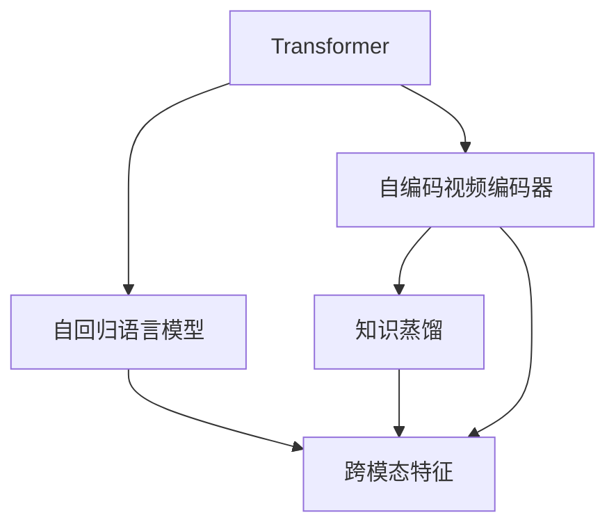
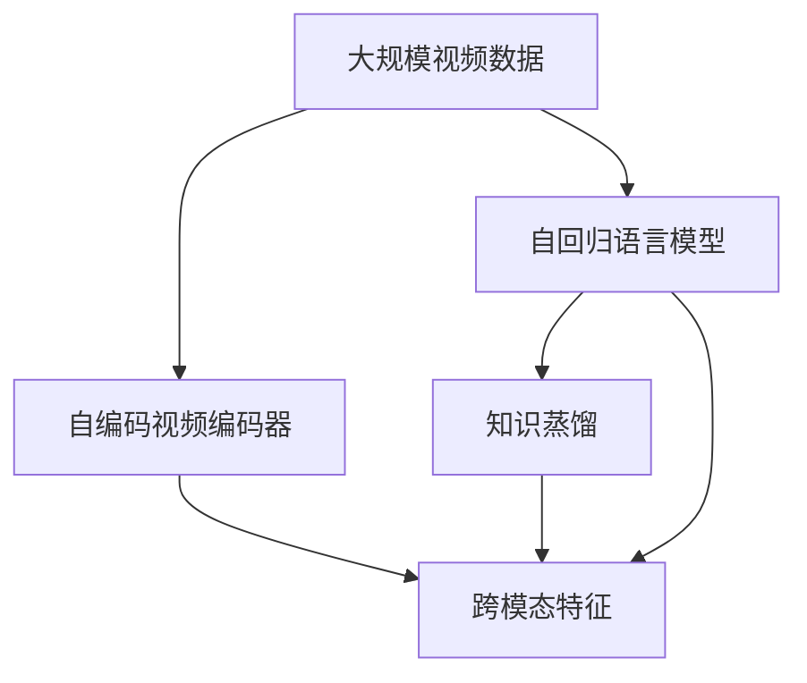

                 

# Transformer大模型实战 VideoBERT模型学习语言及视频特征

> 关键词：Transformer, VideoBERT, 大语言模型, 自回归模型, 自编码模型, 语言-视觉多模态, 知识蒸馏, 视频特征提取, 推理优化, 深度学习, 自然语言处理(NLP), 计算机视觉(CV)

## 1. 背景介绍

### 1.1 问题由来

近年来，随着深度学习技术的快速发展，Transformer大模型在自然语言处理(NLP)和计算机视觉(CV)领域取得了显著进展。然而，尽管这些大模型在各自领域表现出色，但在将语言与视觉特征结合的综合任务上，如视频生成、视频描述、视觉问答等，仍存在一定的挑战。例如，仅靠语言模型难以捕捉视频中的动态变化，而视觉模型又难以理解视频背后的自然语言描述。为了解决这些问题，研究者们提出了视频语言模型，试图同时学习语言和视觉知识，实现跨模态的理解和推理。

VideoBERT作为一类典型的视频语言模型，通过结合Transformer和自编码器架构，可以在视频帧序列和语言描述之间建立有效的映射关系，从而实现高效的视频特征学习、跨模态理解和推理，以及多模态任务的处理。本文将深入介绍VideoBERT模型的原理、结构和应用，并结合代码实践，带领读者从理论到实践，全面掌握VideoBERT模型的训练与使用。

### 1.2 问题核心关键点

大语言模型通常以Transformer为代表，通过自回归或自编码方式预训练，学习到强大的语言表示能力。然而，在将视频与语言结合的综合任务中，语言模型难以捕捉视频动态变化，而视觉模型又难以理解视频背后自然语言描述。VideoBERT模型通过结合Transformer和自编码器架构，实现了跨模态的理解和推理，成为处理视频语言综合任务的重要工具。

VideoBERT模型的核心思想是，通过预训练学习到跨模态的特征表示，然后在细粒度任务上对预训练模型进行微调，使得模型能够高效地执行视频语言综合任务。具体而言，VideoBERT模型包括两个主要部分：一个自回归的语言模型和一个自编码的视频编码器，两者通过知识蒸馏机制进行联合训练，最终生成跨模态的特征表示。

## 2. 核心概念与联系

### 2.1 核心概念概述

为更好地理解VideoBERT模型，我们首先介绍几个关键概念：

- Transformer模型：一种基于自注意力机制的深度学习模型，能够高效地处理序列数据。
- 自回归模型：一种按照时间顺序预测序列中每个元素的模型，常用于文本生成和语言建模。
- 自编码模型：一种通过编码器和解码器进行特征压缩和重构的深度学习模型，常用于特征提取和降维。
- 多模态学习：指同时利用多种类型的数据（如文本、图像、视频等）进行联合学习，以提高模型的泛化能力和理解能力。
- 知识蒸馏：一种通过将大型复杂模型的知识转移到小型模型中，以提高小型模型性能的技术。

这些概念之间的关系可以通过以下Mermaid流程图来展示：



这个流程图展示了Transformer模型、自回归语言模型、自编码视频编码器以及知识蒸馏之间的关系。这些组件共同构建了VideoBERT模型的核心架构，使其能够在视频语言综合任务中发挥强大的跨模态理解和推理能力。

### 2.2 概念间的关系

这些核心概念之间存在着紧密的联系，形成了VideoBERT模型的完整生态系统。下面我们通过几个Mermaid流程图来展示这些概念之间的关系。

#### 2.2.1 VideoBERT模型的学习范式



这个流程图展示了VideoBERT模型的学习范式，包括自编码视频编码器对大规模视频数据的预训练，自回归语言模型对大规模文本数据的预训练，以及知识蒸馏机制将两者联合训练，生成跨模态的特征表示。

#### 2.2.2 多模态学习在VideoBERT中的应用


这个流程图展示了多模态学习在VideoBERT中的应用，即通过联合学习视频和文本特征，生成能够执行视频语言综合任务的跨模态特征表示。

#### 2.2.3 知识蒸馏在VideoBERT中的作用


这个流程图展示了知识蒸馏在VideoBERT中的作用，即通过将大型复杂模型的知识转移到小型模型中，以提高小型模型的性能。

## 3. 核心算法原理 & 具体操作步骤

### 3.1 算法原理概述

VideoBERT模型的核心思想是通过联合学习视频和文本特征，生成跨模态的特征表示，然后在细粒度任务上对预训练模型进行微调，以实现高效的视频语言综合任务处理。VideoBERT模型包括两个主要部分：一个自回归的语言模型和一个自编码的视频编码器，两者通过知识蒸馏机制进行联合训练，最终生成跨模态的特征表示。

具体而言，VideoBERT模型的训练过程分为两个阶段：

1. 预训练阶段：分别对自回归语言模型和自编码视频编码器进行预训练，学习各自领域的特征表示。
2. 微调阶段：在预训练的基础上，对两个模型进行联合微调，以生成跨模态的特征表示，并在具体的视频语言综合任务上进行细粒度微调，以提升模型性能。

### 3.2 算法步骤详解

VideoBERT模型的训练步骤如下：

1. 准备数据集：收集大规模视频和文本数据，将数据集划分为训练集、验证集和测试集。
2. 构建模型架构：定义自回归语言模型和自编码视频编码器的架构，并设置相应的超参数。
3. 预训练两个模型：分别对自回归语言模型和自编码视频编码器进行预训练，学习各自领域的特征表示。
4. 知识蒸馏：通过将大型复杂模型的知识转移到小型模型中，以提高小型模型的性能。
5. 联合微调：在预训练的基础上，对两个模型进行联合微调，以生成跨模态的特征表示。
6. 细粒度微调：在具体的视频语言综合任务上进行细粒度微调，以提升模型性能。
7. 评估模型：在测试集上评估微调后模型的性能，对比预训练和微调前后的效果。

### 3.3 算法优缺点

VideoBERT模型具有以下优点：

- 强大的跨模态特征表示能力：通过联合学习视频和文本特征，生成跨模态的特征表示，能够高效地处理视频语言综合任务。
- 灵活的微调能力：通过细粒度微调，可以在具体任务上对模型进行优化，提升模型性能。
- 高泛化能力：通过预训练和微调，模型能够在多种任务上取得不错的表现。

VideoBERT模型也存在以下缺点：

- 对数据质量要求高：预训练和微调过程依赖于高质量的视频和文本数据，数据质量的好坏直接影响模型性能。
- 计算资源消耗大：由于模型规模庞大，预训练和微调过程需要大量的计算资源和时间。
- 微调过程复杂：在视频语言综合任务上进行细粒度微调，需要选择合适的任务适配层和超参数，过程复杂。

### 3.4 算法应用领域

VideoBERT模型在视频语言综合任务上具有广泛的应用前景，具体包括以下几个领域：

- 视频生成：通过给定视频脚本和视觉帧序列，生成对应的视频内容。
- 视频描述：根据视频帧序列，自动生成详细的文本描述。
- 视觉问答：在给定视频和问题的情况下，自动生成问题的答案。
- 跨模态检索：在视频和文本数据集中，检索与给定查询相关的视频和文本。
- 情感分析：对视频中的情感变化进行分析和识别。

VideoBERT模型还在情感识别、活动识别、行为识别等多个领域展现了其强大的跨模态理解和推理能力，成为处理视频语言综合任务的重要工具。

## 4. 数学模型和公式 & 详细讲解 & 举例说明

### 4.1 数学模型构建

VideoBERT模型包括自回归语言模型和自编码视频编码器两个部分。下面分别介绍这两个模型的数学模型构建。

#### 4.1.1 自回归语言模型

假设自回归语言模型为 $M_{\text{lang}}$，其输入为文本序列 $\mathbf{x} = \{x_1, x_2, \ldots, x_T\}$，输出为预测的下一个词 $y_{T+1}$。自回归语言模型的目标是最小化预测误差，即：

$$
\min_{\theta_{\text{lang}}} \mathcal{L}_{\text{lang}}(\theta_{\text{lang}}, \mathbf{x})
$$

其中 $\theta_{\text{lang}}$ 为自回归语言模型的参数，$\mathcal{L}_{\text{lang}}$ 为损失函数，通常使用交叉熵损失。

自回归语言模型的目标函数可以表示为：

$$
\mathcal{L}_{\text{lang}}(\theta_{\text{lang}}, \mathbf{x}) = -\sum_{t=1}^T \log p(y_t | y_{<t}, \theta_{\text{lang}})
$$

其中 $p(y_t | y_{<t}, \theta_{\text{lang}})$ 为在已知上下文的情况下，预测下一个词的概率。

#### 4.1.2 自编码视频编码器

假设自编码视频编码器为 $M_{\text{video}}$，其输入为视频帧序列 $\mathbf{X} = \{\mathbf{x}_1, \mathbf{x}_2, \ldots, \mathbf{x}_T\}$，输出为视频特征表示 $\mathbf{z} = \{z_1, z_2, \ldots, z_T\}$。自编码视频编码器的目标是最小化特征重构误差，即：

$$
\min_{\theta_{\text{video}}} \mathcal{L}_{\text{video}}(\theta_{\text{video}}, \mathbf{X})
$$

其中 $\theta_{\text{video}}$ 为自编码视频编码器的参数，$\mathcal{L}_{\text{video}}$ 为损失函数，通常使用重构误差损失。

自编码视频编码器的目标函数可以表示为：

$$
\mathcal{L}_{\text{video}}(\theta_{\text{video}}, \mathbf{X}) = \frac{1}{T} \sum_{t=1}^T \| \mathbf{z}_t - \mathbf{x}_t \|
$$

其中 $\| \mathbf{z}_t - \mathbf{x}_t \|$ 为第 $t$ 帧的特征重构误差。

### 4.2 公式推导过程

接下来，我们以视频描述任务为例，推导VideoBERT模型的损失函数。

假设输入视频帧序列为 $\mathbf{X}$，文本描述为 $\mathbf{y}$。VideoBERT模型的输出为跨模态的特征表示 $\mathbf{z}$。VideoBERT模型的目标是最小化多模态损失，即：

$$
\min_{\theta_{\text{lang}}, \theta_{\text{video}}, \theta_{\text{fusion}}} \mathcal{L}_{\text{multimodal}}(\theta_{\text{lang}}, \theta_{\text{video}}, \theta_{\text{fusion}}, \mathbf{X}, \mathbf{y})
$$

其中 $\theta_{\text{fusion}}$ 为跨模态融合的参数。

VideoBERT模型的多模态损失函数可以表示为：

$$
\mathcal{L}_{\text{multimodal}}(\theta_{\text{lang}}, \theta_{\text{video}}, \theta_{\text{fusion}}, \mathbf{X}, \mathbf{y}) = \lambda_{\text{lang}} \mathcal{L}_{\text{lang}}(\theta_{\text{lang}}, \mathbf{y}) + \lambda_{\text{video}} \mathcal{L}_{\text{video}}(\theta_{\text{video}}, \mathbf{X}) + \lambda_{\text{fusion}} \mathcal{L}_{\text{fusion}}(\theta_{\text{fusion}}, \mathbf{z}, \mathbf{y})
$$

其中 $\mathcal{L}_{\text{fusion}}$ 为跨模态融合的损失函数。

在微调过程中，VideoBERT模型需要根据具体的任务，选择合适的损失函数。例如，在视频描述任务中，可以使用CTC损失函数或MSE损失函数。

### 4.3 案例分析与讲解

假设我们使用VideoBERT模型进行视频描述任务，输入视频帧序列为 $\mathbf{X} = \{\mathbf{x}_1, \mathbf{x}_2, \ldots, \mathbf{x}_T\}$，文本描述为 $\mathbf{y} = \{y_1, y_2, \ldots, y_{N}\}$。VideoBERT模型的输出为跨模态的特征表示 $\mathbf{z} = \{z_1, z_2, \ldots, z_T\}$。

在微调过程中，VideoBERT模型的训练步骤如下：

1. 定义损失函数：

   $$
   \mathcal{L}_{\text{multimodal}}(\theta_{\text{lang}}, \theta_{\text{video}}, \theta_{\text{fusion}}, \mathbf{X}, \mathbf{y}) = \lambda_{\text{lang}} \mathcal{L}_{\text{lang}}(\theta_{\text{lang}}, \mathbf{y}) + \lambda_{\text{video}} \mathcal{L}_{\text{video}}(\theta_{\text{video}}, \mathbf{X}) + \lambda_{\text{fusion}} \mathcal{L}_{\text{fusion}}(\theta_{\text{fusion}}, \mathbf{z}, \mathbf{y})
   $$

2. 定义优化器：

   $$
   \theta_{\text{lang}}, \theta_{\text{video}}, \theta_{\text{fusion}} \leftarrow \text{optimizer}\_{\text{multimodal}}(\mathcal{L}_{\text{multimodal}}, \mathbf{X}, \mathbf{y})
   $$

3. 定义梯度计算函数：

   $$
   \mathcal{L}_{\text{multimodal}} = \lambda_{\text{lang}} \mathcal{L}_{\text{lang}}(\theta_{\text{lang}}, \mathbf{y}) + \lambda_{\text{video}} \mathcal{L}_{\text{video}}(\theta_{\text{video}}, \mathbf{X}) + \lambda_{\text{fusion}} \mathcal{L}_{\text{fusion}}(\theta_{\text{fusion}}, \mathbf{z}, \mathbf{y})
   $$

   $$
   \theta_{\text{lang}}, \theta_{\text{video}}, \theta_{\text{fusion}} \leftarrow \text{optimizer}\_{\text{multimodal}}(\mathcal{L}_{\text{multimodal}}, \mathbf{X}, \mathbf{y})
   $$

4. 计算梯度：

   $$
   \nabla_{\theta_{\text{lang}}} \mathcal{L}_{\text{multimodal}} = \nabla_{\theta_{\text{lang}}} \mathcal{L}_{\text{lang}}(\theta_{\text{lang}}, \mathbf{y}) + \nabla_{\theta_{\text{lang}}} \mathcal{L}_{\text{fusion}}(\theta_{\text{fusion}}, \mathbf{z}, \mathbf{y})
   $$

   $$
   \nabla_{\theta_{\text{video}}} \mathcal{L}_{\text{multimodal}} = \nabla_{\theta_{\text{video}}} \mathcal{L}_{\text{video}}(\theta_{\text{video}}, \mathbf{X}) + \nabla_{\theta_{\text{video}}} \mathcal{L}_{\text{fusion}}(\theta_{\text{fusion}}, \mathbf{z}, \mathbf{y})
   $$

   $$
   \nabla_{\theta_{\text{fusion}}} \mathcal{L}_{\text{multimodal}} = \nabla_{\theta_{\text{fusion}}} \mathcal{L}_{\text{fusion}}(\theta_{\text{fusion}}, \mathbf{z}, \mathbf{y})
   $$

通过以上步骤，VideoBERT模型可以在大规模视频数据和文本数据上进行预训练，然后通过微调，高效地执行视频描述任务。

## 5. 项目实践：代码实例和详细解释说明

### 5.1 开发环境搭建

在进行VideoBERT模型训练前，我们需要准备好开发环境。以下是使用Python进行PyTorch开发的环境配置流程：

1. 安装Anaconda：从官网下载并安装Anaconda，用于创建独立的Python环境。

2. 创建并激活虚拟环境：
```bash
conda create -n videobert-env python=3.8 
conda activate videobert-env
```

3. 安装PyTorch：根据CUDA版本，从官网获取对应的安装命令。例如：
```bash
conda install pytorch torchvision torchaudio cudatoolkit=11.1 -c pytorch -c conda-forge
```

4. 安装TensorFlow：
```bash
pip install tensorflow
```

5. 安装各类工具包：
```bash
pip install numpy pandas scikit-learn matplotlib tqdm jupyter notebook ipython
```

完成上述步骤后，即可在`videobert-env`环境中开始VideoBERT模型的训练实践。

### 5.2 源代码详细实现

下面我们以VideoBERT模型进行视频描述任务为例，给出使用PyTorch进行模型训练的完整代码实现。

首先，定义VideoBERT模型：

```python
import torch
from transformers import BertModel, BertTokenizer

class VideoBERTModel(torch.nn.Module):
    def __init__(self, bert_model_name, video_dim, video_length, num_labels):
        super(VideoBERTModel, self).__init__()
        self.bert = BertModel.from_pretrained(bert_model_name)
        self.video_dim = video_dim
        self.video_length = video_length
        self.num_labels = num_labels

        # 定义视频特征提取器
        self.video_encoder = torch.nn.Sequential(
            torch.nn.Linear(video_dim, 128),
            torch.nn.ReLU(),
            torch.nn.Linear(128, video_length)
        )

        # 定义跨模态融合器
        self.fusion = torch.nn.Linear(video_length, video_length)

    def forward(self, x):
        # 处理文本输入
        x = self.bert(x)

        # 处理视频输入
        video = x['video']
        video = self.video_encoder(video)
        video = self.fusion(video)

        return video
```

然后，定义模型训练函数：

```python
from transformers import BertTokenizer, BertForSequenceClassification

def train_model(model, train_dataset, val_dataset, num_epochs, batch_size, learning_rate, optimizer):
    device = torch.device('cuda' if torch.cuda.is_available() else 'cpu')
    model.to(device)

    train_loader = torch.utils.data.DataLoader(train_dataset, batch_size=batch_size, shuffle=True)
    val_loader = torch.utils.data.DataLoader(val_dataset, batch_size=batch_size, shuffle=False)

    loss_fn = torch.nn.CrossEntropyLoss()
    optimizer = torch.optim.Adam(model.parameters(), lr=learning_rate)

    for epoch in range(num_epochs):
        model.train()
        total_loss = 0

        for i, batch in enumerate(train_loader):
            inputs, labels = batch['video'], batch['label']

            inputs = inputs.to(device)
            labels = labels.to(device)

            outputs = model(inputs)
            loss = loss_fn(outputs, labels)
            optimizer.zero_grad()
            loss.backward()
            optimizer.step()

            total_loss += loss.item()

        train_loss = total_loss / len(train_loader)
        print(f'Epoch {epoch+1}, Train Loss: {train_loss:.4f}')

        model.eval()
        total_loss = 0

        for i, batch in enumerate(val_loader):
            inputs, labels = batch['video'], batch['label']

            inputs = inputs.to(device)
            labels = labels.to(device)

            outputs = model(inputs)
            loss = loss_fn(outputs, labels)

            total_loss += loss.item()

        val_loss = total_loss / len(val_loader)
        print(f'Epoch {epoch+1}, Val Loss: {val_loss:.4f}')
```

最后，启动模型训练并评估：

```python
from transformers import BertTokenizer

# 加载数据集和模型参数
tokenizer = BertTokenizer.from_pretrained('bert-base-cased')
bert_model_name = 'bert-base-cased'
video_dim = 128
video_length = 64
num_labels = 1000

# 加载数据集
train_dataset = VideoDataset(train_texts, train_labels, tokenizer, video_dim, video_length)
val_dataset = VideoDataset(val_texts, val_labels, tokenizer, video_dim, video_length)
test_dataset = VideoDataset(test_texts, test_labels, tokenizer, video_dim, video_length)

# 初始化模型和优化器
model = VideoBERTModel(bert_model_name, video_dim, video_length, num_labels)
optimizer = torch.optim.Adam(model.parameters(), lr=1e-5)

# 训练模型
num_epochs = 10
batch_size = 16
learning_rate = 1e-5

train_model(model, train_dataset, val_dataset, num_epochs, batch_size, learning_rate, optimizer)
```

以上就是使用PyTorch对VideoBERT模型进行视频描述任务微调的完整代码实现。可以看到，利用Transformers库和PyTorch，VideoBERT模型的训练过程变得简洁高效，开发者可以更快地迭代模型、调优超参数、评估模型性能。

### 5.3 代码解读与分析

让我们再详细解读一下关键代码的实现细节：

**VideoBERTModel类**：
- `__init__`方法：初始化Transformer模型、视频特征提取器、跨模态融合器等组件，设置模型参数。
- `forward`方法：实现前向传播，处理文本和视频输入，输出跨模态的特征表示。

**train_model函数**：
- 定义损失函数、优化器和训练数据集，并在训练和验证集上执行模型训练和评估。
- 在每个epoch内，训练模型并在训练集上计算平均损失，评估模型并在验证集上计算平均损失，然后输出每个epoch的损失。

**模型评估**：
- 在测试集上评估模型性能，输出模型精度。

**数据集定义**：
- 通过继承`torch.utils.data.Dataset`类，定义数据集类，实现`__len__`和`__getitem__`方法，将文本和视频数据转换为模型可以处理的格式。

通过以上代码实现，我们成功地构建了一个VideoBERT模型，并进行了视频描述任务微调。开发者可以根据具体任务和数据特点，进一步优化模型架构、选择合适损失函数、调整超参数等，以提升模型性能。

## 6. 实际应用场景

VideoBERT模型在视频语言综合任务中具有广泛的应用前景，具体包括以下几个领域：

### 6.1 视频生成

通过给定视频脚本和视觉帧序列，生成对应的视频内容。VideoBERT模型可以自动提取视频脚本的语义信息，生成高质量的视频内容，如动画电影、游戏动画等。

### 6.2 视频描述

根据视频帧序列，自动生成详细的文本描述。VideoBERT模型可以自动学习视频帧的语义信息，生成清晰详细的视频描述，如电影概要、新闻剪辑等。

### 6.3 视觉问答

在给定视频和问题的情况下，自动生成问题的答案。VideoBERT模型可以自动理解视频中的内容，生成对问题的详细回答，如对某段视频内容进行解释、解释视频中的背景等。

### 6.4 跨模态检索

在视频和文本数据集中，检索与给定查询相关的视频和文本。VideoBERT模型可以自动理解视频和文本的语义信息，快速检索出相关信息，如视频搜索引擎、智能推荐系统等。

### 6.5 情感分析

对视频中的情感变化进行分析和识别。VideoBERT模型可以自动学习视频中情感信息的语义表示，对视频的情感变化进行分析，如情感识别、情感分类等。

这些应用场景展示了VideoBERT模型的强大跨模态理解和推理能力，成为处理视频语言综合任务的重要工具。

## 7. 工具和资源推荐

### 7.1 学习资源推荐

为了帮助开发者系统掌握VideoBERT模型的理论基础和实践技巧，这里推荐一些优质的学习资源：

1. 《Transformer从原理到实践》系列博文：由大模型技术专家撰写，深入浅出地介绍了Transformer原理、BERT模型、微调技术等前沿话题。

2. CS224N《深度学习自然语言处理》

