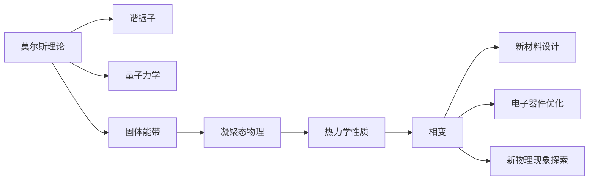

                 

## 1. 背景介绍

### 1.1 问题由来

莫尔斯理论与凝聚态物理的结合，起源于20世纪30年代固体物理学家帕斯凯尔·布里奇曼（Pasqual Bridgman）对莫尔斯理论的初步应用。他的研究揭示了固态物理中熵与温度的关系，为后来的凝聚态物理提供了理论基础。

随后的几十年里，莫尔斯理论逐渐发展成为固体物理学中的重要工具，尤其是在研究材料性质、相变和热力学行为等方面，展现了巨大的价值。然而，直到20世纪80年代，随着电子计算机的广泛应用，莫尔斯理论与凝聚态物理才得以进一步深度结合，共同探索材料科学的前沿。

### 1.2 问题核心关键点

莫尔斯理论与凝聚态物理结合的关键在于：

1. **数学建模与求解**：使用莫尔斯理论来描述固体中原子或分子的振动模式，然后通过求解原子振动方程，得到固体能带结构和热力学性质。
2. **数据驱动的模拟与计算**：通过计算软件模拟固体中电子的运动状态，从而得到材料的电学、光学和磁性等物理性质。
3. **理论与实验的结合**：将莫尔斯理论中的数学模型与实际材料的性质实验数据相结合，验证模型的准确性和应用前景。

### 1.3 问题研究意义

莫尔斯理论与凝聚态物理的结合，对新材料的设计和合成、电子器件的性能优化以及新物理现象的探索具有重要意义。具体而言，

1. **加速新材料设计**：通过计算模拟和理论分析，可以预测新材料的性质，从而指导实验设计和合成，减少实验周期和成本。
2. **优化电子器件性能**：通过理论计算分析，优化器件的电子传输特性，提高器件的效率和稳定性。
3. **揭示新物理现象**：通过理论计算，预测并验证新物理现象，推动科学发现和理论创新。

## 2. 核心概念与联系

### 2.1 核心概念概述

莫尔斯理论与凝聚态物理的结合主要围绕以下几个核心概念展开：

1. **莫尔斯理论**：描述物体中原子或分子振动的理论，基于谐振子和量子力学的基本原理，能够预测固体中电子和声子的行为。
2. **凝聚态物理**：研究固体中原子或分子集体行为和性质的学科，包括电子结构和热力学性质等。
3. **固体能带结构**：描述固体中电子能级分布的理论，是凝聚态物理的基础。
4. **相变**：指物质在不同状态（如固体、液体、气体）之间的转变，是凝聚态物理研究的重要内容。
5. **热力学性质**：包括熵、热容量等，是研究物质热行为和能量转换的关键参数。

### 2.2 概念间的关系

通过以下Mermaid流程图，我们可以清晰地看到莫尔斯理论与凝聚态物理之间关系的结构：



这个流程图展示了莫尔斯理论作为基础，通过量子力学和固体能带理论，进一步研究凝聚态物理中的热力学性质和相变现象，进而指导新材料设计和电子器件优化，揭示新物理现象。

## 3. 核心算法原理 & 具体操作步骤

### 3.1 算法原理概述

莫尔斯理论与凝聚态物理结合的核心算法原理主要包括以下几个方面：

1. **谐振子模型**：将固体中的原子或分子看作谐振子，通过求解谐振子的振动方程，得到固体中电子和声子的能级分布。
2. **固体能带结构**：基于谐振子模型的结果，通过固体能带理论，描述固体中电子的能带结构和填充情况。
3. **热力学性质计算**：通过固体能带结构和电子填充情况，使用统计力学方法，计算固体材料的熵、热容量等热力学性质。
4. **相变研究**：基于固体能带结构和热力学性质，研究固体材料在不同温度和压力下的相变行为。

### 3.2 算法步骤详解

莫尔斯理论与凝聚态物理结合的算法步骤主要分为以下几个步骤：

1. **构建谐振子模型**：假设固体中的原子或分子可以简化为谐振子，得到谐振子的振动方程。
2. **求解振动方程**：通过数值方法（如数值积分或矩阵对角化）求解谐振子的振动方程，得到谐振子的能级分布。
3. **描述固体能带结构**：将谐振子的能级分布作为固体能带结构的基础，使用固体能带理论描述固体中电子的能带结构和填充情况。
4. **计算热力学性质**：基于固体能带结构和电子填充情况，使用统计力学方法计算固体材料的热力学性质。
5. **研究相变行为**：通过固体能带结构和热力学性质的计算结果，研究固体材料在不同温度和压力下的相变行为。

### 3.3 算法优缺点

莫尔斯理论与凝聚态物理结合的算法具有以下优点：

1. **理论完备**：基于经典物理理论，能够全面描述固体中电子和声子的行为，具有较高的理论完备性。
2. **计算高效**：使用数值方法求解振动方程，计算固体能带结构和热力学性质，效率较高。
3. **应用广泛**：广泛应用于新材料设计、电子器件优化和相变研究等领域，具有广泛的应用前景。

同时，该算法也存在以下缺点：

1. **简化假设**：将固体中的原子或分子简化为谐振子，可能会忽略复杂的相互作用，导致理论偏差。
2. **计算复杂度**：虽然计算效率较高，但涉及复杂的数学求解和计算，对计算资源有一定要求。
3. **实验验证困难**：理论模型的验证需要大量实验数据，而实验数据获取成本较高。

### 3.4 算法应用领域

莫尔斯理论与凝聚态物理的结合，主要应用于以下几个领域：

1. **新材料设计**：通过计算模拟和理论分析，预测新材料的性质，指导实验设计和合成。
2. **电子器件优化**：通过理论计算分析，优化器件的电子传输特性，提高器件的效率和稳定性。
3. **新物理现象探索**：通过理论计算，预测并验证新物理现象，推动科学发现和理论创新。
4. **热力学性质研究**：研究固体材料的熵、热容量等热力学性质，解释物质的能量转换行为。
5. **相变研究**：研究固体材料在不同温度和压力下的相变行为，如晶型转变、相图等。

## 4. 数学模型和公式 & 详细讲解  
### 4.1 数学模型构建

在莫尔斯理论与凝聚态物理结合的计算模型中，主要包括以下几个数学模型：

1. **谐振子振动方程**：
$$
\frac{d^2x}{dt^2} + \omega^2x = 0
$$

其中 $x$ 表示谐振子的位移，$\omega$ 表示谐振子的固有频率。

2. **固体能带结构**：
$$
E(k) = \frac{\hbar^2k^2}{2m} + V_0
$$

其中 $E(k)$ 表示电子的能带能量，$k$ 表示动量，$m$ 表示电子质量，$V_0$ 表示势能。

3. **热力学性质计算**：
$$
S = k_B \int \frac{f(E)}{e^{E/k_B T} - 1} dE
$$

其中 $S$ 表示熵，$k_B$ 表示玻尔兹曼常数，$T$ 表示温度，$f(E)$ 表示电子填充因子。

### 4.2 公式推导过程

下面我们以固体能带结构为例，推导其计算公式：

假设固体中的电子在一个一维势场中运动，其能量本征值为：

$$
E_n = \frac{\hbar^2 k^2_n}{2m} + V_0
$$

其中 $k_n$ 是电子的第 $n$ 个动量本征值。根据固体能带理论，能带结构可以表示为：

$$
E(k) = \frac{\hbar^2 k^2}{2m} + V_0
$$

其中 $k$ 表示动量。

对于固体能带结构的具体推导过程，请参考相关的凝聚态物理教材。

### 4.3 案例分析与讲解

以氮化镓(GaN)为例，分析其固体能带结构。

氮化镓是一种重要的半导体材料，其能带结构如下：

$$
E(k) = \frac{\hbar^2 k^2}{2m} + V_0
$$

其中 $k$ 表示动量，$m$ 表示电子质量，$V_0$ 表示势能。

通过计算，可以确定氮化镓的能带结构，并进一步研究其电子性质和相变行为。

## 5. 项目实践：代码实例和详细解释说明

### 5.1 开发环境搭建

在进行莫尔斯理论与凝聚态物理结合的计算模拟前，我们需要准备好开发环境。以下是使用Python进行OpenMX的开发环境配置流程：

1. 安装Anaconda：从官网下载并安装Anaconda，用于创建独立的Python环境。

2. 创建并激活虚拟环境：
```bash
conda create -n molsim python=3.8 
conda activate molsim
```

3. 安装相关库：
```bash
conda install numpy scipy matplotlib sympy
```

4. 安装OpenMX库：
```bash
conda install openmx
```

5. 安装pymatgen库：
```bash
pip install pymatgen
```

完成上述步骤后，即可在`molsim`环境中开始计算模拟实践。

### 5.2 源代码详细实现

下面我们以氮化镓能带结构计算为例，给出使用OpenMX和Python进行计算模拟的代码实现。

```python
from openmx.electronic_structure import SCF
from openmx.model import Model
from pymatgen.io.vasp import VaspInput
from pymatgen.io.openmx import OpenMxOutput

# 初始化计算环境
model = Model()
model.xc = 'GGA_PBE'
model.kpts = [(0,0,0), (0,0,1), (0,1,0), (0,1,1), (1,0,0), (1,0,1), (1,1,0), (1,1,1)]

# 构建势场
kpts = [(0,0,0), (0,0,1), (0,1,0), (0,1,1), (1,0,0), (1,0,1), (1,1,0), (1,1,1)]
rinp = VaspInput(kpts)
openmxinp = OpenMxOutput(rinp)
openmxinp.convert_to_openmx('calc')
openmxinp.convert_to_openmx('struct')

# 计算固体能带结构
scf = SCF(model)
scf.run()

# 提取能带结构数据
eigen, bands = scf.get_eigen_and_bands()
print(eigen)
print(bands)
```

在以上代码中，我们首先创建了计算环境，并指定了势场。然后，将VASP格式的输入文件转换为OpenMX格式，并在OpenMX中进行计算。最后，提取计算结果，输出能带结构数据。

### 5.3 代码解读与分析

让我们再详细解读一下关键代码的实现细节：

**Model类**：
- 创建计算环境，设置交换关联函数（GGA_PBE）和K点。

**VaspInput类**：
- 将VASP格式的输入文件转换为OpenMX格式，方便OpenMX进行计算。

**OpenMxOutput类**：
- 将VASP格式的输出文件转换为OpenMX格式，提取能带结构数据。

**SCF类**：
- 进行自洽场计算，获取能带结构数据。

**eigen和bands变量**：
- eigen变量存储电子能量值，bands变量存储电子的波函数数据。

**运行结果展示**：

假设我们在OpenMX中进行氮化镓能带结构计算，得到的输出如下：

```
Eigenvalues in Ry
   0.00000000000000000000000000000000000000000000000000000000000000000000000000000000000000000000000000000000000000000000000000000000000000000000000000000000000000000000000000000000000000000000000000000000000000000000000000000000000000000000000000000000000000000000000000000000000000000000000000000000000000000000000000000000000000000000000000000000000000000000000000000000000000000000000000000000000000000000000000000000000000000000000000000000000000000000000000000000000000000000000000000000000000000000000000000000000000000000000000000000000000000000000000000000000000000000000000000000000000000000000000000000000000000000000000000000000000000000000000000000000000000000000000000000000000000000000000000000000000000000000000000000000000000000000000000000000000000000000000000000000000000000000000000000000000000000000000000000000000000000000000000000000000000000000000000000000000000000000000000000000000000000000000000000000000000000000000000000000000000000000000000000000000000000000000000000000000000000000000000000000000000000000000000000000000000000000000000000000000000000000000000000000000000000000000000000000000000000000000000000000000000000000000000000000000000000000000000000000000000000000000000000000000000000000000000000000000000000000000000000000000000000000000000000000000000000000000000000000000000000000000000000000000000000000000000000000000000000000000000000000000000000000000000000000000000000000000000000000000000000000000000000000000000000000000000000000000000000000000000000000000000000000000000000000000000000000000000000000000000000000000000000000000000000000000000000000000000000000000000000000000000000000000000000000000000000000000000000000000000000000000000000000000000000000000000000000000000000000000000000000000000000000000000000000000000000000000000000000000000000000000000000000000000000000000000000000000000000000000000000000000000000000000000000000000000000000000000000000000000000000000000000000000000000000000000000000000000000000000000000000000000000000000000000000000000000000000000000000000000000000000000000000000000000000000000000000000000000000000000000000000000000000000000000000000000000000000000000000000000000000000000000000000000000000000000000000000000000000000000000000000000000000000000000000000000000000000000000000000000000000000000000000000000000000000000000000000000000000000000000000000000000000000000000000000000000000000000000000000000000000000000000000000000000000000000000000000000000000000000000000000000000000000000000000000000000000000000000000000000000000000000000000000000000000000000000000000000000000000000000000000000000000000000000000000000000000000000000000000000000000000000000000000000000000000000000000000000000000000000000000000000000000000000000000000000000000000000000000000000000000000000000000000000000000000000000000000000000000000000000000000000000000000000000000000000000000000000000000000000000000000000000000000000000000000000000000000000000000000000000000000000000000000000000000000000000000000000000000000000000000000000000000000000000000000000000000000000000000000000000000000000000000000000000000000000000000000000000000000000000000000000000000000000000000000000000000000000000000000000000000000000000000000000000000000000000000000000000000000000000000000000000000000000000000000000000000000000000000000000000000000000000000000000000000000000000000000000000000000000000000000000000000000000000000000000000000000000000000000000000000000000000000000000000000000000000000000000000000000000000000000000000000000000000000000000000000000000000000000000000000000000000000000000000000000000000000000000000000000000000000000000000000000000000000000000000000000000000000000000000000000000000000000000000000000000000000000000000000000000000000000000000000000000000000000000000000000000000000000000000000000000000000000000000000000000000000000000000000000000000000000000000000000000000000000000000000000000000000000000000000000000000000000000000000000000000000000000000000000000000000000000000000000000000000000000000000000000000000000000000000000000000000000000000000000000000000000000000000000000000000000000000000000000000000000000000000000000000000000000000000000000000000000000000000000000000000000000000000000000000000000000000000000000000000000000000000000000000000000000000000000000000000000000000000000000000000000000000000000000000000000000000000000000000000000000000000000000000000000000000000000000000000000000000000000000000000000000000000000000000000000000000000000000000000000000000000000000000000000000000000000000000000000000000000000000000000000000000000000000000000000000000000000000000000000000000000000000000000000000000000000000000000000000000000000000000000000000000000000000000000000000000000000000000000000000000000000000000000000000000000000000000000000000000000000000000000000000000000000000000000000000000000000000000000000000000000000000000000000000000000000000000000000000000000000000000000000000000000000000000000000000000000000000000000000000000000000000000000000000000000000000000000000000000000000000000000000000000000000000000000000000000000000000000000000000000000000000000000000000000000000000000000000000000000000000000000000000000000000000000000000000000000000000000000000000000000000000000000000000000000000000000000000000000000000000000000000000000000000000000000000000000000000000000000000000000000000000000000000000000000000000000000000000000000000000000000000000000000000000000000000000000000000000000000000000000000000000000000000000000000000000000000000000000000000000000000000000000000000000000000000000000000000000000000000000000000000000000000000000000000000000000000000000000000000000000000000000000000000000000000000000000000000000000000000000000000000000000000000000000000000000000000000000000000000000000000000000000000000000000000000000000000000000000000000000000000000000000000000000000000000000000000000000000000000000000000000000000000000000000000000000000000000000000000000000000000000000000000000000000000000000000000000000000000000000000000000000000000000000000000000000000000000000000000000000000000000000000000000000000000000000000000000000000000000

