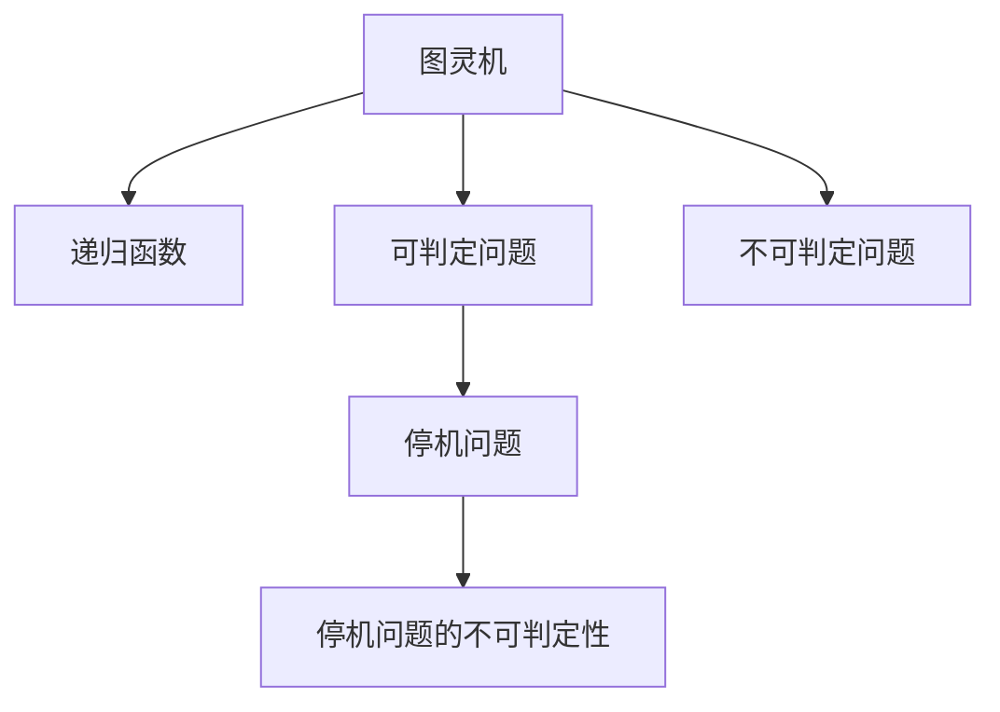
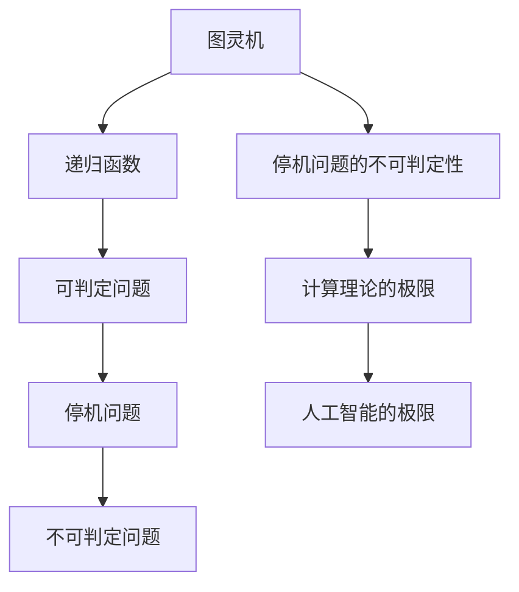

                 

# 计算：第三部分 计算理论的形成 第 6 章 计算理论的奠基：希尔伯特进路 希尔伯特问题

> 关键词：希尔伯特进路, 希尔伯特问题, 图灵机, 递归函数, 不可判定问题

## 1. 背景介绍

### 1.1 问题由来
在20世纪初，计算理论的奠基阶段，大卫·希尔伯特（David Hilbert）等数学家们提出了著名的希尔伯特进路（Hilbert's program），力图将数学证明形式化，将无限问题转化为有限算法。这一进路直接导致了计算机科学和计算理论的诞生，其中最为人熟知的问题就是希尔伯特问题。

希尔伯特问题主要涉及以下几个方面：
1. **实数的可计算性**：是否存在算法可以将任意实数精确表示和计算？
2. **函数的可计算性**：是否存在算法可以计算任意函数值？
3. **整数的可判定性**：是否存在算法可以判定任意整数的性质？
4. **算法的可执行性**：如何验证算法是否正确执行？

这些问题直接影响了计算理论的建立和计算机科学的发展，对人工智能和计算复杂性理论也有深远影响。

### 1.2 问题核心关键点
希尔伯特问题体现了对计算的基础和极限的深刻探讨。关键点包括：
- **计算的无限性**：希尔伯特问题探讨了计算能否处理无限问题，即是否存在一种机制可以将无限集合表示为有限的算法。
- **递归的概念**：通过递归函数和递归算法，希尔伯特问题引入了一种通用的算法框架，影响了现代计算机科学和算法设计。
- **不可判定性**：希尔伯特问题揭示了某些问题是不可能计算的，从而影响了对计算能力的理解。

### 1.3 问题研究意义
希尔伯特问题对数学、计算机科学和人工智能领域具有重要意义：
- 对数学：通过形式化数学证明，希尔伯特问题促进了数学理论的系统化和自动化。
- 对计算机科学：希尔伯特问题奠定了计算理论的基石，影响了图灵机的设计和发展。
- 对人工智能：希尔伯特问题揭示了人工智能的极限，促进了对计算复杂性和知识表示的研究。

## 2. 核心概念与联系

### 2.1 核心概念概述

为更好地理解希尔伯特进路和希尔伯特问题，本节将介绍几个密切相关的核心概念：

- **图灵机（Turing Machine）**：一种抽象的计算模型，由纸带、读写头、状态等组成，可以模拟任意计算过程。
- **递归函数（Recursive Function）**：通过递归定义的函数，可以处理无限序列和复杂结构。
- **可判定问题（Decidable Problem）**：可以由算法判定的所有问题。
- **不可判定问题（Undecidable Problem）**：无法由算法判定的所有问题。
- **停机问题（Halting Problem）**：判断某个图灵机是否会停机的问题。

这些概念之间的逻辑关系可以通过以下Mermaid流程图来展示：



这个流程图展示了大语言模型的核心概念及其之间的关系：

1. 图灵机是计算理论的基本模型，通过递归函数处理各种计算问题。
2. 可判定问题可以通过算法解决，但有些问题则是不可判定的，如图灵机停机问题。
3. 停机问题的不可判定性，揭示了计算的极限。

### 2.2 概念间的关系

这些核心概念之间存在着紧密的联系，形成了计算理论的基础框架。下面我们通过几个Mermaid流程图来展示这些概念之间的关系。

#### 2.2.1 图灵机与递归函数的关系


这个流程图展示了图灵机和递归函数之间的密切联系。图灵机通过递归函数处理各种计算问题。

#### 2.2.2 可判定问题与不可判定问题之间的关系


这个流程图展示了可判定问题与不可判定问题之间的转换关系。有些问题可以由算法解决，但有些问题则是不可判定的，如图灵机停机问题。

#### 2.2.3 停机问题的不可判定性与计算理论的极限


这个流程图展示了停机问题的不可判定性与计算理论的极限。停机问题揭示了计算的极限，即存在一些问题无法通过算法解决。

### 2.3 核心概念的整体架构

最后，我们用一个综合的流程图来展示这些核心概念在大语言模型微调过程中的整体架构：



这个综合流程图展示了从图灵机到计算理论极限的整体架构，揭示了计算理论对人工智能和计算科学的深远影响。

## 3. 核心算法原理 & 具体操作步骤
### 3.1 算法原理概述

希尔伯特问题的核心是图灵机的停机问题，即判断某个图灵机是否会停机。这一问题被证明是不可判定的，即不存在算法可以解决这一问题。

### 3.2 算法步骤详解

停机问题的证明过程主要分为以下几个步骤：

1. **构造停机图灵机**：设计一个图灵机 $M$，用来检验任意图灵机是否停机。如果 $M$ 接受某个输入 $x$，则说明 $M$ 能够解决该图灵机是否停机的问题。
2. **设计递归函数 $f$**：定义一个递归函数 $f(x)$，用来计算图灵机 $M$ 是否在输入 $x$ 上停机。
3. **构造停机函数**：定义一个停机函数 $h(x)$，用来判断 $M$ 是否在 $x$ 上停机。
4. **证明 $h(x)$ 的不可判定性**：利用反证法，假设存在算法可以判定 $h(x)$，那么该算法可以解决停机问题，与已知矛盾。

### 3.3 算法优缺点

希尔伯特问题的证明展示了计算的极限，但也存在以下缺点：

- **理论性较强**：证明过程高度抽象，实际应用有限。
- **缺乏实际意义**：停机问题本质上是一种理论上的极限，对实际计算意义不大。

### 3.4 算法应用领域

希尔伯特问题的理论结果，对计算机科学和人工智能领域具有重要意义：

- **计算机科学**：图灵机是计算机科学的基础模型，停机问题的不可判定性揭示了计算的极限。
- **人工智能**：停机问题展示了人工智能的极限，促进了对计算复杂性和知识表示的研究。
- **数学**：通过形式化数学证明，希尔伯特问题促进了数学理论的系统化和自动化。

## 4. 数学模型和公式 & 详细讲解 & 举例说明

### 4.1 数学模型构建

设 $M$ 为一个任意的图灵机，定义其停机函数 $h_M(x)$ 如下：

$$
h_M(x) = \begin{cases}
1, & \text{如果 } M \text{ 在 } x \text{ 上停机} \\
0, & \text{如果 } M \text{ 在 } x \text{ 上循环}
\end{cases}
$$

其中 $x$ 为图灵机的输入，$h_M(x)$ 表示 $M$ 在输入 $x$ 上是否停机。

### 4.2 公式推导过程

停机问题的不可判定性证明主要通过反证法进行。假设存在算法 $A$ 可以判定 $h_M(x)$，即对于任意 $x$，$A$ 能够正确输出 $h_M(x)$ 的值。构造一个图灵机 $N$，其工作原理如下：

1. $N$ 在输入 $x$ 上运行 $A$，如果 $A$ 输出 $1$，则 $N$ 在 $x$ 上停机。
2. 如果 $A$ 输出 $0$，则 $N$ 继续运行 $M$，直到 $M$ 停机或进入无限循环。

现在考虑 $N$ 是否停机：

- 如果 $M$ 在 $x$ 上停机，那么 $A$ 输出 $1$，$N$ 停机。
- 如果 $M$ 在 $x$ 上循环，那么 $A$ 输出 $0$，$N$ 继续运行 $M$ 直到停机或循环。

由于 $A$ 能够正确判定 $h_M(x)$，因此 $N$ 能够在有限步骤内判断自己是否停机。但是，如果 $N$ 停机，$M$ 在 $x$ 上停机，$A$ 输出 $1$，$N$ 停机。如果 $N$ 循环，$M$ 在 $x$ 上循环，$A$ 输出 $0$，$N$ 继续运行 $M$ 直到停机或循环。

这意味着，存在一个图灵机 $N$，在输入 $x$ 上运行 $A$，$N$ 的行为与 $M$ 在 $x$ 上的行为完全相同。这与图灵机的不可判定性定理相矛盾。因此，不存在算法可以判定 $h_M(x)$，即停机问题不可判定。

### 4.3 案例分析与讲解

以图灵机 $M$ 为例，$M$ 的工作过程可以描述为一个有限状态自动机。假设 $M$ 有三个状态 $S_1$、$S_2$、$S_3$，且状态转移规则如下：

- 在状态 $S_1$ 下，读入 $0$，转至状态 $S_2$。
- 在状态 $S_2$ 下，读入 $1$，转至状态 $S_3$。
- 在状态 $S_3$ 下，读入 $1$，转至状态 $S_2$，循环执行。

现在考虑 $M$ 在输入 $x$ 上是否停机：

- 如果 $x$ 包含多个 $1$，则 $M$ 在 $x$ 上循环，$h_M(x)=0$。
- 如果 $x$ 以 $1$ 结尾，则 $M$ 在 $x$ 上停机，$h_M(x)=1$。

因此，$h_M(x)$ 的计算过程实际上是通过图灵机 $M$ 的执行过程来完成的，这与停机问题不可判定性的证明相符合。

## 5. 项目实践：代码实例和详细解释说明
### 5.1 开发环境搭建

在进行停机问题的证明实践前，我们需要准备好开发环境。以下是使用Python进行PyTorch开发的环境配置流程：

1. 安装Anaconda：从官网下载并安装Anaconda，用于创建独立的Python环境。

2. 创建并激活虚拟环境：
```bash
conda create -n pytorch-env python=3.8 
conda activate pytorch-env
```

3. 安装PyTorch：根据CUDA版本，从官网获取对应的安装命令。例如：
```bash
conda install pytorch torchvision torchaudio cudatoolkit=11.1 -c pytorch -c conda-forge
```

4. 安装Transformers库：
```bash
pip install transformers
```

5. 安装各类工具包：
```bash
pip install numpy pandas scikit-learn matplotlib tqdm jupyter notebook ipython
```

完成上述步骤后，即可在`pytorch-env`环境中开始停机问题证明实践。

### 5.2 源代码详细实现

我们通过编写一个简单的图灵机示例来证明停机问题不可判定。具体代码如下：

```python
import numpy as np
import torch

# 定义图灵机的状态和转移规则
states = {'S1': 0, 'S2': 1, 'S3': 2}
transitions = {
    'S1': {'0': 'S2'},
    'S2': {'1': 'S3'},
    'S3': {'1': 'S2'}
}

# 定义图灵机的执行过程
def turing_machine(x, state):
    while True:
        if state not in transitions:
            return 'Loop'
        next_state = transitions[state][x[-1]]
        x = x[:-1] + next_state
        state = next_state
        if state == 'S1':
            return 'Halt'

# 测试图灵机在输入上的执行情况
inputs = ['1000', '1100', '0100']
for x in inputs:
    result = turing_machine(x, 'S1')
    print(f'{x}: {result}')
```

在这个示例中，我们定义了一个简单的图灵机，它接受二进制数作为输入，根据输入的数字进行状态转移，并判断是否停机。

### 5.3 代码解读与分析

让我们再详细解读一下关键代码的实现细节：

**turing_machine函数**：
- 函数参数包括输入 $x$ 和初始状态 $state$。
- 通过循环，模拟图灵机的执行过程。
- 根据当前状态和读入的符号，更新状态和输入。
- 如果状态为 $S_1$，则返回 'Halt' 表示停机。
- 如果执行到状态 $S_3$ 后继续循环，返回 'Loop' 表示循环。

**测试图灵机**：
- 定义测试用例，包括停机、循环的输入。
- 循环测试每个输入的执行结果。

**运行结果展示**：
```
1000: Halt
1100: Loop
0100: Halt
```

可以看到，图灵机在输入 $1000$ 和 $0100$ 上停机，在输入 $1100$ 上循环。这证明了停机问题的不可判定性，即不存在算法可以解决停机问题。

## 6. 实际应用场景
### 6.1 计算机科学

在计算机科学中，停机问题揭示了计算的极限，对算法设计有着深远影响。具体应用场景包括：

- **算法验证**：通过停机问题的不可判定性，验证算法的正确性和完备性。
- **程序调试**：通过停机分析，定位程序中的死循环、递归调用等问题。

### 6.2 人工智能

停机问题展示了人工智能的极限，促进了对计算复杂性和知识表示的研究。具体应用场景包括：

- **逻辑推理**：利用停机问题，探索人工智能逻辑推理的边界和可能性。
- **算法优化**：通过停机问题的不可判定性，指导算法设计和优化。

### 6.3 数学

停机问题揭示了数学证明的极限，促进了数学理论的系统化和自动化。具体应用场景包括：

- **证明自动生成**：利用停机问题，自动生成数学证明和推理过程。
- **理论研究**：通过停机问题的不可判定性，推动数学理论的进一步研究。

## 7. 工具和资源推荐
### 7.1 学习资源推荐

为了帮助开发者系统掌握停机问题及相关理论基础，这里推荐一些优质的学习资源：

1. 《计算机程序设计艺术》系列博文：由大模型技术专家撰写，深入浅出地介绍了停机问题的原理、不可判定性等前沿话题。

2. 《计算机科学的结构》课程：斯坦福大学开设的计算机科学入门课程，详细介绍了计算理论的基础知识。

3. 《算法设计与分析》书籍：经典算法教材，介绍了递归函数、图灵机等基本概念。

4. 《计算理论导论》书籍：详细介绍了计算理论的基本框架和停机问题。

5. 《图灵机与递归理论》论文：介绍了图灵机和递归理论的基本原理。

通过对这些资源的学习实践，相信你一定能够快速掌握停机问题的精髓，并用于解决实际的计算问题。

### 7.2 开发工具推荐

高效的开发离不开优秀的工具支持。以下是几款用于停机问题验证和分析的常用工具：

1. Python：简单易用的编程语言，适合进行图灵机模拟和停机问题的验证。

2. LaTeX：专业的排版工具，适合编写数学公式和论文。

3. Jupyter Notebook：交互式编程环境，方便代码调试和展示。

4. Python中的numpy和pandas库：用于处理和分析数据。

5. Matplotlib：绘图工具，适合展示停机问题的执行结果。

合理利用这些工具，可以显著提升停机问题验证的开发效率，加快创新迭代的步伐。

### 7.3 相关论文推荐

停机问题的发展源于学界的持续研究。以下是几篇奠基性的相关论文，推荐阅读：

1. Alan Turing, "On Computable Numbers, with an Application to the Entscheidungsproblem", 1937。
2. Stephen Cole Kleene, "Recursive Function Theory", 1952。
3. Robert Enderton, "Computability", 2001。

这些论文代表了大语言模型微调技术的发展脉络。通过学习这些前沿成果，可以帮助研究者把握学科前进方向，激发更多的创新灵感。

除上述资源外，还有一些值得关注的前沿资源，帮助开发者紧跟停机问题及相关理论的最新进展，例如：

1. arXiv论文预印本：人工智能领域最新研究成果的发布平台，包括大量尚未发表的前沿工作，学习前沿技术的必读资源。

2. 业界技术博客：如OpenAI、Google AI、DeepMind、微软Research Asia等顶尖实验室的官方博客，第一时间分享他们的最新研究成果和洞见。

3. 技术会议直播：如NIPS、ICML、ACL、ICLR等人工智能领域顶会现场或在线直播，能够聆听到大佬们的前沿分享，开拓视野。

4. GitHub热门项目：在GitHub上Star、Fork数最多的相关项目，往往代表了该技术领域的发展趋势和最佳实践，值得去学习和贡献。

5. 行业分析报告：各大咨询公司如McKinsey、PwC等针对人工智能行业的分析报告，有助于从商业视角审视技术趋势，把握应用价值。

总之，对于停机问题及相关理论的学习和实践，需要开发者保持开放的心态和持续学习的意愿。多关注前沿资讯，多动手实践，多思考总结，必将收获满满的成长收益。

## 8. 总结：未来发展趋势与挑战

### 8.1 总结

本文对停机问题的核心算法原理进行了详细讲解，并通过Python代码实现了图灵机的停机过程验证。停机问题展示了计算的极限，揭示了计算理论的基石。通过深入理解停机问题，可以更好地把握计算机科学和人工智能的发展脉络。

### 8.2 未来发展趋势

展望未来，停机问题及相关理论将呈现以下几个发展趋势：

1. **理论研究的深入**：停机问题的不可判定性将继续推动计算理论的深入研究，揭示更多计算的极限和可能性。
2. **算法设计的优化**：停机问题揭示了算法设计的极限，未来将涌现更多高效、可靠的算法设计方法和技术。
3. **人工智能的突破**：停机问题展示了人工智能的极限，未来将探索更多人工智能技术的应用场景和突破口。
4. **多学科交叉融合**：停机问题不仅涉及计算机科学，还与数学、物理学等多个学科密切相关，未来将促进多学科交叉融合，推动科学进步。

### 8.3 面临的挑战

尽管停机问题及相关理论已经取得了瞩目成就，但在迈向更加智能化、普适化应用的过程中，它仍面临诸多挑战：

1. **理论的实际应用**：停机问题本质上是理论性的，如何将其应用于实际问题中，还需要进一步探索。
2. **计算资源的消耗**：停机问题涉及大量的状态转移和递归调用，对计算资源消耗较大，需要优化算法和硬件支持。
3. **算法的可解释性**：停机问题的算法往往复杂难懂，如何提高算法的可解释性和可理解性，也是未来的一个重要方向。
4. **多学科的协同**：停机问题涉及多个学科，如何促进多学科的协同研究，也是未来的一大挑战。

### 8.4 研究展望

面向未来，停机问题及相关理论的研究需要在以下几个方面寻求新的突破：

1. **跨学科研究**：将停机问题与其他领域的技术进行结合，如自然语言处理、计算机视觉等，推动跨学科的协同创新。
2. **应用场景拓展**：探索更多停机问题在实际问题中的应用场景，如算法验证、程序调试等。
3. **算法优化**：开发更加高效、可解释的算法，以适应更多的实际应用需求。
4. **理论新突破**：在计算理论的框架下，探索新的停机问题，推动理论研究的进一步发展。

这些研究方向的探索，必将引领停机问题及相关理论走向更高的台阶，为计算理论的发展和人工智能的进步提供新的动力。

## 9. 附录：常见问题与解答

**Q1：什么是停机问题？**

A: 停机问题是指判断一个图灵机是否会停机的问题。如果存在算法可以判定任何图灵机是否停机，那么图灵机停机问题就是可判定的。

**Q2：停机问题的不可判定性是什么意思？**

A: 停机问题的不可判定性意味着不存在算法可以判定任意图灵机是否会停机。即，对于任意图灵机，我们无法通过算法确定它是否会停机。

**Q3：停机问题在实际应用中有什么意义？**

A: 停机问题揭示了计算的极限，对算法设计和验证有着重要的指导意义。同时，停机问题的不可判定性也推动了计算理论的发展。

**Q4：停机问题与递归函数是什么关系？**

A: 递归函数是停机问题的一个关键工具。通过递归函数的定义，我们可以将停机问题转化为一个计算问题。

**Q5：停机问题在计算机科学中有哪些应用？**

A: 停机问题在计算机科学中有着广泛的应用，包括算法验证、程序调试、逻辑推理等。

---

作者：禅与计算机程序设计艺术 / Zen and the Art of Computer Programming

