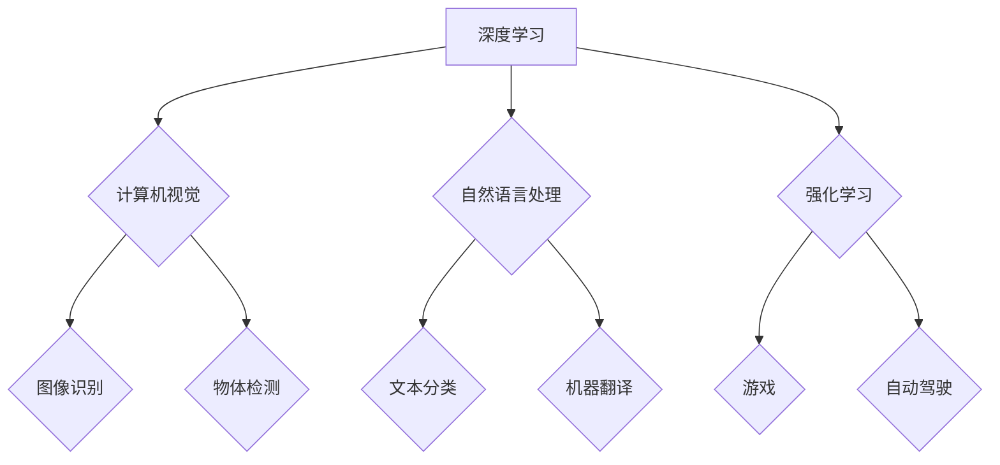

## Andrej Karpathy：人工智能的未来发展机遇

> 关键词：人工智能、深度学习、计算机视觉、自然语言处理、强化学习、自动驾驶、机器人

### 1. 背景介绍

人工智能（AI）正以惊人的速度发展，深刻地改变着我们生活的方方面面。从智能手机的语音助手到自动驾驶汽车，AI技术已经渗透到我们的日常生活中。其中，Andrej Karpathy是一位在AI领域备受瞩目的研究者和工程师，他曾在OpenAI、特斯拉和伯克利大学任职，并对深度学习、计算机视觉和自动驾驶等领域做出了重要贡献。

Karpathy的博客和演讲经常引发业界热议，他以其清晰的思路、深入的见解和对未来技术趋势的洞察力而闻名。本文将探讨Karpathy在AI领域的研究成果，分析其对未来发展趋势的展望，并探讨AI技术带来的机遇和挑战。

### 2. 核心概念与联系

**2.1 深度学习**

深度学习是机器学习的一个子领域，它利用多层神经网络来模拟人类大脑的学习过程。与传统机器学习方法相比，深度学习能够自动从海量数据中提取特征，从而实现更准确的预测和识别。

**2.2 计算机视觉**

计算机视觉是让计算机“看”和理解图像和视频的技术。它涉及图像识别、物体检测、图像分割、图像生成等多个子领域。深度学习在计算机视觉领域取得了突破性进展，例如图像识别准确率大幅提升，自动驾驶技术也取得了显著进展。

**2.3 自然语言处理**

自然语言处理（NLP）是让计算机理解和处理人类语言的技术。它涉及文本分类、情感分析、机器翻译、对话系统等多个子领域。深度学习也为NLP领域带来了革命性的变化，例如机器翻译的准确率大幅提升，对话系统也变得更加自然流畅。

**2.4 强化学习**

强化学习是一种机器学习方法，它通过奖励和惩罚机制来训练智能体，使其在特定环境中做出最优决策。强化学习在游戏、机器人控制、自动驾驶等领域具有广泛应用前景。

**2.5 自动驾驶**

自动驾驶是利用人工智能技术实现车辆自动驾驶的技术。它需要结合计算机视觉、传感器融合、路径规划等多个技术领域。深度学习在自动驾驶领域发挥着关键作用，例如车辆识别、道路理解、决策控制等。

**2.6 机器人**

机器人是指能够执行特定任务的机械装置。人工智能技术可以赋予机器人更强的智能和自主性，使其能够更好地感知环境、做出决策并执行任务。

**2.7 Mermaid 流程图**



### 3. 核心算法原理 & 具体操作步骤

**3.1 算法原理概述**

深度学习算法的核心是多层神经网络。神经网络由多个层组成，每一层包含多个神经元。每个神经元接收来自上一层的输入信号，并对其进行处理，然后将处理后的信号传递到下一层。通过调整神经网络的权重和偏差，可以使网络学习到数据中的模式和规律。

**3.2 算法步骤详解**

1. **数据预处理:** 将原始数据转换为深度学习算法可以理解的格式。
2. **网络结构设计:** 根据任务需求设计神经网络的结构，包括层数、神经元数量、激活函数等。
3. **参数初始化:** 为神经网络的权重和偏差赋予初始值。
4. **前向传播:** 将输入数据通过神经网络进行一次传播，得到输出结果。
5. **损失函数计算:** 计算输出结果与真实值的差异，即损失值。
6. **反向传播:** 根据损失值，调整神经网络的权重和偏差，使损失值最小化。
7. **训练迭代:** 重复前向传播、损失函数计算和反向传播的过程，直到损失值达到预设阈值。
8. **模型评估:** 使用测试数据评估模型的性能。

**3.3 算法优缺点**

**优点:**

* 能够自动提取特征，无需人工特征工程。
* 能够处理海量数据，学习到更复杂的模式。
* 在图像识别、自然语言处理等领域取得了突破性进展。

**缺点:**

* 需要大量的训练数据。
* 训练过程耗时和耗能。
* 模型解释性较差，难以理解模型的决策过程。

**3.4 算法应用领域**

* 计算机视觉：图像识别、物体检测、图像分割、图像生成
* 自然语言处理：文本分类、情感分析、机器翻译、对话系统
* 自动驾驶：车辆识别、道路理解、决策控制
* 机器人：感知环境、做出决策、执行任务
* 医疗诊断：疾病识别、影像分析
* 金融预测：股票预测、风险评估

### 4. 数学模型和公式 & 详细讲解 & 举例说明

**4.1 数学模型构建**

深度学习算法的核心是神经网络，其数学模型可以表示为一系列的矩阵运算。

**4.2 公式推导过程**

* **激活函数:** 激活函数用于引入非线性，使神经网络能够学习到更复杂的模式。常见的激活函数包括 sigmoid 函数、ReLU 函数、tanh 函数等。

* **损失函数:** 损失函数用于衡量模型预测结果与真实值的差异。常见的损失函数包括均方误差、交叉熵等。

* **梯度下降:** 梯度下降是一种优化算法，用于调整神经网络的权重和偏差，使损失值最小化。

**4.3 案例分析与讲解**

**举例说明：**

假设我们有一个简单的线性回归模型，其数学模型可以表示为：

$$y = wx + b$$

其中，$y$ 是预测值，$x$ 是输入值，$w$ 是权重，$b$ 是偏差。

我们的目标是找到最优的 $w$ 和 $b$ 值，使模型的预测结果与真实值尽可能接近。

我们可以使用均方误差作为损失函数，其公式为：

$$L = \frac{1}{n} \sum_{i=1}^{n} (y_i - \hat{y}_i)^2$$

其中，$n$ 是样本数量，$y_i$ 是真实值，$\hat{y}_i$ 是预测值。

然后，我们可以使用梯度下降算法来更新 $w$ 和 $b$ 的值：

$$w = w - \alpha \frac{\partial L}{\partial w}$$

$$b = b - \alpha \frac{\partial L}{\partial b}$$

其中，$\alpha$ 是学习率。

通过重复上述过程，我们可以逐渐找到最优的 $w$ 和 $b$ 值，使模型的预测结果更加准确。

### 5. 项目实践：代码实例和详细解释说明

**5.1 开发环境搭建**

* Python 3.x
* TensorFlow 或 PyTorch
* Jupyter Notebook

**5.2 源代码详细实现**

```python
import tensorflow as tf

# 定义模型
model = tf.keras.models.Sequential([
    tf.keras.layers.Dense(128, activation='relu', input_shape=(784,)),
    tf.keras.layers.Dense(10, activation='softmax')
])

# 编译模型
model.compile(optimizer='adam',
              loss='sparse_categorical_crossentropy',
              metrics=['accuracy'])

# 训练模型
model.fit(x_train, y_train, epochs=10)

# 评估模型
loss, accuracy = model.evaluate(x_test, y_test)
print('Test loss:', loss)
print('Test accuracy:', accuracy)
```

**5.3 代码解读与分析**

* 我们使用 TensorFlow 库构建了一个简单的深度学习模型。
* 模型包含两层全连接神经网络，第一层有 128 个神经元，使用 ReLU 激活函数，第二层有 10 个神经元，使用 softmax 激活函数。
* 我们使用 Adam 优化器、稀疏类别交叉熵损失函数和准确率作为评估指标来训练模型。
* 训练过程迭代 10 次，使用训练数据训练模型，并使用测试数据评估模型的性能。

**5.4 运行结果展示**

训练完成后，我们可以查看模型的测试损失和准确率。

### 6. 实际应用场景

**6.1 医疗诊断**

深度学习可以用于分析医学影像，例如 X 光片、CT 扫描和 MRI 图像，帮助医生诊断疾病。例如，深度学习模型可以用于识别肺癌、乳腺癌和脑肿瘤。

**6.2 金融预测**

深度学习可以用于分析金融数据，例如股票价格、汇率和债券收益率，帮助金融机构进行风险评估、预测股票价格和识别欺诈交易。

**6.3 自动驾驶**

深度学习是自动驾驶技术的重要组成部分，它可以用于车辆识别、道路理解、路径规划和决策控制。例如，深度学习模型可以识别行人、车辆和交通信号灯，并根据这些信息规划车辆行驶路径。

**6.4 未来应用展望**

随着深度学习技术的不断发展，其应用场景将更加广泛。例如，深度学习可以用于个性化教育、精准医疗、智能家居和增强现实等领域。

### 7. 工具和资源推荐

**7.1 学习资源推荐**

* **书籍:**
    * Deep Learning by Ian Goodfellow, Yoshua Bengio, and Aaron Courville
    * Hands-On Machine Learning with Scikit-Learn, Keras & TensorFlow by Aurélien Géron
* **在线课程:**
    * Deep Learning Specialization by Andrew Ng (Coursera)
    * Fast.ai Deep Learning Course
* **博客:**
    * Andrej Karpathy's Blog
    * OpenAI Blog

**7.2 开发工具推荐**

* **TensorFlow:** https://www.tensorflow.org/
* **PyTorch:** https://pytorch.org/
* **Keras:** https://keras.io/

**7.3 相关论文推荐**

* AlexNet: ImageNet Classification with Deep Convolutional Neural Networks
* VGGNet: Very Deep Convolutional Networks for Large-Scale Image Recognition
* ResNet: Deep Residual Learning for Image Recognition
* BERT: Pre-training of Deep Bidirectional Transformers for Language Understanding

### 8. 总结：未来发展趋势与挑战

**8.1 研究成果总结**

近年来，深度学习取得了令人瞩目的成果，在图像识别、自然语言处理、自动驾驶等领域取得了突破性进展。

**8.2 未来发展趋势**

* **模型规模和复杂度提升:** 未来深度学习模型将更加庞大，包含更多层和参数，从而学习到更复杂的模式。
* **数据增强和合成:** 由于深度学习算法对大量数据依赖，未来将更加注重数据增强和合成技术，以提高模型的泛化能力。
* **模型解释性和可解释性:** 随着深度学习模型的复杂性增加，解释模型的决策过程变得更加重要，未来将更加注重模型解释性和可解释性研究。
* **边缘计算和部署:** 将深度学习模型部署到边缘设备，例如智能手机和物联网设备，以实现更低延迟和更高效率的应用。

**8.3 面临的挑战**

* **数据隐私和安全:** 深度学习算法对大量数据依赖，如何保护数据隐私和安全是一个重要的挑战。
* **算法公平性和偏见:** 深度学习算法可能存在公平性和偏见问题，需要进行更深入的研究和改进。
* **模型可解释性和信任:** 深度学习模型的决策过程往往难以理解，如何提高模型的可解释性和信任度是一个重要的挑战。

**8.4 研究展望**

未来，深度学习研究将继续朝着更强大、更安全、更可解释的方向发展。


### 9. 附录：常见问题与解答

**9.1 什么是深度学习？**

深度学习是一种机器学习方法，