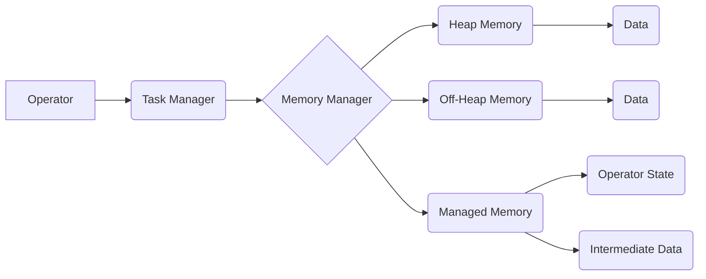

## Flink Memory Management原理与代码实例讲解

> 关键词：Apache Flink, 内存管理, 数据流处理, Operator, Memory Model, Code Example, Java

## 1. 背景介绍

Apache Flink 作为一款高性能、分布式流处理引擎，其内存管理机制对于保证系统稳定性、吞吐量和资源利用率至关重要。Flink 的内存管理策略旨在平衡数据处理效率和资源消耗，同时应对流式数据处理的动态性和实时性要求。

传统的批处理系统通常采用磁盘存储为主的模式，而流处理系统则需要在内存中高效地处理不断涌入的数据流。Flink 的内存管理机制需要考虑以下几个关键因素：

* **数据流的实时性:** 流处理系统需要能够实时地处理数据，因此内存管理机制需要能够快速地分配和释放内存资源。
* **数据流的规模:** 流处理系统可能需要处理海量的数据流，因此内存管理机制需要能够有效地管理大量的内存资源。
* **数据流的复杂性:** 流处理系统可能需要处理各种类型的复杂数据，因此内存管理机制需要能够支持不同的数据类型和数据结构。
* **资源的有限性:** 流处理系统通常运行在分布式环境中，资源是有限的，因此内存管理机制需要能够有效地分配和回收资源，避免资源浪费和系统崩溃。

## 2. 核心概念与联系

Flink 的内存管理机制基于一个名为 **Memory Model** 的模型，该模型将内存划分为不同的区域，每个区域负责特定的任务。

**Flink Memory Model**



**核心概念解释:**

* **Operator:** Flink 的数据处理单元，负责对数据进行特定的操作。
* **Task Manager:**  负责执行 Operator 的进程。
* **Memory Manager:**  负责管理 Task Manager 的内存资源。
* **Heap Memory:** Java 虚拟机中的堆内存，用于存储对象和数据结构。
* **Off-Heap Memory:**  不属于 Java 虚拟机堆内存的内存区域，例如直接映射到物理内存的内存。
* **Managed Memory:**  由 Flink 内核管理的内存区域，用于存储 Operator 状态和中间数据。

**联系解释:**

* Operator 在 Task Manager 中执行，并需要内存资源来存储数据和状态。
* Memory Manager 负责分配和回收 Task Manager 的内存资源，包括 Heap Memory 和 Off-Heap Memory。
* Managed Memory 是由 Memory Manager 管理的内存区域，用于存储 Operator 状态和中间数据。

## 3. 核心算法原理 & 具体操作步骤

### 3.1  算法原理概述

Flink 的内存管理机制主要基于以下几个算法原理：

* **基于策略的内存分配:**  Flink 使用不同的内存分配策略来根据数据类型、数据规模和 Operator 特性分配内存资源。
* **动态内存回收:**  Flink 会根据内存使用情况动态地回收不再使用的内存资源，以释放内存空间。
* **内存分区:**  Flink 将内存划分为不同的分区，每个分区负责特定的任务，以提高内存利用率和数据处理效率。
* **数据序列化和反序列化:**  Flink 使用数据序列化和反序列化技术来高效地存储和恢复数据，以减少内存占用。

### 3.2  算法步骤详解

1. **内存初始化:**  Flink 在启动时会根据配置参数初始化内存资源，包括 Heap Memory 和 Off-Heap Memory 的大小。
2. **Operator 状态注册:**  每个 Operator 在启动时需要注册其状态信息，包括状态类型、状态大小和状态存储位置。
3. **数据分配:**  当数据流进入 Flink 系统时，Memory Manager 会根据数据类型、数据规模和 Operator 特性分配内存空间。
4. **数据处理:**  Operator 会使用分配的内存空间处理数据，并将处理结果存储到内存中。
5. **内存回收:**  当数据不再需要时，Memory Manager 会回收相应的内存空间。
6. **状态保存:**  在 Operator 结束时，Flink 会将 Operator 状态信息保存到持久化存储中。

### 3.3  算法优缺点

**优点:**

* **高效的内存利用率:**  Flink 的内存管理机制通过动态内存分配和回收、内存分区等技术，能够有效地利用内存资源。
* **灵活的内存策略:**  Flink 支持多种内存分配策略，可以根据不同的数据类型和 Operator 特性选择合适的策略。
* **可靠的数据持久化:**  Flink 会将 Operator 状态信息保存到持久化存储中，即使系统发生故障也能保证数据的一致性。

**缺点:**

* **内存管理复杂度:**  Flink 的内存管理机制相对复杂，需要对内存管理原理和算法有深入的了解。
* **内存泄漏风险:**  如果应用程序存在内存泄漏问题，可能会导致内存资源耗尽。

### 3.4  算法应用领域

Flink 的内存管理机制广泛应用于各种流处理场景，例如：

* **实时数据分析:**  Flink 可以实时地处理海量数据流，并进行分析和挖掘。
* **实时告警:**  Flink 可以实时地监控系统状态，并发出告警。
* **实时推荐:**  Flink 可以根据用户的行为数据实时地生成推荐结果。
* **实时交易处理:**  Flink 可以实时地处理交易数据，并进行结算。

## 4. 数学模型和公式 & 详细讲解 & 举例说明

### 4.1  数学模型构建

Flink 的内存管理机制可以抽象为一个资源分配模型，其中：

* **资源:**  内存空间
* **需求:**  Operator 对内存空间的需求
* **分配策略:**  用于分配内存空间的算法

我们可以用以下数学模型来描述 Flink 的内存管理机制：

$$
M = f(D, P)
$$

其中：

* $M$ 表示分配的内存空间
* $D$ 表示 Operator 对内存空间的需求
* $P$ 表示内存分配策略

### 4.2  公式推导过程

Flink 的内存分配策略可以根据不同的需求进行调整，例如：

* **FIFO (First-In, First-Out):**  按照先来先服务的方式分配内存空间。
* **LRU (Least Recently Used):**  按照最近使用频率分配内存空间，优先回收最近未使用的内存空间。
* **WFQ (Weighted Fair Queueing):**  根据 Operator 的优先级分配内存空间，保证不同 Operator 的公平性。

每个分配策略都有其对应的数学公式，例如 FIFO 策略的公式可以表示为：

$$
M = D_i
$$

其中 $D_i$ 表示第 $i$ 个 Operator 的内存需求。

### 4.3  案例分析与讲解

假设我们有一个 Flink 流处理作业，包含三个 Operator，每个 Operator 的内存需求分别为 100MB、200MB 和 300MB。

如果使用 FIFO 策略分配内存空间，那么三个 Operator 分别会分配 100MB、200MB 和 300MB 的内存空间。

如果使用 LRU 策略分配内存空间，那么 Flink 会根据 Operator 的最近使用频率分配内存空间，优先回收最近未使用的内存空间。

## 5. 项目实践：代码实例和详细解释说明

### 5.1  开发环境搭建

* Java Development Kit (JDK) 8 或更高版本
* Apache Maven 或 Gradle
* Apache Flink 1.13 或更高版本

### 5.2  源代码详细实现

```java
import org.apache.flink.api.common.functions.RichMapFunction;
import org.apache.flink.configuration.Configuration;
import org.apache.flink.memory.MemoryManager;
import org.apache.flink.streaming.api.datastream.DataStream;
import org.apache.flink.streaming.api.environment.StreamExecutionEnvironment;
import org.apache.flink.util.Collector;

public class MemoryManagementExample {

    public static void main(String[] args) throws Exception {
        StreamExecutionEnvironment env = StreamExecutionEnvironment.getExecutionEnvironment();

        // Create a data stream
        DataStream<String> dataStream = env.fromElements("Hello", "World", "Flink");

        // Apply a map function to process the data
        DataStream<String> processedStream = dataStream.map(new MyMapFunction());

        // Execute the job
        processedStream.print();
        env.execute("Memory Management Example");
    }

    public static class MyMapFunction extends RichMapFunction<String, String> {

        private MemoryManager memoryManager;

        @Override
        public void open(Configuration parameters) throws Exception {
            super.open(parameters);
            memoryManager = getRuntimeContext().getMemoryManager();
        }

        @Override
        public void map(String value, Collector<String> out) throws Exception {
            // Access memory usage information
            long heapMemoryUsage = memoryManager.getHeapMemoryUsage();
            long offHeapMemoryUsage = memoryManager.getOffHeapMemoryUsage();

            // Process the data
            String processedValue = value.toUpperCase();

            // Emit the processed data
            out.collect(processedValue);
        }
    }
}
```

### 5.3  代码解读与分析

* **MyMapFunction:**  自定义的 Map Function，用于处理数据流。
* **memoryManager:**  获取 Task Manager 的内存管理对象。
* **getHeapMemoryUsage()**:  获取 Java 堆内存的使用情况。
* **getOffHeapMemoryUsage()**:  获取 Off-Heap 内存的使用情况。

### 5.4  运行结果展示

运行上述代码后，会输出处理后的数据流，同时也会打印出当前 Task Manager 的内存使用情况。

## 6. 实际应用场景

Flink 的内存管理机制在各种实际应用场景中发挥着重要作用，例如：

* **实时广告推荐:**  Flink 可以实时地处理用户行为数据，并根据用户的兴趣爱好生成个性化的广告推荐。
* **实时欺诈检测:**  Flink 可以实时地监控交易数据，并检测异常行为，从而防止欺诈行为的发生。
* **实时监控和告警:**  Flink 可以实时地监控系统状态，并发出告警，帮助运维人员及时发现和解决问题。

### 6.4  未来应用展望

随着数据流处理技术的不断发展，Flink 的内存管理机制也将不断改进和完善。未来，Flink 的内存管理机制可能会更加智能化、自动化和高效化，能够更好地应对海量数据流的处理需求。

## 7. 工具和资源推荐

### 7.1  学习资源推荐

* **Apache Flink 官方文档:** https://flink.apache.org/docs/stable/
* **Flink 中文社区:** https://flink.apache.org/zh-cn/
* **Flink 博客:** https://flink.apache.org/blog/

### 7.2  开发工具推荐

* **IntelliJ IDEA:** https://www.jetbrains.com/idea/
* **Eclipse:** https://www.eclipse.org/

### 7.3  相关论文推荐

* **Apache Flink: A Unified Engine for Batch and Stream Processing:** https://arxiv.org/abs/1803.08193
* **Memory Management in Apache Flink:** https://flink.apache.org/blog/2019/09/17/memory-management-in-apache-flink.html

## 8. 总结：未来发展趋势与挑战

### 8.1  研究成果总结

Flink 的内存管理机制已经取得了显著的成果，能够高效地处理海量数据流，并保证系统稳定性和资源利用率。

### 8.2  未来发展趋势

* **更智能的内存分配策略:**  利用机器学习等技术，根据数据流的特性和 Operator 的需求，动态调整内存分配