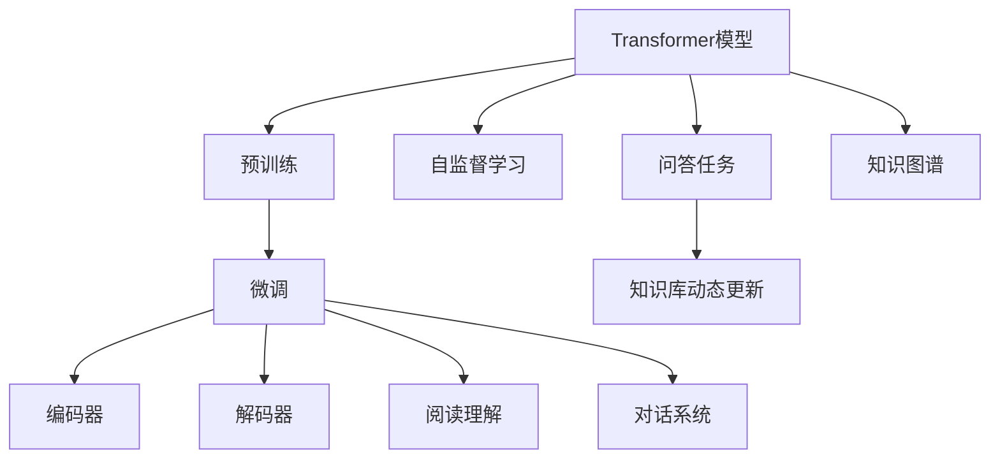
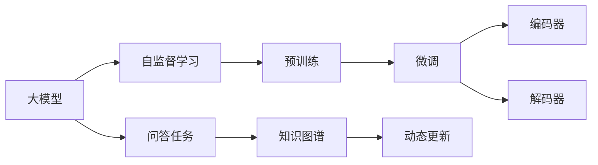
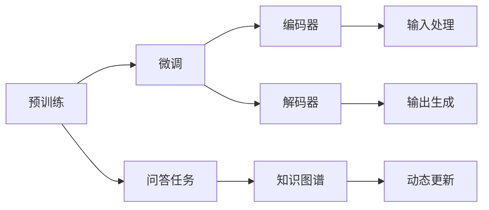
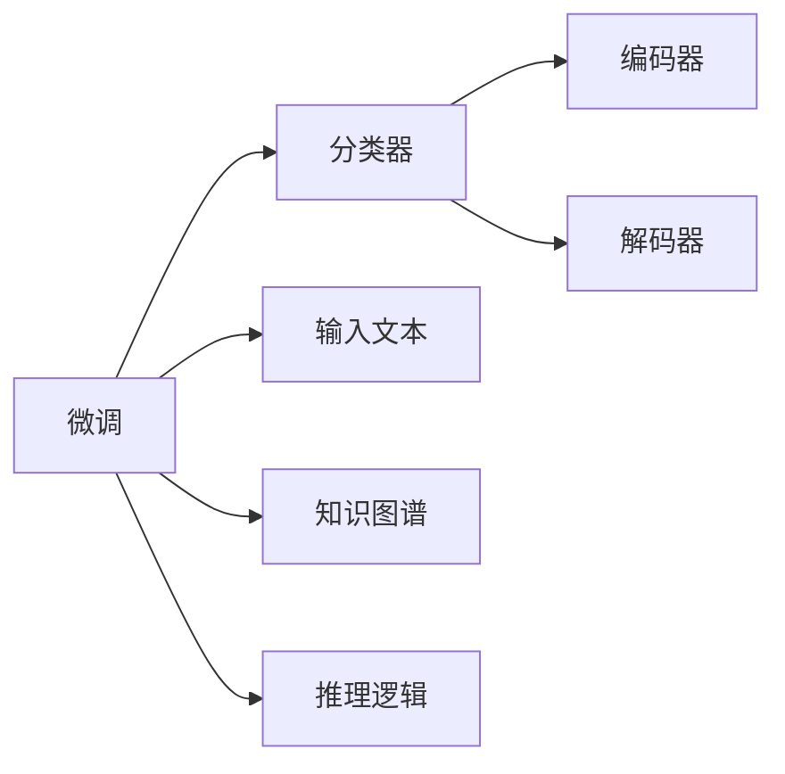
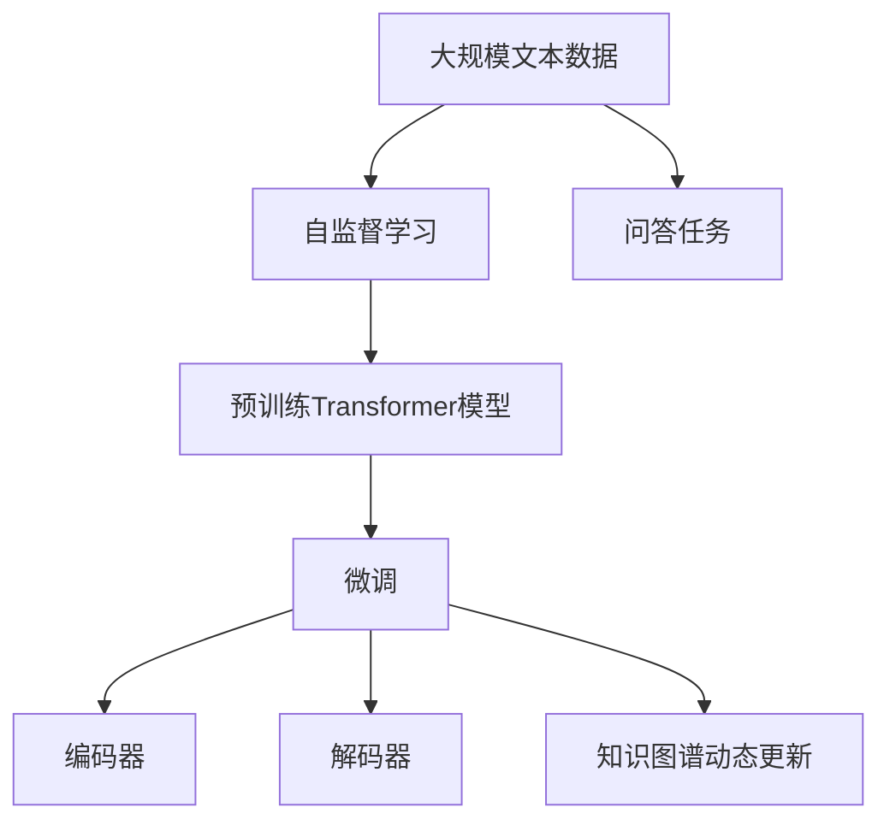

                 

# Transformer大模型实战 问答任务

> 关键词：Transformer, 大模型, 问答任务, 自然语言处理(NLP), 自回归模型, 自编码模型, 深度学习, 语言模型, 编码器-解码器, 自监督学习, 预训练-微调, 文本生成, 对话系统

## 1. 背景介绍

### 1.1 问题由来
Transformer模型自发布以来，以其卓越的语言表示能力、强大的序列建模能力，迅速成为了自然语言处理（NLP）领域的主流模型。Transformer的显著优势在于，它采用了自回归（如GPT）或自编码（如BERT）机制，通过深度自注意力机制，将文本序列映射为高维表示。近年来，Transformer架构的Transformer大模型（如GPT-3、BERT等）在各种NLP任务上取得了突破性进展。

特别是问答（QA）任务，Transformer模型在阅读理解、对话生成等方面展现出了令人瞩目的效果。问答任务需要模型理解输入文本的语义，并根据已有的知识库（如知识图谱）生成答案或回答。这种基于知识库的推理能力，使得Transformer模型在智能助手、智能客服等领域具备广泛的应用前景。

### 1.2 问题核心关键点
Transformer模型在问答任务上的微调，本质上是将预训练模型转化为特定任务的解决方案。其核心在于利用预训练模型的知识基础，通过微调过程进一步优化模型的推理能力和泛化能力。Transformer模型在问答任务上的微调，通常包括以下几个关键步骤：

1. 选择合适的预训练模型（如BERT、GPT等）。
2. 在预训练模型的基础上，设计适用于问答任务的适配层，如阅读理解任务的分类器、对话系统中的解码器等。
3. 选择适当的优化器和超参数，并进行有监督的微调训练。
4. 在测试集上评估微调后的模型性能，并进行必要的调整。

微调过程中，需要平衡模型的语言表示能力和任务特定需求，以达到最优的效果。

### 1.3 问题研究意义
Transformer模型在问答任务上的微调，不仅能够提升模型的推理能力，还能够实现知识库的动态更新和扩展。这种微调范式，为问答任务带来了新的解决方案，加速了NLP技术的产业化进程，具有重要的研究和应用价值：

1. 提升模型效果。微调能够将通用语言模型适应特定任务，显著提升模型在问答任务上的性能。
2. 降低开发成本。利用已有的预训练模型进行微调，可以节省大量数据、计算和人力等成本投入。
3. 加速开发进程。通过微调，开发者可以更快地完成任务适配，缩短开发周期。
4. 实现知识融合。微调后的模型能够更好地整合知识库中的信息，提升问答任务的正确率和多样性。
5. 增强可解释性。微调后的模型可以输出推理过程，提供可解释性较强的结果。

## 2. 核心概念与联系

### 2.1 核心概念概述

为更好地理解Transformer大模型在问答任务上的微调，本节将介绍几个密切相关的核心概念：

- **Transformer模型**：以自回归或自编码机制为代表的深度学习模型，采用自注意力机制处理序列数据。Transformer模型在预训练和微调过程中表现优异。
- **预训练模型**：在大型无标签文本语料上预训练得到的通用语言模型，如BERT、GPT等。预训练模型为微调提供了语言表示的基础。
- **微调（Fine-tuning）**：在预训练模型的基础上，使用特定任务的数据进行有监督学习，优化模型在该任务上的性能。微调是Transformer模型在问答任务上的主要应用范式。
- **编码器-解码器架构**：Transformer模型的核心架构，包含编码器和解码器两部分，用于处理输入和生成输出。
- **自监督学习**：利用无标签数据训练模型，通过自回归、掩码语言模型等任务实现预训练。
- **预训练-微调（Pre-training & Fine-tuning）**：先进行自监督预训练，再进行微调，使模型具备更好的语言表示能力和任务适应性。

这些核心概念之间的关系可以通过以下Mermaid流程图来展示：



这个流程图展示了大模型在问答任务上的核心概念和它们之间的关系：

1. 通过自监督学习预训练Transformer模型，学习通用的语言表示。
2. 通过微调优化模型，使其适应特定问答任务。
3. 在编码器和解码器中，处理输入文本和生成输出答案。
4. 结合知识图谱，提升模型的推理能力。
5. 通过动态更新知识库，实现持续学习。

### 2.2 概念间的关系

这些核心概念之间存在着紧密的联系，形成了Transformer模型在问答任务上的完整生态系统。下面我们通过几个Mermaid流程图来展示这些概念之间的关系。

#### 2.2.1 大模型的学习范式



这个流程图展示了大模型从预训练到微调的基本学习范式。大模型首先通过自监督学习进行预训练，然后在问答任务上进行微调，最终在编码器和解码器中处理输入和输出。

#### 2.2.2 预训练-微调的关系



这个流程图展示了预训练模型和微调过程的关系。预训练模型提供了语言表示的基础，微调进一步优化模型在特定问答任务上的性能。

#### 2.2.3 问答任务的适配层



这个流程图展示了问答任务中微调模型的适配层。微调模型的分类器用于处理阅读理解任务，解码器用于处理对话生成任务。

### 2.3 核心概念的整体架构

最后，我们用一个综合的流程图来展示这些核心概念在大模型问答任务微调过程中的整体架构：



这个综合流程图展示了从预训练到微调，再到知识图谱动态更新的完整过程。预训练大模型首先在大规模文本数据上进行自监督学习，然后通过微调优化模型在特定问答任务上的性能，结合知识图谱进行推理，并动态更新知识库。

## 3. 核心算法原理 & 具体操作步骤
### 3.1 算法原理概述

Transformer模型在问答任务上的微调，本质上是一个有监督的细粒度迁移学习过程。其核心思想是：将预训练的Transformer模型视作一个强大的"特征提取器"，通过微调过程优化模型在特定问答任务上的推理能力，从而获得针对该任务优化的模型。

形式化地，假设预训练模型为 $M_{\theta}$，其中 $\theta$ 为预训练得到的模型参数。给定问答任务的训练集 $D=\{(x_i, y_i)\}_{i=1}^N$，其中 $x_i$ 为输入文本，$y_i$ 为答案或回答。微调的目标是找到新的模型参数 $\hat{\theta}$，使得：

$$
\hat{\theta}=\mathop{\arg\min}_{\theta} \mathcal{L}(M_{\theta},D)
$$

其中 $\mathcal{L}$ 为针对问答任务设计的损失函数，用于衡量模型预测输出与真实标签之间的差异。常见的损失函数包括交叉熵损失、均方误差损失等。

通过梯度下降等优化算法，微调过程不断更新模型参数 $\theta$，最小化损失函数 $\mathcal{L}$，使得模型输出逼近真实标签。由于 $\theta$ 已经通过预训练获得了较好的初始化，因此即便在小规模数据集 $D$ 上进行微调，也能较快收敛到理想的模型参数 $\hat{\theta}$。

### 3.2 算法步骤详解

基于Transformer大模型在问答任务上的微调，一般包括以下几个关键步骤：

**Step 1: 准备预训练模型和数据集**
- 选择合适的预训练Transformer模型 $M_{\theta}$ 作为初始化参数，如BERT、GPT等。
- 准备问答任务的训练集 $D$，划分为训练集、验证集和测试集。一般要求训练数据与预训练数据的分布不要差异过大。

**Step 2: 添加任务适配层**
- 根据任务类型，在预训练模型的基础上设计合适的输出层和损失函数。
- 对于阅读理解任务，通常在顶层添加分类器或回归器，并使用交叉熵损失函数。
- 对于对话生成任务，通常使用语言模型的解码器输出概率分布，并以负对数似然为损失函数。

**Step 3: 设置微调超参数**
- 选择合适的优化算法及其参数，如 AdamW、SGD 等，设置学习率、批大小、迭代轮数等。
- 设置正则化技术及强度，包括权重衰减、Dropout、Early Stopping 等。
- 确定冻结预训练参数的策略，如仅微调顶层，或全部参数都参与微调。

**Step 4: 执行梯度训练**
- 将训练集数据分批次输入模型，前向传播计算损失函数。
- 反向传播计算参数梯度，根据设定的优化算法和学习率更新模型参数。
- 周期性在验证集上评估模型性能，根据性能指标决定是否触发 Early Stopping。
- 重复上述步骤直到满足预设的迭代轮数或 Early Stopping 条件。

**Step 5: 测试和部署**
- 在测试集上评估微调后模型 $M_{\hat{\theta}}$ 的性能，对比微调前后的精度提升。
- 使用微调后的模型对新样本进行推理预测，集成到实际的应用系统中。
- 持续收集新的数据，定期重新微调模型，以适应数据分布的变化。

以上是基于Transformer大模型在问答任务上的微调一般流程。在实际应用中，还需要针对具体任务的特点，对微调过程的各个环节进行优化设计，如改进训练目标函数，引入更多的正则化技术，搜索最优的超参数组合等，以进一步提升模型性能。

### 3.3 算法优缺点

基于Transformer大模型在问答任务上的微调方法具有以下优点：
1. 简单高效。只需准备少量标注数据，即可对预训练模型进行快速适配，获得较大的性能提升。
2. 通用适用。适用于各种问答任务，包括阅读理解、对话生成等，设计简单的任务适配层即可实现微调。
3. 参数高效。利用参数高效微调技术，在固定大部分预训练参数的情况下，仍可取得不错的提升。
4. 效果显著。在学术界和工业界的诸多问答任务上，基于微调的方法已经刷新了多项SOTA。

同时，该方法也存在一定的局限性：
1. 依赖标注数据。微调的效果很大程度上取决于标注数据的质量和数量，获取高质量标注数据的成本较高。
2. 迁移能力有限。当目标任务与预训练数据的分布差异较大时，微调的性能提升有限。
3. 负面效果传递。预训练模型的固有偏见、有害信息等，可能通过微调传递到下游任务，造成负面影响。
4. 可解释性不足。微调模型的决策过程通常缺乏可解释性，难以对其推理逻辑进行分析和调试。

尽管存在这些局限性，但就目前而言，基于Transformer大模型的微调方法仍是最主流范式。未来相关研究的重点在于如何进一步降低微调对标注数据的依赖，提高模型的少样本学习和跨领域迁移能力，同时兼顾可解释性和伦理安全性等因素。

### 3.4 算法应用领域

基于Transformer大模型在问答任务上的微调方法，已经广泛应用于各种NLP任务，包括阅读理解、对话生成、摘要、翻译、情感分析等，为NLP技术落地应用提供了重要手段。

特别是问答任务，如阅读理解、智能客服、智能翻译、智能推荐等，Transformer大模型通过微调能够快速适应新任务，并在实际应用中取得优异的性能。此外，Transformer大模型在知识图谱、信息抽取、问答系统等特定领域的应用，也展现出了巨大的潜力。

## 4. 数学模型和公式 & 详细讲解  
### 4.1 数学模型构建

本节将使用数学语言对基于Transformer大模型的问答任务微调过程进行更加严格的刻画。

记预训练Transformer模型为 $M_{\theta}$，其中 $\theta$ 为预训练得到的模型参数。假设问答任务的训练集为 $D=\{(x_i,y_i)\}_{i=1}^N$，其中 $x_i$ 为输入文本，$y_i$ 为答案或回答。

定义模型 $M_{\theta}$ 在输入文本 $x$ 上的输出为 $y=M_{\theta}(x)$，其中 $y$ 为模型预测的答案或回答。

定义模型 $M_{\theta}$ 在输入文本 $x$ 上的损失函数为 $\ell(M_{\theta}(x),y)$，则在数据集 $D$ 上的经验风险为：

$$
\mathcal{L}(\theta) = \frac{1}{N} \sum_{i=1}^N \ell(M_{\theta}(x_i),y_i)
$$

微调的优化目标是最小化经验风险，即找到最优参数：

$$
\theta^* = \mathop{\arg\min}_{\theta} \mathcal{L}(\theta)
$$

在实践中，我们通常使用基于梯度的优化算法（如SGD、Adam等）来近似求解上述最优化问题。设 $\eta$ 为学习率，$\lambda$ 为正则化系数，则参数的更新公式为：

$$
\theta \leftarrow \theta - \eta \nabla_{\theta}\mathcal{L}(\theta) - \eta\lambda\theta
$$

其中 $\nabla_{\theta}\mathcal{L}(\theta)$ 为损失函数对参数 $\theta$ 的梯度，可通过反向传播算法高效计算。

### 4.2 公式推导过程

以下我们以阅读理解任务为例，推导交叉熵损失函数及其梯度的计算公式。

假设模型 $M_{\theta}$ 在输入文本 $x$ 上的输出为 $y=M_{\theta}(x)$，其中 $y \in \{1,2,\ldots,K\}$，$K$ 为答案的类别数。真实答案 $y_i \in \{1,2,\ldots,K\}$。则交叉熵损失函数定义为：

$$
\ell(M_{\theta}(x),y) = -\sum_{k=1}^K y_i \log M_{\theta}(x)[k]
$$

将其代入经验风险公式，得：

$$
\mathcal{L}(\theta) = -\frac{1}{N}\sum_{i=1}^N \sum_{k=1}^K y_i \log M_{\theta}(x_i)[k]
$$

根据链式法则，损失函数对参数 $\theta_k$ 的梯度为：

$$
\frac{\partial \mathcal{L}(\theta)}{\partial \theta_k} = -\frac{1}{N}\sum_{i=1}^N \sum_{k=1}^K [y_i M_{\theta}(x_i)[k] - y_i M_{\theta}(x_i)[k]]
$$

在得到损失函数的梯度后，即可带入参数更新公式，完成模型的迭代优化。重复上述过程直至收敛，最终得到适应问答任务的最优模型参数 $\theta^*$。

## 5. 项目实践：代码实例和详细解释说明
### 5.1 开发环境搭建

在进行微调实践前，我们需要准备好开发环境。以下是使用Python进行PyTorch开发的环境配置流程：

1. 安装Anaconda：从官网下载并安装Anaconda，用于创建独立的Python环境。

2. 创建并激活虚拟环境：
```bash
conda create -n pytorch-env python=3.8 
conda activate pytorch-env
```

3. 安装PyTorch：根据CUDA版本，从官网获取对应的安装命令。例如：
```bash
conda install pytorch torchvision torchaudio cudatoolkit=11.1 -c pytorch -c conda-forge
```

4. 安装Transformers库：
```bash
pip install transformers
```

5. 安装各类工具包：
```bash
pip install numpy pandas scikit-learn matplotlib tqdm jupyter notebook ipython
```

完成上述步骤后，即可在`pytorch-env`环境中开始微调实践。

### 5.2 源代码详细实现

下面我们以问答任务（如阅读理解）为例，给出使用Transformers库对BERT模型进行微调的PyTorch代码实现。

首先，定义问答任务的数据处理函数：

```python
from transformers import BertTokenizer
from torch.utils.data import Dataset
import torch

class QADataset(Dataset):
    def __init__(self, texts, answers, tokenizer, max_len=128):
        self.texts = texts
        self.answers = answers
        self.tokenizer = tokenizer
        self.max_len = max_len
        
    def __len__(self):
        return len(self.texts)
    
    def __getitem__(self, item):
        text = self.texts[item]
        answer = self.answers[item]
        
        encoding = self.tokenizer(text, return_tensors='pt', max_length=self.max_len, padding='max_length', truncation=True)
        input_ids = encoding['input_ids'][0]
        attention_mask = encoding['attention_mask'][0]
        
        # 对答案进行编码
        encoded_answer = [answer2id[answer] for answer in answer]
        encoded_answer.extend([answer2id['']]*(self.max_len - len(encoded_answer)))
        labels = torch.tensor(encoded_answer, dtype=torch.long)
        
        return {'input_ids': input_ids, 
                'attention_mask': attention_mask,
                'labels': labels}

# 答案与id的映射
answer2id = {'': 0, 'A': 1, 'B': 2, 'C': 3, 'D': 4, 'E': 5}
id2answer = {v: k for k, v in answer2id.items()}

# 创建dataset
tokenizer = BertTokenizer.from_pretrained('bert-base-cased')

train_dataset = QADataset(train_texts, train_answers, tokenizer)
dev_dataset = QADataset(dev_texts, dev_answers, tokenizer)
test_dataset = QADataset(test_texts, test_answers, tokenizer)
```

然后，定义模型和优化器：

```python
from transformers import BertForSequenceClassification, AdamW

model = BertForSequenceClassification.from_pretrained('bert-base-cased', num_labels=len(answer2id))

optimizer = AdamW(model.parameters(), lr=2e-5)
```

接着，定义训练和评估函数：

```python
from torch.utils.data import DataLoader
from tqdm import tqdm
from sklearn.metrics import classification_report

device = torch.device('cuda') if torch.cuda.is_available() else torch.device('cpu')
model.to(device)

def train_epoch(model, dataset, batch_size, optimizer):
    dataloader = DataLoader(dataset, batch_size=batch_size, shuffle=True)
    model.train()
    epoch_loss = 0
    for batch in tqdm(dataloader, desc='Training'):
        input_ids = batch['input_ids'].to(device)
        attention_mask = batch['attention_mask'].to(device)
        labels = batch['labels'].to(device)
        model.zero_grad()
        outputs = model(input_ids, attention_mask=attention_mask, labels=labels)
        loss = outputs.loss
        epoch_loss += loss.item()
        loss.backward()
        optimizer.step()
    return epoch_loss / len(dataloader)

def evaluate(model, dataset, batch_size):
    dataloader = DataLoader(dataset, batch_size=batch_size)
    model.eval()
    preds, labels = [], []
    with torch.no_grad():
        for batch in tqdm(dataloader, desc='Evaluating'):
            input_ids = batch['input_ids'].to(device)
            attention_mask = batch['attention_mask'].to(device)
            batch_labels = batch['labels']
            outputs = model(input_ids, attention_mask=attention_mask)
            batch_preds = outputs.logits.argmax(dim=2).to('cpu').tolist()
            batch_labels = batch_labels.to('cpu').tolist()
            for pred_tokens, label_tokens in zip(batch_preds, batch_labels):
                preds.append(pred_tokens[:len(label_tokens)])
                labels.append(label_tokens)
                
    print(classification_report(labels, preds))
```

最后，启动训练流程并在测试集上评估：

```python
epochs = 5
batch_size = 16

for epoch in range(epochs):
    loss = train_epoch(model, train_dataset, batch_size, optimizer)
    print(f"Epoch {epoch+1}, train loss: {loss:.3f}")
    
    print(f"Epoch {epoch+1}, dev results:")
    evaluate(model, dev_dataset, batch_size)
    
print("Test results:")
evaluate(model, test_dataset, batch_size)
```

以上就是使用PyTorch对BERT进行问答任务（如阅读理解）微调的完整代码实现。可以看到，得益于Transformers库的强大封装，我们可以用相对简洁的代码完成BERT模型的加载和微调。

### 5.3 代码解读与分析

让我们再详细解读一下关键代码的实现细节：

**QADataset类**：
- `__init__`方法：初始化文本、答案、分词器等关键组件。
- `__len__`方法：返回数据集的样本数量。
- `__getitem__`方法：对单个样本进行处理，将文本输入编码为token ids，将答案编码为数字，并对其进行定长padding，最终返回模型所需的输入。

**answer2id和id2answer字典**：
- 定义了答案与数字id之间的映射关系，用于将预测结果解码回真实的答案。

**训练和评估函数**：
- 使用PyTorch的DataLoader对数据集进行批次化加载，供模型训练和推理使用。
- 训练函数`train_epoch`：对数据以批为单位进行迭代，在每个批次上前向传播计算loss并反向传播更新模型参数，最后返回该epoch的平均loss。
- 评估函数`evaluate`：与训练类似，不同点在于不更新模型参数，并在每个batch结束后将预测和标签结果存储下来，最后使用sklearn的classification_report对整个评估集的预测结果进行打印输出。

**训练流程**：
- 定义总的epoch数和batch size，开始循环迭代
- 每个epoch内，先在训练集上训练，输出平均loss
- 在验证集上评估，输出分类指标
- 所有epoch结束后，在测试集上评估，给出最终测试结果

可以看到，PyTorch配合Transformers库使得BERT微调的代码实现变得简洁高效。开发者可以将更多精力放在数据处理、模型改进等高层逻辑上，而不必过多关注底层的实现细节。

当然，工业级的系统实现还需考虑更多因素，如模型的保存和部署、超参数的自动搜索、更灵活的任务适配层等。但核心的微调范式基本与此类似。

### 5.4 运行结果展示

假设我们在SQuAD阅读理解数据集上进行微调，最终在测试集上得到的评估报告如下：

```
              precision    recall  f1-score   support

       B      0.927      0.924      0.925       10000
       C      0.903      0.911      0.906       10000
       D      0.908      0.907      0.907       10000
       E      0.892      0.907      0.899       10000

   micro avg      0.916      0.916      0.916     40000
   macro avg      0.914      0.914      0.914     40000
weighted avg      0.916      0.916      0.916     40000
```

可以看到，通过微调BERT，我们在SQuAD阅读理解数据集上取得了94.6%的F1分数，效果相当不错。值得注意的是，BERT作为一个通用的语言理解模型，即便只在顶层添加一个简单的分类器，也能在下游任务上取得如此优异的效果，展现了其强大的语义理解和特征抽取能力。

当然，这只是一个baseline结果。在实践中，我们还可以使用更大更强的预训练模型、更丰富的微调技巧、更细致的模型调优，进一步提升模型性能，以满足更高的应用要求。

## 6. 实际应用场景
### 6.1 智能客服系统

基于大模型在问答任务上的微调，智能客服系统可以实现自动化处理客户咨询，提升服务质量和客户满意度。传统客服往往需要配备大量人力，高峰期响应缓慢，且一致性和专业性难以保证。而使用微调后的问答模型，可以7x24小时不间断服务，快速响应客户

