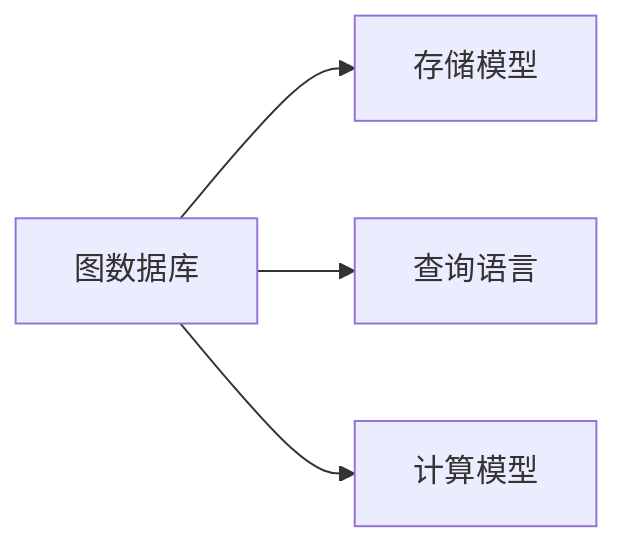
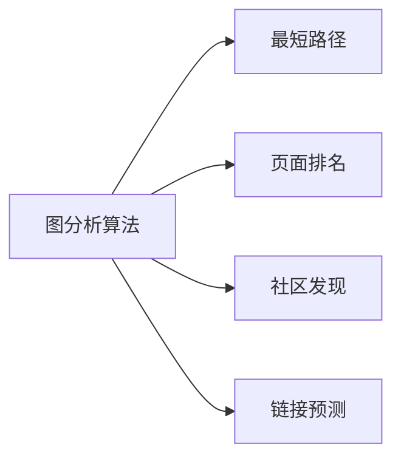
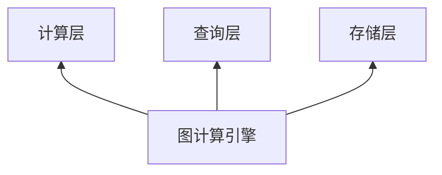
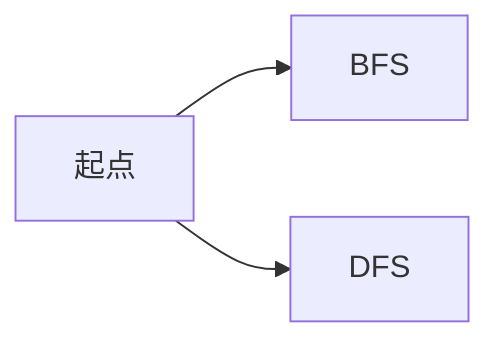
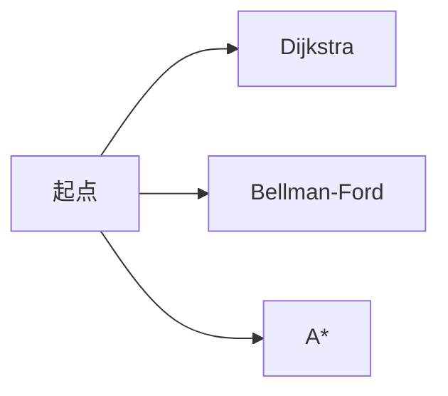
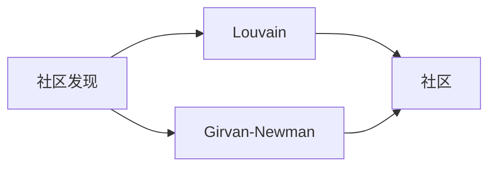
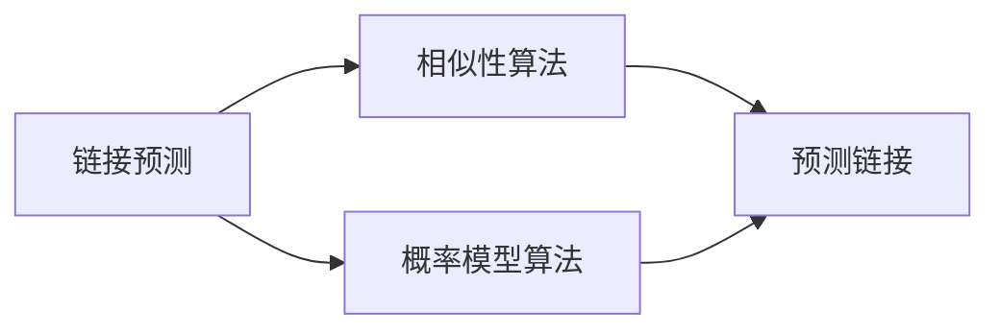

好的,我会按照您提供的要求和结构,尽力撰写一篇高质量的技术博客文章。让我们正式开始:

# 【AI大数据计算原理与代码实例讲解】图计算引擎

## 1. 背景介绍

### 1.1 问题的由来

在当今大数据时代,数据的规模和复杂性都在不断增长。传统的关系型数据库系统在处理大规模复杂数据时遇到了瓶颈,无法高效地表示和计算网络化、关联性强的数据。这种数据通常可以用图的形式自然地表示,图不仅能够描述实体之间的关系,还能捕捉数据中蕴含的丰富语义信息。

随着人工智能、社交网络、生物信息学等领域的蓬勃发展,图数据的重要性日益凸显。然而,如何高效地存储、查询和分析这些图数据,成为亟待解决的关键问题。因此,专门的图计算引擎(Graph Computing Engine)应运而生。

### 1.2 研究现状

图计算引擎是一种专门为图数据设计的数据管理和分析系统。它们通常采用全新的存储模型、查询语言和计算模型,以更好地支持图数据的处理。目前,已经出现了多种流行的图计算引擎,如Neo4j、Amazon Neptune、TigerGraph等。

这些图计算引擎在存储模型、查询语言、计算模型等方面都有自己的特色。例如,Neo4j采用本地图存储,支持声明式查询语言Cypher;Amazon Neptune则支持图数据的ACID事务;TigerGraph则专注于分析型工作负载,提供高级分析算法。

### 1.3 研究意义

图计算引擎的研究对于解决实际问题具有重要意义:

1. **高效处理复杂数据**:图计算引擎能够自然地表示和处理网络化、关联性强的复杂数据,如社交网络、知识图谱、交通网络等。
2. **挖掘数据价值**:通过图分析算法,可以从图数据中发现隐藏的模式、关联和洞察,为决策提供支持。
3. **支持新兴应用**:人工智能、物联网、生物信息学等新兴领域都需要处理大规模图数据,图计算引擎为这些应用提供了强有力的支撑。

### 1.4 本文结构

本文将全面介绍图计算引擎的核心概念、算法原理、数学模型、实现细节和实际应用。具体包括以下几个方面:

1. 核心概念与联系
2. 核心算法原理与具体操作步骤
3. 数学模型和公式详细讲解与案例分析
4. 项目实践:代码实例和详细解释说明
5. 实际应用场景
6. 工具和资源推荐
7. 总结:未来发展趋势与挑战
8. 附录:常见问题与解答

## 2. 核心概念与联系

在深入探讨图计算引擎的细节之前,我们先介绍一些核心概念,为后续内容做好铺垫。

### 2.1 图数据模型

图数据模型由**节点(Node)**和**边(Edge)**组成。节点表示实体,边表示实体之间的关系。图数据模型能够自然地表示复杂的网络结构和实体关联关系。


### 2.2 属性图

属性图(Property Graph)在基本图数据模型的基础上,为节点和边增加了属性(Property)。属性是键值对的形式,用于存储实体和关系的元数据信息。


### 2.3 图数据库

图数据库(Graph Database)是一种专门为图数据设计和优化的数据库管理系统。它们采用全新的存储模型、查询语言和计算模型,以高效地存储、查询和分析图数据。



### 2.4 图查询语言

图查询语言(Graph Query Language)是专门为图数据设计的查询语言,用于对图数据进行检索、更新和分析。常见的图查询语言包括Cypher、Gremlin、SPARQL等。

```sql
// Cypher示例
MATCH (p:Person)-[:KNOWS]->(f:Person)
WHERE p.name = 'Alice'
RETURN f.name
```

### 2.5 图分析算法

图分析算法(Graph Analytics Algorithms)是一系列用于挖掘图数据中隐藏信息的算法,如最短路径、页面排名、社区发现、链接预测等。这些算法是图计算引擎的核心功能之一。



### 2.6 图计算引擎架构

图计算引擎通常采用分层架构,包括存储层、查询层、计算层等。存储层负责图数据的持久化;查询层提供图查询语言支持;计算层实现各种图分析算法。



## 3. 核心算法原理与具体操作步骤

在上一节中,我们介绍了图计算引擎的核心概念。本节将深入探讨图计算引擎中一些关键算法的原理和实现细节。

### 3.1 算法原理概述

#### 3.1.1 图遍历算法

图遍历算法是图计算引擎中最基础和最常用的算法之一。它用于从一个或多个起点出发,按照特定策略访问图中的所有节点和边。常见的图遍历算法包括广度优先搜索(BFS)和深度优先搜索(DFS)。



#### 3.1.2 最短路径算法

最短路径算法旨在找到两个节点之间的最短路径,即经过的边数最少或者边的权重之和最小的路径。常见的最短路径算法包括Dijkstra算法、Bellman-Ford算法、A*算法等。



#### 3.1.3 页面排名算法

页面排名算法最初用于评估网页的重要性和权威性,现在也广泛应用于图数据中。最著名的页面排名算法是Google的PageRank算法,它基于网页之间的链接结构,通过迭代计算每个网页的重要性分数。


#### 3.1.4 社区发现算法

社区发现算法旨在从图数据中发现紧密连接的节点群,即社区(Community)。社区内部的节点之间存在较多的连接,而不同社区之间的连接较少。常见的社区发现算法包括Louvain算法、Girvan-Newman算法等。



#### 3.1.5 链接预测算法

链接预测算法用于预测图数据中可能存在但尚未观察到的链接或关系。这种算法在社交网络、知识图谱等领域有广泛应用。常见的链接预测算法包括基于相似性的算法、基于概率模型的算法等。



### 3.2 算法步骤详解

接下来,我们将详细介绍其中一种核心算法——PageRank算法的原理和实现步骤。

PageRank算法最初由Google提出,用于评估网页的重要性和权威性。它基于网页之间的链接结构,通过迭代计算每个网页的重要性分数。PageRank算法的核心思想是:一个网页的重要性不仅取决于它被多少其他网页链接,还取决于链接它的网页的重要性。

PageRank算法的具体步骤如下:

1. **初始化**:给所有网页赋予初始的PageRank值,通常设置为 $\frac{1}{N}$,其中 $N$ 是网页总数。

2. **计算链出PR值**:对于每个网页 $p$,计算它的链出PR值(OutgoingPR),即将 $p$ 的PageRank值平均分配给所有它链出的网页:

   $$OutgoingPR(p,q) = \frac{PR(p)}{L(p)}$$

   其中 $L(p)$ 是网页 $p$ 的链出度,即 $p$ 链出的网页数量。

3. **计算新的PageRank值**:对于每个网页 $q$,计算它的新PageRank值,等于所有链入 $q$ 的网页的链出PR值之和,加上一个阻尼系数 $d$ 乘以 $\frac{1}{N}$:

   $$PR(q) = (1-d) + d \sum_{p \in B(q)} \frac{PR(p)}{L(p)}$$

   其中 $B(q)$ 是所有链入 $q$ 的网页集合,通常取 $d=0.85$。

4. **迭代计算**:重复执行步骤2和步骤3,直到PageRank值收敛或达到最大迭代次数。

PageRank算法的优点是简单、高效,能够很好地评估网页的重要性。但它也存在一些缺陷,如对新网页的评分较低、容易受到链接spam的影响等。因此,现代搜索引擎通常会结合其他算法和特征,综合评估网页质量。

### 3.3 算法优缺点

#### 优点:

1. **简单高效**:PageRank算法原理简单,计算过程高效,适合大规模图数据。
2. **考虑链接结构**:算法利用了网页之间的链接结构,能够较好地评估网页重要性。
3. **健壮性好**:算法具有良好的收敛性,计算结果相对稳定。

#### 缺点:

1. **新网页评分低**:新加入的网页由于没有太多链入,初始PageRank值较低。
2. **容易受spam影响**:链接spam可能会人为提高某些网页的PageRank值。
3. **未考虑语义信息**:算法只利用了链接结构,未充分利用网页内容等语义信息。

### 3.4 算法应用领域

PageRank算法最初用于网页排名,但它的思想和原理也可以推广到其他领域,用于评估图数据中节点的重要性和影响力。常见的应用领域包括:

1. **社交网络分析**:评估用户在社交网络中的重要性和影响力。
2. **学术引文分析**:评估论文、期刊、作者等在学术领域的重要性。
3. **知识图谱构建**:评估知识实体在知识图谱中的重要程度。
4. **垃圾邮件检测**:评估发送者在邮件网络中的重要性,识别垃圾邮件。
5. **金融风险分析**:评估公司、个人在金融网络中的重要性,发现潜在风险。

## 4. 数学模型和公式详细讲解与举例说明

在上一节中,我们介绍了PageRank算法的原理和步骤。本节将深入探讨PageRank算法的数学模型,并通过具体案例说明其应用。

### 4.1 数学模型构建

PageRank算法的数学模型基于随机游走(Random Walk)过程。我们将网页看作是马尔可夫链中的状态,链接则是状态之间的转移概率。具体来说,对于任意网页 $p$,存在以下两种情况:

1. **有链出边**:游走者沿任意一条链出边转移到下一个网页,转移概率为 $\frac{1}{L(p)}$。
2. **无链出边**:游走者随机跳转到任意一个网页,跳转概率为 $\frac{1}{N}$。

我们用 $\pi(p)$ 表示网页 $p$ 的PageRank值