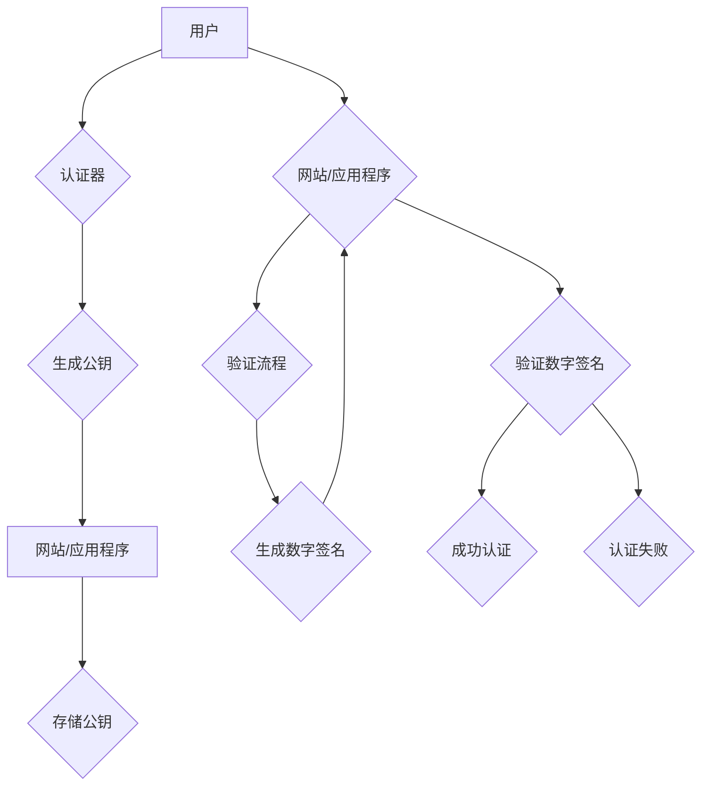

## WebAuthn：符合 FIDO 安全标准

> 关键词：WebAuthn, FIDO, 密码认证, 生物识别, 安全协议,  Web应用,  用户体验

## 1. 背景介绍

随着互联网的蓬勃发展，用户在网络上的活动日益频繁，数据安全问题也日益突出。传统的密码认证方式存在着诸多安全隐患，例如密码泄露、钓鱼攻击等。为了解决这些问题，FIDO（Fast IDentity Online）联盟提出了基于WebAuthn（Web Authentication）的安全认证标准，旨在提供更安全、更便捷的用户身份验证体验。

WebAuthn 是一种基于 Web 平台的强认证标准，它利用硬件安全模块（如指纹传感器、面部识别器等）来生成和验证用户身份信息，从而提高了认证的安全性。WebAuthn 标准由 W3C（世界广域网联盟）制定，并得到了广泛的行业支持，包括 Google、Microsoft、Apple 等科技巨头。

## 2. 核心概念与联系

WebAuthn 是一种基于公共密钥密码学的身份验证协议，它利用了用户的设备作为安全凭证，从而实现更安全的认证。

**核心概念：**

* **公共密钥密码学：** WebAuthn 基于公钥加密和数字签名技术，用户拥有一个私钥和一个公钥对。私钥用于生成数字签名，公钥用于验证数字签名。
* **认证器：** 认证器是用户设备上的硬件安全模块，例如指纹传感器、面部识别器等。它负责生成和存储用户的私钥，并进行身份验证操作。
* **注册流程：** 用户在首次访问网站或应用程序时，需要进行注册流程。在这个过程中，用户会使用认证器生成一个公钥，并将其发送给网站或应用程序。网站或应用程序会将用户的公钥存储在数据库中。
* **验证流程：** 当用户再次访问网站或应用程序时，需要进行验证流程。用户会使用认证器进行身份验证，并生成一个数字签名。网站或应用程序会使用用户的公钥验证数字签名，从而确认用户的身份。

**架构流程图：**



## 3. 核心算法原理 & 具体操作步骤

### 3.1  算法原理概述

WebAuthn 协议基于椭圆曲线密码学（ECC）算法，它是一种高效的公钥密码学算法，能够在有限的资源下提供高安全性。WebAuthn 协议使用 ECC 算法生成用户私钥和公钥对，并利用数字签名技术进行身份验证。

### 3.2  算法步骤详解

1. **注册流程：**
    * 用户使用认证器生成一个新的 ECC 私钥和公钥对。
    * 认证器将公钥转换为一个称为“Credential”的证书，并将其发送给网站或应用程序。
    * 网站或应用程序将用户的“Credential”存储在数据库中。

2. **验证流程：**
    * 用户在访问网站或应用程序时，需要使用认证器进行身份验证。
    * 认证器使用用户的私钥生成一个数字签名，并将其发送给网站或应用程序。
    * 网站或应用程序使用用户的公钥验证数字签名，如果签名有效，则确认用户的身份。

### 3.3  算法优缺点

**优点：**

* **安全性高：** 基于 ECC 算法，提供高安全性。
* **用户体验好：** 使用硬件安全模块进行身份验证，无需记忆密码。
* **可扩展性强：** 支持多种认证方式，例如指纹识别、面部识别等。

**缺点：**

* **部署成本较高：** 需要对网站或应用程序进行修改，并支持硬件安全模块。
* **兼容性问题：** 不同设备和浏览器对 WebAuthn 的支持程度不同。

### 3.4  算法应用领域

WebAuthn 协议广泛应用于各种领域，例如：

* **金融服务：** 在线银行、支付平台等。
* **社交媒体：** 用户登录、账户安全等。
* **企业内部网络：** 用户身份验证、访问控制等。
* **物联网设备：** 设备身份验证、数据安全等。

## 4. 数学模型和公式 & 详细讲解 & 举例说明

### 4.1  数学模型构建

WebAuthn 协议基于椭圆曲线密码学（ECC）算法，它使用椭圆曲线上的点加法和标量乘法运算来生成私钥和公钥对。

**椭圆曲线方程：**

$$y^2 = x^3 + ax + b$$

其中，a 和 b 是椭圆曲线上两个常数。

**点加法：**

给定椭圆曲线上的两个点 P 和 Q，它们的点加法运算结果为 R，可以表示为：

$$R = P + Q$$

**标量乘法：**

给定椭圆曲线上的点 P 和一个整数 k，它们的标量乘法运算结果为 Q，可以表示为：

$$Q = kP$$

### 4.2  公式推导过程

WebAuthn 协议使用椭圆曲线上的点加法和标量乘法运算来生成私钥和公钥对。

**私钥生成：**

1. 随机选择一个整数 k，作为用户的私钥。
2. 计算公钥 P = kG，其中 G 是椭圆曲线上一个基点。

**公钥验证：**

1. 用户使用私钥 k 和基点 G 生成数字签名。
2. 网站或应用程序使用用户的公钥 P 验证数字签名。

### 4.3  案例分析与讲解

假设用户 Alice 使用 WebAuthn 协议进行身份验证。

1. Alice 使用认证器生成一个私钥 k 和公钥 P。
2. Alice 将公钥 P 发送给网站或应用程序。
3. 当 Alice 再次访问网站或应用程序时，她使用认证器生成一个数字签名，并将其发送给网站或应用程序。
4. 网站或应用程序使用 Alice 的公钥 P 验证数字签名，如果签名有效，则确认 Alice 的身份。

## 5. 项目实践：代码实例和详细解释说明

### 5.1  开发环境搭建

* **操作系统：** Linux、macOS 或 Windows
* **编程语言：** JavaScript
* **浏览器：** 支持 WebAuthn 的浏览器，例如 Chrome、Firefox、Edge 等
* **开发工具：** WebStorm、VS Code 等

### 5.2  源代码详细实现

```javascript
// 注册流程
async function register() {
  const publicKeyCredential = await navigator.credentials.create({
    publicKey: {
      challenge: challenge, // 网站或应用程序生成的挑战值
      name: "Alice", // 用户名称
      displayName: "Alice", // 用户显示名称
      icon: "https://example.com/icon.png", // 用户图标
    },
  });
  // 将用户的“Credential”存储在数据库中
}

// 验证流程
async function authenticate() {
  const publicKeyCredential = await navigator.credentials.get({
    publicKey: {
      challenge: challenge, // 网站或应用程序生成的挑战值
    },
  });
  // 使用用户的公钥验证数字签名
}
```

### 5.3  代码解读与分析

* `navigator.credentials.create()` 方法用于注册用户的 WebAuthn 凭证。
* `navigator.credentials.get()` 方法用于验证用户的 WebAuthn 凭证。
* `challenge` 是网站或应用程序生成的随机挑战值，用于防止 replay 攻击。
* `publicKeyCredential` 是用户的 WebAuthn 凭证对象，包含用户的私钥和公钥信息。

### 5.4  运行结果展示

当用户成功注册 WebAuthn 凭证后，他们可以在访问网站或应用程序时使用指纹识别、面部识别等方式进行身份验证。

## 6. 实际应用场景

WebAuthn 协议已在许多实际应用场景中得到广泛应用，例如：

* **Google Chrome 浏览器：** 支持 WebAuthn 协议，用户可以使用指纹识别或面部识别进行身份验证。
* **Microsoft Azure Active Directory：** 支持 WebAuthn 协议，用户可以使用硬件安全模块进行身份验证。
* **Apple iCloud Keychain：** 支持 WebAuthn 协议，用户可以使用 Touch ID 或 Face ID 进行身份验证。

### 6.4  未来应用展望

WebAuthn 协议的未来应用前景十分广阔，它有望成为未来互联网身份验证的标准。

* **更广泛的设备支持：** 未来，WebAuthn 协议将支持更多类型的设备，例如智能手机、平板电脑、智能手表等。
* **更丰富的认证方式：** 未来，WebAuthn 协议将支持更多类型的认证方式，例如生物识别、行为识别等。
* **更安全的认证体验：** 未来，WebAuthn 协议将不断改进，提供更安全、更便捷的用户身份验证体验。

## 7. 工具和资源推荐

### 7.1  学习资源推荐

* **WebAuthn 规范：** https://www.w3.org/TR/webauthn/
* **FIDO Alliance 网站：** https://fidoalliance.org/
* **WebAuthn 教程：** https://developer.mozilla.org/en-US/docs/Web/API/Web_Authentication_API

### 7.2  开发工具推荐

* **WebStorm：** https://www.jetbrains.com/webstorm/
* **VS Code：** https://code.visualstudio.com/

### 7.3  相关论文推荐

* **Web Authentication：** https://www.w3.org/TR/webauthn/
* **FIDO2：** https://fidoalliance.org/specs/fido-v2.0/fido-v2.0-authentication-protocol-spec-v1.0.pdf

## 8. 总结：未来发展趋势与挑战

### 8.1  研究成果总结

WebAuthn 协议为用户提供了一种更安全、更便捷的身份验证方式，它基于公共密钥密码学算法，并利用硬件安全模块进行身份验证，从而提高了认证的安全性。

### 8.2  未来发展趋势

WebAuthn 协议的未来发展趋势包括：

* **更广泛的设备支持：** 未来，WebAuthn 协议将支持更多类型的设备，例如智能手机、平板电脑、智能手表等。
* **更丰富的认证方式：** 未来，WebAuthn 协议将支持更多类型的认证方式，例如生物识别、行为识别等。
* **更安全的认证体验：** 未来，WebAuthn 协议将不断改进，提供更安全、更便捷的用户身份验证体验。

### 8.3  面临的挑战

WebAuthn 协议也面临着一些挑战，例如：

* **兼容性问题：** 不同设备和浏览器对 WebAuthn 的支持程度不同。
* **部署成本较高：** 需要对网站或应用程序进行修改，并支持硬件安全模块。
* **用户教育问题：** 用户需要了解 WebAuthn 协议的优势和使用方法。

### 8.4  研究展望

未来，研究人员将继续致力于解决 WebAuthn 协议面临的挑战，并推动 WebAuthn 协议的普及和应用。

## 9. 附录：常见问题与解答

* **什么是 WebAuthn？**

WebAuthn 是一种基于 Web 平台的强认证标准，它利用用户的设备作为安全凭证，从而实现更安全的认证。

* **WebAuthn 的优势是什么？**

WebAuthn 协议提供以下优势：

* **安全性高：** 基于 ECC 算法，提供高安全性。
* **用户体验好：** 使用硬件安全模块进行身份验证，无需记忆密码。
* **可扩展性强：** 支持多种认证方式，例如指纹识别、面部识别等。

* **WebAuthn 的应用场景有哪些？**

WebAuthn 协议